# 02 — Exploratory Data Analysis (EDA)

## Quick Reference

| Step | Goal | Key Tools |
|------|------|-----------|
| Shape & types | Understand dataset structure | `df.info()`, `df.dtypes` |
| Missing values | Find and quantify gaps | `df.isnull().sum()` |
| Distributions | Spot skew, outliers, modality | Histogram, boxplots, KDE |
| Correlations | Feature relationships | Heatmap, pairplot, Spearman |
| Target analysis | Understand what you're predicting | Class balance, target distribution |
| Categorical | Cardinality, frequency | Value counts, bar charts |
| Bivariate | Feature vs target relationship | Boxplot by class, scatter, violin |

**Rule:** Never start modeling before EDA. EDA prevents 80% of modeling mistakes.

---


```mermaid
flowchart LR
    data["📊 Raw Dataset"] --> shape["1. Shape + types\ndf.info · dtypes\nrows · cols · dtypes"]
    shape --> missing["2. Missing values\ndf.isnull·.sum\n% missing per feature"]
    missing --> dist["3. Distributions\nhistogram · boxplot · KDE\nskew · outliers · modality"]
    dist --> target["4. Target analysis\nclass balance\ndistribution · leakage check"]
    target --> corr["5. Correlations\nheatmap · pairplot\nSpearman for non-linear"]
    corr --> biv["6. Bivariate\nboxplot by class\nscatter vs target"]
    biv --> ready["✅ Ready to model\nfeatures to engineer identified"]

    style data fill:#2980b9,color:#fff
    style ready fill:#27ae60,color:#fff
```

> Never start modeling before EDA. EDA prevents 80% of modeling mistakes — class imbalance, leakage, distributional surprises.

## 1. First Pass — Always Run These

```python
import pandas as pd
import numpy as np

df = pd.read_csv('data.csv')

# Shape and types
print(df.shape)          # (rows, cols)
print(df.dtypes)         # column types
print(df.info())         # types + non-null counts
print(df.head())         # first few rows

# Missing values
missing = df.isnull().sum()
missing_pct = (missing / len(df) * 100).round(2)
pd.DataFrame({'missing': missing, 'pct': missing_pct}) \
    .query('missing > 0').sort_values('pct', ascending=False)

# Duplicates
print(f"Duplicate rows: {df.duplicated().sum()}")

# Basic stats
print(df.describe())                   # count, mean, std, min, 25%, 50%, 75%, max
print(df.describe(include='object'))   # categorical: count, unique, top, freq
```

---

## 2. Univariate Analysis

### Continuous Features

For each numeric column, check:
1. Distribution shape — normal, skewed, bimodal, uniform?
2. Range and scale — do features live on wildly different scales?
3. Outliers — values far from IQR bounds?
4. Skewness — measure of asymmetry

```
Skewness interpretation:
  skewness ≈ 0:   symmetric (roughly normal)
  skewness > 1:   right-skewed (long right tail) — income, prices, counts
  skewness < -1:  left-skewed (long left tail)

Fix for right skew: log(x+1), sqrt(x), Box-Cox transform
```

```python
import matplotlib.pyplot as plt
import seaborn as sns

# Skewness for all numeric columns
print(df.select_dtypes(include=np.number).skew().sort_values(ascending=False))

# Distribution for one feature
fig, axes = plt.subplots(1, 2, figsize=(12, 4))
df['feature'].hist(bins=50, ax=axes[0])
df['feature'].plot(kind='box', ax=axes[1])

# KDE plot (smooth distribution estimate)
df['feature'].plot.kde()
plt.show()

# All numeric features at once
df.hist(bins=30, figsize=(15, 10))
plt.show()
```

### Categorical Features

For each categorical column, check:
1. Cardinality — how many unique values? (low=good for OHE, high=use target encoding)
2. Frequency — are some values rare (<1%)? → merge into "other"
3. Unexpected values — typos, mixed case, extra spaces

```python
for col in df.select_dtypes(include='object').columns:
    n_unique = df[col].nunique()
    top_val  = df[col].value_counts().iloc[0]
    top_pct  = top_val / len(df) * 100
    print(f"{col}: {n_unique} unique | top={top_pct:.1f}%")

# Full distribution of a categorical column
df['category_col'].value_counts(normalize=True).plot.bar()
```

---

## 3. Bivariate Analysis — Feature vs Target

### Continuous Feature vs Continuous Target

```python
# Scatter plot
df.plot.scatter(x='feature', y='target', alpha=0.3)

# Correlation
print(df[['feature', 'target']].corr(method='spearman'))

# Hexbin for dense data
df.plot.hexbin(x='feature', y='target', gridsize=30)
```

### Continuous Feature vs Categorical Target (Classification)

```python
# Distribution of feature per class
df.boxplot(column='feature', by='target')

# Violin plot (shows distribution shape)
sns.violinplot(data=df, x='target', y='feature', inner='quartile')

# KDE overlay per class
for label in df['target'].unique():
    df[df['target']==label]['feature'].plot.kde(label=str(label))
plt.legend()
```

### Categorical Feature vs Categorical Target

```python
# Cross-tabulation (counts)
pd.crosstab(df['cat_feature'], df['target'])

# Cross-tabulation (proportions)
pd.crosstab(df['cat_feature'], df['target'], normalize='index')

# Chi-squared test for independence
from scipy.stats import chi2_contingency
ct = pd.crosstab(df['cat_feature'], df['target'])
chi2, p, dof, expected = chi2_contingency(ct)
print(f"Chi2={chi2:.3f}, p={p:.4f}  →  p<0.05 + feature related to target")
```

---

## 4. Multivariate Analysis

### Correlation Matrix

```python
# Numeric features only
corr_matrix = df.select_dtypes(include=np.number).corr()

# Heatmap
plt.figure(figsize=(12, 10))
sns.heatmap(corr_matrix, annot=True, fmt='.2f',
            cmap='coolwarm', center=0,
            mask=np.triu(np.ones_like(corr_matrix, dtype=bool)))  # lower triangle only
plt.show()

# Find highly correlated pairs (|r| > 0.8)
high_corr = corr_matrix.abs() \
    .where(np.tril(np.ones(corr_matrix.shape), k=-1).astype(bool)) \
    .stack() \
    .sort_values(ascending=False)
print(high_corr[high_corr > 0.8])
```

### Pairplot (small number of features)

```python
sns.pairplot(df[['f1', 'f2', 'f3', 'target']], hue='target', diag_kind='kde')
```

---

## 5. Target Variable Analysis

### Classification — Class Balance

```python
# Class distribution
print(df['target'].value_counts())
print(df['target'].value_counts(normalize=True))

# Imbalance ratio
majority = df['target'].value_counts().max()
minority = df['target'].value_counts().min()
print(f"Imbalance ratio: {majority/minority:.1f}x")
```

Imbalance thresholds:
- `< 4:1` = usually fine, standard CE loss
- `4:1 to 10:1` = `class_weight='balanced'`, oversample minority
- `10:1` = SMOTE, focal loss, anomaly detection framing
- `> 100:1` = treat as anomaly detection problem

### Regression — Target Distribution

```python
from scipy import stats

print(f"Skewness: {df['target'].skew():.3f}")
print(f"Kurtosis: {df['target'].kurtosis():.3f}")

# Shapiro-Wilk test (n < 5000)
stat, p = stats.shapiro(df['target'].sample(min(5000, len(df))))
print(f"Shapiro-Wilk p={p:.4f}")  # p > 0.05 → not normal fit

# Q-Q plot
stats.probplot(df['target'], dist='norm', plot=plt)
plt.show()
```

If target is log-normal (skewed right): log-transform target, predict log(y), exponentiate predictions.

---

## 6. Outlier Detection

### IQR Method (Univariate)

```python
def flag_outliers_iqr(df, col, k=1.5):
    Q1, Q3 = df[col].quantile([0.25, 0.75])
    IQR = Q3 - Q1
    lo, hi = Q1 - k*IQR, Q3 + k*IQR
    return df[(df[col] < lo) | (df[col] > hi)]

outliers = flag_outliers_iqr(df, 'feature')
print(f"Outliers: {len(outliers)} ({len(outliers)/len(df)*100:.1f}%)")
```

### Z-Score Method (Assumes Normal)

```python
from scipy.stats import zscore

z_scores    = zscore(df.select_dtypes(include=np.number))
outlier_mask = (np.abs(z_scores) > 3).any(axis=1)
print(f"Outliers {outlier_mask.sum()}")
```

### What to Do with Outliers

1. Investigate: is it a data error or a real extreme value?
2. Data error → fix or remove
3. Real value → keep for tree models (robust), cap/floor for linear models
4. Cap/floor (Winsorizing): `df[col].clip(lower=p1, upper=p99)`
5. For production: document the decision — don't silently remove

---

## 6.5. Automated Profiling — One-Liner First-Pass

Before writing custom code, run a profiling tool. These generate a full HTML/notebook report in one call: types, missing %, distributions, top correlations, cardinality, alerts on quality issues.

```python
# ydata-profiling (formerly pandas-profiling) — most mature
from ydata_profiling import ProfileReport
ProfileReport(df, title="EDA").to_file("eda.html")

# sweetviz — beautiful comparison reports (train vs test, before vs after)
import sweetviz as sv
sv.compare([train, "Train"], [test, "Test"]).show_html("compare.html")

# autoviz — auto-generates the most useful charts for each column
from autoviz import AutoViz_Class
AutoViz_Class().AutoViz("data.csv")
```

**When to use what:**
- Solo investigation: ydata-profiling for the report, then custom code on suspicious columns
- Train/test drift check: sweetviz compare mode — instantly shows if any column distribution shifted
- First look at a brand-new dataset: autoviz to get oriented in 30 seconds

**Limitations:** profiling tools are slow on > 1M rows (sample first), and generic — they won't catch domain-specific issues (e.g. "this currency column has both USD and EUR values"). Custom EDA still required for production work.

---

## 6.6. Data Validation — Catching Quality Issues at the Boundary

EDA is one-shot — you look at the data once. **Validation is recurring** — every batch coming in is checked against expected schema and statistical properties. This is the EDA you wrote, automated as guardrails.

```python
# Pydantic — schema validation (types, ranges, regex) per row
from pydantic import BaseModel, Field
class Transaction(BaseModel):
    amount:    float = Field(gt=0, lt=1e6)
    currency:  str   = Field(pattern="^(USD|EUR|GBP)$")
    timestamp: int

# Great Expectations — dataset-level expectations
import great_expectations as ge
ctx = ge.get_context()
suite = ctx.add_or_update_expectation_suite("txn_suite")
# expect_column_values_to_be_between, expect_column_mean_to_be_between,
# expect_column_kl_divergence_to_be_less_than (drift check), etc.

# Pandera — DataFrame schema with statistical checks
import pandera as pa
schema = pa.DataFrameSchema({
    "amount":   pa.Column(float, pa.Check.greater_than(0)),
    "currency": pa.Column(str,   pa.Check.isin(["USD", "EUR", "GBP"])),
})
schema.validate(df)
```

**Senior interview answer:** "EDA catches issues once; validation catches them every time. For production pipelines I'd use ydata-profiling for the initial pass to identify what 'good data' looks like, then encode those expectations as Pandera/Great Expectations checks that run on every batch. Drift between train and current production is just an expectation that the recent KL divergence stays below a threshold."

---

## 6.7. EDA for Unstructured Data (Embeddings)

For text / images / audio, classical EDA (mean / IQR / histograms) doesn't apply directly. The modern pattern: **embed first, then EDA on the embeddings.**

```python
from sentence_transformers import SentenceTransformer
from sklearn.cluster import KMeans
import umap

# 1. Embed
model = SentenceTransformer('all-MiniLM-L6-v2')
embeddings = model.encode(texts)  # (n, 384)

# 2. Reduce to 2D for visualization
embeds_2d = umap.UMAP(n_neighbors=15).fit_transform(embeddings)

# 3. Cluster to find natural groups
labels = KMeans(n_clusters=10).fit_predict(embeddings)

# 4. EDA on the embedding space
#  - cluster sizes (any tiny clusters? probably outliers)
#  - cluster purity (does each cluster correspond to one class?)
#  - distance from centroid (top-k farthest = potential mislabels or noise)
#  - duplicate detection (cosine sim > 0.99 = near-duplicates)
```

What you're actually checking:
- **Class boundary quality:** do classes form distinct clusters in embedding space? If they overlap heavily, the labels may be noisy or the task ill-posed.
- **Near-duplicates:** cosine similarity scan. Critical for training-set hygiene — silent train/test overlap from near-duplicates is a top cause of leakage.
- **Outliers / OOD candidates:** points far from any cluster centroid.
- **Coverage gaps:** areas of the embedding space with sparse training data — these are where the model will fail.

Tools: FiftyOne (CV), Lilac / Argilla (text), Phoenix (Arize) for production observability on embedding distributions.

---

## 7. EDA for Time-Based Data

```python
# Ensure datetime index
df['date'] = pd.to_datetime(df['date'])
df = df.set_index('date').sort_index()

# Plot over time
df['value'].plot(figsize=(12, 4))

# Check for temporal leakage
# Test data should be AFTER train data — no random split for time series

# Rolling statistics
df['rolling_mean'] = df['value'].rolling(window=7).mean()
df['rolling_std']  = df['value'].rolling(window=7).std()

# Missing time periods
expected_dates = pd.date_range(df.index.min(), df.index.max(), freq='D')
missing_dates  = expected_dates.difference(df.index)
print(f"Missing dates: {len(missing_dates)}")
```

---

## 8. EDA Checklist (Before Every Modeling Task)

- [ ] `df.shape`, `df.dtypes`, `df.info()` — understand structure
- [ ] Missing values per column — decide imputation strategy
- [ ] Duplicate rows — remove if truly duplicate
- [ ] Target distribution — class balance or target skew
- [ ] Numeric features — distribution, skew, outliers
- [ ] Categorical features — cardinality, rare values
- [ ] Feature vs target — bivariate plots for top features
- [ ] Correlation matrix — identify redundant features
- [ ] Temporal structure — if time-based, check for leakage
- [ ] Data leakage check — any features that wouldn't be available at prediction time?

---

## 9. When to Use What

| Scenario | Tool | Why |
|---|---|---|
| Single continuous feature | Histogram + KDE + boxplot | Distribution + outliers |
| Single categorical feature | Bar chart + value_counts | Frequency distribution |
| Continuous vs continuous | Scatter + correlation | Linear relationship |
| Continuous vs categorical target | Violin / boxplot by class | Class-conditional distribution |
| Categorical vs categorical | Crosstab + Chi-squared | Independence test |
| Many features | Correlation heatmap + pairplot | Redundancy and relationships |
| Dense scatter (>10K points) | Hexbin or KDE 2D | Avoid overplotting |
| High-dimensional features | PCA plot (first 2 PCs) | Structure and clusters |

---

## 10. Gotchas

**EDA on train set only — never look at test set.** Computing statistics on the full dataset and then splitting leaks test distribution into your EDA decisions. Split first, EDA on train only.

**Correlation heatmap doesn't show nonlinear relationships.** Pearson r=0 doesn't mean no relationship. Always plot scatter for key features. Use mutual information for non-linear association measurement.

**Missing values in test set that weren't in train.** A category that only appears in test → unknown to one-hot encoder → crash. Check for new categories in categorical columns between train and test.

**Imbalanced class discovered after modeling.** If you notice class imbalance in EDA, handle it before training — not after poor results. Set `class_weight='balanced'` or use stratified sampling.

**Target leakage hiding in EDA.** A feature perfectly correlated with target (r≈1) is a red flag — it may contain target information. Example: "loan_status" as a feature when predicting "default."

---

## 11. Debugging Guide

| Symptom | Likely Cause | Fix |
|---|---|---|
| Feature distribution bimodal | Two subpopulations mixed | Segment analysis; consider separate models |
| Many missing values in one column | Data collection issue or wrong join | Investigate source; consider dropping if >50% missing |
| Correlation matrix all near-zero | Features irrelevant OR nonlinear | Try mutual information; consider feature engineering |
| Target class 99% one class | Severe imbalance | Reframe as anomaly detection; use SMOTE + focal loss |
| Numeric column read as object | Mixed types or dirty values | `pd.to_numeric(df[col], errors='coerce')` |
| Feature perfectly correlated with target | Target leakage | Remove feature; investigate data pipeline |

---

## 12. Interview Q&A (Senior Level)

**Q: Walk me through your EDA process for a new dataset.**
First pass: shape, dtypes, info, missing % — 5 minutes to understand what you have. Target analysis: distribution for regression, class balance for classification. Univariate: distributions of all features (skew, outliers). Bivariate: each feature vs target — correlation for continuous, violin/box plots for classification, crosstab + chi-squared for categorical. Multivariate: correlation heatmap to find redundant features. Then check for leakage — any feature suspiciously correlated with target (r > 0.9) needs investigation. Finally, temporal structure if time-based — check for gaps, seasonality, trend.

**Q: How do you handle a dataset with 40% missing values in a key feature?**
First, understand WHY it's missing — MCAR (missing completely at random), MAR (missing at random conditional on other features), or MNAR (missing not at random — the missing itself carries signal). For MCAR: impute with mean/median, no bias. For MAR: model-based imputation (KNN, MICE/IterativeImputer). For MNAR: add a binary `was_missing` indicator feature alongside imputed value — the missingness pattern is informative. At 40% missing, consider whether the feature is worth keeping at all — compare model performance with and without it.

**Q: What's the difference between correlation and mutual information for feature selection?**
Pearson correlation only captures linear relationships. Mutual information (MI) captures any statistical dependency — linear, nonlinear, or categorical. MI = 0 means statistical independence; MI > 0 means some relationship. For example, Y = X² has Pearson r = 0 (symmetric around 0) but MI > 0. Use MI (`sklearn.feature_selection.mutual_info_classif`) when you suspect nonlinear feature-target relationships. Limitation: MI doesn't distinguish correlation direction; also computationally expensive for large feature sets.

---

## 13. Connections

| This file | Links to | Why |
|---|---|---|
| Correlation statistics | `01_statistics_foundations.md` | Pearson, Spearman, chi-squared background |
| Missing value imputation | `03_feature_engineering.md` | Strategies: mean, median, KNN, MICE |
| Class imbalance handling | `03_feature_engineering.md` | SMOTE, class weights |
| Target leakage | `04_model_evaluation.md` | Data leakage types and prevention |
| Outlier detection (multivariate) | `../02_algorithms/03_unsupervised_learning.md` | Isolation Forest, LOF for multivariate outliers |
| Embedding training (for embedding-based EDA) | `../../4.nlp/02_embeddings/06_contrastive_training.md` | How sentence-transformers were trained |
| Production drift detection | `../../10.mlops/11_llm_observability_tools.md` | Validation as continuous EDA in prod |

---

## Key Takeaway

EDA is not optional — it prevents the most expensive ML mistakes (leakage, imbalance, wrong data types, hidden bimodality). The minimum EDA before any model: **missing values + target distribution + correlation with target + leakage check.**

The most costly EDA miss: **target leakage** — discovering it after model deployment.
