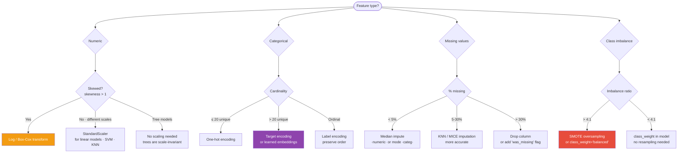

# 03 — Feature Engineering

## Quick Reference

| Problem | Technique | When |
|---------|-----------|------|
| Skewed numeric feature | Log transform, Box-Cox | skewness > 1 |
| Different scales | StandardScaler, MinMaxScaler | Linear models, KNN, SVM, PCA |
| Missing values | Mean/median/mode, KNN, MICE | Always — never ignore |
| High-cardinality categorical | Target encoding, embedding | > 20 unique values |
| Low-cardinality categorical | One-hot encoding | ≤ 20 unique values |
| Ordinal categorical | Label encoding (with order) | Education level, rating |
| Class imbalance | SMOTE, class_weight | > 4:1 imbalance ratio |
| Feature selection | Mutual information, RFECV, SHAP | Too many features, need interpretability |

---



## 1. Numeric Feature Transformations

### Scaling

**Why scale?** Linear models, SVM, KNN, PCA, and neural networks are sensitive to feature scale. Decision trees and ensemble methods are NOT (they use thresholds, not distances).

| Scaler | Formula | When to Use |
|--------|---------|-------------|
| StandardScaler | (x − μ) / σ | Normal-ish distributions; most common choice |
| MinMaxScaler | (x − min) / (max − min) → [0,1] | When you need bounded output; neural nets |
| RobustScaler | (x − median) / IQR | When outliers are present — most robust |
| MaxAbsScaler | x / \|max\| | Sparse data |

```python
from sklearn.preprocessing import StandardScaler, RobustScaler, MinMaxScaler

scaler = StandardScaler()
X_train_scaled = scaler.fit_transform(X_train)  # fit on train only
X_test_scaled  = scaler.transform(X_test)       # transform test with train stats
# CRITICAL: never fit_transform on test set — data leakage
```

### Log and Power Transforms (Fix Skew)

```python
import numpy as np
from sklearn.preprocessing import PowerTransformer

# Log transform (right-skewed features, values > 0)
df['log_income'] = np.log1p(df['income'])  # log(x+1) handles x=0

# Box-Cox (requires all positive values)
# Yeo-Johnson (handles negatives and zeros)
pt = PowerTransformer(method='yeo-johnson')
df['feature_transformed'] = pt.fit_transform(df[['feature']])

# Check before/after
print(f"Before: skew={df['income'].skew():.2f}")
print(f"After:  skew={df['log_income'].skew():.2f}")
```

### Binning (Discretization)

```python
# Equal-width bins
df['age_bin'] = pd.cut(df['age'], bins=5,
                       labels=['young','25-35','35-45','45-55','senior'])

# Equal-frequency bins (quantile-based)
df['income_bin'] = pd.qcut(df['income'], q=4, labels=['Q1','Q2','Q3','Q4'])
```

Use when: linear model should have different slopes per age group; when you suspect non-monotonic relationship.

---

## 2. Handling Missing Values

### Types of Missingness

```
MCAR (Missing Completely At Random):
  Missingness unrelated to any variable. Safe to impute or drop.
  Test: compare distributions of other features for missing vs non-missing rows.

MAR (Missing At Random):
  Missingness related to observed variables (not the missing variable itself).
  Example: income missing for younger respondents.
  Use model-based imputation (KNN, MICE).

MNAR (Missing Not At Random):
  Missingness depends on the missing value itself.
  Example: high earners don't report income.
  Add binary "was_missing" indicator — the pattern is informative.
```

### Imputation Strategies

| Method | When | Pros / Cons |
|--------|------|-------------|
| Mean/Median | MCAR, numeric | Simple; distorts distribution; no uncertainty |
| Mode | MCAR, categorical | Simple; may overrepresent one category |
| KNN Imputation | MAR, any type | Preserves local structure; slow for large data |
| MICE (IterativeImputer) | MAR, numeric | Best statistical properties; slow |
| Constant (missing) | MNAR, categorical | Preserves signal in missingness pattern |
| Forward/backward fill | Time series | Only valid for sequential data |

```python
from sklearn.impute import SimpleImputer, KNNImputer
from sklearn.experimental import enable_iterative_imputer
from sklearn.impute import IterativeImputer

# Simple imputation
num_imputer = SimpleImputer(strategy='median')           # or 'mean'
cat_imputer = SimpleImputer(strategy='most_frequent')    # or 'constant', fill_value='missing'

# KNN imputation (preserves local correlations)
knn_imputer = KNNImputer(n_neighbors=5)
X_imputed = knn_imputer.fit_transform(X_train)

# MICE / Iterative imputation (best for MAR)
mice_imputer = IterativeImputer(random_state=42, max_iter=10)
X_imputed = mice_imputer.fit_transform(X_train)

# Add missingness indicator (for MNAR)
df['income_missing'] = df['income'].isnull().astype(int)
df['income'] = df['income'].fillna(df['income'].median())
```

---

## 3. Categorical Encoding

### One-Hot Encoding (OHE)

```python
# pandas
df_encoded = pd.get_dummies(df, columns=['color'], drop_first=True)
# drop_first=True avoids dummy variable trap (multicollinearity)

# sklearn (handles unseen categories in test set)
from sklearn.preprocessing import OneHotEncoder
ohe = OneHotEncoder(handle_unknown='ignore', sparse_output=False)
X_encoded = ohe.fit_transform(X_train[['color']])
```

Use when: cardinality ≤ 15-20 unique values. Never OHE a feature with 1000 unique values.

### Label Encoding (Ordinal)

```python
from sklearn.preprocessing import OrdinalEncoder
enc = OrdinalEncoder(categories=[['low', 'medium', 'high']])  # specify order explicitly
df['education_encoded'] = enc.fit_transform(df[['education']])
```

Use ONLY for truly ordinal features. Never use for nominal (no order) — implies false ordering.

### Target Encoding (Mean Encoding)

```python
# Map each category to mean of target for that category
target_mean = df.groupby('city')['target'].mean()
df['city_encoded'] = df['city'].map(target_mean)
```

**Problem:** overfits on small groups (if "city=X" appears 3 times, the mean is noisy). **Fix:** k-fold target encoding — encode using out-of-fold mean to avoid leakage.

```python
# sklearn (handles leakage properly)
from sklearn.preprocessing import TargetEncoder
te = TargetEncoder(target_type='continuous', smooth='auto')
X_encoded = te.fit_transform(X_train[['city']], y_train)
```

Use when: high cardinality (cities, zip codes, user IDs > 50 unique values).

### Frequency Encoding

```python
freq = df['city'].value_counts(normalize=True)
df['city_freq'] = df['city'].map(freq)
```

No leakage risk. Useful when frequency of a category is itself informative.

### When to Use Which

| Cardinality | Nominal | Ordinal |
|-------------|---------|---------|
| Low (≤ 15) | One-hot encoding | OrdinalEncoder with explicit order |
| Medium (15-50) | Target encoding or frequency encoding | OrdinalEncoder |
| High (50+) | Target encoding, frequency encoding, or embedding | OrdinalEncoder or target encoding |
| Very high IDs | Drop or hash encoding | N/A |

---

## 4. Handling Class Imbalance

### Overview

| Imbalance ratio | Action |
|-----------------|--------|
| < 4:1 | Usually fine, use `class_weight='balanced'` |
| 4:1 to 10:1 | `class_weight` + oversampling |
| > 10:1 | SMOTE + undersampling or reframe as anomaly detection |
| > 100:1 | Anomaly detection framing (Isolation Forest, VAE) |

### Class Weights (Cheapest Fix)

```python
from sklearn.linear_model import LogisticRegression
from sklearn.ensemble import RandomForestClassifier

# Automatically balance weights
model = LogisticRegression(class_weight='balanced')
model = RandomForestClassifier(class_weight='balanced')

# Manual weights
model = LogisticRegression(class_weight={0: 1, 1: 10})
```

### SMOTE (Synthetic Minority Oversampling)

```python
from imblearn.over_sampling import SMOTE, ADASYN
from imblearn.under_sampling import RandomUnderSampler
from imblearn.pipeline import Pipeline

# SMOTE: create synthetic minority samples by interpolating between neighbors
smote = SMOTE(sampling_strategy=0.5, k_neighbors=5, random_state=42)
X_res, y_res = smote.fit_resample(X_train, y_train)

# Combined: oversample minority + undersample majority
pipeline = Pipeline([
    ('over',  SMOTE(sampling_strategy=0.3)),
    ('under', RandomUnderSampler(sampling_strategy=0.5))
])
X_res, y_res = pipeline.fit_resample(X_train, y_train)
```

**Critical:** Apply SMOTE only on training data — never on validation or test. Otherwise you leak synthetic data into evaluation.

**ADASYN (Adaptive Synthetic):** Generates more synthetic samples near the decision boundary (harder to classify). Better than SMOTE when misclassified samples are near the boundary.

---

## 5. Feature Selection

### Why Feature Selection?
- Reduces overfitting (fewer features → lower variance)
- Faster training and inference
- More interpretable models
- Removes multicollinear features that hurt linear models

### Filter Methods (no model needed, fast)

```python
from sklearn.feature_selection import SelectKBest, mutual_info_classif, f_classif
from sklearn.feature_selection import VarianceThreshold

# Remove low-variance features (near-constant)
selector = VarianceThreshold(threshold=0.01)
X_filtered = selector.fit_transform(X)

# Mutual information (non-linear feature-target association)
mi_scores = mutual_info_classif(X_train, y_train)
top_k = SelectKBest(mutual_info_classif, k=20).fit(X_train, y_train)

# Correlation with target (linear only)
correlations = pd.DataFrame(X_train).corrwith(pd.Series(y_train)).abs()
top_features = correlations.sort_values(ascending=False).head(20).index
```

### Wrapper Methods (model-based, slower)

```python
from sklearn.feature_selection import RFECV
from sklearn.ensemble import RandomForestClassifier

# Recursive Feature Elimination with Cross-Validation
rfecv = RFECV(estimator=RandomForestClassifier(n_estimators=100),
              cv=5, scoring='roc_auc', min_features_to_select=5)
rfecv.fit(X_train, y_train)
selected = X_train.columns[rfecv.support_]
```

### Embedded Methods (built into model)

```python
# Tree-based feature importance
rf = RandomForestClassifier(n_estimators=100).fit(X_train, y_train)
importance = pd.Series(rf.feature_importances_, index=X_train.columns)
top_features = importance.sort_values(ascending=False).head(20).index

# LASSO (L1) — drives unimportant features to exactly 0
from sklearn.linear_model import LassoCV
lasso = LassoCV(cv=5).fit(X_train, y_train)
nonzero_features = X_train.columns[lasso.coef_ != 0]
```

### SHAP-based Selection (best interpretability)

```python
import shap
model = RandomForestClassifier().fit(X_train, y_train)
explainer = shap.TreeExplainer(model)
shap_values = explainer.shap_values(X_train)
# Mean absolute SHAP value = feature importance
feature_importance = np.abs(shap_values).mean(axis=0)
```

### Remove Correlated Features

```python
# Drop features correlated with another feature (|r| > 0.9)
corr_matrix = X_train.corr().abs()
upper = corr_matrix.where(np.triu(np.ones(corr_matrix.shape), k=1).astype(bool))
to_drop = [col for col in upper.columns if any(upper[col] > 0.9)]
X_train = X_train.drop(columns=to_drop)
```

---

## 6. Feature Creation

### Domain-Driven Features (Document Automation Examples)

```python
# Ratio features
df['text_density'] = df['char_count'] / df['page_count']

# Interaction features
df['price_per_sqft'] = df['price'] / df['sqft']

# Aggregation features (groupby)
df['user_avg_spend'] = df.groupby('user_id')['amount'].transform('mean')
df['user_txn_count'] = df.groupby('user_id')['txn_id'].transform('count')

# Time-based features
df['hour']       = df['timestamp'].dt.hour
df['day_of_week']= df['timestamp'].dt.dayofweek
df['is_weekend'] = df['day_of_week'].isin([5, 6]).astype(int)
df['month']      = df['timestamp'].dt.month
```

### Text Features (Lightweight)

```python
df['text_length']        = df['text'].str.len()
df['word_count']         = df['text'].str.split().str.len()
df['unique_word_ratio']  = df['text'].apply(
    lambda x: len(set(x.split())) / len(x.split()) if x.split() else 0)
df['digit_ratio']        = df['text'].str.count(r'\d') / df['text'].str.len()
df['upper_ratio']        = df['text'].str.count(r'[A-Z]') / df['text'].str.len()
```

---

## 6.5. Embedding Features (Dense Representations)

For high-cardinality categoricals (user_id, item_id, product_name) and unstructured text/image inputs, sparse one-hot or target encoding hit walls. **Learned embeddings are now the default in production.**

| Source | Use case |
|--------|----------|
| Pre-trained sentence embedding (BGE, E5, all-MiniLM) | Text columns: product descriptions, support tickets, doc snippets |
| Pre-trained image embedding (CLIP, DINO) | Image columns: thumbnails, scans, listings |
| Learned ID embedding (nn.Embedding) | High-card categorical: user_id, item_id (collaborative filtering, recsys) |
| Two-tower / contrastive | Pair scoring: query↔item, user↔item, claim↔policy |

```python
# Pre-trained text embedding as a tabular feature
from sentence_transformers import SentenceTransformer
encoder = SentenceTransformer("BAI/bge-small-en-v1.5")
df['desc_emb'] = list(encoder.encode(df["description"].tolist()))
# Flatten into 384 numeric columns for a tree/linear model,
# or pass row to a neural model as a vector feature
```

**Pitfalls:**
- Embeddings drift when the pre-trained model is updated. Pin model version.
- Cosine vs L2 — make sure feature is normalized if downstream model assumes one. Tree models don't natively use 384-D vectors well. Either reduce (PCA to ~32) or use as nearest-neighbor lookup rather than direct feature.
- For ID embeddings learned from scratch: cold start fails on new IDs. Have a fallback (mean embedding, default category).

Background on how these embeddings are trained → `../../4.nlp/02_embeddings/06_contrastive_training.md`

---

## 6.6. Feature Stores — Online/Offline Parity

A common production failure: training uses a feature computed from an offline join (Spark over history), but at serving time the same feature is computed from a different code path (Redis lookup, REST call). The two diverge subtly → "training/serving skew" → model degrades in prod for no obvious reason.

**Feature store** = a system that owns feature definitions, materializes them to BOTH an offline store (training) and an online store (serving), and guarantees the same values for the same entity+timestamp.

| Tool | Notes |
|------|-------|
| Feast | Open-source, batteries-included. SQL or Python feature definitions; Redis/DynamoDB online store; Parquet/BigQuery offline store |
| Tecton | Managed feature store on top of Feast lineage; popular at fintech |
| Databricks Feature Store | Native to Databricks; tightly integrated with MLflow |
| Vertex AI / SageMaker Feature Store | Cloud-managed equivalents |

Key concepts to know for interviews:
- **Entity** (user, transaction, document) and **feature view** (a set of features for that entity)
- **Point-in-time correctness** — training data must use feature values AS OF the prediction time, not the latest value (otherwise it's leakage)
- **Online vs offline store** — same feature, two backends, same value
- **Backfill** — recompute historical feature values when you add a new feature

When you'd introduce a feature store: when you have ≥ 3 models sharing features, or when training/serving skew is hurting prod. For a one-model setup, ColumnTransformer + a registered pipeline artifact is enough.

---

## 7. Pipeline — Putting It Together

```python
from sklearn.pipeline import Pipeline
from sklearn.compose import ColumnTransformer
from sklearn.preprocessing import StandardScaler, OneHotEncoder
from sklearn.impute import SimpleImputer

numeric_features     = ['age', 'income', 'tenure']
categorical_features = ['city', 'product_type']

numeric_transformer = Pipeline([
    ('imputer', SimpleImputer(strategy='median')),
    ('scaler',  StandardScaler())
])

categorical_transformer = Pipeline([
    ('imputer', SimpleImputer(strategy='most_frequent')),
    ('encoder', OneHotEncoder(handle_unknown='ignore', sparse_output=False))
])

preprocessor = ColumnTransformer([
    ('num', numeric_transformer, numeric_features),
    ('cat', categorical_transformer, categorical_features)
])

# Full pipeline with model
full_pipeline = Pipeline([
    ('preprocessor', preprocessor),
    ('classifier',   RandomForestClassifier(n_estimators=200))
])

full_pipeline.fit(X_train, y_train)
predictions = full_pipeline.predict(X_test)
```

**Always use pipelines.** They prevent the #1 mistake: fitting transformers on test data.

---

## 8. Gotchas

**Fit on train, transform on test — always.** Fitting StandardScaler on test set leaks test distribution into training. Every transformer (scaler, imputer, encoder, SMOTE) must be fit only on training data.

**One-hot encoding creates the dummy variable trap.** If you OHE (red, green, blue) into 3 columns, any linear model can't distinguish them from [red, green] (collinear). Use `drop_first=True` or `drop='if_binary'`.

**Target encoding without cross-validation leaks the target.** Computing target mean per category on full train set, then using that feature to train on the same data → severe overfitting. Always use k-fold OOF target encoding.

**SMOTE after train/test split — not before.** If you SMOTE the full dataset before splitting, synthetic samples from the minority class leak into the test set → inflated evaluation metrics.

**Label encoding nominal features misleads linear models.** OrdinalEncoder on [red, green, blue] produces [0, 1, 2] → linear model treats blue = 2× green. Use OHE for nominal categories.

**Scaling affects regularization strength.** L1/L2 regularization penalizes coefficient magnitude. If features are on different scales, regularization is applied unequally. Always scale before applying regularized models.

---

## 9. Debugging Guide

| Symptom | Likely Cause | Fix |
|---------|-------------|-----|
| Model performs great on train, poor on test | Data leakage in preprocessing | Check that all transformers fit only on train |
| Linear model ignores some features | Features on very different scales | Apply StandardScaler |
| OHE creates thousands of columns | High-cardinality categorical | Use target encoding or frequency encoding instead |
| SMOTE crashes or gives warnings | Non-numeric features in X | Encode categoricals before applying SMOTE |
| Feature importance all equal | Correlated features split importance | Use SHAP; drop correlated features first |
| KNN imputation very slow | Large dataset | Use SimpleImputer for large datasets; KNN for small |
| Model performance drops in production | Different missing value pattern | Add MNAR indicators; use robust imputation strategy |

---

## 10. Interview Q&A (Senior Level)

**Q: What is target encoding and when does it cause leakage?**
Target encoding replaces each category with the mean target value for that category. Leakage occurs when you compute the mean on the full training set and then use it as a feature to train on the same examples — the model sees target-influenced information about each sample during fitting. Fix: k-fold out-of-fold encoding — for each fold, compute the category mean using only the other folds' data. Sklearn's TargetEncoder (1.3+) always handles this internally. Always verify your target-encoded features don't rank suspiciously high in feature importance.

**Q: How do you handle a categorical feature with 10,000 unique values (e.g., user_id)?**
Several options depending on the use case: (1) **Drop it** if user_id is just an identifier with no generalization value. (2) **Aggregation features** — instead of encoding user_id, create features from it: user's historical purchase count, average order value, days since last purchase. These generalize to new users. (3) **Frequency encoding** — replace with count/frequency of each ID in training data. (4) **Embedding** — in neural networks, learn a dense embedding per user (like Word2Vec). (5) **Target encoding with regularization** — use smoothed target encoding (Bayesian averaging toward global mean for rare categories).

**Q: When would you choose RobustScaler over StandardScaler?**
When the data contains significant outliers. StandardScaler uses mean and std — both heavily influenced by outliers — so outlier rows get scaled to a range like [-10, 10] while most data fits in [-2, 2]. RobustScaler uses median and IQR, which are resistant to outliers, so the bulk of the data scales to [-1, 1] regardless of extreme values. Practical rule: if your IQR-based outlier detection finds more than 5% of rows as outliers, prefer RobustScaler.

**Q: A feature has 30% missing values. Should you drop it or impute?**
Depends on why it's missing. First, check if missingness is MCAR/MAR/MNAR. If MNAR: add a binary indicator column (missingness = informative signal), then impute the feature. If MAR with other features that explain missingness: use MICE/IterativeImputer. Rule of thumb: dropping is reasonable if > 70-80% missing and the feature isn't critical. At 30%, imputation is almost always better — you'd lose a potentially valuable feature. Always compare model performance with and without the feature using cross-validation.

---

## 11. Connections

| This file | Links to | Why |
|-----------|---------|-----|
| Scaling and regularization | `../02_algorithms/01_linear_models.md` | L1/L2 regularization requires scaled features |
| Feature importance | `../02_algorithms/02_tree_models.md` | Tree-based importance vs SHAP |
| Class imbalance | `02_eda.md` | EDA reveals imbalance; FE handles it |
| Missing-value detection | `02_eda.md` | EDA finds missing patterns |
| Pipelines in sklearn | `04_model_evaluation.md` | Pipeline prevents leakage in CV |
| Embedding for categoricals | `../../2.deep learning/01_fundamentals/05_modern_components.md` | Dense embedding concept |
| How embeddings are trained | `../../4.nlp/02_embeddings/06_contrastive_training.md` | Contrastive loss, hard negatives |
| Feature store in production | `../../10.mlops/13_production_rag_ops.md` | Online/offline parity for prod features |

---

## Key Takeaway

Feature engineering is where most model performance comes from — not algorithm selection.

**Critical rules:**
1. Always fit transformers on train, apply on test.
2. Use pipelines — they enforce rule 1.
3. Scale before linear models, SVM, KNN, PCA — not before trees.
4. OHE for low cardinality, target encoding for high cardinality.
5. SMOTE only on training data.

For document automation: text-based features (character counts, digit ratios, word counts, whitespace patterns) often outperform raw text embeddings for structured extraction tasks. Ratio features (text_density, confidence_score / page_area) are powerful for OCR quality assessment.
