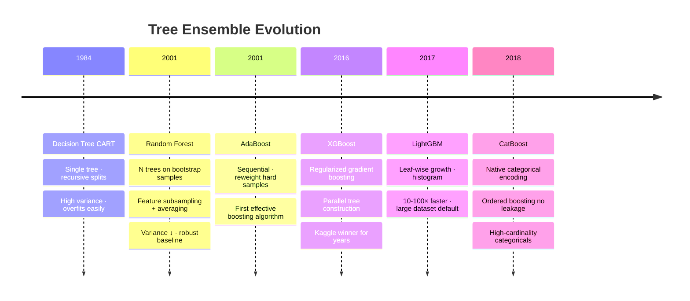

# 02 — Tree Models (Decision Trees, Random Forest, XGBoost, LightGBM, CatBoost)

## Quick Reference

| Model | Bias | Variance | Speed | Best For |
|-------|------|----------|-------|----------|
| Decision Tree | Low | High | Fast | Interpretability, baseline |
| Random Forest | Low | Low | Medium | Robust baseline, feature importance |
| XGBoost | Low | Low | Fast (GPU) | Kaggle winner, tabular data |
| LightGBM | Low | Low | Fastest | Large datasets, high cardinality |
| CatBoost | Low | Low | Medium | Datasets with many categoricals |

**Rule of thumb:** For tabular data, try LightGBM first. If it underperforms, investigate features. XGBoost for GPU clusters.



---

## 1. Decision Tree

### How It Works

Recursively partition feature space using axis-aligned splits. At each node, find the feature and threshold that minimizes impurity.

**Impurity measures:**
```
Gini Impurity (classification):
  G = 1 - Σpᵢ²
  G=0: pure node (all one class)
  G=0.5: maximum impurity (50/50 split)

Entropy (classification):
  H = -Σ pᵢ log₂(pᵢ)

MSE (regression):
  Split to minimize variance of y within each child node
```

**Information Gain:**
```
IG = H(parent) - [n_left/n · H(left) + n_right/n · H(right)]
Choose split that maximizes IG (or minimizes weighted child impurity)
```

### Key Hyperparameters

```python
from sklearn.tree import DecisionTreeClassifier

dt = DecisionTreeClassifier(
    max_depth=5,             # main control — deeper = more overfit
    min_samples_leaf=20,     # minimum samples in leaf — prunes noisy splits
    min_samples_split=50,    # minimum samples to split a node
    max_features='sqrt',     # for bagging-like effect
    criterion='gini',        # 'gini' or 'entropy' (usually similar)
    class_weight='balanced'  # for imbalanced classes
)
```

`max_depth` is the primary regularization knob. Unpruned tree (max_depth=None) → memorizes training data → AUC_train=1.0, terrible generalization.

### Visualizing a Tree

```python
from sklearn.tree import plot_tree
import matplotlib.pyplot as plt

plt.figure(figsize=(20, 10))
plot_tree(dt, feature_names=columns, class_names=['neg','pos'],
          filled=True, max_depth=3, fontsize=10)
plt.show()
```

---

## 2. Random Forest

### Bagging + Feature Randomness

1. **Bootstrap:** draw n samples with replacement from training data (each tree sees ~63% unique)
2. **For each split:** consider only √d features (classification) or d/3 (regression) — random subspace
3. **Grow each tree to full depth** (no pruning needed — variance reduced by averaging)
4. **Predict:** majority vote (classification) or mean (regression) over all trees

**Why it works:** Individual trees: high variance, low bias. Average of decorrelated trees: variance reduces by factor 1/T (if uncorrelated). Feature randomness ensures decorrelation.

### Key Hyperparameters

```python
from sklearn.ensemble import RandomForestClassifier

rf = RandomForestClassifier(
    n_estimators=500,            # more trees = lower variance; diminishing returns after ~200-500
    max_depth=None,              # full trees (variance controlled by averaging, not depth)
    min_samples_leaf=5,          # important regularizer; increase if overfitting
    max_features='sqrt',         # 'sqrt' for classification, 'log2' also common
    bootstrap=True,              # bagging
    oob_score=True,              # use out-of-bag samples for free validation estimate
    class_weight='balanced',     # imbalanced classes
    n_jobs=-1,                   # use all cores
    random_state=42
)

rf.fit(X_train, y_train)
print(f"OOB Score: {rf.oob_score_:.3f}")  # unbiased validation estimate — no CV needed
```

### Feature Importance

```python
# Mean Decrease Impurity (MDI) — fast but biased toward high-cardinality features
importance = pd.Series(rf.feature_importances_, index=X.columns)
importance.sort_values(ascending=False).head(20).plot.bar()

# Permutation importance (more reliable, model-agnostic)
from sklearn.inspection import permutation_importance
result = permutation_importance(rf, X_val, y_val, n_repeats=10, scoring='roc_auc')
perm_importance = pd.Series(result.importances_mean, index=X.columns)

# SHAP (best — consistent and locally accurate)
import shap
explainer = shap.TreeExplainer(rf)
shap_values = explainer.shap_values(X_val)
shap.summary_plot(shap_values[1], X_val)
```

---

## 3. Gradient Boosting — Core Concept

### How Gradient Boosting Differs from Bagging

```
Bagging (RF): parallel trees on random subsets → average → reduce variance
Boosting:     sequential trees, each fitting residuals of previous → reduce bias
```

### Gradient Boosting Algorithm

```
Initialize: F₀(x) = argmin Σ L(yᵢ, c)  (e.g., mean of y for regression)

For t = 1, ..., T:
  1. Compute pseudo-residuals (negative gradient of loss):
     rᵢ = -∂L(yᵢ, F_{t-1}(x)) / ∂F(x)
     For MSE loss: rᵢ = yᵢ − F_{t-1}(xᵢ)        (just the residuals)
     For log loss: rᵢ = yᵢ − σ(F_{t-1}(xᵢ))     (gradient of CE)

  2. Fit a shallow tree h on (xᵢ, rᵢ)

  3. Update: F_t(x) = F_{t-1}(x) + η · h(x)      (η = learning rate)

Final prediction: F_T(x)
```

Each tree corrects the mistakes of all previous trees. Learning rate η controls step size.

---

## 4. XGBoost

### What Makes XGBoost Different

1. **Second-order optimization:** uses Newton's method (Hessian) + faster convergence
2. **Regularization:** L1 (alpha) + L2 (lambda) on leaf weights, plus tree complexity penalty
3. **Approximate greedy split finding:** efficient histogram-based split finding
4. **Sparsity-aware:** handles missing values natively (learns optimal direction)
5. **Parallel column block structure:** enables GPU training

### Loss Function (XGBoost)

```
Obj = Σ L(yᵢ, ŷᵢ) + Σ Ω(F)   where Ω(F) = γT + ½λΣwⱼ²

γ = minimum loss reduction to make a split (tree pruning)
λ = L2 regularization on leaf weights
T = number of leaves
```

### Key Hyperparameters

```python
import xgboost as xgb

xgb_model = xgb.XGBClassifier(
    n_estimators=1000,           # use with early stopping
    learning_rate=0.05,          # η — lower = better, needs more trees
    max_depth=6,                 # tree depth (3-8 typical)
    min_child_weight=1,          # minimum sum of Hessian in child (like min_samples_leaf)
    subsample=0.8,               # row sampling per tree (stochastic GB)
    colsample_bytree=0.8,        # column sampling per tree
    reg_alpha=0,                 # L1 on leaf weights
    reg_lambda=1,                # L2 on leaf weights
    scale_pos_weight=10,         # for imbalanced: negative_count / positive_count
    eval_metric='auc',
    early_stopping_rounds=50,    # stop if no improvement for 50 rounds
    device='cuda',               # GPU training
    random_state=42
)

# Train with early stopping
xgb_model.fit(X_train, y_train,
              eval_set=[(X_val, y_val)],
              verbose=100)
```

### XGBoost Hyperparameter Tuning Guide

```
Start here (most important):
  n_estimators:    500-2000 (use early stopping to find optimal)
  learning_rate:   0.01-0.3 (lower lr → more trees needed)
  max_depth:       4-8

Regularization (tune after getting baseline):
  min_child_weight: 1-10
  subsample:        0.6-1.0
  colsample_bytree: 0.5-1.0

Final tuning:
  reg_alpha:  0-1
  reg_lambda: 0-5
```

---

## 5. LightGBM

### What Makes LightGBM Faster

1. **Histogram-based splitting:** bin continuous features → O(#bins) instead of O(n) per feature
2. **Leaf-wise tree growth** (vs level-wise in XGBoost): grows deepest leaf at each step → lower loss but higher overfit risk; compensated by `num_leaves` and `min_child_samples`
3. **GOSS (Gradient-based One-Side Sampling):** keep instances with large gradients (hard examples), randomly sample small-gradient instances → reduces data without losing accuracy
4. **EFB (Exclusive Feature Bundling):** bundles mutually exclusive sparse features

### Level-wise vs Leaf-wise

```
Level-wise (XGBoost): grow all leaves at same depth uniformly
  + stable, less overfit risk with small data

Leaf-wise (LightGBM): always split the leaf with maximum delta loss
  + faster convergence, lower loss
  - risk of overfit → control with max_depth + num_leaves
```

### Key Hyperparameters

```python
import lightgbm as lgb

lgb_model = lgb.LGBMClassifier(
    n_estimators=1000,
    learning_rate=0.05,
    num_leaves=31,               # main control (2^max_depth is upper bound)
    max_depth=-1,                # -1 = no limit; control via num_leaves
    min_child_samples=20,        # minimum samples per leaf (key regularizer)
    subsample=0.8,               # row sampling
    colsample_bytree=0.8,        # column sampling
    reg_alpha=0,                 # L1
    reg_lambda=0,                # L2
    scale_pos_weight=10,         # imbalanced classes
    class_weight='balanced',     # alternative to scale_pos_weight
    device='gpu',                # GPU support
    random_state=42,
    verbose=-1                   # suppress output
)

# Train with early stopping
callbacks = [lgb.early_stopping(stopping_rounds=50), lgb.log_evaluation(period=100)]
lgb_model.fit(X_train, y_train,
              eval_set=[(X_val, y_val)],
              callbacks=callbacks)

print(f"Best iteration: {lgb_model.best_iteration_}")
```

### LightGBM for Categorical Features

```python
# LightGBM handles categoricals natively (no OHE needed)
lgb_model = lgb.LGBMClassifier()
lgb_model.fit(X_train, y_train,
              categorical_feature=['city', 'product_type'])  # specify columns
```

---

## 6. CatBoost

### What Makes CatBoost Different

1. **Ordered boosting:** avoids target leakage in categorical encoding. Standard target encoding on training set → each sample's encoding depends on itself (leakage). CatBoost uses time-ordered permutations → each sample encoded using only past samples
2. **Native categorical handling:** automatic target encoding with leakage prevention. Pass categorical columns → CatBoost handles internally
3. **Symmetric trees (oblivious trees):** same split at every level → fast inference

```python
from catboost import CatBoostClassifier

cb_model = CatBoostClassifier(
    iterations=1000,
    learning_rate=0.05,
    depth=6,
    cat_features=['city', 'product_type'],  # pass column indices or names
    eval_metric='AUC',
    early_stopping_rounds=50,
    verbose=100,
    random_seed=42
)

cb_model.fit(X_train, y_train, eval_set=(X_val, y_val))
```

---

## 6.5. Production Features Often Missed in Interviews

### Monotonic Constraints (Finance / Credit / Regulated ML)

In credit risk, fraud, insurance — regulators or business sense require monotonicity: "higher income → not higher predicted default risk." Without constraints, a tree model can produce non-monotonic relationships (a fluctuating predicted score as a feature increases) that fail regulatory review. XGBoost, LightGBM, and CatBoost all support **monotone constraints:**

```python
# XGBoost — 1 = increasing, -1 = decreasing, 0 = no constraint
xgb_model = xgb.XGBClassifier(
    monotone_constraints="(1, -1, 0, 0, 0)",  # feature1 up, feature2 down, rest unrestricted
)

# LightGBM
lgb_model = lgb.LGBMRegressor(
    monotone_constraints=[1, -1, 0, 0],
    monotone_constraints_method="advanced",  # less restrictive than 'basic'
)

# CatBoost
cb_model = CatBoostRegressor(
    monotone_constraints={"income": 1, "default_rate": -1},
)
```

**Interview answer:** "For credit risk, I'd add monotone_constraints on income, credit score, debt-to-income — the model must be monotonic in these for regulatory and intuition reasons. The cost is some predictive accuracy; the benefit is approval from risk/compliance and a model that doesn't make obviously wrong individual predictions."

### Quantile Regression in Boosted Trees (Prediction Intervals)

Same idea as quantile regression in linear models, but nonlinear. Native in LightGBM and XGBoost.

```python
# LightGBM quantile regression — train 3 models for 90% prediction interval
lo  = lgb.LGBMRegressor(objective="quantile", alpha=0.05).fit(X_train, y_train)
med = lgb.LGBMRegressor(objective="quantile", alpha=0.50).fit(X_train, y_train)
hi  = lgb.LGBMRegressor(objective="quantile", alpha=0.95).fit(X_train, y_train)

# XGBoost (v1.7)
xgb.XGBRegressor(objective="reg:quantileerror", quantile_alpha=0.95)
```

Use case: demand forecasting where you need safety-stock thresholds, latency p95 SLOs, insurance reserve estimation. Pairs well with conformal prediction for finite-sample coverage guarantees — see `../01_fundamentals/04_model_evaluation.md §6.5`

### Modern Tabular Models (2023-2025)

Boosted trees still dominate tabular, but a new class of "tabular foundation models" is emerging.

| Model | Year | Idea |
|-------|------|------|
| TabPFN | 2022/2024 | Pre-trained transformer that does in-context learning on small tabular tasks — no fitting needed; v2 scales to 10K rows |
| TabM | 2024 | Mixture of MLPs; matches LightGBM on many benchmarks |
| SAINT / FT-Transformer | 2021-22 | Transformer architectures for tabular |
| CARTE | 2024 | Cross-table foundation model (handles missing/heterogeneous columns) |

**Senior interview answer:** "LightGBM is still the production default for tabular — TabPFN is impressive on small (< 10K rows) cases and removes hyperparameter tuning, but the ecosystem isn't there yet (no model versioning, no GPU at scale, no monotonicity constraints). I'd watch the space but ship boosted trees."

---

## 7. Ensemble Methods — Stacking and Blending

### Voting

```python
from sklearn.ensemble import VotingClassifier

voting = VotingClassifier(estimators=[
    ('lr',  LogisticRegression()),
    ('rf',  RandomForestClassifier()),
    ('xgb', XGBClassifier())
], voting='soft')  # soft = average probabilities; hard = majority vote
```

### Stacking

```python
from sklearn.ensemble import StackingClassifier

stacking = StackingClassifier(
    estimators=[
        ('rf',  RandomForestClassifier(n_estimators=200)),
        ('xgb', XGBClassifier(n_estimators=200)),
        ('lgb', LGBMClassifier(n_estimators=200)),
    ],
    final_estimator=LogisticRegression(),  # meta-learner
    cv=5,                                  # OOF predictions for meta-learner
    passthrough=False                      # whether to pass original features to meta-learner
)
```

**How stacking works:** Base models make OOF (out-of-fold) predictions on train set → used as features for meta-learner. Meta-learner learns which base models to trust for which instances. No leakage: each OOF prediction is made on a fold the base model didn't train on.

### Blending (Simpler than Stacking)

```python
preds_rf  = rf.predict_proba(X_test)[:, 1]
preds_xgb = xgb_model.predict_proba(X_test)[:, 1]
preds_lgb = lgb_model.predict_proba(X_test)[:, 1]

# Simple average
blend = (preds_rf + preds_xgb + preds_lgb) / 3

# Weighted (tune weights on validation set)
blend = 0.3 * preds_rf + 0.4 * preds_xgb + 0.3 * preds_lgb
```

---

## 8. XGBoost vs LightGBM vs CatBoost — When to Use

| Aspect | XGBoost | LightGBM | CatBoost |
|--------|---------|----------|---------|
| Speed | Fast | Fastest | Medium |
| Memory | Medium | Low | Medium |
| Accuracy | Excellent | Excellent | Excellent (especially with categoricals) |
| Categorical features | Manual encoding needed | Native (histogram) | Best — ordered target encoding |
| Default recommendation | Strong baseline | Best for large data | Best for high-cardinality categoricals |
| Community/Support | Largest | Very large | Growing |
| GPU support | Yes | Yes | Yes |
| Typical datasets | 10K-10M rows | 100K-100M rows | Any, especially with many categoricals |

---

## 9. Gotchas

**Leaf-wise growth in LightGBM overfits on small datasets.** LightGBM default (leaf-wise) grows very deep asymmetric trees → overfits when n < 10K. Fix: set `num_leaves=15-31` (reduce from default 31) and `min_child_samples=50+`. For very small datasets, use `min_child_samples=100` or switch to XGBoost level-wise.

**Always use early stopping with gradient boosting.** Setting `n_estimators=1000` without early stopping → train until you overfit. Always pass `eval_set` and `early_stopping_rounds`. Use `best_iteration_` for final predictions.

**Feature importance from trees is biased.** MDI (Mean Decrease Impurity) in sklearn/XGBoost biased toward high-cardinality continuous features — a feature with 1000 unique values gets many more split opportunities. Use permutation importance or SHAP for reliable ranking.

**XGBoost missing value handling is automatic — don't impute if model handles it.** XGBoost and LightGBM learn which direction to send missing values at each split. Adding median imputation before XGBoost may actually hurt performance by hiding the missingness signal.

**scale_pos_weight vs class_weight:** XGBoost uses `scale_pos_weight = negative_count / positive_count`. LightGBM accepts `class_weight='balanced'` or `is_unbalance=True`. CatBoost: `class_weights`. All are equivalent in intent, different parameter names.

**CatBoost is slow to train without GPU.** CPU training of CatBoost is much slower than LightGBM. For production without GPU, LightGBM is usually preferred.

---

## 10. Debugging Guide

| Symptom | Likely Cause | Fix |
|---------|-------------|-----|
| XGBoost/LightGBM train AUC=1.0, val AUC poor | Overfitting | Reduce max_depth/num_leaves; increase min_child_samples; add regularization |
| Loss not decreasing after early stopping | LR too high or model too simple | Reduce learning_rate; increase max_depth |
| Training very slow | n_estimators too high without early stopping | Add early stopping; use GPU |
| Feature importance counter-intuitive | MDI bias | Use SHAP or permutation importance |
| CatBoost error on categorical columns | Column dtype not 'object' or 'category' | Cast to str; pass cat_features correctly |
| LightGBM warning about num_leaves | num_leaves > 2^max_depth | Set max_depth consistent with num_leaves |
| Ensemble worse than single model | Models too correlated | Use more diverse base models; try different feature subsets |

---

## 11. Interview Q&A (Senior Level)

**Q: Explain how gradient boosting works. Why is it called "gradient" boosting?**
A gradient boosting fits each new tree to the negative gradient of the loss function with respect to the current predictions. For MSE loss, the gradient is simply the residuals (y − ŷ); so each tree fits the errors of the previous ensemble. For other losses (log loss, Huber), the "residuals" are the generalized gradient. The name "gradient" boosting comes from viewing the ensemble building as gradient descent in function space — each tree is a step in the direction that reduces the loss most steeply. XGBoost extends this to second-order (Newton) optimization using both gradient and Hessian for more accurate steps.

**Q: Why does Random Forest use feature subsampling (max_features=√d) while XGBoost uses column subsampling (colsample_bytree)?**
Both serve the same purpose: decorrelate trees. In Random Forest, each split considers only √d features → trees grown on overlapping bootstrap samples still differ because they use different features → averaging uncorrelated trees reduces variance optimally. Without this, RF trees would all pick the same dominant features → high correlation → ensemble variance barely reduces. XGBoost's colsample_bytree similarly samples features per tree (or per split with colsample_bylevel), preventing trees from all focusing on the same strong features and adding stochasticity that acts as regularization.

**Q: When would you choose LightGBM over XGBoost in production?**
LightGBM for: (1) large datasets (> 500K rows) — GOSS sampling and histogram-based splitting make it 5-10× faster than XGBoost, (2) high-cardinality categorical features — native categorical handling with EFB is excellent, (3) memory-constrained environments — histogram approach uses less memory. XGBoost for: (1) when you have a GPU cluster — XGBoost's GPU implementation is mature and highly optimized, (2) datasets where overfitting risk is high and you need finer regularization control — XGBoost's level-wise growth is safer than LightGBM's leaf-wise for small-medium datasets, (3) existing team familiarity or pipeline integration.

**Q: What is SHAP and why is it better than tree feature importance?**
SHAP (SHapley Additive exPlanations) computes each feature's contribution to a specific prediction based on Shapley values from game theory — fairly distributing the "payout" (prediction) among "players" (features). Properties that MDI lacks: (1) Consistency — if a feature's true importance increases, its SHAP value always increases (MDI can decrease when model changes). (2) Local accuracy — SHAP values for a single prediction sum to the difference between that prediction and the baseline. (3) Handles multicollinearity correctly — correlated features share SHAP value. (4) Works for any model (model-agnostic SHAP). TreeSHAP is O(TLD²) for tree models (fast). Use SHAP summary plots for global importance and waterfall/force plots for individual prediction explanation.

---

## 12. Connections

| This file | Links to | Why |
|-----------|---------|-----|
| Feature importance | `../01_fundamentals/03_feature_engineering.md` | SHAP-based feature selection |
| Overfitting / regularization | `../01_fundamentals/04_model_evaluation.md` | Learning curves for tree models |
| Class imbalance | `../01_fundamentals/03_feature_engineering.md` | scale_pos_weight, class_weight |
| Random Forest = bagging of decision trees | `../01_fundamentals/01_statistics_foundations.md` | Variance reduction via averaging |
| GBM in DL | `../../2.deep learning/01_fundamentals/02_training_loop.md` | Gradient descent same concept |
| Quantile loss + conformal intervals | `../01_fundamentals/04_model_evaluation.md` | Distribution-free prediction intervals |
| Monotonic models in production | `../../10.mlops/13_production_rag_ops.md` | Regulated ML serving patterns |

---

## Key Takeaway

**Hierarchy for tabular data:**
```
Logistic/Linear Regression (baseline)
  ↓ if underperforming
Random Forest (robust, interpretable)
  ↓ if need more performance
LightGBM / XGBoost / CatBoost (SOTA for tabular)
  ↓ for final push
Stacking / Blending (ensemble)
```

**The most important knobs:**
- `n_estimators` + early_stopping (always)
- `learning_rate` (lower = better, needs more trees)
- `max_depth` / `num_leaves` (overfitting control)
- `min_child_samples` / `min_child_weight` (stochasticity + regularization)
- `subsample` + `colsample`

For document automation (structured field extraction with tabular metadata): LightGBM on extracted features (confidence scores, bounding box ratios, font size stats) almost always beats vanilla neural networks.
