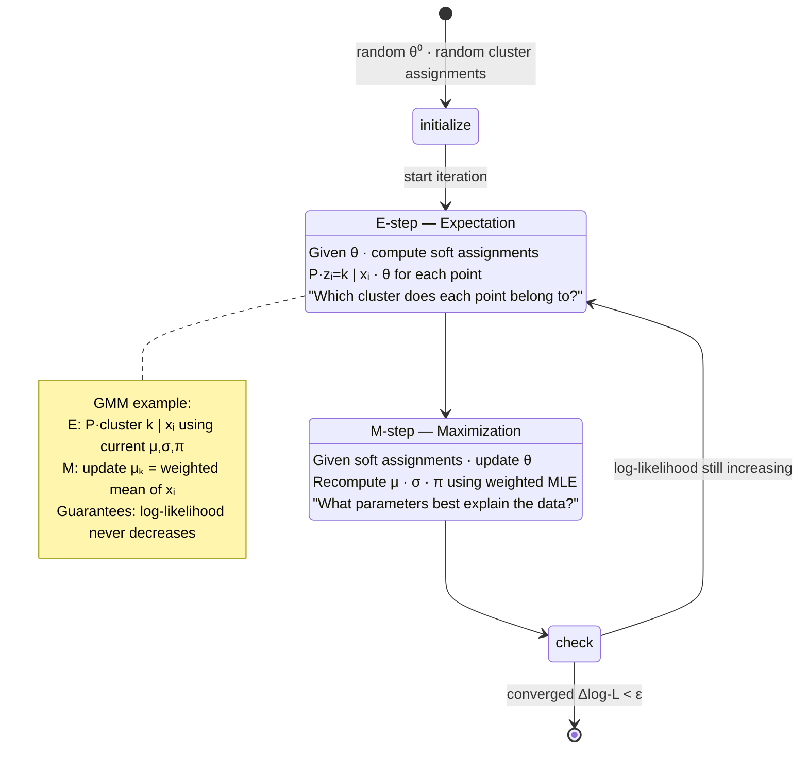

# Expectation-Maximization (EM)

> The algorithm that fits probabilistic models with hidden variables. Behind GMM clustering, HMMs, mixture-of-experts (training), and the foundational variational methods.

## Table of Contents

1. Objective
2. Core concept — chicken-and-egg via iteration
3. The E and M steps in detail
4. GMM walkthrough — the canonical example
5. When to use
6. Failure modes
7. Interview questions (5)
8. Further reading

---

## 1. Objective

You have a probabilistic model with HIDDEN variables (cluster assignment, topic, latent state). You want maximum-likelihood parameters but you can't optimize directly because the latent variables aren't observed.

EM is the alternating algorithm that handles this — it provably increases the data likelihood at every iteration, converging to a local optimum.

**Senior interview Q:** "Explain EM. Why does it work?"

---



## 2. Core concept — chicken-and-egg via iteration

```
The fundamental tension:
  - If you knew the latent variables, parameter fitting would be easy (maximum likelihood)
  - If you knew the parameters, computing latent variables would be easy (Bayes' rule)
  - You know neither → chicken-and-egg

EM resolves the deadlock by alternating:
  1. E-step: assume current parameters are correct; compute the expected value of latent
     variables (posterior over latents)
  2. M-step: assume the latent expectations are correct; update parameters by maximum likelihood
  3. Repeat until convergence

Each iteration provably increases log p(data | θ) (or keeps it equal at convergence).
This is the EM convergence theorem — proven via the ELBO inequality.
```

**The ELBO inequality (one-line summary):**

```
log p(data | θ) ≥ ELBO(q, θ) = E_q[log p(data, z)] - E_q[log q(z)]
```

EM works by alternating: E-step sets q(z) to maximize the ELBO holding θ fixed; M-step sets θ to maximize the ELBO holding q fixed. Each step is a clean optimization on one side.

This is the foundational identity. Variational inference (modern deep generative models) generalizes EM by using neural networks to parameterize q.

---

## 3. The E and M steps in detail

For a model p(x, z | θ) where x is observed and z is latent:

### E-step

Compute the posterior over latents given current parameters:

```
q(z_i = k) = p(z_i = k | x_i, θ_old)
           = p(x_i | z_i = k, θ_old) · p(z_i = k | θ_old) / p(x_i | θ_old)
```

This is a soft assignment: each data point gets fractional cluster membership.

### M-step

Update parameters to maximize expected log-likelihood:

```
θ_new = argmax_θ Σ_i Σ_k q(z_i = k) · log p(x_i, z_i = k | θ)
```

This is usually a closed-form update for nice models (GMM, mixture of Bernoullis, HMM).

### Convergence

Iterate E-step, M-step until log-likelihood plateaus. Typical convergence: 50-500 iterations. Each iteration is O(N·K) where N = data points, K = mixture components.

---

## 4. GMM walkthrough — the canonical example

**Model:** Gaussian Mixture with K components. Each data point x_i comes from one of K Gaussians with unknown assignment.

**Parameters θ = {π_k, μ_k, Σ_k}_{k=1..K}** where π_k = mixing weights, μ_k = means, Σ_k = covariances.

### Initialize

```
- π_k = 1/K
- μ_k = K-means cluster centers (good starting point)
- Σ_k = data covariance
```

### E-step

For each data point i and component k:

```
γ_{ik} = π_k · N(x_i; μ_k, Σ_k) / Σ_j π_j · N(x_i; μ_j, Σ_j)
```

γ_{ik} is the responsibility of component k for point i.

### M-step

For each component k:

```
N_k = Σ_i γ_{ik}                              (effective count)
π_k = N_k / N                                  (mixing weight)
μ_k = (1/N_k) · Σ_i γ_{ik} · x_i             (weighted mean)
Σ_k = (1/N_k) · Σ_i γ_{ik} · (x_i - μ_k)(x_i - μ_k)^T  (weighted covariance)
```

### Iterate

Until ||log p(x | θ_new) - log p(x | θ_old)|| < ε.

### Result

Soft cluster assignments (each point has a probability distribution over clusters), plus per-cluster Gaussians. Use γ_{ik} for soft clustering or `argmax_k γ_{ik}` for hard assignment.

### K-means is a special case

If you fix Σ_k = σ²I (isotropic, equal variance) and take the limit σ² → 0, the E-step collapses to hard assignment (each point → nearest center), and the M-step becomes the K-means update. **K-means is EM for a degenerate GMM.**

---

## 5. When to use

| Situation | Pick |
|-----------|------|
| Soft clustering needed (probabilistic membership) | GMM via EM |
| Hard clustering, low dimensions, similar cluster sizes | K-means (much faster) |
| Hidden Markov sequences | Baum-Welch (EM for HMMs) |
| Topic modeling | Variational EM for LDA |
| Missing data imputation | EM with missing values as latent |
| Model has clear latent structure | EM is your friend |
| Large dataset, deep model | Variational autoencoder (modern EM-like) |
| You just need clusters, fast | Skip to K-means; only escalate to GMM if k-means is wrong |

**Heuristic:** if your problem has the structure `p(x, z | θ)` with latent z, EM is in your toolkit.

---

## 6. Failure modes

1. **Local optima** — EM is a hill-climbing algorithm. Different initializations give different solutions. **Always run with multiple inits (10+) and pick best by log-likelihood.**

2. **Degenerate solutions in GMM** — a component can collapse onto a single data point: giving Σ_k → 0 and infinite likelihood. Regularize covariance (add εI) or impose minimum cluster size.

3. **Cluster collapse / empty clusters** — N_k → 0 for some component. Either re-initialize empty clusters or fix N_k ≥ ε.

4. **Slow convergence** — EM converges linearly. Sharp likelihood landscape → fast; flat → slow. Variants (online EM, stochastic EM) help on large datasets.

5. **Choosing K** — EM doesn't tell you the right number of components. Use BIC, AIC, or cross-validation.

6. **Identifiability** — without label-switching constraints, components can swap labels. Fine for clustering, problematic for parameter interpretation.

---

## 7. Interview questions (5)

**Q1: Explain the EM algorithm.**
A: For probabilistic models with latent variables: alternate between (1) E-step computing posterior over latents given current parameters, and (2) M-step updating parameters by maximum likelihood treating latents as known. Provably increases data log-likelihood each iteration. Converges to local optimum.

**Q2: Why does EM work? What does it actually maximize?**
A: EM maximizes the ELBO — a lower bound on log p(x | θ). The E-step picks q(z) to make the bound tight at current θ. The M-step picks θ to maximize the bound at current q. Since the bound is ≤ log p(x | θ), and EM steps strictly increase the bound (or stop), the data likelihood is non-decreasing.

**Q3: How is K-means a special case of EM?**
A: K-means is EM for a GMM with isotropic equal-variance Gaussians in the limit of σ² → 0. The E-step becomes hard assignment (nearest center wins), and the M-step becomes the K-means update (mean of assigned points). GMM via EM gives soft assignments; K-means gives hard.

**Q4: When does EM fail?**
Three big ones: (1) local optima — needs multi-start initialization, (2) degenerate solutions in GMM where a component collapses to a single point — regularize covariance, (3) flat likelihood landscape — converges slowly. Also doesn't choose the number of components K — needs BIC/AIC.

**Q5: How would you implement GMM clustering on a financial dataset?**
A: Initialize means with K-means, covariances as data cov / K, mixing weights uniformly. Add regularization to covariance (set Σ_k + εI for ε ~ 1e-6). Multi-start with 10 random inits; pick the run with best converged log-likelihood. Choose K via BIC. For high dimensions, use diagonal or tied covariance to avoid overfitting.

---

## 8. Further reading

- **The original EM paper** — Dempster, Laird, Rubin 1977 "Maximum Likelihood from Incomplete Data via the EM Algorithm"
- **Bishop, "Pattern Recognition and Machine Learning"** chapter 9 — the standard reference
- **Murphy, "Probabilistic Machine Learning"** book 1 chapter 8 — modern treatment
- For variational EM and connection to VAEs — Kingma & Welling 2013 "Auto-Encoding Variational Bayes"
- For HMM-EM: Baum & Welch 1966 — forward-backward algorithm
