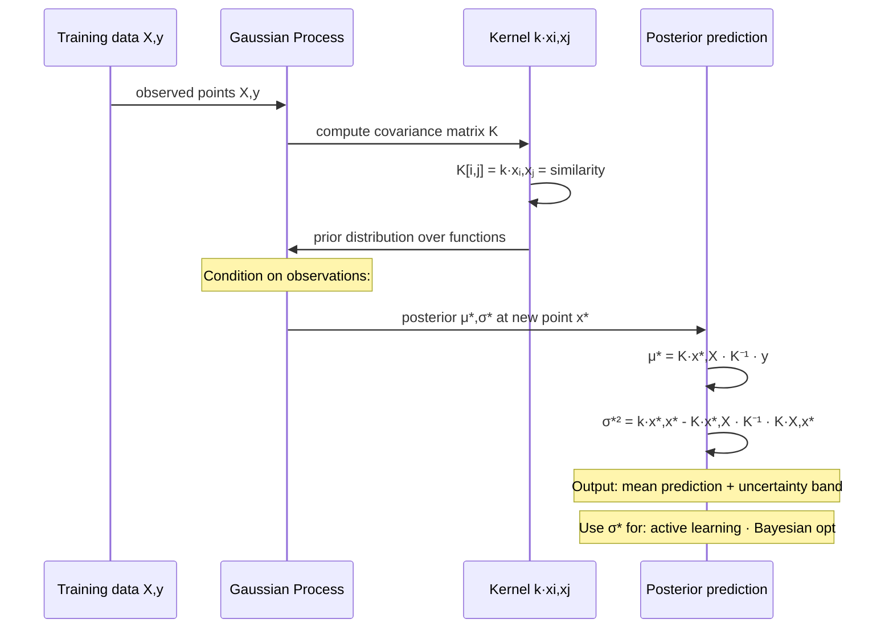

# Gaussian Processes (GPs) — Non-parametric Bayesian Regression

> The right tool when you need uncertainty quantification, small data, or principled Bayesian optimization. Foundation of many AutoML systems.

## Table of Contents

1. Objective
2. Core concept — a distribution over functions
3. The kernel — choice that defines the model
4. Posterior predictive — closed form
5. Bayesian optimization with GPs
6. Failure modes
7. Interview questions (5)
8. Further reading

---

## 1. Objective

A Gaussian Process is a **distribution over functions** — every input x has a Gaussian distribution of predicted f(x) values. Given training data, you condition the GP and get back a posterior with calibrated uncertainty everywhere.

Why interviewers ask about it: - Foundation of **Bayesian optimization** (used in hyperparameter tuning, A/B testing) - Strong baseline for **small-data regression** (< 10K points) - Gives **principled uncertainty estimates** — neural networks usually can't - Appears in **spatial statistics** (kriging) and **active learning** (where to label next)

---


> GP is the only regression model with principled, calibrated uncertainty. Neural networks predict but can't say "I'm not sure here."

## 2. Core concept — a distribution over functions

Think of a GP as an infinite-dimensional Gaussian. For any finite set of points {x_1, ..., x_n}, the function values [f(x_1), ..., f(x_n)] are jointly Gaussian:

```
[f(x_1), ..., f(x_n)] ~ N(μ_vec, K)

where K[i,j] = k(x_i, x_j)   ← kernel function (similarity)
      μ_vec  = m(x_i)          ← mean function (often 0)
```

The KERNEL k(x, x') encodes the assumption "how do f values at nearby x's relate?" Close x's → high covariance → similar f values. Far x's → low covariance → independent.

### Why "non-parametric"

GPs don't have a fixed parameter dimension — they grow with the data. With N training points, the model carries an N×N kernel matrix. **Non-parametric ≠ no parameters; it means the parameter count grows with data.**

---

## 3. The kernel — choice that defines the model

The kernel k(x, x') must be positive semi-definite. Standard choices:

### RBF / squared exponential (the default)

```
k(x, x') = σ² · exp(-||x - x'||² / (2 · l²))

- l = length-scale (how fast f changes with x)
- σ² = output variance
- Produces infinitely smooth functions
```

### Matérn (more flexible)

```
k_Matérn(x, x'; ν) = ...   parameterized by ν ∈ {1/2, 3/2, 5/2}

- ν = 1/2 → exponential kernel (rough functions)
- ν = 5/2 → smooth functions (default in most GP libs)
- Almost always Matérn(5/2) is a better default than RBF
```

### Periodic

```
k(x, x') = σ² · exp(-2 · sin²(π · (x - x') / p) / l²)

Period p — for cyclical data (daily traffic patterns).
```

### Composite kernels

Sum and product of kernels are valid kernels. Compose to express prior knowledge: `k_RBF + k_periodic` — slowly-varying + daily cycle · `k_RBF × k_linear` — non-stationary smoothness

**Kernel engineering is the modeling step.** Hyperparameters (l, σ²) are learned by maximizing marginal likelihood.

---

## 4. Posterior predictive — closed form

Given training points X = [x_1, ..., x_n], observations y, and test point x*:

```
K       = [K(X,X)]_{ij} + σ_noise² · I    (training kernel matrix + noise)
k*      = [k(x*,x_1), k(x*,x_2), ..., k(x*,x_n)]^T   (test-to-train kernel vector)
k**     = k(x*, x*)                        (test-to-test kernel)

Posterior mean:      μ* = k*^T · K⁻¹ · y
Posterior variance:  σ²* = k** - k*^T · K⁻¹ · k*
```

**That's the entire algorithm.** No gradient descent, no iterations — closed-form posterior.

### Computational cost

Inverting K is **O(N³)**, memory O(N²). With 10K training points, that's 10¹² operations — borderline. With 1M, infeasible.

For large data, use: **Sparse GPs** (inducing points, M << N): reduces to O(NM²) · **Stochastic variational GPs (SVGP):** scales to millions via SGD on the variational bound · **Approximate inference** via random Fourier features

---

## 5. Bayesian optimization with GPs

The killer application. Suppose you want to find `argmax_x f(x)` where f is expensive to evaluate (e.g., training neural net with given hyperparams; running a real-world experiment).

### The loop

```
1. Fit a GP to all (x, f(x)) observations so far
2. Use the GP's posterior to choose the next x to evaluate via an acquisition function:
   - Expected Improvement (EI): EI(x) = E[max(0, f(x) - f_best)]
     → closed form for GP posteriors
   - Upper Confidence Bound (UCB): UCB(x) = μ(x) + κ · σ(x)
     → balance exploit (μ) vs explore (κσ)
   - Thompson sampling: sample one function from the posterior, find its argmax
3. Evaluate f at that x, add to dataset
4. Repeat until budget exhausted

Result: typically finds 95% of the optimum in 50-200 evaluations vs grid search's 1000s.
```

### Tools that use it

- **scikit-optimize** (skopt) — Python GP-based BayesOpt
- **GPyOpt, BoTorch** — research-grade
- **Vertex AI Vizier, AWS SageMaker Automatic Model Tuning** — productionized BayesOpt for hyperparams
- **Optuna** — also includes TPE alternative

---

## 6. Failure modes

1. **High-dimensional inputs (d > 20)** — RBF kernel suffers curse of dimensionality. Distances become uninformative. Switch to feature-selection or use deep kernel learning (NN feature extractor + GP top).

2. **Periodic data with wrong kernel** — RBF predicts the mean far from training data. If your data is genuinely cyclical, use a periodic kernel.

3. **Mis-specified noise** — σ_noise² that's too small → GP overfits, posterior variance underestimates uncertainty. Too large → smooth predictions but unhelpful. Learn it via marginal likelihood.

4. **O(N³) cost on large data** — naive GP dies at N > ~10K. Use sparse approximations or move to neural-net-based alternatives.

5. **Multiple local optima in marginal likelihood** — hyperparameter optimization is non-convex. Multi-restart from random initializations.

6. **Stationarity assumption** — RBF assumes f's smoothness is uniform across x. Real-world data is often non-stationary (more variable in some regions). Use input-warping or non-stationary kernels.

---

## 7. Interview questions (5)

**Q1: What is a Gaussian Process?**
A: A distribution over functions where, for any finite set of inputs, the corresponding function values are jointly Gaussian. Fully specified by a mean function and a kernel function. Given training data, conditioning yields a closed-form posterior over functions with calibrated uncertainty everywhere.

**Q2: How does GP regression differ from linear regression?**
A: Linear regression assumes f is a linear function, no native uncertainty estimates per prediction. GP is non-parametric (model grows with data), assumes f is smooth (via kernel), and gives both a mean AND a variance per test point. GP is much more expressive but O(N³) inference.

**Q3: When would you use Bayesian optimization with a GP?**
A: When evaluating the objective is expensive (hyperparameter tuning, real-world experiments, simulations) and you can afford 50-200 evaluations. GP captures uncertainty about the objective; an acquisition function (EI, UCB) chooses the next x to evaluate by balancing exploit vs explore. Beats random/grid search by 10× on sample efficiency.

**Q4: How do you choose a kernel?**
A: Encode prior knowledge: smoothness → Matérn or RBF, periodicity → periodic kernel, linear trends → linear kernel. Combine via sum/product. In practice: default Matérn(5/2), tune hyperparameters via marginal-likelihood maximization. If unsure, try a few via cross-validation.

**Q5: What's the computational bottleneck and how do you scale GPs?**
A: Inverting the N×N kernel matrix is O(N³), memory O(N²). At N=10K already painful, N=100K+ infeasible. Solutions: sparse GPs with M inducing points (M << N, cost O(NM²)), stochastic variational GPs (SGD-trainable, scales to millions), or random Fourier features for stationary kernels.

---

## 8. Further reading

- Rasmussen & Williams, "Gaussian Processes for Machine Learning" — the canonical textbook, free PDF
- Bishop, PRML chapter 6 — concise treatment
- Snoek, Larochelle, Adams 2012 — "Practical Bayesian Optimization of Machine Learning Algorithms"
- Hensman et al. 2013 — Stochastic variational GPs (scalable)
- BoTorch documentation — botorch.org — modern production BayesOpt
- scikit-learn GP tutorial — for getting started
