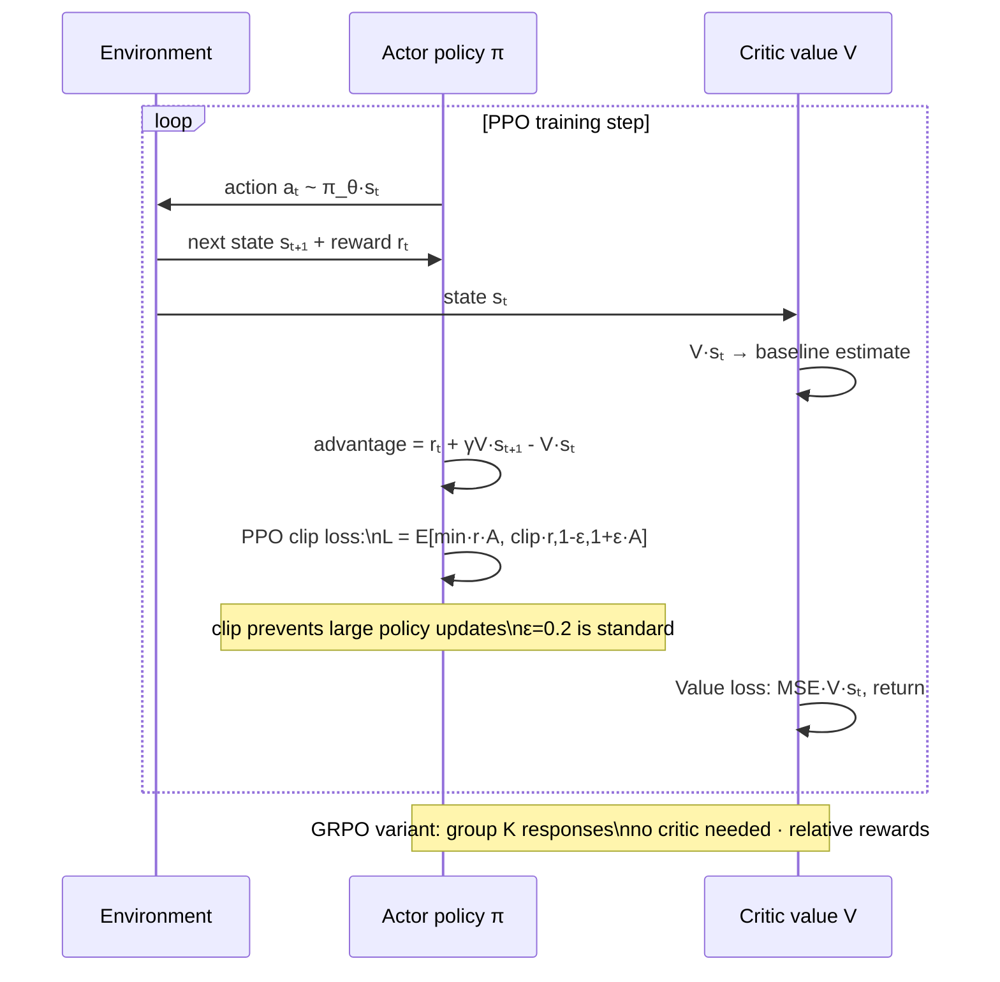

# Reinforcement Learning — Policy Gradients, Actor-Critic, PPO

> The deep dive past MDPs and value iteration. The algorithms behind game-playing AI, robotics, and RLHF/RLVR for LLMs.

## Table of Contents

1. Objective
2. The policy gradient theorem
3. REINFORCE — vanilla policy gradient
4. Actor-critic — variance reduction
5. TRPO and PPO — the modern workhorses
6. GRPO — the LLM-specific variant
7. Failure modes
8. Interview questions (5)
9. Further reading

---

## 1. Objective

Where the basic RL file leaves off (MDPs, value iteration, Q-learning), this picks up. Three things to understand at senior level: 1. **Policy gradient methods** — directly optimize the policy, not values. 2. **Actor-critic** — combine policy + value for variance reduction. 3. **PPO / GRPO** — the constrained-update algorithms behind ChatGPT and DeepSeek-R1.

**Senior interview Q:** "Explain PPO. Why does it work better than vanilla policy gradients?"

---



## 2. The policy gradient theorem

The policy is π_θ(a | s) — probability of action a given state s, parameterized by θ.

We want to maximize expected return J(θ) = E[Σ_t r_t]. Take the gradient:

```
∇_θ J(θ) = E_π_θ [ ∇_θ log π_θ(a|s) · Q(s, a) ]
```

**This is the policy gradient theorem.** Move the policy in the direction ∇ log π_θ(a|s) (makes a more likely) · Scale by Q(s, a) — how good the action was · Take expectation over trajectories from π_θ itself.

The brilliance: no need for a model of the environment. Just sample trajectories.

---

## 3. REINFORCE — vanilla policy gradient

The simplest implementation. For each episode:

```
1. Run policy π_θ for one episode, collect trajectory τ
2. For each step t in τ:
   G_t = Σ_{t'≥t} γ^{t'-t} · r_{t'}    (Monte Carlo return)
3. Compute gradient: ∇J = Σ_t ∇_θ log π_θ(a_t|s_t) · G_t
4. Update: θ = θ + α · ∇J
```

**Subtract a baseline** to reduce variance of gradient estimates:

```
∇J = Σ_t ∇_θ log π_θ(a_t|s_t) · (G_t - b(s_t))
```

Any state-only baseline preserves the gradient unbiased but reduces variance. Common choice: b(s) = V^π(s) (value function).

**Limitations:** very high variance even with baseline. Each gradient estimate uses one full trajectory's return. Modern RL uses actor-critic instead.

---

## 4. Actor-critic — variance reduction

Split the policy into two networks: · **Actor** π_θ(a | s) — picks actions · **Critic** V_φ(s) — estimates state value

**Advantage function:** A(s, a) = Q(s, a) - V(s). How much better is this action than average from this state?

Policy gradient becomes:

```
∇J = E [ ∇ log π_θ(a|s) · A(s, a) ]
```

Where A is estimated as A ≈ r + γ · V(s') - V(s) — the **TD error** (one-step), or with **GAE (Generalized Advantage Estimation)** for multi-step.

### A2C (Advantage Actor-Critic)

The simplest sync version. Train multiple actors in parallel, sync gradients. Stable, well-understood.

### A3C (Asynchronous)

Workers update a shared global network asynchronously. Faster on CPU, less common in 2026 (A2C usually preferred).

### SAC (Soft Actor-Critic)

Adds entropy regularization for exploration. Default for continuous-action robotics.

---

## 5. TRPO and PPO — the modern workhorses

### The problem PPO solves

Vanilla policy gradient can take destabilizing steps. After a large update, the policy distribution shifts dramatically — old samples become invalid, and the agent's exploration profile changes. Algorithms diverge.

### TRPO (Trust Region Policy Optimization)

Schulman et al. 2015. Constrain the KL divergence between new and old policy:

```
maximize  E [ (π_θ_new(a|s) / π_θ_old(a|s)) · A(s, a) ]
subject to E [ KL(π_θ_old || π_θ_new) ] ≤ δ
```

Solving this constrained problem requires natural gradients + line search — complex and slow. Works well but engineering-heavy.

### PPO (Proximal Policy Optimization)

Schulman et al. 2017. **PPO is just TRPO simplified.** Replace the explicit KL constraint with a **clipped surrogate objective:**

```
L_PPO(θ) = E [ min( r(θ) · A,  clip(r(θ), 1-ε, 1+ε) · A ) ]
where r(θ) = π_θ_new(a|s) / π_θ_old(a|s)
```

ε is typically 0.2. The clip prevents r(θ) from straying too far from 1 (i.e., policy from drifting too far from old).

```
If A > 0 (good action):  clip prevents r > 1+ε   (don't over-push the good action)
If A < 0 (bad action):   clip prevents r < 1-ε   (don't over-suppress)
```

### Why PPO won

- Simpler code than TRPO
- Multiple SGD steps per data batch (sample efficient)
- Hyperparameters robust
- Works on both discrete and continuous actions

PPO is the default RL algorithm for OpenAI Gym benchmarks, DeepMind games (after IMPALA), and **RLHF in InstructGPT/ChatGPT.**

---

## 6. GRPO — the LLM-specific variant

**Group Relative Policy Optimization** (DeepSeek 2024). Introduced for DeepSeekMath, used in R1.

### The change vs PPO

PPO requires a **value function (critic)** to compute advantages. For LLM RL, training a critic is expensive (another large model) and unstable.

GRPO eliminates the critic:

```
For each prompt, sample K responses from π_θ (e.g., K=64).
Compute rewards r_1, ..., r_K (from verifier — math correctness, code tests, etc.).
Advantage for response i:  A_i = (r_i - mean(r_1..r_K)) / std(r_1..r_K)
```

The advantage is **relative within the group of K samples for the same prompt.** No critic needed. Then apply the PPO clipped objective with these advantages.

### Why GRPO works for LLMs

- No critic → ~50% less compute per training step
- Relative advantage is naturally calibrated within the prompt
- Stable for very long sequences (5K+ tokens for reasoning traces)
- Used in DeepSeek-R1, DeepSeekMath, several open-source reasoning models

This is the algorithm behind 2025 reasoning models. **Senior interview Q in 2026: "What's GRPO and how does it differ from PPO?"**

---

## 7. Failure modes

1. **Reward hacking** — agent finds unintended ways to maximize reward (e.g., RLHF: model produces wordy "I'd be happy to help" that humans rate well but isn't useful). Mitigation: KL constraint to reference model (PPO does this implicitly).

2. **Catastrophic policy collapse** — large gradient step destroys policy. Mitigation: clip ratio (PPO) or trust region (TRPO).

3. **Sparse rewards** — RL stalls if reward is rare. Use reward shaping, curiosity bonuses, or RLVR (every problem has a 0/1 reward).

4. **Sample inefficiency** — RL needs many environment interactions. For LLMs each "interaction" is a forward pass on long sequences — expensive.

5. **Value function drift** — actor-critic critics can become biased over time. PPO uses GAE to reduce reliance on long-horizon critic estimates.

6. **Mode collapse in continuous actions** — policy learns to output the same action regardless of state. Mitigation: entropy bonus in objective (penalize deterministic policies).

---

## 8. Interview questions (5)

**Q1: What's the policy gradient theorem?**
A: ∇_θ J(θ) = E[∇_θ log π_θ(a|s) · Q(s, a)]. Move the policy in the direction that makes good actions more likely. The expectation is over trajectories from π_θ itself. Foundation of all policy gradient methods.

**Q2: Why does PPO work better than vanilla policy gradients?**
A: Vanilla PG can take destabilizing large steps. PPO clips the importance ratio r(θ) = π_new/π_old to stay within [1-ε, 1+ε], preventing the new policy from drifting too far from the old. Allows multiple SGD steps on the same batch without instability — both more stable AND more sample efficient.

**Q3: What is the difference between Q-learning and policy gradient methods?**
A: Q-learning learns a value function Q(s,a); the policy is implicit (argmax Q). Policy gradient learns the policy π(a|s) directly via gradient ascent on expected return. Q-learning is more sample efficient on simple problems but harder to extend to continuous actions and large action spaces. Policy gradient scales better but has higher variance.

**Q4: What's GRPO and why is it used for LLM RL?**
A: Group Relative Policy Optimization. Used in DeepSeek-R1. Eliminates PPO's value function (critic): instead, sample K responses for each prompt, compute advantage as (reward - mean reward across K) / std — so advantage is naturally calibrated. Saves ~50% compute (no critic network). Stable for very long sequences, and the relative advantage is naturally calibrated.

**Q5: How does RLHF relate to these algorithms?**
A: RLHF = SFT + reward model + RL. The RL phase typically uses PPO with the LLM as the policy, the reward model as the reward source, and a KL constraint to the reference (SFT) model to prevent reward hacking. DPO (preferred in 2024+) replaces the entire reward-model + PPO pipeline with a closed-form loss directly on preference pairs.

---

## 9. Further reading

- Sutton & Barto, "Reinforcement Learning" — the bible, free online
- Schulman et al. 2017 — PPO original paper, arXiv:1707.06347
- Schulman et al. 2015 — TRPO, arXiv:1502.05477
- Schulman et al. 2016 — GAE, arXiv:1506.02438
- Shao et al. 2024 — DeepSeekMath / GRPO, arXiv:2402.03300
- Spinning Up in Deep RL (OpenAI) — spinningup.openai.com — best practical resource
- TRL library (HuggingFace) — implements PPO/DPO/GRPO for LLMs
