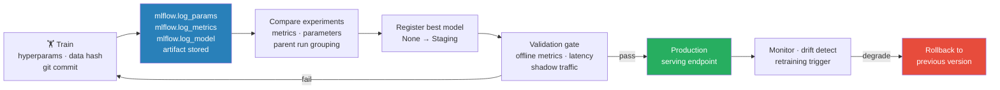

# 01 — Experiment Tracking & Reproducibility

> Every experiment logged, every result reproducible. The discipline that separates production ML from notebook ML.

---

## Quick Reference

| Tool | Best For | Key Feature |
|---|---|---|
| MLflow | Self-hosted, model registry + tracking | Model registry + tracking |
| Weights & Biases (W&B) | Teams, visualizations | Rich dashboards, sweeps |
| DVC | Data versioning | Git for data/models |
| Hydra | Config management | Hierarchical configs, multirun |
| Neptune | Metadata store | Queryable experiment database |

---

## Core Concepts



### What to Track

Every experiment should log:
```
├── Hyperparameters (all of them, not just the ones you changed)
├── Metrics (train/val loss, task metrics per epoch)
├── Artifacts (model checkpoint, tokenizer, config)
├── Dataset info (version, split sizes, hash)
├── Code version (git commit hash)
├── Environment (Python version, package versions)
└── System info (GPU type, CUDA version)
```

Why: reproduce any result 6 months later, or debug why production model differs from the best experiment you ran last quarter.

---

## MLflow

```python
import mlflow
import mlflow.pytorch
from mlflow.models import infer_signature
import torch

# — Basic tracking ————————————————————————————
mlflow.set_tracking_uri("http://localhost:5000")  # or file path for local
mlflow.set_experiment("invoice-extraction-v2")

with mlflow.start_run(run_name="deberta-v3-base-lr2e5"):
    # Log hyperparameters
    mlflow.log_params({
        "model_name": "microsoft/deberta-v3-base",
        "learning_rate": 2e-5,
        "batch_size": 16,
        "num_epochs": 10,
        "max_seq_length": 512,
        "warmup_ratio": 0.06,
        "weight_decay": 0.01,
        "seed": 42,
    })

    # Log dataset info
    mlflow.log_params({
        "train_size": 8000,
        "val_size": 1000,
        "dataset_version": "v2.3",
        "dataset_hash": compute_hash("train.json"),
    })

    # During training
    for epoch in range(num_epochs):
        train_metrics = train_one_epoch(model, train_loader)
        val_metrics = evaluate(model, val_loader)

        mlflow.log_metrics({
            "train_loss": train_metrics["loss"],
            "val_loss": val_metrics["loss"],
            "val_f1": val_metrics["f1"],
            "val_precision": val_metrics["precision"],
            "val_recall": val_metrics["recall"],
        }, step=epoch)

    # Log best model
    mlflow.log_metric("best_val_f1", best_f1)

    # Save model artifact
    signature = infer_signature(sample_input, sample_output)
    mlflow.pytorch.log_model(
        model,
        "model",
        signature=signature,
        registered_model_name="invoice-extractor",  # adds to Model Registry
    )

    # Log other artifacts
    mlflow.log_artifact("configs/config.yaml")
    mlflow.log_artifact("requirements.txt")
    mlflow.log_dict({"id2label": id2label, "label2id": label2id, "label_map.json"})

# — Model Registry ————————————————————————————
client = mlflow.MlflowClient()

# Transition model through stages
client.transition_model_version_stage(
    name="invoice-extractor",
    version=3,
    stage="Staging",   # None → Staging → Production → Archived
)

# Load from registry
model = mlflow.pytorch.load_model("models:/invoice-extractor/Production")

# — Query past experiments ————————————————————
runs = mlflow.search_runs(
    experiment_names=["invoice-extraction-v2"],
    filter_string="metrics.val_f1 > 0.90 and params.model_name LIKE '%deberta%'",
    order_by=["metrics.val_f1 DESC"],
    max_results=10,
)
print(runs[["run_id", "params.learning_rate", "metrics.val_f1"]].head())
```

---

## Weights & Biases (W&B)

```python
import wandb
from transformers import TrainingArguments, Trainer

# — Initialize run ————————————————————————————
run = wandb.init(
    project="invoice-extraction",
    name="layoutlmv3-base-run-43",
    tags=["layoutlmv3", "token-classification", "baseline"],
    notes="Testing LayoutLMv3 with augmented training data",
    config={
        "model": "microsoft/layoutlmv3-base",
        "learning_rate": 5e-5,
        "batch_size": 8,
        "epochs": 20,
        "dataset_version": "v3.0",
    },
    group="layoutlmv3-experiments",  # group related runs
)

# — HuggingFace Trainer integration (automatic) ———
training_args = TrainingArguments(
    output_dir="./results",
    report_to="wandb",    # just add this!
    run_name="layoutlmv3-base-lr5e5",
    # ... other args
)

# — Manual logging ————————————————————————————
for epoch in range(epochs):
    metrics = train_one_epoch(model, loader)
    wandb.log({
        "epoch": epoch,
        "train/loss": metrics["loss"],
        "val/f1": metrics["val_f1"],
        "val/precision": metrics["val_precision"],
        "learning_rate": scheduler.get_last_lr()[0],
    })

    # Log images (for CV tasks)
    wandb.log({
        "predictions": [
            wandb.Image(img, caption=f"Pred: {pred}, True: {true}")
            for img, pred, true in sample_predictions
        ]
    })

# — Hyperparameter sweeps —————————————————————
sweep_config = {
    "method": "bayes",   # "grid", "random", "bayes"
    "metric": {"goal": "maximize", "name": "val/f1"},
    "parameters": {
        "learning_rate": {"distribution": "log_uniform_values", "min": 1e-5, "max": 1e-4},
        "batch_size": {"values": [4, 8, 16]},
        "warmup_ratio": {"values": [0.03, 0.06, 0.1]},
        "weight_decay": {"distribution": "uniform", "min": 0.0, "max": 0.1},
    },
}

sweep_id = wandb.sweep(sweep_config, project="invoice-extraction")
wandb.agent(sweep_id, function=train_fn, count=20)  # run 20 trials
```

---

## DVC (Data Version Control)

```bash
# Git for data + models — tracks large files without storing in git

# Initialize
git init && dvc init

# Track a dataset
dvc add data/train.jsonl     # creates data/train.jsonl.dvc (tracked by git)
git add data/train.jsonl.dvc .gitignore
git commit -m "Add training dataset v1"

# Push data to remote storage (S3, GCS, Azure, SSH)
dvc remote add myremote s3://my-bucket/dvc-store
dvc push

# Reproduce entire pipeline
# dvc.yaml defines stages
```

```yaml
# dvc.yaml
stages:
  preprocess:
    cmd: python preprocess.py --input data/raw --output data/processed
    deps:
      - preprocess.py
      - data/raw
    outs:
      - data/processed

  train:
    cmd: python train.py --data data/processed --output models/
    deps:
      - train.py
      - data/processed
      - configs/train_config.yaml
    outs:
      - models/best_model/
    metrics:
      - metrics/eval_results.json:
          cache: false  # track in git, not DVC

  evaluate:
    cmd: python evaluate.py --model models/best_model --test data/test
    deps:
      - evaluate.py
      - models/best_model/
      - data/test
    metrics:
      - metrics/test_results.json:
          cache: false
```

```bash
# Run pipeline (skips stages where dependencies haven't changed)
dvc repro

# Check what changed
dvc status

# Compare metrics between versions
dvc metrics diff HEAD~1 HEAD

# Switch to a previous data version
git checkout v1.0
dvc checkout  # pulls the data corresponding to that commit
```

---

## Hydra (Configuration Management)

```yaml
# configs/config.yaml
defaults:
  - model: deberta_base
  - training: default
  - data: invoice_v2

# configs/model/deberta_base.yaml
name: microsoft/deberta-v3-base
num_labels: 9
dropout: 0.1

# configs/training/default.yaml
learning_rate: 2e-5
batch_size: 16
num_epochs: 10
warmup_ratio: 0.06
weight_decay: 0.01
fp16: true
seed: 42
```

```python
import hydra
from omegaconf import DictConfig, OmegaConf

@hydra.main(config_path="configs", config_name="config", version_base="1.3")
def train(cfg: DictConfig) -> float:
    print(OmegaConf.to_yaml(cfg))  # print full resolved config

    # Access config
    model = load_model(cfg.model.name, num_labels=cfg.model.num_labels)
    optimizer = AdamW(model.parameters(), lr=cfg.training.learning_rate)

    # ... training logic ...

    return best_val_f1

if __name__ == "__main__":
    train()

# Override any config value from command line
# python train.py training.learning_rate=1e-5 training.batch_size=8

# Multirun: grid search across multiple values
# python train.py --multirun training.learning_rate=1e-5,2e-5,5e-5 training.batch_size=8,16

# Use a different model config
# python train.py model=layoutlmv3_base
```

---

## Reproducibility Checklist

```python
import random
import numpy as np
import torch

def set_seed(seed: int = 42):
    """Full reproducibility setup."""
    random.seed(seed)
    np.random.seed(seed)
    torch.manual_seed(seed)
    torch.cuda.manual_seed_all(seed)
    torch.backends.cudnn.deterministic = True
    torch.backends.cudnn.benchmark = False  # slower but deterministic

# Environment snapshot
def log_environment():
    import subprocess
    return (
        "python_version": sys.version,
        "pytorch_version": torch.__version__,
        "cuda": torch.cuda.get_device_name(0) if torch.cuda.is_available() else "CPU",
        "git_commit": subprocess.check_output(['git', 'rev-parse', 'HEAD']).decode().strip(),
        "packages": subprocess.check_output(['pip', 'freeze']).decode(),
    )
```

---

## Gotchas

**Non-determinism sources:** Even with `set_seed`, GPU operations with `torch.use_deterministic_algorithms(True)` may raise errors for some ops. DataLoader shuffle order, multiprocessing, and cuDNN convolution algorithms are common non-determinism sources. Log git hash and requirements.txt for reproducibility.

**Log early and often:** Don't wait until the end to log metrics. A crashed experiment with no logged metrics is wasted compute. Log every N steps, not just per epoch.

**Model registry ≠ experiment tracking:** Track every experiment run; register only models that are candidates for deployment. The registry is your deployment pipeline, not your analysis workspace.

**Config drift:** Training with different configs than what's in the config file is the most common reproducibility bug. Always load hyperparameters from config files, never hardcode in training scripts.

---

## Interview Q&A

**Q: How do you ensure reproducibility in ML experiments?**

Four pillars: (1) Seed everything — `random`, `numpy`, `torch`, CUDA, `set cudnn.deterministic=True`; (2) Version everything — dataset hash, git commit hash, `requirements.txt` snapshot; (3) Track everything — every hyperparameter logged (not just the changed ones), not hardcoded in scripts; (4) Pipeline as code — DVC or Makefile to reproduce the full training pipeline from raw data. The test: can a new engineer reproduce your best result in under 30 minutes?

**Q: What would you track in an ML experiment beyond just metrics?**

All hyperparameters (all of them, not just the ones you changed) — model architecture, optimizer settings, data augmentation; metadata (version, size, hash, split counts); environment (Python version, CUDA/PyTorch version, git commit); training dynamics (learning rate schedule, gradient norms, training loss curve); evaluation on hard examples and artifacts (model checkpoint, tokenizer, config files). Rich tracking enables diagnosis — retroactive tracking is impossible.

---

## Connections

- Model Evaluation (`ML/fundamentals/04`): Metrics tracked here are evaluated there
- LLM Fine-tuning (`5.llms/02`): W&B is standard for LLM training runs
- MLOps Serving (`7.mlops/02`): Model registry co-connects experiment tracking to deployment

## Key Takeaway

```
MLflow for self-hosted model registry + tracking. W&B for team dashboards + hyperparameter sweeps.
DVC for dataset versioning. Hydra for config management. The reproducibility contract:
git commit + DVC data version + logged hyperparameters → identical training result.
Track everything from day 1 — retroactive tracking is impossible.
```
