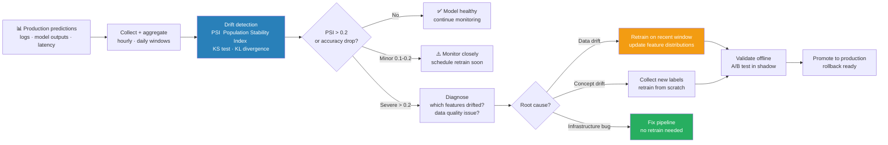

# 09 — Monitoring & Drift Detection — End to End

> Workflow: Collect predictions → Detect drift → Alert → Diagnose → Retrain trigger

---



## Why Models Degrade

```
Training data: Jan-Dec 2023 invoice data
Serving starts: Jan 2024

Month 1 (Jan):  AUC 0.922 → stable
Month 3 (Mar):  AUC 0.901 → slight drop
Month 6 (Jun):  AUC 0.871 → noticeable degradation
Month 9 (Sep):  AUC 0.812 → critical

Why? Three types of drift:

1. Data drift (covariate shift):
   Input distribution P(X) changed.
   Example: new invoice formats from a vendor, new currencies appearing.
   Input features look different from training distribution.
   Model may still be correct in theory, but features are out-of-distribution.

2. Concept drift (label shift):
   The relationship P(Y|X) changed.
   Example: fraud patterns evolved, new fraud techniques model hasn't seen.
   Even if inputs look the same, the correct labels have changed.

3. Label drift (prior probability shift):
   Class balance P(Y) changed.
   Example: fraud rate jumped from 2% to 8% (bank under attack).
   Model calibration breaks; threshold needs recalibration.
```

---

## Monitoring Architecture

```
Production traffic
        ↓
┌─────────────────────┐
│ Serving Layer        │
│ - Log: input features│
│ - Log: predictions   │
│ - Log: latency       │
└─────────────────────┘
        ↓ prediction log (Kafka / S3)
┌─────────────────────┐
│ Feature store/data   │
│ lake                 │
│ - Ground truth labels│
│   (delayed)          │
│ - Join predictions + │
│   labels             │
└─────────────────────┘
        ↓
┌─────────────────────┐
│ Monitoring pipeline  │
│ - Data drift detect. │
│ - Performance metrics│
│ - Alerting rules     │
└─────────────────────┘
        ↓
  Dashboard        Alerts
  (Grafana)   (PagerDuty/Slack)
        ↓
  Retrain trigger
```

---

## Step 1: Log Predictions to Data Store

```python
import json
import time
import uuid
import boto3
from datetime import datetime
import numpy as np

class PredictionLogger:
    def __init__(self, s3_bucket: str, prefix: str = "predictions"):
        self.s3 = boto3.client("s3")
        self.bucket = s3_bucket
        self.prefix = prefix
        self.buffer = []
        self.buffer_size = 1000

    def log(self, features: dict, prediction: float, model_version: str):
        record = {
            "id":            str(uuid.uuid4()),
            "timestamp":     datetime.utcnow().isoformat(),
            "model_version": model_version,
            "features":      features,
            "prediction":    prediction,
            "label":         None,  # filled in later when ground truth arrives
        }
        self.buffer.append(record)
        if len(self.buffer) >= self.buffer_size:
            self.flush()

    def flush(self):
        if not self.buffer:
            return
        key = f"{self.prefix}/{datetime.utcnow().strftime('%Y/%m/%d/%H')}/{uuid.uuid4()}.json"
        body = "\n".join(json.dumps(r) for r in self.buffer)
        self.s3.put_object(Bucket=self.bucket, Key=key, Body=body)
        self.buffer = []

# In serving endpoint
logger = PredictionLogger("ml-predictions-prod")

def predict(invoice_features: dict):
    prediction = model.predict_proba(list(invoice_features.values()))[0][1]
    logger.log(
        features=invoice_features,
        prediction=prediction,
        model_version="invoice-classifier/5"
    )
    return {"score": prediction, "label": int(prediction > 0.42)}
```

---

## Step 2: Data Drift Detection

### Statistical Tests

```python
import numpy as np
import pandas as pd
from scipy import stats

def detect_data_drift(reference_data: pd.DataFrame,
                      current_data: pd.DataFrame,
                      alpha: float = 0.05) -> dict:
    """
    Compare current serving data distribution to training reference data.
    Returns per-feature drift scores and flags.
    """
    results = {}

    for col in reference_data.columns:
        ref = reference_data[col].dropna().values
        cur = current_data[col].dropna().values

        if reference_data[col].dtype in ['float64', 'int64']:
            # Continuous: Kolmogorov-Smirnov test
            ks_stat, p_value = stats.ks_2samp(ref, cur)
            drifted = p_value < alpha

            # Population Stability Index (PSI)
            psi = compute_psi(ref, cur, bins=10)
            # PSI < 0.1: no drift, 0.1-0.2: minor, > 0.2: significant

            results[col] = {
                "test":       "KS",
                "statistic":  round(ks_stat, 4),
                "p_value":    round(p_value, 4),
                "psi":        round(psi, 4),
                "drifted":    drifted or psi > 0.2,
            }
        else:
            # Categorical: Chi-squared test
            categories = list(set(ref) | set(cur))
            ref_counts = pd.Series(ref).value_counts().reindex(categories, fill_value=0)
            cur_counts = pd.Series(cur).value_counts().reindex(categories, fill_value=0)

            chi2, p_value = stats.chisquare(
                f_obs=cur_counts / cur_counts.sum(),
                f_exp=ref_counts / ref_counts.sum()
            )
            results[col] = {
                "test":      "chi2",
                "statistic": round(chi2, 4),
                "p_value":   round(p_value, 4),
                "drifted":   p_value < alpha,
            }

    return results

def compute_psi(reference: np.ndarray, current: np.ndarray, bins: int = 10) -> float:
    """Population Stability Index — measures distribution shift."""
    # Create bins from reference
    breakpoints = np.percentile(reference, np.linspace(0, 100, bins + 1))
    breakpoints = np.unique(breakpoints)   # remove duplicates

    ref_counts = np.histogram(reference, bins=breakpoints)[0]
    cur_counts = np.histogram(current, bins=breakpoints)[0]

    # Normalize, add small epsilon to avoid log(0)
    ref_pct = ref_counts / len(reference) + 1e-6
    cur_pct = cur_counts / len(current) + 1e-6

    psi = np.sum((cur_pct - ref_pct) * np.log(cur_pct / ref_pct))
    return psi
```

### Dry Run — Drift Detection

```
Training data (Jan 2023):
  invoice_amount: mean=$1,200, std=$890, range=[50, 45,000]

April 2024 serving data:
  invoice_amount: mean=$1,800, std=$1,420, range=[80, 95,000]
  (new enterprise customers → higher amounts)

KS test:
  KS statistic = 0.31  (0=identical, 1=completely different)
  p-value = 0.0002 < 0.05 → DRIFT DETECTED

PSI calculation (10 bins):
  Bin [50-500]:    ref=32%, cur=11%  (0.18-0.32)×log(0.18/0.32) = -0.14×(-0.575) = 0.081
  Bin [500-1500]:  ref=38%, cur=22%  small contribution              = 0.004
  Bin [1500-5000]: ref=22%, cur=35%  positive contribution           = 0.034
  Bin [5000+]:     ref=10%, cur=20%  positive contribution           = 0.041
  PSI total = 0.081 + 0.004 + 0.034 + 0.041 = 0.160

PSI 0.160 is in [0.1, 0.2] → minor drift
KS p-value < 0.05 → statistically significant

Decision: flag for investigation, but not immediate retrain trigger.
Monitor for 2 more weeks; if PSI > 0.20, trigger retrain.
```

---

## Step 3: Performance Monitoring (with Labels)

```python
import mlflow
import pandas as pd
import numpy as np
from sklearn.metrics import roc_auc_score, f1_score, precision_score, recall_score
from datetime import datetime, timedelta

def compute_rolling_metrics(predictions_df: pd.DataFrame,
                             window_days: int = 7) -> pd.DataFrame:
    """
    predictions_df columns: timestamp, prediction, label, model_version
    Returns daily AUC, F1, precision, recall.
    """
    predictions_df['date'] = pd.to_datetime(predictions_df['timestamp']).dt.date
    results = []

    for date, group in predictions_df.groupby('date'):
        # Only compute if we have both predictions and labels
        labeled = group.dropna(subset=['label'])
        if len(labeled) < 100:   # need minimum sample size
            continue

        y_true = labeled['label'].values
        y_prob = labeled['prediction'].values
        y_pred = (y_prob > 0.42).astype(int)

        results.append({
            "date":       date,
            "n_samples":  len(labeled),
            "auc":        roc_auc_score(y_true, y_prob),
            "f1":         f1_score(y_true, y_pred),
            "precision":  precision_score(y_true, y_pred),
            "recall":     recall_score(y_true, y_pred),
            "pred_rate":  y_pred.mean(),  # fraction predicted positive
        })

    return pd.DataFrame(results)

# Log metrics to MLflow for Grafana dashboard
def log_monitoring_metrics(metrics_df: pd.DataFrame, model_name: str):
    with mlflow.start_run(run_name=f"monitoring_{datetime.today().date()}"):
        for _, row in metrics_df.iterrows():
            mlflow.log_metrics({
                "monitor_auc":       row["auc"],
                "monitor_f1":        row["f1"],
                "monitor_pred_rate": row["pred_rate"],
            }, step=int(row["date"].strftime("%Y%m%d")))
```

---

## Step 4: Alerting Rules

```python
import smtplib
import requests
from dataclasses import dataclass
from typing import Optional

@dataclass
class AlertThresholds:
    auc_min:           float = 0.88   # alert if AUC drops below this
    auc_regression_pct:float = 0.03   # alert if AUC drops 3% from baseline
    psi_warning:       float = 0.10   # PSI warning threshold
    psi_critical:      float = 0.20   # PSI critical threshold
    pred_rate_change:  float = 0.05   # alert if positive prediction rate shifts >5%
    latency_p95_ms:    float = 100    # alert if p95 latency > 100ms

class AlertManager:
    def __init__(self, slack_webhook: str, pagerduty_key: str):
        self.slack_webhook = slack_webhook
        self.pagerduty_key = pagerduty_key
        self.thresholds    = AlertThresholds()
        self.baseline_auc  = None  # set from first week of production

    def check_and_alert(self, metrics: dict, drift_results: dict):
        alerts = []

        # 1. AUC drop
        if self.baseline_auc and metrics['auc'] < self.baseline_auc - \
                self.thresholds.auc_regression_pct:
            alerts.append({
                "severity": "critical",
                "message":  f"AUC dropped from {self.baseline_auc:.3f} to "
                            f"{metrics['auc']:.3f} "
                            f"({(self.baseline_auc - metrics['auc'])*100:.1f}% regression)",
                "action":   "RETRAIN TRIGGER",
            })
        elif metrics['auc'] < self.thresholds.auc_min:
            alerts.append({
                "severity": "warning",
                "message":  f"AUC {metrics['auc']:.3f} below threshold",
                "action":   "Investigate drift",
            })

        # 2. Data drift
        for feature, result in drift_results.items():
            if result.get('psi', 0) > self.thresholds.psi_critical:
                alerts.append({
                    "severity": "critical",
                    "message":  f"Critical drift on feature '{feature}': "
                                f"PSI={result['psi']:.3f}",
                    "action":   "RETRAIN TRIGGER",
                })
            elif result.get('drifted'):
                alerts.append({
                    "severity": "warning",
                    "message":  f"Drift detected on feature '{feature}': "
                                f"p={result['p_value']:.4f}",
                    "action":   "Monitor closely",
                })

        # 3. Prediction rate shift (proxy for concept drift when no labels yet)
        if abs(metrics['pred_rate'] - metrics.get('baseline_pred_rate', 0.10)) > \
                self.thresholds.pred_rate_change:
            alerts.append({
                "severity": "warning",
                "message":  f"Prediction rate shifted to {metrics['pred_rate']:.3f} "
                            f"(baseline {metrics.get('baseline_pred_rate', 0.10):.3f})",
                "action":   "Check for label drift",
            })

        for alert in alerts:
            self._send_slack(alert)
            if alert["severity"] == "critical":
                self._send_pagerduty(alert)

        return alerts

    def _send_slack(self, alert: dict):
        emoji = "🔴" if alert["severity"] == "critical" else "🟡"
        payload = {
            "text": f"{emoji} *ML Monitoring Alert*\n"
                    f"*Message:* {alert['message']}\n"
                    f"*Action:* {alert['action']}"
        }
        requests.post(self.slack_webhook, json=payload)

    def _send_pagerduty(self, alert: dict):
        payload = {
            "routing_key":   self.pagerduty_key,
            "event_action":  "trigger",
            "payload": {
                "summary":  alert["message"],
                "severity": "critical",
                "source":   "ml-monitoring",
            },
        }
        requests.post("https://events.pagerduty.com/v2/enqueue", json=payload)
```

---

## Step 5: Retraining Trigger

```python
import mlflow
from datetime import datetime

class RetrainingTrigger:
    """
    Decides when to retrain based on monitoring signals.
    Three trigger modes: scheduled, performance-based, drift-based.
    """
    def should_retrain(self, metrics_history: list[dict]) -> tuple[bool, str]:
        latest = metrics_history[-1]
        baseline_auc = metrics_history[0]["auc"]   # week 1 production AUC

        # 1. Performance trigger
        if latest["auc"] < baseline_auc - 0.03:
            return True, f"AUC Regression: {baseline_auc:.3f} → {latest['auc']:.3f}"

        # 2. Drift trigger
        if latest.get("max_psi", 0) > 0.20:
            return True, f"Critical data drift: PSI={latest['max_psi']:.3f}"

        # 3. Scheduled trigger (monthly regardless of metrics)
        days_since_train = latest.get("days_since_training", 0)
        if days_since_train >= 30:
            return True, f"Scheduled retrain: {days_since_train} days since last train"

        # 4. Data volume trigger (enough new labeled data)
        new_labeled_samples = latest.get("new_labeled_samples", 0)
        if new_labeled_samples >= 10_000:
            return True, f"Enough new data: {new_labeled_samples} samples"

        return False, "No trigger conditions met"

def trigger_retraining_pipeline(reason: str):
    """Kick off retraining via CI or orchestrator."""
    print(f"[{datetime.now()}] RETRAIN TRIGGERED: {reason}")

    # Option A: GitHub Actions webhook
    import requests
    requests.post(
        "https://api.github.com/repos/org/ml-repo/dispatches",
        headers={"Authorization": f"token {GH_TOKEN}"},
        json={"event_type": "retrain", "client_payload": {"reason": reason}},
    )

    # Option B: Airflow REST API
    requests.post(
        "http://airflow:8080/api/v1/dags/invoice_classifier_retrain/dagRuns",
        json={"conf": {"reason": reason, "triggered_at": datetime.now().isoformat()}},
        auth=("admin", "password"),
    )
```

---

## Full Monitoring Pipeline (Scheduled Daily)

```python
# monitoring_pipeline.py — runs daily via Airflow/cron

def run_daily_monitoring():
    # 1. Load yesterday's predictions + ground truth labels
    predictions = load_predictions(date=yesterday())
    reference   = load_reference_data("training_reference.parquet")

    # 2. Data drift detection
    drift_results = detect_data_drift(reference, predictions[features])

    # 3. Performance metrics (if labels available)
    labeled = predictions.dropna(subset=["label"])
    if len(labeled) >= 100:
        metrics = {
            "auc":              roc_auc_score(labeled["label"], labeled["prediction"]),
            "f1":               f1_score(labeled["label"], labeled["prediction"] > 0.42),
            "pred_rate":        (predictions["prediction"] > 0.42).mean(),
            "max_psi":          max(r.get("psi", 0) for r in drift_results.values()),
            "days_since_training": (datetime.today() - MODEL_TRAIN_DATE).days,
            "new_labeled_samples": len(labeled),
        }
    else:
        # No labels yet — monitor drift + prediction rate only
        metrics = {
            "pred_rate": (predictions["prediction"] > 0.42).mean(),
            "max_psi":   max(r.get("psi", 0) for r in drift_results.values()),
        }

    # 4. Alert
    alerts = alert_manager.check_and_alert(metrics, drift_results)

    # 5. Retrain trigger
    should_retrain, reason = trigger.should_retrain(metrics_history)
    if should_retrain:
        trigger_retraining_pipeline(reason)

    # 6. Log to MLflow for dashboard
    with mlflow.start_run(run_name=f"monitor_{yesterday()}"):
        mlflow.log_metrics(metrics)
        mlflow.log_dict(drift_results, "drift_report.json")

    print(f"Monitoring complete. Alerts: {len(alerts)}. Retrain: {should_retrain}")
```

---

## Dry Run — Full Monitoring Cycle

```
Day 0 (model deployed): baseline AUC = 0.923, pred_rate = 0.140

Day 30 monitoring run:
  AUC: 0.901  (drift = -0.022, below 0.03 threshold → no trigger)
  pred_rate: 0.152  (change +0.004, below 0.05 threshold → no trigger)
  PSI (invoice_amount): 0.168  (minor drift, warning sent to Slack)
  PSI (vendor_country): 0.08   (no drift)
  → Slack 🟡 minor drift on invoice_amount. Monitor closely.
  → No retrain triggered.

Day 60 monitoring run:
  AUC: 0.871  (drift = -0.052 > 0.03 threshold → TRIGGER)
  pred_rate: 0.201  (change +0.061 > 0.05 threshold → label drift warning)
  PSI (invoice_amount): 0.236  (> 0.20 → TRIGGER)
  → Slack 🔴 AUC regression 0.923 → 0.871. RETRAIN TRIGGER.
  → PagerDuty: Critical drift on invoice_amount PSI=0.236. RETRAIN TRIGGER.
  → Airflow DAG 'invoice_classifier_retrain' triggered.
  → Retrain on data Jan 2023 – Jun 2024 (includes new enterprise invoices)
  → New model AUC: 0.934 on holdout
  → Staging validation: passed
  → Production: version 6 deployed

Day 61: baseline reset to AUC = 0.934
```

---

## Monitoring Tools Comparison

```
| Tool                | Best for                       | Key feature                         |
|---------------------|-------------------------------|-------------------------------------|
| Evidently AI        | Fast drift reports, open-source| Pre-built HTML dashboards, DataDriftPreset |
| Grafana + Prometheus| Real-time metrics, latency    | Time-series panels, alerting rules  |
| WhyLogs / WhyLabs   | Lightweight logging           | Sketch-based statistics, low overhead |
| Arize / Fiddler     | Enterprise MLOps              | Explainability, embedding drift     |
| MLflow              | Experiment + metric tracking  | Registry integration                |
```

```python
# Evidently AI quick start
from evidently.report import Report
from evidently.metric_preset import DataDriftPreset, TargetDriftPreset

report = Report(metrics=[DataDriftPreset(), TargetDriftPreset()])
report.run(reference_data=reference_df, current_data=current_df)
report.save_html("drift_report.html")
# → HTML report with per-feature drift tests, PSI, distribution plots
```

---

## Gotchas

**Ground truth latency.** Labels often arrive hours to weeks after predictions (e.g., fraud confirmed after investigation). Monitor input drift and prediction rate immediately; performance metrics only once labels arrive. Don't wait for labels to detect all problems.

**Statistical vs practical significance.** With 1M daily predictions, a KS test will flag almost any change as significant (high power). Always check both p-value AND effect size (PSI, KS statistic). A PSI of 0.02 is statistically significant but practically irrelevant.

**Reference dataset choice.** The "reference" should be representative of what the model expects. Use training data or first month of stable production data — not all historical data (which includes the period you're trying to detect drift from).

**Prediction rate as a free drift signal.** When ground truth labels are delayed, the fraction of positive predictions is a free proxy. If your model always predicted 15% positive and suddenly predicts 40%, something changed — even before you have any labels.

---

## Interview Q&A

**Q: What is the difference between data drift and concept drift?**

Data drift (covariate shift): input distribution P(X) changed — e.g., new invoice formats, new currencies. Model may still be correct, but inputs are out-of-distribution. Concept drift: the relationship P(Y|X) changed — e.g., fraud patterns evolved, new fraud techniques model hasn't seen. Data drift is detectable without labels (compare feature distributions). Concept drift requires labels to detect directly, but prediction rate shifts can be an early proxy.

**Q: How do you detect drift without ground truth labels?**

Three approaches: (1) Input feature monitoring — compare serving feature distributions to training reference using KS test or PSI per feature; (2) Prediction rate monitoring — track fraction of positive predictions; a sudden shift suggests the model is seeing different inputs; (3) Embedding drift — if using a neural model, track the distribution of intermediate embeddings (e.g., last layer activations) using distance metrics. Labels are only needed for performance metrics (AUC, F1).

**Q: When should you retrain vs recalibrate?**

Recalibrate (adjust decision threshold) when: prediction rate shifted but AUC is stable. The model still ranks items correctly, just the calibration is off — adjust threshold from 0.42 to 0.55. Retrain when: AUC drops (model is no longer discriminating well), or significant input drift (model hasn't seen new distribution). Recalibration is cheap (no GPU needed); retrain is expensive — use recalibration as a quick fix while retraining runs.

---

## Connections

- Model registry (`8.mlops/08`): rollback when monitoring triggers
- Serving and inference (`8.mlops/02`): logging predictions from serving layer
- Pipelines (`8.mlops/04`): retraining DAG triggered by monitoring
- Reference theory (`8.mlops/03`): statistical tests, PSI explained

## Key Takeaway

```
Monitor three things:
  (1) Data drift — compare input feature distributions to training reference
      using KS test + PSI
  (2) Performance metrics — AUC/F1 on labeled window
  (3) Prediction rate — free early-warning signal before labels arrive

Alert on: AUC regression >3%, PSI >0.20, prediction rate shift >5%.
Recalibrate threshold when AUC is stable but calibration shifted.
Ground truth latency is the hardest practical challenge — most production
systems can only detect input drift in real time.
```
