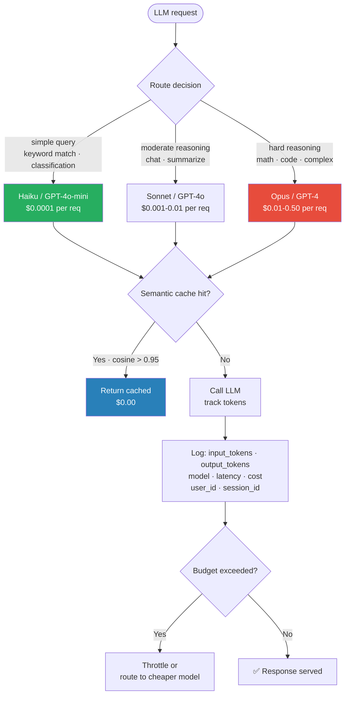

# 12 — LLM Cost Tracking + Model Routing

> The economics layer of production LLMs. How to know what you're spending and how to spend less without losing quality.

---

## 1. Objective

LLM cost is wildly variable per request: a math reasoning query with GPT-4 can cost $0.50; a chat query with Haiku can cost $0.0001. Without explicit tracking and routing, cost explodes silently.

Senior interview Q: "How do you control LLM costs at scale?" or "When would you route to a cheaper model?"

---



## 2. The Cost Components

```
total_cost = input_tokens × $/1k_input + output_tokens × $/1k_output
```

Approximate 2025 prices (per 1M tokens, in / out):

```
| Model                      | Input ($/1M) | Output ($/1M) | Best for                    |
|----------------------------|-------------|---------------|-----------------------------|
| GPT-4o                     | $2.50       | $10.00        | General reasoning           |
| GPT-4o-mini                | $0.15       | $0.60         | Routing target for "easy"   |
| Claude 3.5 Sonnet          | $3.00       | $15.00        | Quality reasoning           |
| Claude Haiku 3.5           | $1.00       | $5.00         | Cost-quality tradeoff       |
| o3-mini                    | $1.10       | $4.40         | Reasoning (cheap variant)   |
| o3                         | $30+        | $60+          | Hard reasoning (expensive)  |
| Llama-3.1-70B (vLLM self-host) | ~$0.50  | ~$0.75        | Open-source production      |
| Llama-3.1-8B               | ~$0.10      | ~$0.10        | Cost-optimized open         |
```

Output is ~3-4× input cost for most models. Long outputs are expensive.

For agentic / chain applications: total cost compounds. A single user query can trigger 5-20 LLM calls. Cost per user query: $0.05–$2.00 is realistic.

---

## 3. Token-Level Tracking

For accurate cost tracking, log:

```json
{
  "request_id": "req_abc123",
  "user_id": "user_42",
  "tenant_id": "acme_corp",
  "feature": "qa_chat",
  "model": "gpt-4o-2024-08-06",
  "input_tokens": 1207,
  "output_tokens": 384,
  "input_cost_usd": 0.003118,
  "output_cost_usd": 0.003840,
  "total_cost_usd": 0.006958,
  "latency_ms": 1842,
  "timestamp": "2025-..."
}
```

Aggregate daily/weekly:
- Per user (alert on abusers)
- Per tenant (charge back)
- Per feature (which features are expensive)
- Per model (model mix matters)

Tools that automate this: LangFuse, Helicone (per-request cost computed and aggregated in dashboard); Arize, Datadog LLM (enterprise versions with budget alerts); OpenAI usage dashboard (basic but free, lacks per-user/per-feature breakdown).

"I don't know what my LLM costs" is a junior answer. Senior engineers can produce per-feature cost breakdowns within minutes.

---

## 4. Model Routing Strategies

The biggest cost-reduction lever: **send easy queries to cheap models, hard queries to expensive ones.**

### Strategy 1: Query Classifier

A small classifier (LLM or rule-based) decides which model based on query type.

```python
def route(query):
    if is_simple_lookup(query):
        return "claude-haiku"      # FAQ, simple Q&A
    if has_math_or_code(query):
        return "gpt-4o"            # needs reasoning
    if query_length(query) > 5000:
        return "o1"                # long context
    return "gpt-4o-mini"           # default
```

### Strategy 2: Cascading Retry

Start with the cheap model. If output quality fails a check, retry with the expensive model.

```python
def cascade(query):
    cheap_response = haiku.generate(query)
    if quality_check(cheap_response) >= 0.8:
        return cheap_response          # ~80% of queries
    return gpt4o.generate(query)       # fallback for hard cases

# Cost:  ~20% of queries pay 5× cost; 80% pay 1× cost
# Net:   ~2× cost vs cheap-only, ~50% cost vs expensive-only
# Quality: close to expensive-only
```

### Strategy 3: Confidence-Based Routing

For tasks with structured output, the cheap model's confidence (logprob) indicates whether to escalate.

```python
def route_on_confidence(query):
    response = cheap_model.generate(query, logprobs=True)
    if response.avg_logprob < -0.5:   # low confidence
        return expensive_model.generate(query)
    return response
```

### Strategy 4: User-Tier Routing

Free users → cheap models. Paid users → premium models. Easiest to implement, less optimal than per-query.

### Tool Ecosystem

```
OpenRouter — single API spanning many providers; can route based on cost/quality
Portkey    — routing + caching layer
Helicone   — adds simple routing logic on top of its proxy
LiteLLM    — Python lib that abstracts provider APIs + has fallback logic
```

Real-world savings: production deployments commonly see 50-80% cost reduction from intelligent routing. The pattern: "most user queries are easy; tail is hard."

---

## 5. Caching for Cost Reduction

### Exact cache

SHA-256 the prompt; lookup in Redis. Hit → return cached response, $0 cost. Effective for repeated queries (FAQ bot, "What's our return policy?"). 20-50% hit rate typical on consumer chat workloads.

### Semantic cache

Embed the query; if cosine similarity > 0.95 to a past query, return its cached response. Catches paraphrases ("How do I cancel?" ≈ "Where's the cancellation button?"). Risk: subtly different queries returning wrong cached answer. Best for FAQ-style; risky for personalized.

### Prompt caching (provider-side)

- **Anthropic prompt caching** — caches the prefix of a prompt across requests. Pay 1.25× to write to cache, 0.1× to read it. Massive savings on apps with long system prompts repeated across requests.
- **OpenAI prompt caching** — similar, automatic for prompts > 1024 tokens. ~50% discount on cached prefix.

### Combined production cache hierarchy

```
1. Exact cache  → return if hit
2. Semantic cache → return if similar query in past 24h
3. Provider prompt cache (kicks in automatically on long prompts)
4. Generate fresh
```

---

## 6. Budget Controls and Quotas

### Per-request budget

Hard cap on tokens per request. Helps prevent runaway agent loops.

```python
if estimated_input_tokens > 8000:
    return "request too long: summarize first"

response = client.chat.completions.create(
    model="...",
    messages=[...],
    max_tokens=2000,   # output cap
)
```

### Per-user / per-tenant budget

Daily/monthly spending caps. Implementation:

```python
# Check before each request
spent_today = redis.get(f"budget:{user_id}:{date}")
if spent_today > USER_DAILY_LIMIT:
    raise BudgetExceeded()

# Record after
cost = compute_cost(response)
redis.incr(f"budget:{user_id}:{date}", cost_cents)
```

### Alerts

```
- Spending > 1.5× rolling 7-day average  → alert eng team
- Spending > budget × 0.9                → alert team + email user
- Spending > budget                      → block further requests
```

In multi-tenant SaaS, this is essential. One abusive user can otherwise rack up $10K in a day before you notice.

---

## 7. Failure Modes

**1. Routing wrong queries to wrong models.** Classifier misjudges; cheap model gets hard queries and produces bad output. Add quality check before returning to user; route on failure.

**2. Cache poisoning.** Bad cached response gets served to many users. Always cache only responses that pass quality check; invalidate aggressively on errors.

**3. Provider price changes.** Prices change quarterly; budgets fixed in code break. Centralize pricing in config; pull from a service rather than hardcoding.

**4. Token counting drift.** Different tokenizers (cl100k vs Llama vs Claude) give different counts. Use the provider's own tokenizer (or pricing API) for accurate cost.

**5. Async / streaming token counting.** When streaming, you don't know total output tokens until completion. Track partial → finalize on stream-end.

**6. Cost-savings sacrifices quality silently.** Switched to a cheaper model, no one noticed, user satisfaction dropped 5%. Always A/B test routing changes with user-facing metrics.

---

## 8. Interview Questions

**Q1: How do you control LLM costs at scale?**

Three levers in priority order: (1) Caching — exact + semantic caches 30-50% of repeated queries for free; (2) Model routing — easy queries to GPT-4o-mini ($0.60/1M out), hard queries to GPT-4o ($10/1M out), typically 50-80% cost reduction; (3) Budgets and quotas — per-user and per-tenant daily caps prevent runaway. All instrumented via LangFuse/Helicone for visibility.

**Q2: Walk me through a model routing strategy.**

Cascading retry is the pragmatic default. Start with cheap model (Haiku, GPT-4o-mini). Run a quality check on output (refusal regex, length sanity, optional LLM-judge). If quality passes → return cheap response (~80% of queries). If quality fails → retry with expensive model. Net cost: ~1.2× cheap-only, ~40-50% of expensive-only, quality close to expensive-only.

**Q3: What's prompt caching and how much does it save?**

Provider-side feature where the static prefix of a prompt (long system prompt + few-shot examples) is cached and reused across requests. Anthropic charges 1.25× to write, 0.1× to hit; OpenAI gives ~50% discount on cached prefix. For apps with 5k-token system prompts called millions of times per day, savings are 30-60%.

**Q4: How do you handle a user generating 100× normal traffic?**

Detection: per-user request count monitored in real-time. At 5× normal → soft alert + rate limit. At 20× normal → hard block + manual review. Per-user daily budget caps (in $, not requests — a malicious user generates large outputs to maximize damage). For multi-tenant: tenant-level caps too. Block at the gateway layer, not in the LLM call (saves wasted upstream tokens).

**Q5: What's the difference between exact and semantic caching?**

Exact: SHA-256 the prompt; lookup in Redis. Captures duplicate queries only. Semantic: embed the query; find any past query with cosine > 0.95; return its response. Captures paraphrases. Tradeoff: exact is safer but lower hit rate; semantic is higher hit rate but risk of subtly-wrong answers (paraphrase that should have a different answer). For FAQ bots: semantic OK. For personalized: exact only.

---

## 9. Further Reading

- OpenAI pricing: openai.com/api/pricing
- Anthropic Pricing + Prompt Caching: docs.anthropic.com/en/docs/build-with-claude/prompt-caching
- LangFuse Cost Tracking docs — per-tenant cost dashboards
- LiteLLM: github.com/BerriAI/litellm — provider abstraction + routing
- OpenRouter: openrouter.ai — single API for many providers
- Portkey: portkey.ai — routing, caching, observability
