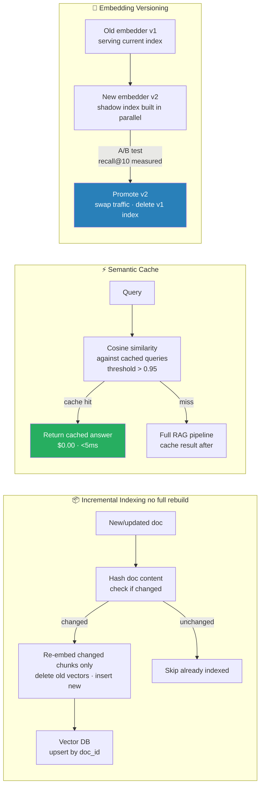

# 13 — Production RAG Ops — Incremental Indexing, Cache, Versioning

> What "RAG works" looks like in production — beyond the demo. The ops layer your RAG prototype doesn't have.

---

## Table of Contents

1. Objective
2. Incremental indexing — without rebuilding
3. Semantic cache for RAG
4. Embedding versioning
5. Vector DB drift monitoring
6. A/B testing retrieval configs
7. Failure modes
8. Interview questions (5)
9. Further reading

---

## 1. Objective

The RAG demo: 100 docs in a vector DB, single user, single query at a time. Trivial.

Production: 10M docs; hundreds of users concurrent; docs updating every minute; embedder being upgraded next quarter; two retrieval configs being A/B tested. **This file is about that gap.**

Senior interview Q: "How does your RAG handle a million new documents per day?" or "How do you upgrade the embedder without breaking everything?"

---


> Never rebuild entire index for doc updates. Semantic cache cuts 40-60% of LLM calls on repeated queries. Version embedder via shadow index before promoting.

## 2. Incremental Indexing — Without Rebuilding

Naive RAG: when docs change, re-embed everything and rebuild the index. **At 1M docs, that's days of compute and downtime.**

### The incremental pattern

For each document operation:

```python
def upsert_document(doc_id: str, text: str):
    # 1. Delete old chunks for this doc
    db.delete(where={"doc_id": doc_id})

    # 2. Chunk + embed the new version
    new_chunks = chunker.split(text)
    new_embeddings = embedder.encode([c.text for c in new_chunks])

    # 3. Upsert into the vector DB
    db.upsert(
        embeddings=new_embeddings,
        documents=[c.text for c in new_chunks],
        metadatas=[{"doc_id": doc_id, "version": now()} for c in new_chunks],
        ids=[f"{doc_id}_{i}" for i in range(len(new_chunks))],
    )

def delete_document(doc_id: str):
    db.delete(where={"doc_id": doc_id})
```

Cost: O(1) per document operation, not O(N). Worth-it threshold: > 1K docs and changes happen.

### Bulk imports — batch incremental

For initial loads of 1M+ docs, even incremental upserts can be slow. Use the vector DB's bulk-import API:
- **Chroma**: `collection.add(...)` accepts batches; max 5K vectors per call
- **Qdrant**: `upsert` accepts batches up to memory limits
- **Pinecone**: `upsert` parallel batch of 100 at a time
- **FAISS**: bulk `add()` then save index

Always do this in a background worker; never block users.

### Soft-delete pattern

Hard delete is final. Soft-delete keeps the vector but marks it inactive — filter on `is_active=true` at query time. Allows recovery of accidentally deleted docs within a retention window.

---

## 3. Semantic Cache for RAG

Many user queries are paraphrases of each other. Caching at the QUERY level (not just the LLM-output level) is a big win.

### Architecture

```
User query
    ↓
1. Embed query
2. Search "query cache" (vector DB of past queries + cached responses)
3. If similarity > 0.95 to a past query AND that query's response is < 24h old:
   → return cached response  ($0 cost, ~30ms)
4. Else:
   → Run full RAG pipeline (retrieval + LLM)
   → Insert (query_embedding, response) into cache
```

### Implementation

Many platforms support this natively:
- **Redis with vector search module** — for exact + semantic combined
- **Portkey** — gateway with semantic cache built-in
- **GPTCache** — open-source library; integrates with LangChain

### Hit rate expectations

- FAQ-style bot: 30-60% hit rate (lots of repeated questions)
- General chat: 10-25% hit rate
- Personalized assistant: 5-15% (each user's query is unique)
- Internal company QA: 40-70% (employees ask similar things)

Each hit saves the full RAG pipeline cost. At 50% hit rate and $0.01 per query — $5K/day savings on 1M queries.

### Cache invalidation

The hardest part. Two strategies:
1. **TTL-based** — cache entries expire after 24h / 7 days. Simple, slightly stale.
2. **Document-based** — when source documents change, invalidate cache entries that retrieved those docs. Complex but accurate.

Production: TTL with manual invalidation hook for major doc updates.

---

## 4. Embedding Versioning

You will upgrade your embedder. (BGE-base → BGE-large; OpenAI ada-002 → text-embedding-3.) Without versioning, this is a disaster.

### The problem

Embeddings from model_v1 and model_v2 are NOT compatible. They live in different vector spaces. Mixing them in the same index → garbage similarity scores.

### The solution — versioned indexes

```
vector_db/
├── embeddings_v1_bge_base/    ← old index, in use by current traffic
└── embeddings_v2_bge_large/   ← new index, being populated
```

Migration flow:
1. **Build new index in parallel** — backfill all docs through new embedder. Days of compute. No user impact.
2. **Shadow traffic** — for each query, retrieve from BOTH indexes. Compare results offline.
3. **A/B test** — route 10% of traffic to v2. Monitor downstream metrics.
4. **Cut over** — switch 100% to v2. Keep v1 around for rollback.
5. **Decommission v1** — after confidence builds (typically 2-4 weeks).

This is the production-grade embedder upgrade pattern. Cuts deployment from "we never upgrade" to "we upgrade quarterly."

### Metadata for tracking

Tag each vector with `embedder_version` so you know what produced it. Lets you partial-migrate (some doc types on v2, others on v1).

---

## 5. Vector DB Drift Monitoring

The world changes. Your vector DB's quality decays.

### What to monitor

1. **Retrieval-recall on a frozen eval set** — Maintain a labeled eval set: (query, expected_doc_id). Run weekly; measure recall@5. Alert if recall drops > 5% week-over-week.

2. **Top-1 similarity distribution** — Histogram of top-1 cosine similarity across production queries. Drift left (lower scores) → retrieval getting worse OR query distribution shifting. Tool: log to LangFuse or Prometheus histogram.

3. **Document coverage** — Are some docs NEVER retrieved? They're either stale or irrelevant. Conversely, one doc retrieved on 80% of queries — it might be too generic, polluting results.

4. **Query embedding distribution drift** — Cluster query embeddings monthly. New clusters appearing → new user behavior; existing model may not retrieve well for them.

### Alerts

- Eval recall drops > 3% → investigate (corpus change? embedder issue?)
- p95 top-1 similarity < 0.4 → most queries are NOT finding good matches → user satisfaction will drop

---

## 6. A/B Testing Retrieval Configs

Suppose you want to change: Chunk size: 500 → 800 tokens; Embedder: BGE-base → BGE-large; Reranker: on / off.

Production-grade A/B testing:

```
Config A (control): old chunking + BGE-base + no reranker
Config B (test):    new chunking + BGE-large + reranker

Route 10% of users to Config B.
Track downstream metrics for 7 days:
  - Task completion rate
  - User satisfaction (thumbs up/down)
  - p95 latency
  - Cost per query
  - Eval recall on golden set

Decide based on the FULL metric stack, not just one.
```

### Common surprises in A/B tests

- Better recall@5 but worse user satisfaction (model couldn't handle the more diverse retrieved chunks)
- Same accuracy but 3× latency (rejection)
- Better numerical metrics but specific edge cases regressed

Always look at full metrics + tail performance, not averages.

---

## 7. Failure Modes

**1. Reindexing while serving** — naive reindex deletes vectors mid-query; users get inconsistent results. Use a parallel index or copy-on-write.

**2. Embedder upgrade without versioning** — mixing old and new embeddings in one index → garbage retrieval. Always version.

**3. Cache poisoning** — bad RAG response cached → served to many users. Always cache only quality-checked responses (LLM-judge or rule-based check before storing).

**4. Vector DB OOM under bulk import** — naive 1M-vector insert blows memory. Use the DB's batch-import API; chunk at 1K-10K per batch.

**5. Stale documents in cache after edit** — user edits a doc; cache still returns answers from the old version. Implement document-keyed cache invalidation OR aggressive TTL.

**6. Cost from over-caching** — semantic cache requires embedding every query → cache lookup cost > the savings on multiple workloads. Measure cache hit rate; if < 10%, disable.

**7. Multi-tenant data leakage via cache** — if cache keys don't include tenant_id, User A's cached response gets served to User B. CRITICAL bug in multi-tenant systems.

---

## 8. Interview Questions (5)

**Q1: How does your RAG handle 1M new documents per day?**

Incremental indexing via background worker queue. Each new/updated doc → chunk → embed → upsert into vector DB (Qdrant or Chroma, with bulk API). Batch docs together by doc_id before upserting. No full rebuild. Monitor index size and embedding throughput (target: process incoming docs faster than they arrive).

**Q2: How do you upgrade your embedding model without breaking the system?**

Versioned indexes. Build the new index in parallel (background backfill — days of compute, no user impact). Shadow-traffic for offline eval. A/B test 10% of traffic; monitor downstream metrics. Cut over to 100% after 1-2 weeks of confidence. Keep old index for rollback. Tag every vector with `embedder_version` metadata.

**Q3: What's semantic caching and what's the multi-tenant gotcha?**

Cache any incoming query; if similarity > 0.95 to a recent past query, return its cached response. Saves 30-60% of LLM calls on FAQ-style workloads. **Multi-tenant gotcha**: cache key must include tenant_id. Without it, User A's cached response for "What's our policy?" gets served to User B who has a DIFFERENT policy. Critical data leakage bug.

**Q4: How do you detect that your RAG quality is degrading?**

Three signals: (1) Frozen eval set — weekly recall@5 on labeled (query, expected_doc) pairs; alert if drop > 5%. (2) Top-1 similarity distribution from production — drift left means worse retrieval or query distribution shifting. (3) User feedback — thumbs-down rate trending up. Combine with detailed trace inspection (LangFuse/Phoenix) for root-cause.

**Q5: Walk me through A/B testing a retrieval config change.**

Define control and treatment configs. Route 10% of traffic to treatment via user-bucketing (consistent hash on user_id). Track FULL metric stack for 7-14 days: task success, user satisfaction (thumbs), latency, cost, recall@5 on golden set. Decide based on the multivariate trade-off — don't optimize one metric blindly. Roll out gradually (25% → 50% → 100%) once decided.

---

## 9. Further Reading

- Chroma docs — docs.trychroma.com — production-grade vector DB ops
- Qdrant docs — qdrant.tech/documentation — strong on multi-tenancy
- GPTCache — github.com/zilliztech/GPTCache — semantic cache library
- Redis Vector Search — for combined exact + semantic caching
- Phoenix RAG eval docs — Arize-AI's framework for production RAG monitoring
- MTEB Retrieval Leaderboard — for embedder upgrade comparisons

## Code Practice — Wired by Phase 6

- `code_practice/05_rag/10_production_rag/` — semantic cache + observability + cost
