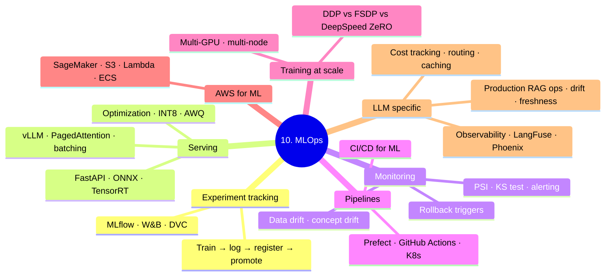

# 10. MLOps

> The engineering layer between research and production. How to ship ML models that actually work at scale — reliably, cheaply, and observably.

---

## Reading Order

| File | What it covers |
|------|----------------|
| `00_roadmap.md` | Folder navigation and scope |
| `01_experiment_tracking.md` | MLflow runs, metrics, artifacts, experiment comparison |
| `02_serving_and_inference.md` | FastAPI serving, vLLM, batch vs online inference |
| `03_monitoring_and_drift.md` | Data/concept drift, PSI, KS test, alerting, rollback triggers |
| `04_pipelines_and_infra.md` | Prefect flows, Kubernetes, CI/CD for ML, GitHub Actions |
| `05_on_premise_ml_deployment.md` | Full on-prem stack: NVIDIA/CUDA, FastAPI, Nginx, systemd, blue-green |
| `06_multi_gpu_multi_server_training.md` | DDP, FSDP, DeepSpeed ZeRO, multi-node torchrun |
| `07_aws_for_ml.md` | S3, EC2 GPU, SageMaker, Lambda, ECS, Step Functions, CloudWatch |
| `08_model_registry_end_to_end.md` | MLflow registry: train → stage → validate → promote → rollback |
| `09_monitoring_end_to_end.md` | Data/concept/prediction drift, PSI, KS test, alerting, retraining triggers |
| `10_serving_optimization.md` | ONNX export, INT8 quantization, ORT, vLLM/PagedAttention, AWQ |
| `11_llm_observability.md` | LangSmith, LangFuse, Phoenix, Helicone; traces, cost, PII |
| `12_llm_cost_tracking.md` | Token cost logging, model routing, caching, budget controls |
| `13_production_rag_ops.md` | Incremental indexing, semantic cache, embedding versioning, vector DB drift |

---

## Code Files

| File | Status |
|------|--------|
| [../code_practice/07_rag/05_production_rag/](../code_practice/07_rag/05_production_rag/) | ✅ Run — semantic cache, incremental indexing, FastAPI server with tracing |
| [../code_practice/06_llms/03_llm_evaluation.py](../code_practice/06_llms/03_llm_evaluation.py) | ✅ Run — eval harness |
| [../code_practice/09_finetuning/05_vllm_serving/](../code_practice/09_finetuning/05_vllm_serving/) | ⏸ code-built, not run (Phase 09 parked) |
| [../code_practice/09_finetuning/06_llm_monitoring.py](../code_practice/09_finetuning/06_llm_monitoring.py) | ⏸ code-built, not run |

---

## MIT Topics Missing Here

- Kubernetes internals (covered lightly — operators, CRDs)
- Terraform / infrastructure-as-code for ML infra
- Full MLOps platform comparisons (Vertex AI Pipelines vs SageMaker Pipelines vs Azure ML)

---

## Connections

- Classical ML algorithms: [../1.machine learning/](../1.machine%20learning/) — note the folder name contains a **space**, not an underscore
- Deep learning training (DDP/FSDP basics): [../2.deep learning/01_fundamentals/02_training_loop.md](../2.deep%20learning/01_fundamentals/02_training_loop.md)
- LLM serving (vLLM internals): [../6.llms/05_vllm_internals.md](../6.llms/05_vllm_internals.md)
- RAG patterns (the upstream of `13_production_rag_ops`): [../7.rag/](../7.rag/)
- Multi-tenant RAG system design: [../11.system_design/10_multi_tenant_rag.md](../11.system_design/10_multi_tenant_rag.md)
- Distribution shift theory (the math behind drift): [../2.deep learning/01_fundamentals/04_generalization.md](../2.deep%20learning/01_fundamentals/04_generalization.md)
- Agent evaluation (production agent metrics): [../8.agents/09_agent_evaluation.md](../8.agents/09_agent_evaluation.md)
