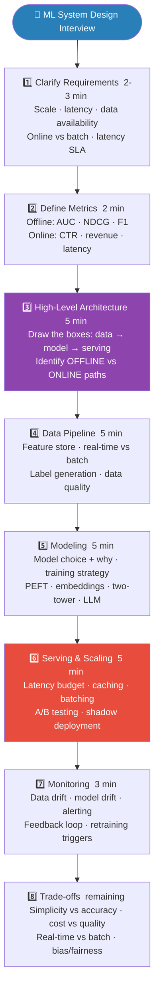

# 01 ML System Design Framework

The universal 8-step framework for every ML system design interview. Use this structure regardless of the specific system asked.

---

## The Framework (Use for Every Interview)

```
1. CLARIFY requirements          (2-3 min)
2. DEFINE metrics                (2 min)
3. HIGH-LEVEL architecture       (5 min)
4. DATA pipeline                 (5 min)
5. MODELING                      (5 min)
6. SERVING & scaling             (5 min)
7. MONITORING & iteration        (3 min)
8. TRADE-OFFS & discussion       (remaining)
```


> **Interview tip:** Always say "Let me clarify requirements first" before drawing any architecture. It shows senior thinking.

---

## Step 1: Clarify Requirements

Always ask these before drawing anything:

```
Scale:
  - How many users / requests per day?
  - How many items in the catalog (for recommendation)?
  - Expected query volume: 1B QPS? 10k QPS?

Latency:
  - Real-time (< 100ms)? Near-real-time (< 1s)? Batch (hours)?

Data:
  - How much labeled data is available?
  - Historical data: how far back?
  - Is data labeled or do we need to create labels?

Constraints:
  - Privacy / compliance requirements (GDPR, HIPAA)?
  - Cold start: new users / new items with no history?
  - Available infrastructure (on-prem, cloud, GPU budget)?

Success definition:
  - What is the business metric we're optimizing?
  - How will we know the model is "good enough" to deploy?
```

---

## Step 2: Define Metrics

Two types you must always specify:

```
OFFLINE metrics (can measure before deployment):
  Classification: F1, AUC-ROC, PR-AUC, precision@k
  Ranking: NDCG@k, MAP, MRR
  Generation: BLEU, ROUGE, BERTScore, LLM-as-Judge
  Regression: RMSE, MAE, MAPE

ONLINE metrics (measure in production):
  Business: CTR, conversion rate, revenue, engagement
  System: Latency P95, error rate, availability
```

The critical point: offline metric ≠ online metric, but not exactly. Always justify your offline metric choice in terms of the business goal.

Example:
```
"For the recommendation system, I'll use NDCG@10 offline
 because it rewards relevant items ranked higher, which maps
 to the click-through rate we care about online."
```

---

## Step 3: High-Level Architecture

```
Standard ML system architecture:

        [ Client ]
             |
        [ API request ]
             |
    [ API Gateway ] — rate limiting, auth
             |
    [ Online Feature        | feature store (online)
      Computation ]         | real-time feature joins
             |
    [ Model Serving   ] — candidates + ranking + reranking
    [ Layer           ] — A/B testing, shadow models
             |
    [ Response ] — business logic, formatting

Offline:
  Raw data + ETL + Feature pipeline + Training + Model registry
                                           |
                                    Model Serving (above)
```

---

## Step 4: Data Pipeline

Questions to address:

```
1. Data sources: where does training data come from?
   - Logs (user interactions)
   - Ground truth labels (human annotation, implicit feedback)
   - External data (third-party, web crawl)

2. Data freshness: how often should features be recomputed?
   - Real-time (streaming): Kafka + Flink/Spark Streaming
   - Near-real-time: hourly Airflow jobs
   - Batch: daily Spark jobs

3. Train/val/test split strategy:
   - Time-based split (not random) for any temporal data
   - User-based split for recommendation (cold start evaluation)

4. Label generation:
   - Explicit: human annotation (expensive), user ratings
   - Implicit: clicks (biased), dwell time, conversions
   - Programmatic: business rules, heuristics

5. Data quality:
   - Missing values handling
   - Deduplication
   - Outlier detection and treatment
```

---

## Step 5: Modeling

Progressive modeling strategy:

```
Don't jump to the most complex model.
Walk through the progression:

1. Heuristic baseline (no ML)
   "Recommend the most popular items" — fast, interpretable, strong baseline

2. Simple ML model
   Logistic regression, decision tree — explainable, fast to train

3. Complex ML model
   XGBoost, neural network — better accuracy, harder to debug

4. Advanced / SOTA
   Two-tower, transformer — highest accuracy, most complex

For each: justify why you'd move up. What does the simpler model miss?
```

Feature engineering categories:

```
User features:   demographics, behavior history, preferences
Item features:   content, metadata, popularity, quality signals
Context features: time of day, device, session context
Interaction features: user-item cross features

Encoding:
  Categorical: embedding lookup (for high-cardinality) or OHE (low-cardinality)
  Continuous: normalize, bucketize
  Text: TF-IDF, BERT embeddings, fine-tuned encoder
  Images: CNN/ViT features
```

---

## Step 6: Serving & Scaling

Typical latency budget breakdown:

```
Total budget: 100ms
  Network (client → server): ~20ms
  Feature computation (online): ~20ms
  Model inference: ~40ms
  Post-processing: ~10ms
  Buffer: ~10ms
```

If inference alone takes 80ms → need optimization:
- **Quantization**: 2-4x speedup
- **Batching**: amortize fixed costs
- **Caching**: cache results for frequent queries
- **Cascade**: cheap filter + expensive ranker

Scalability patterns:

```
Horizontal scaling: add more replicas behind load balancer
  + Works for stateless models
  + Auto-scaling based on CPU/GPU utilization

Caching:
  Feature cache: Redis for online feature serving (sub-ms)
  Results cache: pre-computed recommendations for repeat queries
  Embedding cache: pre-compute item embeddings (change infrequently)

Approximate Nearest Neighbor (ANN):
  For embedding-based retrieval at scale
  FAISS, ScaNN, HNSW — sub-millisecond at billion scale

Async processing:
  For latency-insensitive workloads: queue + async worker + store result
```

---

## Step 7: Monitoring & Iteration

Always include in design:

```
1. A/B testing framework (controlled experiment)
2. Shadow mode (run new model in parallel, don't serve its output)
3. Canary deployment (5-10% traffic to new model)
4. Rollback mechanism (if key metric degrades)
5. Drift monitoring (data drift + retrain trigger)
6. Business metric dashboard (not just ML metrics)
```

---

## Step 8: Common Trade-offs to Discuss

**Precision vs Recall:**
> "We can tune this via the classification threshold.
> For fraud detection, high recall is critical (don't miss fraud).
> For document extraction, high precision is critical (don't hallucinate fields)."

**Latency vs Accuracy:**
> "A simpler model (10ms) vs complex model (100ms).
> We could use a cascade: simple model filters 90% of cases fast,
> complex model handles the remaining 10%."

**Online vs Batch:**
> "Real-time feature computation gives fresher signals but adds latency.
> Batch features are stale but sub-millisecond from cache.
> I'd use batch for stable features (user demographics) and
> real-time for rapidly changing features (current session behavior)."

**Cold Start:**
> "New users with no history → fall back to popularity-based recommendation.
> Use content-based features (not collaborative) until behavioral data accumulates.
> After 3+ interactions, blend collaborative with content-based filtering in."

**Scalability:**
> "At 1M QPS this design works with 2 replicas.
> At 100K QPS I'd add: ANN index for retrieval, Redis feature cache,
> pre-computed embeddings refreshed hourly, horizontal scaling."

---

## Template Response Structure

```
"Let me design a [SYSTEM] for [COMPANY/CONTEXT].

First, let me clarify requirements:
  - Scale: [users/day, QPS]
  - Latency: [real-time/batch]
  - Constraints: [cold start, privacy, etc.]

For metrics, I'll use [OFFLINE] offline which maps to [ONLINE] online.

At a high level, the system has four components:
  1. Data pipeline — [description]
  2. Model — [description]
  3. Serving layer — [description]
  4. Monitoring — [description]

[Draw/describe architecture]

For the model, I'd start with [BASELINE] and progress to [ADVANCED].
The key features are [FEATURE_CATEGORIES].

For serving, the main challenge is [LATENCY/SCALE] because [REASON].
I'd address this with [SOLUTION].

Key trade-offs to consider:
  - [TRADE-OFF 1] because [REASON]
  - [TRADE-OFF 2] because [REASON]

I'd validate this with [EXPERIMENT], monitoring [METRICS]."
```

---

## Interview Q&A

**Q: How do you handle class imbalance in a production ML system?**
A: At the data level: oversample minority class (SMOTE), undersample majority, or use class weights in the loss function. At the evaluation level: use PR-AUC (PR-AUC is more sensitive to minority class performance than ROC-AUC). At serving: tune the classification threshold post-training — lower threshold = higher recall for minority class. For severe imbalance (1:1000), anomaly detection approaches (one-class SVM, Isolation Forest) can outperform traditional classifiers. Always report per-class metrics (class-specific precision/recall) not just overall accuracy.

**Q: Walk me through how you would A/B test a new ML model.**
A: The A/B test process: (1) Define hypotheses — "New model will increase CTR by 5%"; (2) Determine sample size — use power analysis (α=0.05, β=0.8, expected effect size) to calculate minimum users needed; (3) Traffic split — randomly assign users to control (old model) and treatment (new model) at the user ID level (not request level) to avoid same user seeing both; (4) Guardrail metrics — beyond the target metric, define metrics that must NOT regress (latency, error rate, user satisfaction); (5) Run for full weeks to capture weekly seasonality, typically 1-2 weeks; (6) Statistical analysis — t-test or Mann-Whitney for continuous metrics, chi-squared for proportions; (7) Decision — roll out if primary metric improves and no guardrail violations.

---

## Key Takeaway

The ML system design interview is about demonstrating you can translate a vague business problem into a concrete, scalable, maintainable technical system. The framework: clarify → metrics → architecture → data → model → serving → monitoring → trade-offs. Always start with a simple baseline and justify complexity. Always discuss offline/online metric disconnect. Always discuss cold start, scale, and latency budget. The strongest answers discuss trade-offs explicitly and show awareness of what can go wrong.
