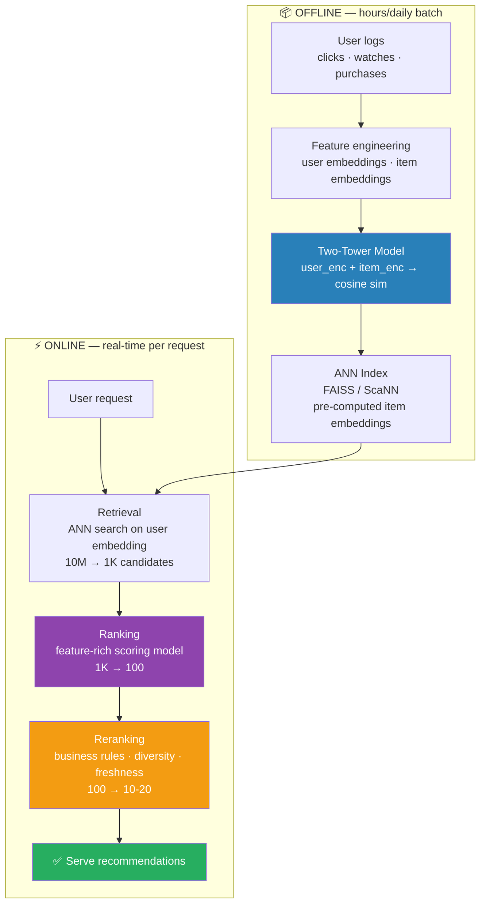

# 02 Recommendation System Design

## Problem Statement

Design a recommendation system for [Netflix / Amazon / LinkedIn / YouTube]. Scale: 100M users, 10M items, 100K QPS.

---

## Architecture

```
                    OFFLINE (hours/daily)
  User logs + Feature engineering + Train two-tower model
  Item catalog + Item embeddings (pre-compute, refresh daily)
  User embeddings + ANN Index (FAISS/ScaNN)

                           ↓

                   ONLINE (real-time)
  Request
    + [RETRIEVAL: get top-k candidates]
      + [RANKING: score candidates]
        + [RERANKING: business rules, diversity, freshness]
          + Return top-N recommendations
```

Multi-stage funnel:
```
All items (10M) → Retrieval (1000) → Ranking (100) → Reranking (10-20)
Each stage: fewer items, more compute per item
```


> Key insight: each stage trades off breadth (recall) for precision. Retrieval optimizes recall; ranking optimizes precision; reranking handles business constraints.

---

## Retrieval Stage

### Collaborative Filtering (Matrix Factorization)

```python
import implicit
import scipy.sparse as sp
import numpy as np

# Build user-item interaction matrix
# ratings[user_id, item_id] = interaction_count (views, clicks, purchases)
ratings = sp.csr_matrix((data['count'], (data['user_id'], data['item_id'])))

# Alternating Least Squares (ALS) Matrix Factorization
model = implicit.als.AlternatingLeastSquares(
    factors=128,            # embedding dimension
    regularization=0.01,
    iterations=50,
    use_gpu=True,
)
model.fit(ratings)

# User embedding: model.user_factors[user_id]
# Item embedding: model.item_factors[item_id]

# Get top-k recommendations for user
user_id = 42
recommendations = model.recommend(
    user_id,
    ratings[user_id],    # items already interacted with
    N=1000,              # top-1000 for next stage
    filter_already_liked=True,
)
```

### ANN Index for Fast Retrieval

```python
import faiss
import numpy as np

# Build index with all item embeddings (run daily)
item_embeddings = compute_all_item_embeddings()   # [N_items, 128]
item_embeddings = np.ascontiguousarray(item_embeddings.astype(np.float32))

# HNSW: best recall-speed tradeoff for recommendation
d = 128   # embedding dimension
M = 32    # HNSW connectivity parameter
index = faiss.IndexHNSWFlat(d, M)
index.hnsw.efConstruction = 200
index.add(item_embeddings)
faiss.write_index(index, "item_index.faiss")

# Retrieval at serving time (sub-millisecond for 1M items)
index = faiss.read_index("item_index.faiss")
index.hnsw.efSearch = 64   # trade recall for speed

user_embedding = user_tower(user_id, history)   # [1, 128]
D, I = index.search(user_embedding, k=1000)     # top-1000 candidates
candidate_item_ids = I[0]   # indices → map to item IDs
```

### Two-Tower Neural Network (Production Standard)

```python
import torch
import torch.nn as nn
import torch.nn.functional as F

class UserTower(nn.Module):
    def __init__(self, user_vocab_size, item_vocab_size, embed_dim=128):
        super().__init__()
        self.user_embed = nn.Embedding(user_vocab_size, 64)
        self.item_history_embed = nn.Embedding(item_vocab_size, 64, mode='mean')

        self.mlp = nn.Sequential(
            nn.Linear(64 + 64 + 32, 256),   # user + history + context
            nn.ReLU(),
            nn.Dropout(0.1),
            nn.Linear(256, embed_dim),
        )

    def forward(self, user_id, item_history, context_features):
        u = self.user_embed(user_id)
        h = self.item_history_embed(item_history)
        out = self.mlp(torch.cat([u, h, context_features], dim=-1))
        return F.normalize(out, dim=-1)   # L2 normalize for cosine similarity

class ItemTower(nn.Module):
    def __init__(self, item_vocab_size, text_dim=768, embed_dim=128):
        super().__init__()
        self.item_embed = nn.Embedding(item_vocab_size, 64)
        self.text_proj = nn.Linear(text_dim, 64)   # from pre-trained text encoder

        self.mlp = nn.Sequential(
            nn.Linear(64 + 64 + 16, 256),
            nn.ReLU(),
            nn.Dropout(0.1),
            nn.Linear(256, embed_dim),
        )

    def forward(self, item_id, item_text_emb, item_features):
        i = self.item_embed(item_id)
        t = self.text_proj(item_text_emb)
        out = self.mlp(torch.cat([i, t, item_features], dim=-1))
        return F.normalize(out, dim=-1)

# Training: in-batch negatives
def two_tower_loss(user_emb, item_emb_pos, temperature=0.05):
    """
    user_emb:     [batch, dim]
    item_emb_pos: [batch, dim]  (positive items)
    All other items = negatives
    """
    # Similarity matrix [batch, batch]
    logits = torch.matmul(user_emb, item_emb_pos.T) / temperature
    labels = torch.arange(len(user_emb), device=user_emb.device)
    return F.cross_entropy(logits, labels)
```

---

## Ranking Stage

```python
# Ranking: score each candidate with a richer model
# Input: user features + item features + user-item interaction features

class RankingModel(nn.Module):
    def __init__(self, feature_dim: int):
        super().__init__()
        self.mlp = nn.Sequential(
            nn.Linear(feature_dim, 512),
            nn.ReLU(),
            nn.BatchNorm1d(512),
            nn.Linear(512, 256),
            nn.ReLU(),
            nn.Dropout(0.2),
            nn.Linear(256, 1),   # CTR prediction
            nn.Sigmoid()
        )

    def forward(self, features):
        return self.mlp(features)

# Training objective: maximize NDCG (learned to rank)
# or binary cross-entropy on click/no-click labels (simpler, often sufficient)

def ranking_features(user_id, item_id):
    """Concatenate all features for ranking."""
    return torch.cat([
        user_features[user_id],                     # demographics, behavior stats
        item_features[item_id],                     # content features, quality signals
        interaction_features(user_id, item_id),     # has user interacted before?
        context_features,                           # time of day, device
    ])

# Score all candidates
scores = ranking_model(torch.stack([
    ranking_features(user_id, item_id)
    for item_id in candidate_item_ids
]))
ranked_items = candidate_item_ids[scores.argsort(descending=True)][:100]
```

---

## Reranking Stage (Business Rules)

```python
def rerank(ranked_items: list, user_id: int, config: dict) -> list:
    """Apply business rules after ML ranking."""
    final_list = []
    category_counts = {}

    for item_id in ranked_items:
        if len(final_list) >= config["top_n"]:
            break

        item = get_item(item_id)

        # 1. Diversity: max 2 items per category
        cat = item["category"]
        if category_counts.get(cat, 0) >= 2:
            continue

        # 2. Freshness boost: surface new items
        age_days = (now() - item["publish_date"]).days
        if age_days < 7:
            item["boost"] = 1.2   # move up slightly
            final_list.insert(min(3, len(final_list)), item_id)
            continue

        # 3. Filter: remove items the user has seen recently
        if item_id in recently_shown_items(user_id, last_hours=24):
            continue

        # 4. Compliance: don't recommend flagged items
        if item.get("flagged"):
            continue

        final_list.append(item_id)
        category_counts[cat] = category_counts.get(cat, 0) + 1

    return final_list
```

---

## Cold Start Handling

```python
# New user cold start
def get_recommendations(user_id: int):
    user_history = get_interaction_history(user_id)

    if len(user_history) == 0:
        # Completely new user: popularity + onboarding quiz signals
        return popular_items_by_geography(user_location)

    elif len(user_history) < 5:
        # Few interactions: content-based + some popularity
        content_recs = content_based_retrieval(user_history, k=700)
        popular_recs = get_popular_items(N=300)
        candidates = deduplicate(content_recs + popular_recs)
        return rank_and_rerank(candidates, user_id)

    else:
        # Full collaborative filtering pipeline
        return full_retrieval_ranking_pipeline(user_id)

# New item cold start
def get_item_embedding(item_id: int):
    if item_is_new(item_id):
        # Use content-based embedding until behavioral data accumulates
        return content_tower(get_item_content(item_id))
    else:
        # Use learned embedding from two-tower model
        return item_tower.item_embed(item_id)
```

---

## Key Metrics

```
Offline:
  NDCG@10 (Normalized Discounted Cumulative Gain): ranking quality
  Recall@100: fraction of relevant items retrieved
  AUC-ROC: ranking model click prediction

Online:
  CTR (Click-Through Rate): primary engagement metric
  Conversion rate: purchases / recommendations shown
  Diversity: intra-list diversity (avoid filter bubbles)
  Serendipity: fraction of recommendations user wouldn't have found themselves
  Coverage: fraction of item catalog shown to at least some users

Watch out for:
  Feedback loop: recommending popular items → more data on popular items
                 → only popular items get recommended
  Mitigate: exploration (ε-greedy, UCB), item freshness boost
```

---

## A/B Testing for Recommendation Systems

### Experiment Design

```
Goal: test whether new ranking model improves CTR vs current model
Treatment: new ranking model (model B)
Control:   current model (model A)

Randomization unit: user_id (not request)
  Why user-level? A user must always see the same experience —
  mixing A/B per request creates inconsistency and dilutes the signal.

Traffic split: 50/50 (or 10/90 for risky experiments)
Minimum detectable effect: 0.5% CTR lift (set before experiment)
Statistical power: 80% (β=0.20)
Significance level: α=0.05

Sample size calculation:
  Baseline CTR = 4.2%
  MDE = 0.5% relative = 6 × 0.042 × 0.005 = 0.00021 (absolute)
  σ² = p(1-p) = 0.042 × 0.958 = 0.040

  n = 2 × σ² × (z_α/2 + z_β)² / δ²
    = 2 × 0.040 × (1.96 + 0.841)² / 0.00021²
    = 142M users per arm  → too large; 2-week runtime to reach significance
```

### Metric Hierarchy

```
Primary metric (guardrail):
  CTR — primary engagement; must improve or be neutral

Secondary metrics (informational):
  Conversion rate   — did click lead to purchase/watch?
  Session length    — are users staying longer?
  Return rate (7-day) — did users come back?

Guardrail metrics (must NOT degrade):
  Latency p99       — new model must not slow serving
  Error rate        — no increase in failures
  Diversity score   — filter bubbles must not worsen

Novelty / primacy effect:
  Users click new things out of curiosity → inflate initial CTR.
  Wait at least 1 week before evaluating; compare week-2 metrics only.
```

### Experiment Code

```python
import hashlib
import numpy as np
from scipy import stats

def assign_variant(user_id: int, experiment_name: str, traffic_pct: float = 0.5) -> str:
    """Deterministic, stable assignment — same user always gets same variant."""
    key = f"{experiment_name}_{user_id}"
    hash_val = int(hashlib.md5(key.encode()).hexdigest(), 16)
    bucket = (hash_val % 1000) / 1000.0   # [0, 1)

    if bucket >= traffic_pct:
        return "control"
    elif bucket < traffic_pct / 2:
        return "treatment"
    else:
        return "control"

def run_ab_test(control_clicks, control_impressions,
                treatment_clicks, treatment_impressions):
    """Two-proportion z-test for CTR comparison."""
    p_c = control_clicks / control_impressions
    p_t = treatment_clicks / treatment_impressions

    # Pooled proportion under H₀: p_c = p_t
    p_pool = (control_clicks + treatment_clicks) / (control_impressions + treatment_impressions)
    se = np.sqrt(p_pool * (1 - p_pool) * (1/control_impressions + 1/treatment_impressions))
    z = (p_t - p_c) / se
    p_value = 2 * (1 - stats.norm.cdf(abs(z)))   # two-tailed
    lift = (p_t - p_c) / p_c * 100               # relative lift %

    return {
        "control_ctr":   round(p_c, 4),
        "treatment_ctr": round(p_t, 4),
        "lift_pct":      round(lift, 2),
        "z_score":       round(z, 3),
        "p_value":       round(p_value, 4),
        "significant":   p_value < 0.05
    }

# Dry run:
result = run_ab_test(
    control_clicks=84_000,    control_impressions=2_000_000,   # CTR = 4.20%
    treatment_clicks=89_250,  treatment_impressions=2_000_000  # CTR = 4.46%
)
# control_ctr:   0.042
# treatment_ctr: 0.04463
# lift_pct:      +6.25%
# z_score:       6.21
# p_value:       0.0000
# significant:   True
```

### Dry Run — A/B Decision

```
Experiment: new LightGBM ranking model vs old logistic regression
Runtime: 14 days, 2M users per arm

Results:
  Control (logistic):   84,000 clicks / 2,000,000 impressions = 4.200% CTR
  Treatment (LightGBM): 89,250 clicks / 2,000,000 impressions = 4.463% CTR

z = (0.04463 - 0.04200) / sqrt(0.04338 * 0.9567 * (1/2M + 1/2M))
  = 0.00263 / 0.0000423
  = 6.21

p-value = 2 × (1 − Φ(6.21)) = 0.000 → reject H₀

Lift: (4.463 - 4.200) / 4.200 × 100 = +6.25%

Guardrail check:
  Latency p99: 68ms (control) vs 71ms (treatment) = +6% → acceptable (<10% budget)
  Diversity: 0.72 (control) vs 0.73 (treatment) = improved ✓

Decision: ship LightGBM ranking model
```

### Common Pitfalls

```
Network effects: recommendations can affect other users (viral content).
  Mitigate: cluster-based randomization instead of individual user.

Multiple testing: running 5 experiments simultaneously inflates false positive rate.
  Mitigate: Bonferroni correction (α/n) or FDR control.

Interaction effects: two live experiments on same user population.
  Mitigate: mutex layers — users assigned to only one experiment at a time.

Underpowered experiments: ending early because "looks significant."
  Mitigate: pre-commit sample size; use sequential testing if early stopping needed.
```

---

## Interview Q&A

**Q: Explain two-tower architecture and why it's used for retrieval.**
A: Two-tower (dual encoder) trains separate neural networks for users and items. At training: compute user embedding and item embedding independently, maximize similarity for positive pairs (interactions) and minimize for negatives. At serving: pre-compute all item embeddings offline — build ANN index. For a new query, compute user embedding (fast, real-time) → ANN search in item embedding space → returns top-k candidates in sub-millisecond. Key advantage: scalability — item embeddings are pre-computed so retrieval is O(log N) not O(N). Limitation: user and item encoders don't interact during inference — can't capture fine-grained feature interactions (that's what the ranking model handles).

**Q: How do you handle the feedback loop problem in recommendations?**
A: The feedback loop: recommend popular items → model trained on these clicks → diversity collapses. Solutions: (1) Exploration: ε-greedy or Upper Confidence Bound (explore uncertain items), (2) Inverse propensity weighting — down-weight popular item interactions in training, (3) Freshness signals — add recency decay to item scores; boost new items, (4) Diversity constraints in reranking — max k items per category, (5) Counterfactual learning — train on what would have been clicked had different items been shown. No single solution eliminates it; use in combination.

---

## Connections

- Unsupervised ML (ML/algorithms/03): Matrix Factorization is a form of embedding/decomposition
- Tree Models (ML/algorithms/02): Gradient boosting is often used in the ranking stage
- RAG (6.llms/04): ANN retrieval (FAISS, ScaNN) — same techniques used in both
- System Design Framework (11.system_design/01): Apply the framework here

---

## Key Takeaway

Three-stage funnel: Retrieval (10M → 1000, two-tower + ANN) → Ranking (1000 → 100, point-wise MLP) → Reranking (100 → 10-20, business rules). Two-tower enables scalable retrieval by pre-computing item embeddings. Handle cold start with content-based features before behavioral data accumulates. Watch for feedback loops — add exploration and diversity constraints.
