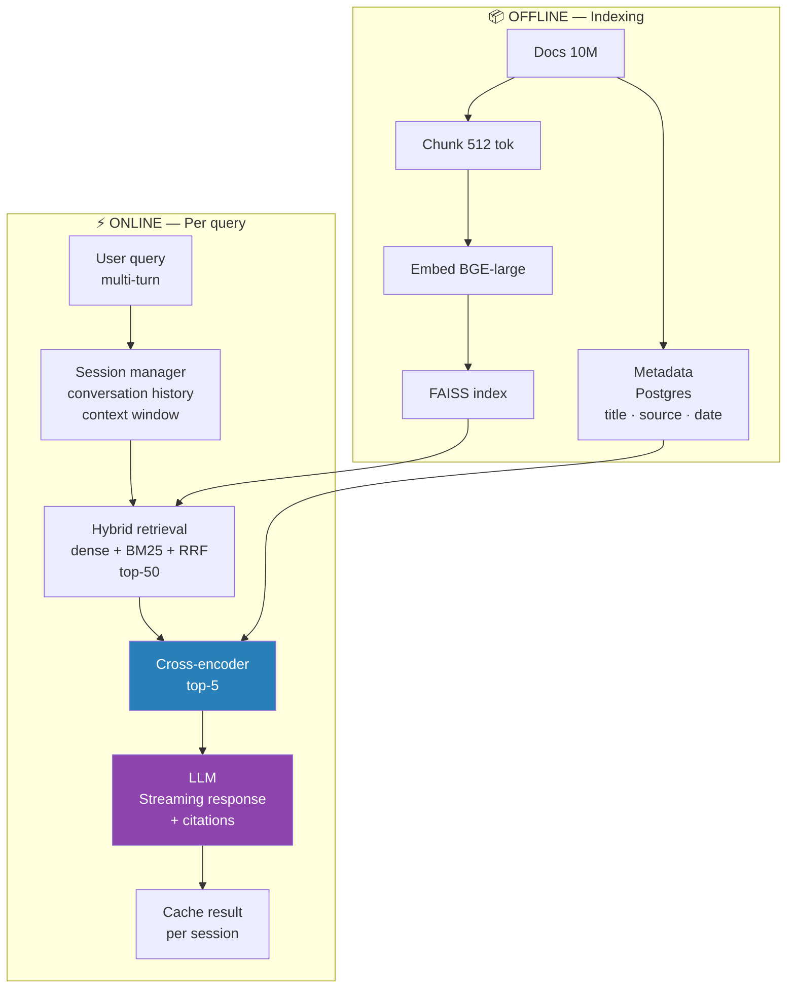

# 06 Question Answering System Design

## Problem Statement

Design a QA system that answers user questions over a large document corpus. Scale: 10M documents, 50K QPS, multi-turn conversations, streaming responses.

---



## Architecture

```
              OFFLINE (daily/hourly)
  Documents + Chunk + Embed + FAISS Index
  Metadata store (doc_id, title, source, date) → PostgreSQL

                         ↓

               ONLINE (real-time)
  User query
    ↓
  [Query understanding] — classify, expand, detect language
    ↓
  [Retrieval] — bi-encoder + FAISS top-100
    ↓
  [Reranking] — cross-encoder + top-5
    ↓
  [Context assembly] — format chunks + conversation history
    ↓
  [LLM generation] — stream tokens to client
    ↓
  [Post-processing] — citation injection, safety filter
```

Retrieval — RAG reference: `11.system_design/03_search_and_rag_system.md` for FAISS, chunking, and embedding pipeline details.

---

## Multi-Turn Conversation

The hardest part: user follow-ups reference earlier context.

```
Turn 1: "What is the invoice payment term?"
Turn 2: "What happens if it's overdue?"       + "it" = invoice payment
Turn 3: "How do I dispute a charge?"          + still in invoice context

Naive approach: send only current query → retrieval misses context
Good approach: reformulate query with conversation history
```

### Query Reformulation

```python
from anthropic import Anthropic

client = Anthropic()

def reformulate_query(conversation_history: list[dict], current_query: str) -> str:
    """
    Convert a follow-up question into a standalone question
    that can be answered without prior context.
    """
    if len(conversation_history) == 0:
        return current_query

    history_text = "\n".join(
        f"{m['role'].upper()}: {m['content']}"
        for m in conversation_history[-4:]   # last 2 turns (4 messages)
    )

    response = client.messages.create(
        model="claude-haiku-4-5-20251001",   # cheap model for reformulation
        max_tokens=100,
        messages=[{
            "role": "user",
            "content": f"""Rewrite the follow-up question as a standalone question.

Conversation:
{history_text}

Follow-up question: {current_query}

Standalone (one sentence, no pronouns referring to prior context):"""
        }]
    )
    return response.content[0].text.strip()

# Dry run:
history = [
    {"role": "user",      "content": "What is the invoice payment term?"},
    {"role": "assistant", "content": "Standard payment is Net 30 days."},
]
reformulated = reformulate_query(history, "What happens if it's overdue?")
# → "What happens if an invoice payment is overdue after the Net 30 day term?"
# Now use reformulated query for retrieval — much better recall
```

---

## Context Window Management

```
LLM context limit: 120K tokens (Claude), 32K (GPT-4), 8K (older models)
Conversation history grows unbounded → must manage

Strategy: rolling window + summary compression

Keep in context:
  System prompt:              ~500 tokens
  Last N turns (N=4):       ~3,000 tokens
  Retrieved chunks (top-5): ~2,000 tokens
  Current query:               ~50 tokens
  Total:                     ~5,550 tokens — well within limit

When history exceeds budget:
  Compress old turns into a summary (LLM call)
  Replace old turns with summary
  Keep recent turns verbatim
```

```python
class ConversationManager:
    def __init__(self, max_turns: int = 10, max_tokens: int = 4000):
        self.history   = []
        self.max_turns = max_turns
        self.max_tokens = max_tokens
        self.summary   = None

    def add(self, role: str, content: str):
        self.history.append({"role": role, "content": content})
        if len(self.history) > self.max_turns * 2:
            self._compress()

    def _compress(self):
        """Summarize oldest half of conversation, keep recent half."""
        old_turns   = self.history[:len(self.history)//2]
        self.history = self.history[len(self.history)//2:]

        old_text = "\n".join(
            f"{m['role'].upper()}: {m['content']}" for m in old_turns
        )

        response = client.messages.create(
            model="claude-haiku-4-5-20251001",
            max_tokens=200,
            messages=[{"role": "user",
                        "content": f"Summarize this conversation in 2-3 sentences:\n{old_text}"}]
        )
        self.summary = response.content[0].text

    def build_messages(self, system: str, retrieved_context: str, query: str) -> list:
        messages = []

        # Add summary of compressed history if exists
        if self.summary:
            messages.append({
                "role": "user",
                "content": f"[Earlier conversation summary: {self.summary}]"
            })
            messages.append({"role": "assistant", "content": "Understood."})

        # Add recent turns
        messages.extend(self.history)

        # Add current query with retrieved context
        messages.append({
            "role": "user",
            "content": f"Context:\n{retrieved_context}\n\nQuestion: {query}"
        })
        return messages
```

---

## Streaming Response

```python
import anthropic
from fastapi import FastAPI
from fastapi.responses import StreamingResponse
import json

app = FastAPI()
client = anthropic.Anthropic()

@app.post("/qa/stream")
async def qa_stream(request: dict):
    query      = request["query"]
    session_id = request["session_id"]

    async def token_generator():
        # 1. Get conversation history
        conv_manager = get_session(session_id)

        # 2. Reformulate query
        standalone_query = reformulate_query(conv_manager.history, query)

        # 3. Retrieve + rerank
        chunks = retrieve_and_rerank(standalone_query, top_k=5)
        context = "\n\n".join([f"[{i+1}] {c['text']}" for i, c in enumerate(chunks)])

        # 4. Build messages
        messages = conv_manager.build_messages(
            system="You are a helpful assistant. Answer based on the provided context. "
                   "Cite sources with [1], [2] etc. Say 'I don't know' if not in context.",
            retrieved_context=context,
            query=query
        )

        # 5. Stream response
        full_response = ""
        with client.messages.stream(
            model="claude-sonnet-4-6",
            max_tokens=1024,
            messages=messages,
        ) as stream:
            for text in stream.text_stream:
                full_response += text
                yield f"data: {json.dumps({'token': text})}\n\n"

        # After stream: save to history
        conv_manager.add("user", query)
        conv_manager.add("assistant", full_response)
        save_session(session_id, conv_manager)
        yield f"data: {json.dumps({'done': True, 'sources': [c['source'] for c in chunks]})}\n\n"

    return StreamingResponse(token_generator(), media_type="text/event-stream")
```

---

## Citation Injection

```python
import re

def inject_citations(answer: str, chunks: list[dict]) -> str:
    """
    LLM outputs [1], [2] etc. — replace with actual source URLs/titles.
    """
    citations = {}
    for i, chunk in enumerate(chunks, start=1):
        citations[i] = {
            "title":  chunk.get("title", "Unknown"),
            "source": chunk.get("source", ""),
            "page":   chunk.get("page"),
        }

    # Find all citation markers in text
    def replace_citation(match):
        num = int(match.group(1))
        if num in citations:
            c = citations[num]
            return f'<cite data-source="{c["source"]}" data-page="{c["page"]}">[{num}]</cite>'
        return match.group(0)

    annotated = re.sub(r'\[(\d+)\]', replace_citation, answer)

    # Append references section
    refs = "\n\n**Sources:**\n"
    for num, c in citations.items():
        refs += f"  [{num}] {c['title']}"
        if c['page']:
            refs += f", p.{c['page']}"
        refs += f" ({c['source']})\n"

    return annotated + refs
```

---

## Confidence & Fallback

```python
def classify_answerability(query: str, retrieved_chunks: list[dict],
                            threshold: float = 0.6) -> bool:
    """
    Decide if retrieved context is sufficient to answer the query.
    Fast heuristic: if max reranker score is low, say "I don't know".
    """
    if not retrieved_chunks:
        return False

    max_score = max(c.get("rerank_score", 0) for c in retrieved_chunks)
    # Cross-encoder scores: > 5 = good match, < 2 = poor match
    return max_score > 2.0

def answer_or_fallback(query: str, chunks: list[dict]) -> str:
    if not classify_answerability(query, chunks):
        return (
            "I couldn't find relevant information in the knowledge base to answer "
            "this question. Could you rephrase or provide more context?"
        )
    return generate_answer(query, chunks)
```

---

## Evaluation

```
Offline metrics:
  Retrieval:
    Recall@5:  fraction of relevant docs in top-5 retrieved (target: >0.85)
    MRR:       mean reciprocal rank of first relevant doc
    NDCG@10:   ranking quality

  Answer quality:
    Faithfulness:  is the answer grounded in the retrieved context?
                   (LLM-as-judge or NLI model)
    Relevance:     does the answer address the question?
    Overlap with reference answers (if available)

Online metrics:
  Thumbs up/down rate
  Follow-up rate (did user need to ask again?)
  Session abandonment rate (gave up without answer)
  Citation click rate (did user verify sources?)
```

### Faithfulness Check with NLI

```python
# Faithfulness check with NLI
from transformers import pipeline

nli = pipeline("text-classification",
               model="cross-encoder/nli-deberta-v3-small")

def check_faithfulness(str, context: str, answer: str) -> float:
    """
    Returns entailment score (faithfulness = no hallucination).
    """
    result = nli(f"{context} [SEP] {answer}", truncation=True)[0]
    if result["label"] == "ENTAILMENT":
        return result["score"]
    elif result["label"] == "CONTRADICTION":
        return -result["score"]
    return 0.0
```

---

## Key Design Decisions

| Decision | Choice | Reason |
|---|---|---|
| Chunk size | 512 tokens, 50-token overlap | Balance context richness vs noise |
| Retrieval model | all-mpnet-base-v2 | Good accuracy/speed tradeoff |
| Reranker | cross-encoder/ms-marco-MiniLM-L-6 | Fast, strong on QA |
| LLM | Claude Sonnet (streaming) | Native streaming, citations |
| History compression | Summarize after 10 turns | Keeps context fresh |
| Max context chunks | 5 | ~2,000 tokens, leaves room for history |

---

## Interview Q&A

**Q: How do you handle follow-up questions in a QA system?**
A: Two steps: (1) Query reformulation — use a cheap LLM (Haiku) to rewrite the follow-up as a standalone question with all pronouns and references resolved from conversation history. "What about it?" → "What about the Net 30 invoice payment term?"; (2) Context window management — maintain a rolling window of recent turns, compress old turns into a summary when history exceeds budget. This lets retrieval work on well-formed standalone queries while the LLM still has access to conversation context.

**Q: How do you know when to say "I don't know"?**
A: Two signals: (1) Retrieval quality — if the cross-encoder reranker's top score is below a threshold (e.g., score < 2.0), the retrieved chunks are probably irrelevant to the question; (2) Faithfulness check — after generation, run an NLI model on (context, answer) — if it returns CONTRADICTION or low ENTAILMENT, the answer is likely hallucinated. In production, always include "I don't know" as a valid fallback rather than confidently generating unsupported answers.

**Q: How would you improve the system if users complain answers are too slow?**
A: Latency budget: retrieval ~20ms, reranking ~20ms (100 pairs × 2ms), LLM generation latency depends on output length. Optimizations: (1) reduce reranking candidates from 100 to 50; (2) use streaming so first tokens appear quickly while generation continues; (3) cache embeddings and common query results (Redis); (4) use a smaller/faster reranker for the first pass; (5) reduce chunk count from 5 to 3 for shorter contexts; (6) use speculative decoding in vLLM for LLM throughput.

---

## Connections

- RAG pipeline details: `11.system_design/03_search_and_rag_system.md`
- LLM agents (multi-step QA): `11.system_design/05_llm_agent_system_design.md`
- Semantic similarity / retrieval: `4.nlp/02_embeddings/05_semantic_similarity.md`
- Decoding / streaming: `../4.nlp/03_sequence_models/07_decoding_strategies.md`

---

## Key Takeaway

QA system = retrieval (bi-encoder + FAISS) → reranking (cross-encoder) → context assembly → LLM generation (streaming). Multi-turn: reformulate follow-ups into standalone queries with a cheap LLM. Context management: rolling window + summarize old turns. Always implement "I don't know" fallback via reranker score threshold + faithfulness check. Evaluate with Recall@5, faithfulness (NLI), and online thumbs up/down.
