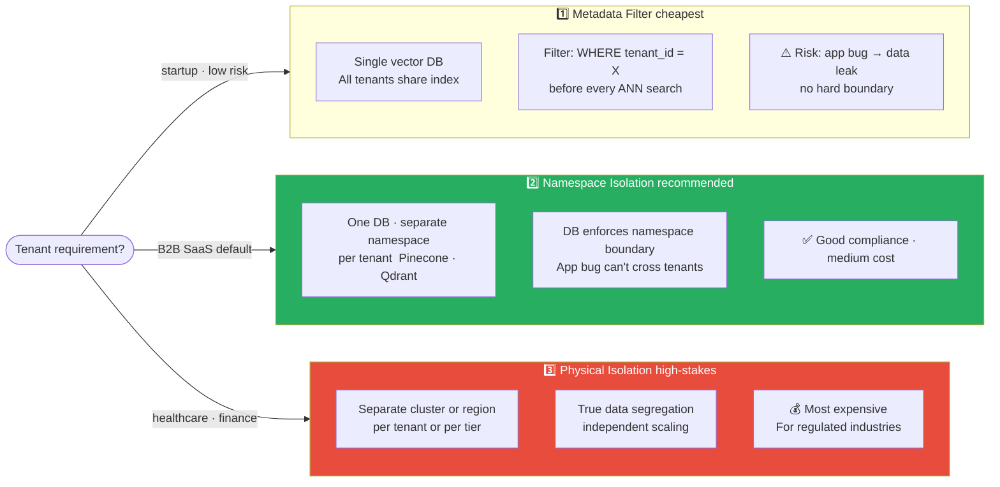

# 10 Multi-Tenant RAG — Isolation, SLAs, and Scale

> When one RAG serves multiple customers / orgs, their data must not leak across. The system design layer most demos skip.

## Table of Contents

1. Objective
2. The three isolation models
3. Metadata-filter isolation (soft, cheap)
4. Namespace isolation (medium)
5. Physical isolation (hardest, most compliant)
6. Per-tenant SLAs and resource limits
7. Cache key namespacing — the silent leak
8. Failure modes
9. Interview questions (5)
10. Further reading

---

## 1. Objective

A typical SaaS RAG serves N customer organizations. Each has private documents. Each pays for usage. None should see another's data.

The wrong design at scale = compliance disaster + legal liability + customer churn.

Senior interview Q: "Design a RAG for a multi-tenant SaaS where each customer has confidential documents."

---


> Cache key MUST include tenant_id — the silent leak: `cache[query_hash]` without tenant scope lets Tenant A read Tenant B's cached answer.

## 2. The Three Isolation Models

Pick based on (a) compliance needs, (b) cost tolerance, (c) scale.

| Model | Cost | Compliance | Scale |
|---|---|---|---|
| Metadata filter | Cheapest | Soft isolation (relies on app correctness) | Easy to many tenants |
| Namespace per tenant | Medium | Stronger (vector DB enforces) | Moderate; depends on DB |
| Physical isolation | Most expensive | Strongest (separate clusters / regions) | Limited by infra; for high-stakes tenants |

Choice depends on industry:
- Consumer SaaS, low-stakes data → metadata filter
- B2B SaaS, mid-stakes (legal, finance) → namespace
- Regulated (healthcare, defense, large enterprise contracts) → physical, often per-region

You can mix: bulk tenants in shared infrastructure with metadata filtering; premium tenants in their own clusters.

---

## 3. Metadata-Filter Isolation (soft, cheap)

Single vector DB. Every vector tagged with `tenant_id`. Query filter restricts.

### Implementation

```python
# Insert
db.upsert(
    embeddings=embs,
    documents=docs,
    metadatas=[{"tenant_id": "acme_corp", "doc_id": "..."} for _ in docs],
    ids=[...],
)

# Query (filter by tenant)
results = db.query(
    query_embeddings=[query_emb],
    n_results=5,
    where={"tenant_id": current_tenant},
)
```

### Pros
- Single index → smaller infra footprint
- Easy scaling — add tenants without provisioning new resources
- Cheapest per tenant

### Cons
- **Relies on application code never having bugs** — one missing where clause = data leak across tenants
- Difficult to enforce per-tenant rate limits at vector DB level
- "Noisy neighbor" — a large tenant can slow queries for others
- Backups / exports are harder to scope to one tenant

### Vector DBs that support metadata filtering well
- Qdrant: rich filters, indexed metadata, fast
- Pinecone: `metadata_config` for indexed fields
- Weaviate: GraphQL-style filters
- Chroma: basic `where` clause, slower at scale

### Defense in Depth

Even with metadata filter, add a **second check at the application layer**:

```python
results = db.query(... where={"tenant_id": current_tenant})
# Defensive double-check (in case of DB bug or middleware injection)
for r in results:
    if r.metadata["tenant_id"] != current_tenant:
        raise SecurityException("Tenant mismatch in retrieved doc")
```

Belt and suspenders.

---

## 4. Namespace Isolation (medium)

Vector DB has native namespace / collection support. Each tenant gets a namespace.

### Implementation

```python
# Each tenant has its own collection
collection = db.get_or_create_collection(f"docs_{tenant_id}")
collection.upsert(...)
collection.query(...)
```

### Pros
- DB-enforced isolation (a query against the wrong namespace fails LOUDLY, not silently)
- Per-namespace stats, indexes, optimization
- Easier per-tenant operations (delete tenant's data = drop collection)

### Cons
- More namespaces = more index overhead (some DBs scale better than others)
- Connection / collection pool management
- Pinecone has hard limits on namespaces per index — may need multiple indexes

### Best Practices
- One namespace per tenant
- Index template (same chunking, embedding) across all namespaces
- Centralized control plane to provision new namespaces when tenants sign up
- Automated cleanup when tenants offboard

### Vector DBs that Excel at Namespaces
- Pinecone: `namespace` is a first-class concept
- Qdrant: separate collections per tenant
- Weaviate: multi-tenancy mode (built specifically for this)

---

## 5. Physical Isolation (hardest, most compliant)

Separate VPCs / clusters / data centers per tenant.

### When Required
- Regulated industries (HIPAA in US, GDPR for EU customers, FedRAMP for US government)
- Large enterprise contracts that specify "single-tenant deployment"
- Data residency requirements (EU customer data MUST stay in EU)

### Implementation
- Per-tenant Kubernetes namespace
- Per-tenant vector DB instance
- Per-tenant API gateway with isolated auth
- Per-tenant encryption keys (BYOK — bring your own keys)

### Cost
Roughly 5-50× metadata-filter cost. Worth it for high-stakes tenants paying enterprise rates.

### Hybrid Pattern

Common SaaS: Free tier and small tenants: metadata-filter shared infrastructure → Mid-tier: namespace isolation, often per-region (EU customers → EU cluster) → Enterprise: physical isolation on isolated namespaces or physical. Cache keys ALWAYS include tenant_id (cross-tenant leak via cache is the #1 multi-tenant bug). Per-tenant rate limits and quotas via API gateway.

---

## 6. Per-Tenant SLAs and Resource Limits

Multi-tenant systems must prevent one tenant from impacting others.

### Per-Tenant Limits (must implement)
- **Query rate limit** (e.g., 100 queries/min)
- **Document storage cap** (e.g., 100K docs / 10GB)
- **Indexing throughput limit** (don't let one tenant's bulk import stall everyone)
- **LLM cost cap** ($X per day per tenant)

### SLA Tiers

| Tier | Latency p99 | Availability | Limit |
|---|---|---|---|
| Free | 5s | 99% | 100 docs / 50 queries / day |
| Pro | 2s | 99.5% | 10K docs / 5K queries / day |
| Enterprise | 1s | 99.9% | 1M docs / 100K queries / day |

Higher tiers get isolated infrastructure (namespace or physical isolation).

### Enforcement
- API gateway enforces request limits (token bucket per tenant_id)
- Vector DB query timeouts (don't let one tenant's huge query lock the cluster)
- LLM budget caps via cost-tracking layer

### Monitoring per Tenant
Critical for SLA enforcement: p99 query latency per tenant · Error rate per tenant · Cost per tenant · Tenant-tagged dashboards in Grafana / Datadog.

When a tenant complains about latency, you can answer in seconds.

---

## 7. Cache Key Namespacing — the Silent Leak

**THE multi-tenant bug:**

```python
# WRONG — cross-tenant leak via cache
cache_key = sha256(query)
if cache.exists(cache_key):
    return cache.get(cache_key)
```

User A from Tenant 1 asks "what's our refund policy?" → cached. User B from Tenant 2 asks the same → gets Tenant 1's refund policy.

### The Fix — Always Include tenant_id in Cache Keys

```python
cache_key = sha256(f"{tenant_id}:{query}")
```

### Same Applies To
- Semantic cache (embedding-based)
- LLM-response cache
- Retrieval-result cache
- Even error caches

**This is the #1 multi-tenant bug.** It silently leaks data, often undetected until a customer reports it.

### Audit Pattern
For every cache layer in your system: (1) Check the key construction code. (2) Verify tenant_id is included. (3) Test: insert under Tenant 1, query as Tenant 2, confirm miss.

---

## 8. Failure Modes

1. **Metadata filter bypassed by middleware bug** — one buggy code path forgets the filter. Add app-layer double-check; consider namespace isolation for higher-stakes tenants.

2. **Cache cross-contamination** (covered above) — the silent killer of multi-tenant systems.

3. **Embedding cross-pollution** — same query embedded twice for two tenants is the same vector. If embedding is shared in a cache, no leak (vectors are fine). But if SEARCH RESULTS are cached, must namespace by tenant.

4. **Noisy neighbor on shared infra** — one tenant's bulk-import grinds the cluster to a halt for everyone. Use isolated indexes for large tenants, or rate-limit indexing per tenant.

5. **Quota bypass via concurrent requests** — naive per-tenant rate limiting can be bypassed by parallel requests racing. Use atomic operations (Redis INCR) for accurate counting.

6. **Tenant offboarding leaves data behind** — when a customer churns, their data must be DELETED, not just hidden. Track deletion completeness; consider DSR (Data Subject Request) automation.

7. **Cross-region data movement** — EU tenant's data accidentally indexed in US cluster. Build region-awareness into the ingest pipeline.

---

## 9. Interview Questions (5)

**Q1: Design a RAG system for a multi-tenant SaaS where each customer's documents must be isolated.**
Three isolation tiers: metadata-filter (every vector tagged with tenant_id, every query filters; cheap, soft isolation), namespace-per-tenant (DB-enforced; medium cost), or physical isolation (separate clusters; high-stakes / regulated). Free/small tenants on shared infra with metadata filter; enterprise on isolated namespaces or physical. Cache keys ALWAYS include tenant_id (cross-tenant leak via cache is the #1 multi-tenant bug). Per-tenant rate limits and quotas via API gateway.

**Q2: What's the most common multi-tenant security bug in RAG systems?**
Cache cross-contamination. Cache key = sha256(query) instead of sha256(tenant_id + query) → User A's cached response served to User B from a different tenant. Silently leaks data, often undetected until a customer reports it. Audit every cache layer's key construction. Same applies to semantic cache, LLM response cache, retrieval-result cache.

**Q3: When would you choose physical isolation over namespace isolation?**
Three cases: (1) Regulated industries — HIPAA/FedRAMP often mandate single-tenant; (2) Data residency requirements — EU customer data MUST stay in EU; (3) Large enterprise contracts that explicitly require it. Cost is 5-50× metadata-filter approach but worth it for high-stakes tenants paying enterprise rates. Common pattern: tiered architecture where most tenants share infrastructure and enterprise tenants get dedicated.

**Q4: How do you prevent one tenant from impacting another's performance?**
Per-tenant limits at the API gateway: query rate (100/min), indexing rate (10K docs/hour), LLM cost cap ($X/day). Token-bucket implementation for accurate counting under concurrency. For storage / compute, isolation by tier: monitoring per-tenant (latency, error rate, cost) tagged in dashboards. SLA tiers with corresponding infra: Free → shared; Pro → namespace; Enterprise → dedicated.

**Q5: A customer churns. What's the data deletion process?**
DSR (Data Subject Request) automation: (1) Mark tenant as deletion-pending in control plane. (2) Halt new indexing for that tenant. (3) Background job deletes from vector DB (drop namespace or filtered delete). (4) Delete from caches (clear all keys with tenant_id prefix). (5) Delete from audit logs after retention window (some logs must be kept for compliance, with PII redacted). (6) Verify completeness — audit query confirms zero vectors remain. (7) Send confirmation to customer. GDPR mandates this within 30 days.

---

## 10. Further Reading

- Pinecone multi-tenancy guide — docs.pinecone.io/guides/manage-data/multitenancy
- Weaviate multi-tenancy docs — built into the product
- OWASP Multi-Tenancy security guide
- NIST SP 800-145 — cloud multi-tenancy compliance, a major cloud provider
- AWS multi-tenant SaaS factory — patterns from implementation notes
- The `05_rag/10_production_rag/` folder has implementation examples
