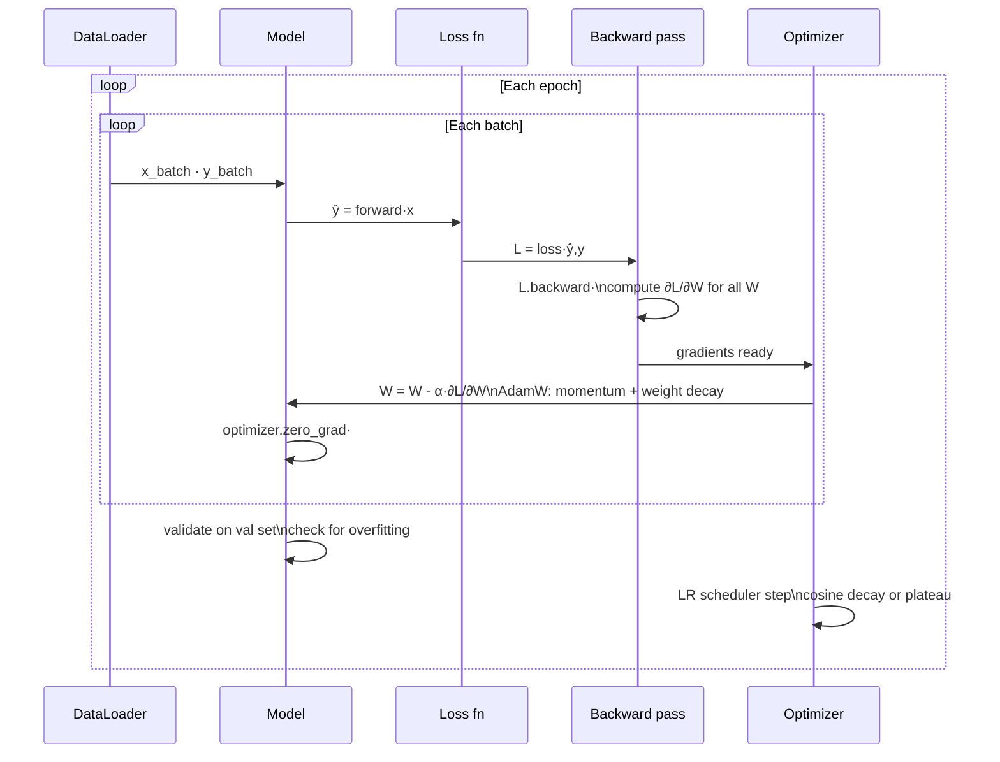

# 02 — Training Loop

## Quick Reference (30-sec scan)

- **Loop:** Forward → Loss → Backward (chain rule) → Optimizer update → Repeat
- **Backprop:** computes ∂L/∂W for every weight in one backward pass
- **Optimizer:** defines how to use the gradient — not just the direction
- **Default optimizer:** AdamW (lr=1e-4, wd=0.01) for most tasks
- **LR schedule:** cosine decay with warmup is the modern default
- **Gotcha:** Adam ≠ "always better" — tuned SGD beats Adam on CV generalization

---

## 1. The Training Loop

```python
for each Batch:
    ŷ = model(x)             # Forward pass
    L = loss(ŷ, y)           # Compute loss
    L.backward()             # Backpropagation — compute all gradients
    optimizer.step()         # Update weights
    optimizer.zero_grad()    # Clear gradients for next batch
```

That's it. Every deep learning framework runs this loop.



---

## 2. Backpropagation

**Core idea:** chain rule applied backward through the computational graph.

For a single neuron: z = Wx + b, ŷ = f(z), L = loss(ŷ, y)

```
$$\frac{\partial L}{\partial W} = \frac{\partial L}{\partial \hat{y}} \cdot \frac{\partial \hat{y}}{\partial z} \cdot \frac{\partial z}{\partial W}$$
```

**For a 2-layer network:**

```
Forward:  x → z1=W1·x+b1 → h=f(z1) → z2=W2·h+b2 → ŷ → L

Backward:
  δ_out = ∂L/∂z2 = f'(z2)          # output layer error
  ∂L/∂W2 = δ_out · h^T             # output weight gradient
  δ_hidden = (W2^T · δ_out) · f'(z1)  # propagate error back
  ∂L/∂W1 = δ_hidden · x^T          # hidden weight gradient
```

**Why backprop is efficient:** one backward pass computes gradients for ALL weights simultaneously. Numerical gradient requires one forward pass per weight — O(N) instead of O(1).

**Toy numeric example:**

```
x=1, y=2, w1=0.5, w2=0.8, lr=0.1

Forward:  z=w1*x=0.5; f(z)=z=0.5; ŷ=w2*z=w2*z=0.4
Loss:     L=0.5*(0.4-2)^2=1.28

Backward:
  ∂L/∂ŷ = 0.4-2 = -1.6
  ∂L/∂w2 = -1.6 * 0.8 = -0.8
  ∂L/∂z  = -1.6 * 0.8 = -1.28
  ∂L/∂w1 = -1.28 * 1 = -1.28

Update:
  w1 = 0.5 - 0.1*(-1.28) = 0.628
  w2 = 0.8 - 0.1*(-0.8)  = 0.88
```

---

## 3. Gradient Descent Variants

| Variant | Batch Size | Update Frequency | Behavior |
|---------|-----------|-----------------|----------|
| Batch GD | Full dataset | Once per epoch | Stable but slow, needs all data in memory |
| SGD | 1 sample | Every sample | Very noisy, fast, helps escape local minima |
| Mini-batch GD | 32-256 | Every batch | **Standard** — balance of speed + stability + GPU efficiency |

**Mini-batch is the default.** SGD in modern frameworks actually means mini-batch SGD.

---

## 4. Optimizers

### SGD + Momentum

```python
v = β·v + g        # accumulate velocity (β=0.9 typical)
w = w - η·v
```

Ball rolling downhill — builds speed in consistent directions, dampens oscillation.

### RMSProp

```python
E[g²] = β·E[g²] + (1-β)·g²
w = w - η · g / sqrt(E[g²] + ε)
```

Adapts LR per parameter based on gradient magnitude history.

### Adam

```python
m = β1·m + (1-β1)·g       # 1st moment (mean), β1=0.9
v = β2·v + (1-β2)·g²      # 2nd moment (variance), β2=0.999
m̂ = m/(1-β1^t)            # bias correction (critical early in training)
ŵ = v/(1-β2^t)
w = w - η + m̂/(sqrt(ŵ) + ε)   # η=0.001, ε=1e-8
```

Momentum + adaptive LR per parameter. Bias correction compensates for zero-init cold start.

### AdamW — current default

```python
w = w - η · [m̂/(sqrt(ŵ) + ε)]    # Adam gradient update
w = w - η · λ · w                  # weight decay applied separately
```

**Why AdamW over Adam?** In Adam+L2, the L2 penalty enters the gradient and gets scaled by 1/sqrt(v) — parameters with large gradients receive less regularization. AdamW decouples weight decay, making it parameter-independent and effective.

### Optimizer Comparison

| | SGD | SGD+Momentum | Adam | AdamW |
|--|-----|-------------|------|-------|
| Adaptive LR | No | No | Yes | Yes |
| Momentum | No | Yes | Yes | Yes |
| Weight decay correct | Yes | Yes | No | Yes |
| Best for CV (from scratch) | Sometimes | Yes | Moderate | Good |
| Best for NLP/Transformers | No | No | Good | **Yes** |
| LR sensitivity | High | High | Medium | Medium |
| Needs warmup | No | No | Yes | Yes |

### Modern Optimizers (2023-2025)

AdamW is still the default, but a handful of newer optimizers are worth knowing for senior interviews:

| Optimizer | Year | Idea | Where it wins |
|-----------|------|------|--------------|
| Lion (Google, 2023) | 2023 | sign-of-momentum update (no second moment) — half the memory of AdamW | ViT, large LLMs; needs ~3× smaller LR than AdamW |
| Sophia (Stanford, 2023) | 2023 | clipped diagonal Hessian preconditioner | LLM pretraining — ~2× faster to target loss than AdamW |
| Schedule-Free (Meta, 2024) | 2024 | reparameterized averaging; no LR schedule required | Removes warmup/cosine — useful when you don't know total step count |
| Muon (Keller Jordan, 2024) | 2024 | matrix-aware update (Newton-Schulz orthogonalization) for hidden layers | Sets nanoGPT speedrun records; pairs with AdamW for embeddings |
| Shampoo / Distributed Shampoo | — | full-matrix preconditioner factored per-layer | LLM pretraining at scale: Google PaLM-2 |

```python
# Lion via pip install lion-pytorch
from lion_pytorch import Lion
optimizer = Lion(model.parameters(), lr=1e-4, weight_decay=0.01)
# Rule: Lion LR = AdamW LR / 3 (sign-update has unit-norm steps)
```

**Senior interview answer:** "AdamW is still the safe default. I'd reach for Sophia for LLM pretraining when wall-clock time matters. Lion when memory is the binding constraint, and Schedule-Free when I don't know the training horizon upfront. Muon is the most interesting 2024 result — it explicitly accounts for the matrix structure of hidden layers."

### Sharpness-Aware Minimization (SAM)

Modern view of generalization: flat minima generalize, sharp minima overfit. **SAM modifies the objective to explicitly find flat minima:**

```
SAM objective: min_w max_{||ε|| ≤ ρ} L(w + ε)
                 ↑
        Find a w where the worst-case loss in a ρ-ball around it is low
```

Implementation: two forward-backward passes per step (one to find ε, one for the actual update). ~2× cost but consistently +1-2% test accuracy on ViT / BERT / ResNet.

```python
# Common implementation pattern
from sam import SAM  # pip install sam-pytorch
optimizer = SAM(model.parameters(), base_optimizer=torch.optim.AdamW, lr=1e-4, rho=0.05)

# First step — perturb
loss1 = criterion(model(x), y);  loss1.backward()
optimizer.first_step(zero_grad=True)
# Second step — actual update at perturbed point
loss2 = criterion(model(x), y);  loss2.backward()
optimizer.second_step(zero_grad=True)
```

**Variants:** ASAM (adaptive ρ), GSAM (gradient-projected SAM). SAM is increasingly used in vision and (controversially) in LLM fine-tuning where overfitting risk is high.

---

## 5. Learning Rate

```
$$W_{new} = W_{old} - \eta \cdot \frac{\partial L}{\partial W}$$
```

**LR is the most important hyperparameter.** Everything else is secondary.

| LR Value | Effect |
|----------|--------|
| Too small (1e-6) | Training barely moves — takes forever |
| Too large (1.0) | Overshoots minimum — loss oscillates or diverges |
| Good (1e-3 to 1e-4) | Steady convergence |

### LR Schedules

| Schedule | Behavior | Use When |
|----------|---------|----------|
| Constant | Fixed LR throughout | Baseline, short runs |
| Step decay | Reduce by factor every N epochs | CV, easy to control |
| **Cosine decay** | Smooth decrease following cosine curve | **General default** |
| Cosine + warmup | Linear ramp-up then cosine decay | Transformers, LLMs |
| Exponential | Smooth multiplicative decay | When step decay too aggressive |

**Warmup:** Start with tiny LR (1e-6), linearly increase to target LR over first 5-10% of steps. Prevents large gradient updates from destabilizing early training.

**LR range test:** Increase LR from 1e-7 to 10 across batches, plot loss. Pick LR just before loss stops decreasing.

### Typical LR Values

| Optimizer | Task | Typical LR |
|-----------|------|-----------|
| SGD + momentum | CV from scratch | 0.01 - 0.1 |
| Adam | General | 0.001 |
| AdamW | Transformers (train) | 1e-4 - 3e-4 |
| AdamW | Fine-tuning | 1e-5 - 5e-5 |

---

## 5.5. Scaling the Loop — Production Necessities

The textbook loop in §1 assumes everything fits on one GPU. Real training pipelines layer three additional concerns:

### Gradient Accumulation (Effective Batch Size > GPU Capacity)

When a target batch size doesn't fit in memory, accumulate gradients across micro-batches before stepping:

```python
accum_steps = 4  # effective batch = micro_batch * 4
for i, (x, y) in enumerate(loader):
    loss = criterion(model(x), y) / accum_steps   # scale so total grad = batch grad
    loss.backward()
    if (i + 1) % accum_steps == 0:
        optimizer.step()
        optimizer.zero_grad()
```

Used everywhere LLMs are trained — effective batch sizes of 1024-4096 require this on consumer hardware.

### Mixed Precision (FP16 / BF16)

FP32 master weights, FP16/BF16 forward+backward computation, gradient scaler to prevent underflow. ~2× speedup on Tensor Core GPUs, half the memory.

```python
from torch.amp import autocast, GradScaler
scaler = GradScaler("cuda")

with autocast("cuda", dtype=torch.bfloat16):  # bf16 if Ampere+, fp16 otherwise
    loss = criterion(model(x), y)
scaler.scale(loss).backward()
scaler.step(optimizer)
scaler.update()
optimizer.zero_grad()
```

**bf16 vs fp16:** bf16 has wider exponent (same as fp32) so no gradient scaler needed; fp16 is more precise but needs scaler. bf16 is the modern default on A100/H100.

### Distributed Training

| Strategy | Idea | When |
|----------|------|------|
| DDP (DistributedDataParallel) | Each GPU has a full model copy; gradients averaged via all-reduce | Model fits on one GPU, scaling batch |
| FSDP (Fully Sharded Data Parallel) | Shard parameters + gradients + optimizer state across GPUs | Model doesn't fit on one GPU |
| Tensor Parallel (Megatron) | Split individual matmuls across GPUs | Very large layers (Llama-70B+) |
| Pipeline Parallel | Split layers across GPUs, pipeline micro-batches | Many GPUs, deep model |
| 3D Parallel (Megatron-DeepSpeed) | Combine all three | Frontier LLM training |

For most practitioners: **DDP for fine-tuning, FSDP for any model > 13B params**, DeepSpeed ZeRO-3 as a higher-level wrapper.

```python
# DDP one-liner
model = torch.nn.parallel.DistributedDataParallel(model, device_ids=[local_rank])
```

---

## When to Use What

| Situation | Optimizer | LR | Schedule |
|-----------|----------|----|----------|
| Default (most tasks) | AdamW | 1e-4 | Cosine + warmup |
| Vision model from scratch | SGD + momentum | 0.1 | Cosine decay |
| Fine-tuning pretrained model | AdamW | 1e-5 | Constant or cosine |
| Transformer / LLM training | AdamW | 3e-4 | Cosine + warmup |
| Best final accuracy matters | SGD + momentum | tune | Cosine decay |

---

## Gotchas

**1. Adam's weight decay is broken** — always use AdamW. `Adam + L2 loss ≠ Adam + weight_decay`. The L2 gradient gets scaled by adaptive LR, meaning regularization varies per parameter. AdamW applies decay outside the update. In PyTorch, always use `torch.optim.AdamW`, never `Adam + weight_decay in loss`.

**2. Adam doesn't always generalize better than SGD.** Adam finds lower training loss but often converges to sharper minima — worse test accuracy. On ImageNet-style tasks, well-tuned SGD + cosine decay consistently outperforms Adam on final test accuracy (Wilson et al. 2017).

**3. Bias correction matters early in Adam.** At step 1, m and v are initialized to 0. Without bias correction, estimates are heavily biased toward zero — under-scaled early updates. This is why warmup + bias correction together are important.

**4. zero_grad() must be called every step.** Forgetting `optimizer.zero_grad()` accumulates gradients across batches — your gradient is now the sum of multiple batches, which is rarely what you want.

**5. LR is not "set and forget" with Adam.** Adam adapts per-parameter LR but NOT the base LR. Too high base LR still causes divergence. Too low still causes slow convergence. Default 1e-3 is a starting point, not universal.

---

## Debugging Guide

| Symptom | Likely Cause | Fix |
|---------|-------------|-----|
| Loss is NaN immediately | LR too high | Reduce LR by 10×, add gradient clipping |
| Loss decreases then explodes | LR decay too slow | Add cosine decay, clip gradients |
| Loss decreases very slowly | LR too low | Increase LR, do LR range test |
| Loss oscillates without converging | LR too high or momentum too high | Reduce η or β |
| Good train loss, poor val loss | No weight decay / overfitting | Use AdamW with wd=0.01-0.1 |
| Gradients are NaN | Exploding gradients | Add `clip_grad_norm_(model.parameters(), 1.0)` |
| Different params learning at different rates | Non-adaptive optimizer | Switch to AdamW |

---

## Code Reference

```python
import torch
import torch.nn as nn

# AdamW — default for most tasks
optimizer = torch.optim.AdamW(
    model.parameters(), lr=1e-4, weight_decay=0.01
)

# SGD + Momentum — CV from scratch
optimizer = torch.optim.SGD(
    model.parameters(), lr=0.1, momentum=0.9, weight_decay=1e-4
)

# Cosine decay
scheduler = torch.optim.lr_scheduler.CosineAnnealingLR(
    optimizer, T_max=num_epochs
)

# Cosine decay with linear warmup
from torch.optim.lr_scheduler import OneCycleLR
scheduler = OneCycleLR(
    optimizer, max_lr=1e-3, steps_per_epoch=len(train_loader), epochs=num_epochs
)

# Gradient clipping (use with RNNs and transformers)
torch.nn.utils.clip_grad_norm_(model.parameters(), max_norm=1.0)

# Standard training loop
for epoch in range(num_epochs):
    for x, y in train_loader:
        optimizer.zero_grad()
        ŷ = model(x)
        loss = criterion(ŷ, y)
        loss.backward()
        torch.nn.utils.clip_grad_norm_(model.parameters(), 1.0)  # optional
        optimizer.step()
    scheduler.step()
```

---

## Interview Q&A

**Q: Why does SGD sometimes outperform Adam on generalization?**

Adam's adaptive per-parameter learning rates allow it to find "sharp" minima — regions with very low training loss but steep surrounding landscape. Sharp minima generalize poorly because small input perturbations cause large output changes. SGD with momentum tends to find flatter minima that generalize better. This is the core argument in the Wilson et al. 2017 paper "The Marginal Value of Momentum for Small Learning Rate SGD."

**Q: What's the difference between L2 regularization and weight decay? Why does it matter for Adam?**

For SGD they are mathematically equivalent. For Adam they are NOT — L2 regularization adds λW to the gradient, which then gets scaled by 1/sqrt(v): parameters with large gradient history get less regularization. Weight decay in AdamW applies λW directly to weights, independent of gradient scaling, making regularization consistent across all parameters.

**Q: What is bias correction in Adam and when does it matter?**

At step 1, m and v are EMA initialized at 0. At step 1, m = (1-β1)·g — heavily biased toward zero. Bias correction divides by (1-β_1^t). It matters in the first ~100-500 steps. For long runs (10k+ steps), it becomes negligible (0.9^1000 ≈ 0). Combined with warmup, it ensures stable early training.

**Q: Your training loss is decreasing but validation loss starts rising after epoch 5. What do you do?**

Classic overfitting. In order: (1) check if you're using weight decay in AdamW, (2) add/increase dropout, (3) try early stopping at epoch 5, (4) get more training data or augmentation, (5) reduce model capacity. Also check if LR is too high for the later training phase — adding cosine decay often helps.

---

## Connections

- Builds on: `01_foundations.md` — forward pass produces the loss that backprop differentiates
- Leads to: `03_training_stability.md` — gradient problems (vanishing/exploding) occur during backprop
- Leads to: `04_generalization.md` — optimizer choice + LR schedule affect overfitting
- Relevant in: `05_modern_components.md` — transformers use AdamW + warmup as standard
- **If this isn't working:** check gradient norms (should be 0.1-10 range), check LR, check weight decay

---

## Key Takeaway

```
Loop:      Forward → Loss → Backward → Update → Repeat
Backprop:  one backward pass computes ALL gradients via chain rule
Optimizer: AdamW default (fixes Adam's weight decay bug)
LR:        most important hyperparameter — use cosine decay with warmup
Gotcha:    Adam trains faster but SGD often generalizes better on CV
```
