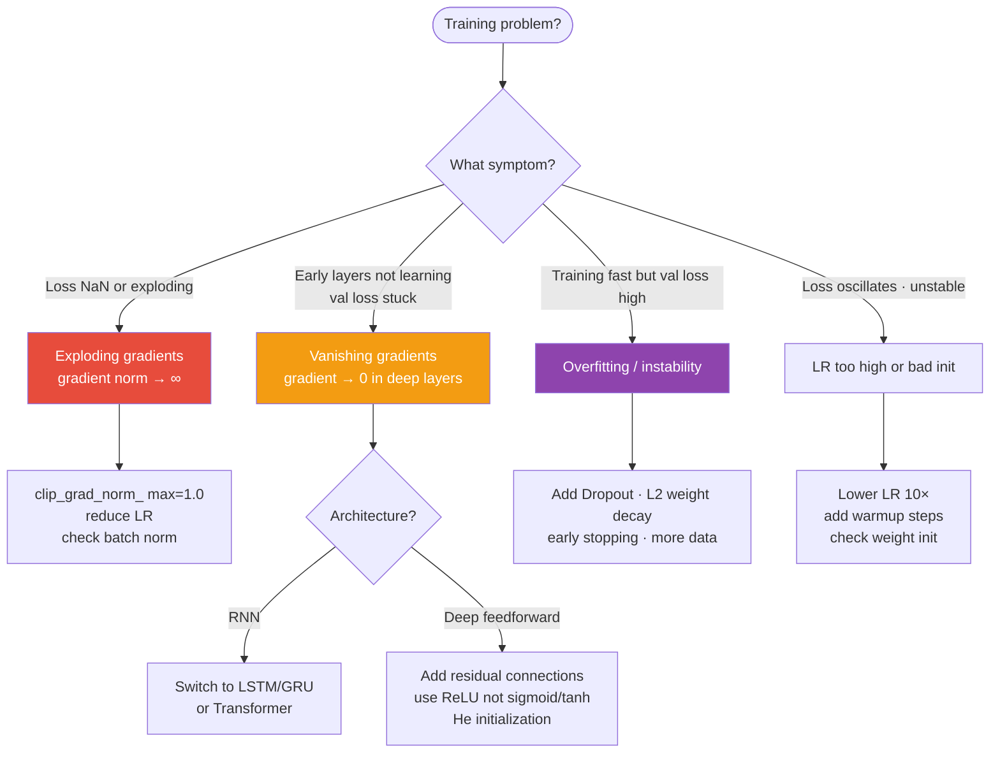

# 03 — Training Stability

## Quick Reference (30-sec scan)

- **Vanishing gradients:** chain rule multiplies small numbers → early layers stop learning → use ReLU + residuals
- **Exploding gradients:** chain rule multiplies large numbers → NaN loss → use gradient clipping
- **Initialization:** bad init → broken training from step 0; He for ReLU, Xavier for sigmoid/tanh
- **BatchNorm:** normalizes across batch → fast training, good for CNN; doesn't work at batch=1
- **LayerNorm:** normalizes across features → standard for transformers, works at any batch size
- **RMSNorm:** simplified LayerNorm (no mean centering) → used in LLaMA, Mistral, Gemma

---



## 1. Vanishing & Exploding Gradients

During backprop, gradients travel through every layer via the chain rule:

```
$$\frac{\partial L}{\partial W_1} = \frac{\partial L}{\partial \hat{y}} \cdot \frac{\partial \hat{y}}{\partial z} \cdot \ldots \times W_L \cdot W_{L-1} \times \ldots \times W_2 \times f'_1$$

This is repeated multiplication. The result depends entirely on the magnitude of each term.
```

### Vanishing Gradients

If terms < 1 (e.g., sigmoid derivatives max at 0.25):

```
0.25 × 0.25 × 0.25 × 0.25 × 0.25 = 0.001   (5 layers)
0.25^10 = 0.000001                            (10 layers)

Early layers receive ~0 gradient — they stop learning — only last few layers learn.
```

### Exploding Gradients

If terms > 1:

```
1.5^5  = 7.6    (5 layers)
1.5^10 = 57     (10 layers)

Weights update by huge amounts — loss becomes NaN — training crashes.
```

### Root Causes

| Problem | Common Causes |
|---------|--------------|
| Vanishing | Sigmoid/tanh activation, small weight init, deep networks without residuals |
| Exploding | Large weight init, large LR, long RNN sequences, no gradient clipping |

### Solutions

| Solution | Addresses | How |
|----------|-----------|-----|
| ReLU activation | Vanishing | Gradient = 1 for positive inputs, no shrinkage |
| He/Xavier initialization | Both | Controls variance so signals don't shrink/explode from step 0 |
| Gradient clipping | Exploding | Caps gradient norm before it updates weights |
| BatchNorm / LayerNorm | Both | Normalizes activations, stabilizes gradient magnitudes |
| Residual connections | Vanishing | Gradient highway bypasses layers directly |

---

## 2. Weight Initialization

**Why it matters:** training starts with gradients flowing through random weights. If the scale is wrong, training is broken from step 0 — not a training problem, an initialization problem.

### Goal

Signals should maintain stable scale across layers — neither shrinking nor exploding.

### What Happens With Bad Init

| Init | Forward Pass | Backward Pass | Result |
|------|-------------|--------------|--------|
| All zeros | All activations = 0 | All neurons get identical gradient | Symmetry problem — all neurons learn same thing |
| Too small (N(0, 0.0001)) | Signals shrink to ~0 | Gradients vanish | Training stalls |
| Too large (N(0, 5)) | Saturated activations | Gradients explode | Training unstable |

### Xavier / Glorot Initialization

Designed for **sigmoid/tanh** activations.

```
$$W \sim \mathcal{N}\left(0, \sqrt{\frac{2}{n_{in} + n_{out}}}\right)$$
```

Keeps variance constant when using symmetric, saturating activations.

### He Initialization

Designed for **ReLU** activations.

```
$$W \sim \mathcal{N}\left(0, \sqrt{\frac{2}{n_{in}}}\right)$$
```

ReLU zeroes out ~50% of neurons, so variance needs to be ~2× larger than Xavier to compensate.

**Toy example** (fan_in = 256):

```
Xavier std = sqrt(2 / (256 + 128)) = sqrt(0.0052) = 0.072
He     std = sqrt(2 / 256)         = sqrt(0.0078) = 0.088
```

### Initialization Lookup Table

| Activation | Initialization |
|-----------|----------------|
| ReLU | He (MSRA) |
| Leaky ReLU | He |
| Sigmoid | Xavier |
| Tanh | Xavier |
| GELU (Transformers) | Xavier or small constant std |
| Linear output | Xavier |

---

## 3. Normalization

**Why needed:** during training, activation distributions shift as weights change — each layer must constantly adapt to unstable input distributions (internal covariate shift). This slows training and causes gradient problems.

Normalization standardizes activations to have consistent mean and variance.

### Batch Normalization

Normalizes **across the batch dimension** for each feature.

```python
# For a batch of N samples, feature j:
μ_j = mean of feature j across N samples
σ²_j = variance of feature j across N samples
x̂_j = (x_j - μ_j) / sqrt(σ²_j + ε)
y = γ · x̂_j + β    # γ, β are learned parameters
```

**Placement:** typically Conv → BN → ReLU (before activation).

**At inference:** uses running mean/variance computed during training (not batch stats).

### Layer Normalization

Normalizes **across the feature dimension** within a single sample.

```python
# For one sample with d features:
μ = mean of all features for this sample
σ² = variance of all features for this sample
x̂ = (x - μ) / sqrt(σ² + ε)
y = γ · x̂ + β
```

**Key difference from BatchNorm:** completely independent of batch size — same computation at batch=1 and batch=1024.

### RMSNorm

Simplified LayerNorm — removes the mean centering step.

```
$$\text{RMSNorm}(x) \cdot \gamma \cdot \text{gamma} \quad \text{where} \quad \text{RMS}(x) = \sqrt{\frac{1}{d}\sum_i x_i^2}$$
```

Faster to compute, empirically matches LayerNorm on LLM tasks. Used in LLaMA, Mistral, Gemma.

### GroupNorm and InstanceNorm (Worth Knowing)

**GroupNorm:** split features into G groups, normalize within each group. Independent of batch size — used when BatchNorm can't be (segmentation, detection, small batches). Replaces BN in many modern vision models (ConvNeXt uses LayerNorm; some use GroupNorm).

**InstanceNorm:** GroupNorm with G = num_features (normalize each feature independently per sample). Used in style transfer and unpaired image translation (CycleGAN), where batch statistics would average across stylistically different samples.

### Normalization Comparison

| | BatchNorm | LayerNorm | RMSNorm | GroupNorm | InstanceNorm |
|--|-----------|-----------|---------|-----------|-------------|
| Normalizes over | Batch | Features | Features (no mean) | Feature groups | Each feature |
| Batch-size dependent | Yes | No | No | No | No |
| Train/inference diff | Yes (running stats) | No | No | No | No |
| Used in | CNNs, ResNets | BERT, GPT-2 | LLaMA, Mistral, Gemma | Detection, segmentation, small batch | Style transfer, CycleGAN |

---

## 3.5. Modern Stability Techniques (2020+)

### Stochastic Depth / DropPath

Drop entire residual branches probabilistically during training:

```python
class ResidualBlock(x):
    if training and rand() < p_drop:
        return x               # skip entire branch
    return x + SubLayer(LayerNorm(x))
```

Effect: each forward pass uses a different sub-network — like dropout but at the layer level. Standard in modern ViT, Swin, ConvNeXt, DiT (Diffusion Transformer). Typically scheduled per-depth: `p_drop_l = (l / L) · p_max` so deeper layers drop more.

```python
from timm.layers import DropPath
self.drop_path = DropPath(drop_prob=0.1)
# usage: x = x + self.drop_path(self.attn(self.norm(x)))
```

### μP (Maximal Update Parametrization)

When you scale the model width (e.g., 18 → 7B params), the optimal learning rate normally has to be retuned. μP reparameterizes weights and learning rates so that **optimal hyperparameters transfer across scale** — you tune at small scale, apply at large scale.

Used by Microsoft and Cerebras for cost-efficient hyperparameter search at large model sizes. Worth mentioning in any LLM-scaling interview.

### EMA of Weights (Exponential Moving Average)

Maintain a slow-moving average of model weights alongside the trained model. Use the EMA copy for evaluation/serving:

```python
ema_decay = 0.999
for p_ema, p in zip(ema_model.parameters(), model.parameters()):
    p_ema.data.mul_(ema_decay).add_(p.data, alpha=1 - ema_decay)
```

Smooths out late-training noise. Used in essentially every diffusion model (Stable Diffusion, SDXL), self-supervised learning (BYOL, DINO), and increasingly in LLM pretraining (DeepSeek-V2/3). Often gives +0.5-1% with no extra training cost.

### ReZero

Initialize residual scaling to zero, learn it back: `x_out = x + α · SubLayer(x)` with α initialized to 0. Equivalent to identity at init — trivially stable; α grows as training progresses. Useful for very deep networks without normalization.

---

## When to Use What

| Situation | Choice |
|-----------|--------|
| CNN / vision model | BatchNorm (between conv and activation) |
| Transformer / BERT / GPT-2 | LayerNorm |
| LLaMA / Mistral / modern LLMs | RMSNorm |
| Small batch or single-sample inference | LayerNorm or RMSNorm (never BatchNorm) |
| ReLU hidden layers init | He initialization |
| Sigmoid/tanh/GELU init | Xavier initialization |
| Exploding gradients in RNNs | Gradient clipping (norm=1.0) |

---

## Gotchas

**1. BatchNorm at inference uses different statistics than training.** During training, BN uses batch mean/variance. During inference, it uses running averages accumulated during training. Forgetting `model.eval()` before inference means BN still uses batch stats — random behavior for small inference batches.

**2. Dropout + BatchNorm conflict.** BN statistics are computed on all neurons. Dropout randomly zeros neurons. Together they can cause inconsistent statistics between training and inference. Use one or the other, not both in the same layer. Modern practice: no dropout + BN together in CNNs.

**3. All-zero init symmetry is worse than you think.** Even with non-zero bias, if all weights are zero, all neurons compute the same thing, get the same gradient, and update identically. They never differentiate. This wastes model capacity entirely.

**4. He init is not optional for deep ReLU networks.** In a 50-layer ReLU network with wrong init, activations either vanish or explode by layer 10. He init is designed so variance stays =1 through 100+ layers. Skip it and you're training blind.

**5. Gradient clipping threshold matters.** Too high (e.g., clip_norm=100) → effectively no clipping. Too low (e.g., clip_norm=0.01) → gradients too small to learn. `max_norm=1.0` is a good starting point for transformers.

---

## Debugging Guide

| Symptom | Likely Cause | Fix |
|---------|-------------|-----|
| Loss is NaN at step 1-5 | Weight init too large + high LR | Use He/Xavier init, reduce LR |
| Loss is NaN after stable training | Exploding gradients | Add `clip_grad_norm_(params, 1.0)` |
| Early layers not learning | Vanishing gradients | Check activations (use ReLU), check init |
| BN works in training but breaks at inference | Forgot `model.eval()` | Always call `model.eval()` before inference |
| Model output changes randomly at same input | Dropout active at inference | Call `model.eval()` — disables dropout + fixes BN |
| Training loss good, BN layer shows strange variance | BatchNorm with very small batch | Switch to LayerNorm or GroupNorm |

---

## Code Reference

```python
import torch
import torch.nn as nn

# Initialization
def init_weights(m):
    if isinstance(m, nn.Linear):
        nn.init.kaiming_normal_(m.weight, nonlinearity='relu')  # He init
        nn.init.zeros_(m.bias)
    elif isinstance(m, nn.Conv2d):
        nn.init.kaiming_normal_(m.weight, mode='fan_out', nonlinearity='relu')

model.apply(init_weights)

# Batch Normalization
bn = nn.BatchNorm2d(num_features=64)   # for CNN (after conv layer)
bn = nn.BatchNorm1d(num_features=256)  # for FC layer

# Layer Normalization
ln = nn.LayerNorm(normalized_shape=768)  # for transformer hidden dim

# RMSNorm (not in standard PyTorch — from transformers library)
# from transformers import LlamaRMSNorm

# Gradient clipping (call after loss.backward(), before optimizer.step())
torch.nn.utils.clip_grad_norm_(model.parameters(), max_norm=1.0)

# Train/eval switching
model.train()   # enables dropout, uses batch stats in BN
model.eval()    # disables dropout, uses running stats in BN

# CNN block with BatchNorm
class ConvBlock(nn.Module):
    def __init__(self, in_ch, out_ch):
        super().__init__()
        self.block = nn.Sequential(
            nn.Conv2d(in_ch, out_ch, 3, padding=1),
            nn.BatchNorm2d(out_ch),
            nn.ReLU(inplace=True)
        )
    def forward(self, x):
        return self.block(x)

# Transformer block with LayerNorm (pre-norm pattern)
class TransformerBlock(nn.Module):
    def __init__(self, d_model):
        super().__init__()
        self.ln1 = nn.LayerNorm(d_model)
        self.attn = nn.MultiheadAttention(d_model, num_heads=8, batch_first=True)
        self.ln2  = nn.LayerNorm(d_model)
        self.ffn  = nn.Sequential(nn.Linear(d_model, 4*d_model), nn.GELU(), nn.Linear(4*d_model, d_model))

    def forward(self, x):
        x = x + self.attn(self.ln1(x), self.ln1(x), self.ln1(x))[0]  # residual
        x = x + self.ffn(self.ln2(x))                                  # residual
        return x
```

---

## Interview Q&A

**Q: Why does ReLU help with vanishing gradients but not exploding gradients?**

ReLU's gradient is 1 for positive inputs — so the gradient doesn't shrink through positive neurons. But for large weights, the forward activations can still grow exponentially, and if any weight matrix has eigenvalues > 1, the gradient still explodes during backprop through weight matrices. ReLU solves vanishing but doesn't constrain the weight magnitudes that cause exploding. That requires initialization + clipping.

**Q: Why is He initialization specifically designed for ReLU and not usable with sigmoid?**

Xavier is derived assuming the activation's gradient doesn't shrink or grow near 0 (symmetric activations like tanh/sigmoid). ReLU zeroes out negative inputs, effectively halving the variance of activations — so to compensate, He init doubles the variance (2/fan_in vs Xavier's 1/fan_in). Using Xavier with ReLU results in activations that shrink by ~0.5× per layer.

**Q: Why can't you use BatchNorm with batch size 1?**

BatchNorm normalizes using mean and variance computed across the batch. At batch_size=1, mean = the single sample's mean and variance = 0, making (x - μ)/σ undefined. Alternative: LayerNorm (normalizes across features), GroupNorm (normalizes across feature groups), or InstanceNorm (normalizes across spatial dimensions).

**Q: What is the difference between pre-norm and post-norm in transformers?**

Post-norm (original "Attention Is All You Need" paper): `LayerNorm(x + SubLayer(x))`. Pre-norm (modern LLMs): `x + SubLayer(LayerNorm(x))`. Pre-norm has better training stability because the residual stream is always un-normalized, giving gradients a clean path. Post-norm is harder to train from scratch but sometimes achieves slightly better final performance.

---

## Connections

- Builds on: `02_training_loop.md` — gradients computed in backprop are the ones that vanish/explode
- Builds on: `01_foundations.md` — activation choice (sigmoid vs ReLU) is the primary cause of vanishing gradients
- Leads to: `04_generalization.md` — normalization also acts as regularization; dropout interacts with BN
- Relevant in: `05_modern_components.md` — residual connections + LayerNorm are inside every transformer block
- **If gradients are NaN:** check in order → init → LR → gradient clipping → normalization

---

## Key Takeaway

```
Vanishing:  chain rule × small numbers → early layers stop learning → ReLU + residuals
Exploding:  chain rule × large numbers → NaN loss → clip gradients (norm=1.0)
Init:       He for ReLU, Xavier for sigmoid/tanh — wrong init = broken from step 0
BatchNorm:  across batch — great for CNNs. Breaks at batch=1, don't use with dropout
LayerNorm:  across features — standard for transformers, batch-size independent
RMSNorm:    simpler LayerNorm — LLaMA, Mistral, modern LLMs
```
