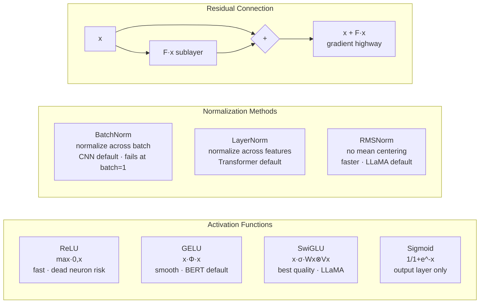

# 05 — Modern Components

## Quick Reference (30-sec scan)

- **Residual connections:** output = F(x) + x — gradient highway, solved depth problem in 2015
- **Embeddings:** dense learned vectors for discrete inputs — lookup table [vocab_size × embed_dim]
- **Attention:** softmax(QK^T/√d_k) × V — every token directly attends to every other token
- **Multi-head:** run attention in parallel with different weights → captures different relationship types
- **Self vs cross:** self-attention = same sequence (encoder); cross-attention = two sequences (encoder-decoder)
- **Gotcha:** attention is O(n²) in sequence length — becomes a bottleneck for very long sequences

---


> Residuals solved the depth problem (2015): gradient can skip any sublayer via the + shortcut, reaching early layers without vanishing.

## 1. Residual Connections

### The Problem They Solved

Before 2015, deeper networks performed worse even on training data:

```
20-Layer ResNet: training error = 0.56
56-Layer ResNet: training error = 0.68   + deeper = worse

Cause: vanishing gradients through 56 layers of repeated multiplication.
```

### The Fix

Add a direct shortcut from input to output of each block:

```
Without residual:          With residual:
x → [F(x)] → out          x → [F(x)] → + → out
                                    ↑
                               (shortcut)

$$\text{output} = F(x) + x$$
```

### Why It Works

**Gradient highway:** during backprop, gradient flows through two paths: · Path 1: through the layers (potentially vanishing) · Path 2: directly through the shortcut (gradient = 1, always intact)

```
Total gradient = ∂F/∂x + 1   ← the +1 keeps gradients alive
```

**Learning identity is trivial:** without residuals, a useless layer must learn to approximate identity. With residuals, it just needs F(x) = 0 (drive weights to zero), and output = 0 + x = x. Optimization is much easier.

### Residual Block (ResNet)

```
Input x
    |
    ├─────────── identity shortcut ─────────────┐
    |                                            |
 Conv → BN → ReLU                               |
    |                                            |
 Conv → BN                                      |
    |                                            |
    └──────────────────── + ─────────────────────┘
                          |
                        ReLU
                          |
                        output
```

**Dimension mismatch:** if F(x) and x have different shapes, use a 1×1 conv as projection shortcut: `output = F(x) + W_s×x`.

### Where Residuals Appear

| Architecture | Usage |
|-------------|-------|
| ResNet (2015) | Skip connections in CNN blocks |
| Transformer | Residual around every attention + FFN sublayer |
| BERT, GPT | Every layer has residual |
| U-Net | Skip connections across encoder-decoder levels |
| DenseNet | Each layer connected to ALL previous layers |

---

## 2. Embeddings

### The Problem

Neural networks require numerical input. Discrete inputs (words, user IDs, categories) cannot be directly fed in.

**One-hot encoding** (naive solution):

```python
Vocab size = 50,000
cat = [1, 0, 0, ..., 0]   # 50,000-dim vector
dog = [0, 1, 0, ..., 0]   # 50,000-dim vector

distance(cat, dog) = distance(cat, car)  → no semantic relationship
```

Problems: sparse, high-dimensional, no relationships encoded.

### What Embeddings Are

A **learned lookup table** of shape [vocab_size × embed_dim]:

```python
# 50,000 words mapped to 256-dim vectors
Embedding table: [50000, 256]
cat = table[cat_index] = [0.2, 0.8, -0.1, ...]   # dense, 256-dim
dog = table[dog_index] = [0.3, 0.7, -0.2, ...]   # similar to cat

distance(cat, dog) << distance(cat, car)   → semantic similarity encoded
```

Embeddings are initialized randomly and updated via backpropagation — just a weight matrix with a fast index-based lookup.

### How Embeddings Are Learned

Words appearing in similar contexts receive similar gradient updates → similar representations.

```
"The [cat] sat on the mat"
"The [dog] sat on the mat"
→ cat and dog get similar embeddings because they share context
```

This is the core idea behind Word2Vec, GloVe, and contextual embeddings in BERT.

### Static vs Contextual

| | Static (Word2Vec, GloVe) | Contextual (BERT, GPT) |
|--|--------------------------|------------------------|
| Same word, different context | Same embedding always | Different embedding per context |
| "bank" (river) vs "bank" (money) | Same vector | Different vectors |
| Parameters | Fixed after training | Updated per context via attention |

### Embedding Dimensions

| Use Case | Typical Dim |
|----------|------------|
| Small vocab (<1K) | 8-32 |
| Word embeddings | 50-300 |
| BERT tokens | 768 |
| GPT-3 tokens | 12,288 |
| Recommendation systems | 32-256 |

### Pre-trained Embeddings

| Embedding | Data | Dim |
|-----------|------|-----|
| Word2Vec | Google News (100B words) | 300 |
| GloVe | Wikipedia + CommonCrawl | 50-300 |
| BERT | Wikipedia + Books | 768 |
| FastText | Wikipedia (157 langs) | 300 |

**Freeze vs fine-tune:** freeze when your dataset is small (fine-tuning destroys pre-trained representations). Fine-tune when you have enough data and domain differs from pre-training.

### Positional Embeddings (Bridge to Transformers)

Transformers process tokens in parallel — no built-in notion of order. Positional embeddings add position information:

```python
final_input = token_embedding + positional_embedding
```

Types: · **Sinusoidal** (original transformer): fixed mathematical pattern, generalizes to longer sequences · **Learned** (BERT, GPT-2): position vectors learned as parameters · **RoPE** (Rotary, LLaMA/GPT-NeoX): rotates Q/K vectors by angle proportional to position → better length generalization

---

## 3. Attention Mechanism

### The Problem Before Attention

RNNs process sequentially: h1 → h2 → ... → hN. For "The cat sat on the mat because it was tired" — connecting "it" to "cat" requires information to survive 7 hidden state transitions. Long-range dependencies degrade.

**Attention fixes this: every position directly attends to every other position** in one step.

### Q, K, V — The Core

Borrowed from information retrieval:

```
Query (Q) = what am I looking for?
Key   (K) = what do I have to offer?
Value (V) = what information do I actually contain?

Library analogy:
  Query = your search term
  Key   = book titles
  Value = book contents
  → Attention finds books whose Key matches your Query, returns mix of their contents
```

### Scaled Dot-Product Attention

```
$$\text{Attention}(Q, K, V) = \text{softmax}\left(\frac{QK^T}{\sqrt{d_k}}\right) V$$

Step by step:

Step 1 — Compute similarity scores:
  scores = Q × K^T          shape: [seq_len, seq_len]
  scores[i,j] = how much position i attends to position j

Step 2 — Scale:
  scores = scores / √d_k
  Why: dot products grow with d_k → large values → softmax saturation → vanishing grads

Step 3 — Softmax (per row):
  weights = softmax(scores)  → attention probabilities, each row sums to 1
  weights[i] = [0.05, 0.85, 0.05, ...]  → how much it attends to each position

Step 4 — Weighted sum of Values:
  output = weights × V       → each position is a mix of all values
```

**Toy example:**

```
Sentence: "cat sat" | embed_dim=2
Q = K = V = [[1.0, 0.0],   (cat)
             [0.0, 1.0]]   (sat)

Scores = Q × K^T = [[1.0, 0.0],    After Softmax: [[0.73, 0.27],
                    [0.0, 1.0]]                    [0.27, 0.73]]

cat_output = 0.73×[1,0] + 0.27×[0,1] = [0.73, 0.27]
sat_output = 0.27×[1,0] + 0.73×[0,1] = [0.27, 0.73]

Each token now carries information from all tokens, weighted by relevance.
```

### Multi-Head Attention

Run attention h times in parallel with different learned projections:

```
Head 1: Q=W_Q1·x, K=W_K1·x, V=W_V1·x → output1  (learns syntactic patterns)
Head 2: Q=W_Q2·x, K=W_K2·x, V=W_V2·x → output2  (learns semantic patterns)
...
Head h: ...

MultiHead = Concat(output1, ..., output_h) × W_O
```

Each head attends to different aspects simultaneously. h typical values: 8 (BERT-base), 12 (GPT-2), 32 (LLaMA-7B), 96 (GPT-3).

### Self-Attention vs Cross-Attention

| | Self-Attention | Cross-Attention |
|--|---------------|----------------|
| Q, K, V source | Same sequence | Q from one seq; K, V from another |
| Used in | Encoder (BERT), Decoder causal masking (GPT) | Encoder-decoder (translation, captioning) |
| What it does | Each token attends to all tokens in same sequence | Decoder tokens attend to encoder output |

**Causal (masked) self-attention** (GPT-style): each position can only attend to previous positions — prevents seeing the future during autoregressive generation. Implemented by masking the upper triangle of the attention matrix to -∞ before softmax.

### Complexity

| | Time Complexity | Parallelizable? |
|--|----------------|-----------------|
| RNN | O(n) sequential | No — step t depends on t-1 |
| Attention | O(n²) | Yes — all pairs computed simultaneously |

At n=512: attention computes 262,144 pairs — expensive but fully parallel on GPU. This is why transformers train 10-100× faster than RNNs on modern hardware.

For very long sequences (n > 4096): O(n²) becomes a bottleneck. Solutions: FlashAttention, sliding window attention (Longformer), linear attention approximations.

### FlashAttention (1 → 3)

FlashAttention is the IO-aware attention kernel that made long-context training practical. Same math as standard attention, but reorders the computation to minimize HBM↔SRAM transfers.

| Version | Year | Win |
|---------|------|-----|
| FlashAttention 1 (Dao et al, 2022) | 2022 | tiles attention to keep activations in SRAM; never materializes the full n×n matrix → O(n) memory, ~2× speedup |
| FlashAttention 2 (Dao, 2023) | 2023 | better work partitioning across warps, less non-matmul; another ~2× over v1 |
| FlashAttention 3 (2024) | 2024 | async warp-specialization on H100 (TMA + WGMMA); FP8 support; up to 1.5-2× over v2 on H100 |

For most users: enable via `attn_implementation="flash_attention_2"` in HuggingFace, or use `torch.nn.functional.scaled_dot_product_attention` (PyTorch 2.x autoselects FlashAttention or Math kernel based on hardware).

---

## 4. Modern Position Encodings (RoPE / ALiBi / YARN)

| Method | Idea | Used in |
|--------|------|---------|
| RoPE (Rotary) | Rotate Q and K by position-dependent angles → relative-position encoding "for free" | LLaMA, Mistral, Gemma, Qwen — current default |
| ALiBi | Add linear position bias to attention scores: attn += -m·\|i-j\| (no embedding) | MPT, BLOOM; extrapolates to longer sequences cheaply |
| YARN | RoPE + per-frequency interpolation/extrapolation rules → extend context from 4K to 128K with minimal fine-tuning | LLaMA-3 long context, Qwen 128K; Mistral V3 v0.2 |
| xPos | RoPE-like + length-decay → preserves locality at long context | Used in some retrieval-focused models |

See the full transformer treatment in `../02_architectures/04_transformer.md`.

---

## 5. Mamba and State Space Models (Transformer's 2024 Alternative)

Transformers are O(n²) in sequence length. **State Space Models (SSMs)** model sequences with a learned linear recurrence — O(n) compute, O(1) inference memory, parallelizable via clever associative scan.

```
Continuous-time SSM:  x'(t) = Ax(t) + Bu(t),   y(t) = Cx(t) + Du(t)
Discretized:          h_t = Ā · h_{t-1} + B̄ · u_t
                      y_t = C · h_t
```

| Model | Year | Notes |
|-------|------|-------|
| S4 (Albert Gu, 2021) | 2021 | First scalable SSM; HiPPO-derived A matrix; competitive on Long Range Arena | research |
| S4D (Diagonal S4, 2022) | 2022 | Simplified A; easier engineering | research |
| Mamba / S6 (Gu & Dao, 2023) | 2023 | **Selective** SSM — A, B, C depend on input — content-dependent gating, like attention but linear-time | first SSM to match Transformers on language at scale |
| Mamba-2 (2024) | 2024 | Unifies SSMs and attention via SSD (state space duality); matmul-heavy — fast on GPU | base model in many 2024 hybrid LLMs |
| Jamba / Zamba / Samba (2024) | 2024 | Hybrid Transformer + Mamba — best of both | longer context, faster inference |

**When SSMs win:** very long sequences (DNA, audio, long context LLMs), streaming inference, edge deployment. **When Transformers still win:** tasks needing precise associative recall (in-context learning from explicit examples). Hybrid models (Jamba, Zamba) split the difference.

---

## 6. SwiGLU / GeGLU (Modern FFN Activations)

The FFN in standard transformers is `Linear → GELU → Linear`. Modern LLMs use **gated variants** that consistently improve quality:

```python
SwiGLU(x) = (Swish(W1 · x)) ⊙ (W3 · x)
              ↑ gate (Swish nonlinearity)   ↑ value branch
```

| Activation | FFN block | Used in |
|-----------|-----------|---------|
| GELU | Linear → GELU → Linear | BERT, GPT-2/3, original transformer |
| SwiGLU | gated, with Swish | LLaMA, PaLM, Mistral, Gemma |
| GeGLU | gated, with GELU | T5 v1.1, some Chinese LLMs |
| ReGLU | gated, with ReLU | Rare |

SwiGLU uses 3 matrices instead of 2, but with hidden dim reduced from 4× to ~2.67× to keep parameter count similar. Net win: ~1-2 percentage points on benchmarks at the same parameter budget.

### One Transformer Layer

```
Input x
  → LayerNorm(x)                      # pre-norm (modern)
  → MultiheadSelfAttention(Q,N,V)
  → x = x + attention_output          # residual connection
  → LayerNorm(x)                      # pre-norm
  → FeedForward(x) [Linear→GELU→Linear]
  → x = x + ffn_output                # residual connection
→ Output x

N such layers stacked = Transformer encoder (BERT) or decoder (GPT).
```

---

## When to Use What

| Situation | Component | Notes |
|-----------|-----------|-------|
| Deep network (>20 layers) | Residual connections | Non-negotiable for training stability |
| Discrete inputs (words, IDs) | Embeddings | Start with pre-trained if available |
| Sequence tasks, long-range dependencies | Self-attention | Replaces RNNs |
| Encoder-decoder (translation, summarization) | Cross-attention | Connect encoder output to decoder |
| Document classification | BERT (bidirectional self-attention) | Sees full context |
| Text generation | GPT (causal self-attention) | Autoregressive, left-to-right |
| Vision with global context | ViT | Self-attention on image patches |
| Small dataset, NLP | Freeze pre-trained embeddings | Prevents destroying representations |
| Large dataset, domain-specific | Fine-tune embeddings | Domain adaptation |

---

## Gotchas

**1. Attention is O(n²) — sequence length is a hard constraint.** Doubling sequence length quadruples compute AND memory. This is why standard transformers have context limits (512, 2048, 4096 tokens). For long documents, use hierarchical attention, sparse attention, or chunking strategies.

**2. Without positional embeddings, transformers are permutation invariant.** Self-attention treats the input as a set, not a sequence: Shuffle the tokens → same output (just reordered). Positional embeddings are not optional — they inject order information. RoPE is the current best practice for LLMs.

**3. Residual connection requires same dimensions.** F(x) + x requires F(x) and x to have the same shape. When changing dimensions (e.g., between stages in ResNet), use a 1×1 convolution projection. Forgetting this causes a shape mismatch error.

**4. Embedding layer is just a weight matrix — it participates in backprop.** People sometimes treat embeddings as preprocessing. They are parameters. They receive gradients. Freezing (`.requires_grad = False`) stops learning — use intentionally.

**5. Pre-norm vs post-norm matters for training stability.** Original transformer uses post-norm: `LayerNorm(x + SubLayer(x))`. Modern LLMs use pre-norm: `x + SubLayer(LayerNorm(x))`. Pre-norm trains much more stably from scratch. If training a transformer from scratch and it diverges, switch to pre-norm.

**6. Temperature in softmax (attention) affects sharpness.** `softmax(scores/T)`: T<1 → sharper attention (model focuses on fewer positions); T>1 → softer (more distributed). The √d_k scaling IS temperature control — without it, large d_k → T effectively →0 → softmax collapses to argmax → vanishing gradients.

---

## Debugging Guide

| Symptom | Likely Cause | Fix |
|---------|-------------|-----|
| Transformer training diverges | Post-norm, no warmup, high LR | Switch to pre-norm, add warmup |
| Attention weights are all uniform | d_k too large, no scaling | Ensure scaling by √d_k |
| Attention weights collapse to one position | Temperature too low | Check d_k; check for numerical issues |
| Embedding layer grows huge (vocab×dim) | Embedding dim too large | Reduce dim; use weight tying for language models |
| Sequence model ignores long-range info | Using RNN, not attention | Switch to attention-based architecture |
| OOM on long sequences | O(n²) attention | Use FlashAttention, reduce seq length, or sparse attention |
| Model predicts same output for shuffled input | Missing positional embeddings | Add positional embeddings |

---

## Code Reference

```python
import torch
import torch.nn as nn

# Residual block (FC)
class ResidualBlock(nn.Module):
    def __init__(self, dim):
        super().__init__()
        self.layers = nn.Sequential(nn.Linear(dim, dim), nn.ReLU(), nn.Linear(dim, dim))
        self.norm   = nn.LayerNorm(dim)

    def forward(self, x):
        return x + self.layers(self.norm(x))  # pre-norm + residual

# Embedding layer
embedding = nn.Embedding(num_embeddings=50000, embedding_dim=256)
# Usage: embedding(torch.tensor([42])) → vector of shape [1, 256]

# Load pre-trained embeddings (GloVe)
embedding.weight.data.copy_(pretrained_vectors)
embedding.weight.requires_grad = False   # freeze

# Self-attention (PyTorch built-in)
attn = nn.MultiheadAttention(embed_dim=256, num_heads=8, batch_first=True)
output, weights = attn(query=x, key=x, value=x)  # self attention

# Cross-attention
output, weights = attn(query=decoder_x, key=encoder_x, value=encoder_x)

# Causal mask for GPT-style attention
seq_len = 512
causal_mask = torch.triu(torch.ones(seq_len, seq_len), diagonal=1).bool()
output, _ = attn(x, x, x, attn_mask=causal_mask)

# Full transformer encoder layer (pre-norm)
encoder_layer = nn.TransformerEncoderLayer(
    d_model=256, nhead=8, dim_feedforward=1024,
    dropout=0.1, activation='gelu', batch_first=True,
    norm_first=True  # pre-norm
)
transformer = nn.TransformerEncoder(encoder_layer, num_layers=6)

# Positional encoding (sinusoidal)
class SinusoidalPE(nn.Module):
    def __init__(self, d_model, max_len=5000):
        super().__init__()
        pe  = torch.zeros(max_len, d_model)
        pos = torch.arange(max_len).unsqueeze(1)
        div = torch.exp(torch.arange(0, d_model, 2) * (-torch.log(torch.tensor(10000.0)) / d_model))
        pe[:, 0::2] = torch.sin(pos * div)
        pe[:, 1::2] = torch.cos(pos * div)
        self.register_buffer('pe', pe.unsqueeze(0))

    def forward(self, x):
        return x + self.pe[:, :x.size(1)]
```

---

## Interview Q&A

**Q: Why do residual connections allow training of networks with 100+ layers when plain CNNs couldn't go beyond ~20?**

The degradation problem — deeper plain networks had worse training accuracy, not just test accuracy. The issue was gradient vanishing through repeated multiplication. Residual connections create a gradient highway: ∂(F(x)+x)/∂x = ∂F/∂x + 1. The "+1" term ensures gradients always have a direct path to early layers, even if ∂F/∂x ≈ 0. This keeps early layers learning throughout training.

**Q: Explain Q, K, V in attention. Why three separate matrices instead of one?**

Q, K, V allow the model to separately learn three distinct roles. Q represents "what information am I seeking," K represents "what information do I offer for matching," and V represents "what information I actually provide if selected." Using a single matrix would force the lookup key and the provided content to be identical — limiting expressiveness. Separate projections let the model optimize matching (Q vs K) and content retrieval (V) independently.

**Q: What happens if you remove the √d_k scaling in attention?**

For large d_k (e.g., 64), dot products QK^T grow in magnitude proportionally to d_k. This pushes the softmax input into extreme regions where gradients become very small (softmax saturation). Without scaling, attention weights collapse toward one-hot distributions — the model only attends to one position and ignores all others. Training becomes very slow or fails. Scaling by √d_k keeps the dot products in a reasonable range for softmax to produce distributed attention weights.

**Q: What is the difference between BERT and GPT attention?**

BERT uses bidirectional self-attention — every token attends to all tokens (past and future). This gives rich contextual representations but means BERT cannot generate text autoregressively. GPT uses causal (masked) self-attention — each token can only attend to itself and previous tokens. The upper triangle of the attention matrix is masked to -∞ before softmax. This enables autoregressive generation (predict next token given all previous) but means the model only sees left context.

**Q: In document extraction/recognition work, how would you use attention differently than in NLP?**

In document understanding, cross-attention between visual features (from CNN/ViT) and text tokens enables layout-aware understanding — the model learns to associate text content with spatial position. For document key-value extraction, cross-attention between query (field name) and document tokens identifies relevant field values. For multi-page documents, hierarchical attention: attention within pages, then across page summaries. Models like LayoutLM and Donut are specifically designed around this.

---

## Connections

- Builds on: `01_foundations.md` — attention uses softmax; embeddings are weight matrices learned like any other
- Builds on: `03_training_stability.md` — residual connections + LayerNorm are inside every transformer block; RMSNorm in LLMs
- Builds on: `02_training_loop.md` — transformers use AdamW + cosine decay with warmup
- Leads to: NLP fundamentals — transformers, BERT, GPT, fine-tuning
- Leads to: CV fundamentals — ViT, DINO, SAM (all use attention)
- Leads to: LLM fundamentals — pretraining, scaling laws, RLHF

---

## Key Takeaway

```
Residual:    output = F(x) + x = gradient highway → enables depth > 20 layers
Embeddings:  lookup table [vocab × dim] → discrete inputs → dense semantic vectors
Attention:   softmax(QK^T/√d_k) × V → every token sees every other token in one step
Multi-head:  parallel attention with different projections + different relationship types
Scale:       √d_k scaling is not optional — prevents softmax saturation
Complexity:  O(n²) — bottleneck for long sequences
Modern use:  residual + layernorm + attention = one transformer block, stacked N times
```
