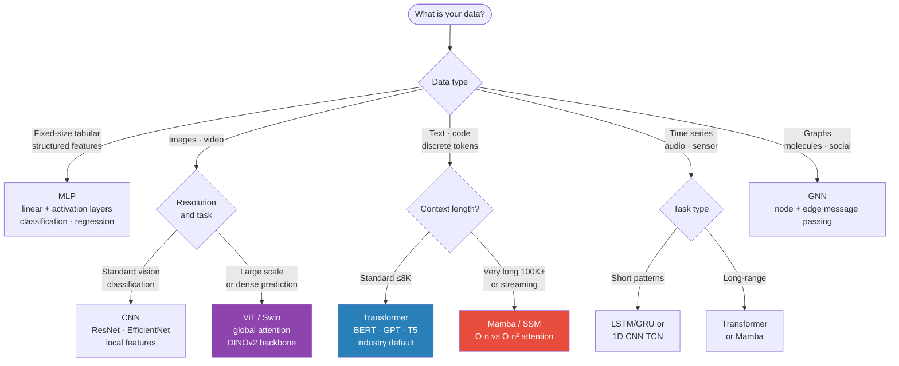

# Architecture Comparison — When to Use What

> Purpose: Given a task description, pick the right architecture. Interview shortcut: know the decision tree, the key numbers, and 2-3 failure modes for each.



## One-Page Decision Tree

```
What is your data?
|
├── Fixed-size tabular / structured (features, rows)
|   └── MLP  → see §1
|
├── Sequential / ordered data
|   |
|   ├── Text, code, discrete tokens
|   |   ├── Standard / few-K context → Transformer (BERT, GPT)  → see §4
|   |   └── Very long context (DNA, long doc) or edge → Mamba/SSM or Jamba hybrid  → see 04_transformer.md §16
|   |
|   ├── Time series, audio, sensor streams
|   |   ├── Short, simple patterns + LSTM/GRU + Transformer  → see §3
|   |   ├── Long-range dependencies + Transformer  → see §4
|   |   ├── Very long sequence + streaming → Mamba / S6  → see 04_transformer.md §16
|   |   └── Need efficiency + local patterns → TCN (1D CNN)  → see §2
|   |
|   └── Video (spatial + temporal)
|       └── 3D CNN or CNN + LSTM or ViT or Video-Mamba  → see §2 + §4
|
├── Spatial / grid data (images, maps)
|   ├── Classification, detection, segmentation → CNN  → see §2
|   ├── High-res, fine-grained + ViT (large data)  → see §4
|   └── Document understanding → LayoutLM v3, Donut  → see multimodal/
|
├── Graph data (molecules, knowledge graphs, social networks)
|   └── GNN  → see 06_gnn.md
|
├── Sequence-to-sequence (translation, summarization, QA)
|   └── Transformer (encoder-decoder)  → see §4
|
└── Generative tasks (image, text, audio)
    ├── Text → GPT-style (decoder-only Transformer)
    ├── Image → Diffusion model or GAN or VAE  → see 05_generative.md
    └── Multimodal → CLIP, BLIP-2, LLaVA  → see multimodal/
```

---

## §1 — MLP (Multi-Layer Perceptron)

**Architecture:** Input → [Linear → BatchNorm → ReLU → Dropout] × N → Output

**Use when:** · Input is a fixed-size feature vector (tabular data, extracted embeddings) · No spatial or temporal structure in the input · Final layers of any architecture (classification head) · Fast baseline before trying specialized architectures

**Key numbers:**

```
Hidden dim:    128-2048 (start with 256)
Depth:         2-5 layers (deeper + diminishing returns for tabular)
Dropout:       0.1-0.5 after each layer
Batchnorm:     yes for deep MLPs
Activation:    ReLU (default), GELU (for transformers), Swish/SiLU (modern)
```

```python
import torch.nn as nn

class MLP(nn.Module):
    def __init__(self, input_dim, hidden_dims, output_dim, dropout=0.2):
        super().__init__()
        layers = []
        dims = [input_dim] + hidden_dims
        for in_d, out_d in zip(dims[:-1], dims[1:]):
            layers += [nn.Linear(in_d, out_d), nn.BatchNorm1d(out_d), nn.ReLU(),
                       nn.Dropout(dropout)]
        layers.append(nn.Linear(hidden_dims[-1], output_dim))
        self.net = nn.Sequential(*layers)

    def forward(self, x):
        return self.net(x)

# Usage: MLP(128, [256, 256], 10)  → 3-layer MLP for 10-class classification
```

**Failure modes:** Raw pixels/sequences — doesn't capture spatial/temporal structure → use CNN/RNN/Transformer · Very deep (>10 layers) without residual connections → vanishing gradients · Large input dim (>10K features) without feature selection → overfits

---

## §2 — CNN (Convolutional Neural Network)

**Architecture:** Conv + Pooling stacks → Global Average Pooling → Linear head

**Use when:** · 2D images (classification, detection, segmentation) · 1D sequences where local patterns matter and you need efficiency (audio, time series as TCN) · Feature extraction from images for downstream models · Smaller datasets (100K-1M images) where ViT would overfit

**Key numbers:**

```
Kernel size:   3×3 (standard), 7×7 (first layer for large images)
Stride:        1 (preserve), 2 (downsample instead of pooling)
Padding:       same = (kernel-1)/2 to preserve spatial dims
Channels:      32→64→128→256→512 (double every stage)
ResNet-50:     25M params, 224×224 input
EfficientNet-B0: 5.3M params, more efficient with compound scaling
```

**Architecture progression:**

```
AlexNet (2012): 8 layers, 60M params, local response norm (outdated)
VGG-16 (2014):  16 layers, 138M params, all 3×3 conv — simple but large
ResNet-50 (2015): 50 layers, 25M params, residual connections → deeper possible
EfficientNet (2019): compound scaling (width+depth+resolution) → best accuracy/FLOPs
ConvNeXt (2022): ResNet modernized with transformer design principles → SOTA CNN
```

**Residual connection — why it matters:**

```
Without: deep nets suffer vanishing gradients
With:    F(x) + x = gradient flows directly through skip connection
         even if F(x) → 0, gradient ≥ 1 → no vanishing
```

```python
class ResBlock(nn.Module):
    def __init__(self, channels):
        super().__init__()
        self.block = nn.Sequential(
            nn.Conv2d(channels, channels, 3, padding=1, bias=False),
            nn.BatchNorm2d(channels),
            nn.ReLU(),
            nn.Conv2d(channels, channels, 3, padding=1, bias=False),
            nn.BatchNorm2d(channels),
        )
        self.relu = nn.ReLU()

    def forward(self, x):
        return self.relu(self.block(x) + x)  # residual connection
```

**Failure modes:** · Long-range dependencies → local receptive field → use Transformer · High-res images (>512px) → Slow → use Swin (window attention) · Rotation/scale invariance not needed → vanilla CNN isn't invariant → use data augmentation or ViT (patches) · Very large datasets (>10M) → ViT usually outperforms CNN

**CNN vs MLP for images:**

```
Image size 28×28×1 = 784 input features
MLP: 784 × 256 = 186 params   All pixels connected to all neurons
CNN: 3×3 filters, 32 channels = only local connections, weight sharing
     Result: CNN needs 10× fewer params, better inductive bias for spatial data
```

---

## §3 — RNN / LSTM / GRU

**Architecture:** Hidden state h_t = f(x_t, h_{t-1}), passed across timesteps

**Use when:** · Sequences where ORDER matters and temporal dependencies exist · Short-to-medium sequences (< ~500 steps) before transformers dominate · Streaming/online inference (process one token at a time, O(1) memory) · Modeling explicit sequential state (hidden state has a specific meaning)

**Key numbers:**

```
Hidden dim:    128-512 (LSTM), 256-1024 (GRU)
Layers:        1-3 (stacked LSTM)
Bidirectional: 2× params, 2× hidden dim — use when full sequence available
LSTM params:   n = (hidden_dim × input_dim × 4)³
  e.g., hidden=256, input=128: 4×(256×128 + 256²) = 4×(32768+65536) = 393K params
```

**LSTM vs GRU:**

```
LSTM: 4 gates (input, forget, output, cell), separate cell state + hidden state
  + more expressive, better for very long sequences
  + 4× more params than equivalent vanilla RNN
  + 1.5× more params than GRU

GRU:  2 gates (reset, update), single hidden state
  + simpler, fewer params, trains faster
  + comparable performance to LSTM in practice for most NLP tasks

Rule: start with GRU, switch to LSTM if long-range dependencies are critical
```

```python
import torch.nn as nn

class SequenceClassifier(nn.Module):
    def __init__(self, vocab_size, embed_dim, hidden_dim, n_classes, n_layers=2):
        super().__init__()
        self.embedding  = nn.Embedding(vocab_size, embed_dim)
        self.lstm = nn.LSTM(embed_dim, hidden_dim, num_layers=n_layers,
                             batch_first=True, bidirectional=True, dropout=0.3)
        self.classifier = nn.Linear(hidden_dim * 2, n_classes)  # ×2 for bidirectional

    def forward(self, x):
        x = (batch, seq_len)
        emb = self.embedding(x)                       # (batch, seq, embed_dim)
        out, (h_n, _) = self.lstm(emb)               # out: (batch, seq, hidden×2)
        last = torch.cat([h_n[-2], h_n[-1]], dim=1)  # (batch, hidden×2)
        return self.classifier(last)
```

**Failure modes:** · Sequences > 500 tokens → vanishing gradients even in LSTM → use Transformer · Very fast GPU → 10× faster on GPU · Long-range dependencies: LSTM theoretically handles them but struggles in practice beyond ~200 steps

**RNN vs Transformer:**

| | RNN/LSTM | Transformer |
|--|----------|------------|
| Parallelizable? | No (sequential) | Yes (all positions at once) |
| Long-range deps? | Weak | Strong (global attention) |
| Memory per token? | O(1) | O(n) (attention matrix) |
| Streaming inference? | Yes | No (needs full context) |
| Best for? | Online/streaming | Dense pre-training on large corpora |

---

## §4 — Transformer

**Architecture:** Multi-head self-attention + FFN, stacked N times

**Use when:** · Text/language (classification, generation, QA, translation) — always Transformer · Long sequences where global context matters · Cross-modal tasks (image + text: CLIP, ViT, LayoutLM) · Large pre-training datasets (>1M samples) — transformers scale better than CNNs/RNNs · Transfer learning (fine-tune a pre-trained model)

**Key numbers (classics):**

```
BERT-base:  12 layers, 12 heads, d=768, 3072 FFN → 110M params, 512 ctx
GPT-3 medium: 24 layers, 16 heads, d=1024 → 345M params, 1024 ctx
GPT-2:      12 layers, 12 heads, d=768 → 117M params, 1024 ctx
ViT-B/16:   12 layers, 12 heads, d=768 → 86M params + embeddings, 2048 ctx
Attention:  O(n² · d) per layer for sequence length n
```

**Key numbers (2024-2025 open models worth knowing):**

| Model | Params | Context | Notes |
|-------|--------|---------|-------|
| LLaMA 3.1 8B | 8B | 128K | GQA + RoPE+YARN; small default |
| LLaMA 3.1 70B | 70B | 128K | Strong base for fine-tuning |
| LLaMA 3.1 405B | 405B | 128K | Largest open Meta model |
| Mistral 7B v0.3 | 7B | 32K | GQA + sliding-window attention |
| Qwen2.5 7B / 72B | 7B / 72B (39B act.) | 128K | Strong multilingual / code |
| Gemma 2 9B / 27B | 9B / 27B | 8K | RMSNorm + GeGLU + sliding window |
| DeepSeek-V3 | 671B (37B act.) | 128K | MoE + MLA attention + FP8 training |
| Phi-1.5 | 1.3B-1.4B | 128K | Small-model lineage |

Most use GQA + RoPE = RMSNorm + SwiGLU. Context lengths of 100K-1M are now standard via RoPE extension (YARN) and FlashAttention-3. Closed frontier models (Claude 3.5/4, GPT-4o, Gemini 2) extend to 200K-2M context.

**Encoder only (BERT, RoBERTa):**
- Bidirectional attention: each token attends to all others
- Best for: classification, NER, sentence embeddings
- Fine-tune: add classification head

**Decoder only (GPT-2/3/4, LLaMA, Mistral):**
- Causal/unidirectional attention: token attends only to past tokens
- Best for: text generation, language modeling, RLHF
- Prompt + generate token by token

**Encoder-Decoder (T5, BART, Donut):**
- Encoder: reads full input (bidirectional)
- Decoder: generates output attending to encoder output + past generated tokens
- Best for: translation, summarization, seq2seq tasks

```python
import torch
import torch.nn as nn
import math

class MultiHeadAttention(nn.Module):
    def __init__(self, d_model, n_heads):
        super().__init__()
        self.n_heads  = n_heads
        self.d_head   = d_model // n_heads
        self.qkv  = nn.Linear(d_model, 3 * d_model)
        self.proj = nn.Linear(d_model, d_model)

    def forward(self, x, mask=None):
        B, T, D = x.shape
        qkv = self.qkv(x).reshape(B, T, 3, self.n_heads, self.d_head)
        q, k, v = qkv.permute(2, 0, 3, 1, 4)  # each: (B, heads, T, d_head)
        scale = math.sqrt(self.d_head)
        attn  = (q @ k.transpose(-2, -1)) / scale  # (B, heads, T, T)
        if mask is not None:
            attn = attn.masked_fill(mask == 0, float('-inf'))
        attn = attn.softmax(dim=-1)
        out  = (attn @ v).transpose(1, 2).reshape(B, T, D)
        return self.proj(out)
```

**Failure modes:** · Short sequences (<50 tokens) → LSTM is competitive and trains faster · Very high resolution images (2560×1920) → O(n²) attention on 307K tokens is infeasible → use Swin (window attention) · Streaming inference required → attention needs full context → use streaming optimizations or RWKV/Mamba · No pre-trained model available, small dataset → CNN/LSTM easier to train from scratch

---

## Side-by-Side Comparison

| Property | MLP | CNN | RNN/LSTM | Transformer |
|----------|-----|-----|---------|------------|
| Input type | Fixed vector | Grid (2D/1D) | Sequence | Sequence / set |
| Spatial inductive bias | ✗ | ✓ (local convolution) | ✗ | ✗ (no inductive bias) |
| Temporal inductive bias | ✗ | ✗ | ✓ (recurrence) | ✗ |
| Parallelizable training | ✓ | ✓ | ✗ (sequential) | ✓ |
| Long-range dependencies | ✗ | ✗ (limited by depth) | Weak | ✓ (O(1) path length) |
| Memory (inference) | O(1) | O(1) | O(1) per token | O(n) (KV cache) |
| Scales with data | Moderate | Good | Moderate | Excellent |
| Transfer learning | Weak | Good (ImageNet) | Weak | Excellent (LLMs, BERT) |
| Typical dataset size | 1K-1M | 10K-10M | 10K-1M | 1M-trillions |

---

## Receptive Field & Context

**MLP:** Every neuron sees all inputs. No locality — global but unstructured.

**CNN:** Receptive field grows with depth.

```
Layer 1 (3×3): sees 3×3 patch
Layer 2 (3×3): sees 5×5 patch (3×3 of previous 3×3 patches)
Layer 3 (3×3): sees 7×7 patch
ResNet-50 final layer: sees full 224×224 image
```

**RNN/LSTM:** Token at step t sees all previous tokens in theory, but gradient signal from distant past decays.

```
LSTM forget gate: h_0, h_1, ..., h_t — earlier states fade
Practical range: ~200 tokens reliably, 500+ with effort
```

**Transformer:** Every token attends to every other token in one layer.

```
Path length = 1 for any pair of tokens regardless of distance
But: O(n²) cost — GPT-4 uses sliding window attention + Flash Attention to scale to 128K tokens
```

---

## Parameter Counts for Common Configs

```
MLP: input=128, hidden=[256,256], output=10
  Layer 1: 128×256 + 256 = 33,024
  Layer 2: 256×256 + 256 = 65,792
  Layer 3: 256×10  + 10  = 2,570
  Total: ~101K params

CNN: ResNet-18 (224×224 input, 10 classes)
  Conv layers: ~11M
  FC layer: 512×10 = 5,130
  Total: ~11M params

LSTM: hidden=256, input=128, 2 layers bidirectional
  Layer 1: 4 × (128×256 + 256×256 + 256) = 4 × 98,560 = 394,240
  Layer 2 (bidir): 2 × 4 × (512×256 + 256×256²) = 2,048,576
  Total: ~1.4M params

Transformer: BERT-base
  12 layers × (self-attention + FFN)
  Per layer: ~7M params
  Embeddings: 30K×768 = 23M
  Total: ~110M params
```

---

## Interview Q&A

**Q: Why use CNN over MLP for images?**
A: CNNs exploit two inductive biases that images have: (1) locality — nearby pixels are related, so local filters make sense; (2) translation equivariance — a cat in the top-left and bottom-right should activate the same feature detector. Weight sharing across spatial positions means CNNs need ~100× fewer parameters than equivalent MLPs for images, and generalize much better from limited data.

**Q: Why can't LSTM handle very long sequences?**
A: The LSTM hidden state is a fixed-size vector that must compress all past information. For long sequences, older information gets overwritten by newer information through the forget gate. The gradient signal from distant past also decays (though less severely than vanilla RNN). In practice, LSTM degrades beyond ~500 tokens. Transformer with attention provides a direct path (length 1) between any two positions.

**Q: When would you prefer CNN over Transformer for images?**
A: (1) Small dataset (<100K images) — ViT overfits without large pre-training; CNN has stronger spatial inductive bias that helps from scratch. (2) Efficiency — CNN is O(n) for sequence of patches; ViT is O(n²). For high-resolution images (>512px), Swin Transformer (window attention) splits the difference. (3) Latency-sensitive production — speed-optimized CNN kernels (CUDA) are very fast for inference.

**Q: What is the key difference between encoder-only and decoder-only transformers?**
A: Attention masking. Encoder-only (BERT): bidirectional — each token attends to all tokens in both directions. Good for understanding tasks (classification, NER). Decoder-only (GPT): causal masking — each token can only attend to past tokens. Required for autoregressive generation (each token predicted from previous). Encoder-decoder (T5, BART): encoder uses bidirectional attention on input; decoder uses causal attention for output + cross-attention to encoder. Best for translation/summarization.

**Q: How do you pick hidden dim and number of layers?**
A: Rule of thumb: hidden_dim should be a power of 2 (GPU efficiency), typically 64-4096 depending on task complexity. Layers: start with 2-3 for MLP/CNN on small data, scale up with data. For transformers, depth (12-32 layers) matters more than width for language tasks (going from 6→12 layers matters more than 768→1024 dim). Always: start simple (1-2 layers), validate on a held-out set, scale complexity only if underfitting.

---

## Connections

- MLP details: `02_architectures/01_mlp.md`
- CNN details: `02_architectures/02_cnn.md`
- RNN/LSTM details: `02_architectures/03_rnn_lstm_gru.md`
- Transformer details: `02_architectures/04_transformer.md`
- ViT / Swin (vision transformer): `../../3.computerVision/01_fundamentals/04_vision_transformer_deep.md`
- GNN: `02_architectures/06_gnn.md`

---

## Key Takeaway

Pick architecture based on data structure: **MLP** for fixed-size feature vectors, **CNN** for spatial/grid data (images), **RNN/LSTM** for short-medium sequences with streaming requirements, **Transformer** for long sequences / large-scale pre-training / cross-modal tasks. The trend: Transformers dominate text universally; CNNs still competitive for vision on small data, but becoming a niche; streaming/online inference. In practice: start with the strongest pre-trained model available (BERT, GPT, ViT, ResNet) and fine-tune — rarely train from scratch.
