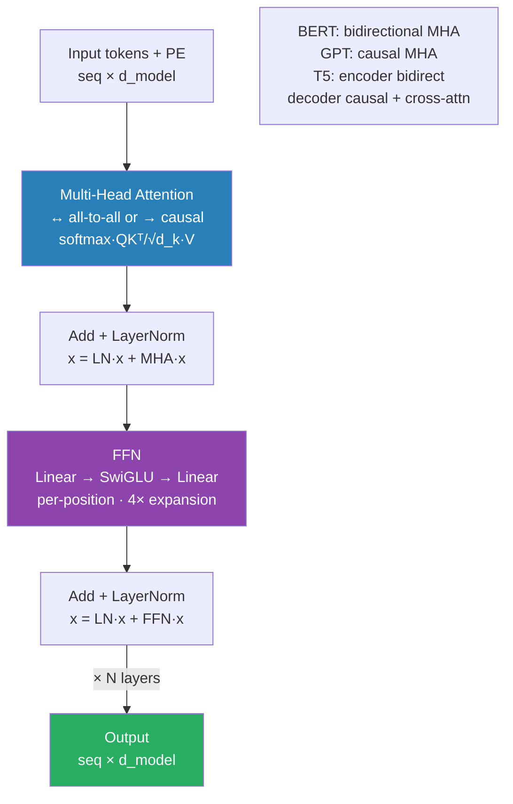

# 04 — Transformer Architecture

## Quick Reference

| Component | Role | Formula |
|-----------|------|---------|
| Scaled Dot-Product Attention | Match queries to keys, weight values | softmax(QK^T/√d_k)V |
| Multi-Head Attention | Attend to multiple subspaces in parallel | Concat(head_1,...,head_h)W^O |
| Positional Encoding | Inject sequence order (no recurrence) | sin/cos at different frequencies |
| FFN (Feed-Forward) | Per-position nonlinear transform | max(0, xW_1+b)W_2+b_2 |
| Pre-Norm (modern) | Normalize before sublayer, not after | x + sublayer(LayerNorm(x)) |
| Post-Norm (original) | Normalize after residual add | LayerNorm(x + sublayer(x)) |

**One-line summary:** The transformer processes entire sequences in parallel using attention to learn which tokens matter for each other, stacked N times with residuals — no recurrence, no convolution.

---


> O(1) gradient path between any two tokens via residuals + attention. This is why transformers scale where RNNs couldn't.

## 1. Why Transformers Won

RNNs process tokens sequentially → O(N) steps, gradients must traverse full sequence — long-range forgetting. CNNs have fixed receptive fields — struggle with long-range dependencies.

Transformer insight: **let every token attend to every other token directly** — O(1) path between any two positions.

Cost: O(N²) memory per attention layer. Win: fully parallelizable — can use modern GPUs properly.

---

## 2. Full Architecture (Encoder Block)

```
Input Tokens
    ↓
Token Embedding + Positional Encoding
    ↓
[Repeat N times]
    |
    x = x + sublayer(LayerNorm(x))   ← Multi-Head Attention (residual)
    |
    x = x + sublayer(LayerNorm(x))   ← FFN (residual)
    ↓
Final LayerNorm
    ↓
Task Head (classifier / LM head / etc.)
```

This is **pre-norm** (modern standard — GPT-2, LLaMA, Mistral). Original "Attention is All You Need" used post-norm — harder to train deep without careful warmup.

---

## 3. Scaled Dot-Product Attention (Step by Step)

Given input X (shape: [seq_len, d_model]):

```python
Q = X · Wq   # [seq_len, d_k]
K = X · Wk   # [seq_len, d_k]
V = X · Wv   # [seq_len, d_v]

scores  = Q · K^T / √d_k    # [seq_len, seq_len] — raw compatibility
weights = softmax(scores)   # [seq_len, seq_len] — rows sum to 1
output  = weights · V       # [seq_len, d_v]
```

**Why √d_k?** Without scaling, dot products grow with d_k (variance = d_k if Q,K ~ N(0,1)) — softmax saturates into near-one-hot — gradients vanish. Dividing by √d_k keeps variance = 1.

**Toy example (d_k = 2, 3 tokens):**

```
Q = [[1, 0], [0, 1], [1, 1]]
K = [[1, 0], [0, 1], [1, 1]]

scores = QK^T / √2:
    token0 attends to: [1/√2, 0/√2, 1/√2] → [0.71, 0, 0.71]
    softmax → [0.42, 0.16, 0.42] ← token0 attends equally to itself and token2
```

---

## 4. Multi-Head Attention

Instead of one large attention, run h parallel smaller attentions in subspaces:

```
head_i   = Attention(Q·W_qi, K·W_ki, V·W_vi)
MultiHead = Concat(head_1, ..., head_h) · W^O
```

- d_model = 512, h = 8 → each head uses d_k = d_v = 64
- Each head learns different relationship types: syntax, coreference, proximity, etc.
- Total parameters: same as single-head (projections are smaller per head)

### Modern variants — MQA and GQA (LLaMA, Mistral, Qwen)

The 2017 paper used **MHA** — separate K and V per head. At inference, the KV cache stores N_layers × seq_len × N_heads × d_k × 2. For LLaMA-2-70B at 100K context, ~52 GB. KV cache becomes the dominant memory cost.

Modern fix: **share K and V across multiple Q heads.**

| | Architecture | Q heads | K heads | V heads | KV cache reduction |
|--|---|---|---|---|---|
| MHA | BERT, GPT-2 | 32 | 32 | 32 | 1× (baseline) |
| MQA | Falcon, PaLM | 32 | 1 | 1 | 32× smaller |
| GQA | LLaMA-3, Mistral | 32 | 8 | 8 | 4× smaller |

- **MQA** (Shazeer 2019): big speedup, but ~1-2% quality hit
- **GQA** (Ainslie 2023): sweet spot — group queries to share KV; quality matches MHA, KV cache 4-8× smaller
- **GQA is the de-facto default** in 2024-26 production LLMs (LLaMA-3, Mistral, Qwen, Gemma)
- Implementation: same as MHA but n_kv < n_heads; each KV is repeated across its group of Q heads via `torch.repeat_interleave`

---

## 5. Positional Encoding

Attention is **permutation-invariant** — "cat sat on mat" and "mat on sat cat" produce the same attention without positional info.

**Sinusoidal (original — Attention is All You Need):**

```
PE(pos, 2i)   = sin(pos / 10000^(2i/d_model))
PE(pos, 2i+1) = cos(pos / 10000^(2i/d_model))
```

- Different frequencies for different embedding dimensions
- Fixed, not learned — generalizes to longer sequences at inference
- Added directly to token embeddings

**Learned absolute (BERT, GPT-2):** Trainable embedding table for each position. Works well but doesn't generalize to unseen sequence lengths.

**Rotary (RoPE — LLaMA, Mistral, GPT-NeoX):** Encodes relative position via rotation of Q,K before attention. Better length generalization, now the dominant choice. Applied to Q,K only (not V), before attention computation.

**ALiBi (linear bias — MPT, BLOOM):** Adds position-dependent bias to attention scores. No positional embedding added to input at all.

---

## 6. Feed-Forward Network (FFN)

Applied **per-position independently** (not across positions):

```python
FFN(x) = max(0, xW_1 + b_1)W_2 + b_2
```

- W_1: [d_model → d_ff], W_2: [d_ff → d_model]
- Typically d_ff = 4 × d_model (e.g., 512 → 2048 → 512)
- This is where most parameters live (~2/3 of total params in large models)

**SwiGLU (LLaMA/Mistral replacement):**

```python
FFN(x) = (xW ⊙ SiLU(xW_gate)) · W_2
```

Gated variant — consistently better than ReLU FFN in practice.

**MoE-FFN (Mixtral, DeepSeek-V3):** Replace the single FFN with N expert FFNs + a router that picks K ≤ N per token. Mixtral: 8 experts, top-2 routing. DeepSeek-V3: 256 experts + 1 shared, top-8. Total params scale with N; per-token compute scales with K. **Capacity without compute** — see `09_mixture_of_experts.md`.

---

## 7. Encoder vs Decoder vs Encoder-Decoder

| Aspect | Encoder-only (BERT) | Decoder-only (GPT) | Encoder-Decoder (T5, BART) |
|--------|--------------------|--------------------|---------------------------|
| Attention mask | Full bidirectional | Causal (lower-triangular) | Encoder: full; Decoder: causal + cross-attn |
| Sees context | Past + future | Past only | Encoder: full; Decoder: encoder output |
| Primary task | Classification, NER, embedding | Generation, completion | Seq2seq (translation, summarization) |
| Training objective | MLM (masked token prediction) | Next token prediction (CLM) | Span corruption (T5) or denoising |
| Examples | BERT, RoBERTa, DeBERTa | GPT-2/3/4, LLaMA, Mistral, Gemma | T5, BART, mT5 |
| Interview use | "Understanding" tasks | "Generation" tasks | When input/output lengths differ significantly |

**Causal mask (decoder):** Token i can only attend to tokens 0..i. Implemented by adding -∞ to upper triangle of attention scores before softmax.

```
Mask:
pos 0: [0, -∞, -∞, -∞]
pos 1: [0,  0, -∞, -∞]
pos 2: [0,  0,  0, -∞]
pos 3: [0,  0,  0,  0]
```

After softmax, -∞ → 0 (no attention to future tokens).

---

## 8. BERT vs GPT — Key Differences

| | BERT | GPT |
|--|------|-----|
| Architecture | Encoder-only | Decoder-only |
| Masking | Bidirectional (sees all tokens) | Causal (sees only past) |
| Pre-training | Masked LM + Next Sentence Prediction | Causal language modeling |
| Strength | Contextual representations for understanding | Text generation |
| Fine-tuning | Add classifier head on [CLS] token | Prompt-based or fine-tune LM head |
| When to use | Classification, NER, question answering, embeddings | Text generation, chat, completion |
| Modern successors | RoBERTa (no NSP, more data), DeBERTa (disentangled attn) | GPT-4, LLaMA, Mistral, Gemma |

---

## 9. Transformer Parameter Count

For a transformer with: d_model = 768, h = 12 heads, d_ff = 3072, N = 12 layers, vocab = 30522

**Per layer:**
- Q, K, V projections: 3 × (768 × 64) × 12 heads = 3 × 768 × 768 ≈ 1.77M
- Output projection: 768 × 768 = 590K
- FFN W_1: 768 × 3072 = 2.36M · FFN W_2: 3072 × 768 = 2.36M
- LayerNorm × 2: negligible

**Total per layer = 7M | × 12 layers = 85M + embeddings = 110M (BERT-base)**

---

## 10. When to Use What

| Task | Architecture Choice | Reasoning |
|------|--------------------|-----------|
| Text classification | BERT/RoBERTa | Bidirectional context → better representations |
| Named entity recognition | BERT + token classifier head | Per-token labels, bidirectional context helps |
| Text generation | GPT-style decoder | Causal — naturally produces next token |
| Machine translation | Encoder-Decoder (BART/T5) | Separate encoder reads source, decoder generates target |
| Sentence embeddings | BERT with pooling or SBERT | Bidirectional gives richer embeddings than causal |
| Few-shot prompting | GPT-style (GPT-4, LLaMA) | In-context learning works best with large decoders |
| Document understanding (your domain) | LayoutLM, BERT variants | Encoder understands layout + text jointly |
| Image-text tasks | CLIP (dual encoder) or LLaVA | Cross-modal attention between vision and language |

---

## 11. Gotchas

**1. Attention is O(N²) in sequence length.** 2048 tokens = 4M attention scores per head. 128K context = 16B scores. This is why long context is expensive and why FlashAttention exists (fused CUDA kernel, same math, 2-4× faster with HBM-aware tiling).

**2. Pre-norm vs Post-norm in training dynamics.** Post-norm (original paper) requires careful LR warmup or the gradients through LayerNorm blow up early. Pre-norm (modern) trains more stably. If you see loss spikes early, check norm placement.

**3. Positional encoding mismatch at inference.** Fine-tuned on 512 tokens, deployed on 2048 — absolute positional embeddings trained out-of-distribution → degraded performance. RoPE handles this better (relative), still needs NTK-aware scaling for large extension.

**4. Attention head collapse.** Many heads learn near-identical patterns. Common in undertrained models. Fix: entropy regularization on attention weights or prune redundant heads.

**5. d_k must be divisible by h.** d_model=512, h=8 → d_k=64. If not divisible, projection matrices are misaligned. PyTorch's `nn.MultiheadAttention` handles this internally but check if implementing from scratch.

**6. Padding token attention leaks information.** If you don't pass `key_padding_mask`, your model attends to [PAD] tokens. Pass the mask — especially critical in classification where [CLS] token must not aggregate padding noise.

**KV cache in inference.** During autoregressive generation, recomputing K,V for all previous tokens at each step is O(N²). KV cache stores K,V for all past tokens → O(N) per new token. Essential for production inference. Cache size = 2 × N_layers × seq_len × d_model × batch_size × 2 bytes (fp16).

---

## 12. Debugging Guide

| Symptom | Likely Cause | Fix |
|---------|-------------|-----|
| Loss NaN at start | Attention scores overflow before scaling | Check √d_k scaling; clip attention logits |
| Loss spikes mid-training | LR too high with post-norm | Switch to pre-norm or add LR warmup (1000-4000 steps) |
| All tokens attend uniformly | Attention collapse / temperature too high | Reduce LR; check positional encoding is added |
| Generation repeats n-grams | Attention head degeneration | No-repeat-ngram penalty; check tokenizer eos_token_id |
| OOM on long sequences | O(N²) attention | Use FlashAttention; reduce seq_len; gradient checkpointing |
| [CLS] embedding poor quality | Not fine-tuned with pooling head | Fine-tune with contrastive/triplet loss (SBERT approach) |
| Inference much slower than expected | No KV cache | Set use_cache=True; use past_key_values pattern |
| Position IDs error | Sequence longer than max_position_embeddings | Truncate input or use RoPE with extended context |

---

## 13. Code Reference

```python
import torch
import torch.nn as nn
import math

class MultiHeadSelfAttention(nn.Module):
    def __init__(self, d_model, num_heads):
        super().__init__()
        assert d_model % num_heads == 0
        self.d_k = d_model // num_heads
        self.num_heads = num_heads
        self.qkv = nn.Linear(d_model, 3 * d_model)
        self.out = nn.Linear(d_model, d_model)

    def forward(self, x, mask=None):
        B, T, C = x.shape
        qkv = self.qkv(x).reshape(B, T, 3, self.num_heads, self.d_k)
        q, k, v = qkv.permute(2, 0, 3, 1, 4)   # each: [B, heads, T, d_k]
        scores = (q @ k.transpose(-2, -1)) / math.sqrt(self.d_k)
        if mask is not None:
            scores = scores.masked_fill(mask == 0, float('-inf'))
        attn = scores.softmax(dim=-1)
        out = (attn @ v).transpose(1, 2).reshape(B, T, C)
        return self.out(out)

class TransformerBlock(nn.Module):
    def __init__(self, d_model, num_heads, d_ff, dropout=0.1):
        super().__init__()
        self.attn  = MultiHeadSelfAttention(d_model, num_heads)
        self.norm1 = nn.LayerNorm(d_model)
        self.norm2 = nn.LayerNorm(d_model)
        self.ffn   = nn.Sequential(
            nn.Linear(d_model, d_ff),
            nn.GELU(),
            nn.Dropout(dropout),
            nn.Linear(d_ff, d_model),
        )
        self.drop = nn.Dropout(dropout)

    def forward(self, x, mask=None):
        # Pre-norm pattern (modern standard)
        x = x + self.drop(self.attn(self.norm1(x), mask))
        x = x + self.drop(self.ffn(self.norm2(x)))
        return x

# Sinusoidal Positional Encoding
class PositionalEncoding(nn.Module):
    def __init__(self, d_model, max_len=5000):
        super().__init__()
        pe  = torch.zeros(max_len, d_model)
        pos = torch.arange(max_len).unsqueeze(1).float()
        div = torch.exp(torch.arange(0, d_model, 2).float() * (-math.log(10000.0) / d_model))
        pe[:, 0::2] = torch.sin(pos * div)
        pe[:, 1::2] = torch.cos(pos * div)
        self.register_buffer('pe', pe.unsqueeze(0))

    def forward(self, x):
        return x + self.pe[:, :x.size(1)]

# Key Padding Mask (Critical — don't skip this)
# inputs['attention_mask'] is 1 for real tokens, 0 for padding
# For nn.MultiheadAttention, key_padding_mask: True = ignore this position
padding_mask = (inputs['attention_mask'] == 0)   # [batch, seq_len] — True = pad
attn_output, _ = nn.MultiheadAttention(d_model=512, num_heads=8)(
    query=x, key=x, value=x,
    key_padding_mask=padding_mask
)
```

**Using HuggingFace (Production Pattern):**

```python
from transformers import AutoTokenizer, AutoModel
import torch

# Encoder-only: BERT for classification
tokenizer = AutoTokenizer.from_pretrained("bert-base-uncased")
model     = AutoModel.from_pretrained("bert-base-uncased")

inputs = tokenizer(["Hello world", "Sample text"],
                   padding=True, truncation=True,
                   max_length=512, return_tensors="pt")

with torch.no_grad():
    outputs = model(**inputs)

# [CLS] token embedding (first token) for classification
cls_embeddings   = outputs.last_hidden_state[:, 0, :]   # [batch, d_model]
# All token embeddings for NER/token-level tasks
token_embeddings = outputs.last_hidden_state             # [batch, seq_len, d_model]

# Decoder-only: Causal Generation
from transformers import AutoModelForCausalLM

tokenizer = AutoTokenizer.from_pretrained("gpt2")
model     = AutoModelForCausalLM.from_pretrained("gpt2")

inputs  = tokenizer("The transformer model", return_tensors="pt")
outputs = model.generate(
    **inputs,
    max_new_tokens=50,
    do_sample=True,
    temperature=0.8,
    top_p=0.9,
    repetition_penalty=1.1,
    use_cache=True,                # KV cache for faster generation
    pad_token_id=tokenizer.eos_token_id
)
print(tokenizer.decode(outputs[0], skip_special_tokens=True))
```

---

## 14. Interview Q&A (Senior Level)

**Q: Why divide by √d_k in attention? What goes wrong without it?**

If Q, K ~ N(0,1) with dimension d_k, their dot product has variance d_k (sum of d_k independent unit-variance terms). Softmax of large values → near one-hot distribution → gradients nearly zero for non-max positions. Dividing by √d_k keeps variance = 1 regardless of d_k, keeping softmax in a numerically stable regime.

**Q: Encoder vs decoder — how do you pick each in production?**

For **understanding** (classification, NER, retrieval/embedding) → encoder-only (BERT variants) — bidirectional context gives richer representations. For **generation** (GPT/LLaMA) → causal training naturally learns to produce coherent sequences. For **seq2seq** (translation, summarization where input/output differ significantly) → encoder-decoder (T5/BART). In document understanding (OCR + NLP), LayoutLM/BERT variants dominate because you need joint understanding of text + spatial layout, not generation.

**Q: What is the actual complexity bottleneck in transformers at inference?**

Two bottlenecks: (1) **Attention is O(N²·d_model)** per layer — quadratic in sequence length. FlashAttention fuses the softmax+matmul into one CUDA kernel avoiding materializing the full NxN matrix in HBM. (2) **Memory bandwidth for loading weights** — at inference (batch=1), matmuls are memory-bound, not compute-bound. Large models are bottlenecked by how fast you can load weights from HBM — why quantization (INT8/INT4) helps inference latency.

**Q: Why does pre-norm train more stably than post-norm?**

In post-norm, the residual path goes through LayerNorm: LayerNorm(x + sublayer(x)). Early training when sublayer outputs are large — LayerNorm normalizes a large residual → large gradients through the norm → instability. In pre-norm, the residual path is clean: x + sublayer(LayerNorm(x)). The identity shortcut propagates gradients directly without passing through LayerNorm → stable gradient flow from the start.

**Q: What's the difference between self-attention and cross-attention? Where is cross-attention used?**

In self-attention, Q, K, V all come from the same sequence. In cross-attention, Q comes from one sequence (decoder), K and V come from another (encoder output). Cross-attention is in the decoder block of encoder-decoder models (T5, BART): the decoder queries the encoder's representations to condition generation on the source. Also used in diffusion models for text conditioning, LLaVA-style vision-language models.

**Q: Why do large decoder-only models (LLaMA-class) outperform encoder-decoder models (T5) on most benchmarks now?**

Scale + causal LM on trillions of tokens produces representations powerful enough for any downstream task via few-shot prompting or instruction tuning. Encoder-decoder has the advantage that the encoder sees full context — but this advantage shrinks as decoders get longer context windows and RLHF fine-tuning aligns outputs better. GPT-4/LLaMA-70B outperforms T5-11B on most tasks, but T5/BART still win on structured seq2seq tasks (translation, constrained generation) at similar compute.

**Q: How does the KV cache work and when does it help/hurt?**

During autoregressive generation, at step t you compute K, V for all tokens — but tokens 0..t-1 were already computed at prior steps. KV cache stores K, V from all past steps, so each new token only computes Q for the new token and reuses cached K, V. Reduces generation from O(N²) recomputation to O(N) total. Hurt: memory grows linearly with generated length — at 100K context, cache ≈ 52GB for LLaMA-2-70B. Techniques: PagedAttention (vLLM), sliding window attention (Mistral) to bound cache size.

---

## 15. Connections

| This file | Links to | Why |
|-----------|----------|-----|
| Scaled dot-product attention | `../01_fundamentals/05_modern_components.md` | Full math derivation with toy example |
| LayerNorm in pre-norm pattern | `../01_fundamentals/03_training_stability.md` | LayerNorm vs BatchNorm vs RMSNorm detail |
| Residual connections | `../01_fundamentals/05_modern_components.md` | Gradient highway math |
| Positional encoding | `../01_fundamentals/05_modern_components.md` | Embeddings section — static vs contextual |
| Optimizer choice for transformers | `../01_fundamentals/02_training_loop.md` | AdamW is standard; why Adam's weight decay breaks |
| Generative models (diffusion etc.) | `05_generative.md` | Cross-attention for text conditioning in UNet |
| MoE-FFN architecture | `09_mixture_of_experts.md` | Mistral / DeepSeek-V3 routing + load balancing |
| Quantization (INT8 / NF4 / GPTQ) | `10_quantization_theory.md` | Memory math behind running 70B on consumer GPUs |

---

## Key Takeaway

```
Transformer = attention (route information between tokens)
            + FFN (transform each position)
            + residual + norm, stacked N times

Encoder-only (BERT):          bidirectional attention → understanding
Decoder-only (GPT/LLaMA):     causal attention → generation
Encoder-Decoder (T5):         full source context + causal target

Three numbers to internalize:
  O(N²) attention complexity
  d_ff = 4 × d_model
  √d_k scaling
```
