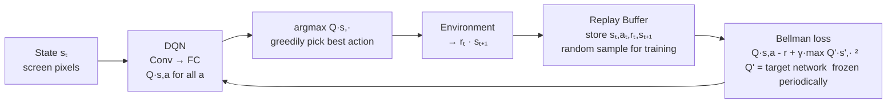

# 07 — Deep Reinforcement Learning

> **Prerequisites:** RL fundamentals (MDP, Q-learning, Policy Gradient) → `../../1.machine learning/02_algorithms/07_reinforcement_learning.md`
> **This file:** scaling RL with neural networks — DQN, A3C, PPO, and RLHF.

---

## Why Deep RL?

Tabular Q-learning stores Q(s, a) for every (state, action) pair.

**Problem:** Atari has ~10^33,000 possible screen states. A table is impossible.

**Solution:** Replace the Q-table with a neural network:


> Key DQN innovations: (1) replay buffer breaks temporal correlations, (2) target network stabilizes training.


```
Q(s, a; θ) ≈ Q(s, a)

Input:  state s (e.g., 84×84×4 grayscale frames)
Output: Q-values for all actions simultaneously
        [Q(s, left), Q(s, right), Q(s, fire)]   shape (n_actions,)
```

---

## DQN — Deep Q-Network

**Paper:** "Playing Atari with Deep Reinforcement Learning" (Mnih et al., 2013)

**Key insight:** Two tricks make neural Q-learning stable: **experience replay** + **target network**

### Architecture

```
Input: 4 stacked 84×84 grayscale frames → (4, 84, 84)
Conv2D(32, 8×8, stride=4) → (32, 20, 20)  ReLU
Conv2D(64, 4×4, stride=2) → (64, 9, 9)    ReLU
Conv2D(64, 3×3, stride=1) → (64, 7, 7)    ReLU
Flatten → 3136
Linear(3136, 512)                          ReLU
Linear(512, n_actions)                     no activation
Output: [Q(s,↑), Q(s,↓), ..., Q(s,fire)]  e.g., 18 actions for Atari
```

### Problem 1: Correlated Samples → Experience Replay

Sequential frames (s_t, s_{t+1}) are highly correlated → unstable training, catastrophic forgetting.

**Solution:** Store transitions in a **replay buffer**. Sample random mini-batches.

```python
from collections import deque
import random, numpy as np

class ReplayBuffer:
    def __init__(self, capacity=100_000):
        self.buffer = deque(maxlen=capacity)

    def push(self, state, action, reward, next_state, done):
        self.buffer.append((state, action, reward, next_state, done))

    def sample(self, batch_size=32):
        batch = random.sample(self.buffer, batch_size)
        states, actions, rewards, next_states, dones = zip(*batch)
        return (np.array(states), np.array(actions),
                np.array(rewards, dtype=np.float32),
                np.array(next_states), np.array(dones, dtype=np.float32))

    def __len__(self):
        return len(self.buffer)
```

### Problem 2: Moving Targets → Target Network

DQN update: `Loss = [Q(s,a; θ) − (r + γ · max_{a'} Q(s', a'; θ))]²`

Both prediction and target use the same weights θ → chasing a moving target → divergence.

**Solution:** Maintain a **target network** θ' (frozen copy). Update only every C steps.

```
target = r + γ · max_{a'} Q(s', a'; θ')   # frozen weights
Loss   = [Q(s,a; θ) − target]²            # update θ only

Every C=1000 steps:  θ' = θ              (hard update)
OR every step:       θ' = τ·θ + (1-τ)·θ'  (soft update, τ=0.005)
```

### Full DQN Training Loop

```python
import torch, torch.nn as nn, torch.optim as optim
import gymnasium as gym, numpy as np
from collections import deque
import random

class DQN(nn.Module):
    def __init__(self, n_obs, n_actions):
        super().__init__()
        self.net = nn.Sequential(
            nn.Linear(n_obs, 128), nn.ReLU(),
            nn.Linear(128, 128),   nn.ReLU(),
            nn.Linear(128, n_actions)
        )
    def forward(self, x): return self.net(x)

BATCH_SIZE    = 64
GAMMA         = 0.99
LR            = 1e-4
EPSILON_START = 1.0
EPSILON_END   = 0.01
EPSILON_DECAY = 0.995
TARGET_UPDATE = 100
BUFFER_SIZE   = 50_000
MIN_REPLAY    = 1_000

env       = gym.make("CartPole-v1")
n_obs     = env.observation_space.shape[0]
n_actions = env.action_space.n

q_net      = DQN(n_obs, n_actions)
target_net = DQN(n_obs, n_actions)
target_net.load_state_dict(q_net.state_dict())
target_net.eval()

optimizer  = optim.Adam(q_net.parameters(), lr=LR)
buffer     = ReplayBuffer(BUFFER_SIZE)
epsilon    = EPSILON_START
step_count = 0

for episode in range(500):
    state, _ = env.reset()
    total_reward = 0

    for _ in range(500):
        if random.random() < epsilon:
            action = env.action_space.sample()
        else:
            with torch.no_grad():
                action = q_net(torch.FloatTensor(state)).argmax().item()

        next_state, reward, done, truncated, _ = env.step(action)
        done = done or truncated
        buffer.push(state, action, reward, next_state, float(done))
        state = next_state
        total_reward += reward
        step_count += 1

        if len(buffer) >= MIN_REPLAY:
            states, actions, rewards, next_states, dones = buffer.sample(BATCH_SIZE)
            states_t      = torch.FloatTensor(states)
            next_states_t = torch.FloatTensor(next_states)
            actions_t     = torch.LongTensor(actions)
            rewards_t     = torch.FloatTensor(rewards)
            dones_t       = torch.FloatTensor(dones)

            q_current = q_net(states_t).gather(1, actions_t.unsqueeze(1)).squeeze(1)
            with torch.no_grad():
                q_next   = target_net(next_states_t).max(1)[0]
                q_target = rewards_t + GAMMA * q_next * (1 - dones_t)

            loss = nn.MSELoss()(q_current, q_target)
            optimizer.zero_grad()
            loss.backward()
            nn.utils.clip_grad_norm_(q_net.parameters(), max_norm=10)
            optimizer.step()

            if step_count % TARGET_UPDATE == 0:
                target_net.load_state_dict(q_net.state_dict())

        if done: break

    epsilon = max(EPSILON_END, epsilon * EPSILON_DECAY)
    if episode % 50 == 0:
        print(f"Episode {episode:4d} | Reward: {total_reward:6.1f} | ε: {epsilon:.3f}")
```

### DQN Dry Run (Loss Computation)

Mini-batch of 3 transitions; γ=0.99:

```
Current Q-net:   Q(s1,right)=1.8, Q(s2,left)=1.5, Q(s3,right)=1.1
Target net max:  Q'(s1)=3.0,      Q'(s2)=1.0,     Q'(s3)=0.2 (done→ignored)

Targets:
  y1 = 1.0 + 0.99×3.0 = 3.97
  y2 = 1.0 + 0.99×1.0 = 1.99
  y3 = 0.0             = 0.0   ← done=True

TD errors: δ1=2.17, δ2=0.49, δ3=−1.10
MSE Loss = (2.17² + 0.49² + 1.10²) / 3 ≈ 1.94
```

### DQN Variants

| Variant | Key Improvement |
|---------|----------------|
| Double DQN | Decouple action selection (θ) from evaluation (θ') → reduces overestimation |
| Dueling DQN | Separate V(s) and A(s,a) streams → Q(s,a) = V(s) + A(s,a) |
| Prioritized Replay | Sample transitions by TD error magnitude → focus on surprising transitions |
| Rainbow DQN | All of the above + multi-step returns + distributional RL → SOTA on Atari |

**Double DQN fix:**
```
Standard DQN: target = r + γ · max_{a'} Q(s', a'; θ')
Double DQN:   target = r + γ · Q(s', argmax_{a'} Q(s', a'; θ); θ')
              → select with θ, evaluate with θ'
```

---

## A3C — Asynchronous Advantage Actor-Critic

**Paper:** "Asynchronous Methods for Deep Reinforcement Learning" (Mnih et al., 2016)

**Key idea:** Run multiple agents in parallel with their own environment copies. Each worker computes gradients and asynchronously updates a shared global network.

### Architecture

```
Global network (shared weights θ_global):
    Actor:  π_θ(a|s) = action probabilities
    Critic: V_θ(s)   = state value estimate

Worker threads (n=8 or 16):
1. Copy global weights: θ_local = θ_global
2. Play for t_max=5 steps (or until episode end)
3. Compute gradients on local data
4. Apply gradients to θ_global (async, no lock)
```

### Actor-Critic Loss

```
A(s_t, a_t) = R_t − V(s_t; θ)
R_t = r_t + γ·r_{t+1} + ... + γ^{T-1}·r_{T-1} + γ^T·V(s_T; θ)   (n-step return)

Actor loss:   L_actor  = −log π(a_t|s_t) · A(s_t, a_t)
Critic loss:  L_critic = (R_t − V(s_t; θ))²
Entropy:      H        = −Σ_a π(a|s)·log π(a|s)   ← encourages exploration

Total loss:   L = L_actor + 0.5·L_critic − 0.01·H
```

**Why advantage A instead of G_t?**

```
REINFORCE:    ∇ log π = G_t      → high variance (G_t varies a lot)
Actor-Critic: ∇ log π = A(s,a)

A > 0: better than expected → increase probability
A < 0: worse than expected  → decrease probability
A ≈ 0: as expected          → no update
```

### A3C Code (Simplified)

```python
import torch, torch.nn as nn, torch.multiprocessing as mp
import torch.optim as optim, gymnasium as gym

class ActorCritic(nn.Module):
    def __init__(self, n_obs, n_actions):
        super().__init__()
        self.shared = nn.Sequential(nn.Linear(n_obs, 128), nn.ReLU())
        self.actor  = nn.Linear(128, n_actions)
        self.critic = nn.Linear(128, 1)

    def forward(self, x):
        f = self.shared(x)
        return self.actor(f), self.critic(f).squeeze(-1)

    def get_action(self, state):
        logits, value = self.forward(torch.FloatTensor(state))
        dist   = torch.distributions.Categorical(logits=logits)
        action = dist.sample()
        return action.item(), dist.log_prob(action), value

def worker(global_model, optimizer, worker_id, n_steps=5, gamma=0.99):
    env = gym.make("CartPole-v1")
    local_model = ActorCritic(4, 2)

    for episode in range(500):
        local_model.load_state_dict(global_model.state_dict())
        state, _ = env.reset()
        log_probs, values, rewards, dones = [], [], [], []

        for _ in range(n_steps):
            action, log_prob, value = local_model.get_action(state)
            next_state, reward, done, truncated, _ = env.step(action)
            done = done or truncated
            log_probs.append(log_prob); values.append(value)
            rewards.append(reward);     dones.append(done)
            state = next_state
            if done: state, _ = env.reset(); break

        # Compute n-step returns
        R = 0.0 if dones[-1] else local_model.forward(torch.FloatTensor(state))[1].item()
        returns = []
        for r, d in zip(reversed(rewards), reversed(dones)):
            R = r + gamma * R * (1 - d); returns.insert(0, R)
        returns = torch.FloatTensor(returns)
        values  = torch.stack(values)

        advantages  = returns - values.detach()
        actor_loss  = -(torch.stack(log_probs) * advantages).mean()
        critic_loss = nn.MSELoss()(values, returns)
        entropy     = -torch.stack([lp.exp() * lp for lp in log_probs]).mean()
        loss = actor_loss + 0.5 * critic_loss - 0.01 * entropy

        optimizer.zero_grad()
        loss.backward()
        for local_p, global_p in zip(local_model.parameters(), global_model.parameters()):
            global_p._grad = local_p._grad
        optimizer.step()
```

---

## PPO — Proximal Policy Optimization

**Paper:** "Proximal Policy Optimization Algorithms" (Schulman et al., 2017)

**Why it dominates:** Simple to implement, stable, parallelizable. Default algorithm in OpenAI Five, ChatGPT RLHF, most robotics work.

### The Problem with Policy Gradient

Standard gradient (REINFORCE, A3C) can take large steps that destroy the policy: a lucky trajectory gives G_t = 100 for a rare action → gradient strongly increases π(a|s) for all states where action was taken → next rollout: policy is weird, worse trajectories, gradient overcorrects → instability.

**Solution:** Limit how much the policy changes in each update.

### TRPO vs PPO

**TRPO (Trust Region):** adds KL constraint: maximize E[r_t(θ)·Â_t] subject to E[KL(π_old‖π_new)] ≤ δ. Requires second-order optimization. Complex, slow.

**PPO:** approximates TRPO with a **clipped objective** — simpler, first-order, similar performance.

### PPO Clipped Objective

```
r_t(θ) = π_θ(a_t|s_t) / π_θ_old(a_t|s_t)   # probability ratio

L_CLIP(θ) = E[ min(r_t(θ)·Â_t,  clip(r_t(θ), 1-ε, 1+ε)·Â_t) ]

ε = 0.2 typically  (ratio stays in [0.8, 1.2])
```

**Intuition:**
- Â_t > 0 (good action): want r_t > 1, but cap at 1+ε → prevents too-large step
- Â_t < 0 (bad action): want r_t < 1, but floor at 1-ε → prevents catastrophic decrease
- min() ensures we take the pessimistic (conservative) bound

**Dry run:**
```
π_old(left|s) = 0.3, π_new(left|s) = 0.5 → r_t = 1.667
ε = 0.2 → clip to [0.8, 1.2] → clipped = 1.2
Â_t = 2.0:
  Unclipped: 1.667 × 2.0 = 3.333
  Clipped:   1.2   × 2.0 = 2.4   ← clipped value wins
```

### PPO Full Loss

```
L_total = L_CLIP − c1·L_VF + c2·H

L_VF = (V_θ(s_t) − R_t)²       # value function loss (critic)
H    = −Σ_a π(a|s)·log π(a|s)  # entropy bonus (encourages exploration)
c1 = 0.5, c2 = 0.01 (typical)
```

### PPO Code

```python
import torch, torch.nn as nn, torch.optim as optim
import gymnasium as gym, numpy as np

class ActorCritic(nn.Module):
    def __init__(self, n_obs, n_actions):
        super().__init__()
        self.shared = nn.Sequential(nn.Linear(n_obs, 64), nn.Tanh(),
                                    nn.Linear(64, 64), nn.Tanh())
        self.actor  = nn.Linear(64, n_actions)
        self.critic = nn.Linear(64, 1)

    def forward(self, x):
        f = self.shared(x)
        return torch.distributions.Categorical(logits=self.actor(f)), self.critic(f).squeeze(-1)

class PPO:
    def __init__(self, n_obs, n_actions):
        self.model     = ActorCritic(n_obs, n_actions)
        self.optimizer = optim.Adam(self.model.parameters(), lr=3e-4)
        self.clip_eps  = 0.2
        self.gamma     = 0.99
        self.lam       = 0.95   # GAE lambda
        self.n_epochs  = 4
        self.batch_size = 64

    def _compute_gae(self, rewards, values, dones):
        """Generalized Advantage Estimation — lower variance than MC returns."""
        gae = 0; advantages = []; next_value = 0
        for r, v, done in zip(reversed(rewards), reversed(values), reversed(dones)):
            delta = r + self.gamma * next_value * (1 - done) - v.item()
            gae   = delta + self.gamma * self.lam * (1 - done) * gae
            advantages.insert(0, gae)
            next_value = v.item()
        advantages = torch.FloatTensor(advantages)
        return (advantages - advantages.mean()) / (advantages.std() + 1e-8)

    def update(self, states, actions, old_log_probs, advantages, returns):
        n = len(states)
        for _ in range(self.n_epochs):
            indices = torch.randperm(n)
            for start in range(0, n, self.batch_size):
                ids = indices[start:start + self.batch_size]
                dist, values   = self.model(states[ids])
                new_log_probs  = dist.log_prob(actions[ids])
                entropy        = dist.entropy().mean()

                ratio  = (new_log_probs - old_log_probs[ids]).exp()
                surr1  = ratio * advantages[ids]
                surr2  = ratio.clamp(1 - self.clip_eps, 1 + self.clip_eps) * advantages[ids]
                actor_loss  = -torch.min(surr1, surr2).mean()
                critic_loss = nn.MSELoss()(values, returns[ids])
                loss = actor_loss + 0.5 * critic_loss - 0.01 * entropy

                self.optimizer.zero_grad()
                loss.backward()
                nn.utils.clip_grad_norm_(self.model.parameters(), 0.5)
                self.optimizer.step()
```

---

## RLHF — Reinforcement Learning from Human Feedback

*(Interview question: "How does ChatGPT get trained?" or "How does RLHF work?")*

### Three-Stage Pipeline

```
Stage 1: Supervised Fine-Tuning (SFT)
  - Start with pre-trained LLM
  - Fine-tune on (prompt, human-written response) pairs
  - Standard cross-entropy loss
  - Output: SFT model π_SFT

Stage 2: Reward Model Training
  - Collect comparison data: show human two responses A, B → "which is better?"
  - Train reward model: R_φ(prompt, response) → scalar score
  - Architecture: LLM with linear head on [EOS] token
  - Loss: −E[log σ(R_φ(y_w) − R_φ(y_l))]   {y_w=preferred, y_l=rejected}
  - Output: reward model R_φ

Stage 3: PPO Fine-Tuning
  - Policy: π_θ = SFT model, initialized from π_SFT
  - For each prompt x, generate response y:
      r = R_φ(y, x) − β · KL(π_θ(·|x) ‖ π_SFT(·|x))
            ↑ quality      ↑ don't drift too far
  - Use PPO to maximize r with KL constraint (β = 0.1-0.2)
```

**KL penalty intuition:**
- Without KL: PPO maximizes reward at all costs → gibberish that fools reward model (reward hacking)
- With KL: model must balance reward AND stay close to SFT model
- β=0 → full RL, can drift arbitrarily; β=∞ → no update; **β=0.1-0.2** → sweet spot

### RLHF Reward Model Code

```python
import torch, torch.nn as nn
from transformers import GPT2Model

class RewardModel(nn.Module):
    def __init__(self, model_name="gpt2"):
        super().__init__()
        self.model      = GPT2Model.from_pretrained(model_name)
        self.value_head = nn.Linear(self.model.config.hidden_size, 1)

    def forward(self, input_ids, attention_mask):
        outputs           = self.model(input_ids=input_ids, attention_mask=attention_mask)
        last_token_hidden = outputs.last_hidden_state[:, -1, :]   # EOS position
        return self.value_head(last_token_hidden).squeeze(-1)

def reward_model_loss(reward_chosen, reward_rejected):
    """Bradley-Terry preference model loss."""
    return -torch.log(torch.sigmoid(reward_chosen - reward_rejected)).mean()
```

---

## Comparison: DQN vs A3C vs PPO

| | DQN | A3C | PPO |
|--|-----|-----|-----|
| Policy type | Off-policy | On-policy | On-policy |
| Action space | Discrete only | Both | Both |
| Parallelism | Replay buffer | Async workers | Vectorized envs |
| Stability | Target network + replay | Moderate | High (clipping) |
| Sample efficiency | High (replay) | Low | Medium |
| Implementation | Moderate | Complex (async) | Simple |
| Use case | Atari-style games | CPU-based parallel | General, RLHF |

**Key numbers (Atari):**

| Algorithm | Training steps | Wall-clock (1 GPU) |
|-----------|---------------|-------------------|
| DQN | 50M | ~3 days |
| A3C (16 workers) | 200M | ~4 hours (CPU parallel) |
| PPO (vectorized) | 10M | ~1 day |
| Rainbow DQN | 200M | ~3 days |

---

## 2024-2025 Alignment Beyond PPO — DPO, KTO, GRPO

PPO is conceptually clean but engineering-heavy (separate reward model, KL penalty, on-policy rollouts). In 2023-2025 a family of **reward-model-free** algorithms emerged achieving similar alignment quality with dramatically simpler training:

| Algo | Year | Idea | When it wins |
|------|------|------|-------------|
| DPO (Direct Preference Optimization) | 2023 | Skip reward model; optimize closed-form preference objective on (chosen, rejected) pairs | Standard alignment with pairwise preferences |
| IPO (Identity PO) | 2023 | DPO variant fixing length-bias / overconfidence | When DPO collapses on length |
| KTO (Kahneman-Tversky Optimization) | 2024 | Train on unary "thumbs up/down" labels (no pairs) | Only binary feedback, not preference pairs |
| ORPO (Odds Ratio PO) | 2024 | Combines SFT and preference optimization in a single stage | Cheaper — one training run instead of SFT-then-DPO |
| GRPO (Group Relative PO) | 2024 (DeepSeek) | Skip value network; baseline = mean reward across a group of samples per prompt | DeepSeek-R1, math/code RL; GPU-efficient |
| RLOO (RL Leave-One-Out) | 2024 | Like GRPO; baseline = leave-one-out mean of group rewards | Theoretically cleaner GRPO |

**Practical hierarchy in 2025:** 1. SFT on demonstration data. 2. DPO or ORPO for general alignment. 3. KTO if only unary labels. 4. GRPO/RLOO if you have a verifiable reward (math, code, RAG). 5. PPO still used in some pipelines (Llama-3 alignment) but losing ground.

---

## Gotchas

**1. PPO clip ε too small.** ε=0.1 → too conservative, slow learning. ε=0.3 → too large, unstable. ε=0.2 is the empirically validated default.

**2. Advantage normalization.** Always normalize advantages within a mini-batch (subtract mean, divide by std). Un-normalized advantages have wildly different scales across environments → learning rate sensitivity.

**3. GAE lambda.** λ=1 → Monte Carlo returns (unbiased, high variance). λ=0 → TD(0) (biased, low variance). λ=0.95 is the standard sweet spot.

**4. Replay buffer size.** Too small → correlated samples. Too large → includes very old, off-policy transitions that hurt learning. 1M transitions is standard for Atari DQN.

**5. RLHF reward hacking.** The reward model is imperfect. PPO will find edge cases that the reward model scores highly but humans don't. Solution: KL penalty, early stopping, iterative reward model updates (RLHF loop runs 2-3 times in practice).

---

## Interview Q&A

**Q: Why does DQN use a target network?**

Without it, both the prediction Q(s,a;θ) and the target max_a' Q(s',a';θ) use the same weights θ. Every gradient step changes the target, creating a moving target problem — the network never settles. The target network θ' is a frozen copy of θ, updated every C steps. This makes the target stationary within a window, stabilizing training significantly.

**Q: What problem does PPO's clipping solve?**

Standard policy gradient can take large steps that collapse the policy. If a high-advantage trajectory causes a big parameter update, the resulting policy may be completely different and start generating bad rollouts. PPO clips the probability ratio r_t(θ) to [1-ε, 1+ε], preventing any single update from changing the policy too dramatically. This makes training stable without requiring expensive second-order methods like TRPO.

**Q: What is GAE and why use it instead of Monte Carlo returns?**

GAE (Generalized Advantage Estimation) computes advantages as exponentially-weighted average of n-step TD errors: Â_t = Σ_{i=0}^∞ (γλ)^i · δ_{t+i}. λ=1 → same as Monte Carlo (unbiased but high variance from noisy long-horizon rewards). λ=0 → TD(0) (low variance but biased). λ=0.95 interpolates — lower variance than MC, lower bias than TD(0).

**Q: Explain RLHF in 3 steps.**

(1) SFT: fine-tune base LLM on human-written (prompt, response) pairs. (2) Reward Model: train a model to predict human preference scores from comparison data. (3) PPO: treat the LLM as a policy, use PPO to maximize the reward model's score with a KL penalty to prevent reward hacking (the policy must stay close to the SFT model).

**Q: When would you use DQN vs PPO?**

DQN: discrete action spaces (Atari, board games), high replay buffer efficiency needed. PPO: continuous action spaces (robotics), stable training needed (default choice), LLM fine-tuning (RLHF). PPO is the RL algorithm in most practical applications — simpler than A3C, more stable than vanilla policy gradient, works for both discrete and continuous.

---

## Connections

- RL fundamentals (MDP, Q-learning, REINFORCE): `../../1.machine learning/02_algorithms/07_reinforcement_learning.md`
- Modern alignment (DPO/KTO/ORPO/GRPO/PPO comparison): `../../1.machine learning/02_algorithms/10_reinforcement_learning_deep.md`
- RLHF alignment details: `../../6.llms/03b_alignment_end_to_end.md`
- Alignment follow-ups: `../../6.llms/06_alignment_follow_ups.md`
- CNNs used in DQN for Atari: `02_cnn.md`
- Transformers in RL (Decision Transformer): `../../5.transformers/02_models/`

---

## Key Takeaway

```
Deep RL = RL + neural networks to handle large state spaces

DQN:  Q-table → neural net
      stabilized via replay buffer + target network
      → discrete actions, Atari

A3C:  actor-critic, async parallel workers
      advantage reduces variance
      → CPU-based parallelism

PPO:  on-policy actor-critic with clipped objective
      prevents catastrophic policy updates
      → default algorithm for RLHF, robotics, general use

Progression: Q-learning (tabular) → DQN (neural Q) → A3C (actor-critic, parallel)
             → PPO (clipped, stable, universal)

PPO powers: ChatGPT RLHF, OpenAI Five, most modern robotics
```
