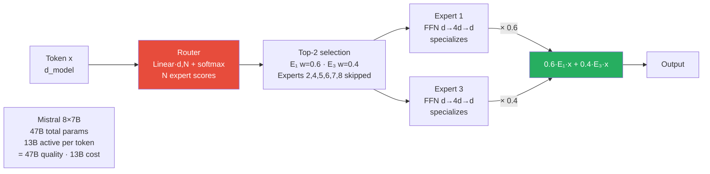

# 09 — Mixture of Experts (MoE) — Sparse Architectures

> The architecture behind Mistral, GPT-4 (rumored), DeepSeek-V3. Activate only a fraction of parameters per token → scale params without scaling compute.

---

## 1. Objective

Standard transformer FFN layers activate ALL parameters for every token. To scale capacity, you must scale compute linearly.

MoE breaks this: have N "expert" FFN layers, but a small router picks K << N of them per token. Capacity scales with N, compute scales with K. **More parameters with the same FLOPs.**

**The numbers:** Mistral 8x7B has ~47B total parameters but only 13B active per token. Quality of a 47B model, inference cost of a 13B.

---



## 2. Core Concept — Sparse Activation

### Standard FFN

```
y = FFN(x) = W_2 · activation(W_1 · x)
Cost per token:   2 · d · d_ff   (FLOPs)
Memory:           W_1, W_2 — every parameter touched
```

### MoE FFN

```python
gates    = softmax(W_router · x)         # router scores over N experts
top_k_ids = top_k(gates, K)              # pick top K experts
y         = Σ_{i in top_k_ids} gates[i] · FFN_i(x)

Cost per token:    K · 2 · d · d_ff      # K experts, not N
Total parameters:  N · 2 · d · d_ff      # N expert pairs (W_1_i, W_2_i)
```

For K=2, N=8 (Mixtral): total params 8× but compute only 2× a single FFN. You get a much wider expressive space without paying for it at inference.

### Where MoE Goes in a Transformer

Every other (or every) FFN layer is replaced with an MoE layer. Attention layers are NOT typically replaced — attention is already efficient per-token, and routing attention is harder. Some 2025 architectures explore MoA (Mixture of Attention) but it's not mainstream.

---

## 3. The Router and Load Balancing

The router is a simple linear layer + softmax:

```
router(x) = softmax(W_r · x)   where W_r ∈ R^{d × N}
```

**Top-K routing:** pick the top K experts by router score. Common K=1 (Switch Transformer) or K=2 (Mixtral).

### The Load Balancing Problem

Naive top-K routing collapses to "all tokens go to expert 1" within a few training steps. The router learns to over-rank one expert; gradients flow only through that one; the others die.

### Auxiliary Load-Balancing Loss (Switch Transformer)

```
L_aux = N · Σ_i f_i · p_i

where f_i = fraction of tokens routed to expert i (in a batch)
      p_i = average router probability for expert i
```

Minimizing L_aux pushes both f_i and p_i toward uniform (1/N) — keeps experts balanced.

### Aux-Loss-Free (DeepSeek-V3 Approach)

DeepSeek-V3 (2024) introduced **bias-based load balancing**: add a learned bias to the router scores per expert. Adjust biases at runtime to keep loads balanced. Cleaner than the auxiliary loss, doesn't compete with the main objective.

### Capacity Factor

Each expert has a fixed "slot count" per batch. If load balancing fails and one expert gets too many tokens, excess tokens are **DROPPED** (their FFN output = 0, residual carries forward).
- Capacity factor 1.0 = strict
- Capacity factor 1.25 = some slack

---

## 4. Variants — Mixtral, DeepSeek, GPT-4 (rumored)

### Mixtral 8x7B (Mistral, 2023)

- 8 experts total, 2 active per token (top-2 routing)
- 47B total params, 13B active
- Auxiliary load-balancing loss
- Performance: matches Llama-2-70B at much lower inference cost

### Mixtral 8x22B (Mistral, 2024)

- Same architecture, bigger experts
- 141B total params, 39B active
- Frontier-class open-weights model in 2024

### DeepSeek-V3 (DeepSeek, 2024)

- 256 routed experts + 1 shared expert (always active)
- Top-8 routing (much higher K than Mixtral)
- 671B total params, 37B active per token
- Aux-loss-free load balancing
- One of the strongest open-weights models in 2024-25

### GPT-4 (rumored architecture, not confirmed)

- Likely 16 experts × ~111B each (~1.8T total)
- Top-2 routing
- Information from leaks, not official

**Pattern: more / smaller experts is the trend.** 2023: 8 experts (Mixtral). 2024: 256 experts (DeepSeek-V3). Higher granularity → better expert specialization, finer routing → more capacity at same FLOPs.

---

## 5. Training Challenges

1. **Distributed training complexity** — experts are typically distributed across GPUs (expert parallelism). Tokens need to be routed across GPUs every layer. All-to-all communication cost is significant.

2. **Token drop is catastrophic for some tasks** — if capacity factor is too tight, dropped tokens lose information. Long-context tasks suffer.

3. **Memory pressure** — total params are huge even though FLOPs are modest. Fine-tuning a 47B MoE on a single GPU is impossible without offloading.

4. **Cold experts** — at initialization, some experts get no tokens (load balance fails early). Recovery is slow. Mitigation: warm-up phase with broader routing.

5. **Fine-tuning is harder than dense models** — LoRA on MoE: do you LoRA each expert separately? The router? Both? Active research area; defaults from PEFT aren't always optimal.

6. **Inference batching efficiency** — token-level routing means within a batch, different tokens activate different experts. Less GPU-friendly than dense models. vLLM and SGLang have specialized MoE kernels.

---

## 6. Failure Modes

1. **Expert collapse** — load balancing fails → all tokens route to one expert → effective rank reduction. Auxiliary loss or bias-based balancing is essential.

2. **Routing instability across versions** — when you fine-tune a pretrained MoE, the router can shift dramatically. Some research suggests freezing the router during fine-tuning.

3. **Memory >> compute mismatch** — a 47B MoE has 47B params on disk but only 13B active. A 24GB GPU can't load 47B params. Requires multi-GPU or significant quantization.

4. **Quantization is harder for MoE** — the router needs higher precision than experts. Q4_K_M on Mistral works but Q3 often breaks. Quantization-aware training for MoE is an open problem.

5. **Latency variability** — different tokens activate different experts → memory accesses scatter. Latency per token has higher variance than dense models.

---

## 7. Interview Questions (5)

**Q1: How does MoE achieve more parameters with the same FLOPs?**

N expert FFN layers; only K << N are activated per token. Total params scale with N (capacity); per-token compute scales with K (cost). Mistral 8x7B has 47B total params but activates only 13B (top-2 of 8) per token. Inference cost = 13B model; capacity = 47B model.

**Q2: What's the load balancing problem in MoE and how is it solved?**

Naive routing collapses to "all tokens go to expert 1" because gradients only flow through the chosen expert. Fix: auxiliary loss that pushes router probabilities and actual token fractions toward uniform (Switch Transformer), or bias-based runtime adjustment (DeepSeek-V3 aux-loss-free).

**Q3: Mixtral vs DeepSeek-V3 — what's different architecturally?**

Mixtral 8x7B: 8 experts, top-2 routing, auxiliary loss balancing. DeepSeek-V3: 256 routed experts + 1 shared expert (always active), top-8 routing, aux-loss-FREE bias-based balancing. The DeepSeek pattern is the 2024-25 trend: more / smaller experts, larger K, cleaner balancing.

**Q4: What are the production downsides of MoE?**

(1) Memory footprint is much larger than active params → fine-tuning needs offloading or multi-GPU. (2) Inference latency has higher variance due to routing patterns. (3) Quantization is harder than dense models. (4) Fine-tuning patterns are less mature (LoRA on experts vs router vs both is open).

**Q5: How does the router work mechanically?**

Linear projection of token's hidden state to N expert scores, followed by softmax. Top-K experts are selected; their FFN outputs are combined as a weighted sum using the router probabilities. Router is N·d parameters — tiny vs the experts themselves.

---

## 8. Further Reading

- Switch Transformer (Fedus et al. 2021) — arXiv:2101.03961 — the modern MoE foundation
- GShard (Lepikhin et al. 2020) — arXiv:2006.16668 — early MoE at scale
- Mixtral 8x7B (Mistral 2023) — arXiv:2401.04088
- DeepSeek-V3 (DeepSeek-AI 2024) — arXiv:2412.19437 — fine-grained expert specialization
- DeepSeekMoE (DeepSeek 2024) — arXiv:2401.06066
- vLLM MoE support docs — for production serving

---

## Key Takeaway

```
MoE = N expert FFNs + router picks K per token
      Capacity scales with N, compute scales with K
      "More parameters with the same FLOPs"

Load balancing:
  Auxiliary loss (Switch, Mixtral) — pushes router distribution toward uniform
  Bias-based (DeepSeek-V3)        — cleaner, doesn't fight the main objective

Key models:
  Mixtral 8x7B:   47B params, 13B active  → matched Llama-2-70B
  DeepSeek-V3:    671B params, 37B active → one of strongest open models 2024-25

Production reality:
  Memory >> compute: can't fit on single GPU
  Routing adds latency variance
  Fine-tuning patterns still maturing
```
