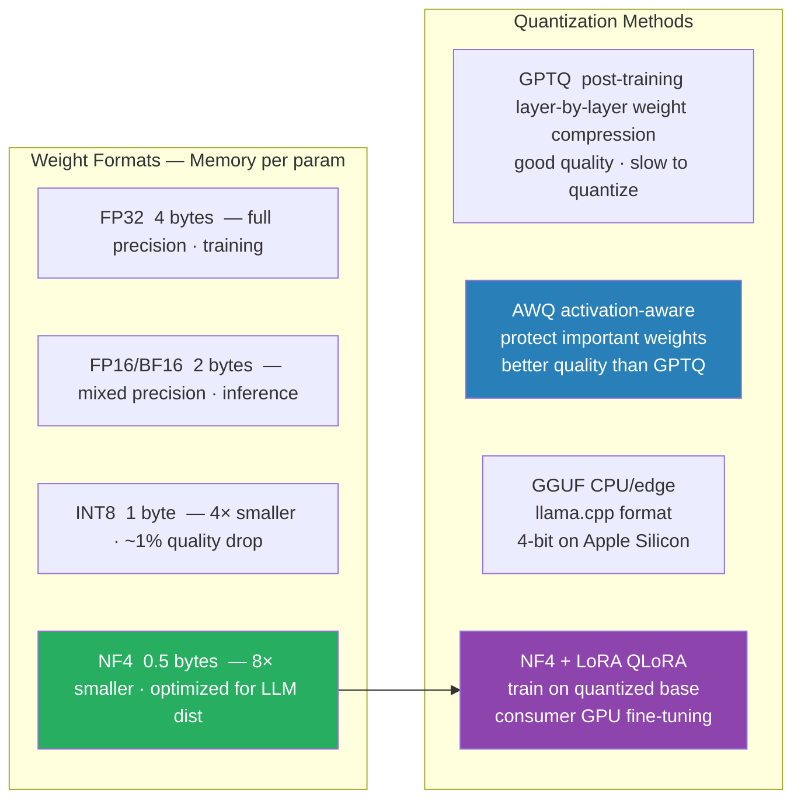

# 10 — Quantization Theory — INT8, NF4, GPTQ, AWQ

> The math behind running a 70B model on consumer hardware. INT8 vs NF4 vs GPTQ vs AWQ — when each wins.

---

## 1. Objective

Modern LLMs (70B params at fp16 = 140 GB) don't fit on consumer GPUs. Quantization compresses weights — 4× memory reduction is now standard with near-zero quality loss.

Two distinct purposes:
- **Inference quantization** — serve a quantized model (GPTQ, AWQ, GGUF, NF4)
- **Quantization-aware training** — train with quantized weights (QLoRA uses NF4 + LoRA)



**Senior interview Q:** "Walk me through why NF4 beats naive INT4 for LLM weights."

---

## 2. Core Concept — Affine Quantization

The mapping from float to int:

```python
quantized  = round((x - zero_point) / scale)   # clipped to [int_min, int_max]
dequantized = quantized * scale + zero_point
```

Two parameters per quantization block: **scale** (float, controls range) · **zero_point** (int, shifts so 0.0 maps cleanly).

### Per-tensor vs per-channel vs per-block

| Granularity | Pros | Cons |
|-------------|------|------|
| Per-tensor (one scale for whole weight matrix) | Minimal overhead | Poor for outlier-heavy tensors |
| Per-channel (one scale per output row) | Better quality | Slightly more overhead |
| Per-block (e.g., 64 weights per block) | Best quality | Most overhead |

Modern LLM quantization is **per-block** (block size 32-128). The overhead is amortized over enough weights to be negligible.

### Where Quality Loss Comes From

Two sources: 1. **Rounding error** — fewer bits = coarser representation. 2. **Outliers** — a few large-magnitude weights can dominate the range, making the quantization coarse for the rest.

Modern methods (GPTQ, AWQ, NF4) explicitly handle outliers.

---

## 3. INT8 Quantization

The simplest non-trivial scheme. Symmetric INT8 (range −128 to 127):

```python
scale     = max(|w_i|) / 127
quantized = round(w_i / scale)
```

**Why it works:** For Gaussian-distributed weights, INT8 gives ~99.5% of the dynamic range in 256 levels. Perplexity loss vs fp16: typically < 1%.

**Memory savings:** fp16 → INT8 = 2× compression. fp32 → INT8 = 4×.

**Compute savings:** INT8 matmul on modern GPUs (A100, H100) is 2-4× faster than fp16 matmul because of Tensor Cores' INT8 support.

**bitsandbytes 8-bit:** The popular library. Wraps PyTorch ops with INT8 matmul. Used in HuggingFace `load_in_8bit=True`. Works on CUDA only.

---

## 4. NF4 — NormalFloat 4-bit (Dettmers / QLoRA)

**The QLoRA paper's key contribution** (Dettmers et al. 2023).

### The Motivation

Naive INT4 has 16 evenly-spaced levels. But LLM weights are roughly N(0, σ²) — most weights cluster near zero, few are extreme. With 16 evenly-spaced levels, you waste resolution on rare extreme weights and lack precision near zero.

### The Trick

Place the 16 levels at quantiles of the standard normal distribution:

```
NF4 levels: [-1.000, -0.695, -0.525, -0.394, -0.284, -0.185, -0.091, 0.000,
              0.095,  0.245,  0.338,  0.441,  0.563,  0.723,  1.000]
```

Levels are **DENSER near 0, SPARSER at extremes** — matching the actual weight distribution. This is information-theoretically optimal for normally distributed values.

### Plus Per-block Scaling

Quantization is applied per-block of 64 weights. Each block has its own scale (absolute max in that block).

### Double Quantization

The per-block scales themselves are quantized to 8-bit (with a per-group scale on top). Saves another ~0.4 GB on a 70B model.

### Result for 70B Model

```
fp16:              140 GB
NF4:                35 GB   (4× compression)
NF4 + double quant: ~33 GB  (extra savings)
```

70B fits in 48 GB or even 40 GB GPU. QLoRA exploits this for fine-tuning — load base in NF4, add fp16 LoRA adapters on top.

### Quality Cost

For Llama-2-70B and similar: Perplexity rise vs fp16: ~1-2%. Downstream task accuracy: within 0.5%. Generation quality: indistinguishable in blind tests.

**NF4 is the de-facto 4-bit standard in 2024-25.**

---

## 5. GPTQ and AWQ — Post-training Quantization

These are alternatives to NF4 with different design philosophies.

### GPTQ (Frantar et al. 2023)

A more aggressive method that uses **calibration data** to choose quantization parameters.

```
For each weight column:
1. Quantize column to INT3 / INT4 with chosen rounding
2. Compute reconstruction error on calibration data
3. ADJUST remaining columns to compensate for the error
```

Treats quantization as a layer-by-layer optimization, not just per-tensor rounding. Lower perplexity loss than NF4 in some setups, especially at extreme precisions (3-bit, 2-bit).

Standard for **inference-only deployment** where you want max compression and don't need to fine-tune the model afterward.

### AWQ (Activation-aware Weight Quantization, Lin et al. 2023)

**Observation:** not all weights matter equally. Weights with large ACTIVATION values during inference matter more.

```
For each weight w_ij:
  importance_ij = mean( |x_j| over calibration data )
  protect weights with high importance from aggressive quantization
```

Practically: scale up the "important" channels before quantizing, scale back after dequantizing. Saves precision where it matters.

Slightly better than GPTQ on some benchmarks; matched on others. Popular for production inference servers.

### When to Pick Which

- **NF4** — when fine-tuning is the goal (QLoRA). Simpler, no calibration data needed.
- **GPTQ** — when extreme compression (3-bit or even 2-bit) matters, and you have calibration data.
- **AWQ** — production inference with vLLM. Good quality, well-supported.
- **GGUF Q4_K_M** — llama.cpp's mixed-precision 4-bit. Used by Ollama. Excellent quality/size, CPU-friendly.

---

## 6. Comparison — When to Pick Which

| Method | Bits | Quality Cost | Use Case | Hardware |
|--------|------|-------------|---------|---------|
| fp16 | 16 | baseline | training, sensitive inference | CUDA, MPS, TPU |
| INT8 (bitsandbytes) | 8 | < 1% | inference, training (offload) | CUDA |
| NF4 (QLoRA) | 4 | 1-2% | fine-tuning, QLoRA | CUDA |
| GPTQ | 4 (or 3) | 1-3% | inference, max compression | CUDA, some CPU |
| AWQ | 4 | 1-3% | production inference (vLLM) | CUDA |
| GGUF Q4_K_M | ~4 (mixed) | 1-2% | CPU/Mac inference | any |
| GGUF Q2_K | ~2 | 5-15% | extreme compression, big models | any |
| MLX 4-bit | 4 | 2-3% | Apple Silicon | Mac |

**Pragmatic 2024 choices:**
- Training a small model (1-13B) on GPU → bf16 + LoRA
- Fine-tuning a big model (70B+) on GPU → QLoRA (NF4 base + LoRA)
- Production inference (CUDA) → AWQ or GPTQ via vLLM
- Local/edge inference → GGUF Q4_K_M via llama.cpp / Ollama
- Mac inference → MLX 4-bit

---

## 7. Failure Modes

1. **Outlier weights tank quantization quality** — a single weight 100× the typical magnitude makes the per-tensor scale coarse for all other weights. Modern methods (per-block, AWQ outlier protection) mitigate but don't eliminate.

2. **Quantizing the LM head can break generation** — the output projection often has different statistics. Many libraries keep the LM head in fp16 by default. Check your config.

3. **Quantization-aware training is hard** — naive QAT requires straight-through estimator gradients and is unstable for LLMs. QLoRA works because gradients flow through fp16 adapters; the quantized base is frozen.

4. **MoE + quantization** — different experts can have different weight distributions. Per-expert quantization scales help; uniform scales hurt some experts.

5. **Inference kernel availability** — INT8 has wide kernel support; INT4 less so. Some custom hardware (Apple ANE) doesn't support 4-bit at all. Check before committing.

6. **Long context degradation** — quantized models sometimes degrade faster at long context than fp16. Mitigation: keep KV cache higher precision (e.g., fp16 KV cache + INT4 weights).

---

## 8. Interview Questions (5)

**Q1: Why does NF4 beat naive INT4 for LLM weights?**

INT4 has 16 evenly-spaced levels. LLM weights are roughly normally distributed — most cluster near 0, few are extreme. NF4 places the 16 levels at quantiles of the standard normal — denser near zero, sparser at extremes. Information-theoretically optimal for Gaussian-like weights. Same 4 bits, less quantization error.

**Q2: How does QLoRA work? Why is it "free"?**

QLoRA = NF4-quantized base model (frozen) + fp16 LoRA adapter (trainable). Inference: W_base_dequant + B·A → 4× memory; the adapter is tiny and trainable. Result: fine-tune 65B model on one 48GB GPU. The "free" part: only the LoRA adapter gets gradients, optimizer states, and Adam moments — quantized base contributes nothing to training memory.

**Q3: GPTQ vs AWQ — when to choose which?**

GPTQ: layer-by-layer optimization with calibration data, treating quantization as a least-squares problem. Aggressive at extreme bit-widths (3-bit, 2-bit). AWQ: activation-aware — protects weights that matter to large activations. Production inference (vLLM) typically prefers AWQ. For 4-bit they're close; at 3-bit GPTQ tends to win.

**Q4: Why does INT8 inference often run FASTER than fp16?**

Modern GPUs (A100, H100) have dedicated Tensor Cores INT8 throughput that is 2-4× fp16 (FLOPs). Plus the lower precision means less memory bandwidth — and LLM inference is memory-bound. Combined: 2-4× speedup is typical.

**Q5: What's GGUF Q4_K_M and why is it the de-facto local quantization?**

GGUF is llama.cpp's format. Q4_K_M = mixed 4-bit: some critical layers kept at higher precision. Better quality/size tradeoff than naive INT4. Used by Ollama. Works on any hardware (CPU + Metal/GPU offload). The "M" stands for medium quality tier; Q4_K_S is smaller, Q4_K_L is larger.

---

## 9. Further Reading

- QLoRA (Dettmers et al. 2023) — arXiv:2305.14314 — NF4 origin
- LLM.int8() (Dettmers et al. 2022) — arXiv:2208.07339 — bitsandbytes 8-bit
- GPTQ (Frantar et al. 2023) — arXiv:2210.17323
- AWQ (Lin et al. 2023) — arXiv:2306.00978
- SmoothQuant (Xiao et al. 2022) — arXiv:2211.10438 — activation smoothing for INT8
- llama.cpp GGUF docs — github.com/ggerganov/llama.cpp — production CPU/edge quantization

---

## Key Takeaway

```
Quantization = compress weights from fp16 → INT8/INT4 with minimal quality loss

INT8:  < 1% quality loss, 2× memory, 2-4× faster inference via Tensor Cores
NF4:   1-2% quality loss, 4× memory — de-facto standard for QLoRA fine-tuning
GPTQ:  calibration-based, best for max compression (3-bit), inference-only
AWQ:   activation-aware, production inference via vLLM, well-supported
GGUF:  CPU/Mac friendly, Q4_K_M is the local inference default (Ollama)

The key insight: LLM weights are Gaussian → NF4's non-uniform levels
are information-theoretically optimal, beating naive INT4 at same bit-width.
```
