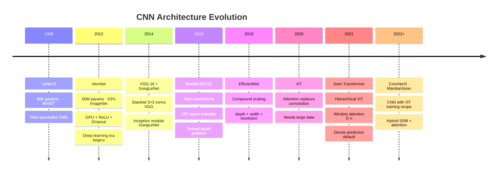

# 02 — CNN Architectures (LeNet → ConvNeXt)

## Quick Reference

| Architecture | Year | Params | Top-1 ImageNet | Key Innovation |
|---|---|---|---|---|
| LeNet-5 | 1998 | 60K | N/A (MNIST) | First successful CNN |
| AlexNet | 2012 | 60M | 63.3% | Deep CNN + GPU + ReLU + Dropout |
| VGG-16 | 2014 | 138M | 74.4% | Stacked 3×3 convs, depth |
| GoogLeNet | 2014 | 6.8M | 74.8% | Inception module, 1×1 conv |
| ResNet-50 | 2015 | 25M | 76.1% | Skip connections, 152 layers |
| DenseNet-121 | 2017 | 8M | 74.9% | Dense connections, feature reuse |
| MobileNetV2 | 2018 | 3.4M | 72.0% | Depthwise separable, mobile |
| EfficientNet-B0 | 2019 | 5.3M | 77.3% | Compound scaling (depth+width+res) |
| Vision Transformer | 2020 | 86M | 77.9% | Attention instead of convolution |
| Swin Transformer | 2021 | 88M | 84.5% | Hierarchical ViT with windowed attention |
| ConvNeXt-B | 2022 | 89M | 83.8% | CNN redesigned with ViT training recipe |
| ConvNeXt V2-B | 2023 | 89M | 87.7% | FCMAE pretraining + GRN normalization |
| Vision Mamba (Vim-B) | 2024 | 98M | 81.9% | SSM backbone — O(n) compute on patch sequences |
| MambaVision-L (NVIDIA) | 2024 | 228M | 87.3% | Hybrid Mamba + Self-Attention — best accuracy/throughput |


| DINOv2 ViT-L | 2023 | 304M | 86.7% | Self-supervised (no labels); SOTA off-the-shelf features |

---

## 1. LeNet-5 (1998) — The Ancestor

**Task:** Handwritten digit recognition (MNIST, 28×28 grayscale). **Authors:** Yann LeCun et al.

### Architecture

```
Input 32×32×1
  + Conv1 (6 filters, 5×5, stride=1)  → 28×28×6
  + AvgPool (2×2, stride=2)            → 14×14×6
  + Conv2 (16 filters, 5×5)           → 10×10×16
  + AvgPool (2×2, stride=2)            → 5×5×16
  + Flatten                            → 400
  + FC1(120) + FC(84) + FC(10)
  + Softmax

Params: ~60K
```

### What It Established

- Convolution → Pooling → Convolution → Pooling → FC pattern
- Hierarchical feature learning
- Parameter sharing across spatial locations

**Limitations:** Sigmoid activations (slow, vanishing gradients), average pooling (not max), too shallow for complex tasks, designed for small images.

---

## 2. AlexNet (2012) — The Revolution

**Achievement:** Won ImageNet LSVRC-2012, dropped error from 26.1% to 15.3%. Triggered the deep learning era. **Authors:** Krizhevsky, Sutskever, Hinton.

### Architecture

```
Input 224×224×3
  + Conv1 (96 filters, 11×11, stride=4)  → 55×55×96
  + MaxPool (3×3, stride=2)               → 27×27×96
  + Conv2 (256 filters, 5×5, pad=2)       → 27×27×256
  + MaxPool (3×3, stride=2)               → 13×13×256
  + Conv3 (384 filters, 3×3, pad=1)       → 13×13×384
  + Conv4 (384 filters, 3×3, pad=1)       → 13×13×384
  + Conv5 (256 filters, 3×3, pad=1)       → 13×13×256
  + MaxPool (3×3, stride=2)               → 6×6×256
  + Flatten + FC(4096) + FC(4096) + FC(1000)

Params: ~60M (mostly in FC layers: 6×6×256 = 9216 → FC → 37M params alone)
```

### Key Innovations (Each Still Used Today)

1. ReLU instead of tanh/sigmoid → 6× faster convergence, no vanishing gradient
2. GPU training (2 GTX 580, 3GB) → enabled deep networks in reasonable time
3. Dropout (p=0.5) in FC layers → first effective regularization for large networks
4. Data augmentation — random crops, horizontal flips → prevented overfitting
5. Local Response Normalization (LRN) → lateral inhibition (now replaced by BN)
6. Overlapping max pooling → slightly better than non-overlapping

**Weakness:** 60M params, mostly in FC layers. VGG fixed the architecture but kept the bloated FC layers. ResNet eliminated them with GAP.

---

## 3. VGG (2014) — Depth with Simplicity

**Authors:** Simonyan, Zisserman (Oxford VGG group). **Key insight:** Deeper is better — replace large kernels with stacked 3×3 convs.

### VGG Design Principle

```
Two 3×3 convs: RF=5×5, params = 2×(3×3×C) = 18C
One 5×5 conv:  RF=5×5, params = 5×5×C = 25C*
  + Same receptive field, 28% fewer params, two ReLU nonlinearities

Three 3×3 convs: RF=7×7, params = 27C   vs  one 7×7: params = 49C
  + 44% fewer params
```

### VGG-16 Architecture

```
Input 224×224×3
  + [Conv(64)×2] + MaxPool   → 112×112×64
  + [Conv(128)×2] + MaxPool  → 56×56×128
  + [Conv(256)×3] + MaxPool  → 28×28×256
  + [Conv(512)×3] + MaxPool  → 14×14×512
  + [Conv(512)×3] + MaxPool  → 7×7×512
  + Flatten + FC(4096) + FC(4096) + FC(1000)

Params: ~138M (160M in FC layers)
```

**Legacy:** VGG introduced the "all-3×3-conv" philosophy. Still widely used for feature extraction in style transfer, perceptual loss, and as a simple baseline. VGG-19 often used for texture synthesis.

**Problems:** 138M params (mostly FC), slow inference, not suitable for mobile or real-time.

---

## 4. ResNet (2015) — Skip Connections

**Achievement:** Enabled training of 152-layer networks. Won ImageNet 2015 with 3.57% error (human-level). **Authors:** He, Zhang, Ren, Sun (Microsoft Research).

### The Degradation Problem

```
Observation: deeper networks had WORSE training error than shallower ones
  + Not overfitting (train error higher, not just val error)
  + Optimization difficulty — gradients vanish through many layers

Hypothesis: layers struggle to learn identity (do-nothing) mapping
  + If optimal function IS identity, hard to learn from scratch

Solution: Residual learning
  Instead of learning H(x), learn F(x) = H(x) - x (the residual)
  Then H(x) = F(x) + x  → skip connection adds x directly
```

### Residual Block

```
     x
     |───────────────────── (skip connection)
  Conv2d(3×3)              |
  BatchNorm2d              |
  ReLU                     |
  Conv2d(3×3)              |
  BatchNorm2d              |
     +────────────────────-
     |
   ReLU
     |
  output

Math: output = ReLU(F(x, {W}) + x)

F = two conv layers with BN (the residual)
x = identity shortcut

If F(x)≈0, output=ReLU(x) = identity → gradient highway bypasses the block
```

### Bottleneck Block (ResNet-50/101/152)

```
1×1 conv (reduce channels: 256→64)
3×3 conv (process in reduced dim: 64→64)
1×1 conv (expand channels: 64→256)
+ skip

Params: 1×1×256×64 + 3×3×64×64 + 1×1×64×256 = 69,632
vs 2× 3×3×256×256 = 1,179,648 = 17× fewer
```

### ResNet Variants

| Variant | Layers | Params | Top-1 | Notes |
|---------|--------|--------|-------|-------|
| ResNet-18 | 18 | 11M | 69.8% | Fastest; classification head |
| ResNet-34 | 34 | 21M | 73.3% | Basic blocks |
| ResNet-50 | 50 | 25M | 76.1% | **Most used** — bottleneck blocks |
| ResNet-101 | 101 | 44M | 77.4% | Larger datasets |
| ResNet-152 | 152 | 60M | 78.3% | SOTA in 2015 |

**Why ResNet-50 is the default:** Good accuracy/speed tradeoff. 25M params fits in memory. Pre-trained weights on ImageNet widely available. Backbone for Faster R-CNN, Mask R-CNN, FPN.

### Pre-activation ResNet (v2)

```
BN → ReLU → Conv   (instead of Conv → BN → ReLU)

Benefits: cleaner gradient flow through skip connection (no BN/ReLU on skip path)
Slightly better for very deep (1000+ layer) networks
```

---

## 5. GoogLeNet / Inception (2014)

**Key innovation:** Inception module — parallel convolutions at multiple scales.

```
Inception module:
         input
       / | | \
     1×1 1×1 1×1  pool
      |  3×3 5×5    |
    conv  ↓   ↓   1×1
          ↓   ↓     ↓
         concatenate
```

- Why: different features need different receptive fields. Concatenate 1×1, 3×3, 5×5 outputs — model picks what it needs.
- **1×1 before expensive convs:** reduces channels before 3×3 or 5×5 → dramatically fewer params.
- GoogLeNet: 22 layers, only 6.8M params (vs AlexNet's 60M) — efficient through Inception modules and GAP instead of FC.

---

## 6. DenseNet (2017)

**Innovation:** Each layer connected to ALL previous layers (dense connections).

```
x_L = H_L([x_0, x_1, ..., x_{L-1}])

Instead of ResNet (adds):   x_L = F(x_{L-1}) + x_{L-1}
Dense:                      x_L = H_L(concat[x_0, ..., x_{L-1}])   (concatenates!)
```

**Benefits:** Maximum feature reuse — every feature accessible to all later layers. Fewer parameters (no need to relearn features). Strong gradient flow — direct path from any layer to loss.

**When used:** Medical imaging (U-Net+ uses dense connections), tasks needing fine-grained feature combinations.

---

## 7. EfficientNet (2019) — Compound Scaling

**Problem:** How to scale CNNs efficiently? Previous approaches scaled one dimension: Depth (ResNet-152), Width (more channels), Resolution (bigger input images).

**EfficientNet insight:** Scale depth, width, and resolution together with a fixed ratio.

```
Compound scaling:
  depth:      d = α^φ
  width:      w = β^φ
  resolution: r = γ^φ

where α·β²·γ² = 2 (doubling FLOPs each scale step)
α=1.2, β=1.1, γ=1.15 (found by NAS)

φ controls scale:
  B0: baseline (NAS-found architecture)
  B1-B7: increasingly larger
```

### EfficientNet Variants

| Model | Params | Top-1 | Input Size |
|-------|--------|-------|-----------|
| B0 | 5.3M | 77.3% | 224×224 |
| B3 | 12M | 81.7% | 300×300 |
| B7 | 66M | 84.7% | 600×600 |

**Backbone of choice** for many production CV systems in 2019-2021. Replaced by ConvNeXt and ViT in 2022+.

---

## 8. MobileNet (2017/2019) — Mobile Deployment

**Designed for:** resource-constrained devices (phones, edge, embedded).

**Core technique:** Depthwise Separable Convolution (see `01_cnn_mechanics.md`).

```
MobileNetV1: depthwise separable convs throughout
MobileNetV2: Inverted residuals + linear bottleneck
  Expand → Depthwise → Project (instead of Compress + Conv + Expand in ResNet)
  Linear activation at bottleneck output (no ReLU → ReLU destroys low-dim manifolds)
MobileNetV3: NAS-optimized + h-swish activation + Squeeze-and-Excitation
```

**When to use:** TensorFlow Lite deployment, real-time on-device inference, drones, embedded cameras.

---

## 9. Vision Transformer (ViT, 2020)

**Breaks with CNN tradition:** No convolutions. Pure attention.

```
1. Split image into patches (16×16 pixels each)
   224×224 image → 16×16 = 196 patches

2. Embed each patch: 768 + linear projection → 768-dim token

3. Add class token [CLS] + positional embedding

4. Pass through Transformer encoder (MHA + FFN) × 13 times

5. [CLS] token output → classifier
```

**Why it works at scale:** ViT outperforms CNNs when trained on very large datasets (JFT-300M, ImageNet-21K). On ImageNet-1K alone, CNNs still competitive. Key: attention captures global context from patch 1, unlike CNNs that build large RF slowly.

**ViT variants:**
- **DeiT** (Data-efficient ViT): trains ViT on ImageNet-1K with knowledge distillation from CNN
- **Swin Transformer:** hierarchical ViT with local windows → replaces CNN backbone in detection/segmentation

Deeper coverage of ViT, Swin, MViT, DeiT, and modern training recipes → `04_vision_transformer_deep.md`

---

## 9.5 Self-Supervised Vision Backbones (2022-2025)

The frontier of "best off-the-shelf vision features" has moved from supervised ImageNet pretraining to self-supervised foundation models. Often you don't need to fine-tune them — they work zero-shot.

| Model | Year | Pretraining target | Use it as |
|-------|------|--------------------|-----------|
| MAE (Masked Autoencoder) | 2021 | Reconstruct masked patches | Encoder for fine-tuning |
| DINOv2 (Meta) | 2023 | Self-distillation across crops | Frozen feature extractor — SOTA off-the-shelf |
| I-JEPA (Meta) | 2023 | Predict masked features (not pixels) | Better for semantic tasks than MAE |
| CLIP (OpenAI) | 2021 | Image-text contrastive | Zero-shot classification + retrieval |
| SigLIP / SigLIP-2 (Google) | 2023-24 | Sigmoid contrastive (replaces softmax in CLIP) | CLIP+ with better stability |
| AIM / AIMv2 (Apple) | 2024 | Autoregressive visual prediction | Scales like LLMs |
| V-JEPA (Meta) | 2024 | I-JEPA for video | Video understanding |

**Senior interview answer 2025:** "For a new vision task with limited labels, I wouldn't start with supervised ImageNet pretraining anymore. DINOv2 features + a small classifier head typically beat fine-tuning a supervised ResNet-50, with zero compute spent on pretraining. For zero-shot classification or retrieval, CLIP / SigLIP. For text-conditioned tasks, switch to a VLM (LLaVa, Qwen-VL)."

Full treatment: `../02_applications/05_self_supervised_vision.md`

---

## 10. ConvNeXt (2022) — CNN Modernized

**Question:** Can a pure CNN match ViT by adopting ViT's design choices? **Answer:** Yes. ConvNeXt incorporates ViT design wisdom without attention.

```
ConvNeXt innovations (from comparing ResNet + ViT changes):
  1. 4×4 conv stride 4 (like ViT patch embedding)
  2. Larger kernels: 7×7 depthwise conv (like ViT's large attention window)
  3. Fewer activation functions (only one GELU per block)
  4. LayerNorm instead of BatchNorm
  5. Inverted bottleneck (like MobileNetV2)
  6. Separate downsampling layers

Result: ConvNeXt-B matches or beats Swin Transformer with simpler training.
```

---

## 11. Architecture Selection Guide

| Use Case | Architecture | Why |
|----------|-------------|-----|
| Production baseline | ResNet-50 | Proven, fast, pre-trained everywhere |
| Mobile / edge inference | MobileNetV3 or EfficientNet-B0 | Small, fast, accurate |
| Highest accuracy | ConvNeXt-L or ViT-L (with large pretraining) | SOTA on ImageNet |
| Transfer learning (fine-tune) | EfficientNet-B3 or ResNet-50 | Good accuracy/param tradeoff |
| Real-time detection backbone | ResNet-50-FPN or EfficientDet | Balanced speed/accuracy |
| Medical imaging | DenseNet or U-Net | Feature reuse, segmentation-friendly |
| Text/document imagery | ResNet + SPP | Handles variable aspect ratios |

---

## 12. Gotchas

**ResNet-18 bottleneck vs basic block — don't confuse.** ResNet-18 and ResNet-34 use basic blocks (two 3×3 convs). ResNet-50+ use bottleneck (1×1 → 3×3 → 1×1). Mixing these in code gives wrong param counts.

**Projection shortcut vs identity shortcut.** When dimensions change (stride=2 or channel change), ResNet uses a 1×1 conv on the skip path to match dimensions. Forgetting this → shape mismatch during residual addition.

**EfficientNet input size matters.** B0 expects 224×224, B3 expects 300×300, B7 expects 600×600. Feeding wrong resolution hurts performance significantly — use correct preprocessing.

**ViT doesn't generalize well from small data without pretraining.** ViT needs large pretraining (ImageNet-21K+). For small datasets (<100K samples), stick to CNNs or use DeiT distillation.

**VGG weights are large — don't load for inference if speed matters.** VGG-16: 528MB weights file. EfficientNet-B0: 20MB. For production APIs where model load time matters, VGG is a poor choice.

---

## 13. Code Reference

```python
import torch
import torch.nn as nn
import torchvision.models as models

# Load pretrained backbones
resnet50   = models.resnet50(weights='IMAGENET1K_V2')
effnet_b3  = models.efficientnet_b3(weights='IMAGENET1K_V1')
convnext   = models.convnext_base(weights='IMAGENET1K_V1')
mobilenet  = models.mobilenet_v2_small(weights='IMAGENET1K_V1')

# Custom head for transfer learning
def build_classifier(backbone, num_classes):
    # Freeze backbone
    for param in backbone.parameters():
        param.requires_grad = False

    # Replace classifier head (ResNet)
    if hasattr(backbone, 'fc'):
        in_features = backbone.fc.in_features
        backbone.fc = nn.Sequential(
            nn.Dropout(0.5),
            nn.Linear(in_features, num_classes)
        )
    # EfficientNet
    elif hasattr(backbone, 'classifier'):
        in_features = backbone.classifier[-1].in_features
        backbone.classifier[-1] = nn.Linear(in_features, num_classes)
    return backbone

model = build_classifier(resnet50, num_classes=10)
print(f"Trainable params: {sum(p.numel() for p in model.parameters() if p.requires_grad):,}")

# Custom ResNet-style block
class ResBlock(nn.Module):
    def __init__(self, channels):
        super().__init__()
        self.conv1 = nn.Conv2d(channels, channels, 3, padding=1, bias=False)
        self.bn1   = nn.BatchNorm2d(channels)
        self.conv2 = nn.Conv2d(channels, channels, 3, padding=1, bias=False)
        self.bn2   = nn.BatchNorm2d(channels)
        self.relu  = nn.ReLU(inplace=True)

    def forward(self, x):
        residual = x
        out = self.relu(self.bn1(self.conv1(x)))
        out = self.bn2(self.conv2(out))
        return self.relu(out + residual)   # skip connection

# Feature extraction (remove classifier)
backbone = models.resnet50(weights='IMAGENET1K_V2')
backbone = nn.Sequential(*list(backbone.children())[:-1])  # remove FC layer
backbone.eval()

with torch.no_grad():
    features = backbone(torch.randn(4, 3, 224, 224))
    features = features.flatten(1)   # (4, 2048)
    print(features.shape)
```

---

## 14. Interview Q&A (Senior Level)

**Q: Why did ResNet solve the degradation problem while just using simple addition?**

A: The key is what the network must learn. Without skip connections, a layer must learn H(x) from scratch — if the optimal mapping is close to identity, it must learn that identity (surprisingly hard). With a skip connection, the layer only needs to learn F(x) = H(x) - x. If the optimal mapping IS identity, F(x) = 0 is easier to achieve (just drive weights toward zero). Additionally, skip connections create a gradient highway: gradients flow directly through the addition operation back to early layers without passing through the nonlinear conv path. This means even very deep networks receive meaningful gradients during backprop.

**Q: Why does EfficientNet use compound scaling instead of just scaling depth?**

A: Scaling one dimension has diminishing returns. Scaling only depth: you need many more layers for linear accuracy gain, and gradient flow degrades. Scaling only width: more channels help at each scale but can't capture long-range features without sufficient depth. Scaling only resolution: more pixels require more depth and width to process the increased detail. The compound coefficient φ balances all three — doubling each FLOP budget (φ→φ+1) increases depth, width, and resolution with fixed ratios found by NAS grid search. Result: EfficientNet-B7 achieves the same accuracy as GPipe (557M params) with 8.4× fewer parameters.

**Q: What are the architectural differences between ViT and CNN that explain their different data requirements?**

A: CNNs have two strong inductive biases baked in: locality (each neuron sees a local patch) and translation equivariance (same filter applied everywhere). These biases align with natural image statistics — patterns are local and position-invariant — so CNNs generalize well from small data. ViT has no such inductive biases — every patch attends to every other patch from the start. This makes ViT more flexible (can learn any relationship) but requires more data to discover that local relationships matter. With large pretraining (ImageNet-21K, JFT-300M), ViT matches or beats CNNs because it's not constrained by the locality assumption. Swin Transformer is a middle ground: local attention windows give locality bias, hierarchical structure gives spatial hierarchy, but with attention instead of convolution.

---

## 15. Connections

| This file | Links to | Why |
|-----------|---------|-----|
| CNN mechanics (conv, BN, etc.) | `01_cnn_mechanics.md` | Foundation for all architectures |
| ViT / Swin / DeiT (deep dive) | `04_vision_transformer_deep.md` | Modern vision attention architectures |
| ResNet used as backbone | `../02_applications/02_object_detection.md` | FPN, Faster R-CNN use ResNet backbone |
| Transfer learning with architectures | `../02_applications/01_transfer_learning.md` | Which architecture to fine-tune |
| Self-supervised vision foundation models | `../02_applications/05_self_supervised_vision.md` | DINOv2, MAE, I-JEPA, CLIP, SigLIP |
| ViT attention mechanism | `../../2.deep learning/01_fundamentals/05_modern_components.md` | FlashAttention, RoPE |
| Skip connections in DL context | `../../2.deep learning/01_fundamentals/05_modern_components.md` | Residual connections |
| Vision Mamba / SSMs | `../../2.deep learning/02_architectures/04_transformer.md` | State space models background |

---

## Key Takeaway

```
Evolution arc:
  LeNet (proof of concept)
    → AlexNet (ReLU + GPU → deep learning era)
      → VGG (depth + 3×3 simplicity)
        → ResNet (skip connections → arbitrary depth)
          → EfficientNet (compound scaling → efficiency)
            → ViT (attention replaces conv at scale)
              → ConvNeXt (CNN with ViT design = best of both)

For interviews, master: ResNet skip connections (math + intuition),
bottleneck block param count, why EfficientNet scales differently,
ViT patch embedding, ConvNeXt vs ViT.

For production:
  ResNet-50 is your safe default
  EfficientNet-B3 for accuracy-constrained
  MobileNetV3 for mobile
  ConvNeXt/Swin for SOTA
```
