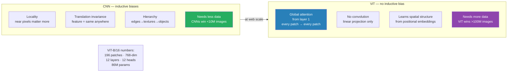

# Vision Transformer (ViT) — Deep Dive

> The architecture that brought transformers to vision. Why patches beat convolutions at scale.

---

## Table of Contents

1. Objective
2. Core concept — image as a sequence of patches
3. Patch embedding + positional encoding for images
4. ViT vs CNN — when each wins
5. Modern ViT variants (Swin, DeiT, DINO)
6. Failure modes
7. Interview questions (5)
8. Further reading

---

## 1. Objective

Before 2020, ConvNets dominated computer vision. ViT (Dosovitskiy et al. 2021) showed that with enough data and compute, a pure transformer on image patches matches or beats CNNs.

**Senior interview Q:** "How is ViT different from a CNN, and why did it take so long for transformers to work on images?"

---

## 2. Core Concept — Image as a Sequence of Patches

CNNs process images via convolutions with strong inductive biases:
- **Locality** — pixels close together matter more
- **Translation invariance** — features detected anywhere are the same feature
- **Hierarchy** — early layers see edges, later layers see objects

ViT throws all of these away. The recipe:
1. Split image into fixed-size patches (typically 16×16 pixels)
2. Flatten each patch and project linearly to a vector — this is a "token"
3. Add positional embeddings
4. Feed sequence of tokens into a standard transformer encoder
5. Use the output of a special `[CLS]` token for classification

**That's the entire architecture. No convolutions anywhere.**



### Numerical Example

```
Input image: 224×224 pixels, 3 channels
Patch size: 16×16
Number of patches: (224/16) × (224/16) = 14 × 14 = 196 patches
Patch dimension: 16 × 16 × 3 = 768   (per patch as a flat vector)
Project to model dim: 768 → 768 (identity here, or 768 → 1024 for larger models)
Add [CLS] token:  197 tokens total
Add 197 positional embeddings
Feed into Transformer encoder (e.g., 12 layers, 12 heads, 768 dim) — same as BERT-base

The transformer sees 197 tokens and processes them with self-attention.
No spatial structure assumed.
```

---

## 3. Patch Embedding + Positional Encoding for Images

### Patch Embedding via Convolution

The implementation trick: instead of slicing and flattening manually, use **one Conv2d with kernel_size=stride=patch_size**:

```python
patch_embed = nn.Conv2d(in_channels=3, out_channels=768,
                        kernel_size=16, stride=16)
# Output shape: (batch, 768, 14, 14) → flatten spatial dims → (batch, 196, 768)
```

This is equivalent to "extract patches and project linearly" but uses a single op.

### Positional Encoding for Images

ViT uses **learnable position embeddings** by default — a (196 + 1, 768) table added to the patch embeddings. Each patch position gets its own learned vector.

Surprising finding from the paper: 2D positional embeddings (encoding row and column separately) gave NO benefit over 1D (just patch index). The model learns spatial structure on its own.

**Position encoding variants:**
- **2D sinusoidal** — fixed, generalizes to different image sizes → **RoPE for vision** — rotary embeddings applied to 2D — used by some recent models (e.g., vision parts of multimodal LLMs)
- **No position at all** — DETR shows you can let learned object queries handle it

### Variable-size Images

A vanilla ViT trained at 224×224 doesn't trivially handle 384×384. Solutions:
- Interpolate position embeddings to the new grid (paper does this for transfer)
- Use 2D sinusoidal (extrapolates)
- Use SwiGLU / RoPE position encodings that generalize

---

## 4. ViT vs CNN — When Each Wins

| | ViT | CNN |
|---|---|---|
| Inductive bias | None | Strong (locality, translation invariance) |
| Data hungry | Yes — needs 100M+ images for top performance | No — strong from-scratch on ImageNet (1M images) |
| Long-range dependencies | Captures naturally via self-attention | Requires deep stacking; harder |
| Compute (per image) | O(n²) where n = num patches | Roughly O(n) where n = pixels |
| Best on | Very large datasets, fine-grained classification at scale | Small data, mobile / edge, traditional segmentation |
| Pretraining matters | Massively. ViT-B/16 trained on ImageNet-1k underperforms CNN. Pretrained on JFT-300M → SOTA | Less critical; from-scratch ImageNet training works |

**The big surprise from the ViT paper:** with enough data and compute, you don't need convolutional inductive biases. The transformer learns them implicitly. But on small data, CNNs dominate.

### When to Actually Use ViT in Production

- **Foundation models** (CLIP, DINO, SAM): all use ViT or hybrid
- **Multimodal LLMs** (LLaVA, Florence, Qwen-VL): vision encoder is almost always ViT
- **Classification on large datasets**: ViT wins after pretraining

### When CNN Still Wins

- Edge / mobile deployment (MobileNet, EfficientNet) — ViT is heavier
- Medical imaging with small datasets — CNN regularizes better
- Object detection at very small scales — convolutions help

---

## 5. Modern ViT Variants (Swin, DeiT, DINO)

### Swin Transformer (Liu et al. 2021)

Hierarchical design, adds CNN-like inductive biases back:
- **Local attention windows** — each patch attends only to a 7×7 window of patches
- **Shifted windows** between layers — info propagates across windows
- **Pyramid structure** — patch merging halves resolution between stages
- Result: O(n) instead of O(n²) compute, works as a backbone for detection/segmentation

Swin is the practical choice when you need a transformer backbone for downstream vision tasks (detection, segmentation). Pure ViT works best for classification.

### DeiT (Touvron et al. 2021)

ViT trained on ImageNet-1k alone (no JFT). The trick: distillation token + better training recipe (more augmentation, longer schedule). Showed ViT can work on standard datasets if you train it right.

### DINO (Caron et al. 2021)

Self-supervised ViT training via a student-teacher setup. The teacher's outputs are used as targets for the student. ViT features trained with DINO are stunningly good at unsupervised object discovery — features cluster by object class without labels.

### DINOv2 (2023)

Bigger, longer-trained version. Foundation model for general-purpose vision features. Used as the vision encoder in many production systems where labels are scarce.

### MAE (Masked Autoencoder, He et al. 2021)

ViT trained via "predict the masked patches given the visible ones." Very data-efficient, strong fine-tuning starting point.

---

## 6. Failure Modes

1. **From-scratch on small data** — ViT-base on CIFAR-10 (50K images) is BAD. Always pretrain on a larger dataset (ImageNet-21k minimum) or use a smaller ViT variant.

2. **High compute cost at high resolution** — 1024×1024 image at 16×16 patches = 4096 patches → O(4096²) attention is expensive. Swin's local windows fix this; pure ViT does not.

3. **Position embedding doesn't transfer to new resolutions** — train at 224×224, can't trivially use at 384×384 without interpolating positions.

4. **Patch boundary artifacts** — features can be discontinuous across patch boundaries. Some research adds learned overlapping patches.

5. **Class token can be redundant** — recent work (iCLIP, DINOv2) drops `[CLS]` and uses mean pooling instead. Simpler, often slightly better.

---

## 7. Interview Questions (5)

**Q1: How does ViT differ from a CNN?**

ViT splits the image into 16×16 patches, flattens each to a vector, adds positional embeddings, and processes with a standard transformer encoder. No convolutions, no locality/translation inductive bias. Self-attention sees all patches at once. CNNs build up hierarchical features via local convolutions and pooling.

**Q2: Why does ViT need more data than CNNs?**

CNNs have built-in inductive biases (locality, translation invariance) that make them sample-efficient. ViT lacks these and must LEARN them from data. With less than ~10M images, the data isn't enough for ViT to learn spatial structure from scratch — CNNs win. With 100M+ images (JFT-300M), ViT's higher capacity pays off.

**Q3: What is Swin Transformer and why was it needed?**

Vanilla ViT has O(n²) compute on patches — prohibitive at high resolutions and for dense tasks (segmentation, detection). Swin uses local attention windows (each patch attends to a 7×7 window) + shifted windows between layers for cross-window info flow + a pyramid hierarchy of patch merging. Result: O(n) compute; works as a general-purpose vision backbone.

**Q4: How do you handle variable image sizes in ViT?**

Three options: (1) resize input to ViT's trained size; (2) interpolate the learnable position embeddings to the new grid (works decently for moderate changes); (3) use position encodings that natively extrapolate (2D sinusoidal, RoPE-for-vision). For production, option 3 is increasingly common.

**Q5: What is DINO and why is it interesting?**

Self-supervised ViT training: a student network predicts the teacher's representations on different augmented views of the same image. No labels needed. The attention maps show emergent object segmentation — the model discovers objects unsupervised. DINOv2 (2023) is the current state-of-the-art self-supervised vision foundation model.

---

## 8. Further Reading

- ViT (Dosovitskiy et al. 2021) — arXiv:2010.11929 — "An Image is Worth 16×16 Words"
- Swin (Liu et al. 2021) — arXiv:2103.14030
- DeiT (Touvron et al. 2021) — arXiv:2012.12877
- DINO (Caron et al. 2021) — arXiv:2104.14294
- DINOv2 (Oquab et al. 2023) — arXiv:2304.07193
- MAE (He et al. 2021) — arXiv:2111.06377 — masked autoencoder pretraining
- HuggingFace ViT models — huggingface.co/models?filter=vit

---

## Key Takeaway

```
"An Image is Worth 16×16 Words"

ViT recipe:
  1. Patchify (16×16) → flatten → linear project → token
  2. Add [CLS] + positional embeddings
  3. Transformer encoder (standard BERT-style)
  4. [CLS] → classifier

ViT wins on large data (100M+); CNN wins on small data (<1M)
Swin adds local windows + hierarchy → backbone for dense tasks
DINO/DINOv2 = self-supervised ViT → best off-the-shelf features (2023-25)
```
