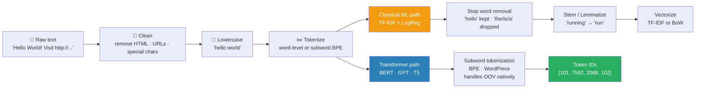

# 01 — Text Preprocessing

## Quick Reference

| Step | Purpose | Classical NLP | Transformer NLP |
|------|---------|--------------|-----------------|
| Lowercasing | Normalize | ✅ Always | ✅ Usually |
| Punctuation removal | Reduce noise | ✅ Often | ✅ Keep (context matters) |
| Stop word removal | Reduce noise | ✅ Common | ❌ Never — hurts attention |
| Stemming | Reduce vocab | ✅ Simple pipelines | ❌ Never |
| Lemmatization | Normalize to base | ✅ Classical ML | ❌ Rarely needed |
| Tokenization | Split to units | ✅ Word-level | ✅ Subword (BPE/WordPiece) |
| Subword tokenization | Handle OOV | ❌ | ✅ Always (BERT, GPT) |

**Rule:** For transformer-based models, do minimal preprocessing — tokenizer handles it. For classical ML (TF-IDF + Logistic Regression), full preprocessing pipeline.


> Never apply stemming or stop word removal for transformers — it destroys the context the attention mechanism relies on.

---

## 1. Text Cleaning

### What and Why

Raw text is noisy — HTML tags, emojis, special chars, URLs, numbers. Clean before vectorizing.

```python
import re

def clean_text(text: str, task='classical') -> str:
    """
    task='classical': aggressive cleaning for BoW/TF-IDF
    task='transformer': minimal cleaning, keep structure
    """
    # Remove HTML tags
    text = re.sub(r'<[^>]+>', ' ', text)
    # Remove URLs
    text = re.sub(r'https?://\S+|www\.\S+', ' ', text)
    if task == 'classical':
        # Remove non-alphabetic characters
        text = re.sub(r'[^a-zA-Z\s]', ' ', text)
        text = text.lower()
    # Collapse whitespace
    text = re.sub(r'\s+', ' ', text).strip()
    return text

# Classical pipeline
print(clean_text("Hello!! <b> Visit https://example.com 🎉", task='classical'))
# = "hello visit"

# Transformer pipeline (minimal)
print(clean_text("Hello!! <b> Visit https://example.com 🎉", task='transformer'))
# = "Hello!!! Visit 🎉"
```

**When to keep noise:** Emojis: keep for sentiment analysis (🎉 = positive signal) · Numbers: keep for financial text, dates in documents · Punctuation: keep for transformers (period = sentence boundary signal)

---

## 2. Tokenization

### Word-Level Tokenization

```python
import nltk
nltk.download('punkt', quiet=True)

text = "I love NLP and Transformers!"
tokens = nltk.word_tokenize(text)
# ['I', 'love', 'NLP', 'and', 'Transformers', '!']
```

**Problem:** "play", "playing", "played", "player" = 4 different tokens → huge vocabulary.
"unhappiness" = unseen in training → OOV (out-of-vocabulary) → UNK token.

### Subword Tokenization — The Modern Standard

**BPE (Byte-Pair Encoding) — GPT family**

```
Algorithm:
1. Start: every character is a token
2. Count all adjacent token pairs
3. Merge the most frequent pair into a new token
4. Repeat until vocabulary size reached (e.g., 50,000)

Example (simplified):
Corpus: "low lower lowest"
Initial:  [l,o,w] [l,o,w,e,r] [l,o,w,e,s,t]
Merge 'l'+'o' → 'lo':  [lo,w] [lo,w,e,r] [lo,w,e,s,t]
Merge 'lo'+'w' → 'low': [low] [low,e,r] [low,e,s,t]
...final tokens: [low] [low, er] [low, est]

"unhappiness" → ['un', 'happiness'] or ['un', 'happy', 'ness']
"ChatGPT"     → ['Chat', 'G', 'PT']  (rare compound word split)
```

**WordPiece — BERT family**

Similar to BPE but maximizes language model likelihood instead of frequency.
Subword pieces prefixed with `##` to indicate continuation:
- `"unhappiness"` → `['un', '##happiness']`
- `"playing"` → `['play', '##ing']`

**SentencePiece — Multilingual (T5, LLaMA)**

Treats raw text as sequence of Unicode characters (no pre-tokenization).
Works directly on raw text including whitespace.
Consistent across languages — no language-specific rules.
`"I love NLP"` → `['▁I', '▁love', '▁NLP']`  (▁ marks word start)

```python
from transformers import AutoTokenizer

# BERT WordPiece
bert_tok = AutoTokenizer.from_pretrained('bert-base-uncased')
print(bert_tok.tokenize("unhappiness playing"))
# ['un', '##happiness', 'play', '##ing']

# GPT-2 BPE
gpt2_tok = AutoTokenizer.from_pretrained('gpt2')
print(gpt2_tok.tokenize("unhappiness playing"))
# ['un', 'happiness', 'Ġplaying']  (Ġ = space prefix)

# Compare vocabulary sizes
print(f"BERT vocab: {bert_tok.vocab_size:,}")   # 30,522
print(f"GPT-2 vocab: {gpt2_tok.vocab_size:,}")  # 50,257

# Full encoding with special tokens
encoded = bert_tok("I love NLP", return_tensors='pt')
# {'input_ids': [101, 1045, 2293, 17953, 2361, 102],
#  'attention_mask': [1, 1, 1, 1, 1, 1]}
# 101=[CLS], 102=[SEP]
```

### Special Tokens

```
[CLS]:  classification token — BERT prepends this, hidden state = sentence representation
[SEP]:  separator — between sentence A and sentence B in BERT
[PAD]:  padding token — makes batches same length
[UNK]:  unknown token — word not in vocabulary (rarely seen with subword)
[MASK]: mask token — BERT MLM training, randomly masked tokens

GPT-2:
<|endoftext|>: end of text separator
No [CLS] or [SEP] — causal (left-to-right) model
```

---

## 3. Stop Word Removal

```python
from nltk.corpus import stopwords
import nltk
nltk.download('stopwords', quiet=True)

stop_words = set(stopwords.words('english'))
tokens = ['this', 'is', 'a', 'great', 'model', 'for', 'nlp']
filtered = [t for t in tokens if t not in stop_words]
# ['great', 'model', 'nlp']
```

**When to remove:** TF-IDF + classical ML (reduces dimensionality, focuses on content words) · Topic modeling (LDA: topics shouldn't include "the", "is") · Information retrieval / search (sometimes)

**When NOT to remove:** Transformers (BERT, GPT): never — attention uses full context · "not good" ≠ "good" · Sentiment analysis with negation: "not happy" — removing "not" flips meaning · Any task where grammatical structure matters

---

## 4. Stemming vs Lemmatization

### Stemming — Rule-based, Aggressive

```python
from nltk.stem import PorterStemmer
stemmer = PorterStemmer()

words = ['running', 'runs', 'studies', 'happily', 'better']
stem = [stemmer.stem(w) for w in words]
# ['run', 'run', 'studi', 'happili', 'better']
# Note: 'studies' → 'studi' (not a real word)
```

### Lemmatization — Dictionary-based, Precise

```python
from nltk.stem import WordNetLemmatizer
import nltk
nltk.download('wordnet', quiet=True)
lemmatizer = WordNetLemmatizer()

words = ['running', 'runs', 'studies', 'happily', 'better']
# Must specify POS for accuracy
lemmas = [lemmatizer.lemmatize(w, pos='v') for w in words]
# ['run', 'run', 'study', 'happily', 'better']

# spaCy (better in practice)
import spacy
nlp = spacy.load('en_core_web_sm')
doc = nlp("The cats are running and studying happily")
lemmas = [token.lemma_ for token in doc]
# ['the', 'cat', 'be', 'run', 'and', 'study', 'happily']
```

| | Stemming | Lemmatization |
|---|---|---|
| Speed | Very fast | Slower (dictionary lookup) |
| Accuracy | Low (may not be real word) | High (always real word) |
| Context | Ignores POS | Uses POS |
| Use case | High-speed pipeline, search | Production NLP, QA |

**Modern NLP:** neither is needed with subword tokenization — "running" and "run" are close in embedding space anyway.

---

## 5. Sentence Segmentation

```python
import nltk
from nltk.tokenize import sent_tokenize

text = "Dr. Smith lives in N.Y.C. He loves NLP. Transformers are great!"
sentences = sent_tokenize(text)
# ['Dr. Smith lives in N.Y.C.', 'He loves NLP.', 'Transformers are great!']
# Note: properly handles "Dr." and "N.Y.C." abbreviations

# spaCy (more robust)
import spacy
nlp = spacy.load('en_core_web_sm')
doc = nlp(text)
sentences = [sent.text for sent in doc.sents]
```

**Why sentence segmentation matters:** Many models have max token limits (BERT: 512, GPT: 2048–128K) — need to chunk by sentence · Machine translation: translate sentence by sentence · Summarization: sentence-level scoring (ROUGE)

---

## 6. Normalization for Domain-Specific Text

### Document / OCR Text

```python
import re

def normalize_document_text(text: str) -> str:
    # Fix common OCR errors
    text = text.replace('|', 'I')   # pipe misread as I
    text = text.replace('0', '0') if text.isupper() else text  # zero/0 confusion
    # Normalize whitespace from PDF extraction
    text = re.sub(r'\n+', '\n', text)     # collapse multiple newlines
    text = re.sub(r'[\t]+', ' ', text)    # collapse spaces/tabs
    # Normalize currency
    text = re.sub(r'\$[\d,]+\.?\d*', r'CURRENCY \1', text)
    # Normalize dates
    text = re.sub(r'\b(\d{1,2})[/\-](\d{1,2})[/\-](\d{2,4})\b', 'DATE', text)
    return text.strip()
```

### Social Media Text

```python
def normalize_social(text: str) -> str:
    # Expand contractions
    contractions = {"can't": "cannot", "won't": "will not", "it's": "it is"}
    for k, v in contractions.items():
        text = text.replace(k, v)
    # Handle elongation ("sooooo" → "so")
    text = re.sub(r'(.)\1{2,}', r'\1\1', text)  # keep max 2 of same char
    # Remove @mentions, #hashtags (for classification, not extraction)
    text = re.sub(r'@\w+', '', text)
    text = re.sub(r'#(\w+)', r'\1', text)  # keep the word, remove #
    return text
```

---

## 7. POS Tagging

```python
import spacy
nlp = spacy.load('en_core_web_sm')
doc = nlp("The quick brown fox jumps over the lazy dog")
print(f"{[(token.text, token.pos_, token.tag_, token.dep_) for token in doc]}")
# The    DET  DT    det
# quick  ADJ  JJ    amod
# fox    NOUN NN    nsubj
# jumps  VERB VBZ   ROOT
```

**Universal POS tags:** NOUN, VERB, ADJ, ADV, PRON, DET, ADP, NUM, CONJ, PUNCT

**Uses in NLP pipeline:** Lemmatization needs POS ("running" → "run" only if it's a verb, not "runner") · Feature extraction for classical NLP · Dependency parsing for information extraction · Chunking noun phrases for NER preprocessing

---

## 8. Full Pipeline — Classical vs Transformer

### Classical Pipeline (TF-IDF → ML)

```python
import re
import nltk
import spacy
from sklearn.feature_extraction.text import TfidfVectorizer

nlp_spacy = spacy.load('en_core_web_sm')
nltk.download('stopwords', quiet=True)
stop_words = set(nltk.corpus.stopwords.words('english'))

def classical_preprocess(text: str) -> str:
    # 1. Clean
    text = re.sub(r'<[^>]+>', '', text)
    text = re.sub(r'[^a-zA-Z\s]', '', text)
    text = text.lower()
    # 2. Tokenize + lemmatize + stop words
    doc = nlp_spacy(text)
    tokens = [
        token.lemma_
        for token in doc
        if token.text not in stop_words
        and not token.is_punct
        and len(token.text) > 2
    ]
    return ' '.join(tokens)

texts = ["I love NLP and transformers!", "Deep learning is amazing."]
processed = [classical_preprocess(t) for t in texts]
# Vectorize
vectorizer = TfidfVectorizer(max_features=10000, ngram_range=(1, 2))
X = vectorizer.fit_transform(processed)
```

### Transformer Pipeline (Minimal Preprocessing)

```python
from transformers import AutoTokenizer
import torch

tokenizer = AutoTokenizer.from_pretrained('bert-base-uncased')

def transformer_preprocess(texts: list, max_length=128):
    # Only: strip HTML + URLs. Everything else: keep.
    cleaned = [re.sub(r'<[^>]+>|https?://\S+', '', t).strip() for t in texts]
    return tokenizer(
        cleaned,
        max_length=max_length,
        truncation=True,
        padding='max_length',
        return_tensors='pt'
    )

batch = transformer_preprocess(["I love NLP!", "Transformers are great."])
# batch['input_ids']: [2, 128] tensor (1=real token, 0=padding)
# batch['attention_mask']: [2, 128] tensor
```

---

## 9. When to Use What

| Preprocessing Step | Classical ML | Transformers | Notes |
|---|---|---|---|
| HTML/URL removal | ✅ Always | ✅ Always | Universal noise |
| Lowercasing | ✅ Always | ✅ Often | Skip for cased BERT |
| Punctuation removal | ✅ Yes | ❌ No | Transformer needs it |
| Stop word removal | ✅ Yes | ❌ No | Breaks attention context |
| Stemming | ✅ Sometimes | ❌ Never | Subword handles morphology |
| Lemmatization | ✅ Yes | ❌ Rarely | Subword handles morphology |
| Subword tokenization | ❌ N/A | ✅ Always | BPE/WordPiece built into tokenizer |
| Domain normalization | ✅ Yes | ✅ Sometimes | OCR artifacts, currency, dates |

---

## 10. Gotchas

**Order matters in preprocessing pipeline.** Lowercasing before stemming, tokenizing before stop word removal. Wrong order → incorrect results. Example: lemmatizer needs POS tag; POS tagging needs the full sentence.

**Don't apply training-set stop words to test set.** If you build a custom stop word list from training data, apply it consistently to both train and test. Using sklearn's `TfidfVectorizer` with `stop_words='english'` handles this correctly.

**Subword tokenizers and special tokens — account for this in max_length.** BERT adds [CLS] and [SEP] — 512 token limit = 510 actual tokens. For sentence pairs, both [SEP] tokens count. Truncation strategy matters: `truncation='longest_first'` for sentence pairs.

**Padding side matters for causal (autoregressive) models.** GPT-family: left-pad (pad on left, tokens on right), so the actual text ends at position -1 and the model's causal attention sees text correctly. BERT: right-pad is fine.

---

## 11. Debugging Guide

| Symptom | Likely Cause | Fix |
|---|---|---|
| OOV tokens all mapped to [UNK] | Word-level tokenizer with small vocab | Switch to subword tokenizer (BPE/WordPiece) |
| BERT truncates important content | max_length too small | Increase max_length; use sliding window for long docs |
| Stemming produces non-words | Porter stemmer too aggressive | Switch to Lemmatization |
| Stop word removal hurts accuracy | Transformer model: negations removed | Remove stop word step; keep full text |
| Tokenization very slow | nltk word_tokenize on large corpus | Use spaCy with `nlp.pipe()` (batched, faster) |
| Batch tokens have different length | No padding configured | Set `padding=True` or `padding='max_length'` |

---

## 12. Interview Q&A (Senior Level)

**Q: What is BPE and why is it used in modern LLMs instead of word-level tokenization?**

A: BPE (Byte-Pair Encoding) is a subword tokenization algorithm that iteratively merges the most frequent adjacent character pairs until a fixed vocabulary size is reached. Used because: (1) fixed vocabulary handles any word including OOV — "ChatGPT" splits into known subwords rather than [UNK]; (2) morphologically rich languages (Finnish, Turkish) handled better since word variants share subword tokens; (3) multilingual models benefit because common morphemes ("re-", "-ing") are shared across languages; (4) vocabulary is compact — 50K tokens cover most languages reasonably. The tradeoff: tokenization is now part of the model and must be consistent between training and inference.

**Q: When would you remove stop words and when would you keep them?**

A: Remove for: classical ML pipelines (BoW/TF-IDF + Logistic Regression/SVM), topic modeling (LDA), keyword extraction — stop words add dimensions without signal. Keep for: any transformer model (BERT, GPT) — self-attention uses the full sequence including "not", "is", "the" as context; negation-sensitive tasks; grammatical structure tasks (parsing, translation). The safest rule: keep stop words unless you are certain they hurt performance in your classical pipeline.

**Q: How do you handle the 512 token limit?**

A: Several strategies: (1) Truncation — simplest, loses information from the end; best when answer is typically near the start. (2) Sliding window — process document in overlapping 512-token windows, aggregate predictions (max pool, vote, or use CLS from each window). (3) Encode each sentence separately with BERT, then apply sentence embeddings. (4) Long-context models — LongFormer (4096 tokens), or modern LLMs (128K context). For document extraction, sliding window with overlap=50 tokens and taking the highest confidence prediction across windows is standard practice.

---

## 13. Connections

| This file | Links to | Why |
|---|---|---|
| Tokenizer output → embeddings | `../embeddings/01_word_embeddings.md` | Tokenized text → embedding lookup |
| BERT tokenizer details | `../../.4_transformers/` | Transformer-specific preprocessing |
| TF-IDF as next step | `02_text_representations.md` | After preprocessing → vectorization |
| Document text normalization | `../applications/03_information_extraction.md` | OCR text normalization |
| Padding + attention_mask | `../03_sequence_models/01_rnn_to_attention.md` | Masking padded positions |

---

## Key Takeaway

**Classical pipeline:** clean → lowercase → tokenize → remove stops → lemmatize → vectorize (TF-IDF).
**Transformer pipeline:** strip HTML/URLs → tokenizer handles everything else.

**The most important preprocessing decision:** subword tokenization (BPE/WordPiece/SentencePiece) eliminates OOV and is the standard for all modern NLP. Word-level tokenization is legacy.

**Your domain (document automation):** After PDF/OCR text extraction, normalize whitespace, fix encoding issues (UTF-8), handle special chars (€, £, dates), then feed to transformer tokenizer. Don't over-clean — OCR confidence scores and layout markers are often more valuable than the text alone.
