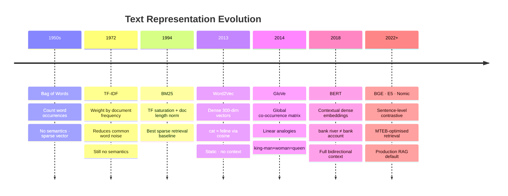

# 02 — Text Representations (Sparse → Dense)

## Quick Reference

| Representation | Type | Semantic? | OOV? | Dim | Best For |
|---|---|---|---|---|---|
| Bag of Words | Sparse | ❌ | ❌ (UNK) | vocab size | Fast baseline, keyword matching |
| TF-IDF | Sparse | ❌ | ❌ | vocab size | Search, IR, classical ML |
| N-grams | Sparse | Partial | ❌ | vocab^n | Short context capture |
| Word2Vec | Dense | ✅ | ❌ | 100-300 | Semantic similarity, feature input |
| GloVe | Dense | ✅ | ❌ | 50-300 | Similar to Word2Vec |
| BERT embeddings | Dense, contextual | ✅ ✅ | ✅ (subword) | 768-1024 | SOTA for most tasks |

---



## 1. Bag of Words (BoW)

### How It Works

```
1. Build vocabulary of all unique words across corpus
2. Each document = vector of word counts, length = vocab size

Corpus:
  Doc1: "I love NLP"
  Doc2: "I love AI"
  Doc3: "NLP and AI are related"

Vocabulary: [ai, and, are, i, love, nlp, related]

Doc1 = [0, 0, 0, 1, 1, 1, 0]
Doc2 = [1, 0, 0, 1, 1, 0, 0]
Doc3 = [1, 1, 1, 0, 0, 1, 1]
```

```python
from sklearn.feature_extraction.text import CountVectorizer

docs = ["I love NLP", "I love AI", "NLP and AI are related"]
vectorizer = CountVectorizer()
X = vectorizer.fit_transform(docs)  # sparse matrix [3, 7]

print(vectorizer.get_feature_names_out())
# ['ai', 'and', 'are', 'i', 'love', 'nlp', 'related']

print(X.toarray())
# [[0 0 0 1 1 1 0]
#  [1 0 0 1 1 0 0]
#  [1 1 1 0 0 1 1]]

# Binary BoW (presence/absence, not count)
bin_vectorizer = CountVectorizer(binary=True)

# With n-grams
ngram_vectorizer = CountVectorizer(ngram_range=(1, 2), max_features=10000)
```

### Properties

```
✅ Simple, interpretable — each dimension is a word
✅ Works on any language with whitespace tokenization
✅ Sparse — efficient storage (scipy sparse matrix)

❌ Ignores word order: "dog bites man" = "man bites dog"
❌ No semantics: "good" and "excellent" have zero similarity
❌ High dimensional: vocab size = 10K-100K
❌ OOV: unseen words dropped
```

---

## 2. TF-IDF

### Formulas

```
TF(t, d)    = count(t in d) / total_words(d)
              [how often t appears in this document]

IDF(t)      = log(N / df(t))
              [how rare t is across all documents]
              N = total docs, df(t) = docs containing t

TF-IDF(t,d) = TF(t,d) × IDF(t)
```

### Numeric Example

```
Corpus: 3 documents
"the cat sat" / "the dog ran" / "cat and dog"

Word "the":  appears in 2/3 docs → IDF = log(3/2) = 0.41 (low — common)
Word "sat":  appears in 1/3 docs → IDF = log(3/1) = 1.10 (high — rare)
Word "and":  appears in 2/3 docs → IDF = log(3/2) = 0.41

Doc1 TF-IDF for "sat" = (1/3) × 1.10 = 0.37  → uniquely characterizes Doc1
Doc1 TF-IDF for "the" = (1/3) × 0.41 = 0.14  → less characteristic
```

```python
from sklearn.feature_extraction.text import TfidfVectorizer
import numpy as np

docs = [
    "the quick brown fox",
    "the fox jumped over the lazy dog",
    "the lazy brown dog"
]

tfidf = TfidfVectorizer(
    max_features=10000,
    ngram_range=(1, 2),         # unigrams + bigrams
    min_df=2,                   # ignore terms in < 2 docs
    max_df=0.95,                # ignore terms in > 95% docs (stop words)
    sublinear_tf=True,          # use 1 + log(tf) instead of tf (reduces effect of frequency)
    analyzer='word',
    strip_accents='unicode'
)
X_train = tfidf.fit_transform(train_docs)  # fit only on train
X_test  = tfidf.transform(test_docs)       # transform test with train vocab

# Top features per document
def top_tfidf_features(row, feature_names, n=5):
    top_ids = np.argsort(row.toarray()[0])[-n:][::-1]
    return [(feature_names[i], row[0, i]) for i in top_ids]

feature_names = tfidf.get_feature_names_out()
print(top_tfidf_features(X_train[0], feature_names))
```

### IDF Variants

```python
# Smoothed IDF (sklearn default): log((1+N)/(1+df)) + 1
# Prevents zero for terms in all documents

# BM25 (better than TF-IDF for search/IR)
from rank_bm25 import BM25Okapi
tokenized_corpus = [doc.split() for doc in docs]
bm25 = BM25Okapi(tokenized_corpus)
scores = bm25.get_scores("fox jumped".split())  # query scoring
```

**BM25 vs TF-IDF:**
```
TF-IDF: TF grows linearly with frequency
BM25:   TF saturates (diminishing returns for repeating words)
        Also accounts for document length normalization
        BM25 is the standard in search engines (Elasticsearch default)
```

---

## 3. N-grams

### Types

```python
# Unigram (1-gram): "I", "love", "NLP"
# Bigram  (2-gram): "I love", "love NLP"
# Trigram (3-gram): "I love NLP"

"not good":
  Unigrams: ["not", "good"]     → BoW misses negation
  Bigrams:  ["not good"]        → captures negation!
```

### N-gram Language Model (Statistical)

```
Markov assumption: P(w_n | w_1,...,w_{n-1}) ≈ P(w_n | w_{n-k},...,w_{n-1})

Bigram: P(word | previous_word) = count(prev, word) / count(prev)

Example:
P("dog" | "the") = count("the dog") / count("the") = 15/100 = 0.15
P("cat" | "the") = count("the cat") / count("the") = 20/100 = 0.20

Smoothing (handle zero counts):
Laplace: add 1 to all counts
Add-k: add k (k < 1, like 0.01)
Kneser-Ney: best for language models
```

```python
from sklearn.feature_extraction.text import CountVectorizer, TfidfVectorizer

# Bigrams only
bigram_vec = CountVectorizer(ngram_range=(2, 2))

# Unigrams + bigrams (most common)
combo_vec = TfidfVectorizer(ngram_range=(1, 2), max_features=50000)

# Character n-grams (useful for: typos, morphology, short texts)
char_vec = TfidfVectorizer(analyzer='char_wb', ngram_range=(3, 5), max_features=50000)
# char_wb: word-boundary aware character n-grams (better than char)
```

Character n-grams for robustness: `"running"` → `['run', 'unn', 'nni', 'nin', 'ing']` — handles typos ("runing" shares most trigrams with "running"). Useful for: noisy text, OCR output, social media.

---

## 4. Sparse vs Dense Comparison

```
Sparse (BoW / TF-IDF):
  Dimension: 10K-100K (vocab size)
  Values: mostly zeros (99%+ sparse)
  Semantic: ZERO — "king" and "queen" have zero cosine similarity
  Storage: scipy sparse matrix (efficient)
  Training data: works with small data (few hundred docs)

Dense (Word2Vec / GloVe / BERT):
  Dimension: 100-1024
  Values: all non-zero real numbers
  Semantic: YES — similar words close in embedding space
  Storage: requires storing embedding matrix
  Training data: needs large corpus (millions of docs)
```

### Cosine Similarity

The standard metric for comparing text representations.

```
cos(A, B) = (A · B) / (||A|| × ||B||)  ∈ [-1, 1]

Sparse: "cat" and "feline" → cos = 0.0 (completely different vectors)
Dense (Word2Vec): "cat" and "feline" → cos ≈ 0.85 (semantically similar)
Dense (BERT): "bank" (river) and "bank" (finance) → different vectors! (contextual)
```

```python
from sklearn.metrics.pairwise import cosine_similarity
import numpy as np

# TF-IDF similarity
tfidf = TfidfVectorizer()
X = tfidf.fit_transform(["cat sat on mat", "feline rested on rug", "dog ran fast"])
print(cosine_similarity(X[0], X[1]))  # ≈ 0.0 (no shared words)
print(cosine_similarity(X[0], X[2]))  # ≈ 0.0 (no shared words)

# Word2Vec similarity — would show cat≈feline > cat≈dog
```

---

## 5. When to Use What

| Use Case | Representation | Why |
|---|---|---|
| Fast baseline classification | TF-IDF + LogReg | 5 min to implement, competitive |
| Search / information retrieval | BM25 or TF-IDF | Standard for keyword matching |
| Semantic similarity | Word2Vec / GloVe / BERT embeddings | Captures meaning |
| Short text classification | TF-IDF + char n-grams | Sparse text needs char-level features |
| Production accuracy | BERT fine-tuned | SOTA for classification, NER, QA |
| Low resource (small data) | TF-IDF | Dense embeddings need data |
| Domain-specific vocabulary | TF-IDF + custom vocab | Control over features |
| Negation handling in classical ML | Bigrams | "not good" as single feature |

---

## 6. Practical Pipeline — TF-IDF vs BERT Comparison

```python
import numpy as np
from sklearn.linear_model import LogisticRegression
from sklearn.pipeline import Pipeline
from sklearn.feature_extraction.text import TfidfVectorizer
from sklearn.model_selection import cross_val_score
from transformers import AutoTokenizer, AutoModel
import torch

# --- TF-IDF Pipeline (baseline) ---
tfidf_pipeline = Pipeline([
    ('tfidf', TfidfVectorizer(ngram_range=(1,2), max_features=50000, sublinear_tf=True)),
    ('clf', LogisticRegression(C=1, max_iter=1000))
])
cv_tfidf = cross_val_score(tfidf_pipeline, X_train, y_train, cv=5, scoring='f1_macro')
print(f"TF-IDF F1: {cv_tfidf.mean():.3f}")

# --- BERT Feature Extraction (stronger) ---
tokenizer = AutoTokenizer.from_pretrained('bert-base-uncased')
model = AutoModel.from_pretrained('bert-base-uncased')
model.eval()

def get_bert_embeddings(texts, batch_size=32):
    all_embeddings = []
    for i in range(0, len(texts), batch_size):
        batch = tokenizer(
            texts[i:i+batch_size],
            padding=True, truncation=True,
            max_length=128, return_tensors='pt'
        )
        with torch.no_grad():
            output = model(**batch)
            # CLS token embedding as sentence representation
            embeddings = output.last_hidden_state[:, 0, :].numpy()
            all_embeddings.append(embeddings)
    return np.vstack(all_embeddings)

X_bert = get_bert_embeddings(X_train)
clf_bert = LogisticRegression(C=1.0, max_iter=1000)
cv_bert = cross_val_score(clf_bert, X_bert, y_train, cv=5, scoring='f1_macro')
print(f"BERT+LogReg F1: {cv_bert.mean():.3f}")
```

---

## 7. Gotchas

**TF-IDF must be fit on training data only.** Fitting on full dataset leaks document frequency statistics to test set. Use `fit_transform(X_train)` and `transform(X_test)` separately. Inside cross-validation, always put TfidfVectorizer inside a Pipeline so it's re-fit on each fold's training data.

**`max_df` removes domain-specific terms that appear everywhere.** Setting `max_df=0.95` removes terms in >95% of docs. If your corpus is all medical notes, "patient" appears in 99% — removed. Adjust `max_df` based on your domain.

**Sparse matrix operations — don't convert to dense unnecessarily.** `X.toarray()` on a 100K×50K matrix → 5GB of RAM. Keep sparse: sklearn's LogisticRegression, SVM, and Naive Bayes all accept sparse matrices natively.

**N-gram explosion with high N.** Bigrams: V² potential features. Trigrams: V³. Always set `max_features` limit. For character n-grams with n=5: can easily hit millions of features without cap.

**TF-IDF doesn't help when vocabulary doesn't overlap.** If train and test come from different distributions (domain shift), TF-IDF collapses — all test terms might map to zeros if they weren't in training vocab. This is why dense embeddings (Word2Vec, BERT) generalize better across domains.

---

## 8. Debugging Guide

| Symptom | Likely Cause | Fix |
|---|---|---|
| TF-IDF model perfect on train, bad on test | Leakage — fit on all data | Fit vectorizer only on X_train |
| High-dim TF-IDF causes OOM | max_features not set | Set max_features=50000 |
| Important domain terms have low TF-IDF | High df (appears everywhere) | Increase max_df; use custom IDF weights |
| Bigrams not capturing negation | min_df too high, rare bigrams removed | Reduce min_df; keep more features |
| cosine_similarity returns ~0 for related docs | Different vocabulary (test OOV) | Use dense embeddings instead |
| Sparse matrix conversion crashes | .toarray() on huge matrix | Keep sparse; use sparse-compatible models |

---

## 9. Interview Q&A (Senior Level)

**Q: Why does TF-IDF outperform plain BoW in most tasks?**

A: BoW treats all words equally — "the" (appears 1000+ in corpus) gets same weight as "transformer" (appears 5+). TF-IDF down-weights common words (low IDF) and up-weights rare, informative words (high IDF). This reduces noise from function words and highlights domain-specific terminology. Additionally, TF normalization by document length means long documents don't dominate similarity scores. However, both fail at semantics — "cat" and "feline" still have zero cosine similarity. That's the ceiling of sparse representations.

**Q: When would you still choose TF-IDF over BERT embeddings in production?**

A: Several real scenarios: (1) Very large-scale retrieval (millions of documents) — TF-IDF with inverted index scales to billions of documents; BERT requires expensive dense vector search (FAISS). (2) Extremely low latency — TF-IDF inference is microseconds; BERT is 20-200ms. (3) Small labeled dataset (<500 examples) — BERT fine-tuning overfits; TF-IDF + LogReg often more robust. (4) Highly lexical tasks — exact keyword matching (legal document search) where TF-IDF is interpretable and auditable. (5) No GPU available in production. Pragmatic approach: start with TF-IDF baseline, measure gap vs BERT, justify BERT cost only if the gap is meaningful.

**Q: What is BM25 and why is it better than TF-IDF for search?**

A: BM25 (Best Match 25) addresses two TF-IDF limitations: (1) TF saturation — BM25 caps the TF contribution using a saturation parameter k1; if a word appears 1× or 100×, TF-IDF scales linearly, but BM25 gives diminishing returns. Mentioning "cat" 50 times doesn't mean the document is 50× more about cats. (2) Document length normalization — longer documents naturally have higher term frequencies; BM25's b parameter penalizes longer documents proportionally. These two fixes make BM25 significantly better for search/retrieval, which is why Elasticsearch and Lucene use BM25 as the default ranking function.

---

## 10. Connections

| This file | Links to | Why |
|---|---|---|
| Preprocessing before vectorization | `01_text_preprocessing.md` | Pipeline order |
| Dense embeddings (next step from sparse) | `../embeddings/01_word_embeddings.md` | Word2Vec, GloVe as alternatives |
| Modern dense embedders (BGE / E5 / Nomic / OpenAI) | `../embeddings/02_sentence_embeddings.md` | 2024-25 production retrieval default |
| TF-IDF for text classification | `../04_applications/01_text_classification.md` | Baseline classifier |
| BM25 for document retrieval | `../04_applications/03_information_extraction.md` | Retrieval before extraction |
| Hybrid retrieval (BM25 + dense via RRF) | `../embeddings/02_sentence_embeddings.md` | Beats either alone by 5-15% on BEIR |
| Sparse features in ML | `../../1.machine learning/01_fundamentals/03_feature_engineering.md` | Encoding, sparse matrices |

---

## Key Takeaway

```
Sparse → Dense evolution:
BoW (counts) → TF-IDF (weighted counts) → Word2Vec/GloVe (semantic dense) → BERT (contextual dense)

TF-IDF is still used in production for: search baselines, keyword ranking, low-latency systems,
and as a competitive baseline before justifying BERT's cost.

The ceiling of sparse representations: zero semantic similarity between synonyms. Any task
requiring understanding of meaning (paraphrase detection, semantic search, QA) needs dense embeddings.

For interviews: "My default for any new NLP task: start with TF-IDF + LogReg as baseline in 10 minutes,
then compare to fine-tuned BERT. The gap tells me whether the task is lexical (TF-IDF wins) or
semantic (BERT wins)."
```
