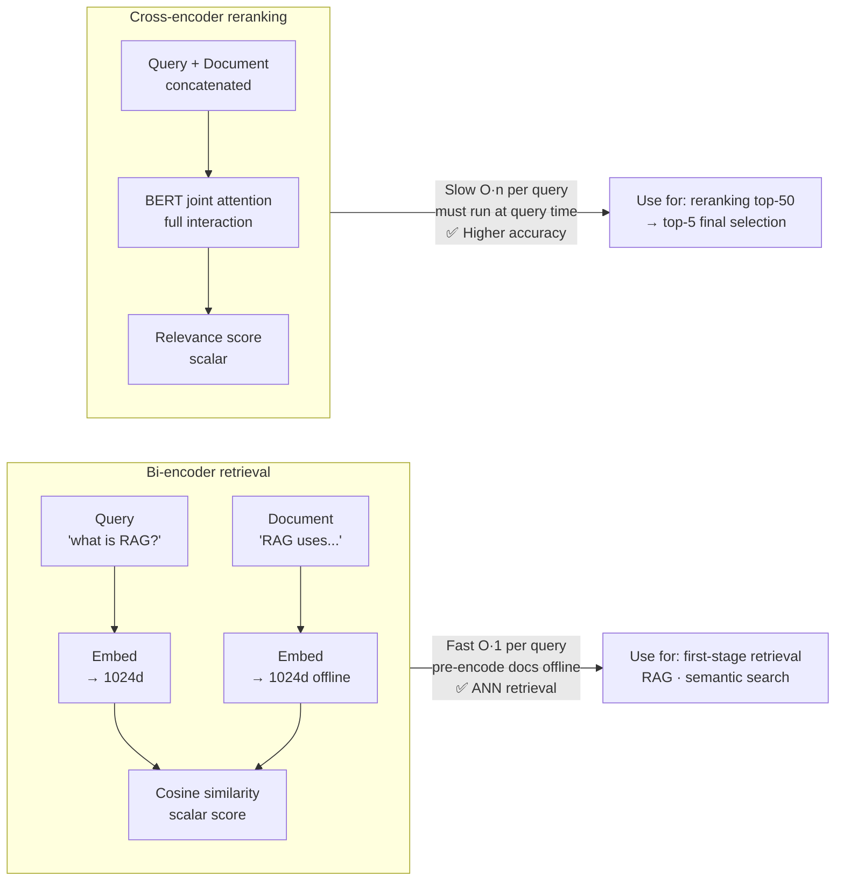

# 02 — Sentence Embeddings

> Word embeddings (Word2Vec, GloVe) produce a vector per **token**. Sentence embeddings produce a single vector for an **entire sentence** — capturing meaning at the utterance level for tasks like semantic search, clustering, STS, and RAG retrieval.

---

## Methods Overview

| Method | How | Output dim | Speed | Quality |
|---|---|---|---|---|
| Mean pooling (Word2Vec) | Average token vectors | 300 | Very fast | Poor (ignores word order) |
| [CLS] token (BERT) | First token after fine-tuning | 768 | Fast | OK for NLI, poor for STS |
| SBERT (bi-encoder) | Mean pool with contrastive fine-tuning | 384–768 | Fast | Good for STS, retrieval |
| Cross-encoder | Full attention between sentence pair | scalar | Slow | Best for reranking |
| text-embedding-3-small/large (OpenAI) | API: matryoshka dims (truncate-able) | 1536 / 3072 | API latency | Strong general purpose |

---



## 2024-2025 SOTA Open Embedders (MTEB Leaderboard)

These have largely replaced legacy SBERT models as the production default for retrieval:

| Model | Year | Dim | Notes |
|---|---|---|---|
| BGE-small/base/large (BAAI) | 2023 | 384/768/1024 | Contrastive + instruction-tuned; **bge-large-en-v1.5** is a strong default open model |
| E5-small/base/large/Mistral-7B | 2022–24 | 384–4096 | "query:" / "passage:" instruction prefixes; e5-mistral-7b-instruct tops many leaderboards |
| GTE (Alibaba) | 2023–24 | 768/1024 | General Text Embedding; gte-large-en-v1.5 strong on retrieval |
| Nomic Embed v1/v1.5 | 2024 | 768 | Open weights + open training data; matryoshka |
| mxbai-embed-large (Mixbread) | 2024 | 1024 | Strong on classification; Apache-2 license |
| jina-embeddings-v3 | 2024 | 1024 | Multilingual; multiple task-specific LoRA adapters in one model |
| Cohere embed-v3 | 2023 | 1024 | API: multilingual + multimodal variants |

**Senior interview answer:** "I'd default to **bge-large-en-v1.5** or **e5-mistral-7b-instruct** for English retrieval. **jina-embeddings-v3** is a strong default for multilingual. Check **MTEB leaderboard** monthly — the field churns fast. For API budgets, **OpenAI text-embedding-3-large** with truncated matryoshka dims (e.g., 1024) is a well-managed alternative."

**Matryoshka embeddings** (2024): embeddings trained such that **truncated prefixes** of the vector are themselves valid embeddings. Lets you trade off quality vs storage at inference time without retraining. text-embedding-3, Nomic, and Mixbread all support this.

---

## Rerankers — The Other Half of Modern Retrieval

Bi-encoder gives you the candidate set (fast). A **reranker** (cross-encoder) reorders the top-50 by joint scoring. Standard production pattern: retrieve 50-100 with embedding → rerank to top-5 with cross-encoder.

| Reranker | Year | Notes |
|---|---|---|
| bge-reranker-base/large/v2-m3 | 2024 | Open, multilingual, strong |
| mxbai-rerank-large | 2024 | Open weights |
| jina-reranker-v2-base-multilingual | 2024 | Open, multilingual |
| Cohere Rerank v3 / v3.5 | 2023–24 | API; very strong |
| Voyage rerank-2 / rerank-lite-1 | 2024 | API |
| ColBERT v2 | 2022 | Late-interaction (per-token max-sim) — different paradigm; covered in `06_contrastive_training.md` |

**Hybrid retrieval + RRF** is the standard production stack: BM25 + dense embedding → fuse with Reciprocal Rank Fusion → rerank → top-k. Often beats either approach alone by 5-15% on BEIR.

```python
# Reciprocal Rank Fusion (RRF) — combine two rankings
def rrf(rankings: dict[str, list[tuple[str, float]]], k: int = 60) -> list[tuple[str, float]]:
    scores = {}
    for ranker_name, doc_ids in rankings.items():
        for rank, doc_id in enumerate(doc_ids):
            scores[doc_id] = scores.get(doc_id, 0) + 1 / (k + rank + 1)
    return sorted(scores.items(), key=lambda x: -x[1])

fused = rrf({"bm25": bm25_topk, "dense": dense_topk}, k=60)
```

---

## Mean Pooling (Simple Baseline)

Average the last hidden states of a BERT-style model across all non-padding tokens:

```python
import torch
from transformers import AutoTokenizer, AutoModel

tokenizer = AutoTokenizer.from_pretrained("bert-base-uncased")
model = AutoModel.from_pretrained("bert-base-uncased")

def mean_pool(sentence: str) -> torch.Tensor:
    enc = tokenizer(sentence, return_tensors="pt", truncation=True, max_length=512)
    with torch.no_grad():
        out = model(**enc)
    # out.last_hidden_state: [1, seq_len, 768]
    mask = enc["attention_mask"].unsqueeze(-1).float()   # [1, seq_len, 1]
    vecs = out.last_hidden_state * mask                  # zero out padding
    return vecs.sum(1) / mask.sum(1)                     # [1, 768]
```

**Problem:** BERT trained on MLM, not for semantic similarity. CLS and mean pool give poor cosine similarity on STS benchmarks without fine-tuning.

---

## SBERT (Sentence-BERT) — The Standard

Fine-tunes BERT with a **siamese network** on NLI (contradiction/neutral/entailment) + STS data using **multiple negatives ranking loss** or **cosine similarity loss**.

### Architecture

```
Sentence A = BERT + mean pool + u  (768-dim)
Sentence B = BERT + mean pool + v  (768-dim)

Training objective (NLI cosine loss):
  score = cosine(u, v)
  loss  = MSE(score, gold_similarity)   # gold ∈ [0, 1]
```

**MNR: Multiple Negatives Ranking (MNR) loss** (better for retrieval):
For batch of (query, positive) pairs + all other positives in batch = negatives:
```
L = -log [exp(cos(q,p)/τ) / Σ exp(cos(q,nᵢ)/τ)]
```

```python
from sentence_transformers import SentenceTransformer

model = SentenceTransformer("all-MiniLM-L6-v2")   # 22M params, 384-dim, fast

sentences = [
    "The cat sat on the mat.",
    "A cat is resting on a rug.",
    "Dogs are loyal animals.",
]
embeddings = model.encode(sentences, normalize_embeddings=True)
# embeddings: np.ndarray [3, 384]

# Cosine similarity (since normalized, dot product = cosine)
import numpy as np
sim_matrix = embeddings @ embeddings.T
# [[1.00, 0.87, 0.21],
#  [0.87, 1.00, 0.19],
#  [0.21, 0.19, 1.00]]
```

Sentences 0 and 1 (same meaning, different words) → cos = 0.87. Sentence 2 (different topic) → cos = 0.21.

---

## Popular SBERT Models

| Model | Params | Dim | Speed (CPU) | Best for |
|---|---|---|---|---|
| all-MiniLM-L6-v2 | 22M | 384 | ~14K sent/s | General retrieval, fast inference |
| all-mpnet-base-v2 | 109M | 768 | ~2.8K sent/s | Best quality general purpose |
| multi-qa-MiniLM-L6-cos-v1 | 22M | 384 | ~14K sent/s | QA retrieval specifically |
| paraphrase-multilingual-MiniLM-L12-v2 | 118M | 384 | ~7.5K sent/s | 50+ languages |

---

## Dry Run — Similarity Computation

**Task:** Rank these passages for the query "how do transformers handle long sequences?"

```
Query:  "how do transformers handle long sequences?"
Doc A:  "transformers use sliding window attention for long documents"
Doc B:  "BERT uses [CLS] token for sentence classification"
Doc C:  "Convolutional networks extract local features from images"
```

```python
model = SentenceTransformer("all-MiniLM-L6-v2")
query_emb  = model.encode("how do transformers handle long sequences?",
                           normalize_embeddings=True)
doc_embs   = model.encode([doc_A, doc_B, doc_C], normalize_embeddings=True)

scores = doc_embs @ query_emb   # [3]
# scores ≈ [0.73, 0.43, 0.08]
# Ranking: Doc A > Doc B > Doc C
```

Doc A wins because "sliding window attention for long documents" semantically matches "handle long sequences". Doc C (images/CNN) is near-zero.

---

## Semantic Search with FAISS

```python
import faiss
import numpy as np
from sentence_transformers import SentenceTransformer

model = SentenceTransformer("all-MiniLM-L6-v2")
corpus = ["doc1 text", "doc2 text", ...]   # N documents

# Build index (offline, once)
corpus_embs = model.encode(corpus, normalize_embeddings=True,
                            batch_size=256, show_progress_bar=True)
index = faiss.IndexFlatIP(384)   # inner product = cosine for unit vectors
index.add(corpus_embs.astype("float32"))

# Query (online, per request)
query_emb = model.encode(["user query"], normalize_embeddings=True)
D, I = index.search(query_emb.astype("float32"), k=5)
top_docs = [corpus[i] for i in I[0]]
```

**FAISS search latency:** < 5ms for 10M vectors (384-dim, IndexFlatIP).

---

## Bi-encoder vs Cross-encoder

| | Bi-encoder (SBERT) | Cross-encoder |
|---|---|---|
| How | Embed separately, cosine | Full attention on (A, B) pair |
| Output | Two vectors | Single scalar score |
| Pre-computation | Can index docs offline | Must see both at query time |
| Latency (100 docs) | < 1ms (index lookup) | ~200ms (100 forward passes) |
| Quality | Good | Best |
| Use | First-stage retrieval | Reranking top-K |

**Standard pipeline:** bi-encoder retrieves top-100 → cross-encoder reranks to top-5.

---

## Fine-tuning SBERT on Custom Data

```python
from sentence_transformers import SentenceTransformer, InputExample, losses
from torch.utils.data import DataLoader

model = SentenceTransformer("all-MiniLM-L6-v2")

# Training data: (query, positive_doc) pairs
train_examples = [
    InputExample(texts=["invoice processing", "OCR extraction from PDF invoices"]),
    InputExample(texts=["payment terms", "net 30 days payment policy"]),
    # ...
]

loader = DataLoader(train_examples, shuffle=True, batch_size=32)

# Multiple Negatives Ranking Loss: other items in batch = negatives
loss = losses.MultipleNegativesRankingLoss(model)

model.fit(train_objectives=[(loader, loss)], epochs=3, warmup_steps=100)
model.save("sbert-invoices")
```

**MNR loss works with large batch sizes** (more negatives = harder negatives = better training signal). Use batch_size=64+ when possible.

---

## Evaluation: STS Benchmarks

| Benchmark | Task | Metric |
|---|---|---|
| STS-B | Rate sentence pair similarity 0-5 | Spearman ρ |
| STS12-16 | Cross-domain sentence pairs | Spearman ρ |
| SICK-R | Relatedness in semantic inference | Spearman ρ |

```python
from sentence_transformers.evaluation import EmbeddingSimilarityEvaluator

evaluator = EmbeddingSimilarityEvaluator(
    sentences1, sentences2, scores,   # gold scores 0-1
    name="sts-b-dev"
)
result = evaluator(model)
# result: {"sts-b-dev_spearman_cosine": 0.872, ...}
```

**SBERT all-mpnet-base-v2:** STS-B Spearman = 0.863. Vanilla BERT mean-pool: 0.590.

---

## Gotchas

**Don't use BERT [CLS] without fine-tuning.** The [CLS] token is trained for next-sentence prediction, not semantic similarity. Cosine similarity on raw BERT outputs often gives near-uniform scores across semantically different sentences.

**Normalize embeddings before cosine similarity.** Without normalization, dot product ≠ cosine. Use `normalize_embeddings=True` in `model.encode()`.

**SBERT is not symmetric for asymmetric tasks.** For Q&A retrieval, use `multi-qa-*` models trained on question–answer pairs, not paraphrase models.

**Large batch_size for MNR loss.** With batch_size=16, you have only 15 negatives per query. With batch_size=128, you have 127 — much better learning signal.

---

## Interview Q&A

**Q: Why is SBERT better than BERT for semantic similarity?** BERT's [CLS] token and mean-pool without fine-tuning produce embeddings that don't correlate with semantic similarity (STS-B = 0.59). SBERT fine-tunes with a siamese setup on NLI/STS data so that semantically similar sentences live closer in the embedding space — STS-B = 0.86+. The key change is the training objective: BERT's MLM doesn't optimize for similarity structure; SBERT's contrastive/cosine loss directly does.

**Q: When do you use a cross-encoder instead of a bi-encoder?** A bi-encoder when you need pre-computable embeddings: semantic search over millions of documents (encode corpus offline, search at query time in < 5ms). Cross-encoder when quality matters more than speed: reranking top-K candidates, where you can afford 100-200ms. Standard pipeline: bi-encoder retrieves top-100, cross-encoder reranks to top-5.

**Q: How does Multiple Negatives Ranking Loss work?** For a batch of (query, positive) pairs, each query's positives in the batch become negatives for other queries. Loss = cross-entropy where the positive sets score exp(cos(q,p)/τ) and the negative sum is Σ exp(cos(q,nᵢ)/τ). With batch_size=64, each query has 63 negatives — no need to manually label negatives. Larger batch → harder negatives → better model.

---

## Connections

| Topic | File |
|---|---|
| Full SBERT dry-run with numbers | `03_sentence_embeddings_end_to_end.md` |
| Cosine similarity math | `05_semantic_similarity.md` |
| FAISS index types | `11.system_design/03_search_and_rag_system.md` |
| Cross-encoder reranking | `11.system_design/03_search_and_rag_system.md` |
| RAG with sentence embeddings | `7.rag/01b_rag_end_to_end.md` |

---

## Key Takeaway

SBERT is the standard for sentence embeddings: fine-tuned BERT + mean pooling + contrastive training. Use `all-MiniLM-L6-v2` (fast, 384-dim) for retrieval, `all-mpnet-base-v2` (slower, 768-dim) for best quality. Always normalize before cosine. Bi-encoder retrieves, cross-encoder reranks.

---

## Code Practice — Wired by Phase 6

- `code_practice/05_rag/05_reranking/` — cross-encoder two-stage pipeline
