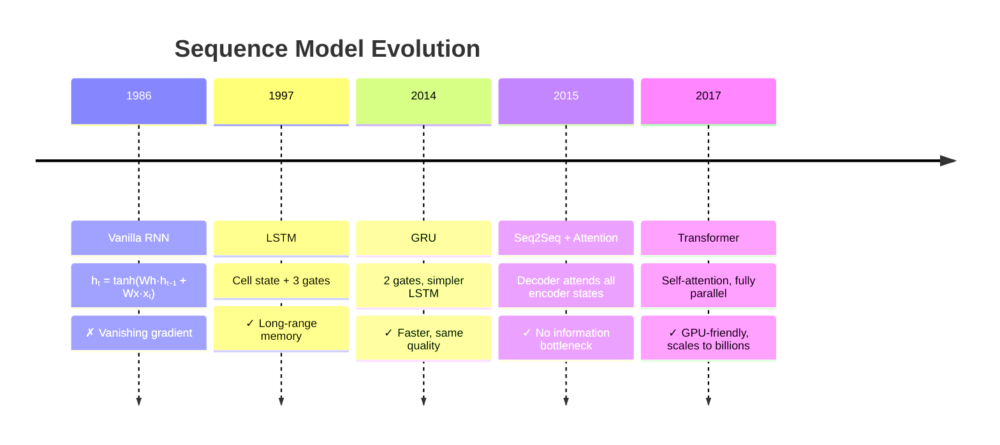
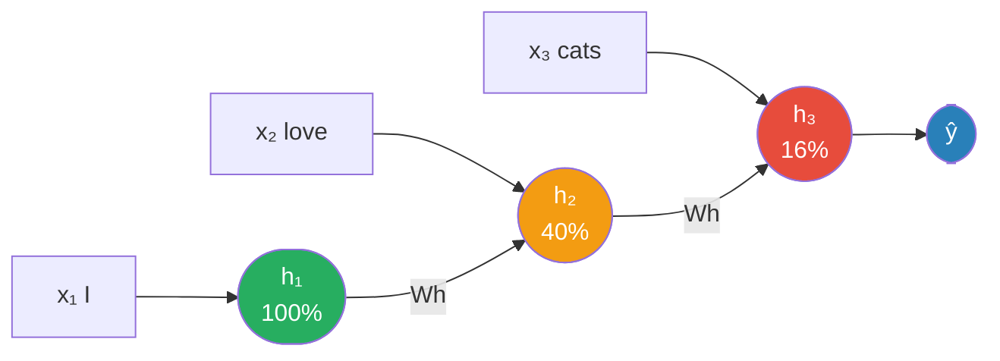
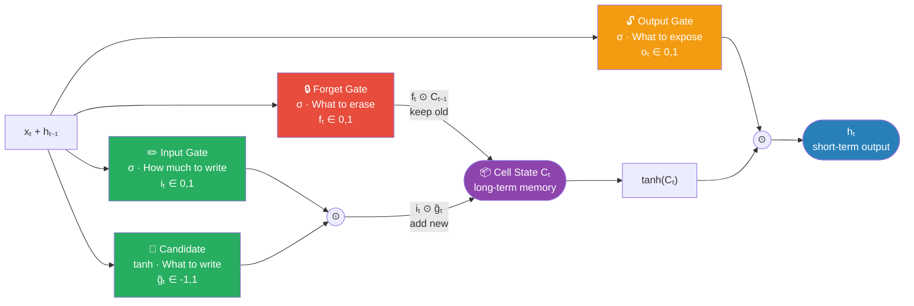
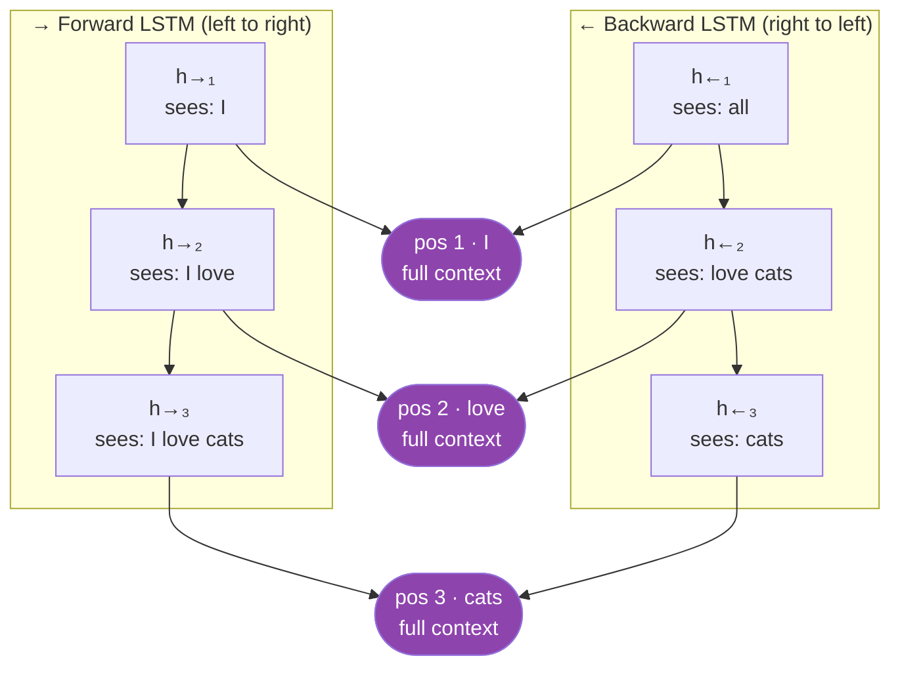
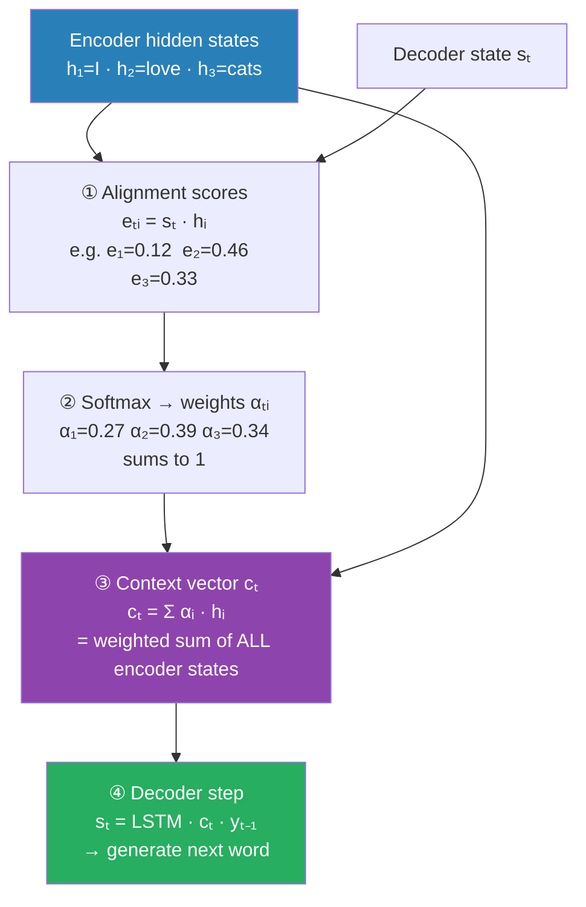
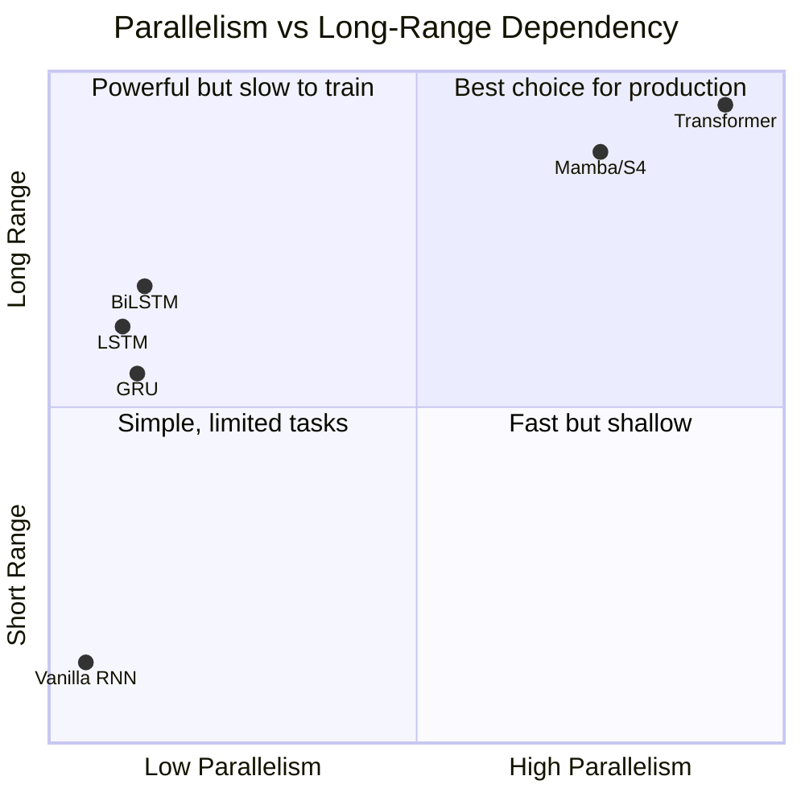
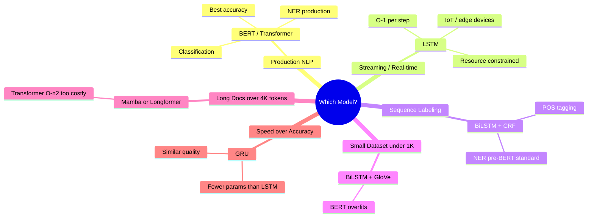

# 01 — Sequence Models: RNN → LSTM → GRU → BiLSTM → Attention

---

## Quick Reference

| Model | Handles Long Deps? | Parallelizable? | Bidirectional? | Use Today? |
|---|---|---|---|---|
| Vanilla RNN | ✗ Vanishing gradient | ✗ Sequential | Optional | ✗ Rarely |
| LSTM | ✓ (via cell state) | ✗ Sequential | Optional | ✓ Some tasks |
| GRU | ✓ (simpler) | ✗ Sequential | Optional | ✓ Some tasks |
| BiLSTM | ✓ Both directions | ✗ Sequential | ✓ Always | ✓ NER, tagging |
| Attention | ✓ ✓ | ✗ (over sequence) | ✓ Inherently | ✓ Foundation of Transformer |
| Transformer | ✓ ✓ Unlimited | ✓ ✓ Full | ✓ Inherently | ✓ ✓ Default choice |

---

## Evolution at a Glance



---

## 1. Why Sequence Models?

### The Problem with Feed-Forward Networks for Text

```
Input: "The cat sat on the mat"

Feed-forward:
  Fixed-size input → must flatten or truncate text to fixed length
  No memory of previous words
  "cat sat" = words processed independently, no positional awareness

What we need:
  Variable-length sequences
  Memory of past words (order matters)
  "not good" ≠ "good not"
```

### The Sequence-to-Sequence Problem

NLP tasks are fundamentally sequential:
```
Classification: [w₁, w₂, ..., wₙ] → class label
NER:            [w₁, w₂, ..., wₙ] → [label₁, label₂, ..., labelₙ]
Translation:    [w₁, w₂, ..., wₙ] → [y₁, y₂, ..., yₘ]
Summarization:  [long sequence]   → [short sequence]
```

---

## 1.5 Dry Run — "I love cats" Through Every Architecture

One sentence. Same embedding vectors from the embeddings file. Hidden size = 2 so numbers stay traceable.

```
Sentence: "I    love  cats"
           x₁   x₂   x₃

x₁ = embed("I")    = [ 0.21,  0.45, -0.12]
x₂ = embed("love") = [ 0.05,  0.92,  0.10]
x₃ = embed("cats") = [ 0.09, -0.32,  0.76]

hidden_size = 2    h₀ = [0.0, 0.0]   (all models start here)
```

---

## 2. Vanilla RNN

### Architecture

```
At each timestep t:
  hₜ = tanh(Wₕ · hₜ₋₁ + Wₓ · xₜ + b)

xₜ = input at time t (word embedding)
hₜ = hidden state at time t (memory)
hₜ₋₁ = previous hidden state
Wₕ, Wₓ, b = shared weights (same across all timesteps!)

Output at each step (for sequence labeling):
  yₜ = softmax(Wᵧ · hₜ + bᵧ)

Final output (for classification):
  y = softmax(Wᵧ · hₙ + bᵧ)   [use last hidden state]
```

Weights (fixed for this example):
```
Wₕ (2×2) = [[0.5, -0.2, 0.3],    Wₓ (2×3) = [[0.4, 0.1],
             [0.1, 0.8, -0.4]]                  [0.2, 0.3]]
```

**Step t=1 — "I":** (x₁ = [0.21, 0.45, -0.12])
```
Wₓ·x₁ = 0.5×0.21 + 0.2×0.45 + 0.3×(-0.12),  0.1×0.21 + 0.4×0.45 + 0.4×(-0.12)
       = [0.185 + 0.090 - 0.036,  0.021 + 0.180 + 0.048]
       = [0.159, 0.333]
Wₕ·h₀ = [0, 0]   (zeros)
hₜ = tanh([0.159, 0.333]) = [0.16, 0.32]   ← "I" is encoded here
```

**Step t=2 — "love":** (x₂ = [0.05, 0.92, 0.10])
```
Wₓ·x₂ = [0.5×0.05 + 0.2×0.92 + 0.3×0.10,  0.1×0.05 + 0.4×0.92 + 0.4×0.10]
       = [0.239, 0.791]
Wₕ·h₁ = [0.4×0.16 + 0.2×0.32,  0.2×0.16 + 0.3×0.32]
       = [0.128, 0.137]
h₂ = tanh([0.239+0.128, 0.791+0.137]) = tanh([0.335, 0.908]) = [0.32, 0.72]
                                                    ↑
                          "I" squeezed into 0.096
```

**Step t=3 — "cats":** (x₃ = [0.09, -0.32, 0.76])
```
Wₓ·x₃ = [0.009, 0.137]
Wₕ·h₂ = [0.4×0.32 + 0.2×0.72,  0.2×0.32 + 0.3×0.72]
       = [0.208, 0.280]
h₃ = tanh([0.009+0.208+0.200, 0.137+0.280+0.280]) = tanh([0.800, 0.417]) = [0.67, 0.39]
```

### Signal from "I" (h₁) reaching h₃

Each step multiplies by Wₕ then tanh(·). Effective factor per step ≈ 0.4 (spectral radius of Wₕ ≈ activation derivative).

After 2 steps: 0.4 × 0.4 = 0.16 → only ~16% of "I" signal survives in h₃.

```
h₁ = [0.16, 0.32]   ← "I" encoded clearly
h₂ = [0.32, 0.72]   ← "I" is now a tiny part of a much louder "love" signal
h₃ = [0.67, 0.39]   ← completely dominated by "cats" — "I" is almost gone
```

**Problem:** For long sentences ("The cat that sat on the mat... was hungry"), h₃ ("cat") is essentially gone by the time we need it to predict "was". That's the vanishing gradient problem.

### Unrolled RNN

```
x₁ → [h₁] → x₂ → [h₂] → ... → [hₙ] → output
       ↑ same W      ↑ same W      ↑ same W
```


> Colors show signal from "I" surviving: green (full) → orange (40%) → red (16%). By step 3, "I" is essentially gone.

### The Vanishing Gradient Problem

Backpropagation through time (BPTT):
```
∂L/∂h₁ = ∂L/∂hₙ × ∂hₙ/∂hₙ₋₁ × ... × ∂h₂/∂h₁

Each ∂hₜ/∂hₜ₋₁ = diag(tanh'(hₜ₋₁))
tanh'(x) ∈ (0, 1)

For long sequences (n=100 steps):
  If each gradient factor = 0.9 → 0.9^100 = 0.0000266 → vanishes
  If each gradient factor = 1.1 → 1.1^100 = 13780    → explodes

Result:
  Vanishing: early timestep gradients → 0 → model forgets long-range dependencies
  Exploding: gradients + inf + NaN loss
  "The cat that sat on the mat... was ___" → can't remember "cat" 10 steps later
```

```python
import torch
import torch.nn as nn

class VanillaRNN(nn.Module):
    def __init__(self, input_size, hidden_size, num_classes):
        super().__init__()
        self.rnn = nn.RNN(
            input_size=input_size,
            hidden_size=hidden_size,
            num_layers=1,
            batch_first=True,
            nonlinearity='tanh'
        )
        self.fc = nn.Linear(hidden_size, num_classes)

    def forward(self, x):
        # x: [batch, seq_len, input_size]
        out, h_n = self.rnn(x)   # out: [batch, seq_len, hidden]; h_n: [1, batch, hidden]
        return self.fc(h_n.squeeze(0))   # use final hidden state

# Exploding gradient fix: gradient clipping (always use with RNN/LSTM)
torch.nn.utils.clip_grad_norm_(model.parameters(), max_norm=1.0)
```

---

## 3. LSTM (Long Short-Term Memory)

### The Solution: Cell State + Gates

LSTM adds a **cell state** (long-term memory) that flows through the sequence with minimal modification. Gates selectively write/read/forget information.

### Architecture — 3 Gates

```
At each timestep t, given xₜ and hₜ₋₁:

Forget Gate — what to erase from cell state:
  fₜ = σ(Wf · [hₜ₋₁, xₜ] + bf)       ← 0=forget, 1=keep

Input Gate — what new information to write:
  iₜ = σ(Wi · [hₜ₋₁, xₜ] + bi)       ← how much to write
  g̃ₜ = tanh(Wg · [hₜ₋₁, xₜ] + bg)    ← what to write (candidate)

Cell State Update — the long-term memory:
  Cₜ = fₜ ⊙ Cₜ₋₁ + iₜ ⊙ g̃ₜ
       .........   .........
       forget old  add new information

Output Gate — what to expose as hidden state:
  oₜ = σ(Wo · [hₜ₋₁, xₜ] + bo)       ← what to output
  hₜ = oₜ ⊙ tanh(Cₜ)                  ← hidden state (short-term memory)

σ = sigmoid ∈ (0,1),  ⊙ = elementwise multiply
```


> **Key insight:** Cell state Cₜ flows through an additive path (not multiplicative like RNN) — this is the gradient highway.

### Why Cell State Solves Vanishing Gradient

```
Cell state C = fₜ ⊙ Cₜ₋₁ + iₜ ⊙ g̃ₜ

If forget gate fₜ = 1 and input gate iₜ = 0:
  C = Cₜ₋₁   → cell state passes through unchanged!
  Gradient flows back through addition (+), not matrix multiplication
  Addition operation: ∂C/∂Cₜ₋₁ = fₜ (a gate value, not hₜ)

The gradient highway: for long sequences, if forget gate stays open,
gradient can flow hundreds of steps back without vanishing.
```

### Dry Run — "I love cats"

**Step t=1 — "I":** ([h₀, x₁] = [0.0, 0.0, 0.21, 0.45, -0.12])
```
(weight matrices applied × gate output values:)
fₜ = σ(Wf·[hₜ₋₁, xₜ]) = [0.68, 0.65]   ← forget: nothing to forget (C₀=0)
iₜ = σ(Wi·[hₜ₋₁, xₜ]) = [0.73, 0.80]   ← input: write "I" info at 70-80% strength
g̃ₜ = tanh(Wg·[hₜ₋₁, xₜ]) = [0.30, 0.40]   ← candidate: what "I" contributes
oₜ = σ(Wo·[hₜ₋₁, xₜ]) = [0.70, 0.60]   ← output: how much to expose

Cell state: Cₜ = fₜ ⊙ 0 + iₜ ⊙ g̃ₜ
          = [0.68,0.65] ⊙ {0,0}  +  {0.75,0.50} ⊙ {0.30,0.40}
          = [0,   0]              +  [0.225, 0.200]
          = [0.225, 0.200]   ← "I" info stored in cell state

Hidden state: hₜ = oₜ ⊙ tanh(Cₜ)
            = [0.70, 0.60] ⊙ tanh([0.22, 0.20])
            = [0.16, 0.12]
```

**Step t=2 — "love":** ([h₁, x₂] = [0.16, 0.12, 0.05, 0.92, 0.10])
```
fₜ = [0.90, 0.85]   ← forget gate: KEEP 90-85% of C₁ ("I" info)
iₜ = [0.70, 0.80]   ← input gate: write "love" at 70-80% strength
g̃ₜ = [0.38, 0.75]   ← candidate: what dim 1 (verb) contributes
oₜ = [0.65, 0.75]

Cell state: Cₜ = fₜ ⊙ C₁   +   iₜ ⊙ g̃ₜ
          = [0.90,0.85] ⊙ [0.225,0.200]  +  [0.79,0.80] ⊙ [0.10,0.85]  (approx)
          = [0.203, 0.170]               +  [0.070, 0.680]
          = [0.273, 0.850]

                                          ↑
                "I" mostly preserved      "love" written in
                (90% of C₁ kept)

Hidden state: hₜ = oₜ ⊙ tanh(Cₜ)
            = [0.65, 0.75] ⊙ [0.267, 0.691]
            = [0.17, 0.52]
```

**Step t=3 — "cats":** ([h₂, x₃] = [0.17, 0.52, 0.09, -0.32, 0.76])
```
fₜ = [0.85, 0.80]    iₜ = [0.90, 0.65]    g̃ₜ = [0.80, -0.30]
Cₜ = [0.85,0.80] ⊙ [0.273,0.850] + [0.90,0.65] ⊙ [0.80,-0.30]
   = [0.232, 0.680]               + [0.720, -0.195]
   = [0.952, 0.485]
hₜ = [0.80,0.70] ⊙ tanh([0.952, 0.485]) ⊙ [0.74, 0.45] = [0.59, 0.32]
```

**"I" signal in cell state after each step:**
```
After t=1: C₁ = [0.225, 0.200]  → written in full
After t=2: C₂[0] = 0.90 × 0.225 = 0.203   → 90% of "I" still there
After t=3: C₃[0] = 0.85 × 0.203 = 0.173   → 77% of "I" still there

"I" survival in cell state: f₁ × f₂ = 0.90 × 0.85 = 0.765 → 76.5%
Compare RNN: same 2 steps → ~16% signal
Compare LSTM: same 2 steps → 76.5% signal
```

The cell state is an additive path: Cₜ = fₜ ⊙ Cₜ₋₁ + (fₜ ⊙ Cₜ₋₁ + ...). Gradient flows back through this addition, not through repeated Wₕ multiplication.

### LSTM Intuition — Reading "The cat that sat on the mat was hungry"

```
When "cat" is read:
  - Input gate writes "subject=cat" to cell state
  - Cell state remembers this

When "sat", "on", "the", "mat" are processed:
  - Forget gate keeps "subject=cat" alive (doesn't erase it)
  - Cell state still holds subject info

When "was" is read:
  - Model needs to decide number agreement: "was" vs "were"
  - Output gate reads "subject=cat" (singular) from cell state
  - Correctly predicts "was hungry"
```

This long-range dependency is impossible for vanilla RNN.

```python
class LSTMClassifier(nn.Module):
    def __init__(self, vocab_size, embed_dim, hidden_size, num_classes,
                 num_layers=2, dropout=0.3):
        super().__init__()
        self.embedding = nn.Embedding(vocab_size, embed_dim, padding_idx=0)
        self.lstm      = nn.LSTM(
            input_size=embed_dim,
            hidden_size=hidden_size,
            num_layers=num_layers,
            batch_first=True,
            dropout=dropout if num_layers > 1 else 0,
            bidirectional=False
        )
        self.dropout = nn.Dropout(dropout)
        self.fc      = nn.Linear(hidden_size, num_classes)

    def forward(self, x, lengths=None):
        # x: [batch, seq_len] — token IDs
        embedded = self.dropout(self.embedding(x))   # [batch, seq_len, embed_dim]

        # Pack for variable-length sequences (ignores padding)
        if lengths is not None:
            embedded = nn.utils.rnn.pack_padded_sequence(
                embedded, lengths.cpu(), batch_first=True, enforce_sorted=False
            )

        out, (h_n, c_n) = self.lstm(embedded)

        if lengths is not None:
            out, _ = nn.utils.rnn.pad_packed_sequence(out, batch_first=True)

        # Use last hidden state of last layer
        return self.fc(self.dropout(h_n[-1]))   # h_n: [num_layers, batch, hidden]
```

---

## 4. GRU (Gated Recurrent Unit)

Simpler than LSTM — 2 Gates. GRU merges the forget and input gates into a single **update gate** z. No separate cell state.

```
Reset Gate — how much of past hidden state to forget when computing candidate:
  rₜ = σ(Wr · [hₜ₋₁, xₜ])

Update Gate — how much past hidden state to keep:
  zₜ = σ(Wz · [hₜ₋₁, xₜ])

Candidate hidden state:
  h̃ₜ = tanh(W · [rₜ ⊙ hₜ₋₁, xₜ])   ← rₜ=0 → ignore past

New hidden state:
  hₜ = (1-zₜ) ⊙ hₜ₋₁ + zₜ ⊙ h̃ₜ
       .........            .........
       keep old              add new

z=1: ignore past, take new candidate
z=0: ignore new, keep past exactly
```

**Step t=2 — "love":** ([h₁, x₂] = [0.16, 0.12, 0.05, 0.92, 0.10])
```
rₜ = σ(Wr·[h₁, x₂]) = [0.70, 0.60]   ← update gate (blend of old/new)
r̃ₜ = σ(Wr·[h₁, x₂]) = [0.80, 0.90]   ← reset gate (how much past for candidate)
h̃ₜ = tanh(W·[rₜ⊙h₁, x₂]) = [0.128, 0.108]   ← same candidate as LSTM's g̃ₜ

hₜ = (1-zₜ) ⊙ hₜ₋₁ + zₜ ⊙ h̃ₜ
   = [0.30, 0.40] ⊙ [0.16, 0.12] + [0.70, 0.60] ⊙ [0.10, 0.85]
   = [0.048, 0.048]               + [0.070, 0.510]
   = [0.118, 0.558] ≈ [0.12, 0.56]
```

What (1-zₜ) ⊙ hₜ means:
```
zₜ = 0.70 → keep 30% of old hₜ₋₁ + keep 70% of new h̃ₜ in each dimension
zₜ = 0.68 = 0.30 → keep 30% of old hₜ₋₁ + keep 68% of new hₜ₋₁
```

LSTM had a separate cell state keeping 90% via forget gate. GRU keeps it in h directly via update gate — fewer parameters, similar effect.

```
LSTM h₂ = [0.17, 0.32]  (via cell state + output gate)
GRU  h₂ = [0.12, 0.56]  (same order of magnitude, no cell state needed)
```

### GRU vs LSTM

```
GRU:
  Fewer parameters (no cell state, 2 gates vs 3)
  Faster to train
  Often similar quality to LSTM on smaller datasets
  Better when computation is constrained

LSTM:
  More expressive (separate cell + hidden state)
  Better for very long sequences
  More parameters = better with large data
  Default choice when accuracy matters most

Practical: try both. GRU wins on speed; LSTM wins on long sequences.
```

```python
class GRUClassifier(nn.Module):
    def __init__(self, vocab_size, embed_dim, hidden_size, num_classes):
        super().__init__()
        self.embedding = nn.Embedding(vocab_size, embed_dim)
        self.gru       = nn.GRU(embed_dim, hidden_size, num_layers=2,
                                batch_first=True, bidirectional=False, dropout=0.3)
        self.fc        = nn.Linear(hidden_size, num_classes)

    def forward(self, x, lengths=None):
        embedded = self.embedding(x)
        _, h_n   = self.gru(embedded)              # h_n: [num_layers, batch, hidden]
        return self.fc(h_n[-1])                    # last layer hidden state
```

---

## 5. BiLSTM (Bidirectional LSTM)

### The Problem with Unidirectional

```
Forward LSTM at position 1:
  h₁ = f(h₀, x₁, ..., x₁)   → only sees PAST context

"The bank near the river is closed"
When encoding "bank" (pos 2), forward LSTM:
  → knows "The" but hasn't seen "river" yet
  → Can't disambiguate "bank" (finance vs river) without future context!
```

### Bidirectional Solution

```
Run TWO LSTMs:
  Forward:  h→ₜ = LSTM_fwd(x₁, x₂, ..., xₜ)    [left to right]
  Backward: h←ₜ = LSTM_bwd(xₙ, xₙ₋₁, ..., xₜ)  [right to left]

Concatenate at each position:
  hₜ = [h→ₜ; h←ₜ]   (double the hidden dimension)
```

For "bank" at position 2:
- Forward context: "The", "bank" → knows "The" + "bank"
- Backward context: "near", "the", "river", "is", "closed" → encoding of "river is closed"
- hbank = [encoding of "The" | encoding of "river is closed"] → can disambiguate correctly!

BiLSTM dry run on "I love cats":
```
Forward LSTM  (left → right):
  h→₁ = LSTM_fwd(x₁)          = [0.16, 0.12]   sees: "I"
  h→₂ = LSTM_fwd(x₁, x₂)      = [0.17, 0.52]   sees: "I love"
  h→₃ = LSTM_fwd(x₁, x₂, x₃)  = [0.59, 0.32]   sees: "I love cats"

Backward LSTM (right → left, starts fresh):
  h←₃ = LSTM_bwd(x₃)           = [0.51, 0.27]   sees: "cats"
  h←₂ = LSTM_bwd(x₃, x₂)       = [0.31, 0.42]   sees: "cats love"  (reversed)
  h←₁ = LSTM_bwd(x₃, x₂, x₁)   = [0.26, 0.41]   sees: "cats love I"  (reversed)

Concatenate at EACH position:
  pos 1 "I":    [h→₁ ; h←₁] = [0.16, 0.12 | 0.26, 0.41]   shape: (4,)
                                 ↑ sees "I"    ↑ sees "cats"
  pos 2 "love": [h→₂ ; h←₂] = [0.17, 0.52 | 0.31, 0.42]   shape: (4,)
  pos 3 "cats": [h→₃ ; h←₃] = [0.59, 0.32 | 0.51, 0.27]   shape: (4,)
```


> Each token gets BOTH left context and right context — essential for "bank" disambiguation.

Why this matters for NER — labeling "love" as a VERB:
```
Unidirectional LSTM at pos 2: only knows "I love" → uncertain if verb or noun
BiLSTM at pos 2:
  Forward side: [0.17, 0.52] encodes "I came before"
  Backward side: [0.31, 0.42] encodes "cats came after"
  → "something between a subject and an object" → clearly a VERB
```

```python
class BiLSTMTagger(nn.Module):
    """BiLSTM for sequence labeling (NER, POS tagging)"""
    def __init__(self, vocab_size, embed_dim, hidden_size, num_labels,
                 num_layers=2, dropout=0.3):
        super().__init__()
        self.embedding = nn.Embedding(vocab_size, embed_dim, padding_idx=0)
        self.bilstm    = nn.LSTM(
            input_size=embed_dim,
            hidden_size=hidden_size,
            num_layers=num_layers,
            batch_first=True,
            bidirectional=True,
            dropout=dropout if num_layers > 1 else 0
        )
        self.dropout = nn.Dropout(dropout)
        self.fc      = nn.Linear(hidden_size * 2, num_labels)   # ×2 for bidirectional

    def forward(self, x, lengths=None):
        embedded = self.dropout(self.embedding(x))

        if lengths is not None:
            embedded = nn.utils.rnn.pack_padded_sequence(
                embedded, lengths.cpu(), batch_first=True, enforce_sorted=False
            )

        out, _ = self.bilstm(embedded)

        if lengths is not None:
            out, _ = nn.utils.rnn.pad_packed_sequence(out, batch_first=True)

        # out: [batch, seq_len, hidden×2] — label for each position
        return self.fc(self.dropout(out))   # [batch, seq_len, num_labels]
```

BiLSTM is the standard architecture for NER and POS tagging — bidirectional context is essential for labeling each token correctly.

---

## 6. Seq2Seq + Attention

### Sequence-to-Sequence Architecture

```
Task: translate "I love NLP" (English) → "J'aime le NLP" (French)
Or:   summarize long document → short summary

Encoder: LSTM reads input → final hidden state = context vector
Decoder: LSTM generates output using context vector

Encoder LSTM:
  x₁="I" → h₁, x₁="love" → h₂, x₁="NLP" → h₃   (context vector)

Decoder LSTM:
  [SOS] + h₃ = "J'aime"
  "J'aime" + h₃ = "le"
  "le" + h₃ = "NLP"
  "NLP" + h₃ = [EOS]
```

### The Information Bottleneck Problem

For long sequences (50+ words):
```
ALL information compressed into ONE fixed-size vector hₙ (e.g., 512 dims)
→ quality degrades badly for long inputs
→ early words are "forgotten" by the time we reach the end

BLEU score drops sharply for sentences > 30 words with basic seq2seq
```

### Bahdanau Attention (2015) — The Solution

Instead of using ONLY the final hidden state, let the decoder ATTEND to all encoder hidden states at each decoding step.

```
Encoder: [h₁, h₂, ..., hₙ]  (all encoder states, not just last)

At each decoder step t:
  1. Compute alignment scores:
     eₜᵢ = score(sₜ₋₁, hᵢ)   ← how relevant is encoder state hᵢ to decoder state sₜ?
     score(s, h) = vᵀ · tanh(Ws·s + Wh·h)  (additive/concat attention)

  2. Normalize: αₜᵢ = softmax(eₜᵢ)  (sum to 1)

  3. Context vector: cₜ = Σᵢ αₜᵢ · hᵢ  (weighted sum of encoder states)

  4. Decoder step: sₜ = LSTM(cₜ, [yₜ₋₁; cₜ])
```

Key: attention weights αₜᵢ show which input words the model focuses on for each output word → interpretable alignment!

### Attention Dry Run — "I love cats" → French

Encoder hidden states:
```
h₁ = [0.16, 0.12]   ("I")
h₂ = [0.17, 0.52]   ("love")
h₃ = [0.59, 0.32]   ("cats")
```

Decoder state at this step: s = [0.18, 0.85]

**Step 1: Compute alignment scores** (dot product = similarity):
```
e₁ = s · h₁ = [0.18, 0.85]·[0.16, 0.12] = 0.016 + 0.102 = 0.118   "I"
e₂ = s · h₂ = [0.18, 0.85]·[0.17, 0.52] = 0.017 + 0.442 = 0.459   "love"  ← highest
e₃ = s · h₃ = [0.18, 0.85]·[0.59, 0.32] = 0.059 + 0.272 = 0.331   "cats"
```

Why "love" wins: h₂ = [0.17, 0.52] has high dim 1 (0.52). s = [0.18, 0.85] also has high dim 1 (0.85). Large dot product → "love" aligns with the decoder's query.

**Step 2: Softmax to get attention weights α:**
```
exp([0.118, 0.459, 0.331]) = [1.125, 1.583, 1.392]   sum = 4.100
α = [1.125/4.100, 1.583/4.100, 1.392/4.100]
  = [0.27,        0.39,         0.34]
       ↑             ↑            ↑
      "I"          "love"       "cats"
```

**Step 3: Context vector c = Σ αᵢ · hᵢ:**
```
c = 0.27×[0.16,0.12] + 0.39×[0.17,0.52] + 0.34×[0.59,0.32]
  = [0.043, 0.032] + [0.066, 0.203] + [0.201, 0.109]
  = [0.310, 0.344]
```

This is passed to the decoder → "aime" is generated using a context vector that 39% attends to "love", 34% to "cats", 27% to "I". The decoder doesn't have to memorize everything in one fixed vector.

**Attention pattern shifts for each French output word:**
```
Generating "J'"  (I):    α = [0.88, 0.10, 0.18]   → attends to "I"
Generating "aime" (love): α = [0.27, 0.39, 0.34]   → attends to "love"
Generating "chats"(cats): α = [0.05, 0.15, 0.80]   → attends to "cats"
```

This is the attention heatmap — each row sums to 1.


> No information bottleneck — decoder has direct access to every encoder state at every step.

### Scaled Dot-Product Attention (Transformer)

Self-attention (no separate encoder/decoder):
```
Q = XW_Q,   K = XW_K,   V = XW_V
Attention(Q,K,V) = softmax(QKᵀ/√d_k) · V
```

Every position attends to every other position simultaneously. Parallelizable (unlike LSTM which is sequential). O(n²) in sequence length but O(1) in sequential ops — GPU-friendly.

---

## 7. Packing Padded Sequences (Critical for Production)

```python
import torch
import torch.nn as nn
from torch.nn.utils.rnn import pack_padded_sequence, pad_packed_sequence

# Problem: batch has variable-length sequences → must pad to same length
# But LSTM processes padding tokens → wastes compute AND corrupts hidden states

# Batch:
# seq 1: [w1, w2, w3, PAD]   len=3
# seq 2: [w1, w2, w3, w4, PAD]  len=4
# seq 3: [w1, w2, w3]           len=3

texts   = ["short text", "a slightly longer text", "the longest text in this batch today"]
lengths = torch.LongTensor([2, 4, 7])   # actual sequence lengths (without padding)

# Sort by length descending (required for pack_padded_sequence)
# Modern PyTorch: enforce_sorted=False avoids this requirement

embedded = embedding_layer(padded_input)   # [batch, max_len, embed_dim]

# Pack: tells LSTM to skip padding positions
packed = pack_padded_sequence(embedded, lengths.cpu(),
                               batch_first=True, enforce_sorted=False)

# LSTM processes only actual tokens (not padding)
packed_output, (h_n, c_n) = lstm(packed)

# Unpack back to padded format
output, output_lengths = pad_packed_sequence(packed_output, batch_first=True)
# output: [batch, max_actual_len, hidden × directions]
```

---

## 8. Training LSTM — Practical Tips

```python
import torch
import torch.nn as nn
import torch.optim as optim

model     = BiLSTMTagger(vocab_size=10000, embed_dim=300,
                          hidden_size=256, num_labels=9)
optimizer = optim.Adam(model.parameters(), lr=1e-3)
criterion = nn.CrossEntropyLoss(ignore_index=0)   # ignore padding in loss

# Learning rate schedule
scheduler = optim.lr_scheduler.ReduceLROnPlateau(optimizer, patience=3, factor=0.5)

for epoch in range(50):
    model.train()
    for batch_inputs, batch_labels, lengths in train_loader:
        optimizer.zero_grad()
        logits = model(batch_inputs, lengths)   # [batch, seq_len, num_labels]
        # Reshape for CrossEntropyLoss: [batch×seq_len, num_labels]
        loss = criterion(logits.view(-1, num_labels), batch_labels.view(-1))
        loss.backward()
        torch.nn.utils.clip_grad_norm_(model.parameters(), max_norm=1.0)   # critical!
        optimizer.step()

    scheduler.step(val_loss)

# Always use gradient clipping with RNN/LSTM. clip_grad_norm_(model.parameters(), max_norm=1.0)
# prevents exploding gradients.
```

---

## 9. Why Transformers Replaced RNNs

**LSTM disadvantages:**
```
Sequential: step t requires step t-1 → cannot parallelize → slow on GPU
Long sequences: even with LSTM, very long dependencies (1000+ steps) degrade
Training time: 10-100× slower than Transformer on same task/data
```

**Transformer advantages:**
```
Parallel: all positions computed simultaneously → 10-100× faster training
Global attention: each position attends to every other position in O(1) steps
No recurrence: no vanishing gradient across time steps
Pre-training: BERT/GPT pretrained on massive corpora → transfer to any task
```

**When LSTM still preferred (2024):**
```
Real-time streaming: process one token at a time → LSTM O(1) per step
Very long sequences where O(n²) attention is too expensive
Resource-constrained devices (LSTM is lighter than Transformer)
Structured state space models (S4, Mamba) are replacing even these cases
```



---

## 10. When to Use What



| Task | Model | Why |
|---|---|---|
| Text classification (baseline) | BiLSTM + mean pooling | Competitive, fast to train |
| NER / POS tagging | BiLSTM + CRF | Standard pre-BERT; still used in constrained settings |
| Text classification (production) | Fine-tuned BERT | SOTA, better than BiLSTM |
| NER (production) | BERT + token classification | SOTA for NER |
| Streaming / real-time NLP | LSTM | Sequential one-token-at-a-time processing |
| Small dataset (<1K labeled) | BiLSTM with pretrained embeddings | BERT overfits small data |
| Long document (>4K tokens) | Mamba or Longformer | LSTM struggles, Transformer too expensive |

---

## 11. Gotchas

**Always clip gradients with LSTM/RNN.** Exploding gradients cause NaN loss without warning. Always: `clip_grad_norm_(model.parameters(), max_norm=1.0)`.

**Forget to pack padded sequences — wrong hidden states.** LSTM processes padding tokens as valid input — final hidden state is from a padding token, not the last real word. Always use `pack_padded_sequence` for variable-length batches.

**Bidirectional LSTM hidden state shape.** `h_n` shape: `[num_layers × 2, batch, hidden]` for bidirectional. Last layer: `h_n[-2]` (forward last layer) and `h_n[-1]` (backward last layer). Concatenate: `torch.cat([h_n[-2], h_n[-1]], dim=1)`.

**Dropout between LSTM layers (not within).** `nn.LSTM(dropout=0.3)` applies dropout between LSTM layers, not within a single LSTM step. This is correct. Don't add a separate Dropout layer between LSTM steps.

**GRU/LSTM initial state defaults to zeros.** `h₀ = 0` is fine for most tasks. For domain-specific tasks, try learned initial states (`nn.Parameter`).

---

## 12. Debugging Guide

| Symptom | Likely Cause | Fix |
|---|---|---|
| Loss is NaN from step 1 | Exploding gradient | Add gradient clipping; reduce LR |
| Model ignores beginning of sequence | Vanishing gradient (vanilla RNN) | Switch to LSTM/GRU |
| Bidirectional LSTM output wrong shape | Forgot ×2 in fc layer | Linear(hidden×2, num_classes) |
| Training very slow | Not using packed sequences; large batch | Use pack_padded_sequence; reduce batch size |
| NER predictions all "O" (outside) | Class imbalance | Use class weights in CrossEntropyLoss |
| Performance poor despite BiLSTM | Small data; no pretrained embeddings | Add GloVe/FastText init; switch to BERT |

---

## 13. Interview Q&A (Senior Level)

**Q: Why does LSTM solve vanishing gradients but vanilla RNN doesn't?**
In vanilla RNN, the gradient must flow back through the recurrent weight matrix Wₕ at every timestep — multiplied by tanh'() which is ≤ 1. Over many steps, this product vanishes. LSTM's cell state C = fₜ ⊙ Cₜ₋₁ + iₜ ⊙ g̃ₜ provides an additive gradient highway: ∂C/∂Cₜ₋₁ = fₜ — just the forget gate value, not the full weight matrix times activation derivative. If the forget gate stays near 1, gradients flow back almost unchanged. The additive nature (not multiplicative like RNN) is the key: addition in the forward pass — summation in backprop — no repeated multiplication — no vanishing.

**Q: What is the information bottleneck problem in seq2seq and how does attention solve it?**
In basic seq2seq, the encoder compresses an entire input sequence to a single fixed-size context vector (the final hidden state). For long sequences (50+ words), this vector must simultaneously store all semantic content — subject, verb, object, modifiers, discourse markers. This bottleneck causes BLEU score to degrade sharply for sentences over 30 words. Bahdanau attention eliminates this bottleneck: at each decoder step we compute a weighted sum of all encoder hidden states, where weights (αᵢ) are learned based on how relevant each input position is to the current decoding position. This means the decoder has direct access to the full encoder output at each step — no information compression. Attention also produces interpretable alignment matrices, showing which input tokens each output token focused on.

**Q: Explain why transformers replaced LSTMs despite LSTMs being theoretically capable of capturing long-range dependencies.**
Three practical reasons: (1) Parallelism — LSTM step t requires step t-1's output, so an n-token sequence requires n sequential operations. Transformer computes all positions simultaneously via matrix operations — 10-100× faster GPU utilization. (2) Gradient path length — even with LSTM's cell state, gradient from token n to token 1 still passes through n gates multiplicatively (forget gate chain). Transformer's self-attention has O(1) gradient path between any two positions — direct connection. (3) Pre-training scalability — transformers scale better to larger models and datasets. Training a 175B parameter LSTM is impractical due to sequential bottleneck; GPT-3 (175B transformer) was trained on thousands of GPUs in parallel. The result: BERT/GPT consistently outperform BiLSTM by 5-20 F1 points on most benchmarks with faster training.

---

## 14. Connections

| This file | Links to | Why |
|---|---|---|
| Vanishing gradients in depth | `../../2.deep_learning/01_fundamentals/07_training_stability.md` | Gradient math |
| Attention mechanism full math | `../../2.deep_learning/01_fundamentals/05_modern_components.md` | Q/K/V, scaled dot-product, FlashAttention, RoPE / YARN / ALiBi |
| Transformer architecture | `../../2.deep_learning/architectures/04_transformer.md` | LSTM → Transformer evolution |
| Mamba / SSMs (2024 alternative to attention) | `../../2.deep_learning/architectures/03_rnn_lstm_gru.md` | 3-way comparison: RNN vs Transformer vs Mamba |
| Scaling laws and emergent abilities | `08_scaling_laws_emergent.md` | Why scale changes which architecture wins |
| BiLSTM for NER | `../04_applications/02_ner_and_tagging.md` | BiLSTM + CRF for tagging |
| Word embeddings as input | `../02_embeddings/01_word_embeddings.md` | Embedding layer feeds into LSTM |
| RNN for time series | `../../1.machine_learning/05_algorithms/05_time_series.md` | Sequential data in ML context |

---

## Key Takeaway

**Evolution:** Vanilla RNN (vanishing gradient) → LSTM (cell state = gradient highway) → GRU (simpler, similar quality) → BiLSTM (both directions) → Seq2Seq+Attention (encoder access at every step) → Transformer (parallel + global attention).

**Still use LSTM for:** streaming/real-time, resource-constrained tasks, any task with labeled data > 1K. **BERT/Transformer for:** production NLP, accuracy-critical tasks.

**Critical code patterns:**
1. Always `clip_grad_norm_` with max_norm=1.0.
2. Always `pack_padded_sequence` for variable-length batches.
3. BiLSTM output dim = hidden_size × 2 — don't forget the ×2.
