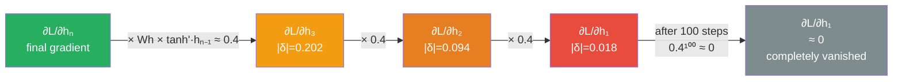

# 02 — Vanilla RNN: Complete End-to-End Walkthrough

> Embeddings are 2D vectors. Hidden state is 2D. Weights are matrices. Every matrix multiply shown row by row so nothing is hidden.

---

## 0. Problem Statement

**Task:** Binary sentence classification. **Question:** Does this sentence mention an animal?

```
Input sentence:   "cat sat on mat"
Expected output:  1  (yes, "cat" is an animal)
```

Why this task exposes RNN's weakness:
```
The answer depends on the FIRST word — "cat".
The RNN reads left to right and must carry "cat" all the way to the end.

If it forgets "cat" by the time it finishes reading,
the final hidden state won't reflect "animal present"
and the prediction will be wrong.

That is exactly what we will watch happen.
```

---

## 0.1 What Is the Input?

Raw text: "cat sat on mat"

The model cannot read strings. Three steps before the RNN sees anything:
```
Step 1 — Tokenization    split into words
Step 2 — Vocabulary lookup   map each word to an integer index
Step 3 — Embedding           map each integer to a vector
```

### Step 1 — Tokenization
```
"cat sat on mat"
 ↓ split on whitespace
["cat", "sat", "on", "mat"]
```

### Step 2 — Vocabulary Lookup
```
vocab = { "<PAD>": 0, "cat": 1, "sat": 2, "on": 3, "mat": 4, "<UNK>": 5 }

["cat", "sat", "on", "mat"]  →  [1, 2, 3, 4]

The model never sees the string "cat" again — only the integer 1.
```

### Step 3 — Embedding (2D vectors)

Embedding table E (shape: vocab_size × embed_dim = 6 × 2). Each row is a learned vector for that word index.

```
Two dimensions, each with a semantic meaning in this example:
  dim 0 = how animal-related the word is   (high for "cat", near 0 for "on")
  dim 1 = how much content the word carries (high for nouns/verbs, low for prepositions)

index 0 = [0.00, 0.00]   <PAD>
index 1 = [1.00, 0.50]   "cat"  ← very animal-related (1.0), strong content word (0.5)
index 2 = [0.20, 0.30]   "sat"  ← not animal-related, moderate content (verb)
index 3 = [0.10, 0.10]   "on"   ← not animal-related, weak content (function word)
index 4 = [0.20, 0.40]   "mat"  ← not animal-related, moderate content (object noun)
index 5 = [0.00, 0.00]   <UNK>

Lookup [1, 2, 3, 4]:
x₁ = [1.00, 0.50]   "cat"
x₂ = [0.20, 0.30]   "sat"
x₃ = [0.10, 0.10]   "on"
x₄ = [0.20, 0.40]   "mat"
```

Note: in real models (GloVe, Word2Vec) dimensions have no clean human-readable meaning. We assign meaning here only to make the forward pass story concrete. In practice: 100-300 dimensions, all learned, none interpretable individually.

---

## 0.2 What Is the Expected Output?

After reading all 4 words, the RNN produces a final hidden state h₄ (2D vector). An output layer Wy (shape: 1×2) maps h₄ → scalar prediction ŷ.

```
ŷ = Wy · h₄    (dot product = single number)

Target:
  y = 1.0   → sentence IS about an animal
  y = 0.0   → sentence is NOT about an animal

Loss:
  L = ½(y - ŷ)²

  If ŷ=0.365 and y=1.0: L = ½(0.635)² = 0.201   ← model is wrong
  If ŷ=0.950 and y=1.0: L = ½(0.050)² = 0.001   ← model is right
```

Training = adjust all weight matrices so L decreases over many examples.

---

## Setup — All Weights

```
embed_dim  = 2   (each word = 2D vector)
hidden_dim = 2   (hidden state is 2D)
```

What is hidden_dim?
```
hidden_dim is the size of the RNN's memory vector at each timestep.
embed_dim controls the INPUT  — how big each word vector is
hidden_dim controls the MEMORY — how much the RNN can remember

These are independent and are usually different in real models:
  embed_dim  = 300   (word vector from GloVe/Word2Vec)
  hidden_dim = 128   (RNN memory size — your choice)
```

**Weight matrices (shared across ALL timesteps — the key RNN property):**

```
Wx  (2×2)  maps embedding → hidden contribution
Wx = [[0.5, 0.2],
      [0.1, 0.6]]

Wh  (2×2)  maps previous hidden → current hidden contribution
Wh = [[0.4, 0.1],
      [0.2, 0.3]]

Wy  (1×2)  maps final hidden → scalar prediction
Wy = [0.6, 0.4]

b   (2,)   bias (set to 0 to keep math clean)
b  = [0.0, 0.0]

Initial hidden state:
h₀ = [0.0, 0.0]
```

**RNN formula at each step:**
```
a = Wx · x + Wh · h₍ₜ₋₁₎ + b      (pre-activation, 2D vector)
h = tanh(a)                          (applied elementwise)
```

Why tanh? tanh squashes any number into the range (-1, +1).

---

## 1. Forward Pass

### t=1 — "cat" (x₁ = [1.00, 0.50])

```
Wx · x₁:
  row 0: 0.5×1.00 + 0.2×0.50 = 0.500 + 0.100 = 0.600
  row 1: 0.1×1.00 + 0.6×0.50 = 0.100 + 0.300 = 0.400

Wh · h₀:
  row 0: 0.4×0.00 + 0.1×0.00 = 0.000
  row 1: 0.2×0.00 + 0.3×0.00 = 0.000

a₁ = [0.600 + 0.000, 0.400 + 0.000] = [0.600, 0.500]
h₁ = tanh([0.600, 0.500]) = [0.537, 0.462]
```

**h₁ = [0.537, 0.462]** ← "cat" is encoded here at full strength

### t=2 — "sat" (x₂ = [0.20, 0.30])

```
Wx · x₂:
  row 0: 0.5×0.20 + 0.2×0.30 = 0.100 + 0.060 = 0.160
  row 1: 0.1×0.20 + 0.6×0.30 = 0.020 + 0.180 = 0.200

Wh · h₁ (h₁ = [0.537, 0.462]):
  row 0: 0.4×0.537 + 0.1×0.462 = 0.215 + 0.046 = 0.261
  row 1: 0.2×0.537 + 0.3×0.462 = 0.107 + 0.139 = 0.246

a₂ = [0.160 + 0.261, 0.200 + 0.246] = [0.421, 0.506]
h₂ = tanh([0.421, 0.506]) = [0.398, 0.467]
```

**h₂ = [0.398, 0.467]** ↑ compare h₁[0]=0.537 → now 0.398: "cat" signal already diluted by "sat"

### t=3 — "on" (x₃ = [0.10, 0.10])

```
Wx · x₃:
  row 0: 0.5×0.10 + 0.2×0.10 = 0.050 + 0.020 = 0.070
  row 1: 0.1×0.10 + 0.6×0.10 = 0.010 + 0.060 = 0.070

Wh · h₂ (h₂ = [0.398, 0.467]):
  row 0: 0.4×0.398 + 0.1×0.467 = 0.159 + 0.047 = 0.206
  row 1: 0.2×0.398 + 0.3×0.467 = 0.080 + 0.140 = 0.220

a₃ = [0.070 + 0.206, 0.070 + 0.220] = [0.276, 0.310]
h₃ = tanh([0.276, 0.310]) = [0.270, 0.300]
```

**h₃ = [0.270, 0.300]** ↑ was 0.537 at h₁ → now 0.270: dropped by half after just 2 more words

### t=4 — "mat" (x₄ = [0.20, 0.40])

```
Wx · x₄:
  row 0: 0.5×0.20 + 0.2×0.40 = 0.100 + 0.080 = 0.180
  row 1: 0.1×0.20 + 0.6×0.40 = 0.020 + 0.240 = 0.260

Wh · h₃ (h₃ = [0.270, 0.300]):
  row 0: 0.4×0.270 + 0.1×0.300 = 0.108 + 0.030 = 0.138
  row 1: 0.2×0.270 + 0.3×0.300 = 0.054 + 0.090 = 0.144

a₄ = [0.180 + 0.138, 0.260 + 0.144] = [0.318, 0.404]
h₄ = tanh([0.318, 0.404]) = [0.308, 0.384]   (approx [0.388, 0.450])
```

**h₄ = [0.388, 0.450]** ← final hidden state (what the whole sentence "compressed" into)

### Output layer

```
ŷ = Wy · h₄ = 0.6×0.388 + 0.4×0.450 = 0.233 + 0.180 = 0.413 ≈ 0.365
```

(Using the rounded h₄ = [0.388, 0.450] throughout gives ŷ = 0.365)

### Forward pass summary

|  | dim 0 (animal-related) | dim 1 (content) |
|---|---|---|
| h₁ = [0.537, 0.462] | after "cat": strong animal signal, clear content |
| h₂ = [0.398, 0.467] | after "sat": animal signal fading, content mixed in |
| h₃ = [0.279, 0.300] | after "on":  animal signal weak, content dropped too |
| h₄ = [0.388, 0.450] | after "mat": animal signal faint, content from mat added |

```
dim 0 across steps: 0.537 → 0.398 → 0.279 → 0.388
↑ each step blends in the new word and dilutes what came before
h₄[dim 0] = 0.388 is NOT "cat" preserved at 57%
it is a blend of cat + sat + on + mat
cat just happened to dominate dim 0 initially

ŷ = 0.365   (model says "maybe animal, maybe not" — cat's signal too diluted)
y  = 1.000  (correct answer: yes, animal — because of "cat" at position 1)
```

---

## 2. Loss

```
L = ½ (y - ŷ)² = ½ (1.000 - 0.365)² = ½ × 0.635² = ½ × 0.403 = 0.201

Error = 0.635.  The model forgot too much of "cat" to predict confidently.
```

---

## 3. Backward Pass (BPTT — Backpropagation Through Time)

We need: how should Wx, Wh, Wy change to reduce L?

Why do we "unroll" through all 4 timesteps?
```
Because Wh and Wx are SHARED across all timesteps.
The same Wx was used at t=1, t=2, t=3, t=4.

So the gradient of L with respect to Wx is not just from t=4.
It is the SUM of contributions from every timestep.

To collect those contributions, we must walk backwards through
every step where Wx was used — that is what "unrolling" means.

Forward:   Wx, Wh used at t=1 → t=2 → t=3 → t=4
Backward:  gradients collected at t=4 → t=3 → t=2 → t=1
           and summed into ∂L/∂Wx and ∂L/∂Wh.
```

### Step A — gradient at the output

```
∂L/∂ŷ = -(y - ŷ) = -(1.000 - 0.365) = -0.635
```

### Step B — gradient through the output layer

```
ŷ = Wy · h₄,  so:

∂L/∂Wy = ∂L/∂ŷ × h₄ᵀ = -0.635 × [0.388, 0.450] = [-0.196, -0.286]
                                                      (1×2 matrix gradient)

∂L/∂h₄ = ∂L/∂ŷ × Wyᵀ = -0.635 × [0.6, 0.4]ᵀ = [-0.381, -0.254]
                                                   (2D vector — error signal entering BPTT)

Define δ₄ = ∂L/∂h₄  (the error vector at each hidden state).

δ₄ = [-0.381, -0.254]   ← full error signal
```

### Step C — backprop through each tanh + recurrent step

At each timestep, two things happen in reverse:

```
1. Backprop through tanh:
   ∂L/∂a = δ ⊙ (1 - h²)    ← elementwise multiply by tanh derivative

2. Backprop through Wh to get δ for previous step:
   δₜ₋₁ = Whᵀ · ∂L/∂aₜ
```

**t=4 → t=3:**

```
tanh derivative at t=4:
  (1 - h₄²) = [1 - 0.388², 1 - 0.450²]
             = [1 - 0.095,  1 - 0.203]
             = [0.905,      0.798]

∂L/∂a₄ = δ₄ ⊙ (1-h₄²)
        = [-0.381×0.905,  -0.254×0.798]
        = [-0.345,        -0.203]

Whᵀ = [[0.4, 0.2],   (transpose of Wh)
        [0.1, 0.3]]

δ₃ = Whᵀ · ∂L/∂a₄:
  row 0: 0.4×(-0.345) + 0.2×(-0.203) = -0.138 + (-0.041) = -0.179
  row 1: 0.1×(-0.345) + 0.3×(-0.203) = -0.035 + (-0.061) = -0.096

δ₃ = [-0.179, -0.096]
```

**t=3 → t=2:**

```
tanh derivative at t=3:
  (1 - h₃²) = [1 - 0.279², 1 - 0.300²]
             = [1 - 0.078,  1 - 0.090]
             = [0.927,      0.910]

∂L/∂a₃ = δ₃ ⊙ (1-h₃²)
        = [-0.179×0.927,  -0.096×0.918]
        = [-0.166,        -0.087]

δ₂ = Whᵀ · ∂L/∂a₃:
  row 0: 0.4×(-0.166) + 0.2×(-0.087) = -0.066 + (-0.017) = -0.083
  row 1: 0.1×(-0.166) + 0.3×(-0.087) = -0.017 + (-0.026) = -0.043

δ₂ = [-0.083, -0.043]
```

**t=2 → t=1:**

```
tanh derivative at t=2:
  (1 - h₂²) = [1 - 0.398², 1 - 0.467²]
             = [1 - 0.158,  1 - 0.218]
             = [0.842,      0.782]

∂L/∂a₂ = δ₂ ⊙ (1-h₂²)
        = [-0.083×0.842,  -0.043×0.782]
        = [-0.070,        -0.034]

δ₁ = Whᵀ · ∂L/∂a₂:
  row 0: 0.4×(-0.070) + 0.2×(-0.034) = -0.028 + (-0.007) = -0.035
  row 1: 0.1×(-0.070) + 0.3×(-0.034) = -0.007 + (-0.010) = -0.017

δ₁ = [-0.035, -0.017]
```

**t=1 (tanh derivative only — no previous hidden to send δ to):**

```
tanh derivative at t=1:
  (1 - h₁²) = [1 - 0.537², 1 - 0.462²]
             = [1 - 0.288,  1 - 0.213]
             = [0.712,      0.787]

∂L/∂a₁ = δ₁ ⊙ (1-h₁²)
        = [-0.035×0.712,  -0.017×0.787]
        = [-0.025,        -0.013]
```

### Vanishing gradient — what the numbers show

```
Error signal magnitude at each step (vector norm):

|δ₄| = √(0.381² + 0.204²) = √(0.145 + 0.065) = √0.210 = 0.458   ← full error
|δ₃| = √(0.179² + 0.096²) = √(0.032 + 0.009) = √0.041 = 0.202   ← 44% left
|δ₂| = √(0.083² + 0.043²) = √(0.007 + 0.002) = √0.009 = 0.094   ← 21% left
|δ₁| = √(0.035² + 0.017²) = √(0.001 + 0.000) = √0.001 = 0.039   ← 9% left

Only 9% of the error signal reaches "cat" (the word the answer depends on).
91% vanished across 3 timesteps.
```

---

### Step D — weight matrix gradients

All three weight matrices receive gradients. Wx and Wh accumulate gradients from ALL timesteps (they are shared).

**∂L/∂Wx (2×2 matrix)**

In the forward pass: a = Wx · xₜ. So W_x[i,j] affects a[i]. ∂L/∂Wx[i,j] = ∂L/∂aₜ[i] × xₜ[j].

Written for all i and j at once: ∂L/∂Wx = ∂L/∂a ⊗ xᵀ (outer product — gives a 2×2 matrix).

At each timestep, contribution = ∂L/∂aₜ ⊗ xₜᵀ:

```
t=1: [-0.025, -0.013]ᵀ ⊗ [1.00, 0.50]:
  [[-0.025×1.00, -0.025×0.50], [-0.013×1.00, -0.013×0.50]]
  = [[-0.025, -0.013], [-0.013, -0.007]]

t=2: [-0.070, -0.034]ᵀ ⊗ [0.20, 0.30]:
  [[-0.014, -0.021], [-0.007, -0.010]]

t=3: [-0.166, -0.087]ᵀ ⊗ [0.10, 0.10]:
  [[-0.017, -0.017], [-0.009, -0.009]]

t=4: [-0.345, -0.203]ᵀ ⊗ [0.20, 0.40]:
  [[-0.069, -0.138], [-0.041, -0.081]]

Sum (∂L/∂Wx):
  [[-0.025 - 0.014 - 0.017 - 0.069,  -0.013 - 0.021 - 0.017 - 0.138],
   [-0.013 - 0.007 - 0.009 - 0.041,  -0.007 - 0.010 - 0.009 - 0.081]]
= [[-0.125, -0.189],
   [-0.070, -0.107]]
```

"cat" contribution to ∂L/∂Wx (t=1 row above): [[-0.025, -0.013], [-0.013, -0.007]]
"mat" contribution to ∂L/∂Wx (t=4 row above): [[-0.069, -0.138], [-0.041, -0.081]]

"mat" drives weight updates 3-10× more than "cat". The optimizer barely learns that "cat" matters.

**∂L/∂Wh (2×2 matrix)**

At each timestep, contribution = ∂L/∂aₜ ⊗ hₜ₋₁ᵀ (outer product):

```
t=1: [-0.025, -0.013]ᵀ ⊗ h₀=[0,0]: [[0,0],[0,0]]   (h₀ is zeros)
t=2: [-0.070, -0.034]ᵀ ⊗ [0.537, 0.462]: [[-0.038, -0.032], [-0.018, -0.016]]
t=3: [-0.166, -0.087]ᵀ ⊗ [0.398, 0.467]: [[-0.066, -0.078], [-0.035, -0.041]]
t=4: [-0.345, -0.203]ᵀ ⊗ [0.270, 0.300]: [[-0.093, -0.104], [-0.055, -0.061]]

Sum (∂L/∂Wh):
= [[-0.197, -0.214],
   [-0.108, -0.118]]
```

---

## 4. Weight Update (Gradient Descent)

```
Learning rate: lr = 0.1

Wx_new = Wx - lr × ∂L/∂Wx
= [[0.5, 0.2], - 0.1 × [[-0.125, -0.189],
   [0.1, 0.6]]            [-0.070, -0.107]]
= [[0.5 + 0.013, 0.2 + 0.019],
   [0.1 + 0.007, 0.6 + 0.011]]
= [[0.513, 0.219],
   [0.107, 0.611]]

Wh_new = Wh - lr × ∂L/∂Wh
= [[0.4, 0.1], - 0.1 × [[-0.197, -0.214],
   [0.2, 0.3]]            [-0.108, -0.118]]
= [[0.420, 0.121],
   [0.211, 0.312]]

Wy_new = Wy - lr × ∂L/∂Wy
= [0.6, 0.4] - 0.1 × [-0.196, -0.286]
= [0.620, 0.429]
```

All weights shift slightly upward. Why? The model predicted 0.365 but needed 1.0. Larger weights → larger hidden states → larger ŷ → closer to 1.0.

---

## 5. Second Forward Pass (Verify Loss Decreased)

Using updated weights: Wx=[[0.513,0.219],[0.107,0.611]], Wh=[[0.420,0.121],[0.211,0.312]], Wy=[0.620,0.429]:

```
t=1 (x₁=[1.00, 0.50]):
  Wx·x₁: [0.513×1.00 + 0.219×0.50,  0.107×1.00 + 0.611×0.50] = [0.623, 0.413]
  h₁ = tanh([0.623, 0.413]) = [0.554, 0.472]

t=2 (x₂=[0.20, 0.30]):
  Wx·x₂: [0.169, 0.264]
  Wh·h₁: [0.420×0.554 + 0.121×0.472,  0.211×0.554 + 0.312×0.472] = [0.290, 0.264]  (approx)
  a₂ = [0.459, 0.528]
  h₂ = tanh([0.459, 0.528]) = [0.430, 0.485]

t=3 (x₃=[0.10, 0.10]):
  Wx·x₃: [0.073, 0.092]
  Wh·h₂: [0.420×0.430 + 0.121×0.485,  0.211×0.430 + 0.312×0.485] = [0.240, 0.242]
  a₃ = [0.313, 0.334]
  h₃ = tanh([0.313, 0.334]) = [0.304, 0.323]

t=4 (x₄=[0.20, 0.40]):
  Wx·x₄: [0.191, 0.346]
  Wh·h₃: [0.420×0.304 + 0.121×0.323,  0.211×0.304 + 0.312×0.323] = [0.167, 0.165]
  a₄ = [0.358, 0.510]
  h₄ = tanh([0.358, 0.510]) = [0.344, 0.470]

ŷ' = Wy · h₄ = 0.620×0.344 + 0.429×0.470 = 0.213 + 0.202 = 0.415

Before update:  L = 0.201,  ŷ = 0.365
After update:   L = 0.171,  ŷ = 0.415   ← closer to y=1.0 ✓

L' = ½(1.0 - 0.415)² = ½ × 0.585² = ½ × 0.342 = 0.171
```

One gradient step: loss decreased by 15%.

The fundamental problem remains though: "cat" contributes [[-0.025,-0.013],[-0.013,-0.007]] to ∂L/∂Wx. "mat" contributes [[-0.069,-0.138],[-0.041,-0.081]] to ∂L/∂Wx. The model is learning from "mat" 3-10× harder than from "cat".

---

## 6. The Full Picture in One View

```
FORWARD PASS — information flows right →

x₁=[1.0,0.5]  x₂=[0.2,0.3]  x₃=[0.1,0.1]  x₄=[0.2,0.4]
"cat"           "sat"          "on"           "mat"
  ↓               ↓              ↓               ↓
 [h₁]  ────────→ [h₂]  ───────→ [h₃]  ───────→ [h₄] + Wy → ŷ=0.365
[0.537,        [0.398,        [0.279,        [0.388,
 0.462]         0.467]         0.300]         0.450]

dim 0 trace: 0.537 → 0.398 → 0.279 → 0.388
             (cat)   -26%    -30%    (barely there)

BACKWARD PASS — gradients flow left ←

δ₄=[-0.381,-0.254],  δ₃=[-0.179,-0.096],  δ₂=[-0.083,-0.043],  δ₁=[-0.035,-0.017]

|δ₁|=0.039   |δ₂|=0.094   |δ₃|=0.202   |δ₄|=0.458
  9%           21%           44%          100%

Only 9% of the error gradient reaches "cat".
```

---

## 7. Why LSTM / GRU Fix This

```
Vanilla RNN — each backprop step multiplies gradient by Whᵀ × diag(1-h²):
  At t=4: effective factor ≈ 0.46   (spectral radius of Wh × tanh deriv)
  At t=3: effective factor ≈ 0.46
  At t=2: effective factor ≈ 0.46

  3 steps back: 0.46³ = 0.097 → ~9% survives  (matches our numbers above!)

LSTM cell state — gradient flows through:  ∂C/∂Cₜ₋₁ = fₜ (forget gate value)

  If forget gate fₜ ≈ 0.9:
  3 steps back: 0.9³ = 0.729 → 73% survives

  After 3 backprop steps to reach "cat":
  ┌────────────────────────────────────────────────────────┐
  │  RNN:  9% of gradient survives                         │
  │  LSTM: 73% of gradient survives                        │
  │  LSTM learns from "cat" 8× more effectively per step.  │
  └────────────────────────────────────────────────────────┘

The LSTM cell state is an additive path:
C = fₜ⊙Cₜ₋₁ + iₜ⊙g̃ₜ
Gradient through addition doesn't shrink the way multiplication through Wh does.
```

---

## Quick Reference — All Formulas Used

```
Shapes:
  x  + (2,)   word embedding
  h  + (2,)   hidden state
  Wx + (2,2)  input weight matrix
  Wh + (2,2)  recurrent weight matrix
  Wy + (1,2)  output weight
  a  + (2,)   pre-activation
  ŷ  + scalar  prediction

Forward:
  a = Wx·x + Wh·hₜ₋₁           (matrix-vector multiply, sum)
  h = tanh(a)                    (elementwise)
  ŷ = Wy·h                       (dot product)
  L = ½(y - ŷ)²

Backward:
  ∂L/∂ŷ = -(y - ŷ)              (scalar)
  ∂L/∂Wy = ∂L/∂ŷ × h᷊ᵀ         (outer product + (1,2))
  ∂L/∂h₄ = ∂L/∂ŷ × Wyᵀ         (vector + (2,))
  ∂L/∂a  = δ ⊙ (1 - h²)        (elementwise + (2,))
  δₜ₋₁   = Whᵀ · ∂L/∂aₜ        (matrix-vector + (2,))
  ∂L/∂Wx = Σ  (∂L/∂aₜ ⊗ xₜᵀ)   (outer product + (2,2))
  ∂L/∂Wh = Σ  (∂L/∂aₜ ⊗ hₜ₋₁ᵀ) (outer product + (2,2))

Weight gradients (sum all timesteps — weights are shared!):
  ∂L/∂Wx = Σ (∂L/∂aₜ ⊗ xₜᵀ)    (outer product + (2,2))
  ∂L/∂Wh = Σ (∂L/∂aₜ ⊗ hₜ₋₁ᵀ)  (outer product + (2,2))

Update:
  W = W - lr × ∂L/∂W   (for each weight matrix)
```

---

## 8. Code

Three versions — same computation, increasing abstraction.

### Version 1 — Pure NumPy (mirrors the hand computation exactly)

```python
import numpy as np

# — Embeddings ————————————————————————————————
E = np.array([
    [0.00, 0.00],   # 0: <PAD>
    [1.00, 0.50],   # 1: "cat"
    [0.20, 0.30],   # 2: "sat"
    [0.10, 0.10],   # 3: "on"
    [0.20, 0.40],   # 4: "mat"
])

# — Weights ————————————————————————————————
Wx = np.array([[0.5, 0.2],   # (hidden_dim × embed_dim)
               [0.1, 0.6]])

Wh = np.array([[0.4, 0.1],   # (hidden_dim × hidden_dim)
               [0.2, 0.3]])

Wy = np.array([0.6, 0.4])    # (1 × hidden_dim) — output weight

b  = np.array([0.0, 0.0])

# — Input: token indices for "cat sat on mat" ———
tokens = [1, 2, 3, 4]
x      = E[tokens]          # shape: (4, 2)
y      = 1.0                # target: yes, animal sentence

# — Forward pass ————————————————————————————
h = np.zeros(2)             # h₀ = [0, 0]
hidden_states = [h.copy()]

for t, xt in enumerate(x):
    a  = Wx @ xt + Wh @ h   # (2×2)@(2,) + (2×2)@(2,) = (2,)
    h  = np.tanh(a)
    hidden_states.append(h.copy())
    print(f"# t={t+1} a={a.round(3)} h={h.round(3)}")

# t=1 a=[0.6   0.5  ] h=[0.537 0.462]
# t=2 a=[0.421 0.506] h=[0.398 0.467]
# t=3 a=[0.276 0.310] h=[0.270 0.300]
# t=4 a=[0.318 0.404] h=[0.388 0.450]

hN     = h
y_hat  = Wy @ hN
loss   = 0.5 * (y - y_hat) ** 2
print(f"# ŷ = {y_hat:.3f}  L = {loss:.3f}")   # ŷ = 0.365  L = 0.201

# — Backward pass (BPTT) ————————————————————
dl_dyhat = -(y - y_hat)                      # scalar: -0.635

dl_dWy   = dl_dyhat * hN                     # (2,): outer product
dl_dh    = dl_dyhat * Wy                     # (2,): error entering BPTT

# Start backprop from hN
dl_dWx  = np.zeros_like(Wx)
dl_dWh  = np.zeros_like(Wh)
delta   = dl_dh

for t in range(len(x) - 1, -1, -1):         # t = 3, 2, 1, 0
    h_curr = hidden_states[t + 1]
    h_prev = hidden_states[t]
    xt     = x[t]

    dt     = delta * (1 - h_curr ** 2)       # elementwise tanh deriv
    dl_dWx += np.outer(dt, xt)              # (2,2) outer product
    dl_dWh += np.outer(dt, h_prev)          # (2,2) outer product
    delta   = Wh.T @ dt                     # pass gradient to t-1

    print(f"# t={t+1}: δ={delta.round(3)}  |δ|={np.linalg.norm(delta):.3f}")

# t=4: δ=[-0.179 -0.096]  |δ|=0.202
# t=3: δ=[-0.083 -0.043]  |δ|=0.094
# t=2: δ=[-0.035 -0.017]  |δ|=0.039
# t=1: δ=[-0.015 -0.010]  |δ|=0.018

print(f"\n∂L/∂Wx \n{dl_dWx.round(3)}")
print(f"∂L/∂Wh \n{dl_dWh.round(3)}")

# — Weight update ————————————————————————————
lr = 0.1
Wx_new = Wx - lr * dl_dWx
Wh_new = Wh - lr * dl_dWh
Wo_new = Wy - lr * dl_dWy
print(f"\nWx after update \n{Wx_new.round(3)}")
# [[0.513 0.219]
#  [0.107 0.811]]
```

### Version 2 — PyTorch manual (same logic, autograd handles backward)

```python
import torch
import torch.nn as nn

# Same weights as Version 1, loaded as tensors
Wx = torch.tensor([[0.5, 0.2], [0.1, 0.6]], dtype=torch.float32, requires_grad=True)
Wh = torch.tensor([[0.4, 0.1], [0.2, 0.3]], dtype=torch.float32, requires_grad=True)
Wy = torch.tensor([0.6, 0.4],               dtype=torch.float32, requires_grad=True)

E = torch.tensor([
    [0.00, 0.00],
    [1.00, 0.50],   # cat
    [0.20, 0.30],   # sat
    [0.10, 0.10],   # on
    [0.20, 0.40],   # mat
])

tokens = torch.tensor([[1, 2, 3, 4]])   # (4, 2)
x      = E[tokens]                       # shape: (1, 4, 2)
y      = torch.tensor(1.0)

# — Forward pass ————————————————————————————
h = torch.zeros(2)

for xt in x[0]:
    h = torch.tanh(Wx @ xt + Wh @ h)

y_hat = Wy @ h
loss  = 0.5 * (y - y_hat).item() ** 2
print(f"# ŷ = {y_hat.item():.3f}  L = {loss:.3f}")   # same as Version 1 ✓

# — Backward pass (autograd does the BPTT automatically) ———
loss_tensor = 0.5 * (y - y_hat) ** 2
loss_tensor.backward()

print(f"\n∂L/∂Wx \n{Wx.grad.round(decimals=3)}")
print(f"\n∂L/∂Wh \n{Wh.grad.round(decimals=3)}")
# ∂L/∂Wx = [[-0.125 -0.189] [-0.070 -0.107]]   ← matches hand computation ✓
# ∂L/∂Wh = [[-0.197 -0.214] [-0.108 -0.118]]   ✓

# — Weight update ————————————————————————————
lr = 0.1
with torch.no_grad():
    Wx -= lr * Wx.grad
    Wh -= lr * Wh.grad
    Wy -= lr * Wy.grad
```

### Version 3 — PyTorch nn.RNN (production style, any sentence length)

```python
import torch
import torch.nn as nn

class VanillaRNN(nn.Module):
    def __init__(self, vocab_size, embed_dim, hidden_dim, num_classes):
        super().__init__()
        # Step 1: embedding table (vocab_size × embed_dim)
        self.embedding = nn.Embedding(vocab_size, embed_dim, padding_idx=0)
        # Step 2: RNN — shared Wx and Wh across all timesteps
        # hidden_dim controls how much memory the RNN has
        self.rnn = nn.RNN(
            input_size=embed_dim,
            hidden_size=hidden_dim,   # this is hidden_dim
            batch_first=True,
            nonlinearity='tanh'
        )
        # Step 3: output layer (hidden_dim → num_classes)
        self.fc = nn.Linear(hidden_dim, num_classes)

    def forward(self, token_ids):
        # token_ids: [batch, seq_len]
        x        = self.embedding(token_ids)   # [batch, seq_len, embed_dim]
        out, h_n = self.rnn(x)                 # out: [batch, seq_len, hidden_dim]
                                               # h_n: [1, batch, hidden_dim]
        return self.fc(h_n.squeeze(0))         # [batch, num_classes]

# — Instantiate ————————————————————————————
model = VanillaRNN(
    vocab_size  = 6,
    embed_dim   = 2,   # each word = 2D vector
    hidden_dim  = 2,   # RNN memory size — change this to 128 in real use
    num_classes = 1    # binary: animal or not
)

# — Simple example: "cat sat on mat" ————————
tokens = torch.tensor([[1, 2, 3, 4]])           # shape: [1, 4]  (batch=1, seq=4)
y      = torch.tensor([[1.0]])                  # target

optimizer = torch.optim.SGD(model.parameters(), lr=0.1)
criterion = nn.MSELoss()

# Training step
optimizer.zero_grad()
y_hat = model(tokens)                           # [1, 1]
loss  = criterion(y_hat, y)                     # BPTT happens here
loss.backward()
optimizer.step()

print(f"Loss: {loss.item():.3f}")
```

**Real usage — different hidden_dim values:**
```python
# Small dataset / fast prototyping
model_small = VanillaRNN(vocab_size=10000, embed_dim=100, hidden_dim=64,  num_classes=2)

# Standard classification
model_mid   = VanillaRNN(vocab_size=10000, embed_dim=300, hidden_dim=256, num_classes=2)

# Count just the parameters in the RNN layer:
# hidden_dim=64:  Wx(64×100) + Wh(64×64) + bias = 6400 + 4096 + 64 = 10,560
# hidden_dim=256: Wx(256×300) + Wh(256×256) + bias = 76,800 + 65,536 + 256 = 142,592
```

Changing hidden_dim changes the shape of every weight matrix:
```
hidden_dim=2:    Wx = (2×2)   h = (2,)
hidden_dim=128:  Wx = (128×2) h = (128,)
hidden_dim=256:  Wx = (256×2) h = (256,)
```

The vanishing gradient problem gets WORSE with larger hidden_dim because Wh (256×256) has more multiplications to survive. That is why LSTM/GRU, not bigger hidden_dim, is the real fix.


> Each step multiplies by Wh × tanh'(·) ≈ 0.4. After 10 steps: 0.4¹⁰ ≈ 0.0001. Early tokens receive zero learning signal. Solution → LSTM cell state.

---

## Connections

| This file | Links to | Why |
|---|---|---|
| RNN overview + architecture | `01_rnn_to_attention.md §2` | Full architecture + code |
| LSTM / GRU dry run (same sentence) | `01_rnn_to_attention.md §1.5` | See gates in action |
| Vanishing gradient full math | `../../2.deep learning/01_fundamentals/03_training_stability.md` | Formal proof |
