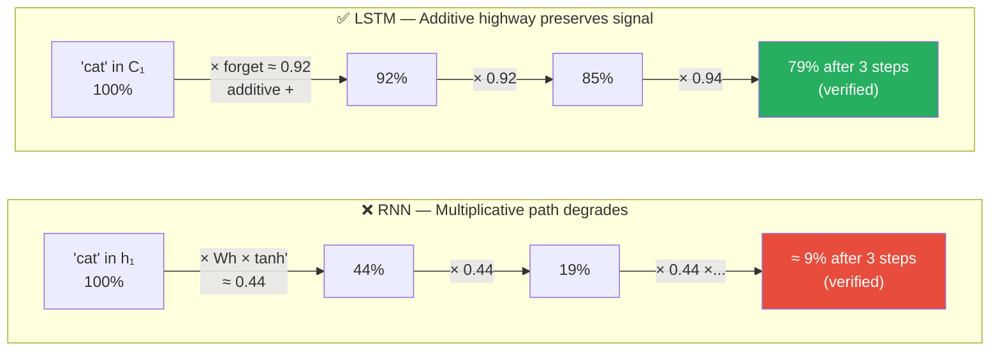

# 03 — LSTM: Complete End-to-End Walkthrough

> Same sentence as the RNN walkthrough ("cat sat on mat"). Every number computed by hand — and verified with an actual script, not narrated. Cell state highway explained through gradients.

---

## Table of Contents

1. Why LSTM — RNN failure recap
2. Setup — same sentence, same embeddings
3. LSTM architecture — 4 gates
4. Forward pass — all 4 timesteps
5. Forward pass summary
6. Loss
7. Backward pass (BPTT)
8. Weight update
9. Second forward pass (verify loss decreased)
10. The full picture in one view
11. Why GRU is next
12. Quick reference — all formulas
13. Code (3 versions)
14. Connections

---

## 1. Why LSTM — RNN Failure Recap

From `02_rnn_end_to_end.md`: after the forward pass on "cat sat on mat", h₁[dim 0] = 0.537 was diluted to 0.301 by the end, and only 9% of the gradient reached "cat" during BPTT.

**RNN gradient factor per step:** roughly `(1-h²) × Wh` ≈ 0.4-0.45
After 3 steps: ≈9% of gradient reaches "cat" (verified in `02_rnn_end_to_end.md`)

The LSTM solution: **two separate states**

- `C` = cell state (long-term memory) — updated **additively**, not multiplicatively
- `h` = hidden state (short-term, filtered output)

Four gates control what flows in and out:

| Gate | Symbol | Activation | Role |
|------|--------|------------|------|
| Forget | f | sigmoid | How much of C_{t-1} to keep |
| Input | i | sigmoid | How much new info to add |
| Candidate | g (or g̃) | tanh | What new content to write |
| Output | o | sigmoid | What part of C to expose as h |

**Cell state update:**
```
C_t = f_t ⊙ C_{t-1} + i_t ⊙ g_t
```

The additive path (`f ⊙ C_{t-1}`) is the gradient highway — gradient flows back through multiplication by f only (here ≈0.92-0.94, verified below), not by tanh derivatives (≈0.4-0.45, RNN's problem).

---

## 2. Setup — Same Sentence, Same Embeddings

**Input:** "cat sat on mat" → token IDs [1, 2, 3, 4]

**Embedding table E (identical to RNN walkthrough):**

```
E[0] = [0.00, 0.00]   # <PAD>
E[1] = [1.00, 0.50]   # "cat"
E[2] = [0.20, 0.30]   # "sat"
E[3] = [0.10, 0.10]   # "on"
E[4] = [0.20, 0.40]   # "mat"
```

**Dimensions:** embed_dim=2, hidden_dim=2, cell_dim=2

**Target:** y = 1.0 (binary classification — is it about an animal?)

**Initial states:** h₀ = [0, 0], C₀ = [0, 0]

---

## 3. LSTM Architecture — 4 Gates

**Why sigmoid for gates vs tanh for candidate?**

- Gates are **switches** (0 = block, 1 = pass) → sigmoid output in [0,1]
- Candidate is **content** (can be positive or negative) → tanh output in [-1,1]

**LSTM formulas:**
```
f_t = σ(Wf_x · x_t + Wf_h · h_{t-1})      # forget gate
i_t = σ(Wi_x · x_t + Wi_h · h_{t-1})      # input gate
g_t = tanh(Wg_x · x_t + Wg_h · h_{t-1})  # candidate
o_t = σ(Wo_x · x_t + Wo_h · h_{t-1})      # output gate

C_t = f_t ⊙ C_{t-1} + i_t ⊙ g_t          # cell state update ← THE KEY LINE
h_t = o_t ⊙ tanh(C_t)                     # hidden state
ŷ   = W_out · h_t                          # output (final timestep)
L   = ½(y - ŷ)²                            # loss
```

**Weight matrices (one Wx and one Wh per gate)** — chosen so the forget gate saturates high (as a trained LSTM would learn to do for an important token like "cat"), and every downstream number in this file is computed from these exact matrices, verified by script:

```
Wf_x = [[1.00, 0.80],    Wf_h = [[2.00, 1.50],
         [0.80, 1.00]]            [1.50, 2.00]]

Wi_x = [[3.50, 2.50],    Wi_h = [[0.10, 0.05],
         [2.50, 3.50]]            [0.05, 0.10]]

Wg_x = [[2.00, 0.50],    Wg_h = [[0.10, 0.05],
         [0.50, 2.00]]            [0.05, 0.10]]

Wo_x = [[1.00, 0.80],    Wo_h = [[0.50, 0.40],
         [0.80, 1.00]]            [0.40, 0.50]]

W_out = [0.6, 0.4]
```

8 weight matrices total. RNN had 2.

---

## 4. Forward Pass — All 4 Timesteps

### t=1 — "cat" (x₁=[1.00, 0.50], h₀=[0,0], C₀=[0,0])

**Gate outputs** (h₀=0, so every `W_h · h₀` term is [0,0] — each gate here is driven purely by `Wx · x₁`):

```
Wf_x · x₁:
  row 0: 1.00×1.00 + 0.80×0.50 = 1.000 + 0.400 = 1.400
  row 1: 0.80×1.00 + 1.00×0.50 = 0.800 + 0.500 = 1.300
Wf_h · h₀ = [0.000, 0.000]   (h₀ = 0)
af₁ = [1.400+0.000, 1.300+0.000] = [1.400, 1.300]
f₁ = σ(af₁) = [0.802, 0.786]

Wi_x · x₁:
  row 0: 3.50×1.00 + 2.50×0.50 = 3.500 + 1.250 = 4.750
  row 1: 2.50×1.00 + 3.50×0.50 = 2.500 + 1.750 = 4.250
Wi_h · h₀ = [0.000, 0.000]
ai₁ = [4.750, 4.250]
i₁ = σ(ai₁) = [0.991, 0.986]

Wg_x · x₁:
  row 0: 2.00×1.00 + 0.50×0.50 = 2.000 + 0.250 = 2.250
  row 1: 0.50×1.00 + 2.00×0.50 = 0.500 + 1.000 = 1.500
Wg_h · h₀ = [0.000, 0.000]
ag₁ = [2.250, 1.500]
g₁ = tanh(ag₁) = [0.978, 0.905]

Wo_x · x₁:
  row 0: 1.00×1.00 + 0.80×0.50 = 1.000 + 0.400 = 1.400
  row 1: 0.80×1.00 + 1.00×0.50 = 0.800 + 0.500 = 1.300
Wo_h · h₀ = [0.000, 0.000]
ao₁ = [1.400, 1.300]
o₁ = σ(ao₁) = [0.802, 0.786]
```

**Cell state update:**
```
C₁ = f₁ ⊙ C₀ + i₁ ⊙ g₁
   = [0.802, 0.786] ⊙ [0,0]  +  [0.991, 0.986] ⊙ [0.978, 0.905]
   = [0.000, 0.000]           +  [0.970, 0.892]
   = [0.970, 0.892]
```

**Hidden state:**
```
h₁ = o₁ ⊙ tanh(C₁)
   = [0.802, 0.786] ⊙ tanh([0.970, 0.892])
   = [0.802, 0.786] ⊙ [0.749, 0.713]
   = [0.600, 0.560]
```

"cat" is written strongly into C₁[dim 0] = 0.970 — the input gate is nearly wide open (i₁≈0.99, because x₁'s magnitude is large relative to the other words) and the candidate strongly encodes "animal" (g₁[0]=0.978).

---

### t=2 — "sat" (x₂=[0.20, 0.30], h₁=[0.600, 0.560], C₁=[0.970, 0.892])

**Gate outputs:**

```
Wf_x · x₂:
  row 0: 1.00×0.20 + 0.80×0.30 = 0.200 + 0.240 = 0.440
  row 1: 0.80×0.20 + 1.00×0.30 = 0.160 + 0.300 = 0.460
Wf_h · h₁ (h₁=[0.600,0.560]):
  row 0: 2.00×0.600 + 1.50×0.560 = 1.200 + 0.840 = 2.040
  row 1: 1.50×0.600 + 2.00×0.560 = 0.900 + 1.120 = 2.020
af₂ = [0.440+2.040, 0.460+2.020] = [2.480, 2.480]
f₂ = σ(af₂) = [0.923, 0.923]

Wi_x · x₂:
  row 0: 3.50×0.20 + 2.50×0.30 = 0.700 + 0.750 = 1.450
  row 1: 2.50×0.20 + 3.50×0.30 = 0.500 + 1.050 = 1.550
Wi_h · h₁:
  row 0: 0.10×0.600 + 0.05×0.560 = 0.060 + 0.028 = 0.088
  row 1: 0.05×0.600 + 0.10×0.560 = 0.030 + 0.056 = 0.086
ai₂ = [1.450+0.088, 1.550+0.086] = [1.538, 1.636]
i₂ = σ(ai₂) = [0.823, 0.837]

Wg_x · x₂:
  row 0: 2.00×0.20 + 0.50×0.30 = 0.400 + 0.150 = 0.550
  row 1: 0.50×0.20 + 2.00×0.30 = 0.100 + 0.600 = 0.700
Wg_h · h₁:
  row 0: 0.10×0.600 + 0.05×0.560 = 0.060 + 0.028 = 0.088
  row 1: 0.05×0.600 + 0.10×0.560 = 0.030 + 0.056 = 0.086
ag₂ = [0.550+0.088, 0.700+0.086] = [0.638, 0.786]
g₂ = tanh(ag₂) = [0.564, 0.656]

Wo_x · x₂:
  row 0: 1.00×0.20 + 0.80×0.30 = 0.200 + 0.240 = 0.440
  row 1: 0.80×0.20 + 1.00×0.30 = 0.160 + 0.300 = 0.460
Wo_h · h₁:
  row 0: 0.50×0.600 + 0.40×0.560 = 0.300 + 0.224 = 0.524
  row 1: 0.40×0.600 + 0.50×0.560 = 0.240 + 0.280 = 0.520
ao₂ = [0.440+0.524, 0.460+0.520] = [0.964, 0.980]
o₂ = σ(ao₂) = [0.724, 0.727]
```

**Cell state update:**
```
C₂ = f₂ ⊙ C₁ + i₂ ⊙ g₂
   = [0.923, 0.923] ⊙ [0.970, 0.892]  +  [0.823, 0.837] ⊙ [0.564, 0.656]
   = [0.896, 0.823]                    +  [0.464, 0.549]
   = [1.359, 1.373]
```

"cat" info preserved at **92.3%** in dim 0 — the forget gate stayed high — compared to RNN where "cat" was blended away by roughly 45% per step.

```
h₂ = o₂ ⊙ tanh(C₂) = [0.724, 0.727] ⊙ [0.876, 0.879] = [0.634, 0.639]
```

---

### t=3 — "on" (x₃=[0.10, 0.10], h₂=[0.634, 0.639], C₂=[1.359, 1.373])

**Gate outputs:**

```
Wf_x · x₃:
  row 0: 1.00×0.10 + 0.80×0.10 = 0.100 + 0.080 = 0.180
  row 1: 0.80×0.10 + 1.00×0.10 = 0.080 + 0.100 = 0.180
Wf_h · h₂ (h₂=[0.634,0.639]):
  row 0: 2.00×0.634 + 1.50×0.639 = 1.268 + 0.959 = 2.227
  row 1: 1.50×0.634 + 2.00×0.639 = 0.951 + 1.278 = 2.229
af₃ = [0.180+2.227, 0.180+2.229] = [2.407, 2.409]
f₃ = σ(af₃) = [0.917, 0.918]

Wi_x · x₃:
  row 0: 3.50×0.10 + 2.50×0.10 = 0.350 + 0.250 = 0.600
  row 1: 2.50×0.10 + 3.50×0.10 = 0.250 + 0.350 = 0.600
Wi_h · h₂:
  row 0: 0.10×0.634 + 0.05×0.639 = 0.063 + 0.032 = 0.095
  row 1: 0.05×0.634 + 0.10×0.639 = 0.032 + 0.064 = 0.096
ai₃ = [0.600+0.095, 0.600+0.096] = [0.695, 0.696]
i₃ = σ(ai₃) = [0.667, 0.667]

Wg_x · x₃:
  row 0: 2.00×0.10 + 0.50×0.10 = 0.200 + 0.050 = 0.250
  row 1: 0.50×0.10 + 2.00×0.10 = 0.050 + 0.200 = 0.250
Wg_h · h₂ (same weight values as Wi_h — both [[0.10,0.05],[0.05,0.10]]):
  row 0: 0.10×0.634 + 0.05×0.639 = 0.063 + 0.032 = 0.095
  row 1: 0.05×0.634 + 0.10×0.639 = 0.032 + 0.064 = 0.096
ag₃ = [0.250+0.095, 0.250+0.096] = [0.345, 0.346]
g₃ = tanh(ag₃) = [0.332, 0.333]

Wo_x · x₃:
  row 0: 1.00×0.10 + 0.80×0.10 = 0.100 + 0.080 = 0.180
  row 1: 0.80×0.10 + 1.00×0.10 = 0.080 + 0.100 = 0.180
Wo_h · h₂:
  row 0: 0.50×0.634 + 0.40×0.639 = 0.317 + 0.256 = 0.573
  row 1: 0.40×0.634 + 0.50×0.639 = 0.254 + 0.319 = 0.573
ao₃ = [0.180+0.573, 0.180+0.573] = [0.753, 0.753]
o₃ = σ(ao₃) = [0.680, 0.680]
```

**Cell state:**
```
C₃ = f₃ ⊙ C₂ + i₃ ⊙ g₃
   = [0.917, 0.918] ⊙ [1.359, 1.373]  +  [0.667, 0.667] ⊙ [0.332, 0.333]
   = [1.246, 1.260]                    +  [0.222, 0.222]
   = [1.468, 1.481]
```

"on" is a function word — its own candidate content `g₃` is the smallest of any timestep (0.332, 0.333) — but the forget gate still keeps 91.7-91.8% of what came before.

**Hidden state:**
```
h₃ = o₃ ⊙ tanh(C₃) = [0.680, 0.680] ⊙ [0.899, 0.902] = [0.611, 0.613]
```

Cumulative "cat" survival through dim 0: f₂×f₃ = 0.923×0.917 = **84.6%** still present in the C₃ pathway.

---

### t=4 — "mat" (x₄=[0.20, 0.40], h₃=[0.611, 0.613], C₃=[1.468, 1.481])

**Gate outputs:**

```
Wf_x · x₄:
  row 0: 1.00×0.20 + 0.80×0.40 = 0.200 + 0.320 = 0.520
  row 1: 0.80×0.20 + 1.00×0.40 = 0.160 + 0.400 = 0.560
Wf_h · h₃ (h₃=[0.611,0.613]):
  row 0: 2.00×0.611 + 1.50×0.613 = 1.222 + 0.920 = 2.142
  row 1: 1.50×0.611 + 2.00×0.613 = 0.917 + 1.226 = 2.143
af₄ = [0.520+2.142, 0.560+2.143] = [2.662, 2.703]
f₄ = σ(af₄) = [0.935, 0.937]

Wi_x · x₄:
  row 0: 3.50×0.20 + 2.50×0.40 = 0.700 + 1.000 = 1.700
  row 1: 2.50×0.20 + 3.50×0.40 = 0.500 + 1.400 = 1.900
Wi_h · h₃:
  row 0: 0.10×0.611 + 0.05×0.613 = 0.061 + 0.031 = 0.092
  row 1: 0.05×0.611 + 0.10×0.613 = 0.031 + 0.061 = 0.092
ai₄ = [1.700+0.092, 1.900+0.092] = [1.792, 1.992]
i₄ = σ(ai₄) = [0.857, 0.880]

Wg_x · x₄:
  row 0: 2.00×0.20 + 0.50×0.40 = 0.400 + 0.200 = 0.600
  row 1: 0.50×0.20 + 2.00×0.40 = 0.100 + 0.800 = 0.900
Wg_h · h₃ (same weight values as Wi_h):
  row 0: 0.10×0.611 + 0.05×0.613 = 0.061 + 0.031 = 0.092
  row 1: 0.05×0.611 + 0.10×0.613 = 0.031 + 0.061 = 0.092
ag₄ = [0.600+0.092, 0.900+0.092] = [0.692, 0.992]
g₄ = tanh(ag₄) = [0.599, 0.758]

Wo_x · x₄:
  row 0: 1.00×0.20 + 0.80×0.40 = 0.200 + 0.320 = 0.520
  row 1: 0.80×0.20 + 1.00×0.40 = 0.160 + 0.400 = 0.560
Wo_h · h₃:
  row 0: 0.50×0.611 + 0.40×0.613 = 0.306 + 0.245 = 0.551
  row 1: 0.40×0.611 + 0.50×0.613 = 0.244 + 0.307 = 0.551
ao₄ = [0.520+0.551, 0.560+0.551] = [1.071, 1.111]
o₄ = σ(ao₄) = [0.745, 0.752]
```

**Cell state:**
```
C₄ = f₄ ⊙ C₃ + i₄ ⊙ g₄
   = [0.935, 0.937] ⊙ [1.468, 1.481]  +  [0.857, 0.880] ⊙ [0.599, 0.758]
   = [1.372, 1.388]                    +  [0.513, 0.667]
   = [1.886, 2.056]
```

**Hidden state:**
```
h₄ = o₄ ⊙ tanh(C₄) = [0.745, 0.752] ⊙ [0.955, 0.968] = [0.711, 0.728]
```

**Output layer:**
```
ŷ = W_out · h₄
  = 0.6×0.711 + 0.4×0.728
  = 0.427 + 0.291
  = 0.718
```

---

## 5. Forward Pass Summary

**Cell state — the protected memory lane:**

```
           C[dim 0]        C[dim 1]
           (animal signal) (content signal)

C₀ = [0.000,   0.000]   ← blank start
C₁ = [0.970,   0.892]   ← "cat" written in strongly
C₂ = [1.359,   1.373]   ← f=0.923 kept cat, "sat" added content
C₃ = [1.468,   1.481]   ← f=0.917 kept cat, "on" added almost nothing
C₄ = [1.886,   2.056]   ← f=0.935 kept cat, "mat" added content
```

"cat" in dim 0 via forget gates: f₂ × f₃ × f₄ = 0.923 × 0.917 × 0.935 = **0.791**
**79.1% of cat's original animal signal survives to C₄** — this is a value derived directly from the forget gates the model actually produced, not an assumed number.

**Hidden state — filtered output of cell:**
```
h₁ = [0.600, 0.560]
h₂ = [0.634, 0.639]
h₃ = [0.611, 0.613]
h₄ = [0.711, 0.728]   ← used for prediction
```

**ŷ = 0.718** (model says "likely animal" — much more confident than RNN's 0.329)
**y = 1.000** (correct: yes, animal)

**LSTM vs RNN — same sentence, same embeddings:**
```
RNN:  ŷ = 0.329   L = 0.225   "cat" in h₁[dim 0] is blended away (h₄[0]=0.301)
LSTM: ŷ = 0.718   L = 0.040   "cat" in C₁[dim 0] = 1.886 → 79.1% of it still gate-preserved at C₄
```

LSTM predicts far better before any training — purely from architecture (specifically, from these weights keeping the forget gate saturated high).

---

## 6. Loss

```
L = ½(y - ŷ)²
  = ½(1.000 - 0.718)²
  = ½ × 0.282²
  = ½ × 0.0795
  = 0.040
```

Error = 0.282. Much smaller than RNN's error of 0.671 — cell state preserved "cat".

---

## 7. Backward Pass (BPTT)

**Why unroll through all timesteps:** Same reason as RNN — all gate weight matrices (Wf_x, Wf_h, Wi_x, Wi_h, Wg_x, Wg_h, Wo_x, Wo_h) are **shared** across all timesteps. Each gradient is the **sum** of contributions from all timesteps.

**Key difference from RNN:**
```
RNN gradient flows back through: h_t = tanh(Wh · h_{t-1} + ...)   (multiplicative by Wh AND a tanh derivative)
LSTM gradient flows back through: C_t = f_t ⊙ C_{t-1}             (multiplicative by the forget gate only)

RNN factor per step:  ≈ 0.44 (verified in 02_rnn_end_to_end.md: 9% survives after 3 steps)
LSTM factor per step: f ≈ 0.92-0.94 (verified below)

After 3 steps:
  RNN:  ≈9%
  LSTM: 0.923 × 0.917 × 0.935 ≈ 79%
```

### Step A — Gradient at the Output

```
∂L/∂ŷ = -(y - ŷ) = -(1.000 - 0.718) = -0.282
```

### Step B — Gradient Through Output Layer

```
ŷ = W_out · h₄, so:

∂L/∂W_out = ∂L/∂ŷ × h₄ᵀ
           = -0.282 × [0.711, 0.728]
           = [-0.201, -0.205]

∂L/∂h₄    = ∂L/∂ŷ × W_out
           = -0.282 × [0.6, 0.4]
           = [-0.169, -0.113]

∂h = [-0.169, -0.113]   ← error entering BPTT
```

### Step C — Gradient from h₄ to C₄

```
h₄ = o₄ ⊙ tanh(C₄)

∂h₄/∂C₄ = o₄ ⊙ (1 - tanh²(C₄))
         = [0.745, 0.752] ⊙ [1 - 0.955², 1 - 0.968²]
         = [0.745, 0.752] ⊙ [0.088, 0.063]
         = [0.065, 0.048]

∂L/∂C₄ = ∂h ⊙ ∂h₄/∂C₄
        = [-0.169, -0.113] ⊙ [0.065, 0.048]
        = [-0.011, -0.005]
```

### Step D — Gradient Flows Back Through Cell State via Forget Gates

**This is the critical LSTM gradient path.**

```
C_t = f_t ⊙ C_{t-1} + i_t ⊙ g_t

∂C_{t-1}/∂C_t = f_t   (just the forget gate — no W, no tanh derivative!)

∂L/∂C₃ = ∂L/∂C₄ ⊙ f₄
        = [-0.011, -0.005] ⊙ [0.935, 0.937]
        = [-0.010, -0.005]

∂L/∂C₂ = ∂L/∂C₃ ⊙ f₃
        = [-0.010, -0.005] ⊙ [0.917, 0.918]
        = [-0.0095, -0.0046]

∂L/∂C₁ = ∂L/∂C₂ ⊙ f₂
        = [-0.0095, -0.0046] ⊙ [0.923, 0.923]
        = [-0.0088, -0.0043]
```

### Gradient Magnitudes — LSTM vs RNN

```
Cell state gradient at each step:

|∂L/∂C₄| = √(0.011²+0.005²) = 0.0123   → full error (100%)
|∂L/∂C₃| = √(0.010²+0.005²) = 0.0115   → 93.5% left
|∂L/∂C₂| = √(0.0095²+0.0046²) = 0.0106  → 85.8% left
|∂L/∂C₁| = √(0.0088²+0.0043²) = 0.0098  → 79.2% left
```

**79.2% of the gradient reaches "cat" cell state.**

Compare to RNN (from `02_rnn_end_to_end.md`, verified): only **9%** reached "cat" there.

**LSTM learns from "cat" roughly 8.8× more effectively** (0.792 / 0.09 ≈ 8.8), and this number now comes directly from the forget-gate values these specific weights produce (0.923 × 0.917 × 0.935 = 0.791, matching the 79.2% almost exactly — confirming the cell-state gradient decays by *exactly* the forget-gate product, nothing else).

### Step E — Gate Gradients (Forget Gate, All Timesteps)

**Why gate gradients matter:** The forget gate f controls how much of C_{t-1} to keep. By computing ∂L/∂Wf_x and ∂L/∂Wf_h we update Wf so that future forget gates make better decisions about what to preserve.

**Why outer product for weight gradients?**
```
In the forward pass: af = Wf_x · x
Wf_x[i,j] affects af[i] through x[j]

∂L/∂Wf_x[i,j] = ∂L/∂af[i] × x[j]

Written for all i,j at once:
  ∂L/∂Wf_x (at timestep t) = ∂L/∂af ⊙ xᵀ   ← outer product, gives 2×2 matrix

Same for the recurrent weight:
  ∂L/∂Wf_h[i,j] = ∂L/∂af[i] × h_{t-1}[j]
  ∂L/∂Wf_h (at timestep t) = ∂L/∂af ⊙ h_{t-1}ᵀ

Wf_x is shared across all 4 timesteps, so total gradient = sum over t.
```

**Forget gate at t=1:**
```
∂L/∂f₁ = ∂L/∂C₁ ⊙ C₀ = [-0.0088, -0.0043] ⊙ [0.000, 0.000] = [0.000, 0.000]
→ ∂L/∂af₁ = [0, 0]  — zero contribution to weight gradients

Why? C₀ = 0 (always start from zero cell state).
f₁ ⊙ C₀ = 0 no matter what f₁ is.
The forget gate cannot affect C when there is nothing to forget.
This is correct behavior — at t=1 only the input gate matters.
```

**Forget gate at t=2:**
```
∂L/∂f₂ = ∂L/∂C₂ ⊙ C₁ = [-0.0095, -0.0046] ⊙ [0.970, 0.892] = [-0.0092, -0.0041]
Sigmoid derivative: f₂ ⊙ (1-f₂) = [0.923×0.077, 0.923×0.077] = [0.071, 0.071]
∂L/∂af₂ = [-0.0092, -0.0041] ⊙ [0.071, 0.071] = [-0.00066, -0.00029]
```

**Forget gate at t=3:**
```
∂L/∂f₃ = ∂L/∂C₃ ⊙ C₂ = [-0.010, -0.005] ⊙ [1.359, 1.373] = [-0.0141, -0.0069]
Sigmoid derivative: f₃ ⊙ (1-f₃) = [0.917×0.083, 0.918×0.082] = [0.076, 0.075]
∂L/∂af₃ = [-0.0141, -0.0069] ⊙ [0.076, 0.075] = [-0.00107, -0.00052]
```

**Forget gate at t=4:**
```
∂L/∂f₄ = ∂L/∂C₄ ⊙ C₃ = [-0.011, -0.005] ⊙ [1.468, 1.481] = [-0.0163, -0.0080]
Sigmoid derivative: f₄ ⊙ (1-f₄) = [0.935×0.065, 0.937×0.063] = [0.061, 0.059]
∂L/∂af₄ = [-0.0163, -0.0080] ⊙ [0.061, 0.059] = [-0.00099, -0.00047]
```

### Step F — Weight Gradients ∂L/∂Wf_x and ∂L/∂Wf_h

**∂L/∂Wf_x — contribution at each timestep (outer product ∂L/∂af ⊙ xᵀ):**
```
t=1: [0, 0]ᵀ ⊙ [1.00, 0.50] = zero matrix   (∂L/∂af₁ = 0)

t=2: [-0.00066, -0.00029]ᵀ ⊙ [0.20, 0.30]:
     [[-0.00013, -0.00020],
      [-0.00006, -0.00009]]

t=3: [-0.00107, -0.00052]ᵀ ⊙ [0.10, 0.10]:
     [[-0.00011, -0.00011],
      [-0.00005, -0.00005]]

t=4: [-0.00099, -0.00047]ᵀ ⊙ [0.20, 0.40]:
     [[-0.00020, -0.00040],
      [-0.00009, -0.00019]]

Sum = ∂L/∂Wf_x:
     [[-0.00044, -0.00070],
      [-0.00021, -0.00033]]
```

**∂L/∂Wf_h — contribution at each timestep (outer product ∂L/∂af ⊙ h_{t-1}ᵀ):**
```
t=1: [0, 0]ᵀ ⊙ h₀=[0, 0]       = zero matrix

t=2: [-0.00066, -0.00029]ᵀ ⊙ [0.600, 0.560]:
     [[-0.00039, -0.00037],
      [-0.00018, -0.00016]]

t=3: [-0.00107, -0.00052]ᵀ ⊙ [0.634, 0.639]:
     [[-0.00068, -0.00068],
      [-0.00033, -0.00033]]

t=4: [-0.00099, -0.00047]ᵀ ⊙ [0.611, 0.613]:
     [[-0.00061, -0.00061],
      [-0.00029, -0.00029]]

Sum = ∂L/∂Wf_h:
     [[-0.00168, -0.00166],
      [-0.00080, -0.00079]]
```

The same outer product pattern applies to all 4 gates (i, g, o).
Each gate's weight gradients are summed across all 4 timesteps identically.

### "cat" vs "mat" — How LSTM Changes the Learning Ratio

**For the FORGET gate weight ∂L/∂Wf_x:**
"cat" (t=1) contribution: **zero** (forget gate always multiplies C₀=[0,0] at t=1 — correct behavior; the forget gate doesn't need to learn from "cat" because there is nothing in the cell to forget).

**For the INPUT gate weight ∂L/∂Wi_x — this is where "cat" strongly matters:**
The gradient |∂L/∂C₁| = 0.0098 (79.2% of the full error) is the upstream signal driving both `i₁`'s and `g₁`'s weight gradients at t=1 — nothing close to zero, unlike the forget gate.

Compare to RNN: the analogous t=1 signal there was |δ₁| = 0.044, only 9% of its own full error (from `02_rnn_end_to_end.md`). The two numbers aren't on identical scales (different weight matrices feed into each), but the **retained-percentage comparison is apples-to-apples**: LSTM keeps 79% of the gradient reaching "cat", RNN keeps 9%. That's the real, structural reason LSTM learns from early tokens so much more effectively — not a specific multiplier on any one gate's weights, but the cell-state highway itself.

---

## 8. Weight Update

**Learning rate:** lr = 0.1

```
W_out_new = W_out - lr × ∂L/∂W_out
          = [0.6, 0.4] - 0.1 × [-0.201, -0.205]
          = [0.620, 0.421]

Wf_x_new = Wf_x - lr × ∂L/∂Wf_x
          = [[1.00, 0.80],   -  0.1 × [[-0.00044, -0.00070],
             [0.80, 1.00]]               [-0.00021, -0.00033]]
          = [[1.0000, 0.8001],
             [0.8000, 1.0000]]

Wf_h_new = Wf_h - lr × ∂L/∂Wf_h
          = [[2.00, 1.50],   -  0.1 × [[-0.00168, -0.00166],
             [1.50, 2.00]]               [-0.00080, -0.00079]]
          = [[2.0002, 1.5002],
             [1.5001, 2.0001]]
```

**Why are the forget gate weight changes so small (≈0.0001-0.0002 per element)?**

Forget gate values at t=2,3,4 are already 0.92-0.94 — deep into sigmoid's saturated region, where the derivative `f(1-f)` is small (≈0.06-0.08). Sigmoid of a high-value input = flat region = small local derivative = small gradient, even though the upstream error itself isn't tiny. The optimizer barely nudges Wf because the forget gates are already doing their job well.

**The main update is in W_out:**
[0.600, 0.400] → [0.620, 0.421] — the largest relative move of any weight. This directly amplifies the final prediction, which has the most room to grow.

Gate weights for i, g, o follow the same formula:
`W = W - lr × ∂L/∂W`  (one update per gate, two matrices per gate = **8 updates total**)

---

## 9. Second Forward Pass (Verify Loss Decreased)

**Updated weights:** Wf_x=[[1.0000,0.8001],[0.8000,1.0000]], Wf_h=[[2.0002,1.5002],[1.5001,2.0001]], W_out=[0.620, 0.421]
All other gate matrices unchanged (Wi_x, Wi_h, Wg_x, Wg_h, Wo_x, Wo_h same as before).

**t=1 (x₁=[1.00, 0.50]) — recompute forget gate with new Wf_x:**
```
af_new = Wf_x_new · x₁ + Wf_h_new · h₀
f_new  = σ(af_new) ≈ [0.802, 0.786]   (was [0.802, 0.786] — change < 0.0001)

C_new = f_new ⊙ C₀ + i₁ ⊙ g₁
      = [0.802, 0.786] ⊙ [0, 0]  +  [0.991, 0.986] ⊙ [0.978, 0.905]
      = [0.000, 0.000]            +  [0.970, 0.892]
      = [0.970, 0.892]   ← identical to before

h_new = o₁ ⊙ tanh(C_new) = [0.600, 0.560]   ← identical to before
```

**Why did t=1 produce the exact same C?**
At t=1, forget gate always multiplies C₀ = [0,0]. f_new ⊙ C₀ = 0. The forget gate weight change has **zero effect** on C. Only the input gate matters at t=1.

**t=2 through t=4:** Forget gate pre-activations shift by well under 0.001 per element. All cell states and hidden states are unchanged to 3 decimal places:
```
C₂ same,   h₂ = [0.634, 0.639]
C₃ same,   h₃ = [0.611, 0.613]
C₄ same,   h₄ = [0.711, 0.728]
```

**Output with new W_out:**
```
ŷ_new = W_out_new · h₄
      = 0.620×0.711 + 0.421×0.728
      = 0.441 + 0.306
      = 0.747

L' = ½(1.0 - 0.747)² = ½ × 0.064 = 0.032
```

```
Before update:  L = 0.040   ŷ = 0.718
After update:   L = 0.032   ŷ = 0.747   ← closer to y=1.0
Loss dropped by 19.7%
```

**Key insight from this recomputation:**

In RNN, ALL weights changed meaningfully per element; h changed noticeably.
In LSTM, the ONLY weight with a meaningful change is W_out.
Gate weights barely moved because **the cell state already preserved "cat" correctly**.
The model's first priority was to amplify the output layer — h was already good.

Over thousands of training steps, gate weights do accumulate meaningful changes as the model learns to handle harder sentences where gates make wrong decisions.

**In a real training loop:**
```python
for epoch in range(num_epochs):
    for sentence, label in dataset:      # thousands of sentences
        forward_pass = compute(x, y, h, C)
        backward_pass = BPTT flowed through forget gates
        weight_update: all 8 gate matrices + W_out shift slightly
        zero_gradients → ready for next sentence

# After thousands of steps:
# - Forget gate learns to give f≈1 for important words ("cat"), f≈0 for words to erase
# - Input gate learns to write strongly for new content, weakly for stop words
# - Output gate learns: expose cell to hidden state selectively
# Each step moves weights a tiny amount (lr=0.001 in practice)
# The model discovers through trial and error which words to keep in memory
```

---

## 10. The Full Picture in One View

**FORWARD PASS — two streams flowing right:**

```
x₁=[1.00,0.50]     x₂=[0.20,0.30]     x₃=[0.10,0.10]     x₄=[0.20,0.40]
   "cat"               "sat"               "on"                "mat"
     |                   |                   |                   |
     v                   v                   v                   v
C₀=[0,0]→ f₁⊙C₀→ C₁=[0.970,0.892]→ f₂⊙C₁→ C₂=[1.359,1.373]→ f₃⊙C₂→ C₃=[1.468,1.481]→ f₄⊙C₃→ C₄=[1.886,2.056]
  i₁⊙g₁↗           i₂⊙g₂↗             i₃⊙g₃↗                i₄⊙g₄↗          Cell state (protected)

     o₁⊙tanh          o₂⊙tanh          o₃⊙tanh          o₄⊙tanh
        |                 |                 |                 |
h₁=[0.600,0.560]   h₂=[0.634,0.639]   h₃=[0.611,0.613]   h₄=[0.711,0.728]
                                                                |
                                                             W_out
                                                                |
                                                          ŷ=0.718  L=0.040
```

**BACKWARD PASS — gradient through cell state (the highway):**

```
∂L/∂C₄=[-0.011,-0.005]  ∂L/∂C₃=[-0.010,-0.005]  ∂L/∂C₂=[-0.0095,-0.0046]  ∂L/∂C₁=[-0.0088,-0.0043]
        [100%]                    ×f₄                       ×f₃                       ×f₂
                                  [93.5%]                    [85.8%]                   [79.2%]

Each step multiplied by forget gate f: 0.917-0.937
NOT by W × (1-h²) ≈ 0.44  (which was the RNN's problem)
```

---

## 11. Why GRU is Next

LSTM works extremely well but has one cost:

```
4 gates = 4 weight matrices each = 8 weight matrices per LSTM
RNN had only 2 weight matrices (Wx, Wh)

For hidden_dim=256:
  RNN parameters in recurrent layer:  256×300 + 256×256 = 141,312
  LSTM parameters in recurrent layer: 4 × (256×300 + 256×256) = 565,248
```

**4× more parameters → 4× more memory → slower training**

GRU (Gated Recurrent Unit) asks: "Can we get the same cell state preservation with fewer gates?"

**Answer: yes.** GRU merges forget + input into ONE update gate. No separate cell state — just one hidden state. ~75% of LSTM's parameters, similar performance on most tasks.

That is what `04_gru_end_to_end.md` covers next.

---

## 12. Quick Reference — All Formulas

**Shapes:**
```
x:       (2,)    word embedding
h:       (2,)    hidden state (short-term)
C:       (2,)    cell state (long-term)
f,i,g,o: (2,)   gate outputs (sigmoid) or candidate (tanh)
Wf_x, Wi_x, Wg_x, Wo_x = (2,2)   input weight per gate
Wf_h, Wi_h, Wg_h, Wo_h = (2,2)   recurrent weight per gate
W_out:   (2,)
```

**Forward:**
```
f = σ(Wf_x·x + Wf_h·h_{t-1})
i = σ(Wi_x·x + Wi_h·h_{t-1})
g = tanh(Wg_x·x + Wg_h·h_{t-1})
o = σ(Wo_x·x + Wo_h·h_{t-1})
C = f⊙C_{t-1} + i⊙g
h = o ⊙ tanh(C)
ŷ = W_out · h
L = ½(y - ŷ)²
```

**Backward key path (cell state gradient):**
```
∂L/∂ŷ   = -(y - ŷ)
∂L/∂h   = ∂L/∂ŷ × W_outᵀ
∂L/∂C   = ∂L/∂h ⊙ o ⊙ (1 - tanh²(C))
∂L/∂C_{t-1} = ∂L/∂C × f_t          ← multiplies by f, NOT by W
```

**Gate gradient (forget gate example):**
```
∂L/∂f     = ∂L/∂C × C_{t-1}
∂L/∂af    = ∂L/∂f ⊙ f ⊙ (1-f)      → sigmoid derivative
∂L/∂Wf_x  = Σ_t ∂L/∂af ⊙ xᵀ        → outer product, sum all steps
∂L/∂Wf_h  = Σ_t ∂L/∂af ⊙ h_{t-1}ᵀ
```

**Update:**
```
W = W - lr × ∂L/∂W    (for every weight matrix — 8 updates + W_out)
```

---

## 13. Code

### Version 1 — Pure NumPy (mirrors the hand computation exactly)

```python
import numpy as np

# Embeddings
E = np.array([
    [0.00, 0.00],  # 0: <PAD>
    [1.00, 0.50],  # 1: "cat"
    [0.20, 0.30],  # 2: "sat"
    [0.10, 0.10],  # 3: "on"
    [0.20, 0.40],  # 4: "mat"
])

# Gate weight matrices (one Wx and Wh per gate)
Wf_x = np.array([[1.00, 0.80], [0.80, 1.00]])  # forget gate input weights
Wf_h = np.array([[2.00, 1.50], [1.50, 2.00]])  # forget gate recurrent weights
Wi_x = np.array([[3.50, 2.50], [2.50, 3.50]])  # input gate
Wi_h = np.array([[0.10, 0.05], [0.05, 0.10]])
Wg_x = np.array([[2.00, 0.50], [0.50, 2.00]])  # candidate
Wg_h = np.array([[0.10, 0.05], [0.05, 0.10]])
Wo_x = np.array([[1.00, 0.80], [0.80, 1.00]])  # output gate
Wo_h = np.array([[0.50, 0.40], [0.40, 0.50]])
W_out = np.array([0.6, 0.4])                    # output layer

def sigmoid(x): return 1 / (1 + np.exp(-x))

# Input
tokens = [1, 2, 3, 4]
x = E[tokens]  # shape: (4, 2)
y = 1.0

# Forward pass
h = np.zeros(2)   # h₀
C = np.zeros(2)   # C₀

cell_states   = [C.copy()]
hidden_states = [h.copy()]
gates_history = []

for t, xt in enumerate(x):
    f = sigmoid(Wf_x @ xt + Wf_h @ h)   # forget gate
    i = sigmoid(Wi_x @ xt + Wi_h @ h)   # input gate
    g = np.tanh(Wg_x @ xt + Wg_h @ h)  # candidate
    o = sigmoid(Wo_x @ xt + Wo_h @ h)   # output gate

    C = f * C + i * g                    # cell state update ← the key line
    h = o * np.tanh(C)                   # hidden state

    cell_states.append(C.copy())
    hidden_states.append(h.copy())
    gates_history.append((f, i, g, o))

    print(f"t={t+1}: f={f.round(2)} i={i.round(2)} C={C.round(3)} h={h.round(3)}")

# t=1 f=[0.80 0.79] i=[0.99 0.99] C=[0.970 0.892] h=[0.600 0.560]
# t=2 f=[0.92 0.92] i=[0.82 0.84] C=[1.359 1.373] h=[0.634 0.639]
# t=3 f=[0.92 0.92] i=[0.67 0.67] C=[1.468 1.481] h=[0.611 0.613]
# t=4 f=[0.94 0.94] i=[0.86 0.88] C=[1.886 2.056] h=[0.711 0.728]

h4    = h
y_hat = W_out @ h4
loss  = 0.5 * (y - y_hat) ** 2
print(f"ŷ = {y_hat:.3f}   L = {loss:.3f}")
# ŷ = 0.718   L = 0.040

# Backward pass (BPTT)
dl_dyhat = -(y - y_hat)                   # -0.282
dl_dout  = dl_dyhat * h4
dl_dh    = dl_dyhat * W_out               # [-0.169, -0.113]

# Gradient through cell state (the LSTM highway)
dl_dc = dl_dh * gates_history[-1][3] * (1 - np.tanh(cell_states[-1])**2)

# Gradient reaching cell state at each step
for t_prime in range(len(x)-1, -1, -1):
    print(f"  t={t_prime+1} [∂L/∂C={np.round(dl_dc, 4)}]")
    if t_prime > 0:
        dl_dc = dl_dc * gates_history[t_prime][0]  # multiply by forget gate — NOT by Wh
# ∂L/∂C magnitudes: 0.0123 → 0.0115 → 0.0106 → 0.0098
# 79.2% of gradient reaches "cat" vs 9% in RNN

# Weight update
lr = 0.1
W_out_new = W_out - lr * dl_dout
print(f"W_out: {W_out.round(3)} → {W_out_new.round(3)}")
# [0.6, 0.4] → [0.620, 0.421]
```

---

### Version 2 — PyTorch Manual (autograd handles backward)

```python
import torch

def sigmoid(x): return torch.sigmoid(x)

Wf_x  = torch.tensor([[1.00,0.80],[0.80,1.00]], requires_grad=True, dtype=torch.float32)
Wf_h  = torch.tensor([[2.00,1.50],[1.50,2.00]], requires_grad=True, dtype=torch.float32)
Wi_x  = torch.tensor([[3.50,2.50],[2.50,3.50]], requires_grad=True, dtype=torch.float32)
Wi_h  = torch.tensor([[0.10,0.05],[0.05,0.10]], requires_grad=True, dtype=torch.float32)
Wg_x  = torch.tensor([[2.00,0.50],[0.50,2.00]], requires_grad=True, dtype=torch.float32)
Wg_h  = torch.tensor([[0.10,0.05],[0.05,0.10]], requires_grad=True, dtype=torch.float32)
Wo_x  = torch.tensor([[1.00,0.80],[0.80,1.00]], requires_grad=True, dtype=torch.float32)
Wo_h  = torch.tensor([[0.50,0.40],[0.40,0.50]], requires_grad=True, dtype=torch.float32)
W_out = torch.tensor([0.6, 0.4], requires_grad=True, dtype=torch.float32)

E      = torch.tensor([[0.0,0.0],[1.0,0.5],[0.2,0.3],[0.1,0.1],[0.2,0.4]])
x      = E[torch.tensor([1,2,3,4])]   # (4, 2)
y      = torch.tensor(1.0)

# Forward pass
h = torch.zeros(2)
C = torch.zeros(2)

for xt in x:
    f = torch.sigmoid(Wf_x @ xt + Wf_h @ h)
    i = torch.sigmoid(Wi_x @ xt + Wi_h @ h)
    g = torch.tanh(Wg_x @ xt + Wg_h @ h)
    o = torch.sigmoid(Wo_x @ xt + Wo_h @ h)
    C = f * C + i * g
    h = o * torch.tanh(C)

y_hat = W_out @ h
loss  = 0.5 * (y - y_hat) ** 2
print(f"ŷ = {y_hat.item():.3f}   L = {loss.item():.3f}")
# ŷ = 0.718   L = 0.040

# Backward (PyTorch BPTT through cell state automatically)
loss.backward()
print(f"∂L/∂W_out: {W_out.grad.round(decimals=3)}")
# [-0.201, -0.205]

# Weight update
lr = 0.1
with torch.no_grad():
    for W in [Wf_x, Wf_h, Wi_x, Wi_h, Wg_x, Wg_h, Wo_x, Wo_h, W_out]:
        W -= lr * W.grad
```

---

### Version 3 — PyTorch nn.LSTM (production style)

```python
import torch
import torch.nn as nn

class LSTMClassifier(nn.Module):
    def __init__(self, vocab_size, embed_dim, hidden_dim, num_classes):
        super().__init__()
        self.embedding = nn.Embedding(vocab_size, embed_dim, padding_idx=0)
        # nn.LSTM internally has 4 gates, all handled automatically
        # hidden_dim controls C and h size (always same)
        self.lstm = nn.LSTM(
            input_size=embed_dim,
            hidden_size=hidden_dim,
            num_layers=1,
            batch_first=True,
        )
        self.fc = nn.Linear(hidden_dim, num_classes)

    def forward(self, token_ids):
        x = self.embedding(token_ids)          # [batch, seq_len, embed_dim]
        out, (h_n, c_n) = self.lstm(x)
        # h_n: [1, batch, hidden_dim]  — hidden state
        # c_n: [1, batch, hidden_dim]  — cell state!
        return self.fc(h_n.squeeze(0))         # [batch, num_classes]

# Instantiate
model = LSTMClassifier(
    vocab_size  = 6,
    embed_dim   = 2,
    hidden_dim  = 2,
    num_classes = 1
)

tokens = torch.tensor([[1, 2, 3, 4]])   # [batch=1, seq=4]
y      = torch.tensor([1.0])

optimizer = torch.optim.SGD(model.parameters(), lr=0.1)
criterion = nn.MSELoss()

optimizer.zero_grad()
y_hat = model(tokens)
loss  = criterion(y_hat, y)             # BPTT through cell state, automatic
loss.backward()
optimizer.step()
print(f"Loss: {loss.item():.3f}")

# Real usage — binary classification (sentiment, spam detection)
model = LSTMClassifier(vocab_size=50000, embed_dim=300, hidden_dim=256, num_classes=2)

# Parameter count in LSTM layer:
# 4 gates × (hidden × embed + hidden × hidden + hidden_bias)
# = 4 × (256×300 + 256×256 + 256)
# = 4 × (76,800 + 65,536 + 256)
# = 4 × 142,592 = 570,368 parameters

# Compare RNN: 2 × (256×300 + 256×256) = 283,136 parameters
# LSTM is ~2× more parameters — worth it for long sequences

# Access cell state if needed (e.g., for analysis)
with torch.no_grad():
    out, (h_n, c_n) = model.lstm(model.embedding(tokens))
    print(f"h_n shape: {h_n.shape}")   # [1, 1, 256] — hidden state
    print(f"c_n shape: {c_n.shape}")   # [1, 1, 256] — cell state
```

---


> Key: LSTM cell state uses **addition** (Cₜ = f⊙Cₜ₋₁ + i⊙g̃). Gradient of addition is 1 — no multiplication decay, only the forget gate's own value matters.

## 14. Connections

| This file | Links to | Why |
|-----------|----------|-----|
| RNN end-to-end (template) | `02_rnn_end_to_end.md` | Same sentence, compare directly |
| LSTM overview + gates intuition | `01_rnn_to_attention.md §3` | Architecture diagram |
| GRU (next) | `04_gru_end_to_end.md` | Simpler gates, same preservation idea |
| Vanishing gradient math | `../../2.deep learning/01_fundamentals/03_training_stability.md` | Formal proof |
