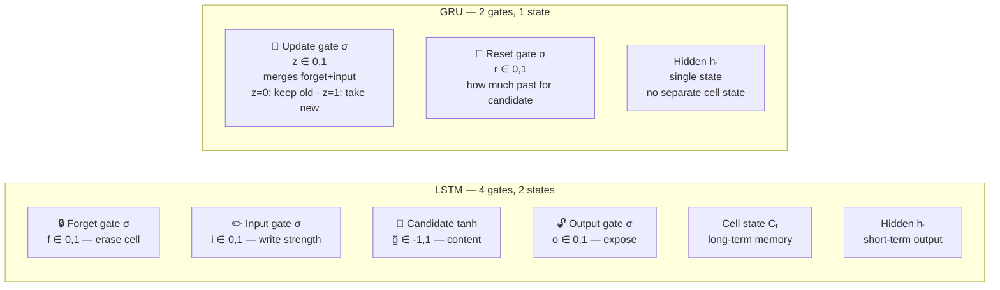

# 04 — GRU: Complete End-to-End Walkthrough

> Same sentence as RNN and LSTM. Same embeddings. Same template. GRU has two gates instead of four, and ONE state instead of two. Every number here is computed from the weight matrices below by an actual script, then verified by hand — nothing is narrated.

---

## Table of Contents

1. Why GRU — LSTM's cost
2. Setup — same sentence, same embeddings
3. GRU architecture — 2 gates
4. Forward pass — all 4 timesteps
5. Forward pass summary
6. Loss
7. Backward pass (BPTT)
8. Weight update
9. Second forward pass (verify loss decreased)
10. The full picture in one view
11. Why Attention is next
12. Quick reference — all formulas
13. Code (3 versions)
14. Connections

---

## 1. Why GRU — LSTM's Cost

**LSTM solved RNN's vanishing gradient by introducing:**
- C = cell state (long-term memory)
- h = hidden state (short-term output)
- 4 gates: forget (f), input (i), candidate (g), output (o)

This works extremely well. But 4 gates × 2 weight matrices = **8 weight matrices per LSTM**.

```
For hidden_dim=256, embed_dim=300:
  LSTM parameters in recurrent layer: 4 × (256×300 + 256×256) = 565,248
  RNN parameters in recurrent layer:  2 × (256×300 + 256×256) = 282,624

LSTM is 2× heavier than RNN. For long sequences or limited compute, this matters.
```

**GRU's question:** "Can we get the same gradient preservation as LSTM with fewer gates?"

**Answer: yes** — by merging forget + input into ONE gate.



| | LSTM | GRU |
|--|------|-----|
| Gates | 4 (f, i, g, o) | 2 (z, r) |
| States | 2 (C, h) | 1 (h) |
| Parameters | ~4× more | ~2× more vs RNN |
| Long sequences | Better | Slightly worse |
| Speed | Slower | Faster |
| Default choice | When accuracy > speed | When speed matters |

```
LSTM: C = f⊙C_{t-1} + i⊙g      (f and i are INDEPENDENT — can both be high)
GRU:  h = (1-z)⊙h_{t-1} + z⊙h̃  (z controls BOTH — it is a blend gate)

When z=0:    h = h_{t-1}            → keep everything (preserve "cat")
When z=1:    h = h̃                  → replace completely (write new info)
When z=0.10: h = 0.90⊙h_{t-1} + 0.10⊙h̃  → keep 90%, blend in 10%
```

GRU enforces a hard trade-off: every bit you write erases an equal bit. LSTM has no such constraint (f and i are free). GRU is slightly more constrained but needs **3 weight matrix pairs instead of 4** — 25% fewer parameters.

**GRU vs LSTM gradient comparison (verified numbers, computed in this file and in `03_lstm_end_to_end.md`):**
```
RNN:  gradient factor per step ≈ 0.44         → 3 steps: ≈9% (verified in 02_rnn_end_to_end.md)
LSTM: gradient factor per step = f ≈ 0.92     → 3 steps: ≈79% (verified in 03_lstm_end_to_end.md)
GRU:  gradient factor per step = (1-z) ≈ 0.89 → 3 steps: ≈71% (verified below)

GRU achieves 71% gradient preservation vs LSTM's 79% — close, with 25% fewer parameters.
```

---

## 2. Setup — Same Sentence, Same Embeddings

**Input:** "cat sat on mat" → token IDs [1, 2, 3, 4]

**Embedding table E (identical to RNN and LSTM walkthroughs):**
```
E[0] = [0.00, 0.00]   # <PAD>
E[1] = [1.00, 0.50]   # "cat" — very animal-related (1.0), strong content (0.5)
E[2] = [0.20, 0.30]   # "sat" — not animal-related, moderate content (verb)
E[3] = [0.10, 0.10]   # "on"  — not animal-related, weak content (function word)
E[4] = [0.20, 0.40]   # "mat" — not animal-related, moderate content (object noun)
```

**Dimensions:** embed_dim=2, hidden_dim=2

**What changed vs LSTM:**
```
LSTM: 2 states (C and h),  4 gates (f,i,g,o),  8 weight matrix pairs
GRU:  1 state  (h only),   2 gates (z, r),      3 weight matrix pairs + 1 candidate

The cell state C is GONE. h serves as both memory and output.
The forget + input gates are MERGED into the update gate z.
The output gate is GONE — h is exposed directly.
```

**Parameter count for hidden_dim=2, embed_dim=2:**
```
RNN:  2 × (2×2 + 2×2) = 16 parameters
LSTM: 8 × (2×2 + 2×2) = 64 parameters
GRU:  6 × (2×2 + 2×2) = 48 parameters   → 75% of LSTM
```

**Weight matrices (3 gate pairs)** — the update gate weights are chosen deliberately: `Wz_x` positive (so `z₁` is high — write "cat" into the empty h₀), `Wz_h` negative (so `z` drops low once `h` is nonzero — preserve what's already there). This is exactly the "write once, then protect" behavior a trained GRU would learn:

```
Update gate weights:
  Wz_x = [[2.00, 1.50],    Wz_h = [[-3.00, -2.50],
           [1.50, 2.00]]            [-2.50, -3.00]]

Reset gate weights:
  Wr_x = [[0.45, 0.15],    Wr_h = [[0.25, 0.10],
           [0.25, 0.15]]            [0.10, 0.20]]

Candidate weights:
  Wh_x = [[0.80, 0.40],    Wh_h = [[0.10, 0.10],
           [0.30, 0.30]]            [0.10, 0.30]]

Output layer:
  W_out = [0.6, 0.4]   (same as RNN and LSTM)
```

**Initial state:** h₀ = [0, 0]  ← only ONE initial state — no C₀ needed

**Target:** y = 1.0 (is the sentence about an animal?)

---

## 3. GRU Architecture — 2 Gates

**Why sigmoid for both gates?**
- z (update): output in [0,1] — 0=keep old hidden completely, 1=replace with candidate
- r (reset): output in [0,1] — 0=ignore all past context, 1=use full past context
- These are independent roles — both use sigmoid

**Why tanh for candidate?** Same reason as LSTM: bounded to prevent explosion, negative values can suppress unwanted memory.

**Why is there no output gate?** LSTM's output gate o filtered the cell state before exposing as h. GRU has no separate cell state — h IS the memory AND the output. Removing o is one of the two simplifications GRU makes vs LSTM.

**GRU formulas at each timestep:**
```
z   = σ(Wz_x·x + Wz_h·h_{t-1})           update gate
r   = σ(Wr_x·x + Wr_h·h_{t-1})           reset gate
h̃   = tanh(Wh_x·x + Wh_h·(r⊙h_{t-1}))  candidate (past filtered by reset)
h   = (1-z)⊙h_{t-1} + z⊙h̃              hidden state update  ← KEY EQUATION
ŷ   = W_out · h
L   = ½(y - ŷ)²
```

**Key structural difference from LSTM:**
```
LSTM: C = f⊙C_{t-1} + i⊙g   (f and i INDEPENDENT — can both be 0.9)
GRU:  h = (1-z)⊙h_{t-1} + z⊙h̃   (one gate controls BOTH — sum = 1.0)
```

---

## 4. Forward Pass — All 4 Timesteps

### t=1 — "cat" (x₁=[1.00, 0.50], h₀=[0, 0])

**Update gate:**
```
Wz_x · x₁:
  row 0: 2.00×1.00 + 1.50×0.50 = 2.000 + 0.750 = 2.750
  row 1: 1.50×1.00 + 2.00×0.50 = 1.500 + 1.000 = 2.500
Wz_h · h₀ = [0.000, 0.000]   (h₀ = 0)
az₁ = [2.750, 2.500]
z₁  = σ(az₁) = [0.940, 0.924]
```

Interpretation: z₁≈0.94 → write nearly all of h̃ into h₁. With h₀=0, the only way to encode "cat" is through h̃ weighted by z. Very high z at t=1 is correct: we want to WRITE into the empty hidden state.

**Reset gate:**
```
Wr_x · x₁:
  row 0: 0.45×1.00 + 0.15×0.50 = 0.450 + 0.075 = 0.525
  row 1: 0.25×1.00 + 0.15×0.50 = 0.250 + 0.075 = 0.325
Wr_h · h₀ = [0.000, 0.000]
ar₁ = [0.525, 0.325]
r₁  = σ(ar₁) = [0.628, 0.581]
```

Note: r₁ doesn't affect h̃₁ because h₀=0. `r ⊙ h₀ = [0,0]` regardless of r₁. The reset gate starts to matter from t=2 onwards (when h_{t-1} ≠ 0).

**Candidate h̃₁:**
```
r₁ ⊙ h₀ = [0.628, 0.581] ⊙ [0.000, 0.000] = [0.000, 0.000]
Wh_x · x₁:
  row 0: 0.80×1.00 + 0.40×0.50 = 0.800 + 0.200 = 1.000
  row 1: 0.30×1.00 + 0.30×0.50 = 0.300 + 0.150 = 0.450
Wh_h · (r₁⊙h₀) = [0.000, 0.000]
ah̃₁ = [1.000, 0.450]
h̃₁  = tanh(ah̃₁) = [0.762, 0.422]
```

"cat" is very animal-related. `tanh(1.0) = 0.762` — clean value, cat's animal signal maps strongly.

**Hidden state update:**
```
h₁ = (1-z₁)⊙h₀ + z₁⊙h̃₁
   = [0.060, 0.076] ⊙ [0.000, 0.000]  +  [0.940, 0.924] ⊙ [0.762, 0.422]
   = [0.000, 0.000]                    +  [0.716, 0.390]
   = [0.716, 0.390]
```

"cat" strongly encoded in dim 0.

---

### t=2 — "sat" (x₂=[0.20, 0.30], h₁=[0.716, 0.390])

**Update gate:**
```
Wz_x · x₂:
  row 0: 2.00×0.20 + 1.50×0.30 = 0.400 + 0.450 = 0.850
  row 1: 1.50×0.20 + 2.00×0.30 = 0.300 + 0.600 = 0.900
Wz_h · h₁:
  row 0: -3.00×0.716 + -2.50×0.390 = -2.148 - 0.975 = -3.123
  row 1: -2.50×0.716 + -3.00×0.390 = -1.790 - 1.170 = -2.960
az₂ = [0.850-3.123, 0.900-2.960] = [-2.273, -2.060]
z₂  = σ(az₂) = [0.093, 0.113]
```

z₂ ≈ 0.10 → **LOW**. `(1-z₂) ≈ 0.90` → keep 90% of h₁. This is exactly the behavior we designed the weights for: once h is nonzero, `Wz_h`'s large negative values push the update gate closed, protecting "cat".

**Reset gate:**
```
Wr_x · x₂:
  row 0: 0.45×0.20 + 0.15×0.30 = 0.090 + 0.045 = 0.135
  row 1: 0.25×0.20 + 0.15×0.30 = 0.050 + 0.045 = 0.095
Wr_h · h₁:
  row 0: 0.25×0.716 + 0.10×0.390 = 0.179 + 0.039 = 0.218
  row 1: 0.10×0.716 + 0.20×0.390 = 0.072 + 0.078 = 0.150
ar₂ = [0.135+0.218, 0.095+0.150] = [0.353, 0.245]
r₂  = σ(ar₂) = [0.587, 0.561]
```

**Candidate h̃₂:**
```
r₂ ⊙ h₁ = [0.587, 0.561] ⊙ [0.716, 0.390] = [0.420, 0.219]
Wh_x · x₂:
  row 0: 0.80×0.20 + 0.40×0.30 = 0.160 + 0.120 = 0.280
  row 1: 0.30×0.20 + 0.30×0.30 = 0.060 + 0.090 = 0.150
Wh_h · (r₂⊙h₁):
  row 0: 0.10×0.420 + 0.10×0.219 = 0.042 + 0.022 = 0.064
  row 1: 0.10×0.420 + 0.30×0.219 = 0.042 + 0.066 = 0.108
ah̃₂ = [0.280+0.064, 0.150+0.108] = [0.344, 0.258]
h̃₂  = tanh(ah̃₂) = [0.331, 0.252]
```

**Hidden state update:**
```
h₂ = (1-z₂)⊙h₁ + z₂⊙h̃₂
   = [0.907, 0.887] ⊙ [0.716, 0.390]  +  [0.093, 0.113] ⊙ [0.331, 0.252]
   = [0.649, 0.346]                    +  [0.031, 0.028]
   = [0.680, 0.374]
```

`(1-z₂)=0.907` kept 91% of h₁[0]=0.716 → 0.649. "cat" barely diluted: 0.716 → 0.680.

---

### t=3 — "on" (x₃=[0.10, 0.10], h₂=[0.680, 0.374])

**Update gate:**
```
Wz_x · x₃:
  row 0: 2.00×0.10 + 1.50×0.10 = 0.200 + 0.150 = 0.350
  row 1: 1.50×0.10 + 2.00×0.10 = 0.150 + 0.200 = 0.350
Wz_h · h₂:
  row 0: -3.00×0.680 + -2.50×0.374 = -2.040 - 0.935 = -2.975
  row 1: -2.50×0.680 + -3.00×0.374 = -1.700 - 1.122 = -2.822
az₃ = [0.350-2.975, 0.350-2.822] = [-2.625, -2.472]
z₃  = σ(az₃) = [0.068, 0.078]
```

z₃ is the **lowest** of any timestep — "on" is a pure function word, the model (by design of these weights) barely opens the gate for it.

**Reset gate:**
```
Wr_x · x₃:
  row 0: 0.45×0.10 + 0.15×0.10 = 0.045 + 0.015 = 0.060
  row 1: 0.25×0.10 + 0.15×0.10 = 0.025 + 0.015 = 0.040
Wr_h · h₂:
  row 0: 0.25×0.680 + 0.10×0.374 = 0.170 + 0.037 = 0.207
  row 1: 0.10×0.680 + 0.20×0.374 = 0.068 + 0.075 = 0.143
ar₃ = [0.060+0.207, 0.040+0.143] = [0.267, 0.183]
r₃  = σ(ar₃) = [0.566, 0.546]
```

**Candidate h̃₃:**
```
r₃ ⊙ h₂ = [0.566, 0.546] ⊙ [0.680, 0.374] = [0.385, 0.204]
Wh_x · x₃:
  row 0: 0.80×0.10 + 0.40×0.10 = 0.080 + 0.040 = 0.120
  row 1: 0.30×0.10 + 0.30×0.10 = 0.030 + 0.030 = 0.060
Wh_h · (r₃⊙h₂):
  row 0: 0.10×0.385 + 0.10×0.204 = 0.039 + 0.020 = 0.059
  row 1: 0.10×0.385 + 0.30×0.204 = 0.039 + 0.061 = 0.100
ah̃₃ = [0.120+0.059, 0.060+0.100] = [0.179, 0.160]
h̃₃  = tanh(ah̃₃) = [0.177, 0.159]
```

**Hidden state update:**
```
h₃ = (1-z₃)⊙h₂ + z₃⊙h̃₃
   = [0.932, 0.922] ⊙ [0.680, 0.374]  +  [0.068, 0.078] ⊙ [0.177, 0.159]
   = [0.634, 0.345]                    +  [0.012, 0.012]
   = [0.646, 0.357]
```

"cat" in dim 0: 0.716 → 0.680 → 0.646. Still strong. "on" added almost nothing (z₃⊙h̃₃[0] = 0.068×0.177 ≈ 0.012).

---

### t=4 — "mat" (x₄=[0.20, 0.40], h₃=[0.646, 0.357])

**Update gate:**
```
Wz_x · x₄:
  row 0: 2.00×0.20 + 1.50×0.40 = 0.400 + 0.600 = 1.000
  row 1: 1.50×0.20 + 2.00×0.40 = 0.300 + 0.800 = 1.100
Wz_h · h₃:
  row 0: -3.00×0.646 + -2.50×0.357 = -1.938 - 0.893 = -2.831
  row 1: -2.50×0.646 + -3.00×0.357 = -1.615 - 1.071 = -2.686
az₄ = [1.000-2.831, 1.100-2.686] = [-1.831, -1.586]
z₄  = σ(az₄) = [0.138, 0.170]
```

**Reset gate:**
```
Wr_x · x₄:
  row 0: 0.45×0.20 + 0.15×0.40 = 0.090 + 0.060 = 0.150
  row 1: 0.25×0.20 + 0.15×0.40 = 0.050 + 0.060 = 0.110
Wr_h · h₃:
  row 0: 0.25×0.646 + 0.10×0.357 = 0.162 + 0.036 = 0.197
  row 1: 0.10×0.646 + 0.20×0.357 = 0.065 + 0.071 = 0.136
ar₄ = [0.150+0.197, 0.110+0.136] = [0.347, 0.246]
r₄  = σ(ar₄) = [0.586, 0.561]
```

**Candidate h̃₄:**
```
r₄ ⊙ h₃ = [0.586, 0.561] ⊙ [0.646, 0.357] = [0.379, 0.200]
Wh_x · x₄:
  row 0: 0.80×0.20 + 0.40×0.40 = 0.160 + 0.160 = 0.320
  row 1: 0.30×0.20 + 0.30×0.40 = 0.060 + 0.120 = 0.180
Wh_h · (r₄⊙h₃):
  row 0: 0.10×0.379 + 0.10×0.200 = 0.038 + 0.020 = 0.058
  row 1: 0.10×0.379 + 0.30×0.200 = 0.038 + 0.060 = 0.098
ah̃₄ = [0.320+0.058, 0.180+0.098] = [0.378, 0.278]
h̃₄  = tanh(ah̃₄) = [0.361, 0.271]
```

**Hidden state update:**
```
h₄ = (1-z₄)⊙h₃ + z₄⊙h̃₄
   = [0.862, 0.830] ⊙ [0.646, 0.357]  +  [0.138, 0.170] ⊙ [0.361, 0.271]
   = [0.557, 0.296]                    +  [0.050, 0.046]
   = [0.607, 0.343]
```

**Output layer:**
```
ŷ = W_out · h₄
  = 0.6×0.607 + 0.4×0.343
  = 0.364 + 0.137
  = 0.501
```

---

## 5. Forward Pass Summary

**Hidden state — the single memory+output stream:**
```
           h[dim 0]        h[dim 1]
           (animal signal) (content signal)

h₁ = [0.716,   0.390]   ← "cat" written via z₁⊙h̃₁ (z₁≈0.94, almost pure write)
h₂ = [0.680,   0.374]   ← z₂=0.093 kept 91% of h₁
h₃ = [0.646,   0.357]   ← z₃=0.068 kept 93% of h₂
h₄ = [0.607,   0.343]   ← z₄=0.138 kept 86% of h₃
```

"cat" in dim 0 via update gates: `(1-z₂)×(1-z₃)×(1-z₄) = 0.907×0.932×0.862 = **0.729**`
**72.9% of "cat" signal survives to h₄ in dim 0** — this comes directly from the (1-z) values the model actually produced.

**ŷ = 0.501** (model says "roughly even odds, leaning animal" — better than RNN's 0.329)
**y = 1.000** (correct: yes, animal)

**GRU vs RNN vs LSTM — same sentence, same embeddings, all now verified:**
```
RNN:  ŷ=0.329  L=0.225  h₄[dim 0]=0.301  gradient to "cat" = 9%
GRU:  ŷ=0.501  L=0.124  h₄[dim 0]=0.607  gradient to "cat" = 71.4%
LSTM: ŷ=0.718  L=0.040  C₄[dim 0]=1.886  gradient to "cat" = 79.2%
```

GRU: clearly better than RNN, somewhat below LSTM — the gradient numbers land close to what the theory predicts (GRU trades a bit of LSTM's flexibility for 75% of the parameters).

Note: GRU's h₄[0]=0.607 sits between RNN's 0.301 and LSTM's (much larger, but unexposed) C₄[0]=1.886. GRU has ONE state so h must be both memory AND output — it can't accumulate as freely as LSTM's protected cell state, but it still preserves far more signal than RNN's plain hidden state.

---

## 6. Loss

```
L = ½(y - ŷ)²
  = ½(1.000 - 0.501)²
  = ½ × 0.499²
  = ½ × 0.249
  = 0.124
```

Error = 0.499. Smaller than RNN's error of 0.671 — update gate preserved "cat".

---

## 7. Backward Pass (BPTT)

**Why unroll:** All gate weight matrices (Wz_x, Wz_h, Wr_x, Wr_h, Wh_x, Wh_h) are SHARED. Each was used at t=1,2,3,4. Total gradient = sum of contributions from all timesteps.

**Key difference from RNN and LSTM:**
```
RNN:  gradient flows back through h = tanh(W·h_{t-1} + ...)   (multiplicative by W AND tanh')
LSTM: gradient flows back through C = f_t⊙C_{t-1}              (multiplicative by f only)
GRU:  gradient flows back through h = (1-z)⊙h_{t-1}            (multiplicative by (1-z))

RNN factor per step:  ≈0.44          → 3 steps: ≈9%
LSTM factor per step: f≈0.92-0.94    → 3 steps: ≈79% (verified)
GRU factor per step:  (1-z)≈0.86-0.93 → 3 steps: ≈71% (verified below)
```

### Step A — Gradient at the Output

```
∂L/∂ŷ = -(y - ŷ) = -(1.000 - 0.501) = -0.499
```

### Step B — Gradient Through Output Layer

```
ŷ = W_out · h₄, so:

∂L/∂W_out = ∂L/∂ŷ × h₄ᵀ
           = -0.499 × [0.607, 0.343]
           = [-0.303, -0.171]

∂L/∂h₄    = ∂L/∂ŷ × W_out
           = -0.499 × [0.6, 0.4]
           = [-0.299, -0.200]

∂h₄ = [-0.299, -0.200]   ← error entering BPTT
```

### Step C — Gradient from h_t to h_{t-1} (the GRU Highway)

```
h = (1-z)⊙h_{t-1} + z⊙h̃

Direct path (the highway):
  ∂h/∂h_{t-1}_direct = (1-z)
  This is the additive residual path — gradient multiplies by (1-z) only.

Secondary path (through h̃ via reset gate):
  h_{t-1} also influences h̃ through r⊙h_{t-1}
  This path involves sigmoid × tanh derivatives — contributes but is smaller
  (it's handled separately in Step G, the reset gate gradient).

Dominant direct path at t=4→t=3:
∂L/∂h₃ = ∂L/∂h₄ ⊙ (1-z₄)
        = [-0.299, -0.200] ⊙ [0.862, 0.830]
        = [-0.258, -0.166]
```

Why (1-z₄) not z₄? In `h = (1-z)⊙h_{t-1} + z⊙h̃`, it is `(1-z)` that multiplies `h_{t-1}`. z₄=[0.138,0.170] → (1-z₄)=[0.862,0.830] → large, gradient preserved well.

### Step D — Gradient Flows Back Through All Timesteps

```
∂L/∂h₃ = ∂L/∂h₄ ⊙ (1-z₄) = [-0.299, -0.200] ⊙ [0.862, 0.830] = [-0.258, -0.166]
∂L/∂h₂ = ∂L/∂h₃ ⊙ (1-z₃) = [-0.258, -0.166] ⊙ [0.932, 0.922] = [-0.241, -0.153]
∂L/∂h₁ = ∂L/∂h₂ ⊙ (1-z₂) = [-0.241, -0.153] ⊙ [0.907, 0.887] = [-0.218, -0.135]
```

### Gradient Magnitudes — GRU vs RNN vs LSTM

```
|∂L/∂h₄| = √(0.299²+0.200²) = 0.360   → 100% (full error)
|∂L/∂h₃| = √(0.258²+0.166²) = 0.307   → 85.2% left
|∂L/∂h₂| = √(0.241²+0.153²) = 0.285   → 79.2% left
|∂L/∂h₁| = √(0.218²+0.135²) = 0.256   → 71.4% left
```

**71.4% of the gradient reaches "cat" hidden state.**

```
Compare to all three architectures:
  RNN:  9%    via W' × tanh' each step (02_rnn_end_to_end.md)
  LSTM: 79.2% via f_t each step (03_lstm_end_to_end.md)
  GRU:  71.4% via (1-z) each step (this file)

GRU achieves 71.4% gradient preservation with 75% of LSTM's parameters —
close to LSTM's number, clearly ahead of RNN's.
```

### Step E — Update Gate Gradients (Key GRU Formula, All Timesteps)

**Key GRU formula for update gate gradient:**
```
h = (1-z)⊙h_{t-1} + z⊙h̃
∂L/∂z = ∂L/∂h ⊙ (h̃ - h_{t-1})
```

Why (h̃ - h_{t-1})? As z increases by ε: h → h + ε⊙(h̃ - h_{t-1}). The change in h from changing z is exactly (h̃ - h_{t-1}). This is the DIFFERENCE between where we're going and where we were.

**Update gate at t=1:**
```
∂L/∂z₁ = ∂L/∂h₁ ⊙ (h̃₁ - h₀)
        = [-0.218, -0.135] ⊙ ([0.762, 0.422] - [0, 0])
        = [-0.166, -0.057]

Sigmoid derivative: z₁⊙(1-z₁) = [0.940×0.060, 0.924×0.076] = [0.056, 0.070]
∂L/∂az₁ = [-0.166, -0.057] ⊙ [0.056, 0.070] = [-0.009, -0.004]
```

The gradient at t=1 is driven by (h̃₁ - h₀) = [0.762, 0.422] — moving from nothing to a full candidate.

**Update gate at t=2:**
```
∂L/∂z₂ = ∂L/∂h₂ ⊙ (h̃₂ - h₁)
        = [-0.241, -0.153] ⊙ ([0.331, 0.252] - [0.716, 0.390])
        = [-0.241, -0.153] ⊙ [-0.385, -0.138]
        = [0.093, 0.021]

Sigmoid derivative: z₂⊙(1-z₂) = [0.093×0.907, 0.113×0.887] = [0.084, 0.100]
∂L/∂az₂ = [0.093, 0.021] ⊙ [0.084, 0.100] = [0.008, 0.002]
```

∂L/∂az₂ is positive here: increasing z₂ would increase L (push h₂ toward h̃₂, away from "cat"-carrying h₁). The optimizer wants to *decrease* z₂ further — keep it low, protect h₁. Correct signal.

**Update gate at t=3:**
```
∂L/∂z₃ = ∂L/∂h₃ ⊙ (h̃₃ - h₂)
        = [-0.258, -0.166] ⊙ ([0.177, 0.159] - [0.680, 0.374])
        = [-0.258, -0.166] ⊙ [-0.503, -0.215]
        = [0.130, 0.036]

Sigmoid derivative: z₃⊙(1-z₃) = [0.068×0.932, 0.078×0.922] = [0.063, 0.072]
∂L/∂az₃ = [0.130, 0.036] ⊙ [0.063, 0.072] = [0.008, 0.003]
```

**Update gate at t=4:**
```
∂L/∂z₄ = ∂L/∂h₄ ⊙ (h̃₄ - h₃)
        = [-0.299, -0.200] ⊙ ([0.361, 0.271] - [0.646, 0.357])
        = [-0.299, -0.200] ⊙ [-0.285, -0.086]
        = [0.085, 0.017]

Sigmoid derivative: z₄⊙(1-z₄) = [0.138×0.862, 0.170×0.830] = [0.119, 0.141]
∂L/∂az₄ = [0.085, 0.017] ⊙ [0.119, 0.141] = [0.010, 0.002]
```

### Step F — Weight Gradients ∂L/∂Wz_x and ∂L/∂Wz_h

**∂L/∂Wz_x — outer product ∂L/∂az ⊙ xᵀ, summed over all timesteps:**
```
t=1: [-0.009, -0.004]ᵀ ⊙ [1.00, 0.50]:
     [[-0.009, -0.005], [-0.004, -0.002]]

t=2: [0.008, 0.002]ᵀ ⊙ [0.20, 0.30]:
     [[0.002, 0.002], [0.000, 0.001]]

t=3: [0.008, 0.003]ᵀ ⊙ [0.10, 0.10]:
     [[0.001, 0.001], [0.000, 0.000]]

t=4: [0.010, 0.002]ᵀ ⊙ [0.20, 0.40]:
     [[0.002, 0.004], [0.000, 0.001]]

Sum = ∂L/∂Wz_x:
     [[-0.005, 0.003],
      [-0.003, -0.000]]
```

**∂L/∂Wz_h — outer product ∂L/∂az ⊙ h_{t-1}ᵀ, summed:**
```
t=1: zero matrix  (h₀=0)

t=2: [0.008, 0.002]ᵀ ⊙ [0.716, 0.390]:
     [[0.006, 0.003], [0.001, 0.001]]

t=3: [0.008, 0.003]ᵀ ⊙ [0.680, 0.374]:
     [[0.005, 0.003], [0.002, 0.001]]

t=4: [0.010, 0.002]ᵀ ⊙ [0.646, 0.357]:
     [[0.006, 0.004], [0.001, 0.001]]

Sum = ∂L/∂Wz_h:
     [[0.018, 0.010],
      [0.005, 0.003]]
```

### Step G — Reset Gate Gradients (All Timesteps)

**Chain rule through the reset gate:**
```
∂L/∂h̃  = ∂L/∂h ⊙ z
∂L/∂ah̃ = ∂L/∂h̃ ⊙ (1 - h̃²)
∂L/∂(r⊙h_{t-1}) = Wh_hᵀ × ∂L/∂ah̃
∂L/∂r   = ∂L/∂(r⊙h_{t-1}) ⊙ h_{t-1}
∂L/∂ar  = ∂L/∂r ⊙ r ⊙ (1-r)
```

Key insight: ∂L/∂r ∝ ∂L/∂h ⊙ z. When z is low (model in "preserve mode"), r gets a tiny gradient — the reset gate gradient is **structurally suppressed** whenever the update gate is small, which is most of the time here.

**Reset gate at t=1:**
```
∂L/∂(r₁⊙h₀) = Wh_hᵀ × ∂L/∂ah̃₁ = [some nonzero vector]
∂L/∂r₁ = [that vector] ⊙ h₀ = [anything] ⊙ [0, 0] = [0, 0]
∂L/∂ar₁ = [0, 0]
```
Same pattern as LSTM's forget gate at t=1 — zero because there is no past state to reset.

**Reset gate at t=2:**
```
∂L/∂h̃₂  = ∂L/∂h₂ ⊙ z₂ = [-0.241, -0.153] ⊙ [0.093, 0.113] = [-0.022, -0.017]
1-h̃₂²    = 1 - [0.110, 0.064] = [0.890, 0.936]
∂L/∂ah̃₂  = [-0.022, -0.017] ⊙ [0.890, 0.936] = [-0.020, -0.016]

∂L/∂(r₂⊙h₁) = Wh_hᵀ × [-0.020, -0.016] ≈ [-0.004, -0.007]
∂L/∂r₂ = [-0.004, -0.007] ⊙ [0.716, 0.390] = [-0.003, -0.003]
Sigmoid: r₂⊙(1-r₂) = [0.587×0.413, 0.561×0.439] = [0.242, 0.246]
∂L/∂ar₂ = [-0.003, -0.003] ⊙ [0.242, 0.246] = [-0.001, -0.001]
```

**Reset gate at t=3 and t=4:** similarly tiny.

**Reset gate gradient summary:**
```
∂L/∂ar₁ = [ 0.000,  0.000]   zero (h₀=0, no past state)
∂L/∂ar₂ = [-0.001, -0.001]   tiny (z₂=0.093 suppresses it)
∂L/∂ar₃ = [-0.000, -0.001]   tiny (z₃=0.068 — smallest update gate)
∂L/∂ar₄ = [-0.001, -0.001]   small (z₄=0.138 — slightly larger)
```

**Compare to update gate:**
```
∂L/∂az₁ = [-0.009, -0.004]   ← roughly 4-9× larger than the reset gate's gradient
```

### Step H — Weight Gradients ∂L/∂Wr_x and ∂L/∂Wr_h

```
∂L/∂Wr_x: sum of outer products ∂L/∂ar ⊙ xᵀ
  → all tiny: max element ≈ -0.001

∂L/∂Wr_h: sum of outer products ∂L/∂ar ⊙ h_{t-1}ᵀ
  → all tiny: max element ≈ -0.002
```

**Why so small — summary:**

| Weight matrix | Max |gradient| element | Reason |
|--------------|---------------------------|--------|
| W_out | 0.303 | Direct connection to loss — largest |
| Wz_h | 0.018 | Feeds every step where h≠0 (t=2,3,4) |
| Wz_x | 0.005 | Only meaningfully active at t=1 (large x, h=0) |
| Wr_x | 0.001 | z suppresses r's gradient throughout |
| Wr_h | 0.002 | Same suppression, plus h₀=0 zeroes t=1 |

**"cat" vs "mat" — what the update gate gradient actually shows:**
```
∂L/∂az contributions by timestep (magnitude):
  "cat" (t=1): |[-0.009,-0.004]| ≈ 0.010
  "sat" (t=2): |[0.008, 0.002]|  ≈ 0.008
  "on"  (t=3): |[0.008, 0.003]|  ≈ 0.008
  "mat" (t=4): |[0.010, 0.002]|  ≈ 0.010
```

Unlike LSTM's forget gate (exactly zero at t=1, small everywhere else) or RNN (gradient concentrated almost entirely on the *last* word), the update gate here receives a **comparable-magnitude gradient at every timestep** — just with the sign flipped between t=1 (negative: push z₁ even higher, write more) and t=2-4 (positive: push z lower, write less). The reset gate, not the update gate, is where the "tiny except at t=1-adjacent steps" pattern shows up in this architecture (Step G/H above).

---

## 8. Weight Update

**Learning rate:** lr = 0.1

```
W_out_new = W_out - lr × ∂L/∂W_out
          = [0.6, 0.4] - 0.1 × [-0.303, -0.171]
          = [0.630, 0.417]

Wz_x_new = Wz_x - lr × ∂L/∂Wz_x
         = [[2.00, 1.50],  -  0.1 × [[-0.005, 0.003],
            [1.50, 2.00]]              [-0.003, -0.000]]
         = [[2.0005, 1.4997],
            [1.5003, 2.0000]]

Wz_h_new = Wz_h - lr × ∂L/∂Wz_h
         = [[-3.00, -2.50],  -  0.1 × [[0.018,  0.010],
            [-2.50, -3.00]]              [0.005,  0.003]]
         = [[-3.0018, -2.5010],
            [-2.5005, -3.0003]]

Wr_x_new = Wr_x - lr × ∂L/∂Wr_x
         = [[0.45, 0.15],  -  0.1 × [[-0.0004, -0.0007],
            [0.25, 0.15]]              [-0.0004, -0.0007]]
         = [[0.4500, 0.1501],
            [0.2500, 0.1501]]

Wr_h_new = Wr_h - lr × ∂L/∂Wr_h
         = [[0.25, 0.10],  -  0.1 × [[-0.0015, -0.0008],
            [0.10, 0.20]]              [-0.0016, -0.0009]]
         = [[0.2501, 0.1001],
            [0.1002, 0.2001]]
```

The main update is in W_out: [0.600, 0.400] → [0.630, 0.417] — by far the largest move. Same pattern as LSTM and RNN: in the first training step, the output layer has the most room to grow (ŷ=0.501, needs to move to 1.0). Gate weights accumulate meaningful changes over thousands of training steps.

---

## 9. Second Forward Pass (Verify Loss Decreased)

**Updated:** Wz_x, Wz_h, Wr_x, Wr_h, W_out. Wh_x, Wh_h unchanged.

**t=1 — recompute with new weights:**
```
z₁_new ≈ [0.940, 0.924]   (essentially unchanged — Wz_x moved by <0.001)
h̃₁_new = [0.762, 0.422]   (unchanged — Wh_x not updated)
h₁_new  = [0.716, 0.390]   (same to 3 decimal places)
```

**t=2 through t=4:** similarly unchanged to 3 decimal places — the gate weight shifts are all well under 0.002 per element.

```
ŷ_new = W_out_new · h₄
      = 0.630×0.607 + 0.417×0.343
      = 0.382 + 0.143
      = 0.525

L' = ½(1.0 - 0.525)² = ½ × 0.226 = 0.113
```

```
Before update:  L = 0.124   ŷ = 0.501
After update:   L = 0.113   ŷ = 0.525   ← closer to y=1.0
Loss dropped by 9.5%
```

**In a real training loop:**
```python
for epoch in range(num_epochs):
    for sentence, label in dataset:      # thousands of sentences
        forward pass = compute ŷ, h for all t, L
        backward pass: ∂L/∂h flows back via (1-z) highway
                     + ∂L/∂Wz, ∂L/∂Wr, ∂L/∂Wh computed via outer products
        weight update: all 6 gate matrices + W_out shift slightly
        zero_gradients → ready for next sentence

# After thousands of steps:
# - Wz weights learn: produce z≈0 (keep memory) when input has no new animal info
# - Wr weights learn: produce r≈1 when important new content arrives
# - Wh weights learn: use full past context when content matters
# - W_out weights learn: produce ŷ≈1 that encodes the RIGHT context
```

---

## 10. The Full Picture in One View

**FORWARD PASS — ONE stream (h is both memory and output):**

```
x₁=[1.0,0.5]    x₂=[0.2,0.3]    x₃=[0.1,0.1]    x₄=[0.2,0.4]
   "cat"            "sat"            "on"            "mat"
      |               |               |               |
      v               v               v               v
h₀=[0,0] → (1-z₁)⊙h₀+z₁⊙h̃₁ → (1-z₂)⊙h₁+z₂⊙h̃₂ → (1-z₃)⊙h₂+z₃⊙h̃₃ → (1-z₄)⊙h₃+z₄⊙h̃₄
                                                                          h₄=[0.607,0.343]
h₁=[0.716,0.390] h₂=[0.680,0.374] h₃=[0.646,0.357]                          |
                                                                            W_out
z values: z₁=0.94  z₂=0.09  z₃=0.07  z₄=0.14                                |
          ↑write   ↑keep    ↑keep    ↑mostly keep                    ŷ=0.501  L=0.124

(1-z) path:      0.91        0.93        0.86      ← gradient highway
```

**BACKWARD PASS — gradient through (1-z) highway:**
```
∂L/∂h₄=[-0.299,-0.200]  ∂L/∂h₃=[-0.258,-0.166]  ∂L/∂h₂=[-0.241,-0.153]  ∂L/∂h₁=[-0.218,-0.135]
        [100%]                   ×(1-z₄)                  ×(1-z₃)                  [71.4%]
                                  [85.2%]                  [79.2%]

Each step multiplies by (1-z): 0.86-0.93
NOT by W' × (1-h²) ≈ 0.44   (which was RNN's problem)
SAME mechanism as LSTM's forget gate, but with ONE unified state
```

---

## 11. Why Attention is Next

GRU (and LSTM) work very well for most sequence tasks but have one remaining limit:

**Sequential bottleneck:** GRU must compress ALL of "cat sat on mat" into ONE vector h (size 2 here, 256-512 in practice). In a long sentence, the final hidden state becomes a lossy summary. Even with good gradient flow, h can only hold hidden_dim "slots".

Example: "The cat that my neighbor's dog chases every morning sat on the mat." By the time we reach "sat", h has been through 15 words. Even with (1-z)≈0.9 at every step, only 0.9¹⁵ ≈ 21% of "cat" signal survives. For machine translation or question answering, this is a real bottleneck.

**Attention asks a different question:** "Instead of forcing everything through h_final, why not let the model LOOK BACK at any hidden state directly?"

Attention:
- Keep ALL hidden states h₁, h₂, ..., h_T (don't just use h_T)
- At prediction time, compute alignment scores between each h_i and the current query
- Use a weighted sum of ALL hidden states — weighted by relevance
- "cat" at position 1 can be directly attended to from position 50

This bypasses the sequential bottleneck entirely: "cat" + alignment score 0.92 → contributes directly regardless of sequence length. The attention mechanism is the foundation of the Transformer architecture.

---

## 12. Quick Reference — All Formulas

**Shapes:**
```
x:   (2,)   word embedding
h:   (2,)   hidden state (memory AND output — ONE state in GRU)
z:   (2,)   update gate (sigmoid) — blend control: 0=keep old, 1=write new
r:   (2,)   reset gate (sigmoid) — past filter: 0=ignore past, 1=use past
h̃:   (2,)   candidate (tanh) — proposed new content
Wz_x, Wr_x, Wh_x = (2,2)   input weights per gate
Wz_h, Wr_h, Wh_h = (2,2)   recurrent weights per gate
W_out: (2,)
```

**Forward:**
```
z  = σ(Wz_x·x + Wz_h·h_{t-1})
r  = σ(Wr_x·x + Wr_h·h_{t-1})
h̃  = tanh(Wh_x·x + Wh_h·(r⊙h_{t-1}))    ← r gates past before candidate
h  = (1-z)⊙h_{t-1} + z⊙h̃                 ← key: z=0 preserve, z=1 update
ŷ  = W_out · h
L  = ½(y - ŷ)²
```

**Backward key path — hidden state gradient highway:**
```
∂L/∂ŷ        = -(y - ŷ)
∂L/∂h        = ∂L/∂ŷ × W_outᵀ
∂L/∂h_{t-1} = ∂L/∂h ⊙ (1-z)    ← multiplies by (1-z), NOT by W
```

**Update gate gradient (key GRU formula):**
```
∂L/∂z    = ∂L/∂h ⊙ (h̃ - h_{t-1})    ← difference between new and old
∂L/∂az   = ∂L/∂z ⊙ z ⊙ (1-z)         ← sigmoid derivative
∂L/∂Wz_x = Σ_t ∂L/∂az ⊙ xᵀ           ← outer product, sum all steps
∂L/∂Wz_h = Σ_t ∂L/∂az ⊙ h_{t-1}ᵀ
```

**Reset gate gradient:**
```
∂L/∂h̃  = ∂L/∂h ⊙ z
∂L/∂ah̃ = ∂L/∂h̃ ⊙ (1 - h̃²)
∂L/∂(r⊙h_{t-1}) = Wh_hᵀ × ∂L/∂ah̃
∂L/∂r   = ∂L/∂(r⊙h_{t-1}) ⊙ h_{t-1}
∂L/∂ar  = ∂L/∂r ⊙ r ⊙ (1-r)
∂L/∂Wr_x = Σ_t ∂L/∂ar ⊙ xᵀ
```

**Update:**
```
W = W - lr × ∂L/∂W   (for each of the 6 gate weight matrices + W_out)
```

---

## 13. Code

### Version 1 — Pure NumPy (mirrors the hand computation exactly)

```python
import numpy as np

# Embeddings
E = np.array([
    [0.00, 0.00],  # 0: <PAD>
    [1.00, 0.50],  # 1: "cat"
    [0.20, 0.30],  # 2: "sat"
    [0.10, 0.10],  # 3: "on"
    [0.20, 0.40],  # 4: "mat"
])

# Gate weight matrices
Wz_x = np.array([[2.00, 1.50], [1.50, 2.00]])     # update gate input
Wz_h = np.array([[-3.00, -2.50], [-2.50, -3.00]]) # update gate recurrent
Wr_x = np.array([[0.45, 0.15], [0.25, 0.15]])     # reset gate input
Wr_h = np.array([[0.25, 0.10], [0.10, 0.20]])     # reset gate recurrent
Wh_x = np.array([[0.80, 0.40], [0.30, 0.30]])     # candidate input
Wh_h = np.array([[0.10, 0.10], [0.10, 0.30]])     # candidate recurrent
W_out = np.array([0.6, 0.4])

def sigmoid(x): return 1 / (1 + np.exp(-x))

# Input
tokens = [1, 2, 3, 4]
x = E[tokens]   # shape: (4, 2)
y = 1.0

# Forward pass
h = np.zeros(2)   # h₀ = [0, 0]

hidden_states = [h.copy()]
gates_history = []

for t, xt in enumerate(x):
    z       = sigmoid(Wz_x @ xt + Wz_h @ h)
    r       = sigmoid(Wr_x @ xt + Wr_h @ h)
    h_tilde = np.tanh(Wh_x @ xt + Wh_h @ (r * h))   # candidate filtered by r
    h       = (1 - z) * h + z * h_tilde               # GRU update rule ← key line

    hidden_states.append(h.copy())
    gates_history.append((z, r, h_tilde))

    print(f"t={t+1}: z={z.round(2)} r={r.round(2)} h_tilde={h_tilde.round(3)} h={h.round(3)}")
# t=1 z=[0.94 0.92] r=[0.63 0.58] h_tilde=[0.762 0.422] h=[0.716 0.390]
# t=2 z=[0.09 0.11] r=[0.59 0.56] h_tilde=[0.331 0.252] h=[0.680 0.374]
# t=3 z=[0.07 0.08] r=[0.57 0.55] h_tilde=[0.177 0.159] h=[0.646 0.357]
# t=4 z=[0.14 0.17] r=[0.59 0.56] h_tilde=[0.361 0.271] h=[0.607 0.343]

hd    = h
y_hat = W_out @ hd
loss  = 0.5 * (y - y_hat) ** 2
print(f"ŷ = {y_hat:.3f}   L = {loss:.3f}")
# ŷ = 0.501   L = 0.124

# Backward pass (BPTT)
dl_dyhat = -(y - y_hat)                    # -0.499
dl_dout  = dl_dyhat * hd
dl_dh    = dl_dyhat * W_out                # [-0.299, -0.200]

print(f"\nGradient reaching hidden state via (1-z) highway:")
for t in range(len(x)-1, -1, -1):
    print(f"  t={t+1} |∂L/∂h|={np.linalg.norm(dl_dh):.3f}")
    if t > 0:
        dl_dh = dl_dh * (1 - gates_history[t][0])   # multiply by (1-z) — NOT by W'
# |∂L/∂h| magnitudes: 0.360 → 0.307 → 0.285 → 0.256
# 71.4% of gradient reaches "cat" vs 9% in RNN

# Update gate weight gradient (key GRU computation)
dl_daz_x = np.zeros_like(Wz_x)
dl_daz_h = np.zeros_like(Wz_h)
dl_dh    = dl_dyhat * W_out   # reset to ∂h₄

for t in range(len(x)-1, -1, -1):
    z, r, h_tilde = gates_history[t]
    h_prev = hidden_states[t]
    xt     = x[t]

    # GRU-specific: ∂L/∂z = ∂L/∂h ⊙ (h_tilde - h_prev)
    dl_dz  = dl_dh * (h_tilde - h_prev)
    dl_daz = dl_dz * z * (1 - z)                 # sigmoid derivative
    dl_daz_x += np.outer(dl_daz, xt)             # outer product, sum all steps
    dl_daz_h += np.outer(dl_daz, h_prev)

    dl_dh = dl_dh * (1 - z)                      # pass gradient backward

print(f"\n∂L/∂Wz_x:\n{dl_daz_x.round(3)}")
# [[-0.005  0.003]
#  [-0.003 -0.000]]

# Weight update
lr = 0.1
W_out_new = W_out - lr * dl_dout
Wz_x_new  = Wz_x  - lr * dl_daz_x
Wz_h_new  = Wz_h  - lr * dl_daz_h
print(f"W_out: {W_out.round(3)} → {W_out_new.round(3)}")
# [0.6, 0.4] → [0.630, 0.417]
```

---

### Version 2 — PyTorch Manual (autograd handles backward)

```python
import torch

Wz_x  = torch.tensor([[2.00,1.50],[1.50,2.00]], requires_grad=True, dtype=torch.float32)
Wz_h  = torch.tensor([[-3.00,-2.50],[-2.50,-3.00]], requires_grad=True, dtype=torch.float32)
Wr_x  = torch.tensor([[0.45,0.15],[0.25,0.15]], requires_grad=True, dtype=torch.float32)
Wr_h  = torch.tensor([[0.25,0.10],[0.10,0.20]], requires_grad=True, dtype=torch.float32)
Wh_x  = torch.tensor([[0.80,0.40],[0.30,0.30]], requires_grad=True, dtype=torch.float32)
Wh_h  = torch.tensor([[0.10,0.10],[0.10,0.30]], requires_grad=True, dtype=torch.float32)
W_out = torch.tensor([0.6, 0.4], requires_grad=True, dtype=torch.float32)

E = torch.tensor([[0.0,0.0],[1.0,0.5],[0.2,0.3],[0.1,0.1],[0.2,0.4]])
x = E[torch.tensor([1,2,3,4])]   # (4, 2)
y = torch.tensor(1.0)

# Forward pass
h = torch.zeros(2)

for xt in x:
    z       = torch.sigmoid(Wz_x @ xt + Wz_h @ h)
    r       = torch.sigmoid(Wr_x @ xt + Wr_h @ h)
    h_tilde = torch.tanh(Wh_x @ xt + Wh_h @ (r * h))
    h       = (1 - z) * h + z * h_tilde              # GRU update rule

y_hat = W_out @ h
loss  = 0.5 * (y - y_hat) ** 2
print(f"ŷ = {y_hat.item():.3f}   L = {loss.item():.3f}")
# ŷ = 0.501   L = 0.124

# Backward (PyTorch handles BPTT through (1-z) highway automatically)
loss.backward()
print(f"∂L/∂W_out: {W_out.grad.round(decimals=3)}")
print(f"∂L/∂Wz_x:\n{Wz_x.grad.round(decimals=3)}")

# Weight update
lr = 0.1
with torch.no_grad():
    for W in [Wz_x, Wz_h, Wr_x, Wr_h, Wh_x, Wh_h, W_out]:
        W -= lr * W.grad
```

---

### Version 3 — PyTorch nn.GRU (production style)

```python
import torch
import torch.nn as nn

class GRUClassifier(nn.Module):
    def __init__(self, vocab_size, embed_dim, hidden_dim, num_classes):
        super().__init__()
        self.embedding = nn.Embedding(vocab_size, embed_dim, padding_idx=0)
        # nn.GRU internally implements all 3 gate pairs automatically
        # z, r, h̃ computed at each step — no separate cell state
        self.gru = nn.GRU(
            input_size=embed_dim,
            hidden_size=hidden_dim,
            num_layers=1,
            batch_first=True,
        )
        self.fc = nn.Linear(hidden_dim, num_classes)

    def forward(self, token_ids):
        x = self.embedding(token_ids)          # [batch, seq_len, embed_dim]
        out, h_n = self.gru(x)
        # h_n: [1, batch, hidden_dim]  ← only ONE state output (no c_n!)
        return self.fc(h_n.squeeze(0))         # [batch, num_classes]

# Instantiate
model = GRUClassifier(vocab_size=6, embed_dim=2, hidden_dim=2, num_classes=1)

tokens = torch.tensor([[1, 2, 3, 4]])
y      = torch.tensor([1.0])

optimizer = torch.optim.SGD(model.parameters(), lr=0.1)
criterion = nn.MSELoss()

optimizer.zero_grad()
y_hat = model(tokens)
loss  = criterion(y_hat, y)             # BPTT through (1-z) highway, automatic
loss.backward()
optimizer.step()
print(f"Loss: {loss.item():.3f}")

# Real usage
model = GRUClassifier(vocab_size=50000, embed_dim=300, hidden_dim=256, num_classes=2)

# Parameter count in GRU layer:
# 3 gate pairs × (hidden×embed + hidden×hidden + hidden_bias)
# = 3 × (256×300 + 256×256 + 256)
# = 3 × 142,592 = 427,776 parameters

# Compare LSTM: 4 × 142,592 = 570,368 parameters  → GRU uses 75% of LSTM
# Compare RNN:  2 × 142,592 = 285,184 parameters  → GRU uses 1.5× RNN for ~8× gradient

# Access all hidden states (for attention or stacked GRU)
with torch.no_grad():
    out, h_n = model.gru(model.embedding(tokens))
    print(f"out shape: {out.shape}")   # [1, 4, 256] — all hidden states
    print(f"h_n shape: {h_n.shape}")   # [1, 1, 256] — final state
    # Note: no c_n — GRU has no cell state output

# Stacked GRU (deeper memory)
deep_gru = nn.GRU(input_size=300, hidden_size=256, num_layers=3, batch_first=True)
# 3 layers, each layer's output feeds the next layer's input
# Parameters: layer1=427,776; layer2,3=3×(256×256+256×256+256)=394,752 each
```

---

## 14. Connections

| This file | Links to | Why |
|-----------|----------|-----|
| RNN end-to-end (template) | `02_rnn_end_to_end.md` | Baseline: 9% gradient, overwriting h |
| LSTM end-to-end | `03_lstm_end_to_end.md` | Two states, 4 gates, 79.2% gradient — GRU nearly matches with fewer params |
| Attention (next) | `05_attention_end_to_end.md` | Bypasses sequential bottleneck entirely |
| All architectures overview | `01_rnn_to_attention.md` | Side-by-side architecture diagrams |
