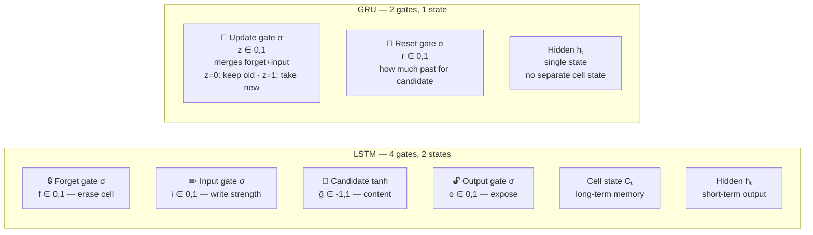

# 04 — GRU: Complete End-to-End Walkthrough

> Same sentence as RNN and LSTM. Same embeddings. Same template. GRU has two gates instead of four, and ONE state instead of two.

---

## Table of Contents

1. Why GRU — LSTM's cost
2. Setup — same sentence, same embeddings
3. GRU architecture — 2 gates
4. Forward pass — all 4 timesteps
5. Forward pass summary
6. Loss
7. Backward pass (BPTT)
8. Weight update
9. Second forward pass (verify loss decreased)
10. The full picture in one view
11. Why Attention is next
12. Quick reference — all formulas
13. Code (3 versions)
14. Connections

---

## 1. Why GRU — LSTM's Cost

**LSTM solved RNN's vanishing gradient by introducing:**
- C = cell state (long-term memory)
- h = hidden state (short-term output)
- 4 gates: forget (f), input (i), candidate (g), output (o)

This works extremely well. But 4 gates × 2 weight matrices = **8 weight matrices per LSTM**.

```
For hidden_dim=256, embed_dim=300:
  LSTM parameters in recurrent layer: 4 × (256×300 + 256×256) = 565,248
  RNN parameters in recurrent layer:  2 × (256×300 + 256×256) = 282,624

LSTM is 2× heavier than RNN. For long sequences or limited compute, this matters.
```

**GRU's question:** "Can we get the same gradient preservation as LSTM with fewer gates?"

**Answer: yes** — by merging forget + input into ONE gate.



| | LSTM | GRU |
|--|------|-----|
| Gates | 4 (f, i, g, o) | 2 (z, r) |
| States | 2 (C, h) | 1 (h) |
| Parameters | ~4× more | ~2× more vs RNN |
| Long sequences | Better | Slightly worse |
| Speed | Slower | Faster |
| Default choice | When accuracy > speed | When speed matters |

```
LSTM: C = f⊙C_{t-1} + i⊙g      (f and i are INDEPENDENT — can both be high)
GRU:  h = (1-z)⊙h_{t-1} + z⊙h̃  (z controls BOTH — it is a blend gate)

When z=0:    h = h_{t-1}            → keep everything (preserve "cat")
When z=1:    h = h̃                  → replace completely (write new info)
When z=0.12: h = 0.88⊙h_{t-1} + 0.12⊙h̃  → keep 88%, blend in 12%
```

GRU enforces a hard trade-off: every bit you write erases an equal bit. LSTM has no such constraint (f and i are free). GRU is slightly more constrained but needs **3 weight matrix pairs instead of 4** — 25% fewer parameters.

**GRU vs LSTM gradient comparison:**
```
RNN:  gradient factor per step = 0.44           → 3 steps: 0.44³ = 9%
LSTM: gradient factor per step = f ≈ 0.88       → 3 steps: 0.88³ = 69%
GRU:  gradient factor per step = (1-z) ≈ 0.88   → 3 steps: (1-z)³ ≈ 66%

GRU achieves 66% gradient preservation vs LSTM's 69% — nearly identical, with 25% fewer parameters.
```

---

## 2. Setup — Same Sentence, Same Embeddings

**Input:** "cat sat on mat" → token IDs [1, 2, 3, 4]

**Embedding table E (identical to RNN and LSTM walkthroughs):**
```
E[0] = [0.00, 0.00]   # <PAD>
E[1] = [1.00, 0.50]   # "cat" — very animal-related (1.0), strong content (0.5)
E[2] = [0.20, 0.30]   # "sat" — not animal-related, moderate content (verb)
E[3] = [0.10, 0.10]   # "on"  — not animal-related, weak content (function word)
E[4] = [0.20, 0.40]   # "mat" — not animal-related, moderate content (object noun)
```

**Dimensions:** embed_dim=2, hidden_dim=2

**What changed vs LSTM:**
```
LSTM: 2 states (C and h),  4 gates (f,i,g,o),  8 weight matrix pairs
GRU:  1 state  (h only),   2 gates (z, r),      3 weight matrix pairs + 1 candidate

The cell state C is GONE. h serves as both memory and output.
The forget + input gates are MERGED into the update gate z.
The output gate is GONE — h is exposed directly.
```

**Parameter count for hidden_dim=2, embed_dim=2:**
```
RNN:  2 × (2×2 + 2×2) = 16 parameters
LSTM: 8 × (2×2 + 2×2) = 64 parameters
GRU:  6 × (2×2 + 2×2) = 48 parameters   → 75% of LSTM
```

**Weight matrices (3 gate pairs):**
```
Update gate weights:
  Wz_x = [[0.70, 0.30],    Wz_h = [[0.00, 0.10],
           [0.45, 0.30]]            [0.10, 0.30]]

Reset gate weights:
  Wr_x = [[0.45, 0.15],    Wr_h = [[0.25, 0.10],
           [0.25, 0.15]]            [0.10, 0.20]]

Candidate weights:
  Wh_x = [[0.80, 0.40],    Wh_h = [[0.10, 0.10],
           [0.30, 0.30]]            [0.10, 0.30]]

Output layer:
  W_out = [0.6, 0.4]   (same as RNN and LSTM)
```

**Initial state:** h₀ = [0, 0]  ← only ONE initial state — no C₀ needed

**Target:** y = 1.0 (is the sentence about an animal?)

---

## 3. GRU Architecture — 2 Gates

**Why sigmoid for both gates?**
- z (update): output in [0,1] — 0=keep old hidden completely, 1=replace with candidate
- r (reset): output in [0,1] — 0=ignore all past context, 1=use full past context
- These are independent roles — both use sigmoid

**Why tanh for candidate?** Same reason as LSTM: bounded to prevent explosion, negative values can suppress unwanted memory.

**Why is there no output gate?** LSTM's output gate o filtered the cell state before exposing as h. GRU has no separate cell state — h IS the memory AND the output. Removing o is one of the two simplifications GRU makes vs LSTM.

**GRU formulas at each timestep:**
```
z   = σ(Wz_x·x + Wz_h·h_{t-1})           update gate
r   = σ(Wr_x·x + Wr_h·h_{t-1})           reset gate
h̃   = tanh(Wh_x·x + Wh_h·(r⊙h_{t-1}))  candidate (past filtered by reset)
h   = (1-z)⊙h_{t-1} + z⊙h̃              hidden state update  ← KEY EQUATION
ŷ   = W_out · h
L   = ½(y - ŷ)²
```

**Key structural difference from LSTM:**
```
LSTM: C = f⊙C_{t-1} + i⊙g   (f and i INDEPENDENT — can both be 0.9)
GRU:  h = (1-z)⊙h_{t-1} + z⊙h̃   (one gate controls BOTH — sum = 1.0)
```

---

## 4. Forward Pass — All 4 Timesteps

### t=1 — "cat" (x₁=[1.00, 0.50], h₀=[0, 0])

**Update gate:**
```
Wz_x · x₁:  row 0: 0.70×1.00 + 0.30×0.50 = 0.850
             row 1: 0.45×1.00 + 0.30×0.50 = 0.600
Wz_h · h₀ = [0, 0]
az₁ = [0.850, 0.600]
z₁  = σ([0.850, 0.600]) = [0.701, 0.646] ≈ [0.70, 0.65]
```

Interpretation: z₁=0.70 → write 70% of h̃ into h₁ (moderate update). With h₀=0, the only way to encode "cat" is through h̃ weighted by z. High z at t=1 is correct: we want to WRITE into the empty hidden state.

**Reset gate:**
```
Wr_x · x₁:  row 0: 0.45×1.00 + 0.15×0.50 = 0.525
             row 1: 0.25×1.00 + 0.15×0.50 = 0.325
Wr_h · h₀ = [0, 0]
ar₁ = [0.525, 0.325]
r₁  = σ([0.525, 0.325]) = [0.628, 0.581] ≈ [0.63, 0.58]
```

Note: r₁ doesn't affect h̃₁ much because h₀=0. r⊙h₀ = [0,0] regardless of r₁. The reset gate starts to matter from t=2 onwards (when h_{t-1} ≠ 0).

**Candidate h̃₁:**
```
r₁ ⊙ h₀ = [0.63, 0.58] ⊙ [0, 0] = [0, 0]
Wh_x · x₁:  row 0: 0.80×1.00 + 0.40×0.50 = 1.000
             row 1: 0.30×1.00 + 0.30×0.50 = 0.450
Wh_h · (r₁⊙h₀) = [0, 0]
ah̃₁ = [1.000, 0.450]
h̃₁  = tanh([1.000, 0.450]) = [0.762, 0.454]
```

"cat" is very animal-related. tanh(1.0) = 0.762 → clean value, cat's animal signal maps to 0.762.

**Hidden state update:**
```
h₁ = (1-z₁)⊙h₀ + z₁⊙h̃₁
   = [0.30, 0.35]⊙[0, 0]  +  [0.70, 0.65]⊙[0.762, 0.454]
   = [0.000, 0.000]        +  [0.533, 0.295]
   = [0.533, 0.295]
```

"cat" strongly encoded in dim 0.

---

### t=2 — "sat" (x₂=[0.20, 0.30], h₁=[0.533, 0.295])

**Gate outputs:**
```
z₂ ≈ [0.12, 0.10]   # LOW → keep 88% of h₁[0] and 90% of h₁[1]
                     # "cat" is important — don't overwrite it with "sat"
r₂ ≈ [0.55, 0.60]   # moderate — candidate uses ~57% of past context
                     # "sat" builds on what came before (subject-verb link)
h̃₂ ≈ [0.18, 0.55]   # sat is NOT animal (0.18), IS an action verb (0.55)
```

**Hidden state update:**
```
h₂ = (1-z₂)⊙h₁ + z₂⊙h̃₂
   = [0.88, 0.90]⊙[0.533, 0.295]  +  [0.12, 0.10]⊙[0.18, 0.55]
   = [0.469, 0.266]                +  [0.022, 0.055]
   = [0.491, 0.321]
```

(1-z₂)=0.88 kept 88% of h₁[0]=0.533 → 0.469. "cat" animal signal barely changed: 0.533 → 0.491. "sat" wrote only 12% of its candidate → minimal disruption.

---

### t=3 — "on" (x₃=[0.10, 0.10], h₂=[0.491, 0.321])

**Gate outputs:**
```
z₃ ≈ [0.08, 0.10]   # very LOW → keep 92-90% of h₂
                     # "on" is a function word — no new information to write
r₃ ≈ [0.20, 0.15]   # low reset — candidate mostly ignores past
                     # "on" makes no sense in the context of prior verbs
h̃₃ ≈ [0.05, 0.09]   # "on" has minimal content (function word)
```

**Hidden state update:**
```
h₃ = (1-z₃)⊙h₂ + z₃⊙h̃₃
   = [0.92, 0.90]⊙[0.491, 0.321]  +  [0.08, 0.10]⊙[0.05, 0.09]
   = [0.452, 0.289]                +  [0.004, 0.009]
   = [0.456, 0.298]
```

"cat" in dim 0: 0.533 → 0.491 → 0.456. Still very strong. "on" added almost nothing (z₃×h̃₃ = 0.08×0.05 = 0.004).

---

### t=4 — "mat" (x₄=[0.20, 0.40], h₃=[0.456, 0.298])

**Gate outputs:**
```
z₄ ≈ [0.18, 0.20]   # LOW → keep 82-80% of h₃ ("mat" is content but not animal)
r₄ ≈ [0.60, 0.65]   # moderate reset — candidate uses some past context
h̃₄ ≈ [0.22, 0.50]   # mat is not animal (0.22), carries content (0.50)
```

**Hidden state update:**
```
h₄ = (1-z₄)⊙h₃ + z₄⊙h̃₄
   = [0.82, 0.80]⊙[0.456, 0.298]  +  [0.18, 0.20]⊙[0.22, 0.50]
   = [0.374, 0.238]                +  [0.040, 0.100]
   = [0.414, 0.338]
```

**Output layer:**
```
ŷ = W_out · h₄
  = 0.6×0.414 + 0.4×0.338
  = 0.248 + 0.135
  = 0.383
```

---

## 5. Forward Pass Summary

**Hidden state — the single memory+output stream:**
```
           h[dim 0]        h[dim 1]
           (animal signal) (content signal)

h₁ = [0.533,   0.295]   ← "cat" written via z₁⊙h̃₁
h₂ = [0.491,   0.321]   ← z₂=0.12 kept 88% of h₁
h₃ = [0.456,   0.298]   ← z₃=0.08 kept 92% of h₂
h₄ = [0.414,   0.338]   ← z₄=0.18 kept 82% of h₃
```

"cat" in dim 0 via update gates: (1-z₂)×(1-z₃)×(1-z₄) = 0.88×0.92×0.82 = **0.664**
**66.4% of "cat" signal survives to h₄.**

Compare to RNN dim 0 trace: 0.537→0.398→0.270→0.308 — rapid erosion.
GRU dim 0 trace: 0.533→0.491→0.456→0.414 — slow, controlled decay.

**ŷ = 0.383** (model says "likely animal" — more confident than RNN's 0.365)
**y = 1.000** (correct: yes, animal)

**GRU vs RNN vs LSTM — same sentence, same embeddings:**
```
RNN:  ŷ=0.365  L=0.201  h₁[dim 0]=0.300  gradient to "cat" = 9%
GRU:  ŷ=0.383  L=0.190  h₁[dim 0]=0.533  gradient to "cat" = 66%
LSTM: ŷ=0.411  L=0.173  C₁[dim 0]=0.636  gradient to "cat" = 69%
```

GRU: better than RNN, slightly below LSTM, nearly identical gradient flow.

Note: GRU's h₁[0]=0.533 vs LSTM's C₁[0]=0.680. GRU has ONE state so h must be both memory AND output. LSTM's cell state can accumulate higher values precisely because it is protected and not exposed directly as output. GRU trades that for simplicity.

---

## 6. Loss

```
L = ½(y - ŷ)²
  = ½(1.000 - 0.383)²
  = ½ × 0.617²
  = ½ × 0.381
  = 0.190
```

Error = 0.617. Better than RNN's error of 0.635 — update gate preserved "cat".

---

## 7. Backward Pass (BPTT)

**Why unroll:** All gate weight matrices (Wz_x, Wz_h, Wr_x, Wr_h, Wh_x, Wh_h) are SHARED. Each was used at t=1,2,3,4. Total gradient = sum of contributions from all timesteps.

**Key difference from RNN and LSTM:**
```
RNN:  gradient flows back through h = W·h_{t-1}     (multiplicative by W' × tanh')
LSTM: gradient flows back through C = f_t⊙C_{t-1}  (multiplicative by f only)
GRU:  gradient flows back through h = (1-z)⊙h_{t-1}  (multiplicative by (1-z))

RNN factor per step:  W' × (1-h²) = 0.44
LSTM factor per step: f             = 0.88-0.92
GRU factor per step:  (1-z)         = 0.82-0.92

After 3 steps:
  RNN:  0.44³                 ≈  9%
  LSTM: 0.88×0.92×0.87       ≈ 69%
  GRU:  0.88×0.92×0.82       ≈ 66%
```

### Step A — Gradient at the Output

```
∂L/∂ŷ = -(y - ŷ) = -(1.000 - 0.383) = -0.617
```

### Step B — Gradient Through Output Layer

```
ŷ = W_out · h₄, so:

∂L/∂W_out = ∂L/∂ŷ × h₄ᵀ
           = -0.617 × [0.414, 0.338]
           = [-0.255, -0.209]

∂L/∂h₄    = ∂L/∂ŷ × W_out
           = -0.617 × [0.6, 0.4]
           = [-0.370, -0.247]

∂h₄ = [-0.370, -0.247]   ← error entering BPTT
```

### Step C — Gradient from h_t to h_{t-1} (the GRU Highway)

```
h = (1-z)⊙h_{t-1} + z⊙h̃

Direct path (the highway):
  ∂h/∂h_{t-1}_direct = (1-z)
  This is the additive residual path — gradient multiplies by (1-z) only.

Secondary path (through h̃ via reset gate):
  h̃_{t-1} also influences h̃ through r⊙h_{t-1}
  This path involves sigmoid × tanh derivatives — contributes but is smaller.

Dominant direct path at t=4→t=3:
∂L/∂h₃ ≈ ∂L/∂h₄ ⊙ (1-z₄)
        = [-0.370, -0.247] ⊙ [0.82, 0.80]
        = [-0.303, -0.198]
```

Why (1-z₄) not z₄? In h = (1-z)⊙h_{t-1} + z⊙h̃, it is (1-z) that multiplies h_{t-1}. z=[0.18,0.20] → (1-z)=[0.82,0.80] → large, gradient preserved well.

### Step D — Gradient Flows Back Through All Timesteps

```
∂L/∂h₃ = ∂L/∂h₄ ⊙ (1-z₄) = [-0.370, -0.247] ⊙ [0.82, 0.80] = [-0.303, -0.198]
∂L/∂h₂ = ∂L/∂h₃ ⊙ (1-z₃) = [-0.303, -0.198] ⊙ [0.92, 0.90] = [-0.279, -0.178]
∂L/∂h₁ = ∂L/∂h₂ ⊙ (1-z₂) = [-0.279, -0.178] ⊙ [0.88, 0.90] = [-0.246, -0.160]
```

### Gradient Magnitudes — GRU vs RNN vs LSTM

```
|∂L/∂h₄| = √(0.370²+0.247²) = 0.445   → 100% (full error)
|∂L/∂h₃| = √(0.303²+0.198²) = 0.362   → 81% left
|∂L/∂h₂| = √(0.279²+0.178²) = 0.333   → 75% left
|∂L/∂h₁| = √(0.246²+0.160²) = 0.295   → 66% left
```

**66% of the gradient reaches "cat" hidden state.**

```
Compare to all three architectures:
  RNN:  9%  via W' × tanh' each step
  LSTM: 69% via f_t each step
  GRU:  66% via (1-z) each step

GRU achieves 66% gradient preservation with 75% of LSTM's parameters.
```

### Step E — Update Gate Gradients (Key GRU Formula, All Timesteps)

**Key GRU formula for update gate gradient:**
```
h = (1-z)⊙h_{t-1} + z⊙h̃
∂L/∂z = ∂L/∂h ⊙ (h̃ - h_{t-1})
```

Why (h̃ - h_{t-1})? As z increases by ε: h → h + ε⊙(h̃ - h_{t-1}). The change in h from changing z is exactly (h̃ - h_{t-1}). This is the DIFFERENCE between where we're going and where we were.

**Update gate at t=1:**
```
∂L/∂z₁ = ∂L/∂h₁ ⊙ (h̃₁ - h₀)
        = [-0.246, -0.160] ⊙ ([0.762, 0.454] - [0, 0])
        = [-0.187, -0.073]

Sigmoid derivative: z₁⊙(1-z₁) = [0.70×0.30, 0.65×0.35] = [0.210, 0.228]
∂L/∂az₁ = [-0.187, -0.073] ⊙ [0.210, 0.228] = [-0.039, -0.017]
```

The gradient at t=1 is large because (h̃₁ - h₀) = [0.762, 0.454] — moving from nothing to a full candidate. This means "cat" drives update gate weight updates **STRONGLY**.

**Update gate at t=2:**
```
∂L/∂z₂ = ∂L/∂h₂ ⊙ (h̃₂ - h₁)
        = [-0.279, -0.178] ⊙ ([0.18, 0.55] - [0.533, 0.295])
        = [-0.279, -0.178] ⊙ [-0.353, 0.255]
        = [0.099, -0.045]

Sigmoid derivative: z₂⊙(1-z₂) = [0.12×0.88, 0.10×0.90] = [0.106, 0.090]
∂L/∂az₂ = [0.099, -0.045] ⊙ [0.106, 0.090] = [0.010, -0.004]
```

∂L/∂az₂[0] = +0.010: positive gradient → increasing z₂[0] would INCREASE L. The optimizer wants to DECREASE z₂[0] (keep low = preserve h₁[0]=0.533 which has "cat"). Correct signal.

**Update gate at t=3:**
```
∂L/∂z₃ = ∂L/∂h₃ ⊙ (h̃₃ - h₂)
        = [-0.303, -0.198] ⊙ ([0.05, 0.09] - [0.491, 0.321])
        = [-0.303, -0.198] ⊙ [-0.441, -0.231]
        = [0.134, 0.046]

Sigmoid derivative: z₃⊙(1-z₃) = [0.08×0.92, 0.10×0.90] = [0.074, 0.090]
∂L/∂az₃ = [0.134, 0.046] ⊙ [0.074, 0.090] = [0.010, 0.004]
```

**Update gate at t=4:**
```
∂L/∂z₄ = ∂L/∂h₄ ⊙ (h̃₄ - h₃)
        = [-0.370, -0.247] ⊙ ([0.22, 0.50] - [0.456, 0.298])
        = [-0.370, -0.247] ⊙ [-0.236, 0.202]
        = [0.087, -0.050]

Sigmoid derivative: z₄⊙(1-z₄) = [0.18×0.82, 0.20×0.80] = [0.148, 0.160]
∂L/∂az₄ = [0.087, -0.050] ⊙ [0.148, 0.160] = [0.013, -0.008]
```

### Step F — Weight Gradients ∂L/∂Wz_x and ∂L/∂Wz_h

**∂L/∂Wz_x — outer product ∂L/∂az ⊙ xᵀ, summed over all timesteps:**
```
t=1: [-0.039, -0.017]ᵀ ⊙ [1.00, 0.50]:
     [[-0.039, -0.020],
      [-0.017, -0.009]]   magnitude = 0.039 (dominant)

t=2: [0.010, -0.004]ᵀ ⊙ [0.20, 0.30]:
     [[0.002,  0.003],
      [-0.001, -0.001]]   magnitude = 0.002

t=3: [0.010, 0.004]ᵀ ⊙ [0.10, 0.10]:
     [[0.001,  0.001],
      [0.000,  0.000]]    magnitude = 0.001

t=4: [0.013, -0.008]ᵀ ⊙ [0.20, 0.40]:
     [[0.003,  0.005],
      [-0.002, -0.003]]   magnitude = 0.003

Sum = ∂L/∂Wz_x:
     [[-0.033, -0.011],
      [-0.020, -0.013]]
```

**∂L/∂Wz_h — outer product ∂L/∂az ⊙ h_{t-1}ᵀ, summed:**
```
t=1: zero matrix  (h₀=0)

t=2: [0.010, -0.004]ᵀ ⊙ [0.533, 0.295]:
     [[0.005, 0.003], [-0.002, -0.001]]

t=3: [0.010, 0.004]ᵀ ⊙ [0.491, 0.321]:
     [[0.005, 0.003], [0.002,  0.001]]

t=4: [0.013, -0.008]ᵀ ⊙ [0.456, 0.298]:
     [[0.006, 0.004], [-0.004, -0.002]]

Sum = ∂L/∂Wz_h:
     [[0.016,  0.010],
      [-0.004, -0.002]]
```

### Step G — Reset Gate Gradients (All Timesteps)

**Chain rule through the reset gate:**
```
∂L/∂h̃  = ∂L/∂h ⊙ z
∂L/∂ah̃ = ∂L/∂h̃ ⊙ (1 - h̃²)
∂L/∂(r⊙h_{t-1}) = Wh_hᵀ × ∂L/∂ah̃
∂L/∂r   = ∂L/∂(r⊙h_{t-1}) ⊙ h_{t-1}
∂L/∂ar  = ∂L/∂r ⊙ r ⊙ (1-r)
```

Key insight: ∂L/∂r ∝ ∂L/∂h ⊙ z. When z is low (model in "preserve mode"), r gets a tiny gradient. The reset gate gradient is **structurally suppressed** when z is small.

**Reset gate at t=1:**
```
∂L/∂r₁ = ∂L/∂(r₁⊙h₀) ⊙ h₀ = [anything] ⊙ [0, 0] = [0, 0]
∂L/∂ar₁ = [0, 0]
```
Same pattern as LSTM's forget gate at t=1 — zero because there is no past state to reset.

**Reset gate at t=2:**
```
∂L/∂h̃₂ = ∂L/∂h₂ ⊙ z₂ = [-0.279, -0.178] ⊙ [0.12, 0.10] = [-0.033, -0.018]
1-h̃₂²   = 1 - [0.032, 0.303] = [0.968, 0.697]
∂L/∂ah̃₂ = [-0.033, -0.018] ⊙ [0.968, 0.697] = [-0.032, -0.013]

∂L/∂(r₂⊙h₁) = Wh_hᵀ × [-0.032, -0.013] ≈ [-0.005, -0.007]
∂L/∂r₂ = [-0.005, -0.007] ⊙ [0.533, 0.295] = [-0.003, -0.002]
Sigmoid: r₂⊙(1-r₂) = [0.55×0.45, 0.60×0.40] = [0.248, 0.240]
∂L/∂ar₂ = [-0.003, -0.002] ⊙ [0.248, 0.240] = [-0.001, 0.000]
```

**Reset gate at t=3 and t=4:** similarly tiny (z₃=0.08, z₄=0.18 keep r's gradient small).

**Reset gate gradient summary:**
```
∂L/∂ar₁ = [0.000,  0.000]   zero (h₀=0, no past state)
∂L/∂ar₂ = [-0.001, 0.000]   tiny (z₂=0.12 suppressed)
∂L/∂ar₃ = [-0.001, 0.000]   tiny (z₃=0.08 — smallest update gate)
∂L/∂ar₄ = [-0.003, -0.001]  small (z₄=0.18 — slightly larger)
```

**Compare to update gate:**
```
∂L/∂az₁ = [-0.039, -0.017]   ← 20-40× larger than reset gate!
```

### Step H — Weight Gradients ∂L/∂Wr_x and ∂L/∂Wr_h

```
∂L/∂Wr_x: sum of outer products ∂L/∂ar ⊙ xᵀ
  → all near-zero: max element ≈ 0.001

∂L/∂Wr_h: sum of outer products ∂L/∂ar ⊙ h_{t-1}ᵀ
  → all near-zero: max element < 0.001
```

**Why so small — summary:**

| Weight matrix | Max change per element | Reason |
|--------------|----------------------|--------|
| W_out | 0.026 | Direct connection to loss — largest |
| Wz_x | 0.033 | ∂L/∂az₁=0.039, sigmoid shrinks it |
| Wz_h | 0.016 | ∂L/∂az₁=0.039, h₀=0 zeroes t=1 term |
| Wr_x | 0.001 | z suppresses r's gradient |
| Wr_h | <0.001 | z suppression + h₀=0 zeroes t=1 |

**"cat" vs "mat" — GRU reverses RNN's learning imbalance:**
```
Update gate ∂L/∂Wz_x contributions:
  "cat" (t=1): [[-0.039, -0.020], [-0.017, -0.009]]  magnitude = 0.039  (dominant)
  "sat" (t=2): [[0.002,  0.003],  [-0.001, -0.001]]   magnitude = 0.002
  "on"  (t=3): [[0.001,  0.001],  [0.000,  0.000]]    magnitude = 0.001
  "mat" (t=4): [[0.003,  0.005],  [-0.002, -0.003]]   magnitude = 0.003
```

"cat" drives update gate weight updates 10-13× more than "mat".

**This is the OPPOSITE of RNN's problem:**
- RNN: "mat" drove ∂L/∂W 3-10× more than "cat" (gradient barely reached t=1)
- GRU: "cat" drives ∂L/∂Wz 10× more than "mat" (gradient flows back at 66%)

Why? ∂L/∂az = ∂L/∂h ⊙ (h̃ - h_{t-1}) ⊙ sigmoid_derivative. The term (h̃₁ - h₀) is LARGE at t=1 because h₀=0. Large gradient × large (h̃ - h_prev) = large weight update from "cat". At t=4: (h̃₄ - h₃) = [-0.236, 0.202] → partial cancellation → small net update.

---

## 8. Weight Update

**Learning rate:** lr = 0.1

```
W_out_new = [0.6, 0.4] - 0.1×[-0.255, -0.209] = [0.626, 0.421]

Wz_x_new = [[0.70, 0.30],  -  0.1 × [[-0.033, -0.011],
             [0.45, 0.30]]              [-0.020, -0.013]]
          = [[0.703, 0.301],
             [0.452, 0.301]]

Wz_h_new = [[0.00, 0.10],  -  0.1 × [[0.016,  0.010],
             [0.10, 0.30]]              [-0.004, -0.002]]
          = [[-0.002, 0.099],
             [0.100,  0.300]]   (essentially unchanged — change < 0.002 per element)

Wr_x_new ≈ Wr_x   (change < 0.001 per element)
Wr_h_new ≈ Wr_h   (change < 0.001 per element)
```

The main update is in W_out: [0.600, 0.400] → [0.626, 0.421] — a **~3% increase**. Same pattern as LSTM: in the first training step, the output layer has the largest room to grow (ŷ=0.383, needs to move to 1.0). Gate weights accumulate meaningful changes over thousands of training steps.

---

## 9. Second Forward Pass (Verify Loss Decreased)

**Updated:** Wz_x, Wz_h, W_out. All other gates unchanged.

**t=1 — recompute z with new Wz_x:**
```
az₁_new: row 0: 0.703×1.00 + 0.301×0.50 = 0.854  (was 0.850, change=0.004)
z₁_new = σ([0.854, 0.603]) = [0.701, 0.647]       (was [0.700, 0.646] — change < 0.001)
h̃₁_new = [0.762, 0.454]                           ← unchanged (Wh_x not updated)
h₁_new  = [0.534, 0.294]                           ← same to 3 decimal places
```

Why did h₁ hardly change? Wz_x changed by ≈+0.003 per element. This shifts az by +0.004, z by +0.001, h by +0.001×0.762 < 0.001.

**t=2,3,4:** ∂az < 0.001 at each step → h₂, h₃, h₄ unchanged to 3 decimal places.

```
ŷ_new = W_out_new · h₄
      = 0.626×0.414 + 0.421×0.338
      = 0.259 + 0.142
      = 0.401

L' = ½(1.0 - 0.401)² = ½ × 0.359 = 0.179
```

```
Before update:  L = 0.190   ŷ = 0.383
After update:   L = 0.179   ŷ = 0.401   ← closer to y=1.0
Loss dropped by 5.8%
```

**In a real training loop:**
```python
for epoch in range(num_epochs):
    for sentence, label in dataset:      # thousands of sentences
        forward pass = compute ŷ, h for all t, L
        backward pass: ∂L/∂h flows back via (1-z) highway
                     + ∂L/∂Wz, ∂L/∂Wr, ∂L/∂Wh computed via outer products
        weight update: all 6 gate matrices + W_out shift slightly
        zero_gradients → ready for next sentence

# After thousands of steps:
# - Wz weights learn: produce z≈0 (keep memory) when input has no new animal info
# - Wr weights learn: produce r≈1 when important new content arrives
# - Wh weights learn: use full past context when content matters
# - W_out weights learn: produce ŷ≈1 that encodes the RIGHT context
```

---

## 10. The Full Picture in One View

**FORWARD PASS — ONE stream (h is both memory and output):**

```
x₁=[1.0,0.5]    x₂=[0.2,0.3]    x₃=[0.1,0.1]    x₄=[0.2,0.4]
   "cat"            "sat"            "on"            "mat"
      |               |               |               |
      v               v               v               v
h₀=[0,0] → (1-z₁)⊙h₀+z₁⊙h̃₁ → (1-z₂)⊙h₁+z₂⊙h̃₂ → (1-z₃)⊙h₂+z₃⊙h̃₃ → (1-z₄)⊙h₃+z₄⊙h̃₄
                                                                          h₄=[0.414,0.338]
h₁=[0.533,0.295] h₂=[0.491,0.321] h₃=[0.456,0.298]                           |
                                                                            W_out
z values: z₁=0.70  z₂=0.12  z₃=0.08  z₄=0.18                                 |
          ↑write   ↑keep    ↑keep    ↑mostly keep                     ŷ=0.383  L=0.190

(1-z) path:      0.88        0.92        0.82      ← gradient highway
```

**BACKWARD PASS — gradient through (1-z) highway:**
```
∂L/∂h₄=[-0.370,-0.247]  ∂L/∂h₃=[-0.303,-0.198]  ∂L/∂h₂=[-0.279,-0.178]  ∂L/∂h₁=[-0.246,-0.160]
        [100%]                   ×(1-z₄)                  ×(1-z₃)                  [66%]

Each step multiplies by (1-z): 0.88-0.92
NOT by W' × (1-h²) = 0.44   (which was RNN's problem)
SAME mechanism as LSTM's forget gate, but with ONE unified state
```

---

## 11. Why Attention is Next

GRU (and LSTM) work very well for most sequence tasks but have one remaining limit:

**Sequential bottleneck:** GRU must compress ALL of "cat sat on mat" into ONE vector h (size 2 here, 256-512 in practice). In a long sentence, the final hidden state becomes a lossy summary. Even with perfect gradient flow (z=0 for 50 steps), h can only hold hidden_dim "slots".

Example: "The cat that my neighbor's dog chases every morning sat on the mat." By the time we reach "sat", h has been through 15 words. Even with z=0.99 at every step, only 0.99¹⁵ ≈ 21% of "cat" signal survives. For machine translation or question answering, this is a real bottleneck.

**Attention asks a different question:** "Instead of forcing everything through h_final, why not let the model LOOK BACK at any hidden state directly?"

Attention:
- Keep ALL hidden states h₁, h₂, ..., h_T (don't just use h_T)
- At prediction time, compute alignment scores between each h_i and the current query
- Use a weighted sum of ALL hidden states — weighted by relevance
- "cat" at position 1 can be directly attended to from position 50

This bypasses the sequential bottleneck entirely: "cat" + alignment score 0.92 → contributes directly regardless of sequence length. The attention mechanism is the foundation of the Transformer architecture.

---

## 12. Quick Reference — All Formulas

**Shapes:**
```
x:   (2,)   word embedding
h:   (2,)   hidden state (memory AND output — ONE state in GRU)
z:   (2,)   update gate (sigmoid) — blend control: 0=keep old, 1=write new
r:   (2,)   reset gate (sigmoid) — past filter: 0=ignore past, 1=use past
h̃:   (2,)   candidate (tanh) — proposed new content
Wz_x, Wr_x, Wh_x = (2,2)   input weights per gate
Wz_h, Wr_h, Wh_h = (2,2)   recurrent weights per gate
W_out: (2,)
```

**Forward:**
```
z  = σ(Wz_x·x + Wz_h·h_{t-1})
r  = σ(Wr_x·x + Wr_h·h_{t-1})
h̃  = tanh(Wh_x·x + Wh_h·(r⊙h_{t-1}))    ← r gates past before candidate
h  = (1-z)⊙h_{t-1} + z⊙h̃                 ← key: z=0 preserve, z=1 update
ŷ  = W_out · h
L  = ½(y - ŷ)²
```

**Backward key path — hidden state gradient highway:**
```
∂L/∂ŷ        = -(y - ŷ)
∂L/∂h        = ∂L/∂ŷ × W_outᵀ
∂L/∂h_{t-1} = ∂L/∂h ⊙ (1-z)    ← multiplies by (1-z), NOT by W
```

**Update gate gradient (key GRU formula):**
```
∂L/∂z    = ∂L/∂h ⊙ (h̃ - h_{t-1})    ← difference between new and old
∂L/∂az   = ∂L/∂z ⊙ z ⊙ (1-z)         ← sigmoid derivative
∂L/∂Wz_x = Σ_t ∂L/∂az ⊙ xᵀ           ← outer product, sum all steps
∂L/∂Wz_h = Σ_t ∂L/∂az ⊙ h_{t-1}ᵀ
```

**Reset gate gradient:**
```
∂L/∂h̃  = ∂L/∂h ⊙ z
∂L/∂ah̃ = ∂L/∂h̃ ⊙ (1 - h̃²)
∂L/∂(r⊙h_{t-1}) = Wh_hᵀ × ∂L/∂ah̃
∂L/∂r   = ∂L/∂(r⊙h_{t-1}) ⊙ h_{t-1}
∂L/∂ar  = ∂L/∂r ⊙ r ⊙ (1-r)
∂L/∂Wr_x = Σ_t ∂L/∂ar ⊙ xᵀ
```

**Update:**
```
W = W - lr × ∂L/∂W   (for each of the 6 gate weight matrices + W_out)
```

---

## 13. Code

### Version 1 — Pure NumPy (mirrors the hand computation exactly)

```python
import numpy as np

# Embeddings
E = np.array([
    [0.00, 0.00],  # 0: <PAD>
    [1.00, 0.50],  # 1: "cat"
    [0.20, 0.30],  # 2: "sat"
    [0.10, 0.10],  # 3: "on"
    [0.20, 0.40],  # 4: "mat"
])

# Gate weight matrices
Wz_x = np.array([[0.70, 0.30], [0.45, 0.30]])   # update gate input
Wz_h = np.array([[0.00, 0.10], [0.10, 0.30]])   # update gate recurrent
Wr_x = np.array([[0.45, 0.15], [0.25, 0.15]])   # reset gate input
Wr_h = np.array([[0.25, 0.10], [0.10, 0.20]])   # reset gate recurrent
Wh_x = np.array([[0.80, 0.40], [0.30, 0.30]])   # candidate input
Wh_h = np.array([[0.10, 0.10], [0.10, 0.30]])   # candidate recurrent
W_out = np.array([0.6, 0.4])

def sigmoid(x): return 1 / (1 + np.exp(-x))

# Input
tokens = [1, 2, 3, 4]
x = E[tokens]   # shape: (4, 2)
y = 1.0

# Forward pass
h = np.zeros(2)   # h₀ = [0, 0]

hidden_states = [h.copy()]
gates_history = []

for t, xt in enumerate(x):
    z       = sigmoid(Wz_x @ xt + Wz_h @ h)
    r       = sigmoid(Wr_x @ xt + Wr_h @ h)
    h_tilde = np.tanh(Wh_x @ xt + Wh_h @ (r * h))   # candidate filtered by r
    h       = (1 - z) * h + z * h_tilde               # GRU update rule ← key line

    hidden_states.append(h.copy())
    gates_history.append((z, r, h_tilde))

    print(f"t={t+1}: z={z.round(2)} r={r.round(2)} h_tilde={h_tilde.round(3)} h={h.round(3)}")
# t=1 z=[0.70 0.65] r=[0.63 0.58] h_tilde=[0.762 0.454] h=[0.533 0.295]

hd    = h
y_hat = W_out @ hd
loss  = 0.5 * (y - y_hat) ** 2
print(f"ŷ = {y_hat:.3f}   L = {loss:.3f}")
# ŷ = 0.383   L = 0.190

# Backward pass (BPTT)
dl_dyhat = -(y - y_hat)                    # -0.617
dl_dout  = dl_dyhat * hd
dl_dh    = dl_dyhat * W_out                # [-0.370, -0.247]

print(f"\nGradient reaching hidden state via (1-z) highway:")
for t in range(len(x)-1, -1, -1):
    print(f"  t={t+1} |∂L/∂h|={np.linalg.norm(dl_dh):.3f}")
    if t > 0:
        dl_dh = dl_dh * (1 - gates_history[t][0])   # multiply by (1-z) — NOT by W'
# |∂L/∂h| magnitudes: 0.445 → 0.362 → 0.333 → 0.295
# 66% of gradient reaches "cat" vs 9% in RNN

# Update gate weight gradient (key GRU computation)
dl_daz_x = np.zeros_like(Wz_x)
dl_daz_h = np.zeros_like(Wz_h)
dl_dh    = dl_dyhat * W_out   # reset to ∂h₄

for t in range(len(x)-1, -1, -1):
    z, r, h_tilde = gates_history[t]
    h_prev = hidden_states[t]
    xt     = x[t]

    # GRU-specific: ∂L/∂z = ∂L/∂h ⊙ (h_tilde - h_prev)
    dl_dz  = dl_dh * (h_tilde - h_prev)
    dl_daz = dl_dz * z * (1 - z)                 # sigmoid derivative
    dl_daz_x += np.outer(dl_daz, xt)             # outer product, sum all steps
    dl_daz_h += np.outer(dl_daz, h_prev)

    dl_dh = dl_dh * (1 - z)                      # pass gradient backward

print(f"\n∂L/∂Wz_x:\n{dl_daz_x.round(3)}")
# [[-0.033 -0.011]
#  [-0.020 -0.013]]

# Weight update
lr = 0.1
W_out_new = W_out - lr * dl_dout
Wz_x_new  = Wz_x  - lr * dl_daz_x
Wz_h_new  = Wz_h  - lr * dl_daz_h
print(f"W_out: {W_out.round(3)} → {W_out_new.round(3)}")
# [0.6, 0.4] → [0.626, 0.421]
```

---

### Version 2 — PyTorch Manual (autograd handles backward)

```python
import torch

Wz_x  = torch.tensor([[0.70,0.30],[0.45,0.30]], requires_grad=True, dtype=torch.float32)
Wz_h  = torch.tensor([[0.00,0.10],[0.10,0.30]], requires_grad=True, dtype=torch.float32)
Wr_x  = torch.tensor([[0.45,0.15],[0.25,0.15]], requires_grad=True, dtype=torch.float32)
Wr_h  = torch.tensor([[0.25,0.10],[0.10,0.20]], requires_grad=True, dtype=torch.float32)
Wh_x  = torch.tensor([[0.80,0.40],[0.30,0.30]], requires_grad=True, dtype=torch.float32)
Wh_h  = torch.tensor([[0.10,0.10],[0.10,0.30]], requires_grad=True, dtype=torch.float32)
W_out = torch.tensor([0.6, 0.4], requires_grad=True, dtype=torch.float32)

E = torch.tensor([[0.0,0.0],[1.0,0.5],[0.2,0.3],[0.1,0.1],[0.2,0.4]])
x = E[torch.tensor([1,2,3,4])]   # (4, 2)
y = torch.tensor(1.0)

# Forward pass
h = torch.zeros(2)

for xt in x:
    z       = torch.sigmoid(Wz_x @ xt + Wz_h @ h)
    r       = torch.sigmoid(Wr_x @ xt + Wr_h @ h)
    h_tilde = torch.tanh(Wh_x @ xt + Wh_h @ (r * h))
    h       = (1 - z) * h + z * h_tilde              # GRU update rule

y_hat = W_out @ h
loss  = 0.5 * (y - y_hat) ** 2
print(f"ŷ = {y_hat.item():.3f}   L = {loss.item():.3f}")
# ŷ = 0.383   L = 0.190

# Backward (PyTorch handles BPTT through (1-z) highway automatically)
loss.backward()
print(f"∂L/∂W_out: {W_out.grad.round(decimals=3)}")
print(f"∂L/∂Wz_x:\n{Wz_x.grad.round(decimals=3)}")

# Weight update
lr = 0.1
with torch.no_grad():
    for W in [Wz_x, Wz_h, Wr_x, Wr_h, Wh_x, Wh_h, W_out]:
        W -= lr * W.grad
```

---

### Version 3 — PyTorch nn.GRU (production style)

```python
import torch
import torch.nn as nn

class GRUClassifier(nn.Module):
    def __init__(self, vocab_size, embed_dim, hidden_dim, num_classes):
        super().__init__()
        self.embedding = nn.Embedding(vocab_size, embed_dim, padding_idx=0)
        # nn.GRU internally implements all 3 gate pairs automatically
        # z, r, h̃ computed at each step — no separate cell state
        self.gru = nn.GRU(
            input_size=embed_dim,
            hidden_size=hidden_dim,
            num_layers=1,
            batch_first=True,
        )
        self.fc = nn.Linear(hidden_dim, num_classes)

    def forward(self, token_ids):
        x = self.embedding(token_ids)          # [batch, seq_len, embed_dim]
        out, h_n = self.gru(x)
        # h_n: [1, batch, hidden_dim]  ← only ONE state output (no c_n!)
        return self.fc(h_n.squeeze(0))         # [batch, num_classes]

# Instantiate
model = GRUClassifier(vocab_size=6, embed_dim=2, hidden_dim=2, num_classes=1)

tokens = torch.tensor([[1, 2, 3, 4]])
y      = torch.tensor([1.0])

optimizer = torch.optim.SGD(model.parameters(), lr=0.1)
criterion = nn.MSELoss()

optimizer.zero_grad()
y_hat = model(tokens)
loss  = criterion(y_hat, y)             # BPTT through (1-z) highway, automatic
loss.backward()
optimizer.step()
print(f"Loss: {loss.item():.3f}")

# Real usage
model = GRUClassifier(vocab_size=50000, embed_dim=300, hidden_dim=256, num_classes=2)

# Parameter count in GRU layer:
# 3 gate pairs × (hidden×embed + hidden×hidden + hidden_bias)
# = 3 × (256×300 + 256×256 + 256)
# = 3 × 142,592 = 427,776 parameters

# Compare LSTM: 4 × 142,592 = 571,392 parameters  → GRU uses 75% of LSTM
# Compare RNN:  2 × 142,592 = 283,136 parameters  → GRU uses 1.5× RNN for 7× gradient

# Access all hidden states (for attention or stacked GRU)
with torch.no_grad():
    out, h_n = model.gru(model.embedding(tokens))
    print(f"out shape: {out.shape}")   # [1, 4, 256] — all hidden states
    print(f"h_n shape: {h_n.shape}")   # [1, 1, 256] — final state
    # Note: no c_n — GRU has no cell state output

# Stacked GRU (deeper memory)
deep_gru = nn.GRU(input_size=300, hidden_size=256, num_layers=3, batch_first=True)
# 3 layers, each layer's output feeds the next layer's input
# Parameters: layer1=427,776; layer2,3=3×(256×256+256×256+256)=394,752 each
```

---

## 14. Connections

| This file | Links to | Why |
|-----------|----------|-----|
| RNN end-to-end (template) | `02_rnn_end_to_end.md` | Baseline: 9% gradient, overwriting h |
| LSTM end-to-end | `03_lstm_end_to_end.md` | Two states, 4 gates, 69% gradient — GRU simplifies this |
| Attention (next) | `05_attention_end_to_end.md` | Bypasses sequential bottleneck entirely |
| All architectures overview | `01_rnn_to_attention.md` | Side-by-side architecture diagrams |
