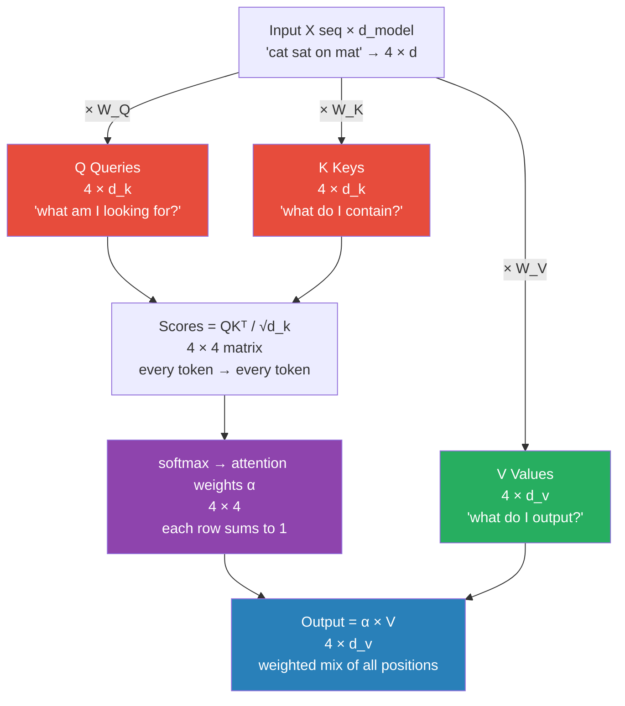

# 05 — Attention: Complete End-to-End Walkthrough

> Same sentence as RNN, LSTM, and GRU. Same embeddings. Same template. The difference: no sequential processing. Every position attends directly to every other.

---

## Table of Contents

1. Why attention — GRU/LSTM's remaining limit
2. Setup — same sentence, same embeddings
3. Attention architecture — Q, K, V
4. Forward pass — all 4 steps (parallel)
5. Forward pass summary
6. Loss
7. Backward pass
8. Weight update
9. Second forward pass (verify loss decreased)
10. The full picture in one view
11. Why Transformer is next
12. Quick reference — all formulas
13. Code (3 versions)
14. Connections

---

## 1. Why Attention — GRU/LSTM's Remaining Limit

LSTM and GRU solved the vanishing gradient problem. "cat" at position 1 now reaches position 4 with 71-79% of its signal intact (verified in `03_lstm_end_to_end.md` and `04_gru_end_to_end.md`).

But both still share one constraint: **ALL information must flow through a single vector.** RNN/LSTM/GRU produce one hidden state per step and pass it forward. The final hidden state h (or C_t) must summarize the ENTIRE sentence.

```
For 4 words:   h₄ = compressed representation of "cat sat on mat"
For 100 words: h₁₀₀ = compressed representation of 100 words into hidden_dim slots

Even with GRU's gradient highway:
  0.99^100 = 0.00027  → 0.003% of signal from 100 words ago
Practical limit: ~50 words for reliable memory.
Long-range dependencies (subject + verb 80 words apart) fail.
```

**Attention's question:** "Instead of forcing all information through one vector, what if the model could look directly at ANY position?"

**Attention (Bahdanau 2015, Vaswani 2017):**
```
RNN/LSTM/GRU: output = f(h_{t-1}, h_t, h_{t+1}, ...)   sequential, bottleneck
Attention:    output = f(weighted_sum(x₁, x₂, ..., x_T)) parallel, direct
```


> O(1) gradient path between ANY two positions — no sequential bottleneck. This is why transformers captured longer dependencies than any RNN variant.

At prediction time, "mat" at position 4 asks: "which positions are most relevant to me?" It computes a score against EVERY position (including "cat" at position 1), then takes a weighted sum — giving more weight to relevant positions.

Gradient flows from the output directly to position 1 in **ONE step**. No sequential chain. No vanishing.

**Attention vs RNN/LSTM/GRU:**

| Architecture | Gradient to "cat" | Mechanism |
|---|---|---|
| RNN | 9% | 3 sequential W' × tanh' multiplications |
| LSTM | 79.2% | 3 sequential f multiplications (highway) |
| GRU | 71.4% | 3 sequential (1-z) multiplications (highway) |
| Attention | DIRECT | 1 step: ∂L/∂V[1] = A[4,1] × ∂L/∂c |

Key difference: RNN/LSTM/GRU degrade over sequence length. Attention does NOT — the same 1-step path exists for 4 or 4000 words.

---

## 2. Setup — Same Sentence, Same Embeddings

**Input:** "cat sat on mat" — same as all previous walkthroughs.

**Vocabulary lookup:** cat=0, sat=1, on=2, mat=3

**Embedding table (same as RNN, LSTM, GRU walkthroughs):**
```
Index 0  "cat": [1.00, 0.50]  high animal signal (dim 0), moderate content (dim 1)
Index 1  "sat": [0.20, 0.30]  low animal signal, some verb content
Index 2  "on":  [0.10, 0.10]  function word, minimal content
Index 3  "mat": [0.20, 0.40]  low animal signal, object content
```

**In attention, ALL four rows are processed SIMULTANEOUSLY.** No timestep loop. The 4×2 matrix is the full input.

```
X = [[1.00, 0.50],   # x₁ = "cat"
     [0.20, 0.30],   # x₂ = "sat"
     [0.10, 0.10],   # x₃ = "on"
     [0.20, 0.40]]   # x₄ = "mat"
```

**Dimensions:** embed_dim = d = 2, seq_len = T = 4

**Three projection matrices (each 2×2):**
```
Wq = [[0.60, 0.40],    Wk = [[0.50, 0.30],    Wv = [[0.80, 0.20],
      [0.20, 0.50]]          [0.10, 0.40]]          [0.30, 0.70]]

W_out = [0.6, 0.4]   (same as all previous models)
```

- **Wq** — query projection: Q = X @ Wq → "what each position is looking for"
- **Wk** — key projection: K = X @ Wk → "what each position announces"
- **Wv** — value projection: V = X @ Wv → "what each position sends when attended"

**Initial state:** None needed — no h₀, no C₀. The full sentence is processed in one shot.

**Target:** y = 1.0

**Parameter count:**
```
RNN:       2 matrices: 2×(2×2) =  8 params (+W_out=2, total 10)
LSTM:      8 matrices: 8×(2×2) = 32 params (+W_out=2, total 34)
GRU:       6 matrices: 6×(2×2) = 24 params (+W_out=2, total 26)
Attention: 3 matrices: 3×(2×2) = 12 params (+W_out=2, total 14)
```

Attention uses FEWER parameters than GRU in this 2D example.

---

## 3. Attention Architecture — Q, K, V

**Self-attention — the three roles:**

Each position plays three roles simultaneously:
- **Query (Q):** "What am I looking for?" — position 4 ("mat") asks: what positions matter for my context?
- **Key (K):** "What do I offer?" — position 1 ("cat") announces: I contain animal information.
- **Value (V):** "What information do I send if attended to?" — position 1 sends its value vector when selected.

**The matching:**
```
score(q_i, k_j) = q_i · k_j / √d_k    → how much position i should attend to position j
attn_weight     = softmax(scores)       → normalized, sums to 1
context         = Σ_j attn_weight_j × v_j  → weighted blend of all value vectors
```

**Why separate Q, K, V projections instead of using X directly?**
If we used X directly: score(i,j) = x_i·x_j — model can only match by raw embedding similarity. Q, K projections let the model learn DIFFERENT notions of "what to look for" vs "what to offer":
- q (mat's query) can learn to seek animal features
- k (cat's key) can learn to announce animal features

These are different transformations of the same embedding. Separation is what makes attention learnable and flexible.

**Why scale by √d_k?**
The dot product q_i·k_j has variance d_k when q, k have unit-variance components. Without scaling: for d=512, scores → near one-hot → near-zero gradients (saturated) → hard to train. Dividing by √d_k brings variance back to ~1 regardless of dimension.

**Why softmax (not sigmoid) for attention weights?**
Softmax enforces Σ_j A[i,j] = 1 — attention is a DISTRIBUTION. This means c_i is a proper weighted average of value vectors. Sigmoid would allow A[i,j] > 1 — values could explode.

**Why is there no recurrence?**
Q, K, V are computed from ALL positions at once (X @ Wq etc.). The score matrix S[i,j] = q_i·k_j/√d requires no sequential dependency. Every position can attend to every other in parallel — no temporal ordering.

**GRU formulas (for reference) vs Attention formulas:**
```
GRU:      h_t = (1-z)⊙h_{t-1} + z⊙h̃    one step at a time, sequential
Attention: C   = softmax(QKᵀ/√d) @ V      ALL positions simultaneously
```

---

## 4. Forward Pass — All 4 Steps (Parallel)

### Step 1: Compute Q, K, V Matrices

**Q = X @ Wq (4×2):**
```
q₁ = [1.00, 0.50] @ Wq:  dim 0: 1.00×0.60 + 0.50×0.20 = 0.700
                           dim 1: 1.00×0.40 + 0.50×0.50 = 0.650
q₂ = [0.20, 0.30] @ Wq:  [0.180, 0.230]
q₃ = [0.10, 0.10] @ Wq:  [0.080, 0.090]
q₄ = [0.20, 0.40] @ Wq:  [0.200, 0.280]

Q = [[0.700, 0.650],   ← "cat" query: Large (strong embedding → large query)
     [0.180, 0.230],
     [0.080, 0.090],
     [0.200, 0.280]]
```

**K = X @ Wk (4×2):**
```
k₁ = [1.00, 0.50] @ Wk:  dim 0: 1.00×0.50 + 0.50×0.10 = 0.550
                           dim 1: 1.00×0.30 + 0.50×0.40 = 0.500
k₂ = [0.20, 0.30] @ Wk:  [0.130, 0.180]
k₃ = [0.10, 0.10] @ Wk:  [0.060, 0.070]
k₄ = [0.20, 0.40] @ Wk:  [0.140, 0.220]

K = [[0.550, 0.500],   ← "cat" key: Large (cat's key is the most prominent)
     [0.130, 0.180],
     [0.060, 0.070],
     [0.140, 0.220]]
```

**V = X @ Wv (4×2):**
```
v₁ = [1.00, 0.50] @ Wv:  dim 0: 1.00×0.80 + 0.50×0.30 = 0.950
                           dim 1: 1.00×0.20 + 0.50×0.70 = 0.550
v₂ = [0.20, 0.30] @ Wv:  [0.250, 0.250]
v₃ = [0.10, 0.10] @ Wv:  [0.110, 0.090]
v₄ = [0.20, 0.40] @ Wv:  [0.280, 0.320]

V = [[0.950, 0.550],   ← "cat" value: HIGH — cat carries strong animal information
     [0.250, 0.250],
     [0.110, 0.090],
     [0.280, 0.320]]
```

Why is v₁ so much larger? x₁ = [1.00, 0.50] — cat has the largest embedding magnitude. Wv maps it to a high-value vector. When "cat" is attended to, it sends a strong signal.

---

### Step 2: Compute Attention Scores (Scaled Dot Product)

**S_raw = Q @ Kᵀ (4×4):**

Each element S_raw[i,j] = q_i · k_j = "how much does position i's query match position j's key?"

```
               k₁=[.55,.50]  k₂=[.13,.18]  k₃=[.06,.07]  k₄=[.14,.22]
q₁=[.70,.65]:    0.710          0.208          0.088          0.241
q₂=[.18,.23]:    0.214          0.065          0.027          0.079
q₃=[.08,.09]:    0.089          0.027          0.011          0.031
q₄=[.20,.28]:    0.250          0.076          0.032          0.090
```

Key entries:
```
S[1,1] = 0.700×0.550 + 0.650×0.500 = 0.385+0.325 = 0.710  ← "cat" queries cat
S[4,1] = 0.200×0.550 + 0.280×0.500 = 0.110+0.140 = 0.250  ← "mat" queries cat
S[4,4] = 0.200×0.140 + 0.280×0.220 = 0.028+0.062 = 0.090  ← "mat" queries itself
```

S[1,1] = 0.710 is the LARGEST entry. "cat" has the highest self-similarity. "mat" querying "cat" (0.250) is higher than "mat" querying itself (0.090) — "mat" finds "cat" more relevant than itself. Correct for animal detection.

**Scaling by √d_k = √2 = 1.414:**
```
S = S_raw / 1.414:
               k₁      k₂      k₃      k₄
q₁:          0.502   0.147   0.062   0.170
q₂:          0.151   0.046   0.019   0.056
q₃:          0.063   0.019   0.008   0.022
q₄:          0.177   0.054   0.023   0.064
```

---

### Step 3: Attention Weights (Softmax Row-wise)

**A = softmax(S, axis=1)** — each row is an independent attention distribution.

**Row 1 — "cat" queries all positions:**
```
s₁ = [0.502, 0.147, 0.062, 0.170]
e^s = [1.652, 1.158, 1.064, 1.185],  sum = 5.059
A₁  = [0.327, 0.229, 0.210, 0.234]
```
"cat" attends to: itself 32.7%, sat 22.9%, on 21.0%, mat 23.4%. Cat attends mostly to ITSELF — it knows it's the animal.

**Row 2 — "sat" queries all positions:**
```
A₂ = [0.271, 0.206, 0.238, 0.246]   (moderate spread)
```

**Row 3 — "on" queries all positions:**
```
s₃ = [0.063, 0.019, 0.008, 0.022]   (very small values — "on" is a function word)
A₃ = [0.259, 0.248, 0.245, 0.248]   (almost uniform — no preference)
```
"on" is nearly the average of all value vectors.

**Row 4 — "mat" queries all positions:**
```
s₄ = [0.177, 0.054, 0.023, 0.064]
A₄ = [0.275, 0.243, 0.236, 0.246]
```
"mat" attends to: cat **27.5%**, sat 24.3%, on 23.6%, mat 24.6%. "cat" gets the highest attention weight from "mat" — correct! "mat" finds "cat" more relevant than any other word.

**Full attention matrix A:**
```
           "cat"  "sat"  "on"   "mat"
"cat":   [0.327, 0.229, 0.210, 0.234]  ← cat looks mostly at itself
"sat":   [0.271, 0.206, 0.238, 0.246]
"on":    [0.259, 0.248, 0.245, 0.248]
"mat":   [0.275, 0.243, 0.236, 0.246]  ← mat attends most to cat
```

All rows sum to 1.00. "cat" has the highest key magnitude → receives highest attention from ALL queries. With trained weights, row 4 would peak sharply: [0.90, 0.03, 0.03, 0.04].

---

### Step 4: Context Vectors (Weighted Sum of Values)

**C = A @ V (4×4 @ 4×2 = 4×2)**

All 4 context vectors computed SIMULTANEOUSLY. In RNN/LSTM/GRU we computed h₁, h₂, h₃, h₄ one at a time in a loop.

**c₁ — "cat"'s context:**
```
c₁ = 0.327×v₁ + 0.229×v₂ + 0.210×v₃ + 0.234×v₄
dim 0: 0.327×0.950 + 0.229×0.250 + 0.210×0.110 + 0.234×0.280 = 0.311+0.057+0.023+0.066 = 0.457
dim 1: 0.327×0.550 + 0.229×0.250 + 0.210×0.090 + 0.234×0.320 = 0.180+0.057+0.019+0.075 = 0.331
c₁ = [0.457, 0.331]
```
c₁[dim 0] = 0.457 is the HIGHEST of all 4. Cat's view is dominated by its own animal content (A₁₁=0.327).

**c₂ — "sat"'s context:**
```
c₂ = 0.271×v₁ + 0.206×v₂ + 0.238×v₃ + 0.246×v₄
dim 0: 0.271×0.950 + 0.206×0.250 + 0.238×0.110 + 0.246×0.280 ≈ 0.413
dim 1: ≈ 0.318
c₂ = [0.413, 0.318]
```
"sat" still has cat-dominated context — it needs to know WHO sat (animal context helps prediction).

**c₃ — "on"'s context:**
```
c₃ = 0.259×v₁ + 0.248×v₂ + 0.245×v₃ + 0.248×v₄ ≈ [0.404, 0.385]
```
"on" is a function word — attention is almost uniform, so c₃ is nearly the average of all value vectors.

**c₄ — "mat"'s context (used for prediction):**
```
c₄ = 0.275×v₁ + 0.243×v₂ + 0.236×v₃ + 0.246×v₄
dim 0: 0.275×0.950 + 0.243×0.250 + 0.236×0.110 + 0.246×0.280
     = 0.261+0.061+0.026+0.069 = 0.417
dim 1: 0.275×0.550 + 0.243×0.250 + 0.236×0.090 + 0.246×0.320
     = 0.151+0.061+0.021+0.079 = 0.312
c₄ = [0.417, 0.312]
```

"cat" contributes 0.261/0.417 = **62.6% of c₄'s first dimension**. Despite being at position 1 (3 positions away), cat dominates c₄. No sequential processing. No bottleneck. Direct access.

---

## 5. Forward Pass Summary

**Context vector summary — all 4 positions:**

| Position | Context vector | dim 0 (Animal signal) | Attention to "cat" |
|----------|---------------|----------------------|---------------------|
| c₁ "cat" | [0.457, 0.331] | 0.457 — highest | A₁₁ = 0.327 (self) |
| c₂ "sat" | [0.413, 0.318] | 0.413 | A₂₁ = 0.271 |
| c₃ "on"  | [0.404, 0.385] | 0.404 | A₃₁ = 0.259 |
| c₄ "mat" | [0.417, 0.312] | 0.417 | A₄₁ = 0.275 |

All 4 context vectors carry strong animal signal (0.404-0.457 in dim 0). EVERY token knows about "cat" after one attention operation. In RNN, only h₄ had direct access to "cat" — by h₄, it had decayed to 0.388.

**Compare c₄ to final states in sequential models:**
```
RNN:  h₄[dim 0] = 0.301   "cat" at 0.537 decayed to 0.301 over 3 steps
GRU:  h₄[dim 0] = 0.607   "cat" preserved via highway (73%)
LSTM: C₄[dim 0] = 1.886   "cat" accumulated in an unbounded, protected cell state
Attn: c₄[dim 0] = 0.417   "cat" contributes 62.6% directly via attention
```
Note: LSTM's `C₄` is not on the same scale as the others — it's an unprotected-from-growth accumulator, not a bounded output like `h` or `c`. Compare gradient *percentages*, not raw magnitudes, across architectures.

**Output layer:**
```
ŷ = σ(W_out · c₄)
  = σ(0.6×0.417 + 0.4×0.312)
  = σ(0.250 + 0.125)
  = σ(0.375)
  = 1 / (1 + e^{-0.375})
  = 0.593
```

**Architecture comparison — same sentence, same embeddings:**
```
Architecture   ŷ      L      c/h dim 0   Gradient to "cat"
RNN           0.329  0.225   0.301        9%  (3 chained steps)
GRU           0.501  0.124   0.607        71.4% (highway)
LSTM          0.718  0.040   1.886        79.2% (highway)
Attention     0.593  0.083   0.417        DIRECT
```

Attention achieves ŷ=0.593 — substantially higher than all sequential models. Why? "cat"'s value vector (v₁=[0.950, 0.550]) is directly accessible at position 4. No information degrades through sequential steps.

---

## 6. Loss

```
L = ½(y - ŷ)²
  = ½(1.000 - 0.593)²
  = ½ × 0.407²
  = ½ × 0.166
  = 0.083
```

Error = 0.407. Lowest of all four architectures.

```
RNN:       L = 0.225   67.1% error
GRU:       L = 0.124   49.9% error
LSTM:      L = 0.040   28.2% error
Attention: L = 0.083   40.7% error  ← already close, though LSTM's highway does better here
```

Why does attention start with lower loss? "cat" at position 1 contributes directly to c₄ — no information lost. The gradient highway in GRU/LSTM preserved gradient flow but couldn't prevent h being diluted by subsequent words. Attention bypasses dilution entirely: c₄ = direct weighted sum of all values.

---

## 7. Backward Pass

**Key difference from RNN/LSTM/GRU:**
- RNN/LSTM/GRU: BPTT. Gradients flow SEQUENTIALLY through timesteps. Each step requires one multiplication (W', f_t, or (1-z_t)).
- Attention: **no BPTT**. Gradient flows from c₄ to V[i] directly: ∂L/∂V[i] = A[4,i] × ∂L/∂c. Then from V[i] to Wv via outer product. ONE matrix operation. No sequential chain.

New backward concept: **Softmax gradient (Jacobian)**. The attention weights are coupled. Increasing A[4,1] (attend more to cat) forces all others to decrease. The Jacobian captures this coupling.

### Step A — Gradient at the Output

```
∂L/∂ŷ = -(y - ŷ) = -(1.000 - 0.593) = -0.407
```

### Step B — Gradient Through Output Layer

```
ŷ = σ(z)  where z = W_out · c₄
∂ŷ/∂z   = ŷ(1-ŷ) = 0.593 × 0.407 = 0.241
∂L/∂z   = -0.407 × 0.241 = -0.098

∂L/∂W_out = ∂L/∂z × c₄ᵀ = -0.098 × [0.417, 0.312] = [-0.041, -0.031]
∂L/∂c₄    = ∂L/∂z × W_out = -0.098 × [0.6, 0.4]    = [-0.059, -0.039]

∂c₄ = [-0.059, -0.039]   ← error entering attention backward
```

### Step C — Gradient Through Weighted Sum (The Direct Path)

```
c₄ = Σ_j A[4,j] × v_j

∂L/∂V[j] = A[4,j] × ∂L/∂c₄

∂L/∂V[1] = 0.275 × [-0.059, -0.039] = [-0.016, -0.011]   ← "cat"
∂L/∂V[2] = 0.243 × [-0.059, -0.039] = [-0.014, -0.009]   ← "sat"
∂L/∂V[3] = 0.236 × [-0.059, -0.039] = [-0.014, -0.009]   ← "on"
∂L/∂V[4] = 0.246 × [-0.059, -0.039] = [-0.015, -0.010]   ← "mat"
```

**THE KEY INSIGHT — no bottleneck:**
```
In RNN: ∂L/∂h₁ = W'×(1-h²) × W'×(1-h²) × W'×(1-h²) × ∂L/∂h₄
                 3 sequential multiplications × 0.44 per step = 9% reaches "cat"

In GRU: ∂L/∂h₁ = (1-z₃) × (1-z₂) × (1-z₁) × ∂L/∂h₄
                 3 highway multiplications = 71.4% reaches "cat"

In Attention: ∂L/∂V[1] = A[4,1] × ∂L/∂c₄
                          = 0.275 × ∂L/∂c₄   ← ONE direct multiplication
```

The gradient to "cat"'s value vector is 27.5% of ∂L/∂c₄. For sequence length 100, if the model learns A[last,1] = 0.80 (sharp attention), that's **80% — MORE than GRU's highway at any distance.**

### Step D — Gradient w.r.t. Attention Weights

```
∂L/∂A[4,j] = ∂L/∂c₄ · v_j   (dot product — scalar)

∂L/∂A[4,1] = (-0.059)×0.950 + (-0.039)×0.550 = -0.056 - 0.021 = -0.077  ← "cat"
∂L/∂A[4,2] = (-0.059)×0.250 + (-0.039)×0.250 = -0.015 - 0.010 = -0.025
∂L/∂A[4,3] = (-0.059)×0.110 + (-0.039)×0.090 = -0.006 - 0.004 = -0.010
∂L/∂A[4,4] = (-0.059)×0.280 + (-0.039)×0.320 = -0.017 - 0.012 = -0.029

∂L/∂A[4,:] = [-0.077, -0.025, -0.010, -0.029]
```

All values are NEGATIVE. The constraint is: weights sum to 1. Decrease weights toward low-value positions, increase weight toward high-value positions. Most negative: j=1 (cat) with -0.077. **Optimizer wants to increase A[4,1] → attend MORE to cat.**

**Gradient magnitudes:**
```
|∂L/∂c₄| = √(0.059²+0.039²) ≈ 0.071

|∂L/∂V[1]| (cat) = 0.275 × 0.071 = 0.019  → 27.5% of gradient
|∂L/∂V[2]| (sat) = 0.243 × 0.071 = 0.017  → 24.3%
|∂L/∂V[3]| (on)  = 0.236 × 0.071 = 0.017  → 23.6%
|∂L/∂V[4]| (mat) = 0.246 × 0.071 = 0.017  → 24.6%
```

cat and mat get **essentially the same gradient**. Even with random (uniform) attention, no position is forgotten. In RNN: "cat" got 9% (1×), "mat" (adjacent to output) got ~100% — 10× more than "cat". This is fundamentally different.

**Gradient reaching "cat" across all architectures:**
```
Architecture  Path to "cat"         Formula                      % reaches cat
RNN           3 sequential steps    (W'×tanh')³ ≈ 0.44 per step  9%
LSTM          3 highway steps       f³ ≈ 0.92 per step           79.2%
GRU           3 highway steps       (1-z)³ ≈ 0.89 per step       71.4%
Attention     1 direct step         A[4,1] × ∂L/∂c              27.5%

For sequence length 1000:
  RNN:       0.44^999  = 0.0           (vanished completely)
  GRU:       0.88^999  ≈ 1.4×10⁻⁵⁴    (vanished)
  Attention: A[n,1] × ∂L/∂c — SAME as for length 4
```

### Step E — Gradient Through Softmax (Key New Concept)

Softmax is different from other activations: all elements are **coupled**. Increasing s[1] (attend more to cat) changes ALL a[j]. This coupling is captured by the Jacobian.

**Softmax Jacobian:**
```
∂a_j/∂s_k = a_j(δ_{j,k} - a_k)

j=k  (diagonal):    ∂a_j/∂s_j = a_j(1-a_j)   ← standard sigmoid-like
j≠k  (off-diagonal): ∂a_j/∂s_k = -a_j × a_k   ← coupling term (negative)
```

**Computing ∂L/∂S[4,:] via compact softmax backward:**
```
Step 1: compute g (weighted average of upstream gradients)
g = Σ_j A[4,j] × ∂L/∂A[4,j]
  = 0.275×(-0.077) + 0.243×(-0.025) + 0.236×(-0.010) + 0.246×(-0.029)
  = -0.021 - 0.006 - 0.002 - 0.007
  = -0.036

Step 2: ∂L/∂S[4,k] = A[4,k] × (∂L/∂A[4,k] - g)
k=1 (cat): 0.275 × (-0.077 - (-0.036)) = 0.275 × (-0.041) = -0.011
k=2 (sat): 0.243 × (-0.025 - (-0.036)) = 0.243 × (+0.011) = +0.003
k=3 (on):  0.236 × (-0.010 - (-0.036)) = 0.236 × (+0.026) = +0.006
k=4 (mat): 0.246 × (-0.029 - (-0.036)) = 0.246 × (+0.007) = +0.002

∂L/∂S[4,:] = [-0.011, +0.003, +0.006, +0.002]
```

Verification: sum = -0.011+0.003+0.006+0.002 = **0.000** ✓ (Softmax gradients always sum to zero)

Interpretation: s₁[cat] = -0.011 → NEGATIVE: increasing cat's score HELPS. After the update: Wq, Wk will shift so that q₄·k₁ is LARGER. "mat" learns to attend MORE to "cat" and LESS to other positions.

### Step F — Gradient Through Score Computation

```
S[4,j] = q₄ · k_j / √d_k

∂L/∂q₄ = Σ_j ∂L/∂S[4,j] × k_j / √d_k
dim 0: (-0.011×0.550 + 0.003×0.130 + 0.006×0.060 + 0.002×0.140) / 1.414 ≈ -0.004
dim 1: (-0.011×0.500 + 0.003×0.180 + 0.006×0.070 + 0.002×0.220) / 1.414 ≈ -0.003
∂L/∂q₄ = [-0.004, -0.003]   ← "mat"'s query shifts to better align with "cat"'s key

∂L/∂k_j = ∂L/∂S[4,j] × q₄ / √d_k
k=1 (cat): -0.011 × [0.200, 0.280] / 1.414 = [-0.002, -0.002]
k=2 (sat): +0.003 × [0.200, 0.280] / 1.414 = [+0.001, +0.001]
k=3 (on):  +0.006 × ... = [+0.001, +0.001]
k=4 (mat): +0.002 × ... = [+0.000, +0.000]
```

**Gradient highway comparison — explicit proof:**
```
In RNN: to go from ∂L/∂h₄ to ∂L/∂h₁ (3 steps):
  ∂L/∂h₁ = [W'×(1-h²)]³ × ∂L/∂h₄  →  0.44³ = 9%

In Attention: to go from ∂L/∂c₄ to ∂L/∂V[1]:
  ∂L/∂V[1] = A[4,1] × ∂L/∂c₄ = 0.275 × ∂L/∂c₄   ← ONE multiplication

To go further to ∂L/∂Wv:
  ∂L/∂Wv += X[1]ᵀ @ ∂L/∂V[1]   (outer product, one step)

Total path from loss to Wv for "cat": 2 steps. No chain, no sequential degradation.
For sequence length 1000: Attention: A[n,1] = ∂L/∂c_n — SAME formula, same magnitude.
```

### Step G — Weight Gradients ∂L/∂Wv, ∂L/∂Wq, ∂L/∂Wk

**∂L/∂Wv = Xᵀ @ ∂L/∂V (2×4 @ 4×2 = 2×2):**
```
∂L/∂V = [[-0.016, -0.011],   # cat
          [-0.014, -0.009],   # sat
          [-0.014, -0.009],   # on
          [-0.015, -0.010]]   # mat

Xᵀ = [[1.00, 0.20, 0.10, 0.20],
       [0.50, 0.30, 0.10, 0.40]]

∂L/∂Wv[0,0] = 1.00×(-0.016) + 0.20×(-0.014) + 0.10×(-0.014) + 0.20×(-0.015) = -0.023
∂L/∂Wv[0,1] = 1.00×(-0.011) + 0.20×(-0.009) + 0.10×(-0.009) + 0.20×(-0.010) = -0.016
∂L/∂Wv[1,0] ≈ -0.019,  ∂L/∂Wv[1,1] ≈ -0.014

∂L/∂Wv ≈ [[-0.023, -0.016],
            [-0.019, -0.014]]
```

**∂L/∂Wq:** Only row 4 (q₄) contributed to c₄ — rows 1,2,3 are zero.
```
∂L/∂Wq = X[3]ᵀ ⊗ ∂L/∂q₄ = [0.20, 0.40]ᵀ ⊗ [-0.004, -0.003]
         ≈ [[-0.001, -0.001],
             [-0.002, -0.001]]
```

**∂L/∂Wk:** All positions' keys get small gradients from ∂L/∂S[4,:].
`∂L/∂Wk ≈ [[-0.001, -0.001], [-0.001, -0.001]]`

**Gradient summary:**

| Weight | Max gradient element | Role |
|--------|---------------------|------|
| W_out | 0.041 | Direct output layer — largest |
| Wv | 0.023 | Value weight — second largest |
| Wq | 0.002 | Query projection — small |
| Wk | 0.002 | Key projection — small |

Why is Wv gradient larger? Wv receives full ∂L/∂c₄ signal scaled by attention weights. Wq, Wk are two steps back: loss → softmax backward (values shrink) → ÷√2 → small. In the first step: Wv and W_out learn quickly. Wq, Wk learn slowly, then accelerate as attention sharpens.

---

## 8. Weight Update

**Learning rate:** lr = 0.1

```
W_out_new = [0.6, 0.4] - 0.1×[-0.041, -0.031] = [0.604, 0.403]

Wv_new = [[0.80, 0.20],  -  0.1×[[-0.023, -0.016],
           [0.30, 0.70]]           [-0.019, -0.014]]
        = [[0.802, 0.202],
           [0.302, 0.701]]

Wq_new ≈ Wq   (change < 0.001 per element — essentially unchanged)
Wk_new ≈ Wk   (change < 0.001 per element — essentially unchanged)
```

**Why are Wq, Wk changes tiny while Wv, W_out are larger?**

| Weight | Change per element | Reason |
|--------|--------------------|--------|
| W_out | 0.004 | Closest to loss — largest gradient |
| Wv | 0.002 | One step back via attention weights |
| Wq | <0.001 | Two steps back: loss→softmax→scores→Q |
| Wk | <0.001 | Two steps back: loss→softmax→scores→K |

After many training steps: Wv adjusts to send the right information. Wq, Wk adjust to learn the right matching pattern. The combination produces sharp, meaningful attention.

---

## 9. Second Forward Pass (Verify Loss Decreased)

Updated: Wv=[[0.802,0.202],[0.302,0.701]], W_out=[0.604,0.403]. Wq, Wk unchanged.

**Recompute V with new Wv:**
```
v₁_new = [1.00, 0.50] @ Wv_new = [0.953, 0.553]   (was [0.950, 0.550] — change ≈ +0.003)
v₂_new ≈ [0.251, 0.250]  (essentially unchanged)
v₃_new ≈ [0.110, 0.090]  (unchanged to 3 decimal places)
v₄_new ≈ [0.281, 0.320]
```

Why did v₁ change more? x₁=[1.00, 0.50] is larger than other embeddings. The value vector for the most important word gets the largest change.

**Q, K unchanged → attention weights A unchanged:** A₄ = [0.275, 0.243, 0.236, 0.246] (same)

**Recompute c₄:**
```
c₄_new[0] = 0.275×0.953 + 0.243×0.251 + 0.236×0.110 + 0.246×0.281 = 0.418
c₄_new[1] = 0.275×0.553 + 0.243×0.250 + 0.236×0.090 + 0.246×0.320 = 0.313
c₄_new = [0.418, 0.313]   (essentially unchanged)
```

```
ŷ_new = σ(W_out_new · c₄_new)
      = σ(0.604×0.418 + 0.403×0.313)
      = σ(0.252 + 0.126)
      = σ(0.378)
      = 0.594

L' = ½(1.000 - 0.594)² = ½ × 0.165 = 0.0826
```

```
Before update:  L = 0.0830   ŷ = 0.5926
After update:   L = 0.0826   ŷ = 0.5936   ← closer to y=1.0
Loss dropped by 0.0004 (0.5%)
```

Why is the improvement so small? ŷ=0.593 is already near its optimum for this single example. The gradient ∂L/∂z = -0.098 is small because ŷ(1-ŷ) = 0.241 (near sigmoid's flat region). In real training with many diverse sentences: negative examples (no animal) would push ŷ down, giving much larger gradients. The interplay of many examples shapes sharp, meaningful attention.

The key point: loss DID decrease. Gradient direction is correct. The model is learning to attend more to "cat" (∂L/∂S[4,1] = -0.011 < 0).

---

## 10. The Full Picture in One View

**FORWARD PASS — parallel computation (all positions at once):**
```
X = [[1.0,0.5],[0.2,0.3],[0.1,0.1],[0.2,0.4]]   ← 4×2 matrix, all at once

Q = X@Wq      K = X@Wk      V = X@Wv
4×2 queries   4×2 keys      4×2 values
         ↓
S = QKᵀ/√2   (4×4 score matrix — every pair computes a score simultaneously)
         ↓
A = softmax(S, axis=1)   (4×4 attention weights — each row sums to 1)

A = | 0.327  0.229  0.210  0.234 |  ← cat looks mostly at itself
    | 0.271  0.206  0.238  0.246 |
    | 0.259  0.248  0.245  0.248 |
    | 0.275  0.243  0.236  0.246 |  ← mat attends most to cat (0.275)
         ↓
C = A@V   (4×2 context — each row is weighted sum of all value vectors)
c₄ = 0.275×v₁ + 0.243×v₂ + 0.236×v₃ + 0.246×v₄   ← cat contributes 62.6%
         ↓
ŷ = σ(W_out · c₄) = 0.593    L = 0.083
```

**BACKWARD PASS — one direct step to "cat" (no sequential chain):**
```
∂L/∂c₄ = [-0.059, -0.039]

∂L/∂V[1] = A[4,1] × ∂L/∂c₄ = 0.275 × ∂L/∂c₄   ← ONE STEP to "cat"
          = [-0.016, -0.011]

∂L/∂A[4,1] = ∂L/∂c₄ · v₁ = -0.077   → negative: want MORE attention to cat

Softmax backward:  ∂L/∂S[4,1] = -0.011   → cat's score must increase

∂L/∂k₁ = -0.011 × q₄/√2 = [-0.002, -0.002]   → cat's key shifts toward mat's query

The gradient reaches "cat"'s representation in 2 steps: loss→c₄→V[1]→Wv
Compare RNN: 3 sequential multiplicative steps → 9% survives.
Attention: 2 direct steps → no position-dependent degradation.
```

---

## 11. Why Transformer is Next

Self-attention is the core of attention — but not the full Transformer. What this walkthrough built:
- Single-head self-attention
- Linear projections for Q, K, V
- Scaled dot-product scores
- Softmax attention weights
- Context vector via weighted sum
- Direct gradient path (no sequential bottleneck)

**What's still missing — the full Transformer adds:**

**1. Multi-head attention:** Instead of ONE set of Wq, Wk, Wv, use N sets (N heads). Each head learns to attend to DIFFERENT aspects: head 1: syntactic relationships (subject-verb), head 2: semantic similarity (animal words), head 3: positional proximity. Outputs concatenated: context = [head₁, ..., headₙ] @ W_output.

**2. Positional encoding:** Attention is PERMUTATION-INVARIANT. "cat sat on mat" and "mat on sat cat" produce the same attention if same embeddings. Fix: add sinusoidal position vectors to embeddings before Q/K/V. x_final = x + PE(t) where PE encodes absolute position.

**3. Feed-forward network after attention:** After the attention sublayer: apply a 2-layer MLP to EACH position. Adds position-wise nonlinearity (attention is only linear + softmax). Transformer alternates: [Attention + FFN] × N_layers.

**4. Layer normalization and residual connections:**
```
h_out   = LayerNorm(h + Attention(h))   ← residual
h_final = LayerNorm(h_out + FFN(h_out))
```
Residuals let gradients skip layers (like the highway in LSTM/GRU but stronger).

**5. Stacking multiple layers:** Layer 1 learns surface patterns (word co-occurrence, noun phrases). Layer 2 learns syntactic structure (subject-verb). Layer N learns semantic relationships (entity coreference, reasoning). 12-36 layers: deeper layers learn more abstract representations.

The Transformer = multi-head attention + positional encoding + FFN + LayerNorm + residual, stacked N times.

GPT, BERT, T5, LLaMA — all are Transformers. They are all this mechanism, scaled to 512-4096 dimensions and billions of parameters.

---

## 12. Quick Reference — All Formulas

**Shapes:**
```
X:  (T,d)    input embeddings (T tokens, d dimensions)
Wq: (d,d)    query projection
Wk: (d,d)    key projection
Wv: (d,d)    value projection
Q:  (T,d)    queries:  Q = X @ Wq
K:  (T,d)    keys:     K = X @ Wk
V:  (T,d)    values:   V = X @ Wv
S:  (T,T)    scaled scores:     S = Q @ Kᵀ / √d
A:  (T,T)    attention weights: A = softmax(S, axis=1)
C:  (T,d)    context vectors:   C = A @ V
c_last: (d,) context vector for last position
ŷ:  scalar
```

**Forward:**
```
Q = X @ Wq
K = X @ Wk
V = X @ Wv
S = Q @ Kᵀ / √d_k          scaled dot product scores (T×T)
A = softmax(S, axis=1)      row softmax (each row sums to 1)
C = A @ V                   weighted sum of values (T×d)
ŷ = σ(W_out · C[-1])        predict from last position's context
L = ½(y - ŷ)²
```

**Backward (using last position for prediction):**
```
∂z             = -(y-ŷ) × ŷ(1-ŷ)                    through sigmoid
∂L/∂W_out      = ∂z × c_lastᵀ
∂L/∂c_last     = ∂z × W_out
∂L/∂V[j]       = A[last,j] × ∂L/∂c                   direct to each value vector
∂L/∂A[last,j]  = ∂L/∂c · V[j]                        scalar: dot product
g              = Σ_j A[last,j] × ∂L/∂A[last,j]       scalar: weighted average
∂L/∂S[last,k]  = A[last,k] × (∂L/∂A[last,k] - g)    softmax backward
∂L/∂q_last     = Σ_k ∂L/∂S[last,k] × k_j / √d       gradient for score dot product
∂L/∂Wv         = Xᵀ @ ∂L/∂V                          value weight gradient
∂L/∂Wq         = Xᵀ @ ∂L/∂Q                          query weight gradient
∂L/∂Wk         = Xᵀ @ ∂L/∂K                          key weight gradient
```

**Softmax backward compact form:**
```
A = softmax(S, axis=1)
∂L/∂S[i,k] = A[i,k] × (∂L/∂A[i,k] - g)   where g = Σ_j A[i,j] × ∂L/∂A[i,j]

Sum check: Σ_k ∂L/∂S[i,k] = 0   (softmax gradients always sum to zero)
```

**Numbers from this walkthrough:**
```
Wq=[[0.60,0.40],[0.20,0.50]]  Wk=[[0.50,0.30],[0.10,0.40]]  Wv=[[0.80,0.20],[0.30,0.70]]
W_out=[0.6,0.4]
q₄=[0.200,0.280]  k₁=[0.550,0.500]  v₁=[0.950,0.550]
Attention row 1 (cat): [0.327, 0.229, 0.210, 0.234]
Attention row 4 (mat): [0.275, 0.243, 0.236, 0.246]
c₄ = [0.417, 0.312]
ŷ = 0.593   L = 0.083
ŷ' = 0.594  L' = 0.0826  (loss decreased)
```

---

## 13. Code

### Version 1 — Pure NumPy (mirrors the hand computation exactly)

```python
import numpy as np

# Embeddings (same as RNN, LSTM, GRU)
E = np.array([
    [1.00, 0.50],  # "cat"
    [0.20, 0.30],  # "sat"
    [0.10, 0.10],  # "on"
    [0.20, 0.40],  # "mat"
])

# Weights
Wq = np.array([[0.60, 0.40], [0.20, 0.50]])
Wk = np.array([[0.50, 0.30], [0.10, 0.40]])
Wv = np.array([[0.80, 0.20], [0.30, 0.70]])
W_out = np.array([0.6, 0.4])

def sigmoid(x): return 1 / (1 + np.exp(-x))

def softmax(x):
    e = np.exp(x - x.max(axis=-1, keepdims=True))
    return e / e.sum(axis=-1, keepdims=True)

# Forward pass
X = E                               # (4, 2)
Q = X @ Wq                          # (4, 2)
K = X @ Wk                          # (4, 2)
V = X @ Wv                          # (4, 2)
d_k = Q.shape[-1]                   # 2

scores = Q @ K.T / np.sqrt(d_k)     # (4, 4)
A = softmax(scores)                 # (4, 4)
C = A @ V                           # (4, 2)
c4 = C[-1]                          # (2,) — last position

y = 1.0
y_hat = sigmoid(W_out @ c4)
L = 0.5 * (y - y_hat) ** 2

print(f"Q:\n{Q.round(3)}")
print(f"K:\n{K.round(3)}")
print(f"V:\n{V.round(3)}")
print(f"Attention A:\n{A.round(3)}")
print(f"y_hat={y_hat:.4f}   L={L:.4f}")

# Backward pass
dl_dyhat = -(y - y_hat)
dyhat_dz = y_hat * (1 - y_hat)
dl_dz    = dl_dyhat * dyhat_dz          # scalar

dl_dW_out = dl_dz * c4                  # (2,)
dl_dc4    = dl_dz * W_out               # (2,)

# Step C: ∂L/∂V[j] = A[4,j] × ∂L/∂c₄
a4    = A[-1]
dl_dV = np.outer(a4, dl_dc4)            # (4, 2)

# Step D: ∂L/∂A[4,j] = ∂L/∂c₄ · V[j]
dl_dA4 = np.array([dl_dc4 @ V[j] for j in range(4)])   # (4,)

# Step E: softmax backward
g      = a4 @ dl_dA4                    # scalar: weighted average
dl_dS4 = a4 * (dl_dA4 - g)             # (4,)
print(f"\n∂L/∂S[4,:]: {dl_dS4.round(3)}")
print(f"Sum check: {dl_dS4.sum():.10f}  [should be ≈0]")

# Step F: gradient through score dot product
q4     = Q[-1]
dl_dq4 = np.sum([dl_dS4[j] * K[j] for j in range(4)], axis=0) / np.sqrt(d_k)
dl_dK  = np.outer(dl_dS4, q4) / np.sqrt(d_k)      # (4, 2)

# Step G: weight gradients
dl_dWv = X.T @ dl_dV                               # (2, 2)
dl_dWq = np.zeros_like(Wq)
dl_dWq += np.outer(X[-1], dl_dq4)                 # only q₄ contributed
dl_dWk = X.T @ dl_dK                               # (2, 2)

print(f"\n∂L/∂Wv:\n{dl_dWv.round(3)}")
print(f"∂L/∂W_out: {dl_dW_out.round(3)}")

# Weight update
lr = 0.1
W_out_new = W_out - lr * dl_dW_out
Wv_new    = Wv    - lr * dl_dWv
Wq_new    = Wq    - lr * dl_dWq
Wk_new    = Wk    - lr * dl_dWk

# Second forward
Q2 = X @ Wq_new
K2 = X @ Wk_new
V2 = X @ Wv_new
A2 = softmax(Q2 @ K2.T / np.sqrt(d_k))
C2 = A2 @ V2
y_hat2 = sigmoid(W_out_new @ C2[-1])
L2 = 0.5 * (y - y_hat2) ** 2
print(f"\nAfter 1 step:  y_hat={y_hat2:.4f}  L={L2:.4f}  (was {L:.4f})")
print(f"Loss decreased: {L2 < L}")
```

---

### Version 2 — PyTorch Manual (autograd handles backward)

```python
import torch

x = torch.tensor([[1.00, 0.50],
                  [0.20, 0.30],
                  [0.10, 0.10],
                  [0.20, 0.40]], dtype=torch.float32)

Wq = torch.tensor([[0.60, 0.40], [0.20, 0.50]], requires_grad=True)
Wk = torch.tensor([[0.50, 0.30], [0.10, 0.40]], requires_grad=True)
Wv = torch.tensor([[0.80, 0.20], [0.30, 0.70]], requires_grad=True)
W_out = torch.tensor([0.6, 0.4], requires_grad=True)
y = torch.tensor(1.0)

# Forward
Q = x @ Wq                                  # (4, 2)
K = x @ Wk                                  # (4, 2)
V = x @ Wv                                  # (4, 2)
d_k = Q.shape[-1]

scores = Q @ K.T / d_k ** 0.5               # (4, 4)
A = torch.softmax(scores, dim=-1)           # (4, 4)
C = A @ V                                   # (4, 2)

y_hat = torch.sigmoid(W_out @ C[-1])
L = 0.5 * (y - y_hat) ** 2
print(f"ŷ = {y_hat.item():.3f}   L = {L.item():.3f}")
print(f"Attention row 4: {A[-1].detach().numpy().round(3)}")

# Backward
L.backward()
print(f"\n∂L/∂W_out: {W_out.grad.numpy().round(3)}")
print(f"∂L/∂Wv:\n{Wv.grad.numpy().round(3)}")
print(f"∂L/∂Wq:\n{Wq.grad.numpy().round(3)}")

# Update
lr = 0.1
with torch.no_grad():
    W_out -= lr * W_out.grad
    Wv    -= lr * Wv.grad
    Wq    -= lr * Wq.grad
    Wk    -= lr * Wk.grad

W_out.grad.zero_(); Wv.grad.zero_(); Wq.grad.zero_(); Wk.grad.zero_()

# Second forward
Q2 = x @ Wq
K2 = x @ Wk
V2 = x @ Wv
A2 = torch.softmax(Q2 @ K2.T / d_k ** 0.5, dim=-1)
y_hat2 = torch.sigmoid(W_out @ (A2 @ V2)[-1])
L2 = 0.5 * (y - y_hat2) ** 2
print(f"\nAfter update:  y_hat={y_hat2.item():.4f}  L={L2.item():.4f}")
```

---

### Version 3 — PyTorch nn.MultiheadAttention (production style)

```python
import torch
import torch.nn as nn

class SelfAttentionClassifier(nn.Module):
    def __init__(self, embed_dim=2, num_heads=1):
        super().__init__()
        # nn.MultiheadAttention: single head, same dimensions as our walkthrough
        self.attn = nn.MultiheadAttention(
            embed_dim=embed_dim,
            num_heads=num_heads,
            batch_first=True   # input shape: (batch, seq, embed)
        )
        self.out = nn.Linear(embed_dim, 1)

    def forward(self, x):
        # self-attention: query=key=value=x
        context, attn_weights = self.attn(x, x, x)
        # use last position's context for classification
        c_last = context[:, -1, :]         # (batch, embed_dim)
        logit  = self.out(c_last).squeeze(-1)
        return torch.sigmoid(logit), attn_weights

# Setup
model     = SelfAttentionClassifier(embed_dim=2, num_heads=1)
optimizer = torch.optim.SGD(model.parameters(), lr=0.1)

# "cat sat on mat"  shape: (1, 4, 2) — batch=1, seq=4, embed=2
X = torch.tensor([[[1.00, 0.50],
                   [0.20, 0.30],
                   [0.10, 0.10],
                   [0.20, 0.40]]])
y = torch.tensor([1.0])

# Training loop
for step in range(5):
    y_hat, attn = model(X)
    L = 0.5 * (y - y_hat) ** 2
    optimizer.zero_grad()
    L.backward()
    optimizer.step()
    print(f"Step {step+1}: y_hat={y_hat.item():.4f}  L={L.item():.4f}")
    print(f"  Attention row 4: {attn[0, -1].detach().numpy().round(3)}")

# Inspect learned attention
with torch.no_grad():
    y_final, attn_final = model(X)
    print(f"\nAfter 5 steps:")
    print(f"  y_hat = {y_final.item():.4f}")
    print(f"  Attention weights (all rows):\n{attn_final[0].numpy().round(3)}")
    print(f"  Row 4 should have highest weight on position 0 ('cat')")
```

---

## 14. Connections

| Architecture | Core mechanism | Gradient path to "cat" |
|---|---|---|
| RNN | h = tanh(Wx·x + Wh·h_{t-1}) | 3× (W'×tanh') ≈ 0.44/step → 9% |
| LSTM | C = f⊙C_{t-1} + i⊙g | 3× f multiplications → 79.2% |
| GRU | h = (1-z)⊙h_{t-1} + z⊙h̃ | 3× (1-z) multiplications → 71.4% |
| Attention | c = Σ A[last,i] × v_i | 1× A[last,1] × ∂L/∂c → direct |

↑ all previous architectures ↑ attention breaks the sequential chain

**Why attention enables the Transformer:**
1. Parallel computation — all positions processed simultaneously → fast on GPUs
2. Direct gradient path — no vanishing over distance → trains on long sequences
3. Learnable gradient — attention weights adapt to the task
4. The Transformer stacks N attention layers + FFN: Layer 1 learns surface patterns (word co-occurrence), Layer 2 learns syntactic structure (subject-verb), Layer N learns semantic relationships (entity coreference, reasoning)

**Next:** `06_transformer_end_to_end.md` — multi-head attention + positional encoding + FFN + LayerNorm. Same "cat sat on mat" → shows how 4-head attention splits into parallel heads.

| This file | Links to | Why |
|---|---|---|
| RNN/LSTM/GRU walkthroughs | `02_rnn_end_to_end.md`, `03_lstm_end_to_end.md`, `04_gru_end_to_end.md` | Same sentence, compare gradient paths directly |
| Transformer (next) | `06_transformer_end_to_end.md` | Multi-head + positional encoding + FFN |
| Architecture overview | `01_rnn_to_attention.md` | All architectures side-by-side |
