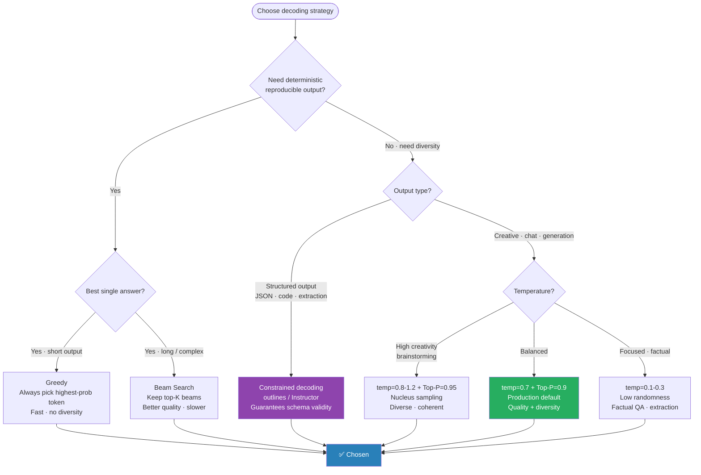

# Decoding Strategies

> How does an LLM pick the next token? The decoding strategy controls quality, diversity, and speed of generated text.

---

## Table of Contents

1. The Core Problem
2. Greedy Decoding
3. Beam Search
4. Temperature Sampling
5. Top-K Sampling
6. Top-P (Nucleus) Sampling
7. Combining Temperature + Top-P (Production Config)
8. Repetition Penalty
9. Speculative Decoding (Speed Optimization)
10. Constrained / Structured Decoding
11. min-p Sampling & DRY Penalty
12. Comparison Table
13. Key Numbers
14. Interview Q&A
15. Connections
16. Key Takeaway
17. Code Practice

---

## Which Strategy to Use



## 1. The Core Problem

At each step t, the LLM outputs a probability distribution over the vocabulary:

```
P(token | context) = σ([V])   (|V| = 32,000 tokens for LLaMA)

Example — predicting next token after "The capital of France is":
  "Paris"   → 0.82
  "Lyon"    → 0.06
  "London"  → 0.03
  "the"     → 0.02
  ...       → 0.07 (remaining 31,996 tokens)

Question: which token do we pick?
  Always pick "Paris" (0.82)?  → deterministic, boring
  Sample randomly?             → incoherent
  Something smarter?           → a decoding strategy
```

---

## 2. Greedy Decoding

Pick the highest-probability token at every step.

```python
At step t: token_t = argmax P(token | token_{1:t-1})

Example:
  Step 1: "Paris" (0.82)  ✓ selected
  Step 2: " is"  (0.71)   ✓ selected
  Step 3: " the" (0.65)   ✓ selected
Output: "Paris is the capital and the city is the most..."
```

**Problem:** greedy can get stuck in repetition loops.

```
"the the the the..." — each "the" makes next "the" even more likely
```

**Use when:** exact, deterministic output needed (classification, code with one correct answer). Never for open-ended generation.

---

## 3. Beam Search

Keep top-B sequences ("beams") at each step instead of just top-1.

```
B = 3 beams, vocabulary simplified to 4 tokens for illustration

Step 0 — Start: [<BOS>]

Step 1 — Expand each beam:
  "Paris"  (0.82)
  "Lyon"   (0.06)
  "London" (0.03)
  Keep top-3 beams by cumulative log-prob

Step 2 (cumulative):
  "Paris is" = log(0.82) + log(0.71) = -0.198 + (-0.343) = -0.541
  "Paris was"= log(0.82) + log(0.12) = -0.198 + (-2.120) = -2.318
  "Lyon is"  = -2.813 + (-0.412) = -3.206
  "London is"= ...
  Keep top-3: ("Paris is" (-0.541), "Paris was" (-2.318), "Lyon is" (-3.206))

Step 3: Continue until EOS or max_length
Final: pick beam with highest cumulative log-prob

vs Greedy: both pick "Paris is" at step 2, but beam may diverge later
```

**Code:**
```python
from transformers import AutoTokenizer, AutoModelForSeq2SeqLM

tokenizer = AutoTokenizer.from_pretrained("t5-base")
model = AutoModelForSeq2SeqLM.from_pretrained("t5-base")

inputs = tokenizer("translate English to French: The capital of France", return_tensors="pt")

# Beam search (num_beams=5)
outputs = model.generate(
    **inputs,
    num_beams=5,
    max_new_tokens=50,
    early_stopping=True,      # stop when all beams hit EOS
    no_repeat_ngram_size=3,   # prevent 3-gram repetition
    num_return_sequences=3,   # return top-3 beams
)
for out in outputs:
    print(tokenizer.decode(out, skip_special_tokens=True))
# "La capitale de la France est Paris."
# "La capitale française est Paris."
# "Paris est la capitale française de la France."
```

**Dry run — beam scores:**
```
B=3, step-by-step log probabilities:

Step 1:
  Beam 1a: log P("Paris")  = log(0.82) = -0.198
  Beam 2a: log P("Lyon")   = log(0.06) = -2.813
  Beam 3a: log P("London") = log(0.03) = -3.507

Step 2 (cumulative):
  Beam 1a: "Paris is"  = -0.198 + log(0.71) = -0.198 + (-0.343) = -0.541
  Beam 1b: "Paris was" = -0.198 + log(0.12) = -0.198 + (-2.120) = -2.318
  Beam 2a: "Lyon is"   = -2.813 + (-0.412) = -3.206
  Keep top-3: ("Paris is" (-0.541), "Paris was" (-2.318), "Lyon is" (-3.206))

Final sequence: "Paris is the most visited..." (beam 1a wins)
```

**When to use:** translation, summarization — tasks with a "correct" answer. B=4-6 typical. B>10 gives diminishing returns.

**Weakness:** tends to produce generic, "safe" text. High beam count → shorter outputs (length penalty needed).

---

## 4. Temperature Sampling

Instead of argmax, sample from a scaled distribution.

```
Logits: h = [2.1, 0.8, -1.2, 0.4, ...]   (raw model outputs before softmax)

Standard softmax:   P(token_i) = exp(h_i) / Σ exp(h_i)

Temperature scaling: P(token_i) = exp(h_i/T) / Σ exp(h_i/T)

T < 1 (e.g., 0.7): divide logits → amplify differences → sharper distribution
  + fewer tokens get high probability → more focused/deterministic
  T → 0: approaches greedy (all mass on argmax)

T > 1 (e.g., 1.5): flatten differences → broader distribution
  + more tokens get non-trivial probability → more random/creative
  T → ∞: approaches uniform distribution

T = 1: standard softmax (default)
```

**Dry Run — Temperature Effect:**

```
Logits (top 5): [2.1, 1.4, 0.8, 0.3, -0.2]

T=0.5 (low):
  Scaled: [4.2, 2.8, 1.6, 0.6, -0.4]
  Probs: [0.728, 0.180, 0.054, 0.026, 0.014]
  → Token 0 dominates (72.8%)

T=1.0 (default):
  Probs: [0.465, 0.235, 0.129, 0.079, 0.048]  (+ residual)
  → Token 0 at 46.5%

T=1.5 (high):
  Scaled: [1.4, 0.93, 0.53, 0.20, -0.13]
  Probs: [0.299, 0.186, 0.127, 0.089, 0.065]  (+ residual)
  → Token 0 at 29.9%, more diversity
```

```python
def sample_with_temperature(logits: torch.Tensor, temperature: float) -> int:
    if temperature == 0:
        return logits.argmax().item()
    probs = logits / temperature
    probs = torch.softmax(probs, dim=-1)
    return torch.multinomial(probs, num_samples=1).item()
```

---

## 5. Top-K Sampling

Only sample from the top-K most probable tokens; redistribute probability mass.

```
Full vocabulary: 32,000 tokens
Most have P(token) ≈ 0 → sampling from them adds pure noise

Top-K=50:
  Keep top 50 tokens by probability
  Renormalize probabilities to sum to 1
  Sample from this reduced set

Example:
  Full distribution: P("Paris")=0.82, P("Lyon")=0.06, ..., P("zzz")=0.000001
  Top-50: ["Paris", "Lyon", "London", ..., 47 more plausible tokens]
  Renormalized: sum to 1.0 across only these 50 tokens
  Sample: "Lyon" might be chosen (adds diversity without picking nonsense)
```

```python
def top_k_sampling(logits: torch.Tensor, k: int = 50) -> int:
    top_k_logits, top_k_indices = logits.topk(k)
    # Zero out all but top-k
    filtered = torch.full_like(logits, float('-inf'))
    filtered.scatter_(0, top_k_indices, top_k_logits)
    probs = torch.softmax(filtered, dim=-1)
    return torch.multinomial(probs, num_samples=1).item()
```

**Problem with Top-K:** K is fixed regardless of distribution shape.

```
Flat distribution:  top-50 covers 50/32000 = 0.16% of probability mass → too restrictive
Peaked distribution: top-5 distributes 99.9% of mass → maybe too many low-quality tokens
"cat" context: top-50 includes many plausible next words → good
"the" context: flat distribution → top-50 may not even capture 50% of mass
```

---

## 6. Top-P (Nucleus) Sampling

Instead of fixed K, keep the smallest set of tokens whose cumulative probability ≥ p.

```
p = 0.9 (nucleus):
  Sort tokens by probability descending
  Accumulate until sum ≥ 0.90
  Sample from this "nucleus"

Example:
  "Paris"  → 0.82 → cumsum = 0.82 → 0.82 < 0.90 No
  "Lyon"   → 0.06 → cumsum = 0.88 → 0.88 < 0.90 No
  "London" → 0.03 → cumsum = 0.91 → 0.91 ≥ 0.90 Yes → nucleus = {Paris, Lyon, London}
  Renormalize: [0.82/0.91, 0.06/0.91, 0.03/0.91] = [0.901, 0.066, 0.033]
  Sample from 3 tokens

Flat distribution (32,000 roughly equal P ≈ 0.00003):
  Need ~30,000 tokens to reach 0.90 cumsum
  → almost all tokens in nucleus (diverse output)

Peaked distribution:
  "Paris" alone = 0.82 → after "Lyon" cumsum = 0.88, after "London" = 0.91
  → only 3 tokens in nucleus (focused output)
```

```python
def top_p_sampling(logits: torch.Tensor, p: float = 0.9) -> int:
    probs = torch.softmax(logits, dim=-1)
    sorted_probs, sorted_indices = probs.sort(descending=True)
    cumulative = sorted_probs.cumsum(dim=-1)

    # Remove tokens once cumsum exceeds p
    remove_mask = cumulative - sorted_probs > p
    sorted_probs[remove_mask] = 0.0
    sorted_probs /= sorted_probs.sum()   # renormalize

    # Sample
    sampled_idx = torch.multinomial(sorted_probs, num_samples=1).item()
    return sorted_indices[sampled_idx].item()
```

**Top-P is more adaptive than Top-K. Used by default in most modern LLM APIs.**

---

## 7. Combining Temperature + Top-P (Standard Production Config)

```python
from transformers import pipeline

generator = pipeline("text-generation", model="meta-llama/Llama-2-7b-chat-hf")

# Creative writing
output = generator(
    "Write a poem about autumn:",
    max_new_tokens=200,
    do_sample=True,
    temperature=0.9,   # some randomness
    top_p=0.9,         # nucleus sampling
    top_k=0,           # disable (use top_p only)
    repetition_penalty=1.1,  # penalize repeated tokens
)

# Factual / code generation
output = generator(
    "Write a Python function to sort a list:",
    max_new_tokens=200,
    do_sample=True,
    temperature=0.2,   # more focused
    top_p=0.95,
    top_k=0,
)

# Deterministic (classification, extraction)
output = generator(
    "Is this invoice or receipt? Document: INV-2024-0433...",
    max_new_tokens=10,
    do_sample=False,   # greedy
)
```

**Production standard: Top-P=0.9 + Temperature=0.8-1.0.**

---

## 8. Repetition Penalty

Prevents the model from repeating the same tokens.

```
Standard logit for token i: h_i

Repetition penalty (θ > 1):
  If token i appeared in context:
    h_i = h_i / θ   if h_i > 0
    h_i = h_i × θ   if h_i < 0
  (divides positive logits, multiplies negative logits → both push toward 0)

θ = 1.0: no penalty (default)
θ = 1.1: mild — only eliminates clear repetition loops
θ = 1.3: moderate — reduces repetition significantly
θ = 1.5: strong — may degrade coherence
```

**DRY (Don't Repeat Yourself) penalty:** replaces fixed `no_repeat_ngram_size` with a continuous penalty that scales with repeated n-gram length. Better at long outputs because it doesn't hard-ban legitimately repeating words (names, common phrases). Available in oobabooga, llama.cpp, and most modern serving stacks.

**Other modern sampling knobs to know:**
- `logit_bias` (OpenAI-style): force include/exclude specific tokens
- `typical_p`: filter tokens far from expected entropy
- `mirostat`: target a constant surprise level

---

## 9. Speculative Decoding (Speed Optimization)

**Problem:** LLM generates ONE token per forward pass → slow for long outputs.

```
Speculative decoding:
1. Small "draft" model generates N tokens quickly (e.g., N=5)
2. Large "verifier" model checks all N tokens in ONE forward pass
   (parallel verification = same cost as generating 1 token)
3. Accept tokens where draft = verifier; regenerate from first mismatch

Result: 2-3× throughput improvement at identical output quality
(no quality change — rejection sampling preserves exact distribution)

Condition: draft model must be in the same model family
(e.g., LLaMA-7B drafts for LLaMA-70B)
```

**Modern variants:**
- **Medusa**: multiple decoding heads on the same model — no separate draft
- **EAGLE / EAGLE-2**: feature-level speculation — current SOTA for ~3-5× speedup
- **Lookahead Decoding**: no draft model — uses Jacobi iteration
- Deeper treatment: `../../5.transformers/02_models/13_speculative_decoding.md`

---

## 10. Constrained / Structured Decoding (Modern Critical)

When you need the output to match a specific format (valid JSON, regex, grammar, function signature), **don't post-process — constrain the decoder**. At each step, mask logits of tokens that would violate the constraint.

| Library | Constraint type | Notes |
|---------|-----------------|-------|
| outlines | Regex, JSON Schema, Pydantic, context-free grammar | Most popular; integrates with vLLM, HF |
| lm-format-enforcer | JSON Schema, regex | Fast token-level mask; HF/vLLM/ExLlama |
| guidance (Microsoft) | Templates with constrained slots | Procedural API |
| xgrammar (MLC) | EBNF grammar | Fast (used by vLLM 0.5+, SGLang) |
| Instructor / Marvin | Pydantic models via function-calling | Wraps OpenAI / Anthropic / local |
| Native function calling | JSON schema | Built into OpenAI, Anthropic, Llama-3.1+ |

```python
# outlines — constrain to a Pydantic model
import outlines
from pydantic import BaseModel

class Invoice(BaseModel):
    invoice_id: str
    total: float
    line_items: list[str]

model = outlines.models.transformers("meta-Llama/Llama-3.1-8B-Instruct")
generator = outlines.generate.json(model, Invoice)
result = generator("Extract invoice fields from: [invoice_text]")
# result is a guaranteed-valid Invoice instance, no JSON parsing failures
```

**Why this matters in production:** free-form LLM JSON has a ~5-15% schema-violation rate (truncated outputs, hallucinated fields, missing brackets). Constrained decoding makes this 0%. Required for any pipeline where the LLM output feeds a parser, validator, or downstream system.

---

## 11. min-p Sampling & DRY Repetition Penalty (2023-2024)

**min-p sampling** (Minh et al., 2024): a practical alternative to top-p. Instead of "smallest set with cumulative ≥ p," keep tokens with `p(token) ≥ min_p × max_prob`. Adapts to the sharpness of the distribution:

```
Distribution sharp (model confident): only top few tokens pass threshold → focused
Distribution flat (model uncertain):  many tokens pass → diverse

Common defaults: min_p = 0.05-0.10  (then no top-p needed)
```

**DRY Repetition Penalty:** scales with repeated n-gram length rather than a binary flag. Better at long outputs — doesn't hard-ban legitimately repeating words (names, common phrases). Available in oobabooga, llama.cpp, and most modern serving stacks.

---

## 12. Comparison Table

| Strategy | Deterministic? | Diversity | Speed | Best use |
|----------|----------------|-----------|-------|----------|
| Greedy | Yes | None | Fast | Code, exact extraction |
| Beam search (B=4) | Yes | Low | Medium | Translation, summarization |
| Temperature | No | Tunable | Fast | Creative, chat |
| Top-K | No | Medium | Fast | Chat, story |
| Top-P (nucleus) | No | Adaptive | Fast | Default for most generation |
| Top-P + Temperature | No | Best | Fast | Production LLM serving |

---

## 13. Key Numbers

| Hyperparameter | Typical range | Effect of increase |
|----------------|---------------|--------------------|
| Temperature | 0.1–1.5 | More random, diverse |
| Top-K | 10–100 | More tokens to sample from |
| Top-P | 0.7–0.95 | Larger nucleus |
| Beam width | 1–10 | Better search, slower |
| Repetition penalty | 1.0–1.3 | Less repetition |

**Production defaults (Claude, GPT-4):**
- Temperature: 1.0 (often tunable by user)
- Top-P: 0.9–0.99
- Top-K: disabled (use top_p only)
- Repetition penalty: 1.0–1.1

---

## 14. Interview Q&A

**Q: What is the difference between Top-K and Top-P sampling?**

A: Top-K always keeps exactly K tokens regardless of distribution shape — problematic because a flat distribution needs many tokens to cover most probability mass while a peaked distribution may be over-sampled with K=50. Top-P (nucleus) keeps the smallest set of tokens whose cumulative probability reaches p (e.g., 0.9). For peaked distributions: 2-3 tokens may cover 90%; for flat distributions: thousands might be needed. Top-P adapts to the distribution shape, making it more robust. It's the default for most production LLM APIs.

**Q: What does temperature do mathematically?**

A: Temperature T divides the logits before softmax: P(token_i) = exp(h_i/T) / Σ exp(h_j/T). T<1 amplifies differences between logits (peaked distribution, model is more confident, greedy). T=0 is standard softmax. In practice: T=0.2-0.4 for factual/code tasks, T=0.8-1.2 for creative writing.

**Q: Why is beam search bad for open-ended generation?**

A: Beam search finds the highest-probability sequence, which tends to be short, generic, and repetitive — "the the the" is technically high probability in some contexts. Open-ended generation benefits from surprise and surprisal. Humans don't always say the highest-probability thing. Additionally, beam search gives identical output for identical inputs (no diversity), which makes chatbots feel robotic. Sampling-based methods (Top-P + temperature) better match human-like generation variability.

---

## 15. Connections

- **LLM inference:** `6.llms/` — production LLM serving uses these strategies
- **vLLM:** `10.mlops/10_serving_optimization_end_to_end.md` — speculative decoding in vLLM
- **RLHF training:** `6.llms/03b_alignment_end_to_end.md` — sampling during PPO rollout uses temperature

---

## 16. Key Takeaway

**Decoding = how to pick next token from P(token|context).**
- Greedy: argmax (deterministic, boring)
- Beam: top-B sequences (good for translation)
- Temperature: scale logits before softmax (T<1=focused, T>1=creative)
- Top-K: sample from top K tokens (fixed)
- Top-P: sample from smallest nucleus with cumulative prob ≥ p (adaptive, preferred)
- **Production standard: Top-P=0.9 + Temperature=0.8-1.0.**
- For factual tasks: T=0.2 or greedy.

---

## 17. Code Practice — Wired by Phase 6

- `code_practice/09_llms/02_decoding/` — greedy / beam / top-k / top-p
