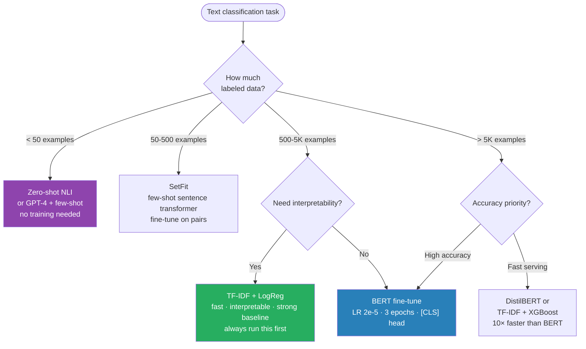

# Text Classification

---

## Quick Reference

| Approach | When to Use | Accuracy | Speed |
|----------|-------------|----------|-------|
| TF-IDF + LR/SVM | Baseline, small data, interpretability needed | Good | Very fast |
| TF-IDF + XGBoost | Tabular-style NLP, feature engineering | Good | Fast |
| BiLSTM | Sequential context, medium data (~50K) | Better | Medium |
| BERT fine-tune | High accuracy needed, 1K+ labeled examples | Best | Slow |
| SetFit (few-shot) | <100 labeled examples, rapid prototyping | Good | Medium |
| Zero-shot (NLI) | No labeled data, exploratory | OK | Slow |

**Golden rule: Always start with TF-IDF + LogReg baseline before touching transformers.**



---

## Core Concepts

### Problem Types

```
Binary:        spam/not-spam, sentiment (pos/neg)
Multi-class:   topic classification (1 of N classes)
Multi-label:   document tags (multiple labels per document)
Hierarchical:  coarse + fine (news: Sports → Football)
Ordinal:       ratings 1-5 (treat as regression or classification)
```

### Classic Pipeline: TF-IDF → Linear Model

```
Text → Preprocessing → TF-IDF Vectorizer → Classifier
                        (fit on train only!)
```

```python
from sklearn.pipeline import Pipeline
from sklearn.feature_extraction.text import TfidfVectorizer
from sklearn.linear_model import LogisticRegression
from sklearn.svm import LinearSVC

pipeline = Pipeline([
    ('tfidf', TfidfVectorizer(
        max_features=50000,
        ngram_range=(1, 2),          # unigrams + bigrams
        sublinear_tf=True,           # log(1+tf) instead of raw tf
        min_df=2,                    # ignore rare terms
        strip_accents='unicode',
        analyzer='word'
    )),
    ('clf', LogisticRegression(
        C=1.0,
        max_iter=1000,
        class_weight='balanced'      # handle imbalance
    ))
])

pipeline.fit(X_train, y_train)
y_pred = pipeline.predict(X_test)
```

---

## BiLSTM Classifier

```python
import torch
import torch.nn as nn

class BiLSTMClassifier(nn.Module):
    def __init__(self, vocab_size, embed_dim, hidden_dim, num_classes,
                 num_layers=2, dropout=0.3, pad_idx=0):
        super().__init__()
        self.embedding = nn.Embedding(vocab_size, embed_dim, padding_idx=pad_idx)
        self.lstm = nn.LSTM(
            embed_dim, hidden_dim,
            num_layers=num_layers,
            bidirectional=True,
            batch_first=True,
            dropout=dropout if num_layers > 1 else 0
        )
        self.dropout = nn.Dropout(dropout)
        self.fc = nn.Linear(hidden_dim * 2, num_classes)  # ×2 for bidirectional

    def forward(self, x, lengths):
        embedded = self.dropout(self.embedding(x))
        # Pack for efficiency (handles variable length sequences)
        packed = nn.utils.rnn.pack_padded_sequence(
            embedded, lengths.cpu(), batch_first=True, enforce_sorted=False
        )
        packed_output, (hidden, cell) = self.lstm(packed)
        # Concatenate final forward + backward hidden states
        # hidden shape: [num_layers*2, batch, hidden_dim]
        hidden = self.dropout(torch.cat([hidden[-2], hidden[-1]], dim=1))
        return self.fc(hidden)
```

---

## BERT Fine-tuning (Standard Pattern)

```python
from transformers import AutoTokenizer, AutoModelForSequenceClassification
from transformers import TrainingArguments, Trainer
import torch

model_name = "bert-base-uncased"   # or domain-specific: "allenai/scibert_scivocab_uncased"

tokenizer = AutoTokenizer.from_pretrained(model_name)
model = AutoModelForSequenceClassification.from_pretrained(
    model_name,
    num_labels=num_classes,
    hidden_dropout_prob=0.1,
    attention_probs_dropout_prob=0.1
)

# Tokenize
def tokenize_fn(batch):
    return tokenizer(
        batch['text'],
        truncation=True,
        max_length=512,
        padding='max_length'
    )

# Training arguments
training_args = TrainingArguments(
    output_dir='./results',
    num_train_epochs=3,
    per_device_train_batch_size=16,
    per_device_eval_batch_size=32,
    warmup_ratio=0.1,              # 10% of steps for LR warmup
    learning_rate=2e-5,            # classic BERT LR range: 1e-5 to 5e-5
    evaluation_strategy='epoch',
    save_strategy='epoch',
    load_best_model_at_end=True,
    metric_for_best_model='f1',
    fp16=True,                     # mixed precision
    dataloader_num_workers=4,
)

trainer = Trainer(
    model=model,
    args=training_args,
    train_dataset=train_dataset,
    eval_dataset=val_dataset,
    compute_metrics=compute_metrics,
)
trainer.train()
```

---

## Multi-label Classification

```python
# Key difference: sigmoid (not softmax), BCEWithLogitsLoss (not CrossEntropy)
model = AutoModelForSequenceClassification.from_pretrained(
    model_name,
    num_labels=num_labels,
    problem_type="multi_label_classification"   # switches loss automatically
)

# Manual approach
output = model(input_ids, attention_mask=attention_mask)
logits = output.logits
loss_fn = nn.BCEWithLogitsLoss()
loss = loss_fn(logits, labels.float())   # labels: [batch, num_labels] float

# Inference: apply threshold (default 0.5, tune on validation)
probs = torch.sigmoid(logits)
preds = (probs > 0.5).int()

# Per-label F1 (micro/macro/samples)
from sklearn.metrics import f1_score
f1_micro   = f1_score(y_true, y_pred, average='micro')
f1_macro   = f1_score(y_true, y_pred, average='macro')
f1_samples = f1_score(y_true, y_pred, average='samples')  # per-sample avg
```

---

## Metrics Selection

### Binary Classification

```python
from sklearn.metrics import (
    accuracy_score, precision_score, recall_score, f1_score,
    roc_auc_score, average_precision_score, classification_report
)

# Imbalanced dataset → use PR-AUC, not ROC-AUC
# When FP costly (spam filter) → precision focus
# When FN costly (fraud detection) → recall focus

print(classification_report(y_true, y_pred, target_names=class_names))
print(f"ROC-AUC: {roc_auc_score(y_true, y_prob):.4f}")
print(f"PR-AUC:  {average_precision_score(y_true, y_prob):.4f}")
```

### Multi-class Classification

```python
# Macro F1: treat all classes equally (good when all classes matter)
# Weighted F1: weight by support (good for reporting)
# Micro F1: global TP/FP/FN (equals accuracy when single-label)

f1_macro    = f1_score(y_true, y_pred, average='macro')
f1_weighted = f1_score(y_true, y_pred, average='weighted')

# Confusion matrix heatmap
import seaborn as sns
import matplotlib.pyplot as plt
from sklearn.metrics import confusion_matrix

cm = confusion_matrix(y_true, y_pred)
sns.heatmap(cm, annot=True, fmt='d', xticklabels=class_names, yticklabels=class_names)
plt.xlabel('Predicted'); plt.ylabel('True')

# compute_metrics for HuggingFace Trainer
from sklearn.metrics import f1_score, accuracy_score
import numpy as np

def compute_metrics(eval_pred):
    logits, labels = eval_pred
    preds = np.argmax(logits, axis=-1)
    return {
        'accuracy':    accuracy_score(labels, preds),
        'f1_macro':    f1_score(labels, preds, average='macro'),
        'f1_weighted': f1_score(labels, preds, average='weighted'),
    }
```

---

## Class Imbalance Handling

### Strategy Selection

```
Ratio < 1:10   → class_weight='balanced' usually sufficient
Ratio 1:10 to 1:100 → oversampling minority OR focal loss
Ratio > 1:100  → anomaly detection framing OR aggressive oversampling + undersampling
```

### class_weight='balanced'

```python
# sklearn: automatic
LogisticRegression(class_weight='balanced')
LinearSVC(class_weight='balanced')

# PyTorch: compute weights
from sklearn.utils.class_weight import compute_class_weight
import torch

class_weights = compute_class_weight('balanced', classes=np.unique(y_train), y=y_train)
weights = torch.FloatTensor(class_weights).to(device)
criterion = nn.CrossEntropyLoss(weight=weights)
```

### Focal Loss for Severe Imbalance

```python
class FocalLoss(nn.Module):
    """Focal loss: down-weights easy examples, focuses on hard ones."""
    def __init__(self, alpha=1, gamma=2):
        super().__init__()
        self.alpha = alpha
        self.gamma = gamma

    def forward(self, logits, targets):
        ce_loss = nn.CrossEntropyLoss(reduction='none')(logits, targets)
        pt      = torch.exp(-ce_loss)             # probability of correct class
        focal_loss = self.alpha * (1 - pt)**self.gamma * ce_loss
        return focal_loss.mean()
```

### Threshold Tuning (Most Underused Trick)

```python
# Default threshold 0.5 is rarely optimal for imbalanced data
from sklearn.metrics import precision_recall_curve

prec, rec, thresholds = precision_recall_curve(y_true, y_prob)

# Find threshold that maximizes F1
f1_scores = 2 * prec * rec / (prec + rec + 1e-8)
best_threshold = thresholds[np.argmax(f1_scores)]
print(f"Best threshold: {best_threshold:.3f}, F1: {max(f1_scores):.3f}")

y_pred_tuned = (y_prob >= best_threshold).astype(int)

# Tune threshold per label (multi-label)
best_thresholds = []
for i in range(num_labels):
    prec, rec, thresh = precision_recall_curve(y_true[:, i], y_prob[:, i])
    f1 = 2*prec*rec / (prec+rec+1e-8)
    best_thresholds.append(thresh[np.argmax(f1[:-1])])
```

---

## Few-Shot and Zero-Shot

### SetFit (Contrastive fine-tuning, <100 examples)

```python
from setfit import SetFitModel, Trainer, TrainingArguments

model = SetFitModel.from_pretrained("sentence-transformers/paraphrase-mpnet-base-v2")

args = TrainingArguments(
    batch_size=16,
    num_epochs=1,                  # contrastive phase epochs
    num_iterations=20,             # number of positive/negative pairs
)

trainer = Trainer(
    model=model,
    args=args,
    train_dataset=train_dataset,   # even 8-16 examples per class works
    eval_dataset=eval_dataset,
    metric="f1",
)
trainer.train()
```

### Zero-Shot via NLI (No labeled data)

```python
from transformers import pipeline

classifier = pipeline("zero-shot-classification",
                      model="facebook/bart-large-mnli")

result = classifier(
    "Apple just released a new iPhone model.",
    candidate_labels=["technology", "sports", "finance", "entertainment"],
    multi_label=False
)
print(result['labels'][0])   # top predicted label
```

---

## When to Use What

| Scenario | Recommended Approach |
|----------|----------------------|
| Baseline / interpretability | TF-IDF + LogisticRegression |
| <500 labeled examples | SetFit or zero-shot NLI |
| 500-5K examples, need fast iteration | TF-IDF + XGBoost with feature engineering |
| 5K-50K, sequential context matters | BiLSTM with pretrained embeddings |
| >1K examples, accuracy is top priority | BERT/RoBERTa fine-tune |
| Domain-specific text (medical, legal, ict) | Domain-adapted model (BioBERT, LegalBERT) |
| Production, low latency | DistilBERT, ONNX export, quantization |
| Multilingual | XLM-RoBERTa |

---

## Gotchas

**Data leakage:** Fit TF-IDF only on train — sklearn Pipeline handles this; manual approach doesn't.

**Max length truncation:** BERT truncates at 512 tokens. For long documents: Sliding window (classify chunks, aggregate) → Hierarchical model (chunk → sentence → document) → Longformer or BigBird (up to 4096 tokens).

**Label imbalance in validation:** Use stratified splits always.

```python
from sklearn.model_selection import train_test_split
X_train, X_val, y_train, y_val = train_test_split(
    X, y, test_size=0.2, stratify=y, random_state=42
)
```

**BERT LR too high:** Use warmup. Without warmup, catastrophic forgetting in early steps.

**class_weight in HuggingFace Trainer:** Not directly supported — subclass Trainer and override `compute_loss`.

```python
class WeightedTrainer(Trainer):
    def compute_loss(self, model, inputs, return_outputs=False):
        labels = inputs.pop("labels")
        outputs = model(**inputs)
        logits = outputs.logits
        loss = nn.CrossEntropyLoss(weight=class_weights)(logits, labels)
        return (loss, outputs) if return_outputs else loss
```

**Multi-label threshold:** Per-label thresholds often better than global 0.5.

---

## Debugging Guide

**Model predicts same class for everything:** Check class imbalance — add `class_weight='balanced'`. Check if loss is NaN in early steps — reduce LR. Check if labels are correct (0-indexed vs 1-indexed).

**Validation loss increases after epoch 1 (BERT):** Learning rate too high — try 1e-5 or 2e-5. Add dropout (hidden_dropout_prob=0.1). Reduce num_train_epochs to 2-3.

**TF-IDF + LR overfitting:** Reduce max_features, increase min_df, increase regularization.

**Poor performance on minority class:** Check per-class F1 in classification_report. Try threshold tuning on validation set. Try focal loss or oversampling.

**Slow BERT training:** Enable `fp16=True` in TrainingArguments. Use gradient checkpointing: `model.gradient_checkpointing_enable()`. Reduce `max_length` if most texts are short.

---

## Production Patterns

### Long Document Classification (Sliding Window)

```python
def classify_long_document(text, tokenizer, model, max_length=512, stride=128):
    """Sliding window: classify overlapping chunks, aggregate by voting or avg prob."""
    tokens = tokenizer.encode(text, add_special_tokens=False)
    chunk_preds = []

    for start in range(0, len(tokens), max_length - stride):
        chunk  = tokens[start:start + max_length]
        inputs = tokenizer.prepare_for_model(chunk, max_length=max_length,
                                             truncation=True, return_tensors='pt')
        with torch.no_grad():
            logits = model(**inputs).logits
            chunk_preds.append(torch.softmax(logits, dim=-1).squeeze().numpy())

    # Aggregate: mean probabilities across chunks
    final_probs = np.mean(chunk_preds, axis=0)
    return np.argmax(final_probs)
```

### ONNX Export for Fast Inference

```python
# Export
torch.onnx.export(
    model,
    (input_ids, attention_mask),
    "classifier.onnx",
    input_names=['input_ids', 'attention_mask'],
    output_names=['logits'],
    dynamic_axes={'input_ids': {0: 'batch', 1: 'seq'},
                  'attention_mask': {0: 'batch', 1: 'seq'},
                  'logits': {0: 'batch'}},
    opset_version=12
)

# Inference (3-5× faster than PyTorch CPU)
import onnxruntime as ort
session = ort.InferenceSession("classifier.onnx")
logits  = session.run(['logits'], {'input_ids': ids, 'attention_mask': mask})[0]
```

---

## Interview Q&A

**Q: When would you use TF-IDF + LogReg over BERT?**

A: When you have <500 examples (BERT will overfit), need very fast inference (TF-IDF is 100× faster), or as a baseline to understand the data distribution before committing to a complex model.

**Q: BERT fine-tuning gives 0.95 on train, 0.70 on val. What do you do?**

A: Classic overfitting. Steps: (1) Check data — is val distribution different from train? (2) Reduce learning rate (try 1e-5). (3) Add dropout (0.2-0.3). (4) Fewer epochs (2 instead of 5). (5) More data augmentation (back-translation, synonym replacement). (6) If data is truly small, switch to SetFit or TF-IDF.

**Q: You have 10 classes but one class has 10× more examples. How do you handle it?**

A: Multi-pronged: (1) Stratified splits so val/test are balanced. (2) `class_weight='balanced'` for sklearn or custom loss for PyTorch. (3) Tune decision threshold per class on validation. (4) If severely imbalanced (>50:1), consider oversampling minority or undersampling majority. (5) Report per-class F1 (not just macro accuracy) — the class distribution problem often hides in aggregate metrics.

**Q: How do you classify documents longer than 512 tokens with BERT?**

A: Truncate: fast, works if key info is in first 512 tokens (often true for news). (2) Sliding window — classify overlapping chunks, aggregate predictions by mean/voting. (3) Hierarchical — encode sentences individually with BERT, aggregate with LSTM or another transformer. (4) Use Longformer/BigBird (linear attention up to 4096 tokens). Choice depends on where the signal lives in the document.

**Q: Your model has 99% accuracy on a fraud detection task. Is it good?**

A: No — if 1% of transactions are fraud, a model predicting "not fraud" always achieves 99%. Must use PR-AUC (or F1 of minority class) as the primary metric. ROC-AUC can also be misleading here because it uses false positives at all thresholds, including very low ones.

**Q: What's the difference between macro, micro, and weighted F1?**

A: Macro F1: average F1 per class, treating all classes equally — penalizes poor performance on small classes. Weighted F1: average weighted by support (good for reporting). Micro F1: compute global TP/FP/FN then compute F1 — for single-label classification equals accuracy. Use macro when all classes matter equally, weighted for reporting, micro when class frequency matters.

**Q: How does focal loss work and when do you use it?**

A: Focal loss adds a modulating factor `(1-pt)^γ` to cross-entropy, where `pt` is the predicted probability for the correct class. Easy examples (high `pt`) get down-weighted, hard examples (low `pt`) drive the loss. When γ=0, it reduces to standard CE. Use it for severe class imbalance (>50:1 ratio) especially in detection tasks. γ=2 is the standard starting point.

---

## Connections

- **Text Representations (fundamentals/02):** TF-IDF features feed directly into classic classifiers
- **Word Embeddings (embeddings/01):** Pretrained embeddings initialize BiLSTM embedding layer
- **RNN to Attention (sequence_models/01):** BiLSTM architecture used for sequence classification
- **Transformers (transformers/01):** BERT fine-tuning is the dominant classification approach
- **NER and Tagging (applications/02):** Token-level classification — same BERT backbone, different head
- **Model Evaluation (ML/fundamentals/04):** Same metric concepts (F1, PR-AUC, calibration) apply here
- **Class Imbalance (ML/fundamentals/03):** SMOTE/class_weight concepts from ML apply to NLP

---

## Key Takeaway

Text classification is solved: TF-IDF+LogReg for baselines and small data; BERT fine-tune for production accuracy. The real engineering is in imbalance handling (threshold tuning beats class_weight), long document strategies (sliding window or Longformer), and knowing when expensive BERT fine-tuning is overkill. For <100 labeled examples, SetFit is the secret weapon.

---

## Code Practice — Wired by Phase 6

- `code_practice/06_classification/01_tfidf_baseline/`
- `code_practice/06_classification/02_bert_finetune/`
- `code_practice/06_classification/03_imbalance/`
