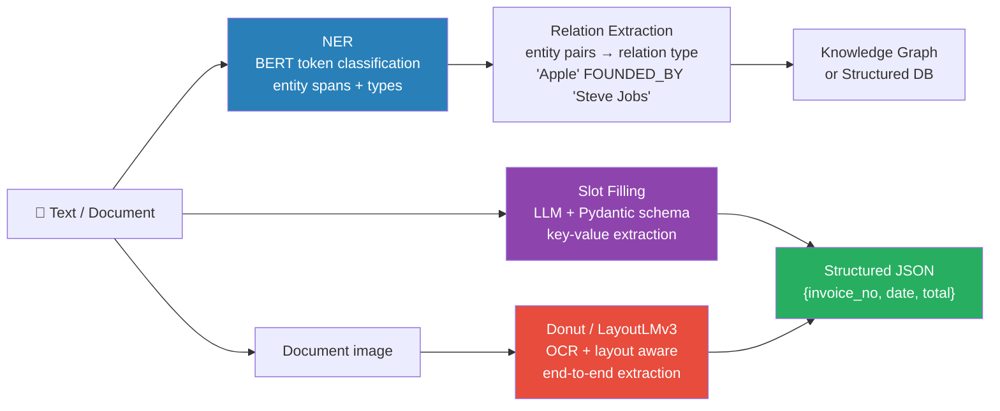

# Information Extraction

---

## Quick Reference

| Task | Input | Output | Key Technique |
|------|-------|--------|---------------|
| NER | Text | Entity spans + types | BERT token classification |
| Relation Extraction | Text + entity pairs | Relation type | BERT sentence pair |
| Slot Filling | Text + template | Structured fields | Prompted LLM / RE |
| Table Extraction | Document image | Structured table | TableTransformer / LLM |
| Document Parsing | Invoice/form image | Key-value JSON | Donut, LayoutLMv3 |
| Open IE | Text | (subject, predicate, object) | Stanford OpenIE |
| Coreference | Text | Entity clusters | CorefBERT |


> Modern default: LLM + Pydantic schema for flexible extraction; Donut/LayoutLMv3 for high-volume document AI.

**IE pipeline: Text → NER (entities) → RE (relations between entities) → Knowledge Graph / Structured DB**

---

## Core Concepts

### Information Extraction Pipeline

```
Raw Document
    ↓
[Text Extraction / OCR]
    ↓
[Preprocessing: cleaning, sentence split]
    ↓
[NER: find entity spans]
    ↓
[Relation Extraction: link entity pairs]
    ↓
[Normalization: dates, currencies, units]
    ↓
[Structured Output: JSON, DB, KG]
```

### Relation Extraction (RE)

**Problem:** Given text and two entity spans (entity1, entity2), predict the relation type.

```
"Steve Jobs co-founded Apple in 1976."
  PER                  ORG
= (Steve Jobs, FOUNDED_BY, Apple)
```

**Approaches:**
1. Pattern-based: Dependency path rules (fast, brittle)
2. BERT sentence pair: Concatenate entities + sentence, classify
3. Entity marker method: Insert special tokens around entities
4. Span-based: Jointly predict entities and relations

### BERT for Relation Extraction (Entity Marker Method)

```python
from transformers import AutoTokenizer, AutoModelForSequenceClassification
import torch

# Entity markers: wrap entities with special tokens
# "[E1] Steve Jobs [/E1] founded [E2] Apple [/E2]"
special_tokens = ['[E1]', '[/E1]', '[E2]', '[/E2]']
tokenizer.add_special_tokens({'additional_special_tokens': special_tokens})
model.resize_token_embeddings(len(tokenizer))

def prepare_re_input(text, e1_start, e1_end, e2_start, e2_end):
    """Insert entity markers around entities in text."""
    # Insert from right to left to preserve indices
    markers = [(e2_end, '[/E2]'), (e2_start, '[E2]'),
               (e1_end, '[/E1]'), (e1_start, '[E1]')]
    markers.sort(key=lambda x: -x[0])
    chars = list(text)
    for pos, marker in markers:
        chars.insert(pos, marker)
    return ''.join(chars)

class REModel(nn.Module):
    def __init__(self, encoder, num_relations, hidden_size=768):
        super().__init__()
        self.encoder = encoder
        # Use [CLS] representation + entity representations
        self.classifier = torch.nn.Linear(hidden_size * 3, num_relations)
        self.dropout = torch.nn.Dropout(0.1)

    def forward(self, input_ids, attention_mask, e1_mask, e2_mask):
        outputs = self.encoder(input_ids=input_ids, attention_mask=attention_mask)
        sequence_output = outputs.last_hidden_state    # [batch, seq, hidden]

        # Use [CLS] token
        cls_repr = sequence_output[:, 0, :]            # [batch, hidden]

        # Mean pool over entity tokens
        e1_repr = (sequence_output * e1_mask.unsqueeze(-1)).sum(1) / e1_mask.sum(1, keepdim=True)
        e2_repr = (sequence_output * e2_mask.unsqueeze(-1)).sum(1) / e2_mask.sum(1, keepdim=True)

        combined = torch.cat([cls_repr, e1_repr, e2_repr], dim=-1)
        return self.classifier(self.dropout(combined))
```

---

## Structured Extraction with LLMs — The 2024-2025 Default

For most extraction tasks today, the production-default pattern is **LLM + Pydantic schema + constrained decoding**. Zero fine-tuning. Handles arbitrary schemas. Robust to format drift in source documents.

```
The pattern:
1. Define a Pydantic model → your schema (validators included)
2. Prompt an LLM (local or API) with the source text + schema
3. Constrain the decoder so output MUST validate against the schema
4. Get back a typed Python object — never a JSON-parse failure
```

| Library | Backend | Notes |
|---------|---------|-------|
| Instructor | OpenAI, Anthropic, Gemini, Ollama, vLLM, MistralAI | Most popular; one-line replacement of `client.chat.completions.create()` |
| Marvin | OpenAI, Anthropic | High-level decorators (`@ai_fn`, `@ai_model`) |
| outlines | HF, vLLM, llama.cpp, OpenAI | Pure schema-constrained decoding; works with local models |
| TrustCall | Any LangChain-supported LLM | Specialized in extracting + updating structured state |
| LangExtract (LangChain) | LangChain abstractions | Integrates with their RAG/agent stack |
| Native function calling | OpenAI / Anthropic / Llama-3.1+ / Mistral | Raw API option |

```python
from typing import Optional
from pydantic import BaseModel, Field
import instructor
from openai import OpenAI

class LineItem(BaseModel):
    description: str
    quantity: int = Field(ge=1)
    unit_price: float = Field(ge=0)
    line_total: float

class Invoice(BaseModel):
    invoice_id: str
    vendor: str
    invoice_date: str = Field(description="ISO 8601")
    total_amount: float
    currency: str = Field(pattern="^[A-Z]{3}$")
    line_items: list[LineItem]
    notes: Optional[str] = None

client = instructor.from_openai(OpenAI())
invoice: Invoice = client.chat.completions.create(
    model="gpt-4o-mini",
    max_retries=2,               # auto-retry on validation failure
    messages=[
        {"role": "system", "content": "Extract invoice fields. Be precise; use ISO dates."},
        {"role": "user", "content": invoice_text_or_image_caption},
    ],
)
# invoice is a guaranteed-valid Invoice instance — no JSON parse failures
```

**Why this dominates in 2025:**
- Zero training data needed for new document types — just write the schema
- Pydantic validators catch garbage (negative quantities, malformed dates) before they reach downstream systems
- Same code works on text, image (via vision LLMs), audio (via Whisper + LLM)
- Multi-extraction: just nest models → `list[LineItem]` works directly

**When you'd still use LayoutLMv3 / Donut instead:**
- Throughput requirement > a few req/s at very low cost
- Documents visually rich and OCR-quality poor (vision LLMs help, but local fine-tuned models still win on consistency)
- Strict data residency / no API calls allowed

**Hybrid pattern:** OCR + layout extraction with LayoutLMv3 → final field extraction with Pydantic + LLM.

---

## Document Information Extraction (Document AI)

### Key-Value Extraction from Documents

**Approach 1: LayoutLMv3 (text + layout + vision)**

```python
from transformers import LayoutLMv3Processor, LayoutLMv3ForTokenClassification
from PIL import Image
import torch

# LayoutLMv3 takes: Image + OCR words + bounding boxes
processor = LayoutLMv3Processor.from_pretrained("microsoft/layoutlmv3-base")
model = LayoutLMv3ForTokenClassification.from_pretrained(
    "microsoft/layoutlmv3-base",
    num_labels=len(label_list)   # B-INVOICE_NUM, I-INVOICE_NUM, B-VENDOR, ...
)

# Input from OCR (e.g., AWS Textract or Tesseract)
image = Image.open("invoice.png").convert("RGB")
words  = ["Invoice", "#", "12345", "Vendor:", "Acme", "Corp"]
boxes  = [[10,20,80,35], [85,20,95,35], [100,20,150,35],
          [10,50,65,65], [70,50,150,65]]

# Normalize boxes to [0, 1000] range (LayoutLM convention)
def normalize_box(box, width, height):
    return [
        int(1000 * box[0] / width),
        int(1000 * box[1] / height),
        int(1000 * box[2] / width),
        int(1000 * box[3] / height),
    ]

encoding   = processor(image, words=words, boxes=boxes,
                        truncation=True, return_tensors="pt")
outputs    = model(**encoding)
predictions = outputs.logits.argmax(-1).squeeze().tolist()
```

**Approach 2: Donut (OCR-free, end-to-end)**

```python
from transformers import DonutProcessor, VisionEncoderDecoderModel
import torch, re, json

processor = DonutProcessor.from_pretrained("naver-clova-ix/donut-base-finetuned-cord-v2")
model     = VisionEncoderDecoderModel.from_pretrained("naver-clova-ix/donut-base-finetuned-cord-v2")

# Donut generates structured JSON from image directly
task_prompt      = "<s_cord-v2>"   # task-specific prompt
decoder_input_ids = processor.tokenizer(task_prompt, add_special_tokens=False,
                                         return_tensors="pt").input_ids
pixel_values = processor(image, return_tensors="pt").pixel_values
outputs = model.generate(
    pixel_values,
    decoder_input_ids=decoder_input_ids,
    max_length=model.decoder.config.max_position_embeddings,
    early_stopping=True,
    pad_token_id=processor.tokenizer.pad_token_id,
    eos_token_id=processor.tokenizer.eos_token_id,
    use_cache=True,
    num_beams=1,
    bad_words_ids=[[processor.tokenizer.unk_token_id]],
    return_dict_in_generate=True,
)
sequence = processor.batch_decode(outputs.sequences)[0]
sequence = sequence.replace(processor.tokenizer.eos_token, "").replace(
    processor.tokenizer.pad_token, "").strip()
sequence = re.sub(r"<.*?>", "", sequence, count=1).strip()
result   = processor.token2json(sequence)
# = {"menu": [{"nm": "Coffee", "cnt": "1", "price": "$4.50"}], "total": {"total_price": "$4.50"}}
```

### LLM-based Extraction (Prompt Engineering)

```python
import anthropic, json

def extract_invoice_fields(invoice_text: str) -> dict:
    """Use Claude to extract structured fields from invoice text."""
    client = anthropic.Anthropic()

    prompt = f"""Extract the following fields from this invoice. Return JSON only.

Fields to extract:
- invoice_number: string
- invoice_date: string (ISO format if possible)
- vendor_name: string
- vendor_address: string
- total_amount: number
- currency: string (USD, EUR, etc.)
- line_items: list of {{description, quantity, unit_price, total}}
- payment_terms: string

Invoice text:
{invoice_text}

Return only valid JSON. Use null for missing fields."""

    message = client.messages.create(
        model="claude-sonnet-4-6",
        max_tokens=2048,
        messages=[{"role": "user", "content": prompt}]
    )
    response_text = message.content[0].text
    # Extract JSON from response
    json_match = re.search(r'\{[\s\S]*\}', response_text, re.DOTALL)
    if json_match:
        return json.loads(json_match.group())
    return {}
```

### Hybrid Pipeline (OCR + NER + LLM fallback)

```python
class DocumentExtractionPipeline:
    """Production-grade document extraction pipeline."""

    def __init__(self, ner_model, llm_client, confidence_threshold=0.85):
        self.ner_model = ner_model
        self.llm_client = llm_client
        self.threshold = confidence_threshold

    def extract(self, document_image):
        # Step 1: OCR
        ocr_result = self.run_ocr(document_image)
        full_text  = ocr_result['text']

        # Step 2: Layout-aware NER
        ner_result = self.ner_model.predict(ocr_result)
        confidence = ner_result['confidence']

        # Step 3: Fall back to LLM if confidence low
        if confidence < self.threshold:
            return self.llm_extract(full_text)

        return self.postprocess(ner_result)

    def postprocess(self, ner_result):
        """Normalize extracted values."""
        entities = ner_result['entities']
        return {
            'invoice_number': self.find_entity(entities, 'INVOICE_NUM'),
            'date':           self.normalize_date(self.find_entity(entities, 'DATE')),
            'amount':         self.normalize_amount(self.find_entity(entities, 'AMOUNT')),
            'vendor':         self.find_entity(entities, 'ORG'),
        }

    def normalize_date(self, date_str):
        """Standardize date formats: 01/15/2024, Jan 15 2024, 15-01-2024 → 2024-01-15"""
        from dateutil import parser
        try:
            return parser.parse(date_str).strftime('%Y-%m-%d')
        except:
            return date_str

    def normalize_amount(self, amount_str):
        """Standardize $1,234.56 + 123n .56"""
        if not amount_str:
            return None
        cleaned = re.sub(r'[^\d.]', '', amount_str)
        return float(cleaned) if cleaned else None
```

---

## Slot Filling

**Task:** Given a template (form schema), fill slots from text.

```python
# Template-based slot filling with BERT QA
from transformers import pipeline

qa_pipeline = pipeline("question-answering", model="deepset/roberta-base-squad2")

# Convert slot filling to reading comprehension
slots = {
    "invoice_number": "What is the invoice number?",
    "total_amount":   "What is the total amount?",
    "vendor":         "Who is the vendor or supplier?",
    "due_date":       "What is the payment due date?",
}

def fill_slots_with_qa(text, slots, qa_pipeline):
    results = {}
    for slot, question in slots.items():
        answer = qa_pipeline(question=question, context=text)
        results[slot] = {
            'value': answer['answer'],
            'score': answer['score']
        }
    return results

invoice_text = """
INVOICE #INV-2024-001
Date: January 15, 2026
Vendor: Acme Corporation
Total Due: $5,032.00
Payment Terms: Net 30
"""
filled = fill_slots_with_qa(invoice_text, slots, qa_pipeline)
```

---

## Table Extraction

```python
# Microsoft Table Transformer for table detection + structure recognition
from transformers import AutoImageProcessor, TableTransformerForObjectDetection
from PIL import Image
import torch

# Step 1: Detect tables in document
image = Image.open("document.png").convert("RGB")
processor = AutoImageProcessor.from_pretrained("microsoft/table-transformer-detection")
model     = TableTransformerForObjectDetection.from_pretrained("microsoft/table-transformer-detection")

inputs  = processor(images=image, return_tensors="pt")
outputs = model(**inputs)

# Post-process to get table bounding boxes
target_sizes = torch.tensor([image.size[::-1]])
results = processor.post_process_object_detection(outputs, threshold=0.9,
                                                   target_sizes=target_sizes)[0]

# Step 2: For each detected table, run structure recognition
structure_model = TableTransformerForObjectDetection.from_pretrained(
    "microsoft/table-transformer-structure-recognition"
)
# Crop table region and detect rows/columns/cells
```

---

## Coreference Resolution

```python
import spacy

# spaCy coreference extension
nlp = spacy.load("en_core_web_lg")
nlp.add_pipe('coreferee')

doc = nlp("Apple Inc. was founded in 1976. It is headquartered in Cupertino.")
# Apple Inc. = It

def resolve_coreferences(doc):
    # Resolve: replace pronouns with their antecedents
    resolved = []
    for token in doc:
        repres = doc._.coref_chains.resolve(token)
        if repres:
            resolved.append(' '.join(t.text for t in repres))
        else:
            resolved.append(token.text)
    return ' '.join(resolved)
```

---

## When to Use What

| Scenario | Approach |
|----------|----------|
| Standard forms/invoices, labeled training data | LayoutLMv3 fine-tune |
| Documents with no training data | Donut (pretrained) or LLM prompting |
| Relation extraction with labeled data | BERT-RE with entity markers |
| Slot filling, flexible schema | QA-based (RoBERTa-SQuAD) or LLM |
| High-throughput, cost-sensitive | Fine-tuned small model (DistilBERT) |
| Complex reasoning over document | LLM (Claude/GPT-4) with chain-of-thought |
| Table data in documents | TableTransformer + cell content extraction |

---

## Gotchas

**OCR errors propagate:** Garbage in, garbage out. OCR quality is the biggest bottleneck. Preprocess: deskew, denoise, enhance contrast before OCR. Monitor OCR confidence scores.

**Bounding box normalization:** LayoutLM requires boxes in [0, 1000] range. Forget to normalize → completely wrong position embeddings → model fails silently.

**Multi-page documents:** LayoutLMv3 handles single pages. For multi-page: (1) process each page independently, (2) use page-level aggregation, (3) consider hierarchical approach.

**Date and currency diversity:** Dates appear in dozens of formats; amounts use different separators (1,234.56 vs 1.234,56). Always normalize post-extraction with dateutil parser and regex cleaning.

**LLM hallucination in extraction:** LLMs sometimes "fill in" values that don't appear in the document. Grounding: always verify LLM-extracted values exist in source text via string matching.

**Entity boundary in RE:** If NER gets entity boundaries wrong, RE will fail. Build RE on top of gold NER during development, then integrate NER predictions for production.

---

## Evaluation

```python
# Field-level extraction evaluation
from sklearn.metrics import f1_score, precision_score, recall_score

def evaluate_extraction(ground_truth, predictions, fields):
    """Evaluate per-field extraction accuracy."""
    results = {}
    for field in fields:
        gt_vals   = [item.get(field, '') for item in ground_truth]
        pred_vals = [item.get(field, '') for item in predictions]

        # Exact match accuracy
        exact_match = sum(g == p for g, p in zip(gt_vals, pred_vals)) / len(gt_vals)

        # Normalized string match (case-insensitive, stripped)
        norm_match = sum(
            str(g).lower().strip() == str(p).lower().strip()
            for g, p in zip(gt_vals, pred_vals)
        ) / len(gt_vals)

        results[field] = {'exact_match': exact_match, 'normalized_match': norm_match}

    return results

# For amount extraction: use numeric tolerance
def amount_match(gt, pred, tolerance=0.01):
    try:
        return abs(float(gt) - float(pred)) <= tolerance
    except:
        return str(gt).strip() == str(pred).strip()
```

---

## Interview Q&A

**Q: How would you build an end-to-end invoice extraction system?**

A: (1) OCR layer — AWS Textract or Google Document AI for words + bounding boxes + confidence. (2) Layout-aware NER — fine-tune LayoutLMv3 on labeled invoices with fields: INVOICE_NUM, DATE, VENDOR, TOTAL_AMOUNT, LINE_ITEM, etc. (3) Post-processing — normalize dates (dateutil), amounts (regex), vendor names (fuzzy match to vendor DB). (4) Confidence gating — if NER confidence below threshold, fall back to LLM extraction (Claude) with grounding check. (5) Evaluation — field-level exact match and normalized match on held-out test set, monitored per field type. (6) Human-in-the-loop for low-confidence extractions.

**Q: What's the difference between NER and slot filling?**

A: NER finds entity mentions in text and labels their type (open-domain: PER, ORG, LOC). Slot filling maps text to a predefined schema (closed-domain: document extraction blurs this line: define custom entity types (INVOICE_NUM, VENDOR) that match your schema, so it's both). QA-based slot filling treats each slot as a reading comprehension question, which handles flexible document structure better than fixed IOB tagging.

**Q: How do you handle documents where layout matters (e.g., "Total" means different things in different positions)?**

A: This is exactly the use case for LayoutLM. Standard BERT sees "Total" as a flat string regardless of where it appears. LayoutLMv3 adds 2D position embeddings from OCR bounding box coordinates, so "Total" in the bottom-right corner of an invoice is distinguished from "Total" in a header. For multi-column documents, this positional context is essential.

**Q: How do you evaluate an information extraction system in production?**

A: Multiple levels: (1) Component-level — NER F1 per entity type, RE accuracy per relation type. (2) End-to-end field accuracy — exact match and normalized match per document field. (3) Business-level — % of documents processed without human review (straight-through processing rate), exception rate, time saved. (4) Error analysis — categorize failures: OCR errors, NER boundary errors, normalization failures. Each has different fixes. Monitor field-level accuracy in production.

**Q: LLM extraction vs fine-tuned model — when do you choose each?**

A: Fine-tuned model: high volume, consistent document format, have labeled training data, need low latency, cost-sensitive. LLM: low volume, highly variable formats, no training data, complex reasoning needed (e.g., compute tax = total − subtotal), rapid prototyping. In practice: start with LLM to establish baseline and generate pseudo-labels, then fine-tune a smaller model when you have enough data and need production scale. Use LLM as fallback for edge cases.

---

## Connections

- **NER (applications/02):** NER is the foundation of most IE pipelines
- **Text Classification (applications/01):** Document type classification often precedes field extraction
- **Transformers (transformers/01):** LayoutLMv3 extends BERT with 2D position embeddings; exact match, normalized match
- **Evaluation Metrics (applications/04):** Field-level exact match, normalized match
- **Computer Vision (CV):** Document layout analysis (Detectron2, TableTransformer) is a CV task
- **LLM prompting:** For low-volume, complex extraction tasks, prompt engineering beats fine-tuning

---

## Key Takeaway

IE is where NLP meets the real world. For document automation, layout matters; Donut or LLM prompting is the default when you don't have labeled training data. The hardest engineering is post-normalization (dates, amounts, names), confidence thresholding, and human-in-the-loop for exceptions. Build the pipeline end-to-end before optimizing any one component.

---

## Code Practice — Wired by Phase 6

- `code_practice/03_prompting/05_json_output/` — JSON mode + Pydantic
- `code_practice/03_prompting/06_function_calling/` — function calling
- `code_practice/04_5_advanced/02_function_calling_ft/` — fine-tune native tool-call
