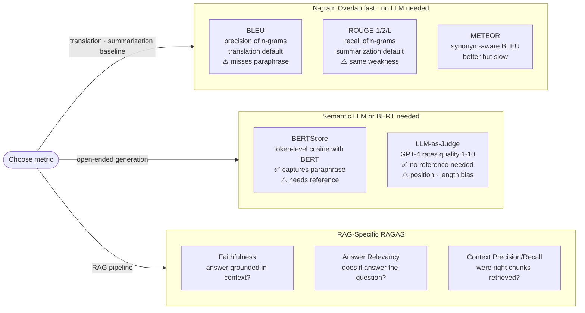

# Generative Evaluation Metrics — BLEU, ROUGE, METEOR, BERTScore, LLM-as-Judge

> How to measure the quality of generative outputs (summarization, translation, dialog, RAG). What each metric measures and where each fails.

---

## Table of Contents

1. Objective
2. N-gram overlap metrics
3. Embedding-based metrics
4. LLM-as-Judge
5. RAGAS — RAG-specific eval
6. Comparison — when to use what
7. Failure modes
8. Interview questions (5)
9. Further reading

---

## 1. Objective

Generative tasks have no single "correct" output. Evaluation is harder than classification.

The field of metrics: 30+ years of effort to approximate human judgment. Senior interview Q: "How would you evaluate a summarization model?" or "Why don't you trust BLEU scores?"

---


> Hierarchy of trust: human eval > Arena Elo > LLM-as-Judge > BERTScore > BLEU/ROUGE.

## 2. N-gram Overlap Metrics

### BLEU (Papineni et al. 2002)

For machine translation. Counts how many n-grams in the prediction also appear in the reference.

```
BLEU-N = BP × exp( Σ_{n=1..N} w_n × log(precision_n) )

precision_n = (n-grams in prediction also in reference) / (n-grams in prediction)
BP          = brevity penalty (penalize too-short predictions)
```

Typical N=4 (BLEU-4); weights uniform (1/N each).

### ROUGE (Lin 2004)

For summarization. Multiple variants:
- **ROUGE-N**: n-gram RECALL (vs BLEU's precision)
- **ROUGE-L**: longest common subsequence
- **ROUGE-W**: weighted LCS
- **ROUGE-SU**: skip-bigram

ROUGE-L and ROUGE-2 are standard for summarization eval.

### METEOR (Banerjee & Lavie 2005)

Improvement over BLEU: matches synonyms, stemmed words, paraphrases. Closer to human judgment but slower. Worth knowing exists; rarely used in 2024+.

### What These Metrics Get Wrong

```
- Surface-level only — match the words, not the meaning.
  "Cat sat on mat" vs "feline rested upon rug" → 0 BLEU but same meaning.

- Need multiple references — BLEU with 1 reference is noisy; 4+ references are recommended
  (most datasets have 1).

- Length-sensitive — predictions much shorter or longer than reference get penalized.

- Reward fluency over correctness — a fluent wrong answer can score higher than an awkward
  correct one.
```

In 2024+, these metrics are used for HISTORICAL comparability with old benchmarks. New work usually adds embedding-based or LLM-judge metrics alongside.

---

## 3. Embedding-based Metrics

### BERTScore (Zhang et al. 2019)

For each token in the prediction, find the most similar token in the reference (by BERT embedding cosine). Average. Soft, semantic version of n-gram overlap.

```
BERTScore-precision = mean over predicted tokens of max similarity to reference tokens
BERTScore-recall    = mean over reference tokens of max similarity to predicted tokens
BERTScore-F1        = harmonic mean
```

Pros: catches paraphrases ("cat" = "feline"); captures meaning beyond surface form.
Cons: depends on which BERT you use; not great for evaluating creativity / multi-step reasoning.

### BLEURT (Sellam et al. 2020)

Trained model that predicts human judgment from (prediction, reference) pairs. More accurate than BERTScore for translation. Less popular due to setup complexity.

### MoverScore (Zhao et al. 2019)

Earth-mover distance between BERT embedding distributions of prediction and reference. Captures structural similarity. Niche but interesting.

---

## 4. LLM-as-Judge

The 2023+ default for evaluating generative outputs.

### The Setup

Give a strong LLM (GPT-4, Claude Opus) the prompt + prediction + (optional) reference. Ask it to score quality on a rubric.

```
Prompt:
You are evaluating an AI-generated answer.
QUESTION: {prompt}
ANSWER: {prediction}
REFERENCE ANSWER: {reference} [optional]

Score the answer on:
- Correctness (1-5): does it factually answer the question?
- Completeness (1-5): does it address all aspects?
- Faithfulness (1-5): is it consistent with the reference?

Output as JSON: {"correctness": int, "completeness": int, "faithfulness": int}
```

### Strengths

- Correlates better with human judgment than n-gram metrics
- Can evaluate without a reference (Q1 = "is this answer reasonable for the question?")
- Scales — judge a million outputs by spending $1000 in API calls

### Weaknesses

- **Position bias**: judges favor the first option in pairwise comparison
- **Length bias**: longer answers get rated higher (even when no better)
- **Self-preference**: GPT-4 judging GPT-4 outputs inflates scores
- **Format bias**: bullet points / clear structure score higher independent of content
- **Cost**: 1-50× the cost of generating the output you're judging

### Mitigations

- Randomize order in pairwise comparison
- Use a DIFFERENT model family as judge than as generator
- Calibrate with ~50 human-labeled examples
- Use multiple judges and take majority

**In 2024+: LLM-as-judge is the default for LLM evaluation**, but always with the caveats above.

---

## 5. RAGAS — RAG-specific eval

RAG outputs have specific failure modes (hallucinated against context, irrelevant retrieval). RAGAS framework (Es et al. 2023) defines RAG-specific metrics, all computed by an LLM judge.

### Core Metrics

| Metric | What it measures | Method |
|--------|-----------------|--------|
| Faithfulness | Is the answer SUPPORTED by retrieved context? | LLM decomposes answer into claims; for each claim, checks if context entails it |
| Answer Relevance | Does the answer address the question? | LLM generates N questions the answer would plausibly respond to; measure similarity to original Q |
| Context Precision | Are top-K retrieved chunks relevant? | LLM scores each chunk's relevance to question |
| Context Recall | Are ALL ground-truth relevant chunks retrieved? | LLM compares retrieved chunks to ground-truth reference |

### How to Use It

```python
from ragas import evaluate
from ragas.metrics import faithfulness, answer_relevancy, context_precision, context_recall

result = evaluate(
    dataset=eval_dataset,   # has columns: question, answer, contexts, ground_truth
    metrics=[faithfulness, answer_relevancy, context_precision, context_recall],
)
```

**Diagnostic value:** if faithfulness drops, GENERATION is hallucinating. If context_recall drops, RETRIEVAL is missing docs. Isolates failure stages.

---

## 6. Comparison — When to Use What

| Task | Recommended metric stack |
|------|--------------------------|
| Machine translation | BLEU (legacy comparability) + BERTScore + LLM-judge |
| Summarization | ROUGE-2 / ROUGE-L + BERTScore + LLM-judge |
| Dialog quality | LLM-judge (rubric-based) |
| RAG quality | RAGAS (faithfulness + answer relevance + context precision/recall) |
| Code generation | pass@k (test-based, deterministic) + LLM-judge |
| Open-ended generation | LLM-judge primarily, BERTScore as backup |
| Quick offline eval | exact match / key-fact regex (cheap) |
| Production traces | user satisfaction signals (clicks, ratings) over benchmark metrics |

**2026 production pattern:**
- Offline benchmark: domain-specific eval set + LLM-judge + RAGAS for RAG
- Online: user signals (thumbs, regenerate, dwell time) over LLM-judge

---

## 7. Failure Modes

1. **High BLEU, bad output** — metric reward fluent paraphrasing; output sounds good but is wrong. Always pair with semantic metric.

2. **High LLM-judge score, low user satisfaction** — judge optimizes for what LOOKS good (length, formatting, hedge phrases). Real users want CORRECT and CONCISE. Calibrate judge against user feedback.

3. **Faithfulness 0.95, answer relevance 0.4** — model is grounded but answers the wrong question. Usually a prompt bug — model paraphrased context instead of addressing the query.

4. **Reference-free LLM judge gives different scores than reference-based** — the judge has its own opinions when given no reference. For consistency, always provide a reference or use a deterministic rubric.

5. **Eval drift over time** — same model, same eval set, scores change because the judge model changed (e.g., GPT-4 → GPT-4o). Version-pin the judge.

---

## 8. Interview Questions (5)

**Q1: Why don't you trust BLEU scores for modern LLM evaluation?**

BLEU measures n-gram overlap with reference. It's surface-level — penalizes paraphrases ("car" vs "automobile" = 0 BLEU), requires reference matches, is length-sensitive. A fluent wrong answer can outscore an awkward correct one. For modern LLM outputs (often longer, more creative, more variable), BLEU correlates poorly with human judgment. Use BERTScore + LLM-judge instead.

**Q2: What is LLM-as-Judge and what are its biases?**

Use a strong LLM (GPT-4, Claude) to score model outputs on a rubric. Higher correlation with human judgment than n-gram metrics. Biases: position (favors first in pairwise), length (longer answers rated higher even when no better), self-preference (GPT-4 likes GPT-4's outputs), format (bullet points score higher). Mitigations: randomize order, use a different model family as judge, calibrate against humans.

**Q3: How do you evaluate a RAG system specifically?**

RAGAS framework: faithfulness (answer supported by context?), answer relevance (does it address the Q?), context precision (retrieved chunks relevant?), context recall (got all the right chunks?). All computed by an LLM judge. Diagnostic value: each metric isolates a stage — if faithfulness drops, generation hallucinates; if context_recall drops, retrieval fails.

**Q4: What's BERTScore and when is it useful?**

For each predicted token, find the most similar reference token by BERT embedding cosine. Aggregate as precision/recall/F1. Captures paraphrases and semantic similarity beyond exact n-gram overlap. Useful as a middle ground between BLEU (too strict) and LLM-judge (expensive). Limited for creative / multi-step reasoning where semantic similarity isn't enough.

**Q5: How do you build a benchmark for a domain-specific LLM application?**

1. Collect 100-500 real user queries from production logs. 2. Have domain experts write gold answers + extract key facts each answer must contain. 3. Define metric stack: key-fact recall (cheap, deterministic) + LLM-judge rubric (correctness, completeness) + faithfulness if RAG. 4. Run eval on each model variant. 5. Iterate with user signals — once in production, weight benchmark scores against actual user feedback. The benchmark is a proxy for usefulness; user feedback is the ground truth.

---

## 9. Further Reading

- BLEU (Papineni et al. 2002)
- ROUGE (Lin 2004)
- BERTScore (Zhang et al. 2019) — arXiv:1904.09675
- BLEURT (Sellam et al. 2020) — arXiv:2004.04696
- RAGAS (Es et al. 2023) — arXiv:2309.15217
- LLM-as-Judge (Zheng et al. 2023) — arXiv:2306.05685 — "Judging LLM-as-a-Judge with MT-Bench"
- Chatbot Arena / LMSYS — chat.lmsys.org — human preference benchmark
