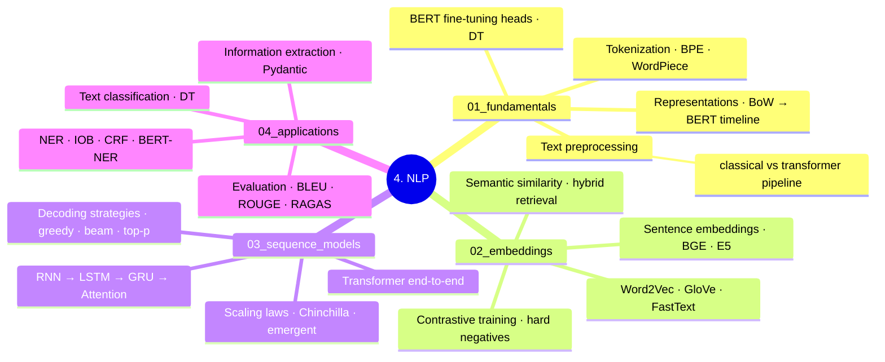

# 4. NLP

**Scope:** NLP-specific applications — tokenization, embeddings, sequence models (pre-transformer), decoding, NER/IE, NLP eval. The transformer architecture itself lives in `../5.transformers/`. Tier 2 (Theory).

---

## Reading Order

| If you're learning... | Read in order |
|-----------------------|---------------|
| NLP fundamentals | `01_fundamentals/01_text_preprocessing` → `02_text_representations` → `02b_text_representations_end_to_end` → `03_bert_finetuning_deep` |
| Embeddings | `02_embeddings/01_word_embeddings` → `02_word2vec_end_to_end` → `02_sentence_embeddings` → `03_sentence_embeddings_end_to_end` → `03_tokenization` → `04_tokenization_end_to_end` → `05_semantic_similarity` → `06_contrastive_training` |
| Sequence models (pre-transformer) | `03_sequence_models/01_rnn_to_attention` → `02_rnn_end_to_end` → `03_lstm` → `04_gru` → `05_attention_end_to_end` → `06_transformer_end_to_end` |
| Decoding strategies | `03_sequence_models/07_decoding_strategies` |
| Scaling laws | `03_sequence_models/08_scaling_laws_emergent` |
| NLP applications | `04_applications/01_text_classification` → `02_ner_and_tagging` → `03_information_extraction` → `04_evaluation_metrics` → `04b_evaluation_metrics_end_to_end` → `06_generative_eval` |

---

## Folder TOC

### 01_fundamentals/

| File | Owns |
|------|------|
| 01_text_preprocessing.md | Cleaning, normalization, language detection |
| 02_text_representations.md | BoW, TF-IDF, BM25 |
| 02b_text_representations_end_to_end.md | Worked example — TF-IDF / BM25 matrices |
| 03_bert_finetuning_deep.md | BERT fine-tuning deep (LoRA, distillation, contrastive) |

### 02_embeddings/

| File | Owns |
|------|------|
| 01_word_embeddings.md | Word2Vec, GloVe, FastText |
| 02_word2vec_end_to_end.md | Worked example — skip-gram, negative sampling |
| 02_sentence_embeddings.md | **SSOT**: SBERT + modern embedders (BGE / E5 / Nomic / jina-v3 / mxbai) + rerankers |
| 03_sentence_embeddings_end_to_end.md | Worked example — cosine sim with numbers |
| 03_tokenization.md | BPE / WordPiece / SentencePiece / tiktoken / Unigram |
| 04_tokenization_end_to_end.md | Worked example — BPE merges |
| 05_semantic_similarity.md | **SSOT**: Hybrid retrieval (BM25 + dense + RRF + reranker) |
| 06_contrastive_training.md | **SSOT**: Contrastive embedder training (hard negatives, in-batch) |

### 03_sequence_models/

| File | Owns |
|------|------|
| 01_rnn_to_attention.md | RNN → LSTM → GRU → attention transition |
| 02_rnn_end_to_end.md | Worked examples for each |
| 06_transformer_end_to_end.md | — |
| 07_decoding_strategies.md | **SSOT**: greedy / beam / top-k / top-p + speculative / constrained / min-p / DRY |
| 08_scaling_laws_emergent.md | Chinchilla, emergent abilities, scaling laws |

### 04_applications/

| File | Owns |
|------|------|
| 01_text_classification.md | TF-IDF + LR / SVM / BiLSTM / BERT / SetFit |
| 02_ner_and_tagging.md | IOB / CRF / BERT-NER + GLINER + LLM-based NER |
| 03_information_extraction.md | RE / LayoutLM / Donut + Pydantic + Instructor + Marvin + outlines |
| 04_evaluation_metrics.md | **SSOT**: BLEU / ROUGE / BERTScore + MTEB / RAGAS / lm-eval-harness / Arena-Hard / RULER |
| 04b_evaluation_metrics_end_to_end.md | Worked example — BLEU/ROUGE/perplexity with numbers |
| 06_generative_eval.md | BERTScore, LLM-as-judge, MT-Bench depth |

---

## SSOT Topics Owned Here

- Modern embedders (BGE / E5 / Nomic / jina-v3 / mxba) → `02_embeddings/02_sentence_embeddings.md`
- Hybrid retrieval (BM25 + dense + RRF + reranker) → `02_embeddings/05_semantic_similarity.md`
- Contrastive training → `02_embeddings/06_contrastive_training.md`
- Modern decoding (speculative / constrained / min-p / DRY) → `03_sequence_models/07_decoding_strategies.md`
- Modern NER (GLINER + LLM-based) → `04_applications/02_ner_and_tagging.md`
- Structured extraction (Pydantic + Instructor + outlines) → `04_applications/03_information_extraction.md`
- MTEB / RAGAS / lm-eval-harness / Arena-Hard → `04_applications/04_evaluation_metrics.md`
- BERT fine-tuning depth → `01_fundamentals/03_bert_finetuning_deep.md`
- Scaling laws / emergent abilities → `03_sequence_models/08_scaling_laws_emergent.md`

---

## Connections

- **Transformer architecture:** `../5.transformers/`
- **LLM workflows** (prompting, fine-tuning): `../6.llms/`
- **RAG patterns:** `../7.rag/` (uses `02_embeddings/` and `04_applications/` extensively)
- **Agents:** `../8.agents/`
- **Generative model eval:** `../11.system_design/11_llm_evaluation_systems.md`

---

## Practice

- Phase 1 sequence models → `../code_practice/01_seq_models/` (all run)
- BPE tokenizer → `../code_practice/02_transformers/01_bpe/`
- Embeddings + RAG → `../code_practice/05_rag/02_embeddings/`
- NER → `../code_practice/01_seq_models/07_bilstm_ner/`
