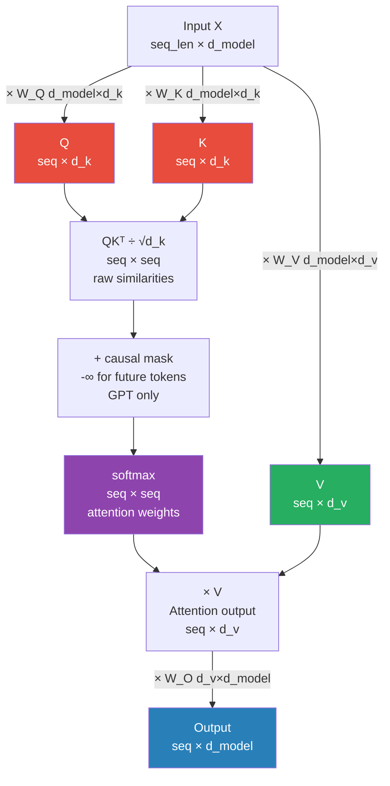

# Attention Mechanism

> **Scope note.** This file is the **reference**: formulas, shapes, variants, code. The mechanism is
> hand-computed with real numbers in
> [../../4.nlp/03_sequence_models/05_attention_end_to_end.md](../../4.nlp/03_sequence_models/05_attention_end_to_end.md)
> (attention alone) and
> [06b_transformer_encoder_multihead.md](../../4.nlp/03_sequence_models/06b_transformer_encoder_multihead.md)
> (two real heads at `d_model=4`, backward checked against `torch.autograd`).
> If you have worked those, skip §1–§2 here.
>
> Masking, the KV cache and Flash Attention have their own boards —
> [06c decoder](../../4.nlp/03_sequence_models/06c_transformer_decoder_end_to_end.md) and
> [04b attention at scale](../02_models/04b_attention_at_scale_end_to_end.md).

> The core operation of all transformers. QK^T/√d_k computes similarity scores, softmax converts to weights, weighted sum of V produces output. Everything else in transformers (BERT, GPT, T5) is built on top of this one operation.

---

## Quick Reference

| Term | Definition |
|------|-----------|
| Scaled dot-product | `Attention(Q,K,V) = softmax(QK^T/√d_k)V` |
| MHA | Concat(h heads)W_o — h parallel subspaces |
| MQA | h query heads share 1 K,V pair — memory efficient |
| GQA | h query heads share G K,V groups (1 < G < h) |
| MLA | Low-rank projection of K,V — DeepSeek's approach |
| Self-attention | Q, K, V all come from same sequence |
| Cross-attention | Q from one sequence; K, V from another |
| Causal mask | Upper-triangular -inf mask — block future tokens |
| FlashAttention 1/2/3 | IO-aware tiling — O(n) memory, no full n² matrix |

---

## 1. Scaled Dot-Product Attention

```
Attention(Q, K, V) = softmax(QK^T / √d_k) · V
```


> d_k = d_model / num_heads. For BERT-base: d_model=768, 12 heads → d_k=64.

### Why √d_k scaling?

Without scaling: dot products grow large as d_k increases → softmax saturates into near-one-hot → gradients vanish.

If `Q, K` have unit-variance entries, `q · k` has variance `d_k`. Dividing by `√d_k` returns it to 1.

**Measured** (200,000 random pairs per row):

```
    d_k    var(q·k)   predicted    var after / √d_k
      8        8.00           8              0.9998
     64       63.83          64              0.9974
    128      128.13         128              1.0010
    512      511.89         512              0.9998
```

**Why that matters — the saturation it prevents.** Mean over 2,000 draws, 64 keys:

```
    d_k   max p unscaled   max p scaled    Σ p(1−p) unscaled    scaled
      8           0.4269         0.1071               0.7175    0.9594
     64           0.7870         0.1069               0.2979    0.9608
    128           0.8536         0.1075               0.2064    0.9609
    512           0.9272         0.1072               0.1041    0.9613
```

**Unscaled, the attention row goes near one-hot as `d_k` grows** — max weight `0.4269 → 0.9272` —
and the softmax Jacobian mass `Σ p(1−p)` collapses by **6.9×**. Gradients through the attention
weights vanish, so `W_q` and `W_k` stop learning.

**Scaled, both are flat and `d_k`-independent** (`0.107` and `0.961` across a 64× range). That
invariance is the whole point: you can widen heads without retuning anything.

> Scale by **`√d_head`**, never `√d_model`. With `d_model=768` and 12 heads it is `√64 = 8`, not
> `√768 ≈ 27.7`. T5 omits the division entirely and folds it into initialisation — see
> [../02_models/07_t5_end_to_end.md](../02_models/07_t5_end_to_end.md) §4 for what that costs.

### Step-by-step computation

```
1. scores  = Q @ K.T           # [seq_q, seq_k]  — raw similarities
2. scores /= sqrt(d_k)         # scale
3. if mask: scores += mask      # -inf where blocked
4. weights = softmax(scores)    # [seq_q, seq_k]  — attention distribution
5. output  = weights @ V        # [seq_q, d_v]    — weighted value sum
```

### Code

```python
import torch
import torch.nn.functional as F
import math

def scaled_dot_product_attention(Q, K, V, mask=None):
    """
    Q: [batch, heads, seq_q, d_k]
    K: [batch, heads, seq_k, d_k]
    V: [batch, heads, seq_k, d_v]
    mask: [batch, 1, seq_q, seq_k] — True where attention should be blocked
    """
    d_k = Q.size(-1)
    scores = torch.matmul(Q, K.transpose(-2, -1)) / math.sqrt(d_k)
    # scores: [batch, heads, seq_q, seq_k]

    if mask is not None:
        scores = scores.masked_fill(mask, float('-inf'))

    attn_weights = F.softmax(scores, dim=-1)  # [batch, heads, seq_q, seq_k]
    attn_weights = F.dropout(attn_weights, p=0.1, training=True)

    output = torch.matmul(attn_weights, V)  # [batch, heads, seq_q, d_v]
    return output, attn_weights
```

---

## 2. Multi-Head Attention

### Why multiple heads?

- Single attention head: one "view" of relationships
- Multi-head: h parallel attention heads, each in a different learned subspace
- Head 1 might focus on syntactic dependencies
- Head 2 might focus on coreference
- Head 3 might focus on positional proximity
- ...each learns what's useful

### Formula

```
head_i = Attention(QW_i^Q, KW_i^K, VW_i^V)
MultiHead(Q, K, V) = Concat(head_1, ..., head_h) · W^o
```

Where:
- W_i^Q ∈ R^{d_model × d_k}
- W_i^K ∈ R^{d_model × d_k}
- W_i^V ∈ R^{d_model × d_v}
- W^o ∈ R^{h·d_v × d_model}

Typical: d_model=512, h=8, d_k = d_v = 512/8 = 64
Total params per MHA: 4 × d_model² (Wq, Wk, Wv, Wo)

### PyTorch Implementation

```python
import torch
import torch.nn as nn
import math

class MultiHeadAttention(nn.Module):
    def __init__(self, d_model, num_heads, dropout=0.1):
        super().__init__()
        assert d_model % num_heads == 0
        self.d_k = d_model // num_heads
        self.num_heads = num_heads

        self.W_q = nn.Linear(d_model, d_model)
        self.W_k = nn.Linear(d_model, d_model)
        self.W_v = nn.Linear(d_model, d_model)
        self.W_o = nn.Linear(d_model, d_model)
        self.dropout = nn.Dropout(dropout)

    def forward(self, query, key, value, mask=None):
        batch_size = query.size(0)

        # Project and reshape to [batch, heads, seq, d_k]
        Q = self.W_q(query).view(batch_size, -1, self.num_heads, self.d_k).transpose(1, 2)
        K = self.W_k(key).view(batch_size,   -1, self.num_heads, self.d_k).transpose(1, 2)
        V = self.W_v(value).view(batch_size, -1, self.num_heads, self.d_k).transpose(1, 2)

        # Scaled dot-product attention
        scores = torch.matmul(Q, K.transpose(-2, -1)) / math.sqrt(self.d_k)
        if mask is not None:
            scores = scores.masked_fill(mask == 0, float('-inf'))
        attn = self.dropout(torch.softmax(scores, dim=-1))

        # Combine heads
        output = torch.matmul(attn, V)               # [B, H, S, d_k]
        output = output.transpose(1, 2).contiguous() # [B, S, H, d_k]
        output = output.view(batch_size, -1, self.num_heads * self.d_k)  # [B, S, d_model]
        return self.W_o(output)
```

---

## 3. Positional Encoding

**Problem:** Self-attention is permutation-invariant — "cat sat mat" and "mat sat cat" produce same attention patterns without position info.

### Solution 1: Sinusoidal (original Transformer)

```
PE(pos, 2i)   = sin(pos / 10000^(2i/d_model))
PE(pos, 2i+1) = cos(pos / 10000^(2i/d_model))
```

Properties:
- Fixed (not learned)
- Unique for each position
- Relative distances computable via trig identities: PE(pos+k) = f(PE(pos))
- Extrapolates to unseen sequence lengths

```python
import torch
import math

class SinusoidalPositionalEncoding(nn.Module):
    def __init__(self, d_model, max_len=5000, dropout=0.1):
        super().__init__()
        self.dropout = nn.Dropout(dropout)

        # Compute encodings once
        pe = torch.zeros(max_len, d_model)
        position = torch.arange(0, max_len).unsqueeze(1).float()
        div_term = torch.exp(torch.arange(0, d_model, 2).float()
                             * (-math.log(10000.0) / d_model))
        pe[:, 0::2] = torch.sin(position * div_term)  # even dims
        pe[:, 1::2] = torch.cos(position * div_term)  # odd dims
        pe = pe.unsqueeze(0) # [1, seq_len, d_model]
        self.register_buffer('pe', pe)

    def forward(self, x):
        x = x + self.pe[:, :x.size(1), :]
        return self.dropout(x)
```

### Solution 2: Learned Absolute (BERT, GPT)

Simply an embedding table — position 0..max_len each gets a learned vector.

```python
self.position_embedding = nn.Embedding(num_position_embeddings, hidden_size)
positions = torch.arange(seq_len).unsqueeze(0)  # [1, seq_len]
pos_emb = self.position_embedding(positions)
```

### Solution 3: Rotary Position Embedding / RoPE (LLaMA, GPT-NeoX)

**Key insight:** encode position as rotation in complex space
`x_rotated = x · e^{iθm}` where m = position, θ = frequency

Properties:
- Relative positions naturally encoded: dot(Q_m, K_n) depends on (m-n)
- Better length generalization than absolute PE
- Used in modern LLMs: LLaMA, Mistral, Falcon

**Implementation:** rotate pairs of Q and K dimensions before attention

### Solution 4: ALiBi (Attention with Linear Biases)

Don't add position to embeddings at all. Instead, add a linear bias to attention scores:

```
scores = QK^T/√d_k - m · |i-j|
```

Where m is a head-specific slope, |i-j| is token distance.
- Closer tokens get less penalty; farther tokens get more
- Strong extrapolation to longer sequences
- Used in MPT, BLOOM

```python
# Add linear bias to attention scores
# Closer tokens get smaller penalty; farther tokens get larger
scores = Q @ K.T / math.sqrt(d_k)
slopes = get_alibi_slopes(num_heads)  # head-specific slope m
bias = -slopes.unsqueeze(-1) * torch.arange(seq_len).abs().unsqueeze(0)
scores = scores + bias
```

---

## 4. Attention Masks

### Padding mask (encoder): Ignore [PAD] tokens

```python
# attention_mask from tokenizer: 1=real token, 0=padding
# Convert to mask for attention scores
padding_mask = (attention_mask == 0)  # True where padding
# Shape: [batch, 1, 1, seq_len] to broadcast over heads and query positions
padding_mask = padding_mask.unsqueeze(1).unsqueeze(2)
scores = scores.masked_fill(padding_mask, float('-inf'))
```

### Causal mask (decoder / GPT): Prevent attending to future tokens

```python
def causal_mask(seq_len, device):
    """Upper triangular matrix of True (block future positions)."""
    mask = torch.triu(torch.ones(seq_len, seq_len, device=device), diagonal=1).bool()
    return mask  # [seq_len, seq_len]

# Token i can attend to tokens 0..i only
# Position 0: can attend to [0]
# Position 1: can attend to [0, 1]
# Position 2: can attend to [0, 1, 2]
# ...
```

---

## 5. Attention Complexity

### Standard self-attention

- **Time:** O(n² · d) — n² attention scores, each d-dimensional
- **Memory:** O(n²) — must store full attention matrix

### Bottleneck: the n² attention matrix for long sequences

| Sequence Length | Memory |
|----------------|--------|
| n=512 | 512² = 262K — fine |
| n=2048 | 2048² = 4M — manageable |
| n=8192 | 8192² = 67M — GPU memory pressure |
| n=100K | 100K² = 10B — impossible without optimization |

### Solutions

| Method | Time | Memory | Notes |
|--------|------|--------|-------|
| Flash Attention | O(n²·d) | O(n) | Tiling, no materialization |
| Sparse Attention | O(n√n) | O(n√n) | Attend to local window + strided global |
| Linear Attention | O(n) | O(n) | Kernel trick to avoid explicit softmax matrix |
| Sliding Window | O(n·w) | O(n·w) | Longformer, local window of size w |

---

## 6. Flash Attention

IO-aware implementation — computes attention in tiles so the `O(n²)` matrix is never written to HBM.

**Flash is faster, not slower.** It does *more* arithmetic (the backward pass recomputes attention
rather than storing it), but attention at length is **memory-bandwidth bound**, so removing the
write-then-read of the `n²` matrix wins easily. Saying "it trades compute for memory" invites the
wrong conclusion — the trade is FLOPs for *memory traffic*, and memory traffic is the binding
constraint.

**It is also exact** — bit-for-bit the same attention, verified to `1.665e-16` in
[../02_models/04b_attention_at_scale_end_to_end.md](../02_models/04b_attention_at_scale_end_to_end.md) §5,
which also derives the online-softmax rescaling that makes the tiling valid.

```python
# Flash Attention: compute attention in tiles to avoid materializing O(n²) matrix
# Trades compute for memory: recomputes attention during backward pass

# Usage in HuggingFace (automatic if flash-attn installed):
from transformers import AutoModelForCausalLM
model = AutoModelForCausalLM.from_pretrained(
    "meta-llama/Llama-2-7b-hf",
    attn_implementation="flash_attention_2",  # or "sdpa" (PyTorch scaled_dot_product_attention)
    torch_dtype=torch.bfloat16
)

# PyTorch native scaled_dot_product_attention (uses Flash Attention when available)
output = torch.nn.functional.scaled_dot_product_attention(
    Q, K, V,
    attn_mask=None,
    dropout_p=0.0,
    is_causal=True  # causal mask applied automatically
)
```

---

## 7. Attention Visualization (Debugging)

```python
from bertviz import head_view
from transformers import BertTokenizer, BertModel

tokenizer = BertTokenizer.from_pretrained('bert-base-uncased')
model = BertModel.from_pretrained('bert-base-uncased', output_attentions=True)

inputs = tokenizer.encode_plus("The bank on the river bank", return_tensors='pt')
outputs = model(**inputs)

attention = outputs.attentions   # tuple of [batch, heads, seq, seq] per layer
tokens = tokenizer.convert_ids_to_tokens(inputs['input_ids'][0])
head_view(attention, tokens)  # interactive visualization in notebook
```

---

## 8. When to Use What

| Attention Type | Use Case |
|----------------|---------|
| Self-attention (bidirectional) | Encoding: BERT, understanding tasks |
| Causal self-attention | Decoding: GPT, text generation |
| Cross-attention | Seq2Seq: T5, BART, machine translation |
| Sparse/Sliding window | Long documents: Longformer, BigBird |
| Flash Attention | Any transformer for memory efficiency |
| RoPE positional encoding | Modern LLMs (LLaMA, Mistral) |
| ALiBi | Long-context models (MPT, BLOOM) |

---

## 9. Gotchas

**Softmax of all -inf:** If all keys are masked (e.g., full padding row), softmax(-inf) = NaN. Handle by clamping or detecting all-masked rows.

**Attention weights ≠ importance:** High attention weight to a token doesn't necessarily mean that token is causally important. Gradient-based methods (Integrated Gradients) are more reliable for attribution.

**Multi-head with small d_k:** If d_model=64 and h=8, then d_k=8. Too small — each head has limited expressiveness. In practice d_k ≥ 32.

**Attention is the bottleneck, not FLOPs:** For long sequences, the O(n²) attention matrix dominates GPU memory. Use Flash Attention for sequences >1K tokens.

**Cross-attention key/value caching:** In generation, KV cache stores K,V for all previous tokens. Memory grows linearly with sequence length × batch size. Critical for production LLM serving.

---

## 10. Interview Q&A

**Q: Why does attention use three separate Q, K, V projections instead of one?**

Using separate projections gives the model flexibility to learn different representations for "what am I looking for" (Q), "what can I be matched with" (K), and "what information do I provide when matched" (V). If Q=K=V (no projection), the model can't independently control matchability and information content. Empirically, separate projections perform significantly better.

**Q: Explain the scaling factor √d_k. What happens without it?**

The dot product Q·K has variance proportional to d_k (dimension of keys), assuming Q and K are unit-variance. For large d_k (e.g., 64), the dot products grow large, pushing softmax into saturation regions where gradients vanish. Dividing by √d_k normalizes the variance back to ~1, keeping softmax in a stable, non-saturated region during training.

**Q: What's the computational complexity of self-attention and why is it a problem?**

O(n²·d) time and O(n²) memory where n is sequence length. For n=512 (BERT), this is fine. For n=32K (long documents, code), the attention matrix has 1 billion elements — infeasible. Solutions: Flash Attention reduces memory to O(n) via tiling (no materialization); sparse attention patterns (Longformer's sliding window) reduce time to O(n√n); linear attention approximations reduce to O(n).

**Q: What's the difference between self-attention and cross-attention?**

In self-attention, Q, K, V all come from the same sequence — tokens attend to each other within one sequence. In cross-attention, Q comes from one sequence (e.g., decoder state) while K and V come from another (e.g., encoder output). This is how encoder-decoder transformers (T5, BART) allow the decoder to "look at" the encoded source while generating.

**Q: What is a KV cache and why does it matter for inference?**

During autoregressive generation, at each step the model computes attention over all previous tokens. Without caching, this recomputes K and V for the entire prefix at every step — O(n²) total cost. With KV cache, we store the K and V tensors from each layer for all previous tokens and only compute the new token's Q. Reduces per-step cost to O(n) with O(n·d·layers) memory. Essential for production LLM serving — without it, generation is prohibitively slow.

---

## Connections

- **RNN to Attention (NLP/sequence_models/01):** Bahdanau attention is the precursor; transformers generalize it to full self-attention
- **Transformer Architecture (fundamentals/02):** Attention is the core building block; architecture wraps it with FFN, LayerNorm, residuals
- **BERT Family (models/01):** Bidirectional self-attention encoder stacks
- **GPT Family (models/02):** Causal (masked) self-attention decoder stacks
- **Efficient Transformers (models/04):** Flash Attention; sparse attention; linear attention
- **ViT (CV/architectures):** Same multi-head self-attention on image patches

---

## Key Takeaway

Attention replaces the RNN's sequential hidden state with direct token-to-token connections. The core operation: QK^T/√d_k computes similarity scores, softmax converts to weights, weighted sum of V produces output. Multi-head attention runs this in h parallel subspaces. Everything else in transformers (BERT, GPT, T5) is built on top of this one operation. The n² complexity is the fundamental limitation — Flash Attention is the practical solution.
