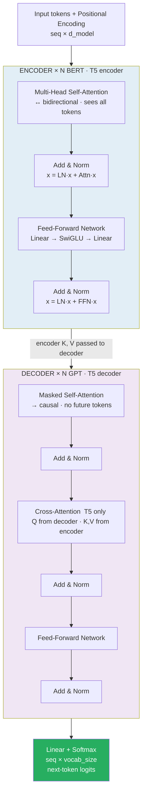

# Transformer Architecture

> **Scope note.** This file is the **reference**: block structure, shapes, variants, parameter
> counting. The blocks are hand-computed with real numbers in
> [06b encoder](../../4.nlp/03_sequence_models/06b_transformer_encoder_multihead.md) and
> [06c decoder](../../4.nlp/03_sequence_models/06c_transformer_decoder_end_to_end.md);
> pre-LN vs post-LN is computed both ways in
> [../02_models/06b_gpt2_end_to_end.md](../02_models/06b_gpt2_end_to_end.md) §6.1.

> The transformer is: [MHA → FFN] × N with residuals and LayerNorm. The three architectural choices that matter most in practice: Pre-LN (stable training), SwiGLU FFN (better performance), RoPE positional encoding (length generalization). Everything else — BERT, GPT, T5, LLaMA — is this same skeleton with different: (1) attention masking strategy, (2) pretraining objective, (3) scale.

---

## Quick Reference

| Component | Classic (2017) | Modern LLM (2024-25) |
|-----------|---------------|----------------------|
| Multi-Head Attention | MHA — H heads, full Q,K,V per head | GQA (LLaMA, Mistral, Gemma) or MLA (DeepSeek) |
| Feed-Forward Network | Linear → GELU → Linear, 4× expansion | SwiGLU (LLaMA, Mistral, Gemma) or GeGLU (T5 v1.1) — gated, ~2.67× expansion; sparse MoE in Mistral / DeepSeek |
| Layer Normalization | LayerNorm, post-LN | RMSNorm, pre-LN (mean step dropped; faster, equal quality) |
| Residual Connection | LN(x + Sublayer(x)) (post) | x + Sublayer(LN(x)) (pre) |
| Positional Encoding | Sinusoidal or learned absolute | RoPE (default) or ALiBi; YARN for context extension |
| Encoder | Bidirectional context | Still used in BERT-family; rare in new LLMs (decoder-only dominates) |
| Decoder | Causal mask + cross-attention | Decoder-only is the dominant LLM paradigm |
| Bias on linears | Present | Removed in LLaMA, Mistral, Gemma — same quality, simpler |

The full transformer = stack of [Attention → FFN] blocks with residuals + Norm, repeated N times. Modern LLM recipe: RMSNorm + pre-LN + RoPE + GQA + SwiGLU FFN + no biases.


> GPT drops the encoder entirely (decoder-only). BERT drops the decoder (encoder-only). T5 uses both with cross-attention.

---

## 1. Core Concepts

### Original Transformer (Vaswani et al. 2017)

```
"Attention Is All You Need"
Task: Machine Translation (EN→DE, EN→FR)
Architecture: Encoder-Decoder
Encoder: 6 layers, Decoder: 6 layers
d_model=512, h=8 heads, d_ff=2048, d_k=d_v=64
```

### Full Architecture

```
Input Tokens
    ↓
[Token Embedding + Positional Encoding]
    ↓
┌─────────────────────────┐  × N (encoder layers)
│ Multi-Head Self-Attention│
│ + Residual + LayerNorm  │
│ Feed-Forward Network (FFN)│
│ + Residual + LayerNorm  │
└─────────────────────────┘
    ↓ (encoder output)
┌─────────────────────────┐  × N (decoder layers)
│ Masked Multi-Head Self-Attn│  ← causal: can't see future
│ + Residual + LayerNorm  │
│ Cross-Attention         │  ← Q from decoder, K/V from encoder
│ + Residual + LayerNorm  │
│ Feed-Forward Network    │
│ + Residual + LayerNorm  │
└─────────────────────────┘
    ↓
Linear → Softmax → Output Token
```

---

## 2. Encoder Block (Single Layer)

```python
import torch
import torch.nn as nn

class EncoderLayer(nn.Module):
    def __init__(self, d_model, num_heads, d_ff, dropout=0.1):
        super().__init__()
        self.self_attn = nn.MultiheadAttention(d_model, num_heads,
                                               dropout=dropout, batch_first=True)
        self.ffn = nn.Sequential(
            nn.Linear(d_model, d_ff),
            nn.GELU(),              # GELU preferred over ReLU in modern transformers
            nn.Dropout(dropout),
            nn.Linear(d_ff, d_model),
            nn.Dropout(dropout),
        )
        self.norm1 = nn.LayerNorm(d_model)
        self.norm2 = nn.LayerNorm(d_model)
        self.dropout = nn.Dropout(dropout)

    def forward(self, x, src_key_padding_mask=None):
        # Pre-LN (modern default): LayerNorm BEFORE sublayer
        # Sublayer 1: Self-Attention
        residual = x
        x = self.norm1(x)
        attn_out, _ = self.self_attn(x, x, x, key_padding_mask=src_key_padding_mask)
        x = residual + self.dropout(attn_out)

        # Sublayer 2: FFN
        residual = x
        x = self.norm2(x)
        x = residual + self.ffn(x)

        return x
```

---

## 3. Decoder Block (Single Layer)

```python
class DecoderLayer(nn.Module):
    def __init__(self, d_model, num_heads, d_ff, dropout=0.1):
        super().__init__()
        # Sublayer 1: Masked self-attention (causal)
        self.self_attn = nn.MultiheadAttention(d_model, num_heads,
                                               dropout=dropout, batch_first=True)
        # Sublayer 2: Cross-attention (queries encoder output)
        self.cross_attn = nn.MultiheadAttention(d_model, num_heads,
                                                dropout=dropout, batch_first=True)
        self.ffn = nn.Sequential(
            nn.Linear(d_model, d_ff),
            nn.GELU(),
            nn.Dropout(dropout),
            nn.Linear(d_ff, d_model),
        )
        self.norm1 = nn.LayerNorm(d_model)
        self.norm2 = nn.LayerNorm(d_model)
        self.norm3 = nn.LayerNorm(d_model)
        self.dropout = nn.Dropout(dropout)

    def forward(self, tgt, memory, tgt_mask=None, memory_key_padding_mask=None):
        # Sublayer 1: Masked self-attention
        residual = tgt
        tgt_norm = self.norm1(tgt)
        attn_out, _ = self.self_attn(tgt_norm, tgt_norm, tgt_norm, attn_mask=tgt_mask)
        tgt = residual + self.dropout(attn_out)

        # Sublayer 2: Cross-attention (Q=decoder, K/V=encoder output)
        residual = tgt
        tgt_norm = self.norm2(tgt)
        attn_out, _ = self.cross_attn(tgt_norm, memory, memory,
                                      key_padding_mask=memory_key_padding_mask)
        tgt = residual + self.dropout(attn_out)

        # Sublayer 3: FFN
        residual = tgt
        tgt_norm = self.norm3(tgt)
        tgt = residual + self.ffn(tgt_norm)

        return tgt
```

---

## 4. Feed-Forward Network (FFN)

```
FFN(x) = max(0, xW_1 + b_1)W_2 + b_2    (original, ReLU)
FFN(x) = GELU(xW_1 + b_1)W_2 + b_2      (modern, GELU)
```

- Dimensions: d_model → d_ff → d_model
- Typical: d_ff = 4 × d_model
- BERT-base: d_model=768, d_ff=3072
- GPT-3: d_model=12288, d_ff=49152

**Role:** introduces nonlinearity per-token, independent of other tokens. Conceptually: attention = routing/mixing information between tokens; FFN = per-token computation/memory lookup.

### SwiGLU (LLaMA, PaLM)

Modern variant — gated FFN, better than GELU empirically:

```python
class SwiGLU(nn.Module):
    def __init__(self, d_model, d_ff):
        super().__init__()
        self.w1 = nn.Linear(d_model, d_ff, bias=False)
        self.w2 = nn.Linear(d_ff, d_model, bias=False)
        self.w3 = nn.Linear(d_model, d_ff, bias=False)

    def forward(self, x):
        # Gate: element-wise product of SiLU(w1·x) and w3·x
        return self.w2(F.silu(self.w1(x)) * self.w3(x))
        # SiLU(x) = x × sigmoid(x)  (smooth version of ReLU)
```

Note: SwiGLU uses **three** matrices, so `d_ff ≈ 8/3 · d_model = 2.67×` keeps the parameter count
equal to a 2-matrix FFN at `4×`. Llama 2 sits at `2.6875×`; **Llama 3 deliberately went to `3.5×`**,
spending real extra parameters on the MLP — see
[../02_models/08b_llama3_end_to_end.md](../02_models/08b_llama3_end_to_end.md) §4.

---

## 5. Layer Normalization

### Formula

```
LayerNorm(x) = γ · (x − μ) / √(σ² + ε) + β
                                ^^^^^^^
                    ε goes INSIDE the square root, added to the VARIANCE

μ  = mean over the hidden dimensions (not the batch)
σ² = variance over the hidden dimensions
γ, β = learned scale and shift (initialised to 1 and 0)
```

**The `ε` placement is not cosmetic.** Writing `(x − μ)/(σ + ε)` is a common slip, and it breaks
exactly the case `ε` exists for — vanishing variance:

```
     var(x)     correct: /√(σ²+ε)     wrong: /(σ+ε)     ratio
      1e+00               0.999995         0.999990     1.000
      1e-04               0.953463         0.999001     1.048
      1e-06               0.301511         0.990099     3.284
      1e-08               0.031607         0.909091    28.762
```

At `var = 1e-8` the correct form returns `0.0316` — the output **shrinks**, which is the intended
safety behaviour when a row is nearly constant. The incorrect form returns `0.9091` and barely
clips at all. With `ε` outside the root it cannot bound the output, because it is being compared
against `σ` rather than `σ²`.

### LayerNorm vs BatchNorm for transformers

- BatchNorm: normalize over batch dimension — breaks with batch_size=1, variable seq len
- LayerNorm: normalize over feature dimension — works for any batch size, sequence length
- LayerNorm is the standard for transformers

### Pre-LN vs Post-LN

```
Post-LN  (2017, GPT-1, BERT, BART)      h = LayerNorm( x + Sublayer(x) )
Pre-LN   (GPT-2 onward, T5, LLaMA)      h = x + Sublayer( LayerNorm(x) )
                                        ... and one FINAL LayerNorm after the last block
```

**The final LayerNorm is part of the definition of pre-LN**, and it is the half people drop. In
post-LN every block ends with a norm, so the stack output is already normalised. In pre-LN nothing
normalises the residual stream, so it grows with depth and the logits would scale with the number
of layers — `ln_f` is where it is brought back.

| | Post-LN | Pre-LN |
|---|---|---|
| Residual stream | renormalised every block | **untouched — a clean identity path** |
| LR warmup | **required** (GPT-1 used 2,000 steps) | not required |
| Final LayerNorm | none | **one, after the stack** |
| Companion change | — | scale residual output weights by `1/√N` |

**Why warmup:** in post-LN the path from the loss back to the embeddings passes through two
LayerNorms per layer — 24 in a 12-layer model — which attenuates early-layer gradients and makes the
first few thousand steps unstable. Pre-LN's identity path removes that, which is why GPT-2 could
drop warmup and go deeper.

Both orderings computed on the same weights — a `max|diff|` of **1.245** on the output, so they are
genuinely different networks — in
[../02_models/06b_gpt2_end_to_end.md](../02_models/06b_gpt2_end_to_end.md) §6.1.

### RMSNorm (LLaMA): LayerNorm without mean subtraction — simpler, faster

```
RMSNorm(x) = γ · x / RMS(x),    RMS(x) = √(1/n · Σx_i²)

class RMSNorm(nn.Module):
    def __init__(self, dim, eps=1e-6):
        super().__init__()
        self.eps = eps
        self.weight = nn.Parameter(torch.ones(dim))

    def forward(self, x):
        rms = x.pow(2).mean(-1, keepdim=True).add(self.eps).sqrt()
        return self.weight * x / rms
```

---

## 6. Residual Connections

### Why residuals are critical

```
Without residuals: gradients must flow through all sublayers sequentially.
For 12-layer transformer: gradient = product of 12 Jacobians → vanishes.

With residuals: x_{l+1} = x_l + F(x_l)
Gradient: ∂L/∂x_l = ∂L/∂x_{l+1} · (1 + ∂F/∂x_l)
The "1" term provides a direct gradient highway regardless of ∂F/∂x_l.

Critical insight: after training, residual stream carries the main information;
sublayers learn small corrections → easy to initialize, stable to train.
```

---

## 7. Parameter Count

```python
def count_transformer_params(d_model, d_ff, num_heads, num_layers, vocab_size, max_len):
    # Per attention layer (4 weight matrices: Wq, Wk, Wv, Wo)
    attn_params = 4 * d_model * d_model  # no bias in modern transformers

    # Per FFN layer (2 or 3 matrices depending on SwiGLU)
    ffn_params = 2 * d_model * d_ff  # or 3 * d_model * d_ff for SwiGLU

    # Per layer total
    layer_params = attn_params + ffn_params

    # Total transformer blocks
    transformer_params = num_layers * layer_params

    # Embeddings
    token_embedding = vocab_size * d_model
    pos_embedding = max_len * d_model

    return transformer_params + token_embedding + pos_embedding

# BERT-base: d_model=768, d_ff=3072, h=12, L=12, vocab=30522
bert_base = count_transformer_params(768, 3072, 12, 12, 30522, 512)
# print(f"BERT-base: ~{bert_base/1e6:.0f}M params") → ~110M

# GPT-3: d_model=12288, d_ff=49152, h=96, L=96, vocab=50257
gpt3 = count_transformer_params(12288, 49152, 96, 96, 50257, 2048)
# print(f"GPT-3: ~{gpt3/1e9:.0f}B params") → ~175B
```

**Verified outputs of that function:**

```
BERT-base   108,768,768   = 108.8M      quoted as "110M"
GPT-3       174,588,899,328 = 174.6B    quoted as "175B"
```

It omits biases and LayerNorm parameters, as its comment says. Including them:

```
BERT-base   108,891,648            (05_bert_end_to_end.md §16)
GPT-3       174,604,259,328        (06c_gpt3_end_to_end.md §2)
```

**The `2 · d_model · d_ff` term assumes a 2-matrix FFN.** SwiGLU uses **three**, so for a Llama-style
model the FFN term is `3 · d_model · d_ff` — which is why `d_ff` drops to `≈ 8/3 · d_model` to keep
the count matched. Exact Llama 3 arithmetic in
[../02_models/08b_llama3_end_to_end.md](../02_models/08b_llama3_end_to_end.md) §4.

---

## 8. Training the Transformer

### Optimizer: Adam with warmup

```python
from torch.optim import Adam
from torch.optim.lr_scheduler import LambdaLR

optimizer = Adam(model.parameters(), lr=1.0, betas=(0.9, 0.98), eps=1e-9)

def lr_lambda(step):
    """Original transformer learning rate schedule: warmup then decay."""
    warmup_steps = 4000
    if step == 0:
        return 0
    return d_model**(-0.5) * min(step**(-0.5), step * warmup_steps**(-1.5))

scheduler = LambdaLR(optimizer, lr_lambda)
```

### Label Smoothing

```python
# Original paper uses label smoothing ε=0.1
# Instead of one-hot [0,0,1,0,...], target = [(ε/V), ..., (1-ε+ε/V), ..., (ε/V)]
# Prevents overconfidence, improves calibration

criterion = nn.CrossEntropyLoss(label_smoothing=0.1)
```

---

## 9. Encoder-Only vs Decoder-Only vs Encoder-Decoder

| Architecture | Attention type | Use cases |
|-------------|---------------|-----------|
| Encoder-only (BERT, RoBERTa) | Bidirectional self-attention | Classification, NER, QA, embeddings, understanding |
| Decoder-only (GPT, LLaMA) | Causal (masked) self-attention | Text generation, completion, few-shot prompting, LLMs |
| Encoder-Decoder (T5, BART) | Bidirectional enc + Causal dec + cross-attention | Translation, summarization, seq2seq tasks, structured generation |

---

## 10. Gotchas

**Attention mask convention differs across frameworks:** HuggingFace uses 1=attend, 0=ignore. PyTorch `nn.MultiheadAttention` uses `key_padding_mask` where True=ignore. Always check the convention.

**Post-LN training instability:** Training Post-LN transformers from scratch requires careful LR warmup. Without warmup, the first few iterations have very large gradients — divergence. Pre-LN is more forgiving.

**d_ff ratio:** The standard 4× ratio (d_ff = 4·d_model) is conventional, not sacred. LLaMA uses ~2.67× with SwiGLU (which has 3 matrices). More matrices with smaller d_ff vs fewer with larger d_ff trade differently.

**Gradient checkpointing for large models:**

```python
# Recompute activations during backward instead of storing them
# Saves ~60% memory at cost of ~33% extra compute
model.gradient_checkpointing_enable()
```

**Initialization matters:** Use Xavier/Glorot for attention weights. Initialize output projections (W_o in attention, second linear in FFN) with small std (1/√(2·N) where N=num layers) — "scaled init" from GPT-2.

---

## 11. Interview Q&A

**Q: Why does the transformer use residual connections + layer norm, not just the sublayer output?**

Residual connections solve vanishing gradients: the gradient includes a direct path (the "1" in ∂(x+F(x))/∂x = 1 + ∂F/∂x) that bypasses all sublayers. LayerNorm stabilizes training by normalizing activations to zero mean and unit variance per token (not per batch), preventing internal covariate shift. Together they allow training very deep transformers (24, 48+ layers) that would otherwise not converge.

**Q: What is the role of the Feed-Forward Network in a transformer layer?**

Attention mixes information across tokens (routing) but is linear — the softmax-weighted sum of V is a linear combination. The FFN introduces per-token nonlinearity and is where most of the model's "memory" is stored. Research shows transformer FFN layers act like key-value memories: the first linear layer matches queries to stored patterns, GELU acts as a soft key selector, and the second linear layer retrieves associated values. This is why scaling FFN size (and total parameters) improves knowledge capacity.

**Q: Explain Pre-LN vs Post-LN. Which is better?**

Post-LN (original paper): applies LayerNorm after the residual addition. Achieves better final performance but is unstable in early training — large gradient variance requires careful warmup. Pre-LN (modern): applies LayerNorm before the sublayer, inside the residual branch. Gradients flow more smoothly — more stable training, easier to scale. Current consensus: Pre-LN with RMSNorm (LLaMA) for stability; Post-LN can match with proper tuning but the benefit rarely justifies the instability cost.

**Q: How does the decoder prevent attending to future tokens?**

A causal (look-ahead) mask applied to the self-attention scores. Before softmax, positions j > i are set to -∞, so they contribute 0 after softmax. In matrix form: upper triangle of the seq×seq score matrix is masked. This ensures position i's output depends only on positions 0..i, enabling autoregressive training where all positions are processed in parallel during training but generation is sequential.

**Q: What's the fundamental difference between the encoder and decoder in a transformer?**

The encoder uses bidirectional self-attention — each token can attend to all other tokens. This is ideal for understanding tasks (classification, NER) where full context is available. The decoder has two attention mechanisms: causal self-attention (only attend to past tokens, for generation) and cross-attention (attend to all encoder outputs, for conditioning on the source). Encoder-only (BERT) is best for representation learning; decoder-only (GPT) for generation; encoder-decoder (T5, BART) for conditional generation (translation, summarization).

---

## Connections

- **Attention Mechanism (fundamentals/01):** Core building block — this file wraps it in a full architecture
- **BERT Family (models/01):** Encoder-only transformer, bidirectional self-attention
- **GPT Family (models/02):** Decoder-only transformer, causal self-attention
- **Encoder-Decoder (models/03):** T5/BART — full original transformer architecture
- **Efficient Transformers (models/04):** Flash Attention, sparse patterns, linear approximations
- **ViT (CV/architectures):** Same transformer encoder applied to image patches
- **RNN to Attention (NLP/sequence_models/01):** Why transformers replaced RNNs

---

## Key Takeaway

The transformer is: [MHA → FFN] × N with residuals and LayerNorm. The three architectural choices that matter most in practice: Pre-LN (stable training), SwiGLU FFN (better performance), RoPE positional encoding (length generalization). Everything else — BERT, GPT, T5, LLaMA — is this same skeleton with different: (1) attention masking strategy, (2) pretraining objective, (3) scale.

---

## Code Practice

- `code_practice/02_transformers/05_encoder_block/` — encoder block
- `code_practice/02_transformers/06_mini_transformer/` — stacked transformer
- `code_practice/02_transformers/07_decoder_block/` — decoder block + causal mask
