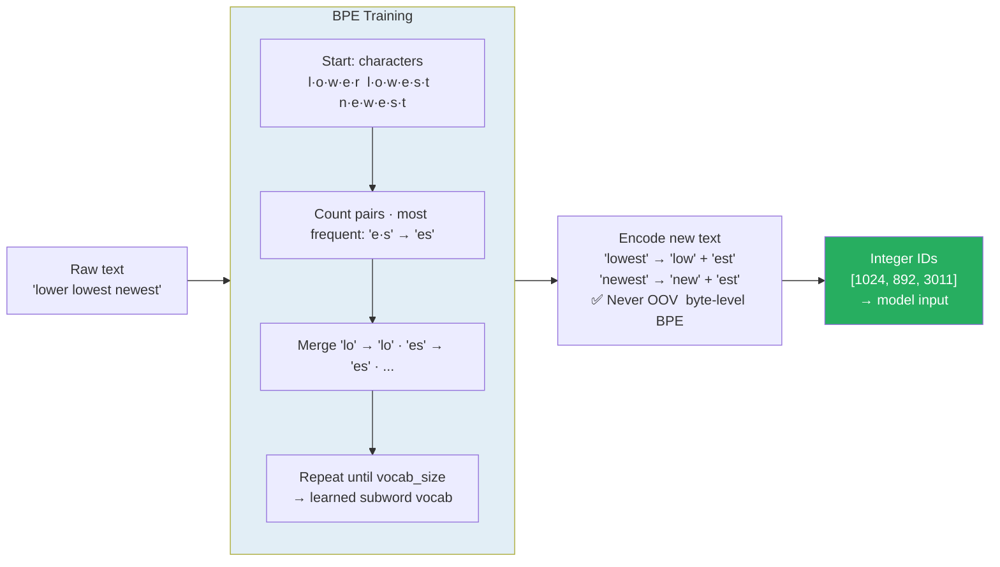

# Tokenization

> **Canonical home is `4.nlp/`.** Per the repo ownership table, tokenization belongs to
> [../../4.nlp/01_fundamentals/03_tokenization.md](../../4.nlp/01_fundamentals/03_tokenization.md)
> (concept) and
> [../../4.nlp/01_fundamentals/04_tokenization_end_to_end.md](../../4.nlp/01_fundamentals/04_tokenization_end_to_end.md)
> (BPE training hand-computed — verified to reproduce exactly), with
> [05_embedding_lookup_end_to_end.md](../../4.nlp/01_fundamentals/05_embedding_lookup_end_to_end.md)
> for tokens → vectors.
>
> **This file is retained for the transformer-specific material** the 4.nlp files do not carry:
> special tokens per architecture (§6), vocabulary sizes in practice (§7), and the debugging
> artifacts (§8). §2–§5 duplicate the canonical files — prefer those.

> Tokenization converts raw text into integer IDs for the embedding table. BPE builds a vocabulary by merging frequent character pairs — "cat sat on mat" naturally produces "at" as a subword (appears in 3 of 4 words). Byte-level BPE eliminates OOV entirely. SentencePiece handles any language without pre-tokenization. The tokenizer must always match the model — wrong tokenizer → wrong IDs → garbage output.

---

## Quick Reference

| Algorithm | Used By | Key Idea | Vocab Size |
|-----------|---------|---------|-----------|
| BPE | GPT-2, RoBERTa, LLaMA-1/2 | Merge most frequent character pairs | 50K |
| WordPiece | BERT, DistilBERT | Merge pairs by likelihood score | 30K |
| SentencePiece (BPE or Unigram) | T5, LLaMA, Gemma, Mistral | Language-agnostic, trains on raw text (treats whitespace as char) | 32K-128K |
| Byte-level BPE / tiktoken | GPT-2/3/4/4o, LLaMA-3 | BPE over raw bytes (0-255) — zero UNK tokens ever | 50K-200K |
| Unigram LM | XLNet, ALBERT, mT5 | Probabilistic subword selection | 32K |

**The insight:** Splitting text into whole words fails on rare/unknown words. Splitting into characters loses meaning. Subword tokenization is the middle ground — common words stay whole, rare words split into known pieces.



### Vocab Size Trend (2018 — 2025)

| Model | Vocab |
|-------|-------|
| BERT (2018) | 30K WordPiece — English-only |
| GPT-2 (2019) | 50K byte-BPE — First byte-level (no UNK) |
| GPT-3 (2020) | 50K byte-BPE — **identical to GPT-2**; cl100k_base arrives with GPT-3.5/4 |
| LLaMA-1/2 (2023) | 32K SentencePiece — small vocab, strong English focus |
| GPT-4o (cl100k) | 100K — 2× efficiency on non-English / code |
| LLaMA-3 (2024) | 128K **tiktoken BPE** — moved OFF SentencePiece; + strong CJK + code |
| Qwen2.5 (2024) | 151K — + strong CJK + code |
| GPT-4o (o200k_base) | 200K — + multilingual, vision tokens |

**Trend:** larger vocab → fewer tokens per byte → effectively longer context for the same compute. Trade-off: larger embedding matrix (each row = vocab × d_model).

**Byte-level fallback** is now universal in production tokenizers — guarantees any input encodes successfully (emoji, exotic scripts, code with unicode). `tiktoken` is OpenAI's reference implementation; HuggingFace's `tokenizers` library covers the open ecosystem.

---

## 1. Core Concepts

### Why Not Just Split on Spaces?

**Problem 1 — Out-of-Vocabulary (OOV):**
```
Training vocab: {cat, sat, on, mat}
Test sentence: "cats sat on mats"
"cats" → UNK, "mats" → UNK → model sees nothing meaningful
```

**Problem 2 — Vocabulary explosion:**
```
English has ~170K words. Plus proper nouns, numbers, URLs, code.
If you include everything: 500K+ vocab → embedding table is massive.
If you cut at 50K: 50% of text becomes UNK.
```

**Problem 3 — Morphology is ignored:**
```
"cat", "cats", "cat's" = three separate entries with no shared weights
But they all mean "feline" → you want shared representation.
```

**Subword tokenization solves all three:**
```
"cats"        → ["cat", "##s"]     → shares "cat" embedding, learns "##s" suffix
"mats"        → ["mat", "##s"]     → same "##s" token → model learns it means plural
"unbelievable"→ ["un", "##believ", "##able"] → never seen, still handles it
"<URL>"       → ["<", "URL", ">"]  → worst case: individual characters, no UNK
```

### The Three Levels of Granularity

**WORD-LEVEL:** `cat sat on mat` → ["cat", "sat", "on", "mat"]
- Pro: meaningful units, human-readable
- Con: OOV for unseen words, huge vocab required

**CHARACTER-LEVEL:** `cat sat on mat` → ["c","a","t"," ","s","a","t"," ","o","n"," ","m","a","t"]
- Pro: zero OOV (26 letters + punctuation)
- Con: sequences 5-10× longer + attention is O(n²) → much slower. "c" alone carries no semantic meaning

**SUBWORD-LEVEL (the winner):** `cat sat on mat` → ["cat", "sat", "on", "mat"] (common words stay whole); "unbelievable" → ["un", "##believe", "##able"] (rare words split)
- Pro: bounded vocab (20-50K), no OOV, morphology shared
- Con: tokenization is language-dependent (mostly), non-obvious splits

---

## 2. BPE — Byte Pair Encoding

**Algorithm (Sennrich et al., 2016):**

```
1. Start with character-level vocabulary
2. Count all adjacent character pair frequencies in corpus
3. Merge the most frequent pair into a new token
4. Repeat steps 2-3 until vocab reaches target size
```

### Dry-Run: BPE on "cat sat on mat"

**Step 0 — Initial character split (add to mark word end):**

```
Corpus word frequencies:
    cat = 1, sat = 1, on = 1, mat = 1

Character representation:
    cat = [c] [a] [t] [</w>]
    sat = [s] [a] [t] [</w>]
    on  = [o] [n] [</w>]
    mat = [m] [a] [t] [</w>]

Initial vocabulary: {c, a, t, s, o, n, m, </w>}  (8 tokens)
```

**Step 1 — Count all adjacent pairs:**

```
Pair       Count  Found in
(a, t)       3    cat, sat, mat  ← MOST FREQUENT
(t, </w>)    3    cat, sat, mat  ← tied
(c, a)       1    cat
(s, a)       1    sat
(o, n)       1    on
(n, </w>)    1    on
(m, a)       1    mat

Winner: (a, t) → merge into "at"

After merge 1 — vocabulary adds "at":
    cat = [c] [at] [</w>]
    sat = [s] [at] [</w>]
    on  = [o] [n] [</w>]
    mat = [m] [at] [</w>]

Vocabulary: {c, a, t, s, o, n, m, </w>, at}  (9 tokens)
```

**Step 2 — Recount adjacent pairs:**

```
Pair         Count  Found in
(at, </w>)     3    cat, sat, mat  ← MOST FREQUENT
(c, at)        1    cat
(s, at)        1    sat
(o, n)         1    on
(n, </w>)      1    on
(m, at)        1    mat

Winner: (at, </w>) → merge into "at</w>"

After merge 2 — vocabulary adds "at</w>":
    cat = [c] [at</w>]
    sat = [s] [at</w>]
    on  = [o] [n] [</w>]
    mat = [m] [at</w>]

Vocabulary: {c, a, t, s, o, n, m, </w>, at, at</w>}  (10 tokens)
```

**Step 3 — Recount pairs (all tied at 1):**

```
Pair          Count
(c, at</w>)     1    cat
(s, at</w>)     1    sat
(o, n)          1    on
(n, </w>)       1    on
(m, at</w>)     1    mat

All tied. Merge alphabetically first: (c, at</w>) → "cat</w>"

After merge 3:
    cat = [cat</w>]          ← full word now a single token
    sat = [s] [at</w>]
    on  = [o] [n] [</w>]
    mat = [m] [at</w>]

Merge 4: (s, at</w>) → "sat</w>"
Merge 5: (c, at</w>) → "cat</w>"
Merge 6: (o, n) → "on"
Merge 7: (on, </w>) → "on</w>"

Final vocabulary (16 tokens):
{c, a, t, s, o, n, m, </w>, at, at</w>, cat</w>, mat</w>, sat</w>, on, sat</w>, on</w>}
```

**What BPE learned:** "at" was extracted as a subword because it appears in cat, sat, mat (3 of 4 words). If you later see "bat", "hat", "fat" (unseen during training): `bat = [b] [at</w>]` — "at" token reused. `hat = [h] [at</w>]` — no OOV. `cats = [c] [at</w>] [s]` — pieces from vocabulary. This is BPE's key power: common substrings become reusable tokens.

### BPE merge rules are the vocabulary:

```python
# In production, you save the merge rules (not just the vocab):
# Merge rule 1: (a, t) → at
# Merge rule 2: (at, </w>) → at</w>
# Merge rule 3: (c, at</w>) → cat</w>
# ...

# To encode a new word: apply merge rules IN ORDER until no more apply.
# "bat" = [b][a][t][</w>] → apply rule 1: [b][at][</w>] → apply rule 2: [b][at</w>]
# Done (no more rules apply). Result: ["b", "at</w>"]
```

---

## 3. WordPiece (BERT)

**Difference from BPE:** Instead of merging by raw frequency, merge by **likelihood score**:

```
score(AB) = freq(AB) / (freq(A) × freq(B))

This measures how much A and B prefer to appear TOGETHER vs independently.
High score → the pair is a meaningful unit (not just two common characters together).
```

**Dry-run on "cat sat on mat":**

```
Initial chars: c a t </w>, s a t </w>, o n </w>, m a t </w>

Adjacent pair scores:
score(a,t):    freq(at)=3, freq(a)=3, freq(t)=3 → 3/(3×3) = 0.333
score(t,</w>): freq(t</w>)=3, freq(</w>)=3, freq(t)=3 → 3/(3×3) = 0.333 (tied with a,t)
score(c,a):    1/(1×3) = 0.333  (tied)
score(s,a):    1/(1×3) = 0.333  (tied)
score(o,n):    1/(1×2) = 0.500  ← HIGHEST! "on" is very cohesive
score(n,</w>): 1/(2×3) = 0.166
score(m,a):    1/(1×3) = 0.333

WordPiece picks (o, n) → "on"  ← BPE would have picked (a,t) instead
```

**Why "o" and "n" almost always appear together in this corpus → very high cohesion. BPE ignores this, just counts raw frequency. WordPiece finds tighter linguistic units.**

### WordPiece notation (BERT-style)

```
BERT uses ## prefix for continuation tokens:
"playing" → ["play", "##ing"]    + "##ing" means "continues previous token"
"unbelievable" → ["un", "##believ", "##able"]
"cat" → ["cat"]                  + common word, stays whole

NO ## on the first piece, ## on all continuations.
This is different from BPE's </w> suffix (end-of-word marker).
```

---

## 4. Byte-Level BPE (GPT-2, GPT-3, GPT-4)

**Problem with character-level BPE:**
```
"café" → ["c","a","f","é"] → "é" may not be in training data → UNK
Unicode has 143K characters → can't enumerate all
```

**Solution: operate on RAW BYTES (0-255).**
Any text = sequence of bytes → guaranteed closed vocabulary of 256 symbols. No UNK. Ever.

**How it works:**
```
"cat"  → bytes: [99, 97, 116]  (ASCII: c=99, a=97, t=116)
"é"    → bytes: [195, 169]     (UTF-8 encoding of é)
"😊"   → bytes: [240, 159, 146, 138] (emoji, 4 bytes)

Byte vocab: 256 tokens (one per byte value)
Then run BPE merges on byte sequences instead of characters.

Result: "cat" → single token "cat" (merged from bytes 99+97+116)
"café" → ["café", "s"] where "é" = two bytes merged
"😊"   → split into byte tokens, no UNK
```

**Why GPT-2/3/4 use this:** Language-agnostic: works on ANY human language, code, emoji, math symbols. No preprocessing: raw UTF-8 text in → tokens out, no language-specific rules. Zero UNK: every possible input has a valid tokenization. Trade-off: non-ASCII text tokenizes inefficiently (Chinese costs 3× more tokens than equivalent English).

---

## 5. SentencePiece (T5, LLaMA, Gemma, Mistral)

**Key difference:** Treats the input as a raw string including whitespace, no pre-tokenization step.

```
BPE/WordPiece: first split on spaces → ["cat", "sat", "on", "mat"]
               then tokenize each word separately

SentencePiece: treat entire "cat sat on mat" as one character sequence
               spaces become the "▁" character (U+2581, lower one-eighth block)
               "cat sat on mat" → "▁cat▁sat▁on▁mat"
               then run BPE or Unigram on this
```

**Result for LLaMA:**
```
"cat sat on mat" → ["▁cat", "▁sat", "▁on", "▁mat"]
"cats" (unseen) → ["▁cat", "s"]
"▁cat" (leading space) → ["▁_cat"]  ← space is part of the token!
```

**Why SentencePiece is language-agnostic:**
```
Languages without spaces (Chinese, Japanese, Thai):
    BPE requires space-splitting → fails completely for Chinese
    SentencePiece: no pre-splitting → works on any script

"猫が座っている" (Japanese: "the cat is sitting"):
    SentencePiece trains on raw text → learns character n-gram patterns
    Handles word boundaries automatically from data statistics
```

---

## 6. Special Tokens

Every model adds task-specific tokens to the vocabulary. These are NEVER split:

**BERT special tokens:**
```
[CLS]   start of sequence, classification token
[SEP]   separator between sentences
[MASK]  masked position (for MLM pretraining)
[PAD]   padding to equal length in batch
[UNK]   fallback for unrecognized characters (rare with subword)

"cat sat on mat" → [CLS] cat sat on mat [SEP]        (predict "sat")
MLM input: [CLS] cat [MASK] on mat [SEP]
```

**GPT special tokens:**
```
<|endoftext|>   end of document (separates training examples)
<|im_start|>    instruction start (chat models)
<|im_end|>      instruction end
```

**T5 special tokens:**
```
<pad>    padding
</s>     end of sequence
<unk>    unknown (rarely used with SentencePiece)
▁        space prefix (built into SentencePiece)
```

**LLaMA special tokens:**
```
<s>     beginning of sequence (BOS)
</s>    end of sequence (EOS)
▁       space prefix
```

---

## 7. Vocabulary Sizes in Practice

| Model | Algorithm | Vocab Size | Notes |
|-------|-----------|-----------|-------|
| BERT | WordPiece | 30,522 | English, ## continuation |
| RoBERTa | Byte-level BPE | 50,265 | byte-level, no language assumption |
| GPT-2 | Byte-level BPE | 50,257 | same family as RoBERTa |
| GPT-3 | Byte-level BPE | **50,257** | **same tokenizer as GPT-2**, unchanged |
| GPT-3.5 / GPT-4 | Byte-level BPE | 100,277 | tiktoken `cl100k_base` |
| GPT-4o | Byte-level BPE | 200,019 | tiktoken `o200k_base` |
| T5 | SentencePiece | 32,128 | 32,000 + 100 sentinels = 32,100, padded to 32,128 |
| LLaMA-1/2 | **SentencePiece BPE** | 32,000 | not byte-level |
| LLaMA-3 | **tiktoken BPE** (byte-level) | 128,256 | 4× larger; **changed family** from Llama 2 |
| Mistral | SentencePiece | 32,000 | same as LLaMA-2 |
| Gemma | SentencePiece | 256,128 | very large, better multilingual |

**Rule of thumb for sequence length** (GPT-2/GPT-3 byte-level BPE):

```
English   ~4 characters per token       (~0.25 tokens/char)
Code      ~3 characters per token       (more symbols and punctuation)
Chinese   ~1-2 TOKENS PER CHARACTER     (~4-8x worse than English)
```

**Note the direction on Chinese.** A CJK character is 3 UTF-8 bytes, and byte-level BPE learned
mostly on English rarely merges them into single tokens — so one character typically costs **one to
two tokens**, not the other way round. The same document in Chinese can be 4–8× more tokens than in
English.

Three consequences, all of which are the same fact:

- **Billing** — per-token pricing is not comparable across languages.
- **Context** — "128k context" holds far less Chinese text than English text.
- **Latency** — generation is per token, so the same answer takes longer.

This is why Llama 3 and Qwen enlarged their vocabularies: it is a direct, measurable cost, not a
cosmetic one. Fuller treatment in
[../../4.nlp/01_fundamentals/05_embedding_lookup_end_to_end.md](../../4.nlp/01_fundamentals/05_embedding_lookup_end_to_end.md) §7.

---

## 8. Tokenization Artifacts (Critical for Debugging)

**1. LEADING SPACE MATTERS**
```
"cat" and " cat" are DIFFERENT tokens in GPT tokenizers.
" cat" (with space) → token 3797
"cat" (no space)    → token 9cat

Prompt: "Write a poem about cats" — the first word after "about" has a space prefix.
Prompt injection: "cats" without space may tokenize differently → subtle bugs.
```

**2. CAPITALIZATION SPLITS**
```
"Cat" → ["Cat"]     1 token (in vocab)
"CAT" → ["C","AT"]  tokens (uppercase rare in training)
"CATASTROPHE" → ["CAT","ASTR","OP","HE"]  4 tokens
→ ALL-CAPS text costs more tokens → more expensive for same content.
```

**3. NUMBERS ARE TOKENIZED INCONSISTENTLY**
```
"100"   → ["100"]     1 token
"1000"  → ["1000"]    1 token
"12345" → ["123","45"] 2 tokens (arbitrary split at training vocab)
Math with large numbers → model sees pieces, not the full number.
This is a key reason LLMs struggle with arithmetic.
```

**4. CONTINUATION vs START tokens differ**
```
BERT: "##ing" means "running" with leading space = start of word
GPT:  "▁running" means "running" with leading space (starts after space)
      "running" means continuation (inside a word, no space before it)
```

**5. SAME TEXT, DIFFERENT TOKEN COUNT across models**
```
"cat sat on mat":
    BERT (WordPiece): 4 tokens  [cat] [sat] [on] [mat]
    GPT-2 (BPE):      6 tokens  [cat] [sat] [on] [mat]
    LLaMA (SP):       5 tokens  [▁cat] [▁sat] [▁on] [▁mat] + BOS
→ Token count affects cost, context window usage, batching.
```

**6. UNKNOWN LANGUAGE FRAGMENTATION**
```
English "running" → 1 token
Turkish "koşuyorum" (I am running) → ["ko","ş","u","yoru","m"] 6 tokens
LLaMA was trained mostly on English → Turkish is fragmented → less efficient
LLaMA-3 (128K vocab) significantly reduces this for non-English.
```

---

## 9. BPE from Scratch (Code)

```python
from collections import defaultdict, Counter

def get_vocab(corpus):
    """Convert corpus to character-level vocab with </w> word boundaries."""
    vocab = defaultdict(int)
    for word in corpus:
        # Space-separate characters, add </w> at end
        vocab[' '.join(list(word)) + ' </w>'] += 1
    return vocab

def get_pairs(vocab):
    """Count all adjacent pairs across all words."""
    pairs = defaultdict(int)
    for word, freq in vocab.items():
        symbols = word.split()
        for i in range(len(symbols) - 1):
            pairs[(symbols[i], symbols[i+1])] += freq
    return pairs

def merge_vocab(pair, vocab):
    """Merge a specific pair in all words."""
    new_vocab = {}
    bigram = ' '.join(pair)
    replacement = ''.join(pair)
    for word, freq in vocab.items():
        new_word = word.replace(bigram, replacement)
        new_vocab[new_word] = freq
    return new_vocab

# BPE Training
corpus = ['cat', 'sat', 'on', 'mat']
vocab = get_vocab(corpus)

num_merges = 7
merge_rules = []

for i in range(num_merges):
    pairs = get_pairs(vocab)
    if not pairs:
        break
    # Most frequent pair (ties broken by first seen)
    best_pair = max(pairs, key=pairs.get)
    vocab = merge_vocab(best_pair, vocab)
    merge_rules.append(best_pair)

# BPE Encoding (apply learned merge rules to new text)
def encode_bpe(test_word, merge_rules):
    """Encode a word using learned BPE merge rules."""
    word = list(test_word) + ['</w>']
    for pair in merge_rules:
        bigram = ''.join(pair)
        replacement = ''.join(pair)
        i = 0
        new_word = []
        while i < len(word):
            if i < len(word) - 1 and (word[i], word[i+1]) == pair:
                new_word.append(bigram)
                i += 2
            else:
                new_word.append(word[i])
                i += 1
        word = new_word
    return word

for test_word in ['cat', 'bat', 'hat', 'cats']:
    tokens = encode_bpe(test_word, merge_rules)
    print(f" {test_word}: {tokens}")
# cat   = ['cat</w>']           (learned full word)
# bat   = ['b', 'at</w>']       (reuses 'at</w>' merge)
# hat   = ['h', 'at</w>']       (same)
# cats  = ['cat', 's</w>']      (splits at morpheme boundary)
```

---

## 10. Using HuggingFace Tokenizers

```python
from transformers import AutoTokenizer

# BERT (WordPiece)
bert_tok = AutoTokenizer.from_pretrained('bert-base-uncased')

text = "cat sat on mat"
tokens = bert_tok.tokenize(text)
ids    = bert_tok.encode(text)
# BERT tokens: ['cat', 'sat', 'on', 'mat']
# ids: [101, 4937, 2938, 2006, 13523, 102]  (101=[CLS], 102=[SEP])

decoded = bert_tok.decode(ids)
# print(f"Decoded: {decoded}")  # [CLS] cat sat on mat [SEP]

# Special tokens
print(f"[CLS] id: {bert_tok.cls_token_id}")   # 101
print(f"[SEP] id: {bert_tok.sep_token_id}")   # 102
print(f"[MASK] id: {bert_tok.mask_token_id}") # 103
print(f"[PAD] id: {bert_tok.pad_token_id}")   # 0

# Subword example
print(bert_tok.tokenize("unbelievable"))  # ['un', '##believ', '##able']
print(bert_tok.tokenize("cats"))          # ['cats'] (in vocab)
print(bert_tok.tokenize("catss"))         # ['cats', '##s']

# GPT-2 (Byte-level BPE)
gpt_tok = AutoTokenizer.from_pretrained('gpt2')
tokens = gpt_tok.tokenize("cat sat on mat")
# ['cat', 'Ġsat', 'Ġon', 'Ġmat']   (Ġ = space prefix, unicode for ▁)

ids = gpt_tok.encode("cat sat on mat")
# GPT-2 ids: [9246, 3332, 319, 2603]  (no CLS/SEP - GPT has no such tokens)
# GPT-2 has no pad token by default — must set it
gpt_tok.pad_token = gpt_tok.eos_token

# Numbers tokenize inconsistently:
print(gpt_tok.tokenize("12345"))   # ['123', '45']
print(gpt_tok.tokenize("100"))     # ['100']
print(gpt_tok.tokenize("999999"))  # ['999', '99']

# LLaMA (SentencePiece)
llama_tok = AutoTokenizer.from_pretrained("meta-llama/Llama-2-7b-hf")
print(llama_tok.tokenize("cat sat on mat"))
# ['▁cat', '▁sat', '▁on', '▁mat']

# tiktoken (GPT-4)
import tiktoken
enc = tiktoken.get_encoding("cl100k_base")  # GPT-3.5 / GPT-4 encoding
ids = enc.encode("cat sat on mat")
tokens = [enc.decode([i]) for i in ids]
# print(f"GPT-4 tokens: {tokens}")    # ['cat', ' sat', ' on', ' mat']
# print(f"GPT-4 ids:    {ids}")       # [9009, 11339, 389, 2450]
```

### Batch Padding and Attention Masks

```python
from transformers import AutoTokenizer
import torch

tokenizer = AutoTokenizer.from_pretrained('bert-base-uncased')

# Multiple sentences of different lengths → need padding
sentences = [
    "cat sat on mat",       # 4 tokens + CLS + SEP = 6
    "the cat",              # 2 tokens + CLS + SEP = 4
    "a very long sentence about something",  # 7 + 2 = 9
]

batch = tokenizer(
    sentences,
    padding=True,       # pad to longest in batch
    truncation=True,    # cut if longer than max_length
    max_length=128,
    return_tensors='pt' # PyTorch tensors
)

# input_ids shape:     [3, 9]
# attention_mask shape: [3, 9]

# \input_ids:
# tensor([[ 101, 4937, 3332, 2006, 13523, 102,   0,   0,   0],
#         [ 101, 1996, 4937,  102,      0,   0,   0,   0,   0],
#         [ 101, 1037, 2200, 2146, ...   102]])

# \attention_mask:
# tensor([[1, 1, 1, 1, 1, 1, 0, 0, 0],   ← real tokens=1, padding=0
#         [1, 1, 1, 1, 0, 0, 0, 0, 0],
#         [1, 1, 1, 1, 1, 1, 1, 1, 1]])

# The attention_mask is passed to the model to IGNORE padding positions
# (masking out 0s in attention scores before softmax)
```

---

## 11. When to Use What

| Task | Tokenizer Choice | Reason |
|------|-----------------|--------|
| English NLP classification | BERT WordPiece | Optimized for English NLU |
| Multilingual NLP | mBERT or XLM-R | Trained on 100 languages |
| Text generation (English) | GPT-2 BPE / tiktoken | Standard for autoregressive |
| Code generation | StarCoder / CodeLlama | Specialized code vocab |
| Multilingual generation | LLaMA-3 (128K vocab) | Better non-English efficiency |
| Production API (OpenAI) | tiktoken cl100k_base | Matches GPT-3.5/4 exactly |
| Custom language/domain | Train SentencePiece | Flexible, language-agnostic |

---

## 12. Gotchas

**Tokenizer must match the model — always:**
```python
# WRONG: loading BERT tokenizer with GPT-2 model
tokenizer = AutoTokenizer.from_pretrained('bert-base-uncased')
model = AutoModel.from_pretrained('gpt2')
# token IDs mean different things → garbage output

# RIGHT: load from same checkpoint
tokenizer = AutoTokenizer.from_pretrained('gpt2')
model = AutoModel.from_pretrained('gpt2')
```

**Don't count characters to estimate token count:**
```
"Hello world" → 2 tokens (GPT-2) but 11 characters
Rule of thumb: 1 token ≈ 4 chars (English), 1-2 chars (CJK)
Use tokenizer.encode() to get exact count.
```

**Padding side matters for decoder models:**
```python
# GPT models: pad on the LEFT (right padding breaks causal generation)
tokenizer.padding_side = 'left'   # for GPT-style models
tokenizer.padding_side = 'right'  # for BERT-style models (default)
```

**Truncation order matters:**
```python
# For sentence-pair tasks (e.g., NLI): truncate the longer sentence first
tokenizer(sentence_a, sentence_b,
          truncation=True,
          max_length=512)
# By default truncates from the right of the COMBINED sequence.
# Use truncation='only_second' to truncate only sentence_b.
```

**Fast vs slow tokenizers:**
```python
# HuggingFace has Rust-based "fast" tokenizers (10-100× faster)
from transformers import BertTokenizerFast  # fast
from transformers import BertTokenizer      # slow (Python)
# AutoTokenizer uses fast by default when available.
# Slow tokenizers needed for some custom preprocessing pipelines.
```

---

## 13. Interview Q&A

**Q: What is BPE and why is it better than word-level tokenization?**

BPE (Byte Pair Encoding) builds a subword vocabulary by iteratively merging the most frequent adjacent character pairs in a corpus. It starts with individual characters and adds merged units until reaching the target vocab size. Better than word-level because: (1) No OOV: unseen words are split into known subword pieces, never UNK. (2) Morphology sharing: "cat", "cats", "cat's" → "cat" token = shared weights. (3) Bounded vocab: ~50K subword tokens cover any English text vs 500K+ words needed. Trade-off: tokenization is non-trivial (requires BPE model), and the splits can be linguistically arbitrary ("un##believ##able" vs "un##believable" may both occur).

**Q: What's the difference between BPE and WordPiece?**

Both are subword algorithms, but the merge criterion differs. BPE: merge the pair with highest RAW FREQUENCY — greedy, always picks the most common pair. WordPiece: merge the pair with highest LIKELIHOOD SCORE = freq(AB)/(freq(A)×freq(B)) — prefers pairs that are "surprising" = high joint frequency relative to how often each piece appears independently → tends to find more linguistically meaningful subwords. In practice: similar results for large corpora. BERT uses WordPiece, GPT uses BPE.

**Q: Why does GPT-4 use byte-level BPE?**

To achieve ZERO unknown tokens for any input. Standard BPE operates on characters — but "characters" is language-dependent. Rare Unicode characters, emoji, or arbitrary binary data can be out-of-vocab. Byte-level BPE operates on raw UTF-8 bytes (0-255). Any text decomposes into bytes, and 256 possible byte values form the base vocabulary. BPE merges are then applied to byte sequences instead of characters. Works for every language without language-specific rules. Trade-off: non-ASCII content (Chinese, emoji) requires more tokens.

**Q: How does the attention mask work with padding?**

When batching variable-length sequences, shorter ones are padded with [PAD] tokens to match the longest sequence. But we don't want the model to attend to padding. The attention mask (1=real, 0=padding) is converted to additive attention bias: real tokens → 0 added to scores → softmax sees normal scores; padding → −∞ added to scores → softmax ≈ 0 weight on padding positions. Code flow: `attention_bias = (1 - attention_mask) × (−1e9)` → `scores = scores + attention_bias` → `weights = softmax(scores)` → padding positions get ~0 weight.

---

## Connections

- **Transformer Architecture (fundamentals/02):** Token embeddings are the INPUT to the transformer — tokenization defines what goes into the embedding lookup table
- **BERT Family (models/01):** Uses WordPiece, [CLS]/[SEP]/[MASK] special tokens; tokenizer directly shapes the MLM pretraining objective
- **GPT Family (models/02):** Uses byte-level BPE, no [CLS]; padding left for generation
- **Encoder-Decoder (models/03):** T5/BART use SentencePiece; source and target may have different tokenizers or share one
- **RNN to Attention (NLP/sequence_models):** The "word embeddings" in that walkthrough assume tokenization is already done — this file shows what happens before the embedding lookup

---

## Key Takeaway

Tokenization converts raw text into integer IDs for the embedding table. BPE builds a vocabulary by merging frequent character pairs — "cat sat on mat" naturally produces "at" as a subword (appears in 3 of 4 words). Byte-level BPE eliminates OOV entirely. WordPiece prefers linguistically cohesive merges. SentencePiece handles any language without pre-tokenization. The tokenizer must always match the model — wrong tokenizer → wrong IDs → garbage output, regardless of model quality.
