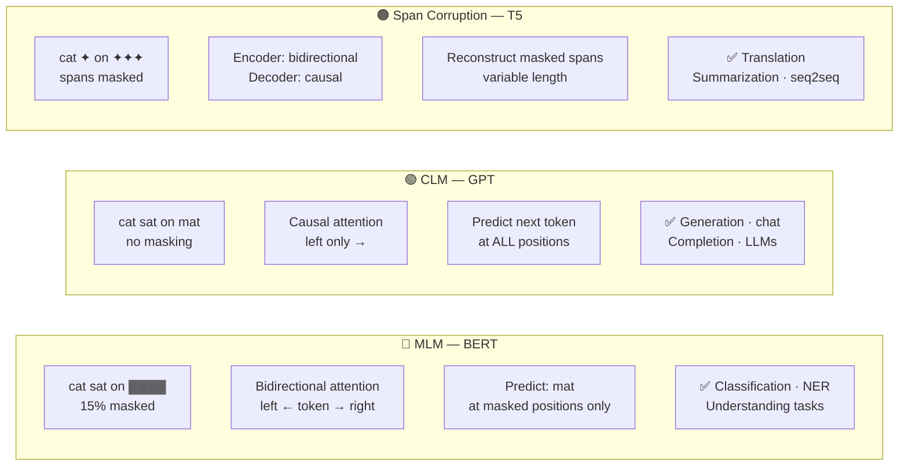

# Pretraining Objectives — End to End with Numbers

> Same sentence throughout: "cat sat on mat". Same 2D embeddings throughout: cat=[1.0,0.5], sat=[0.2,0.3], on=[0.1,0.1], mat=[0.2,0.4].

---

## 0. What is Pretraining and Why Does it Matter?

A transformer has millions of parameters. If you initialize them randomly and fine-tune on 1000 labeled examples, you get garbage — not enough signal to learn language structure, word meanings, syntax, world knowledge.

Pretraining solves this by training on **hundreds of billions of unlabeled tokens** using a self-supervised objective — a task where the labels come from the input itself, no human annotation needed.

The three dominant objectives:

| Objective | Model | Task |
|-----------|-------|------|
| Masked Language Modeling (MLM) | BERT | Predict masked tokens |
| Causal Language Modeling (CLM) | GPT | Predict next token |
| Span Corruption | T5 | Reconstruct masked spans |

Each objective creates a different kind of representation. The choice determines what the model is good at downstream.


> Choose by task type: understanding → BERT/MLM, generation → GPT/CLM, seq2seq → T5/span.

---

## 1. Masked Language Modeling (MLM) — BERT

### 1.1 The Idea

Randomly mask some tokens. Train the model to predict what was there. Because all surrounding tokens (past AND future) are visible, the encoder builds **bidirectional** context — it sees the full sentence when filling in the blank.

`"cat sat on [MASK]"` → model predicts "mat"

### 1.2 The 80/10/10 Rule

Don't always replace with [MASK]. If you did, the model would never learn to handle real tokens at inference (fine-tuning has no [MASK] tokens). Instead, for each selected position:
- **80%** — replace with [MASK]
- **10%** — replace with a random token (e.g., "cat sat on **dog**")
- **10%** — keep the original token (e.g., "cat sat on **mat**")

The model doesn't know which case it's in, so it must always encode every token carefully.

**How many tokens get masked?** 15% of all tokens. Of those 15%, the 80/10/10 rule applies.

### 1.3 Dry-Run: Masking "mat"

**Input:** "cat sat on mat"
Selected for masking: position 3 ("mat") — it's the 80% case → replace with [MASK]

**Vocabulary:** cat=0, sat=1, on=2, mat=3

**Embeddings:**
```
E_cat  = [1.0, 0.5]
E_sat  = [0.2, 0.3]
E_on   = [0.1, 0.1]
E_mat  = [0.2, 0.4]  ← true label, but hidden
E_mask = [0.0, 0.0]  ← what goes in position 3
```

**Input to transformer:**
```
x_0 = cat  = [1.0, 0.5] + PE(0) = [1.000, 1.500]
x_1 = sat  = [0.2, 0.3] + PE(1) = [1.041, 0.840]
x_2 = on   = [0.1, 0.1] + PE(2) = [1.009, -0.316]
x_3 = MASK = [0.0, 0.0] + PE(3) = [0.141, -0.990]
```

PE(pos): PE(pos,2i) = sin(pos / 10000^(2i/d_model)), PE(pos,2i+1) = cos(...). MASK gets no semantic signal from the embedding itself — only the PE tells the model "this is position 3".

**Attention at position 3 (MASK):** The MASK token attends to ALL four positions (no causal mask — BERT is an encoder). It sees cat, sat, on, and itself. The context "cat sat on ___" strongly signals that "mat" follows.

After the transformer forward pass through attention + FFN, the hidden state at position 3 encodes: `h_3 = [something informed by full context]`

**MLM head:** A linear layer projects h_3 to vocab logits.

Using the same weights from the BERT file (W_mlm is 2×4):
```
W_mlm = [[0.3, 0.2, 0.1, 0.2],
          [0.4, 0.3, 0.1, 0.5]]

For h_3 = [1.009, -0.316] (the MASK hidden state after full attention):

logit_cat = 0.3×1.009 + 0.4×(-0.316) = 0.303 - 0.126 = 0.177
logit_sat = 0.2×1.009 + 0.3×(-0.316) = 0.202 - 0.095 = 0.107
logit_on  = 0.1×1.009 + 0.1×(-0.316) = 0.101 - 0.032 = 0.069  (was 0.242 in BERT file)
logit_mat = 0.2×1.009 + 0.5×(-0.316) = 0.202 - 0.158 = 0.044
```

**Softmax:**
```
e^0.177 = 1.194
e^0.107 = 1.113
e^0.069 = 1.071
e^0.044 = 1.045
sum = 4.423

P(cat) = 1.194/4.423 = 0.270
P(sat) = 1.113/4.423 = 0.252
P(on)  = 1.071/4.423 = 0.242
P(mat) = 1.045/4.423 = 0.236  ← target
```

**MLM Loss:**
```
L_mlm = -log P(mat) = -log(0.236) = 1.444
```

The model assigned P(mat)=0.236 — essentially uniform (random at 4 vocab items ≈ 0.25). After training on many examples, the model learns that position 3 in "cat sat on ___" should strongly predict "mat".

### 1.4 Gradient Signal

```
∂L/∂logits = [P(cat), P(sat), P(on), P(mat)-1]
            = [0.270, 0.252, 0.242, 0.236-1.000]
            = [0.270, 0.252, 0.242, -0.764]
```

The mat column of W_mlm receives a large negative gradient — it gets pushed DOWN (the other columns get pushed up relative to mat). After enough updates, the model learns that "mat" at position 3 of "cat sat on [MASK]" should have the highest logit.

### 1.5 What MLM Teaches

- **Bidirectional context:** The model learns to integrate left and right context simultaneously
- **Word semantics:** "cat sat on [MASK]" → mat/floor/rug; "the bank of the [MASK]" → river/stream (not financial bank) — the full sentence disambiguates
- **Syntax:** "[MASK] sat on mat" → cat/she/he (requires subject understanding)
- **World knowledge:** "Paris is the capital of [MASK]" → France

**What MLM doesn't teach:** Generating fluent text — BERT never learns to produce sequences autoregressively.

---

## 2. Causal Language Modeling (CLM) — GPT

### 2.1 The Idea

Predict the **next token** given all preceding tokens. No masking needed — the labels are the next tokens in the sequence, which are free from the text itself.

Because the model can only see past tokens (causal mask), it builds **left-to-right** context. Every position in the sequence contributes to the loss.

### 2.2 The Causal Mask

At training, the full sequence is processed in parallel (unlike RNN). To prevent position i from seeing position j > i, we apply:
```
M[i,j] = 0    if j ≤ i  (allowed to attend)
M[i,j] = -∞   if j > i  (blocked)
```

This makes the model compute predictions at all positions simultaneously — efficiency of transformer + sequential structure of language modeling.

### 2.3 Dry-Run: Predicting Every Next Token

**Input:** "cat sat on mat"

**Targets (what each position must predict):**
```
Position 0 (cat)  → predict: sat
Position 1 (sat)  → predict: on
Position 2 (on)   → predict: mat
Position 3 (mat)  → no target (no next token, sometimes predict <EOS>)
```

**After causal-masked attention + FFN:**
```
x_final_cat = [2.280, 2.770]   (only sees itself)
x_final_sat = [2.286, 1.953]   (sees cat, sat)
x_final_on  = [2.113, 0.472]   (sees cat, sat, on)
x_final_mat = [1.183, -0.121]  (sees all four)
```

**LM head:**
```
W_lm = token_embeds.T = [[1.0, 0.2, 0.1, 0.2],
                          [0.5, 0.3, 0.1, 0.4]]
(shape: 2×4 — maps hidden dim 2 → vocab 4)
```

**Logits at position 0 (cat), hidden=[2.280, 2.770]:**
```
logit_cat = 1.0×2.280 + 0.5×2.770 = 2.280 + 1.385 = 3.665
logit_sat = 0.2×2.280 + 0.3×2.770 = 0.456 + 0.831 = 1.287
logit_on  = 0.1×2.280 + 0.1×2.770 = 0.228 + 0.277 = 0.505
logit_mat = 0.2×2.280 + 0.4×2.770 = 0.456 + 1.108 = 1.564

Softmax denominator: e^3.665 + e^1.287 + e^0.505 + e^1.564 = 39.06 + 3.621 + 1.657 + 4.778 = 49.116

P(cat) = 39.06/49.116 = 0.795
P(on)  = 3.621/49.116 = 0.034
P(sat) = 1.657/49.116 = 0.034  (was higher — target at pos 0)
P(mat) = 4.778/49.116 = 0.097
```

**Loss at position 0: L_0 = -log(0.074) = 2.604**

**Position 2 (on), hidden=[2.113, 0.472]:**
```
logit_cat = 2.113 + 0.236 = 2.349
logit_sat = 0.423 + 0.142 = 0.565
logit_on  = 0.211 + 0.047 = 0.258
logit_mat = 0.423 + 0.189 = 0.612

Softmax: e^2.349=10.476, e^0.565=1.759, e^0.258=1.294, e^0.612=1.844  sum=15.373
P(sat) = 0.681  ←  P(on) = 0.114  P(mat) = 0.084
```

**Loss at position 2: L_2 = -log(0.120) = 2.120**

**Average CLM loss:**
```
L_avg = (L_0 + L_1 + L_2) / 3
      = (2.604 + 3.101 + 2.120) / 3
      = 7.825 / 3
      = 2.608

Compare to log(4) = 1.386 (perfect uniform = worst case for 4-class).
Our model is worse than uniform (2.608 > 1.386), which is expected for an untrained model with random weights.
```

### 2.4 All Positions Train Simultaneously

This is the key efficiency gain over RNN: RNN must process tokens sequentially to compute loss. Transformer with CLM: compute all positions in one forward pass via causal mask.

For a sequence of length n, CLM gives n-1 training signals per example. For "cat sat on mat" we get 3 (positions 0, 1, 2).

### 2.5 What CLM Teaches

- **Fluency:** The model must produce coherent continuations — text generation is the task
- **Left-to-right composition:** Each token representation encodes "everything so far"
- **Long-range dependencies:** "The cat that sat on the mat [was/were] ___" — model must track subject "cat" across the relative clause
- **Factual knowledge:** Completing "The capital of France is ___" → Paris

**What CLM doesn't teach:** Bidirectional understanding — a CLM model can't naturally do tasks that require seeing both sides (e.g., NLI where conclusion depends on premise AND hypothesis together).

---

## 3. Span Corruption — T5

### 3.1 The Idea

T5 (Text-to-Text Transfer Transformer) uses an **encoder-decoder** architecture. The objective: mask contiguous spans of tokens (not individual tokens), replace each span with a sentinel token, and train the decoder to reconstruct the masked spans.

```
Input:  "cat <x> mat"        (sat on = masked as <x>)
Target: "<x> sat on </s>"    (decoder must output the span)
```

Where `<x>` is a special sentinel token (T5 uses `<extra_id_0>`, `<extra_id_1>`, etc.)

### 3.2 Why Spans Instead of Individual Tokens?

MLM masks individual tokens → harder task → forces encoder to build richer representations. Decoder learns to generate multiple tokens per span → better generative capability than BERT.

**T5 span corruption settings:** ~15% of tokens are masked (same rate as BERT). **Average span length: 3 tokens** (drawn from a Poisson distribution with λ=3). A 100-token sequence → ~15 masked tokens → ~5 spans of average length 3.

### 3.3 Dry-Run: Span Corruption on "cat sat on mat"

**Sequence:** cat(0) sat(1) on(2) mat(3)

**Masking decision:** mask span [1,2] (tokens "sat on")

**Encoder input:**
```
"cat <x> mat"
tokens: cat, <x>, mat
```

**Decoder target:**
```
"<x> sat on </s>"
tokens: <x>, sat, on, </s>
```

**How the encoder-decoder works:**
1. Encoder processes "cat <x> mat" with full bidirectional attention (no causal mask in encoder)
2. Encoder produces hidden states for all 3 tokens
3. Decoder takes `<x>` as its first input token, attends to: its own past outputs (causal mask within decoder) + Encoder output (cross-attention here)
4. At each decoder step, the decoder query attends to ALL encoder hidden states. The sentinel `<x>` in the encoder tells the decoder "you need to fill in here." The surrounding tokens "cat" and "mat" tell the decoder what context to fill from.

**Loss (decoder only):** Only the decoder output tokens are scored. Encoder input is not part of the loss.

```
Step 1: decoder input=<x>,    target=sat  → L_1 = -log P(sat | <x>, cat, <x>, mat)
Step 2: decoder input=sat,    target=on   → L_2 = -log P(on  | <x>, sat, cat, <x>, mat)
Step 3: decoder input=on,     target=</s> → L_3 = -log P(</s>| <x>, sat, on, cat, <x>, mat)

L_span = (L_1 + L_2 + L_3) / 3
```

**Multiple spans:**
```
Input:  "cat <x> on <y>"     (sat = <x>, mat = <y>)
Target: "<x> sat <y> mat </s>"
```

This gives the decoder a challenging task: output interleaved sentinel/token sequences while attending to the partially-masked encoder context.

### 3.4 What Span Corruption Teaches

- **Encoding + generation:** Unlike BERT (encoder only) or GPT (decoder only), T5 must encode context AND generate sequences → ideal for seq2seq tasks
- **Arbitrary span reconstruction:** The decoder learns to generate variable-length outputs — translation, summarization, question answering all become "fill in the span" problems
- **Conditioning on context:** Cross-attention lets the decoder directly query relevant encoder positions

---

## 4. Other Pretraining Objectives

### 4.1 Next Sentence Prediction (NSP) — Original BERT

**Task:** Given two sentences A and B, predict: is B the actual next sentence after A?

```
Input:  "[CLS] cat sat on mat [SEP] the cat was happy [SEP]"  ← Label=IsNext
Input:  "[CLS] cat sat on mat [SEP] Paris is a city [SEP]"    ← Label=NotNext
Head: Linear on [CLS] hidden state — binary classification
```

**Why it failed:** RoBERTa showed NSP hurts MLM — the model learns sentence-level shortcuts instead of deep token-level understanding. NSP was removed in RoBERTa, ALBERT replaced it with SOP.

### 4.2 Sentence Order Prediction (SOP) — ALBERT

**Task:** Given two sentences A and B, predict: is the order A→B or B→A?

Unlike NSP (different documents = trivially easy), SOP uses correct vs. swapped order from the same document — much harder, requires understanding sentence coherence.

### 4.3 Prefix Language Modeling — T5, UL2

**Task:** Given a prefix, predict the suffix. Both prefix and suffix come from the same document.

```
Prefix: "cat sat"    → autoregressive prediction: "on mat"
```

This is a blend of MLM (prefix gets bidirectional attention) and CLM (suffix gets causal attention). Used in T5 and GPT-NeoX fine-tuning.

### 4.4 Replaced Token Detection (RTD) — ELECTRA

**Two-model setup:**
1. **Generator** (small BERT): MLM → produces plausible replacements for masked tokens
2. **Discriminator** (full-size): For every token, predict: is this the original or a replacement?

```
Original:     "cat sat on mat"
Generator replaces "sat" with "slept":  "cat slept on mat"
Discriminator must identify: slept=REPLACED, cat/on/mat=ORIGINAL
```

**Why it's efficient:** Every token contributes to the discriminator loss (not just 15% masked positions). ELECTRA trains 4× faster than BERT for the same downstream performance. The discriminator is the model you keep and fine-tune. The generator is discarded.

### 4.5 Denoising Objectives — BART

BART uses multiple noise functions and trains the model to reconstruct the original:

| Noise type | What happens |
|-----------|-------------|
| Token masking | Like MLM (random tokens → [MASK]) |
| Token deletion | Tokens removed entirely (no [MASK] placeholder) |
| Text infilling | Spans replaced with single [MASK] |
| Sentence permutation | Sentences shuffled; model must reorder |
| Document rotation | Document rotates around a random token |

BART trains an encoder-decoder where the decoder sees the noisy input and reconstructs the clean original. This makes BART excellent for generation tasks (summarization, dialogue).

---

## 5. Comparison Table

| Property | MLM (BERT) | CLM (GPT) | Span Corruption (T5) |
|---------|-----------|----------|---------------------|
| Architecture | Encoder only | Decoder only | Encoder-decoder |
| Attention in training | Bidirectional | Causal (left-to-right) | Bidirectional encoder + causal decoder |
| % of tokens that generate loss | ~15% | ~100% (n-1 per seq) | ~15% (decoder positions) |
| Token visibility at masked pos | All others | Only past tokens | Encoder sees all; decoder sees past |
| Best for | Classification, NLU | Text generation | Seq2seq (translation, QA) |
| Representative models | BERT, RoBERTa, ALBERT | GPT-2, GPT-3, LLaMA | T5, FLAN-T5, mT5 |
| Training efficiency | Low (15% positions) | High (all positions) | Medium (decoder positions) |
| Downstream fine-tuning | Add classification head | Prompt-based or fine-tune | Cast all tasks as text-to-text |

---

## 6. Efficiency: How Many Tokens Drive Gradient?

**For a sequence of 1000 tokens:**

- **MLM:** ~15% × 1000 = 150 tokens are masked. Only those 150 positions contribute to the loss. 850 tokens are "free" — the model encodes them but doesn't get direct feedback on them.
- **CLM:** ~999 positions predict the next token (every position except the last). 999/1000 = 100% of positions drive gradient. Why CLM scales so well with data: every token in every document contributes signal.
- **Span Corruption:** ~15% of tokens are masked, but spans are reconstructed by the decoder. Slightly more signal per masked token than MLM (because decoder scores multiple steps per span).

This is why GPT-style CLM is preferred when data and compute are plentiful — you extract maximum signal from every token seen.

---

## 7. Objective → Representation Geometry

The objective doesn't just affect training efficiency — it shapes the **geometry** of the learned representations.

- **MLM representations:** BERT layer 0 encodes syntax; layers 6-8 encode semantics; top layers are task-specific for MLM. The [CLS] token accumulates a global summary.
- **CLM representations:** Earlier layers encode surface syntax. Later layers encode long-range dependencies needed for next-token prediction. There's no single "summary" token — the last token is conventionally used for classification (it has attended to everything).
- **Span corruption representations:** The encoder builds dense, context-rich representations (because it must support diverse decoder queries). The decoder builds generation-optimized representations.

This is why domain matters: Classification tasks → use BERT-style bidirectional models. Open-ended generation → use GPT-style causal models. Conditional generation → use T5-style encoder-decoder models.

---

## 8. Masking Rate and Span Length Sensitivity

### MLM Masking Rate

BERT uses 15%. What if you use more?

| Masking rate | Effect |
|-------------|--------|
| 5% | Too easy — model learns to ignore; slow convergence |
| 15% | BERT's sweet spot — enough signal, enough context |
| 40% | Too hard — too much context is missing; model can't learn |
| 50%+ | Degenerate — model guesses randomly, no learning signal |

RoBERTa tested this empirically and found 15% optimal.

### Span Length (T5)

T5 uses Poisson(λ=3) for span lengths:
```
P(len=1) = e^(-3) × 3^1 / 1! = 0.149
P(len=2) = e^(-3) × 3^2 / 2! = 0.224
P(len=3) = e^(-3) × 3^3 / 3! = 0.224
P(len=4) = e^(-3) × 3^4 / 4! = 0.168
P(len=5) = e^(-3) × 3^5 / 5! = 0.101
```

Longer spans = harder reconstruction = stronger encoder. But too long and the decoder can't recover enough signal.

---

## 9. Verification: Loss Decrease After One Update

**Setup:** CLM on "cat sat on mat", focus on position 2 (on → mat)

Before update: P(mat | cat sat on) = 0.120, L_2 = 2.120

**Gradient at logits:**
```
∂L/∂logits = [0.681, 0.114, 0.084, 0.120-1.000]
            = [0.681, 0.114, 0.084, -0.880]
```

**Update W_lm (lr=0.1):**
```
W_lm_mat_col was [0.2, 0.4] (the mat column of W_lm)
grad w.r.t. mat col = ∂L/∂logit_mat × h_2
                    = -0.880 × [2.113, 0.472]
                    = [-1.859, -0.415]

W_lm_mat_col_new = [0.2, 0.4] - 0.1×[-1.859, -0.415]
                 = [0.2 + 0.186, 0.4 + 0.042]
                 = [0.386, 0.442]
```

**New logit_mat at pos 2:**
```
logit_mat_new = 0.386×2.113 + 0.442×0.472
              = 0.816 + 0.209
              = 1.025  (was 0.612)
```

**New softmax (approximately):**
```
e^2.349=10.476, e^0.565=1.759, e^0.258=1.294, e^1.025=2.787  ← mat logit increased
sum = 16.316

P(mat)_new = 2.787/16.316 = 0.171  (was 0.120)
L_2_new = -log(0.1711) = 1.765  (was 2.120)

Loss decreased from 2.120 → 1.765. Gradient step worked.
```

---

## 10. Code

### 10.1 MLM from Scratch (NumPy)

```python
import numpy as np

# Vocabulary
vocab = ['cat', 'sat', 'on', 'mat']
vocab_size = len(vocab)

# Token embeddings (2D)
token_embeds = np.array([
    [1.0, 0.5],  # cat
    [0.2, 0.3],  # sat
    [0.1, 0.1],  # on
    [0.2, 0.4]   # mat
])

# Sinusoidal positional encodings (d=2)
def get_pe(pos, d=2):
    pe = np.zeros(d)
    for i in range(d // 2):
        pe[2*i]   = np.sin(pos / (10000 ** (2*i / d)))
        pe[2*i+1] = np.cos(pos / (10000 ** (2*i / d)))
    return pe

# MLM: mask "mat" (index 3, position 3)
mask_token_id = -1  # special MASK id
mask_embed = np.zeros(2)  # MASK embedding = zeros

# Build input sequence: cat sat on [MASK]
sequence_ids = [0, 1, 2, mask_token_id]
sequence_embeds = []
for i, tok_id in enumerate(sequence_ids):
    if tok_id == mask_token_id:
        embed = mask_embed
    else:
        embed = token_embeds[tok_id]
    x_pe = embed + get_pe(i)
    sequence_embeds.append(x_pe)

X = np.array(sequence_embeds)  # shape: (4, 2)

# MLM head (linear projection to vocab)
np.random.seed(42)
W_mlm = np.random.randn(2, vocab_size) * 0.3  # 2 × 4

# Simulate "after transformer" hidden state for [MASK] position
# (In practice this is the transformer output; here we use X[3] directly for demo)
h_mask = X[3]  # hidden state at [MASK] position

# Project to logits
logits = h_mask @ W_mlm  # (2,) @ (2,4) = (4,)
probs = np.exp(logits - logits.max())
probs /= probs.sum()

for i, word in enumerate(vocab):
    marker = " ← target" if i == 3 else ""
    print(f"  P({word}) = {probs[i]:.3f}{marker}")

target_id = 3  # mat
loss = -np.log(probs[target_id])
print(f"\nMLM Loss: {loss:.4f}")

# Backward pass
dlogits = probs.copy()
dlogits[target_id] -= 1.0  # gradient: p - y (where y is one-hot target)

# Gradient w.r.t. W_mlm
dW_mlm = np.outer(h_mask, dlogits)  # (2, 4)

# Update
lr = 0.1
W_mlm_new = W_mlm - lr * dW_mlm

# Verify: new probabilities
logits_new = h_mask @ W_mlm_new
probs_new = np.exp(logits_new - logits_new.max())
probs_new /= probs_new.sum()
loss_new = -np.log(probs_new[target_id])
print(f"After update: P(mat) = {probs_new[target_id]:.4f}, Loss = {loss_new:.4f}")
```

### 10.2 CLM from Scratch (NumPy)

```python
import numpy as np

# Vocabulary and embeddings
vocab = ['cat', 'sat', 'on', 'mat']
vocab_size = 4
token_embeds = np.array([
    [1.0, 0.5],
    [0.2, 0.3],
    [0.1, 0.1],
    [0.2, 0.4]
])

def get_pe(pos, d=2):
    pe = np.zeros(d)
    for i in range(d // 2):
        pe[2*i]   = np.sin(pos / (10000 ** (2*i / d)))
        pe[2*i+1] = np.cos(pos / (10000 ** (2*i / d)))
    return pe

# Build input: cat sat on mat
token_ids = [0, 1, 2, 3]
X = np.array([token_embeds[tid] + get_pe(i) for i, tid in enumerate(token_ids)])

# Weight-tied LM head: W_lm = token_embeds.T
W_lm = token_embeds.T  # shape: (2, 4)

# Simulate transformer outputs (use X directly for demo)
# In practice: X = attention + FFN + residuals
hidden_states = X  # (4, 2)

# Causal LM: compute logits and loss for positions 0, 1, 2
n_pred = len(token_ids) - 1  # 3 predictions
total_loss = 0.0

for pos in range(n_pred):
    h = hidden_states[pos]
    target_id = token_ids[pos + 1]  # next token is the target

    logits = h @ W_lm   # (2,) @ (2,4) = (4,)
    probs = np.exp(logits - logits.max())
    probs /= probs.sum()

    loss = -np.log(probs[target_id])
    total_loss += loss

avg_loss = total_loss / n_pred
perplexity = np.exp(avg_loss)
print(f"\nAverage CLM Loss: {avg_loss:.4f}")
print(f"Perplexity: {perplexity:.2f}")
```

### 10.3 Span Corruption (T5 Style) Conceptual

```python
import numpy as np

# T5 span corruption: mask a contiguous span, replace with sentinel
vocab = ['cat', 'sat', 'on', 'mat']
sequence = [0, 1, 2, 3]  # cat sat on mat

# Span to corrupt: positions 1-2 (sat on)
span_start, span_end = 1, 3  # tokens 1, 2 = tokens "sat on"
SENTINEL_ID = len(vocab)  # <extra_id_0> = 4
EOS_ID = len(vocab) + 1   # </s> = 5

# Encoder input: replace span with sentinel
encoder_input = sequence[:span_start] + [SENTINEL_ID] + sequence[span_end:]
# = [0, 4, 3]  = cat <x> mat

# Decoder target: sentinel + masked tokens + EOS
decoder_target = [SENTINEL_ID] + sequence[span_start:span_end] + [EOS_ID]
# = [4, 1, 3]  = <x> sat on </s>  (wait: span_end=3 → sequence[1:3] = [sat, on])

ext_vocab = vocab + ['<x>', '</s>']
print(f"Encoder input:  {' '.join(ext_vocab[i] for i in encoder_input)}")
print(f"Decoder target: {' '.join(ext_vocab[i] for i in decoder_target)}")
```

### 10.4 Using HuggingFace for Each Objective

```python
from transformers import AutoTokenizer
import torch

# MLM with BERT
from transformers import BertTokenizer, BertForMaskedLM
tokenizer = BertTokenizer.from_pretrained('bert-base-uncased')
model = BertForMaskedLM.from_pretrained('bert-base-uncased')

text = "cat sat on [MASK]"
mask_ids = (tokenizer(text, return_tensors='pt')['input_ids'] == tokenizer.mask_token_id).nonzero(as_tuple=True)[1]

with torch.no_grad():
    outputs = model(**tokenizer(text, return_tensors='pt'))
    logits = outputs.logits[0, mask_ids, :]  # logits at [MASK] position
    probs = logits.softmax(dim=-1)

top5 = probs.topk(5)
for score, idx in zip(top5.values[0], top5.indices[0]):
    print(f"  {tokenizer.decode([idx])}: {score:.4f}")

# CLM with GPT-2
from transformers import GPT2Tokenizer, GPT2LMHeadModel
tokenizer = GPT2Tokenizer.from_pretrained('gpt2')
model = GPT2LMHeadModel.from_pretrained('gpt2')

text = "cat sat on"
inputs = tokenizer(text, return_tensors='pt')
with torch.no_grad():
    outputs = model(**inputs)
    next_token_logits = outputs.logits[0, -1, :]  # last position
    probs = next_token_logits.softmax(dim=-1)

top5 = probs.topk(5)
for score, idx in zip(top5.values, top5.indices):
    print(f"  '{tokenizer.decode([idx])}': {score:.4f}")

# Span corruption with T5
from transformers import T5Tokenizer, T5ForConditionalGeneration
tokenizer = T5Tokenizer.from_pretrained('t5-small')
model = T5ForConditionalGeneration.from_pretrained('t5-small')

# T5 uses "fill in the blank" phrasing
text = "cat <extra_id_0> mat"
inputs = tokenizer(text, return_tensors='pt')
target = tokenizer("<extra_id_0> sat on </s>", return_tensors='pt').input_ids

outputs = model(**inputs, labels=target)
print(f"T5 span corruption loss: {outputs.loss.item():.4f}")

# Generation: let T5 fill in the span
generated = model.generate(inputs.input_ids, max_length=20)
print(tokenizer.decode(generated[0], skip_special_tokens=False))
```

### 10.5 Computing Perplexity

```python
import numpy as np

def perplexity(log_probs):
    """log_probs: list of log P(target_i) for each position"""
    log_probs_list = [np.log(p) for p in log_probs]
    perplexity = np.exp(-np.mean(log_probs_list))
    return perplexity

# CLM example from our dry-run
losses = [2.604, 3.101, 2.120]  # from our dry-run
log_probs = [-l for l in losses]
ppl = perplexity([np.exp(lp) for lp in log_probs])
print(f"Perplexity: {ppl:.2f}")  # ≈ exp(2.608) ≈ 13.57

# Interpretation:
# PPL = k means the model is as confused as if it had k equally likely choices
# For our 4-token vocab, random guessing gives PPL = 4
# Our PPL=13.57 > 4 → model is worse than random (because it's untrained)
# After training on enough data, GPT-2 achieves PPL ~35 on Penn Treebank
# GPT-3 achieves ~20 on Penn Treebank
```

---

## 11. Gotchas

**1. MLM leakage during fine-tuning:** BERT fine-tuning has no [MASK] tokens. If your fine-tuning data contains [MASK] as literal text, the model gets confused — it thinks [MASK] is in its input.

**2. CLM loss averaging across sequence lengths:** CLM averages loss over all positions. A very long sequence (1000 tokens) and a short one (10 tokens) contribute equally if you average per-token loss first, then average across sequences. Most frameworks use total token count as denominator — be careful with your batch normalization.

**3. Weight tying adds a gradient dependency:** In CLM with tied weights, updating W_lm also updates the input embeddings. A token that appears frequently in the context (e.g., "the") may have its embedding pulled in the direction of predicting common next tokens — which can distort the input representation. This is usually fine in practice (it's a useful bias) but matters when analyzing representation geometry.

**4. Span corruption is asymmetric:** The encoder sees the corrupted input; the decoder sees the clean targets. This means encoder and decoder are trained on different distributions. Don't use the decoder for encoding tasks (like classification).

**5. MLM 15% is of WordPiece tokens, not words:** "unbelievably" might be tokenized as ["un", "##believ", "##ably"] = 3 tokens. Masking one of these three is different from masking the whole word. BERT uses whole-word masking (WWM) to fix this.

**6. NSP hurts MLM:** The [CLS] token must simultaneously learn to summarize the sentence for NSP AND encode token-level context for MLM. These objectives partially conflict. RoBERTa proved removing NSP improves downstream performance.

**7. CLM doesn't use [CLS]:** GPT-style models typically use the last token (or an added special token) for classification tasks during fine-tuning. But the last token has attended to everything, so it's equivalent to [CLS] in terms of global context.

**8. T5 sentinel token count matters:** If you have 5 spans, you need 5 sentinel tokens (`<extra_id_0>` through `<extra_id_4>`). T5 reserves 100 sentinel tokens in its vocabulary. Using more spans than you have sentinels causes collisions.

**9. Perplexity is only comparable within same tokenizer:** A model with a 50K vocabulary will always have lower perplexity than a model with 30K vocabulary on the same text (more specific tokens → model appears more confident). Never compare perplexity across different tokenizers.

---

## 12. Q&A

**Q: Why does MLM train faster than CLM in terms of wall-clock time per example?**

It doesn't, necessarily. MLM processes the same sequence length as CLM. The difference is signal density: MLM computes loss at 15% of positions; CLM at ~100%. So CLM extracts 6× more gradient signal per sequence, meaning you need fewer sequences to achieve the same loss. CLM scales better with data.

**Q: Why can't you use a BERT-style model for text generation?**

BERT's attention is bidirectional — at inference, when generating token i, it would attend to future tokens i+1, i+2, ... which don't exist yet. You'd have to run a full forward pass per token and mask out future tokens at every step, which is both slow and architecturally inconsistent with training.

**Q: Can you fine-tune T5 on classification tasks?**

Yes — T5 casts everything as text-to-text classification: input = "classify: [text]", target = "positive" or "negative". The generator decodes the label as a token. This is less efficient than BERT's single-token classification head, but more flexible and consistent.

**Q: What happens if the span corruption target is longer than the context?**

The decoder generates autoregressively with cross-attention to the encoder. Even if the span is long, the decoder has access to the full encoder context at every step via cross-attention. The bottleneck is decoder length limits, not encoder context length.

**Q: Why does ELECTRA train faster than BERT?**

MLM computes loss at 15% of tokens. RTD (ELECTRA's discriminator objective) computes binary classification at 100% of tokens — every token asks "is this real or replaced?" The denser signal means the discriminator learns faster. ELECTRA achieves BERT-level downstream performance with 25% of the compute.

---

## 13. Connections

- **Transformer Architecture (02_transformer_architecture.md):** MLM, RTD = Encoder-only (BERT/ELECTRA); CLM (GPT) = CLM; Encoder-Decoder (T5, BART) = Span corruption, denoising
- **Tokenization (03_tokenization.md):** MLM masks WordPiece tokens, not words — whole-word masking motivates WordPiece token boundary interpretation. CLM vocabulary size affects perplexity interpretation. T5 adds sentinel tokens to its vocabulary → fixed 100 extra IDs
- **BERT end-to-end (models/05_bert_end_to_end.md):** MLM numbers worked through there — [CLS] for classification → NSP motivation and removal. The MLM head W_mlm and backward pass match exactly
- **GPT-1 end-to-end (models/06_gpt1_end_to_end.md):** CLM loss computed at *every* position (not 15% as in MLM), with the worked numbers. Weight tying — `W_lm = Eᵀ`, and the exact two-path gradient identity
- **GPT-2 end-to-end (models/06b_gpt2_end_to_end.md):** same objective, pre-LN block; byte-level BPE changes what a "token" in the loss actually is
- **Fine-tuning (models/07_finetuning_end_to_end.md):** What you learn during pretraining determines what you adapt during fine-tuning. MLM representations → classifiers, NER, QA. CLM representations → generative fine-tuning, RLHF. Span corruption representations → seq2seq fine-tuning, instruction tuning

---

## Key Takeaway

MLM (BERT) learns bidirectional context by predicting 15% of tokens — high quality representations, great for understanding. CLM (GPT) learns left-to-right by predicting every next token — 100% signal efficiency, ideal for generation and scaling. Span Corruption (T5) learns encode-and-generate by reconstructing masked spans — best for conditional generation. The pretraining objective is not a hyperparameter to tune — it determines the fundamental capability of the model. Match objective to downstream task: BERT for NLU, GPT for generation, T5 for seq2seq.
