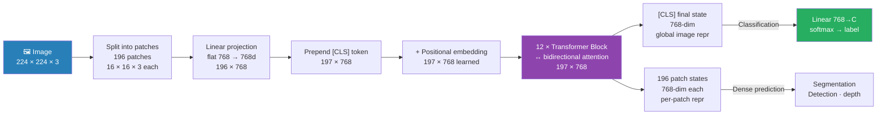

# Vision Transformers

> **Scope note.** This file owns **ViT and Swin as architectures**. The multimodal applications —
> CLIP, Donut, LayoutLM — live in `9.multimodal/`.
>
> **Résumé-relevant:** the Donut/Swin encoder is a live claim on the CV
> (*"Donut / Swin encoder, 75M parameters fully fine-tuned"*), and §9 plus
> [../02_models/07b_bart_end_to_end.md](../02_models/07b_bart_end_to_end.md) are the two halves of
> it — Swin encoder, BART decoder. See §10.

> ViT = standard transformer applied to image patches. Only difference from NLP transformer: patch linear projection replaces token embedding lookup. [CLS] token aggregates global image info across 12 layers. Needs large data (no spatial inductive bias). DeiT: add distillation token, trains on ImageNet-1K only. DINO: self-supervised via student-teacher EMA — attention heads naturally segment objects. Swin: window attention O(n) for high-res images, hierarchical features, preferred for document AI and dense prediction.

> **2024-25 notes:** DINOv2 has largely replaced supervised ImageNet ViT as the off-the-shelf vision backbone. Self-supervised, no labels, SOTA frozen features. Vision Mamba / MambaVision are emerging O(n) alternatives.

---

## Transformers Applied to Images

**The core insight:** treat an image as a **sequence of patches**, then apply a standard transformer.

```
Standard NLP transformer:
    Input:   [token_1, token_2, ..., token_n]  ← discrete word tokens
    Embed:   each token → d-dim vector via lookup table
    Process: n layers of self-attention + FFN

Vision Transformer (ViT):
    Input:   [patch_1, patch_2, ..., patch_n]  ← image patches (continuous)
    Embed:   each patch → d-dim vector via linear projection (not lookup)
    Process: same n layers of self-attention + FFN

The transformer architecture is IDENTICAL — only the input embedding changes.
```

---


> Key difference from NLP: patch linear projection replaces token embedding lookup. Everything else — attention, FFN, residuals — is identical.

## 1. Patch Extraction — The Key Difference

```
Image: H × W × C = 224 × 224 × 3

Patch size P = 16:
    Grid: (224/16) × (224/16) = 14 × 14 = 196 patches
    Each patch: 16 × 16 × 3 = 768 raw pixel values

Flatten each patch: 768 values → linear projection → 768-dim embedding

Compare to NLP:
    NLP: token_id (int) → Embedding(vocab_size, 768) → 768-dim vector
    ViT: patch pixels (768 floats) → Linear(768, 768) → 768-dim vector

NLP uses a lookup table (discrete input)
ViT uses a linear layer (continuous input)
```

### Patch Projection Layer

```python
import torch
import torch.nn as nn

class PatchEmbedding(nn.Module):
    def __init__(self, img_size=224, patch_size=16, in_channels=3, embed_dim=768):
        super().__init__()
        self.n_patches = (img_size // patch_size) ** 2  # 196

        # Conv2d with kernel=patch_size, stride=patch_size = non-overlapping patches
        # Equivalent to: flatten each patch + Linear(patch_size²×C, embed_dim)
        self.proj = nn.Conv2d(in_channels, embed_dim,
                              kernel_size=patch_size, stride=patch_size)

    def forward(self, x):
        # x: (B, 3, 224, 224)
        x = self.proj(x)         # (B, 768, 14, 14)
        x = x.flatten(2)         # (B, 768, 196)
        x = x.transpose(1, 2)    # (B, 196, 768)
        return x
```

---

## 2. ViT Architecture — Full Pipeline

```
Input image: (1, 3, 224, 224)
    ↓ PatchEmbedding
Patch tokens: (1, 196, 768)
    ↓ prepend [CLS] token
Sequence: (1, 197, 768)  ← 196 patches + 1 CLS
    ↓ + position embeddings (learnable, shape 197×768)
    ↓ Transformer Encoder = 12 layers
        Each layer:
            LayerNorm + Multi-Head Self-Attention (12 heads, d_head=64) + residual
            LayerNorm + FFN (768→3072→768) + residual
    ↓ Extract [CLS] token: (1, 768)
    ↓ Linear(768, n_classes)
Output: class logits (1, 1000)
```

### Key Numbers — ViT Variants

| Model | Patch | Sequence | Layers | Heads | d | FFN | Params |
|-------|-------|---------|-------|-------|---|-----|-------|
| ViT-T/16 | 16 | 197 | 12 | 3 | 192 | 768 | 5.7M |
| ViT-S/16 | 16 | 197 | 12 | 6 | 384 | 1536 | 22M |
| ViT-B/16 | 16 | 197 | 12 | 12 | 768 | 3072 | 86M |
| ViT-L/16 | 16 | 197 | 24 | 16 | 1024 | 4096 | 307M |
| ViT-H/14 | 14 | 257 | 32 | 16 | 1280 | 5120 | 632M |

**Verified** (patch-embed + CLS + position + blocks + final LN; the published figures also include a
classification head, which is the small residual difference):

```
  model        seq        computed       published
  ViT-T/16     197       5,524,416            5.7M
  ViT-S/16     197      21,665,664             22M
  ViT-B/16     197      85,798,656             86M
  ViT-L/16     197     303,301,632            307M
  ViT-H/14     257     630,764,800            632M
```

**Sequence length is `(img/P)² + 1`:** `224/16 = 14 → 14² = 196 + 1 = 197`, and
`224/14 = 16 → 16² = 256 + 1 = 257`.

**A coincidence worth not over-reading:** for `P=16`, a patch is `16×16×3 = 768` raw values — which
happens to equal ViT-B's `d_model`. The projection is still a learned `Linear(768, 768)`, not an
identity, and for `P=14` the patch is `588` values into `d=1280`.

---

## 3. [CLS] Token — Same as BERT

```
BERT: prepend [CLS] to text sequence → final [CLS] = sentence embedding
ViT:  prepend [CLS] to patch sequence → final [CLS] = image embedding

Mechanism: [CLS] has no inherent meaning → forced to attend to all patches
across all 12 layers → aggregates global image information

After 12 layers of attention:
    [CLS] = weighted summary of all 196 patches
    Linear([CLS], n_classes) = classification output

Alternative (used in DeiT, MAE): global average pooling over all 196 patch tokens
GAP tends to work slightly better for dense prediction tasks
[CLS] better for contrastive learning (DINO, CLIP)
```

---

## 4. Position Embeddings

**Problem:** attention is permutation-invariant — shuffling patches gives same output without positional information. ViT can't know patch spatial arrangement.

**Solution:** add learnable position embeddings (one per position, 0..196):
```python
position_embeddings = nn.Parameter(torch.zeros(1, 197, 768))
# (197×768 — learned during training)
x = patch_embeddings + position_embeddings
```

NLP uses sinusoidal OR learned positional embeddings. ViT uses **ONLY learned** — sinusoidal doesn't transfer well between patch grids.

**Interpolation for different resolutions:**
```
ViT trained on 224×224 (196 patches)
Fine-tune on 384×384 (576 patches) → 196 position embeddings don't cover 576 positions
Solution: bicubic interpolate position embeddings from 14×14 to 24×24 grid
```

---

## 5. Attention Complexity: ViT vs CNN

**CNN (ResNet):**
```
Receptive field grows with depth
Layer 1: sees 3×3 patch; Layer 20: sees ~100×100 patch
Complexity: O(n) — each conv touches k×k neighborhood
```

**ViT Self-Attention:**
```
Every patch attends to every other patch from layer 1
Layer 1: [CLS] already has access to all 196 patches
Complexity: O(n²) — attention matrix is 197×197
```

**Trade-off:**
- ViT: better long-range dependencies, worse locality / inductive bias
- CNN: better locality, worse global context
- Swin: window attention O(n) with shifted windows for cross-window context

---

## 6. Why ViT Needs Large Pre-training Data

**CNN has inductive biases:**
```
Translation equivariance: same filter applied everywhere
Locality: nearby pixels are related
→ These biases help CNN learn from less data (ImageNet-1K: 1.2M images)
```

**ViT has no such biases:**
```
Self-attention is permutation invariant
No assumption about spatial locality
→ Model must LEARN these properties from data
→ Needs more data to discover what CNNs get for free
```

**Empirical result (ViT paper):**
```
ImageNet-1K (1.2M):  ViT-B/16 < ResNet-50  (ViT underfits)
ImageNet-21K (14M):  ViT-B/16 ≈ ResNet-50
JFT-300M (300M):     ViT-L/16 > ResNet-152+  (ViT wins)
```

→ Use CNN for small datasets, ViT for large-scale pre-training.

---

## 7. DeiT — Data-efficient Image Transformers

DeiT trains ViT on ImageNet-1K only (no JFT-300M) using **knowledge distillation**.

```
Teacher: RegNet (CNN trained on ImageNet-1K, strong with limited data)
Student: ViT-B/16

Distillation token:
    Prepend [DIST] token alongside [CLS]
    [CLS]  trained to predict hard labels (ground truth class)
    [DIST] trained to match teacher's soft output distribution

L_total = 0.5 × L_CE([CLS], hard_labels)
         + 0.5 × L_KD([DIST], teacher_softmax)

After training: use either [CLS] or [DIST] or average both for prediction
Average: marginal improvement, [CLS] alone usually sufficient

Key result: DeiT-B/16 matches ViT-B/16 trained on JFT-300M
            using only ImageNet-1K (1.2M images vs 300M)
```

---

## 8. DINO — Self-Supervised ViT

DINO trains ViT without any labels using a student-teacher framework.

```
Two views of the same image:
    Global crops (large):  fed to teacher network
    Local crops (small):   fed to student network

Loss: cross-entropy between student and teacher output distributions
L = -Σ P_teacher(x) · log P_student(x)

Teacher update: exponential moving average (not gradient)
    θ_teacher = 0.996 × θ_teacher + 0.004 × θ_student

Centering: subtract running mean from teacher output → prevents collapse
```

**Key discovery: DINO attention heads naturally learn:**
- Head 1: attends to text regions
- Head 2: attends to table structure
- Head 3: attends to object boundaries
- ...without any segmentation labels

---

## 9. Swin Transformer — Hierarchical Vision

Swin solves ViT's O(n²) complexity for high-resolution images.

**ViT on 2560×1920 image:**
```
Patch size 16: (2560/16)×(1920/16) = 160×120 = 19,200 patches
Attention matrix: 19,200² = 368M entries → infeasible
```

**Swin:**
```
Patch size 4: 640×480 = 307,200 patches
Window size 7×7 = 49 tokens per window
Only attend WITHIN windows: 49² = 2,401 entries per window
Total windows: 307,200 / 49 ≈ 6,269 windows
Complexity: O(n) not O(n²)
```

**Four stages with patch merging:**
```
Stage 1: 640×480 patches, window 7×7 = 307K tokens, d=96
Stage 2: merge 2×2 = 320×240, d=192 = 77K tokens
Stage 3: merge 2×2 = 160×120, d=384 = 19K tokens
Stage 4: merge 2×2 = 80×60, d=768 = 4.8K tokens
```

**Shifted windows (every other layer):**
```
Regular windows: windows at {(0,0), (7,0), (14,0)...}
Shifted layer:   windows at {(3,3), (10,3), (17,3)...} (shifted by W/2)
→ patches in different windows can communicate across layers
```

---

## 10. Interview Q&A

**Q: How does ViT differ from a standard NLP transformer?**

The architecture is identical — same multi-head self-attention, same FFN, same LayerNorm layers. The only difference is input embedding: NLP uses a lookup table (discrete token IDs → embeddings); ViT uses a linear projection layer (continuous 768-pixel patch vectors → 768-dim embeddings). ViT also uses learned positional embeddings because sinusoidal patterns don't transfer well between different image resolutions.

**Q: Why does ViT need more data than CNNs?**

CNNs have built-in inductive biases: translation equivariance (same filter applied everywhere) and locality (nearby pixels are related). These biases are correct for images and let CNNs generalize from limited data. ViT has no such biases — self-attention is permutation invariant with no spatial assumptions. ViT must learn these properties from data. On ImageNet-1K (1.2M images), ViT underperforms ResNet. On JFT-300M (300M images), ViT dominates. DeiT addresses this via knowledge distillation from a CNN teacher.

**Q: What is the role of the [CLS] token in ViT?**

[CLS] is a learnable token prepended to the 196 patches before the transformer. It has no inherent meaning → forced to freely attend to all patches across all 12 layers → aggregates global image information through 12 rounds of attention. The final [CLS] representation is fed to the classification head. It's directly analogous to BERT's [CLS] token for sentence classification.

**Q: Swin vs ViT — when to use which?**

ViT: global attention from layer 1, best with very large pre-training data (JFT-300M, LAION), preferred for contrastive learning (CLIP, DINO). Struggles with high-resolution images and dense prediction tasks (detection, segmentation, document understanding). Swin: window attention O(n) for high-resolution, hierarchical features (like CNN), better for high-resolution tasks. DINOv2 uses Swin encoder specifically for 2560×1920 document images where ViT global attention would be infeasible.

---

## Connections

- **Full ViT dry-run with numbers:** [../../9.multimodal/03_vision_transformers.md](../../9.multimodal/03_vision_transformers.md)
- **ViT in CLIP:** [../../9.multimodal/04_clip_finetuning_end_to_end.md](../../9.multimodal/04_clip_finetuning_end_to_end.md)
- **Swin in Donut:** [../../9.multimodal/05_donut_end_to_end.md](../../9.multimodal/05_donut_end_to_end.md)
- **Transformer fundamentals:** [02_transformer_architecture.md](02_transformer_architecture.md)
- **BERT ([CLS] parallel):** [../02_models/01_bert_family.md](../02_models/01_bert_family.md)
- **BART — Donut's decoder half:** [../02_models/07b_bart_end_to_end.md](../02_models/07b_bart_end_to_end.md)

---

## 10. Donut = Swin encoder + BART decoder

The one assembly to be able to draw, because it is on the résumé.

```
document image
     │  Swin encoder (§9)          hierarchical windows, patch merging
     ▼
  visual feature sequence          <- this is the MEMORY
     │  cross-attention            K,V from the encoder, Q from the decoder
     ▼
  BART decoder                     causal self-attn + cross-attn + FFN
     │
     ▼
  structured text  (JSON, key-value pairs)
```

**Why it is called OCR-free:** there is no text-recognition stage. The decoder reads the *image
features* directly through cross-attention and emits structured text, so OCR errors cannot propagate
— because there is no OCR.

Each half is already hand-computed:

- **Swin encoder** — §9 above
- **Cross-attention** — [../../4.nlp/03_sequence_models/06c_transformer_decoder_end_to_end.md](../../4.nlp/03_sequence_models/06c_transformer_decoder_end_to_end.md) §8, the rectangular `L_tgt × L_src` matrix with K/V from the encoder
- **BART decoder** — [../02_models/07b_bart_end_to_end.md](../02_models/07b_bart_end_to_end.md)

**The question to expect:** *"which half is Swin and which is BART?"* — Swin is the encoder (image
in), BART is the decoder (text out), and cross-attention is the join. If you can draw
[06c](../../4.nlp/03_sequence_models/06c_transformer_decoder_end_to_end.md)'s decoder and swap the
text encoder for Swin, you have drawn Donut.

---

## Key Takeaway

ViT = standard transformer applied to image patches. Only difference from NLP transformer: patch linear projection replaces token embedding lookup. [CLS] token aggregates global image info across 12 layers. Needs large data (no spatial inductive bias). DeiT: add distillation token, trains on ImageNet-1K only. DINO: self-supervised via student-teacher EMA — attention heads naturally segment objects, without any segmentation labels. Swin: window attention O(n) for high-res images, hierarchical features, preferred for document AI and dense prediction. In 2024+, DINOv2 has largely replaced supervised ImageNet ViT as the off-the-shelf frozen backbone.
