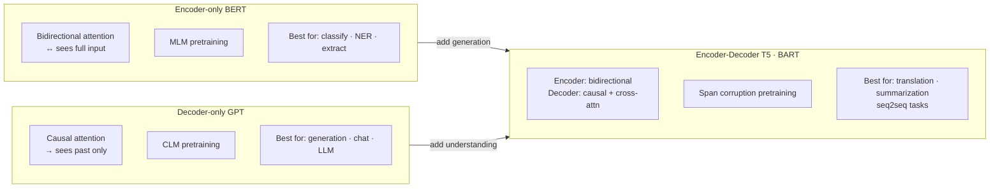

# Encoder-Decoder Models (T5, BART)

> Encoder-decoder = bidirectional understanding (encoder) + autoregressive generation (decoder), connected via cross-attention. T5 unifies all NLP tasks as text-to-text — one model, one loss. Flan-T5 adds instruction tuning — use this over raw T5. BART excels at denoising tasks (summarization). For production: `flan-t5-large` or `bart-large-cnn` for summarization; `opus-mt` for translation. The architectural insight: cross-attention is what allows the decoder to condition generation on the full encoded input.

> Decoder mechanism hand-computed end-to-end: [../../4.nlp/03_sequence_models/06c_transformer_decoder_end_to_end.md](../../4.nlp/03_sequence_models/06c_transformer_decoder_end_to_end.md).

---

## Quick Reference

| Model | Pretraining | Best Tasks |
|-------|------------|-----------|
| T5 | Span corruption (MLM variant) | Translation, summarization, QA, classification as text |
| BART | Corrupt + reconstruct (denoising) | Summarization, translation, dialogue |
| mT5 | Multilingual span corruption | Cross-lingual tasks |
| PEGASUS | Gap-sentence prediction (GSP) | Abstractive summarization |
| mBART | Multilingual denoising | Multilingual translation, cross-lingual transfer |

**When to use encoder-decoder:** Conditional generation tasks — where input and output are different sequences: summarization, translation, data-to-text, structured extraction, abstractive QA.


> T5: "text-to-text" — frames everything as seq2seq. Summarize: → summary. Classify: → label. Translate: → text.

---

## 1. Core Concepts

### Why Encoder-Decoder?

```
Encoder-only (BERT): bidirectional context → good representations, bad at generation
Decoder-only (GPT):  autoregressive generation → good at generation, no bidirectional encoding

Encoder-Decoder (T5/BART): best of both
    Encoder: reads full input with bidirectional attention (rich understanding)
    Decoder: generates output autoregressively, conditioned on encoder via cross-attention

Perfect for: "given this long document (encoder), generate this short summary (decoder)"
             "given French sentence (encoder), generate English sentence (decoder)"
```

### Architecture

```
Input tokens  → [Encoder: bidirectional self-attention + FFN] × N
                     ↓ encoder_output (K, V for cross-attention)
Target tokens → [Decoder: causal self-attn + cross-attn + FFN] × N
                     ↓
              Linear + Softmax → generated tokens
```

---

## 2. T5 (Text-to-Text Transfer Transformer, Raffel et al. 2020)

### Core idea: every NLP task → text-to-text format

```
Translation:     Input:  "translate English to German: The house is wonderful."
                 Output: "Das Haus ist wunderbar."

Summarization:   Input:  "summarize: [long article text...]"
                 Output: "brief summary"

Classification:  Input:  "sentiment: This film is terrible."
                 Output: "negative"            ← yes, just a word

QA:              Input:  "question: What is the capital of France? context: France is a country..."
                 Output: "Paris"

CoLA (acceptability): Input:  "cola: The dog walk."
                       Output: "unacceptable"
```

**Unified text-to-text format allows:** Single model, single loss (cross-entropy on output tokens). Transfer across tasks without architectural changes. Multi-task training in one model.

### T5 Architecture

```
Encoder: standard transformer encoder
Decoder: standard transformer decoder with cross-attention
Relative position biases (not absolute): add scalar to attention scores based on distance
    → Better for tasks requiring relative understanding

Variants:
    T5-small:  60M params
    T5-base:   220M params
    T5-large:  770M params
    T5-XL:     3B params
    T5-XXL:    11B params
    T5-11B:    11B params
    Flan-T5:   T5 instruction-tuned on 1800+ tasks
```

### Pretraining: Span Corruption

```
Original text: "The quick brown fox jumps over the lazy dog"

1. Select 15% of tokens for masking
2. Group consecutive masked tokens into spans
3. Replace each span with a unique sentinel: <extra_id_0>, <extra_id_1>, ...

Input (corrupted):  "The quick <extra_id_0> over the <extra_id_1>"
Output (targets):   "<extra_id_0> brown fox jumps <extra_id_1> lazy dog <extra_id_2>"

Average span length: 3 tokens
This trains the model to predict the missing spans given context
```

### T5 Code

```python
from transformers import T5ForConditionalGeneration, T5Tokenizer

model = T5ForConditionalGeneration.from_pretrained('t5-base')
tokenizer = T5Tokenizer.from_pretrained('t5-base')

# Summarization
input_text = "summarize: The stock market declined sharply today as investors worried about inflation..."
inputs = tokenizer(input_text, return_tensors='pt', max_length=512, truncation=True)

output_ids = model.generate(
    inputs.input_ids,
    max_new_tokens=150,
    min_length=30,
    num_beams=4,
    early_stopping=True,
    no_repeat_ngram_size=3,
    length_penalty=2.0,   # > 1.0: prefer longer sequences
)

summary = tokenizer.decode(output_ids[0], skip_special_tokens=True)

# Fine-tuning T5 (custom task)
from transformers import Seq2SeqTrainingArguments, Seq2SeqTrainer

training_args = Seq2SeqTrainingArguments(
    output_dir="./t5-finetuned",
    num_train_epochs=3,
    per_device_train_batch_size=8,
    per_device_eval_batch_size=16,
    warmup_steps=500,
    weight_decay=0.01,
    learning_rate=3e-4,         # T5 typically uses higher LR than BERT
    predict_with_generate=True, # use generate() for eval instead of argmax
    generation_max_length=150,
    evaluation_strategy="epoch",
    fp16=True,
)

trainer = Seq2SeqTrainer(
    model=model,
    args=training_args,
    train_dataset=train_dataset,
    eval_dataset=eval_dataset,
    tokenizer=tokenizer,
    data_collator=data_collator,
)
```

---

## 3. BART (Lewis et al. 2019)

### Pretraining: Denoising Autoencoder

BART is pretrained to reconstruct the original text from corrupted versions. Multiple corruption strategies applied (unlike T5's single span corruption):

```
1. Token Masking:       replace with [MASK] (like BERT)
2. Token Deletion:      remove tokens entirely (model must figure out positions)
3. Text Infilling:      replace span with single [MASK] token
4. Sentence Permutation: shuffle sentence order
5. Document Rotation:   rotate document to start at random token

→ Combines noisy channel approach with encoder-decoder architecture
→ Particularly strong for summarization and text generation tasks
```

### Architecture Differences from T5

```
T5:   relative position bias, RMSNorm, no biases
BART: absolute position embeddings (learned), GeLU, biases like standard transformer
Both: encoder + decoder + cross-attention

BART-base:  6+6 layers, 140M params
BART-large: 12+12 layers, 400M params
```

```python
from transformers import BartForConditionalGeneration, BartTokenizer

model = BartForConditionalGeneration.from_pretrained('facebook/bart-large-cnn')
tokenizer = BartTokenizer.from_pretrained('facebook/bart-large-cnn')

# BART-large-cnn: fine-tuned on CNN/DailyMail — great for news summarization
article = """Scientists have discovered a new species of deep-sea fish in the Pacific Ocean.
The discovery was made during a deep-sea expedition... [long article]"""

inputs = tokenizer([article], max_length=1024, return_tensors='pt', truncation=True)
summary_ids = model.generate(
    inputs['input_ids'],
    num_beams=4,
    max_length=150,
    min_length=30,
    early_stopping=True
)

summary = tokenizer.batch_decode(summary_ids, skip_special_tokens=True)[0]
```

---

## 4. Flan-T5 (Wei et al. 2022)

```
Flan = Finetuned Language Net
T5 instruction-tuned on 1836 tasks formatted as natural language instructions

Standard T5:  "translate English to German: The cat sat."
Flan-T5:      Can handle: "Please translate the following sentence from English to German:
               The cat sat."
              Also: "What is the German translation of 'The cat sat'?"

Key results:
    Flan-T5-XL (3B) outperforms GPT-3 (175B) on many benchmarks
    Instruction tuning unlocks zero-shot capability from pretraining

Recommendation: Use Flan-T5 instead of raw T5 for zero/few-shot tasks
```

```python
from transformers import AutoModelForSeq2SeqLM, AutoTokenizer

model = AutoModelForSeq2SeqLM.from_pretrained("google/flan-t5-large")
tokenizer = AutoTokenizer.from_pretrained("google/flan-t5-large")

# Zero-shot classification (no examples)
prompt = "Classify the sentiment of the following review as positive or negative: 'The service was awful.'"
inputs = tokenizer(prompt, return_tensors="pt")
outputs = model.generate(**inputs, max_new_tokens=10)
print(tokenizer.decode(outputs[0], skip_special_tokens=True))  # "negative"

# Zero-shot QA
prompt = "Answer the following question: What is the boiling point of water? Answer:"
inputs = tokenizer(prompt, return_tensors="pt")
outputs = model.generate(**inputs, max_new_tokens=20)
print(tokenizer.decode(outputs[0], skip_special_tokens=True))  # "100 degrees Celsius"
```

---

## 5. Tokenizing for Seq2Seq (Critical Details)

```python
from transformers import AutoTokenizer

tokenizer = AutoTokenizer.from_pretrained("t5-base")

def preprocess_function(examples):
    # Encode inputs
    model_inputs = tokenizer(
        examples['source'],
        max_length=512,
        truncation=True,
        padding='max_length',
    )

    # Encode targets — use text_target or as_target_tokenizer
    with tokenizer.as_target_tokenizer():
        labels = tokenizer(
            examples['target'],
            max_length=128,
            truncation=True,
            padding='max_length',
        )

    # Replace padding token id with -100 so it's ignored in loss
    labels_ids = labels['input_ids']
    labels_ids = [
        [(l if l != tokenizer.pad_token_id else -100) for l in label]
        for label in labels_ids
    ]

    model_inputs['labels'] = labels_ids
    return model_inputs
```

---

## 6. Beam Search for Seq2Seq

```python
output = model.generate(
    input_ids,
    max_new_tokens=200,
    # Core
    num_beams=4,               # 4-6 typical for summarization
    early_stopping=True,

    # Quality control
    no_repeat_ngram_size=3,    # prevent 3-gram repetition
    length_penalty=2.0,        # >1 = longer, <1 = shorter
    repetition_penalty=1.0,    # >1 penalizes repetition

    # Multiple outputs
    num_return_sequences=3,    # return top 3 beams
    num_beam_groups=3,         # diverse beam search
    diversity_penalty=0.5,     # within diverse beam search

    # Constrained
    forced_bos_token_id=tokenizer.lang_code_to_id['de_DE'],  # force German for mBART
)
```

---

## 7. When to Use What

| Task | Model | Config |
|------|-------|--------|
| News summarization | `facebook/bart-large-cnn` | num_beams=4, max_length=150 |
| General summarization | `google/flan-t5-large` | few-shot prompt |
| Translation | `Helsinki-NLP/opus-mt-en-de` | MarianMT (T5-based) |
| Multilingual | `google/mt5-base` | span corruption on 101 languages |
| Document QA (extractive) | `deepset/roberta-base-squad2` | encoder-only fine-tuned |
| Document QA (abstractive) | `google/flan-t5-xl` | generative QA |
| Information extraction | `t5-base` fine-tuned | structured output as text |
| Zero-shot tasks | `google/flan-t5-xl` | instruction-tuned, no fine-tuning needed |

---

## 8. Gotchas

**Decoder `input_ids` during training:** Seq2seq models expect decoder inputs shifted right (teacher forcing). HuggingFace does this automatically when you pass `labels` — don't manually construct `decoder_input_ids` unless you know what you're doing.

**Length penalty:** `length_penalty > 1.0` promotes longer sequences; `< 1.0` promotes shorter. For summarization, you usually want `length_penalty=2.0` to avoid too-short outputs. For keyword extraction, use `length_penalty=0.8`.

**T5 prefix is mandatory:** T5 was pretrained with task prefixes like "summarize: ", "translate English to German: ". Without the correct prefix, T5 performance degrades significantly because it was never trained to infer the task from content alone.

**Max input vs max generation length:** Always set `max_length` on the tokenizer (input limit) separately from `max_new_tokens` in `generate()` (output limit). Confusing these causes silent truncation.

**Flan-T5 for classification:** Flan-T5 returns text like "positive" or "negative". For production, post-process with a mapping dict and handle unexpected outputs (constrained beam search or logits post-processing).

---

## 9. Interview Q&A

**Q: When would you choose T5/BART over GPT for a generation task?**

Encoder-decoder models are better when: (1) the output is strongly conditioned on the full input and the input-output lengths differ significantly (summarization: 1000→100 tokens), (2) you need bidirectional understanding of the source (translation), (3) you want to fine-tune efficiently on a specific conditional generation task. GPT-style decoder-only models are better for: open-ended generation, instruction following with prompting, tasks requiring reasoning that benefits from the model "thinking out loud" in a single sequence.

**Q: How does T5 handle diverse NLP tasks in a single model?**

T5 reformats every task as text-to-text: input is a natural language prompt with a task prefix; output is the answer as text. Classification becomes generating "positive"/"negative". QA generates the answer string. NER could output "person: John, location: Paris". This unified format means the same cross-entropy loss over output tokens applies to every task, enabling multi-task training with a single model, single loss function, and shared representations.

**Q: What's the difference between T5's span corruption and BERT's MLM?**

A: BERT masks individual tokens (15%), each replaced with [MASK], random, or original. T5 masks contiguous spans (avg 3 tokens each) and replaces each span with a single sentinel token. The decoder must generate the sentinel + all tokens in the span. Span corruption: (1) teaches the model to predict multiple tokens per masked region, (2) uses the encoder-decoder architecture naturally (encoder encodes corrupted; decoder generates spans), (3) is more efficient since the decoder only generates ~15% of tokens per example.

---

## Connections

- **Attention Mechanism (fundamentals/01):** Cross-attention is unique to encoder-decoder — decoder Q attends to encoder K, V
- **Transformer Architecture (fundamentals/02):** Full encoder-decoder architecture from original "Attention Is All You Need"
- **BERT Family (models/01):** Encoder-only — for understanding without generation
- **GPT Family (models/02):** Decoder-only — for open-ended generation
- **NLP Applications:** Summarization, translation, extractive QA all covered here
- **LLMs (5.llms/):** Modern LLMs (GPT-4, Claude) largely moved to decoder-only + RLHF

---

## Key Takeaway

Encoder-decoder = bidirectional understanding (encoder) + autoregressive generation (decoder), connected via cross-attention. T5 unifies all NLP tasks as text-to-text — one model, one loss. Flan-T5 adds instruction tuning — use this over raw T5. BART excels at denoising tasks (summarization). For production: `flan-t5-large` or `bart-large-cnn` for summarization; `opus-mt` for translation. The architectural insight: cross-attention is what allows the decoder to condition generation on the full encoded input.
