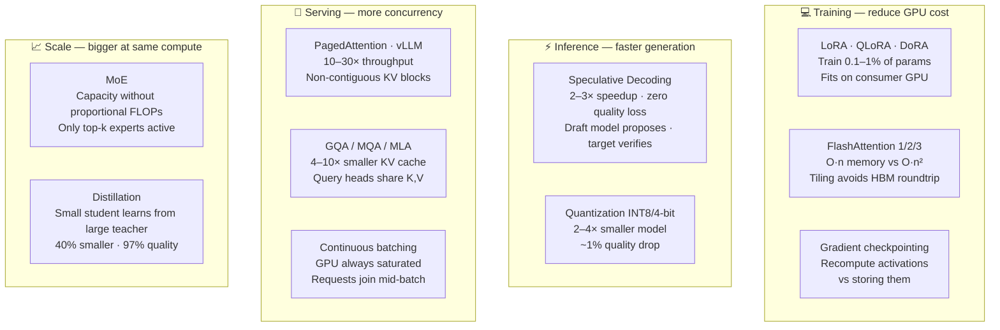

# Efficient Transformers

> Four efficiency axes: (1) Attention — Flash Attention for memory, sparse/local for long context; (2) Model size — distillation for smaller models, quantization for inference; (3) Fine-tuning — LoRA/QLoRA for training large models with small GPU budget; (4) Scaling — MoE for capacity without proportional compute. In practice: QLoRA + Flash Attention is the standard recipe for fine-tuning any modern LLM on limited hardware..

---

## Quick Reference

| Technique | Problem Solved | Key Tradeoff |
|-----------|---------------|-------------|
| Flash Attention | O(n²) memory for attention | Recomputes during backward (more FLOPs, less memory) |
| FlashAttention 2 (2023) | v1 GPU underutilization | Better warp partitioning — ~2× over v1 |
| FlashAttention 3 (2024) | H100 not fully utilized | Async + WGMMA + FP8 — ~1.5-2× over v2 on H100 |
| Paged Attention (vLLM) | KV cache memory fragmentation | Page-based allocation — 2-4× throughput |
| Prefix caching | Re-encoding shared prompts | Cache prompt KVs across requests |
| Chunked prefill | Long prompt latency blocks decode | Interleave prefill chunks with decode |
| GQA / MQA | KV cache size per token | Slight quality trade for 4-8× smaller KV |
| Multi-head Latent Attention (MLA) | KV cache too large | Low-rank KV projection (DeepSeek-V2/V3) |
| Sparse Attention (Longformer, BigBird) | O(n²) for long sequences | Misses some token interactions |
| DistilBERT / knowledge distillation | Model too large | Slight accuracy drop |
| LoRA / QLoRA / DoRA | Full fine-tuning too expensive | Minor quality gap vs full fine-tune |
| Quantization (INT8/4-bit, GPTQ, AWQ, NF4) | Inference too slow / large | Small accuracy drop |
| Speculative Decoding / Medusa / EAGLE | Generation too slow | Requires draft model or extra heads |
| MoE | Scale without compute cost | Expert routing overhead, full-model VRAM |

For attention-kernel depth (FlashAttention 1→3 internals, RoPE / YARN / ALiBi): see `../../2.deep_learning/01_fundamentals/05_modern_components.md`. For long-context engineering depth see `13_long_context_scaling.md`. For speculative decoding variants see `12_speculative_decoding.md`.



---

## 1. Flash Attention (Dao et al., 2022)

**The problem:** Standard attention materializes the full O(n²) attention matrix in GPU HBM (high-bandwidth memory). For n=8192: 8192² × 4 bytes = 256MB just for one head's attention matrix. With 32 heads and batched sequences → multiple GBs → OOM.

**Flash Attention solution: tiling**

```
Standard attention (simplified):
    S = QK^T                # [n, n] — write to HBM
    P = softmax(S / √d_k)   # [n, n] — write to HBM
    O = PV                  # [n, d] — write to HBM

Flash Attention:
    Process in tiles that fit in SRAM (fast on-chip memory)
    For each tile of Q:
        For each tile of K, V:
            Compute partial scores in SRAM
            Update running softmax denominator (online normalization trick)
            Accumulate partial output O in SRAM
    Never materialize full n×n matrix in HBM

Memory: O(n²) → O(n)    (no full matrix stored)
Speed: 2-4× faster on A100 (fewer HBM reads/writes dominate time)
FLOPs: same O(n²·d) — actually slightly more due to recomputation in backward
```

```python
# Flash Attention 2 usage
pip install flash-attn --no-build-isolation

from transformers import AutoModelForCausalLM
import torch

# Automatic Flash Attention 2 in HuggingFace
model = AutoModelForCausalLM.from_pretrained(
    "meta-llama/Llama-2-7b-hf",
    attn_implementation="flash_attention_2",  # or "sdpa" for PyTorch native
    torch_dtype=torch.bfloat16,
    device_map="auto"
)

# PyTorch native scaled_dot_product_attention (uses Flash Attention when available)
enable_mem_efficient=True
output = torch.nn.functional.scaled_dot_product_attention(Q, H, V, is_causal=True)
```

---

## 2. Long-Sequence Efficient Attention

### Longformer (Beltagy et al., 2020)

```
Problem: BERT max 512 tokens — can't process full documents

Longformer attention pattern:
1. Local sliding window: each token attends to w/2 neighbors on each side
   O(n·w) instead of O(n²) — with w=512, n=4096: 8× cheaper

2. Global tokens: certain tokens (e.g., [CLS], task-specific tokens)
   attend to ALL tokens AND all tokens attend to them
   → preserves global context for task-relevant positions

3. Dilated sliding window: skip tokens in window (like dilated conv)
   → larger receptive field without more compute

Max sequence: 4096 tokens (vs BERT's 512)
```

```python
from transformers import LongformerForSequenceClassification, LongformerTokenizer

tokenizer = LongformerTokenizer.from_pretrained('allenai/longformer-base-4096')
model = LongformerForSequenceClassification.from_pretrained('allenai/longformer-base-4096')

# attention_mask: 1=local, 2=global (e.g., for [CLS] and question tokens in QA)
inputs = tokenizer(long_text, return_tensors='pt', max_length=4096, truncation=True)

# Set global attention on [CLS] token
global_attention_mask = torch.zeros_like(inputs['attention_mask'])
global_attention_mask[:, 0] = 1  # [CLS] token gets global attention

outputs = model(**inputs, global_attention_mask=global_attention_mask)
```

### BigBird (Zaheer et al., 2020)

Combines three attention patterns:
```
1. Random attention: each token attends to r random tokens (O(n·r))
2. Window attention: each token attends to w neighbors (O(n·w))
3. Global tokens: g special tokens attend to all (O(n·g))

Total: O(n·(r+w+g)) vs O(n²)
Max sequence: 4096 tokens
Theory: random + window + global is sufficient for universal approximation
```

---

## 3. Knowledge Distillation (DistilBERT, TinyBERT)

### Training procedure

```python
import torch
import torch.nn as nn
import torch.nn.functional as F
from transformers import BertForSequenceClassification

class DistillationTrainer:
    def __init__(self, teacher, student, temperature=4.0, alpha=0.5):
        self.teacher = teacher.eval()  # teacher frozen
        self.student = student
        self.T = temperature
        self.alpha = alpha  # weight between distill loss and task loss

    def compute_loss(self, inputs, labels):
        with torch.no_grad():
            teacher_logits = self.teacher(**inputs).logits

        student_outputs = self.student(**inputs, labels=labels)
        student_logits = student_outputs.logits
        task_loss = student_outputs.loss  # standard cross-entropy with true labels

        # Distillation loss: KL divergence between soft distributions
        distill_loss = F.kl_div(
            F.log_softmax(student_logits / self.T, dim=-1),
            F.softmax(teacher_logits / self.T, dim=-1),
            reduction='batchmean'
        ) * (self.T ** 2)  # T² factor to account for gradient magnitude scaling

        return self.alpha * task_loss + (1 - self.alpha) * distill_loss
```

### TinyBERT (2-stage distillation)

```
Stage 1 (General distillation): distill BERT on general text
    - Transformer layer distillation: match hidden states H, attention matrices A
    - Embedding distillation: match embedding layer

Stage 2 (Task-specific distillation): distill fine-tuned BERT on task data
    - Prediction layer distillation: match output logits

Results: TinyBERT-4L is 9.4× smaller, 9.4× faster with 96.8% of BERT-base performance
```

---

## 4. Parameter-Efficient Fine-Tuning (PEFT)

**Motivation:**

```
Fine-tuning LLaMA 7B: 7B × 4 bytes (fp32) = 28GB optimizer states alone → impractical
PEFT: freeze pretrained weights, add small trainable adapters

Types:
    LoRA: low-rank decomposition of weight updates
    Prefix Tuning: learned prefix tokens prepended to each layer
    Prompt Tuning: learned soft prompt tokens at input layer only
    Adapter: small bottleneck FFN inserted in each transformer block
```

### LoRA (Low-Rank Adaptation, Hu et al. 2021)

**Key insight:** weight updates during fine-tuning have low intrinsic rank.

```
For a pretrained weight matrix W_0 ∈ R^{d×k}:
    Standard fine-tuning: update W = W_0 + ΔW  (d×k parameters)
    LoRA: ΔW = BA  where B ∈ R^{d×r}, A ∈ R^{r×k}, r << min(d,k)

Parameters: d×k → r×(d+k), e.g., d=1024, k=1024, r=8: 1048576 → 16384 (64× less)

During forward pass:
    h = W_0x + (scale · B · A · x)
    scale = α/r  (hyperparameter α typically set to r)

At inference: merge W = W_0 + BA → no latency overhead

Apply to: Wq, Wv (attention projections) — most parameters, most impact
Optional: Wk, Wp, FFN projections
```

```python
from peft import LoraConfig, get_peft_model, TaskType
from transformers import AutoModelForCausalLM

model = AutoModelForCausalLM.from_pretrained("meta-llama/Llama-2-7b-hf")

lora_config = LoraConfig(
    task_type=TaskType.CAUSAL_LM,
    r=16,                     # rank — higher = more capacity, more params
    lora_alpha=32,            # scale factor = alpha/r = 2
    target_modules=["q_proj", "v_proj", "k_proj", "o_proj"],
    lora_dropout=0.05,
    bias="none",
)

model = get_peft_model(model, lora_config)
model.print_trainable_parameters()
# trainable params: 4,194,304 || all params: 6,742,609,920 || trainable%: 0.06
```

### QLoRA (Dettmers et al., 2023) — LoRA + 4-bit quantization

```
Steps:
1. Load base model in 4-bit NormalFloat (NF4) quantization + fits 7B in 4GB VRAM
2. Add LoRA adapters in fp16/bf16 (trainable)
3. Use Double Quantization: quantize the quantization constants (saves ~0.35 bits/param)
4. Use paged optimizers to handle GPU memory spikes during training

Result: Fine-tune LLaMA 65B on a single A100 80GB GPU (was impossible before)
```

```python
from transformers import AutoModelForCausalLM, BitsAndBytesConfig
from peft import prepare_model_for_kbit_training, LoraConfig, get_peft_model

# 4-bit quantization config
bnb_config = BitsAndBytesConfig(
    load_in_4bit=True,
    bnb_4bit_use_double_quant=True,
    bnb_4bit_quant_type="nf4",
    bnb_4bit_compute_dtype=torch.bfloat16,
)

model = AutoModelForCausalLM.from_pretrained(
    "meta-llama/Llama-2-7b-hf",
    quantization_config=bnb_config,
    device_map="auto",
)

# Prepare for kbit training: cast LayerNorm and LM head to fp32
model = prepare_model_for_kbit_training(model)

# Add LoRA
lora_config = LoraConfig(r=64, lora_alpha=16, target_modules=["q_proj", "v_proj"],
                          lora_dropout=0.1, bias="none", task_type="CAUSAL_LM")
model = get_peft_model(model, lora_config)
# Train normally — only LoRA params update; base model stays 4-bit frozen
```

---

## 5. Quantization

### Post-Training Quantization (PTQ)

```
Convert weights (and optionally activations) from fp32/fp16 to lower precision
after training — no retraining required.

INT8 (8-bit): 4× smaller than fp32, minimal accuracy loss
INT4 (4-bit): 8× smaller, small accuracy loss
NF4 (4-bit NormalFloat): optimal for normally-distributed weights (neural net weights)

Weight quantization only (most common):
    Quantize: w_int = round(w_fp32 / scale + zero_point)
    Dequantize: w_fp32 = (w_int - zero_point) × scale

GPTQ (accurate PTQ for LLMs):
    Use calibration data to minimize quantization error per layer
    Better accuracy than naive round-to-nearest at same bit-width
```

```python
# bitsandbytes INT8 (HuggingFace)
from transformers import AutoModelForCausalLM

model = AutoModelForCausalLM.from_pretrained(
    "facebook/opt-6.7b",
    load_in_8bit=True,   # LLM.int8() algorithm
    device_map="auto",
)
# 6.7B params: 13.4GB (fp16) → ~6.7GB (int8)

# GPTQ (using auto-gptq)
from auto_gptq import AutoGPTQForCausalLM

model = AutoGPTQForCausalLM.from_quantized(
    "TheBloke/Llama-2-7B-GPTQ",
    device="cuda:0",
    use_triton=False,
)
```

---

## 6. Mixture of Experts (MoE)

### Architecture

```
Standard FFN: all tokens use the same FFN weights
MoE FFN:      for each token, a router selects k of N expert FFNs to use

Router(x) = softmax(W_gate × x)   ← select top-k experts
FFN_MoE(x) = Σ top_k gate(x_i) · Expert_i(x)

e.g., Mistral 8×7B:
    8 expert FFNs, each with same size as Mistral 7B's FFN
    Router selects top-2 experts per token
    Total params: ~47B but only ~13B active per forward pass
    ≈ 47B model quality at 13B inference cost

Load balancing loss: added during training to prevent all tokens routing to same experts
```

```python
from transformers import AutoModelForCausalLM

# Mistral 8×7B — open MoE model
model = AutoModelForCausalLM.from_pretrained(
    "mistralai/Mistral-8x7B-Instruct-v0.1",
    torch_dtype=torch.bfloat16,
    device_map="auto",
)
# Total params: 46.7B, Active params per token: 12.9B
# Quality comparable to LLaMA 2 70B at fraction of inference cost
```

---

## 7. When to Use What

| Scenario | Solution | Why |
|---------|---------|-----|
| Fine-tune LLM, limited GPU | QLoRA | 7B fits in 6GB VRAM |
| Production inference, speed | Flash Attention + bfloat16 | 2-4× speedup, same quality |
| Inference on CPU/edge | INT8/INT4 quantization | 4-8× smaller |
| Long documents (>512 tokens) | Longformer or modern LLM (32K+) | Extended context |
| Smaller model, same accuracy | Knowledge distillation | 40-60% smaller |
| Scale without compute | MoE (Mistral) | More params, same FLOPs |
| Batch inference optimization | Continuous batching + KV cache | vLLM |

---

## 8. Gotchas

**LoRA rank selection:** r=8 or r=16 for most tasks; r=64+ for domain-specific fine-tuning with large distribution shift. Too small → underfitting; too large → overfitting + defeats PEFT purpose. Always tune r as a hyperparameter.

**Merge LoRA before serving:** After training, merge W = W_0 + BA to get a single weight matrix. No runtime overhead. Forgetting to merge → 2 matrix multiplications instead of 1.

**Quantization of normalization layers:** Always keep LayerNorm/RMSNorm in fp32 or bf16. Quantizing them to int8/int4 significantly hurts accuracy. `prepare_model_for_kbit_training()` handles this automatically.

**Flash Attention requires contiguous memory:** Ensure tensors are contiguous before calling Flash Attention: `q = q.contiguous()`. Non-contiguous layouts silently fall back to standard attention in some implementations.

**MoE expert collapse:** During training, some experts may receive no tokens (all traffic routes to popular experts). Load balancing loss prevents this but requires tuning its weight coefficient.

---

## 9. Interview Q&A

**Q: Explain Flash Attention. Why does it improve memory without changing FLOPs?**

Standard attention writes the full n×n attention matrix to GPU HBM (high-bandwidth memory), requiring O(n²) memory reads/writes which are the actual bottleneck. Flash Attention processes attention in tiles that fit in SRAM (fast on-chip memory), using an online softmax normalization trick that allows accumulating results without materializing the full matrix. Memory drops from O(n²) to O(n). FLOPs stay O(n²·d) — actually slightly more since activations are recomputed during the backward pass rather than stored. The speedup comes from avoiding slow HBM transfers, not from computing less.

**Q: What is LoRA and why does it work?**

LoRA hypothesizes that weight updates during fine-tuning have low intrinsic rank — the meaningful changes live in a low-dimensional subspace. It represents ΔW = BA where B is d×r and A is r×k with r << min(d,k). Instead of updating d×k parameters, only r×(d+k) are trained. Works because: (1) empirically, fine-tuning updates have low rank (singular values drop off quickly), (2) freezing the pretrained model preserves general knowledge while adapters capture task-specific information. At inference, merge BA into W for zero overhead.

**Q: What's the difference between QLoRA and LoRA?**

LoRA adds low-rank adapters to a full-precision (fp16/bf16) frozen base model. QLoRA additionally quantizes the base model to 4-bit (NF4) before adding LoRA adapters — the base model stays 4-bit frozen during training while adapters train in bf16. QLoRA also introduces double quantization (quantize the scale factors) and paged optimizers for memory spikes. Result: fine-tune LLaMA 65B on a single A100 vs needing 8 A100s for standard LoRA.

**Q: How does Mixture of Experts scale model capacity without proportionally scaling compute?**

Standard transformer uses all FFN weights for every token. MoE replaces the single FFN with N expert FFNs and a learned router that selects k < N experts per token. Total parameters grow with N, but active parameters per forward pass stay constant at k/N × total. Mistral 8×7B: 47B total parameters, 13B active per token. The routing is fully differentiable (soft routing during training), so experts specialize during training. Challenge: requires all expert weights to be in memory simultaneously, so while compute is sparse, memory isn't.

---

## Connections

- **Attention Mechanism (fundamentals/01):** Flash Attention optimizes the core attention operation
- **Transformer Architecture (fundamentals/02):** All efficiency techniques operate on standard transformer blocks
- **BERT Family (models/01):** DistilBERT, Longformer are efficient BERT variants
- **GPT Family (models/02):** LoRA/QLoRA primarily used for LLM fine-tuning; Mistral is a GPT-style MoE
- **LLM Fine-tuning (5.llms/finetuning):** QLoRA is the standard approach for fine-tuning LLMs
- **MLOps/Serving (7.mlops):** Quantization, batching, KV cache critical for production

---

## Key Takeaway

Four efficiency axes: (1) Attention — Flash Attention for memory, sparse/local for long context; (2) Model size — distillation for smaller models, quantization for inference; (3) Fine-tuning — LoRA/QLoRA for training large models with small GPU budget; (4) Scaling — MoE for capacity without proportional compute. In practice: QLoRA + Flash Attention is the standard recipe for fine-tuning any modern LLM on limited hardware.

---

## Code Practice — Wired by Phase 6

- `code_practice/04_5_advanced/03_distillation/` — TinyLlama → DistilGPT-2
