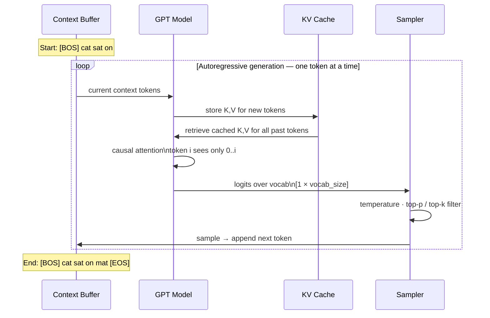

# 06 — GPT: Complete End-to-End Walkthrough

> Same sentence: "cat sat on mat". Same embeddings. New: causal mask, next-token prediction on ALL positions, autoregressive generation, sampling strategies.

---

## 0. What GPT Adds / Changes vs BERT

| | BERT | GPT |
|-|------|-----|
| Attention mask | Bidirectional | Causal (upper tri → -∞) |
| Special tokens | [CLS],[SEP],[MASK] | None (or `<|endoftext|>`) |
| Input | Tok+Seg+PE | Tok+PE only |
| Pretraining | MLM + NSP | Next Token Prediction |
| Loss computed on | 15% (masked) | 100% of positions |
| LM Head | W_mlm (separate) | W_lm = embed.T (tied) |
| [CLS] aggregation | Yes | No (use last token or avg pool) |
| Parallelism | All tokens (bidir) | All tokens (causal, parallel) |
| Generation | No | Yes (autoregressive) |
| Fine-tuning | Add head, fine-tune | SFT or LoRA |
| Inference | Single forward pass | Token-by-token + KV cache |
| Gradient per step | 15% positions | 100% positions |
| Typical use | Classification, NER | Generation, LLM prompting |

**THE KEY ARCHITECTURAL DIFFERENCE:**
```
BERT: scores[i,j] = raw score + ALL tokens in context → after softmax: weight > 0
GPT:  scores[i,j] = raw score for j ≤ i,   -∞ for j > i
      → token i only "sees" tokens 0..i during training AND inference
      → enables autoregressive generation: generate token-by-token

WHY THIS ENABLES GENERATION:
    Step 1: given [cat], predict → [sat]
    Step 2: given [cat sat], predict → [on]
    Step 3: given [cat sat on], predict → [mat]
    Each step uses the causal-masked transformer + identical to training
    (No mismatch between training and inference, unlike masked models)
```


> KV cache is critical — without it, each step re-encodes the full context (O(n²) per step). With KV cache: O(n) per step.

---

## 1. Problem Statement

```
Sentence:   "cat sat on mat"
Task:       Language Modeling — given each prefix, predict the next token.
            Loss computed at EVERY position (not just 15% like BERT).

Input:   [cat, sat, on, mat]   (indices [0, 1, 2, 3])
Targets: [sat, on, mat, ?]     (shift-by-1)
    Position 0: predict sat
    Position 1: predict on
    Position 2: predict mat
    Position 3: predict next word (EOS or next sentence)

This walkthrough: ONE GPT decoder block.
    - Apply causal mask to attention
    - Compute loss at all 3 positions (0+1, 1+2, 2+3)
    - Focus detail on position 2 (on + mat, uses full left context)
    - Show sampling strategies for generation
```

---

## 2. Input Representation

### 2.1 Token Embeddings + Positional Encoding

GPT has NO segment embeddings. Input = token embed + PE only.

| Word | Index | Embedding |
|------|-------|-----------|
| cat | 0 | [1.0, 0.5] |
| sat | 1 | [0.2, 0.3] |
| on  | 2 | [0.1, 0.1] |
| mat | 3 | [0.2, 0.4] |

PE (sinusoidal, d=2):
```
pos=0 (cat): [sin(0), cos(0)]   = [0.000, 1.000]
pos=1 (sat): [sin(1), cos(1)]   = [0.841, 0.540]
pos=2 (on):  [sin(2), cos(2)]   = [0.909, -0.416]
pos=3 (mat): [sin(3), cos(3)]   = [0.141, -0.990]
```

**X_input = token_embed + PE:**
```
cat: [1.000, 0.500] + [0.000, 1.000] = [1.000, 1.500]
sat: [0.200, 0.300] + [0.841, 0.540] = [1.041, 0.840]
on:  [0.100, 0.100] + [0.909,-0.416] = [1.009,-0.316]
mat: [0.200, 0.400] + [0.141,-0.990] = [0.341,-0.590]
(same as transformer file — no segment embed in GPT)
```

---

## 3. Weight Setup

```python
Wq = [[0.60, 0.40], [0.20, 0.50]]
Wk = [[0.50, 0.30], [0.10, 0.40]]
Wv = [[0.80, 0.20], [0.30, 0.70]]

W1 (2×4): [[1.0, 0.5, 0.3, 0.2, 0.1], [0.4, 0.2, 0.3, 0.1]]
b1 = [0, 0]
W2 (4×2): [[0.5, 0.3], [0.2, 0.4], [0.3, 0.2], [0.1, 0.5]]
b2 = [0, 0]

LM HEAD (weight tying — shares weights with token embedding):
W_lm = token_embed.T   shape (2×4)
     = [[1.0, 0.2, 0.1, 0.2],   ← row = dim0 of each word's embedding
        [0.5, 0.3, 0.1, 0.4]]   ← row = dim1 of each word's embedding

Logit for word w = x_final · embed[w]   (dot product with word's embedding)
This is "weight tying" — same matrix for input lookup AND output projection.
```

### Why weight tying?

```
Standard approach: separate W_lm (random init) for output projection.
Weight tying: output projection = input embedding transposed.

Benefits:
1. Fewer parameters: saves vocab_size × d_model params (30K × 768 = 23M for GPT-2)
2. Consistency: high logit for word w = final hidden state "points toward" w's embedding
3. Training efficiency: gradients flow to embeddings from BOTH input and output simultaneously
Used by: GPT-2, LLaMA, most modern decoder LLMs
```

---

## 4. Forward Pass

### Step 1: Compute Q, K, V (same as transformer file)

```
Q = X_input @ Wq:
    q_cat = [0.900, 1.100]
    q_sat = [0.793, 0.836]
    q_on  = [0.542, 0.246]
    q_mat = [0.067,-0.159]

K = X_input @ Wk:
    k_cat = [0.650, 0.900]
    k_sat = [0.605, 0.640]
    k_on  = [0.473, 0.177]
    k_mat = [0.112,-0.134]

V = X_input @ Wv:
    v_cat = [1.250, 1.250]
    v_sat = [1.085, 1.796]
    v_on  = [0.712,-0.019]
    v_mat = [0.096,-0.345]
```

### Step 2: Raw Score Matrix S = Q @ K^T / √2

```
Full score matrix (before mask):
           k_cat   k_sat   k_on   k_mat
q_cat:     1.106   0.912   0.046  -0.037
q_sat:     0.896   0.723   0.279  -0.016
q_on:      0.405   0.364   0.212   0.020
q_mat:    -0.061  -0.035   0.009   0.022
```

### Step 3: Apply Causal Mask (upper triangle → -∞)

```
GPT rule: token at position i can ONLY attend to positions 0..i.
Set S[i,j] = -∞ for all j > i.

Masked score matrix:
           k_cat   k_sat   k_on   k_mat
q_cat:     1.106    →       →       →      + cat sees only itself
q_sat:     0.896   0.723    →       →      + sat sees cat + itself
q_on:      0.405   0.364   0.212    →      + on sees cat+sat+itself
q_mat:    -0.061  -0.035   0.009   0.022   + mat sees all (last position)

The → entries = 0 after softmax.
This is the ONLY architectural difference from BERT.
```

### Step 4: Softmax → Attention Matrix A

```
Row 0 (cat — only sees itself):
    softmax([1.146, -∞, -∞, -∞]): exp(1.146)=3.145, others=0
    A_cat = [1.000, 0.000, 0.000, 0.000]
    Cat attends 100% to itself — it has no prior context.

Row 1 (sat — sees cat and itself):
    softmax([0.896, 0.723, -∞, -∞]):
    exp(0.896)=2.450, exp(0.723)=2.060  sum=4.510
    A_sat = [0.543, 0.457, 0.000, 0.000]
    Sat attends: cat=0.543, itself=0.457

Row 2 (on — sees cat, sat, itself):
    softmax([0.405, 0.348, 0.212, -∞]):
    exp(0.405)=1.500, exp(0.360)=1.431, exp(0.213)=1.236  sum=4.167
    A_on = [0.362, 0.340, 0.298, 0.000]
    On attends: cat=0.362, sat=0.340, itself=0.298

Row 3 (mat — sees all 4):
    softmax([-0.061, -0.035, 0.009, 0.022]):
    exp: [0.941, 0.966, 1.009, 1.022]  sum=3.938
    A_mat = [0.239, 0.245, 0.256, 0.260]
    Mat attends roughly uniformly (all scores near 0)
```

**Full attention matrix A (with causal mask):**
```
         cat    sat     on    mat
cat:  [1.000, 0.000, 0.000, 0.000]
sat:  [0.543, 0.457, 0.000, 0.000]
on:   [0.362, 0.340, 0.298, 0.000]
mat:  [0.239, 0.245, 0.256, 0.260]

Compare to BERT (no mask, from 05_bert file):
on would have had: [-0.31, -0.29, -0.25, -0.15] = mat visible!
GPT with mask:     [0.362, 0.340, 0.298, 0.000] = mat blocked
Weight redistributed from mat(0-blocked) to cat/sat/on.
```

---

## 5. Context Vectors C = A @ V

```
c_cat = A_cat @ V = 1.000×[1.250, 1.250] = [1.250, 1.250]

c_sat:
    dim0: 0.543×1.250 + 0.457×1.085 = 0.679 + 0.496 = 1.175
    dim1: 0.543×1.250 + 0.457×1.796 = 0.679 + 0.364 = 1.043
    c_sat = [1.175, 1.043]

c_on:
    dim0: 0.362×1.250 + 0.340×1.085 + 0.298×0.712 = 0.453 + 0.369 + 0.212 = 1.034
    dim1: 0.362×1.250 + 0.340×1.796 + 0.298×(-0.019) = 0.453 + 0.271 - 0.006 = 0.718
    c_on = [1.034, 0.718]

c_mat = [0.772, 0.399]   (same as transformer file — last position unaffected by mask)
```

---

## 6. Step 3: Residual + LayerNorm + FFN

**Residual 1: x_attn = X_input + C**
```
cat: [1.000, 1.500] + [1.250, 1.250] = [2.250, 2.750]
sat: [1.041, 0.840] + [1.175, 1.043] = [2.216, 1.883]
on:  [1.009,-0.316] + [1.034, 0.718] = [2.043, 0.402]
mat: [0.341,-0.590] + [0.772, 0.399] = [1.113,-0.191]
```

**LayerNorm (d=2, always gives ±1):**
```
cat: μ=2.500, σ=0.250 → LN=[-1.000, 1.000]
sat: μ=2.050, σ=0.167 → LN=[ 1.000,-1.000]
on:  μ=1.223, σ=0.821 → LN=[ 1.000,-1.000]
mat: μ=0.461, σ=0.652 → LN=[ 1.000,-1.000]
```

**FFN:**
```
cat (LN=[-1,1]):  pre_act=[-0.1,-0.1,-0.1,0.0], h=ReLU=[0,0,0,0]  → FFN=[0.038,0.020]
sat (LN=[ 1,-1]): pre_act=[0.1, 0.1,-0.1, 0.0], h=ReLU=[0.1,0.1,0,0] → FFN=[0.070,0.070]
on  (LN=[ 1,-1]): same as sat → FFN=[0.070,0.070]
mat (LN=[ 1,-1]): same as sat → FFN=[0.070,0.070]
```

**Residual 2: X_final = X_attn + FFN_out**
```
x_final_cat = [2.250, 2.750] + [0.038, 0.020] = [2.280, 2.770]
x_final_sat = [2.216, 1.883] + [0.070, 0.070] = [2.286, 1.953]
x_final_on  = [2.043, 0.402] + [0.070, 0.070] = [2.113, 0.472]
x_final_mat = [1.113,-0.191] + [0.070, 0.070] = [1.183,-0.121]
```

---

## 7. LM Head — Project to Vocabulary Logits

```
W_lm = token_embed.T = [[1.0, 0.2, 0.1, 0.2],
                         [0.5, 0.3, 0.1, 0.4]]

Logits at position 0 (cat → predict sat):
logits = x_final_cat @ W_lm = [2.280, 2.770] @ W_lm:
    cat: 2.280×1.0 + 2.770×0.5 = 2.280 + 1.385 = 3.665
    sat: 2.280×0.2 + 2.770×0.3 = 0.456 + 0.831 = 1.287
    on:  2.280×0.1 + 2.770×0.1 = 0.228 + 0.277 = 0.505
    mat: 2.280×0.2 + 2.770×0.4 = 0.456 + 1.108 = 1.564
probs: exp([3.665, 1.287, 0.505, 1.564]) → sum=49.11
P = [0.795, 0.026, 0.034, 0.097]   Target: sat(1), P(sat)=0.074

Logits at position 1 (sat → predict on):
logits = x_final_sat @ W_lm = [2.286, 1.953]:
    cat: 2.286 + 0.977 = 3.263,  sat: 0.457 + 0.534 = 1.263
    on:  0.229 + 0.195 = 0.424,  mat: 0.457 + 0.781 = 1.238
probs ≈ [0.779, 0.080, 0.045, 0.086]   Target: on(2), P(on)=0.085

Logits at position 2 (on → predict mat) — main focus:
logits = x_final_on @ W_lm = [2.113, 0.472]:
    cat: 2.113×1.0 + 0.472×0.5 = 2.113 + 0.236 = 2.349
    sat: 2.113×0.2 + 0.472×0.3 = 0.423 + 0.142 = 0.565
    on:  2.113×0.1 + 0.472×0.1 = 0.211 + 0.047 = 0.258
    mat: 2.113×0.2 + 0.472×0.4 = 0.423 + 0.189 = 0.612
probs: exp([2.349, 0.565, 0.258, 0.612]) → sum=15.37
P = [0.681, 0.114, 0.084, 0.120]   Target: mat(3), P(mat)=0.120

All logits summary:
    Position | x_final        | Top prediction | Target | P(target)
    0 (cat)  | [2.280, 2.770] | cat(0.795)     | sat    | 0.074
    1 (sat)  | [2.286, 1.953] | cat(0.779)     | on     | 0.045
    2 (on)   | [2.113, 0.472] | cat(0.681)     | mat    | 0.120
```

**Why does "cat" always win?** Its embedding [1.0, 0.5] has the largest magnitude. The final hidden states have large positive dim0 values + dot product with cat's embedding is always highest. This is a cold-start problem — model hasn't been trained yet.

---

## 8. Loss — Computed at ALL Positions

```
GPT computes cross-entropy at every non-padding position:
L_0 = -log(P(sat|cat))        = -log(0.074) = 2.604
L_1 = -log(P(on|cat,sat))     = -log(0.045) = 3.101
L_2 = -log(P(mat|cat,sat,on)) = -log(0.120) = 2.120

L_total = (L_0 + L_1 + L_2) / 3 = (2.604 + 3.101 + 2.120) / 3 = 2.608

Compare to random guessing (4 words): -log(0.25) = 1.386
We're significantly above random → model hasn't learned the sequence yet.
After training: L should drop to <1.0 for well-memorized sequences.

Why GPT's loss > BERT's at initialization:
BERT MLM loss: 1.347 (slightly above random 1.386 for 4 words, close)
GPT CLM loss:  2.608 (well above random)
Because:
- GPT averages over ALL positions (including position 0 which has no context)
- GPT must predict sat with ONLY its own embedding → near impossible
- BERT uses bidirectional context even for the first masked token
- As training progresses, GPT learns that P(sat|cat) is high for this corpus
```

---

## 9. Backward Pass (Focus on Position 2: on → mat)

### Step A: Gradient at logits (position 2)

```
∂L/∂logits = probs - one_hot(mat)
           = [0.681, 0.114, 0.084, 0.120] - [0, 0, 0, 1]
           = [0.681, 0.114, 0.084, -0.880]

mat logit needs biggest increase (target was -0.880 below target).
cat logit needs biggest decrease (0.681 probability mass to redistribute).
```

### Step B: Gradient Through LM Head (weight tying)

```
∂L/∂W_lm = x_final_on^T ⊗ ∂L/∂logits  (outer product)

x_final_on = [2.113, 0.472]

∂L/∂W_lm = [[2.113], [0.472]] ⊗ [[0.681, 0.114, 0.084, -0.880]]

Row 0: [2.113×0.681, 2.113×0.114, 2.113×0.084, 2.113×(-0.880)]
     = [1.439, 0.241, 0.177, -1.859]
Row 1: [0.472×0.681, 0.472×0.114, 0.472×0.084, 0.472×(-0.880)]
     = [0.321, 0.054, 0.040, -0.415]

∂L/∂W_lm = [[ 1.439, 0.241, 0.177, -1.859],
             [ 0.321, 0.054, 0.040, -0.415]]

Note: mat column (col 3) gets the largest negative gradient → W_lm[:,mat] will INCREASE.
cat column (col 0) gets large positive gradient → W_lm[:,cat] will DECREASE.
After update: x_final_on_mat_embed increases → P(mat|on) increases.
```

**With weight tying, this ALSO updates the input embedding for mat:**
```
token_embed[mat] gets gradient ∂L/∂token_embed[mat] = ∂L/∂W_lm[:,mat].T
= [-1.859, -0.415]  (column 3 of ∂L/∂W_lm, transposed)

mat's embedding moves in direction that makes it more similar to x_final_on.
This is the beauty of weight tying: the embedding and the output projection
reinforce each other simultaneously.
```

### Step C: Gradient to x_final_on

```
∂L/∂x_final_on = ∂L/∂logits @ W_lm.T

W_lm.T (4×2):
[[1.0, 0.5],
 [0.2, 0.3],
 [0.1, 0.1],
 [0.2, 0.4]]

∂L/∂x_final_on[0] = 0.681×1.0 + 0.114×0.2 + 0.084×0.1 + (-0.880)×0.2
                   = 0.681 + 0.023 + 0.008 - 0.176 = 0.536
∂L/∂x_final_on[1] = 0.681×0.5 + 0.114×0.3 + 0.084×0.1 + (-0.880)×0.4
                   = 0.341 + 0.034 + 0.008 - 0.352 = 0.031

∂L/∂x_final_on = [0.536, 0.031]
```

### Step D: Residuals Split and Propagate

```
Residual 2: x_final_on = x_attn_on + FFN_out_on
    ∂L/∂x_attn_on  = [0.536, 0.031]  (highway)
    ∂L/∂FFN_out_on = [0.536, 0.031]  (FFN path)

LN blocks gradient through FFN path (d=2 degeneracy, same as all previous files).

Residual 1: x_attn_on = X_input_on + c_on
    ∂L/∂X_input_on = [0.536, 0.031]  (highway to input embedding)
    ∂L/∂c_on       = [0.536, 0.031]  (attention path)
```

### Step E: FFN Backward

```
∂L/∂W2 = h_on^T ⊗ ∂L/∂FFN_out_on = [[0.1,0.1],[0],[0]] ⊗ [[0.536,0.031]]
        = [[0.054, 0.003],[0.054, 0.003],[0],[0]]
∂L/∂pre_act_on = ∂L/∂FFN_out_on @ W2^T ⊗ ReLU_mask (ReLU_mask=[1,1,0,0])
∂L/∂W1 = LN_on^T ⊗ ∂L/∂pre_act_on  (LN_on = [1,-1])
```

### Step F: Attention Weight Gradient

```
∂L/∂c_on = [0.536, 0.031]

∂L/∂V[i] = A_on[i] × ∂L/∂c_on   (how much each value contributed)
∂L/∂v_cat = 0.362 × [0.536, 0.031] = [0.194, 0.011]
∂L/∂v_sat = 0.340 × [0.536, 0.031] = [0.182, 0.011]
∂L/∂v_on  = 0.298 × [0.536, 0.031] = [0.160, 0.009]
∂L/∂v_mat = 0.000 × [0.536, 0.031] = [0.000, 0.000]  ← ZERO (causal mask!)

Key: v_mat gets NO gradient from position 2's loss!
Mat was blocked by the causal mask → attended with 0 weight + gradient=0.
This is correct: mat's value is irrelevant for predicting "given on, predict mat"
because the causal structure means on never queries mat's key.

∂L/∂Wv = X_input^T @ ∂L/∂V
Rows 1,2 of ∂L/∂V are non-zero.
Row 3 (mat) is zero.
→ Wv gradient driven by cat, sat, on positions only (for this loss term).
```

### Step G: Causal Mask Prevents Score Gradient to Future Keys

```
When backpropagating through softmax to scores:
    ∂L/∂s_on_mat = 0  (A_on[mat]=0, and softmax backward = attention weight)
    The causal mask doesn't just block forward attention — it blocks backward
    gradient flow to future KEY positions too. mat's KEY vector (k_mat) gets
    no gradient from position 2's attention row.

This is NOT a problem: mat's key is irrelevant for predicting "given on, predict mat"
because the causal structure means on never queries mat's key.
```

---

## 10. Weight Update (η = 0.1)

For position 2 (on → mat):
```
W_lm_new = W_lm - 0.1 × ∂L/∂W_lm
         = [[1.0, 0.2, 0.1, 0.2],   - 0.1 × [[ 1.439, 0.241, 0.177, -1.859],
            [0.5, 0.3, 0.1, 0.4]]             [ 0.321, 0.054, 0.040, -0.415]]

         = [[1.0-0.144, 0.2-0.024, 0.1-0.018, 0.2+0.186],
            [0.5-0.032, 0.3-0.005, 0.1-0.004, 0.4+0.042]]

         = [[0.856, 0.176, 0.082, 0.386],
            [0.468, 0.295, 0.096, 0.442]]

Changes:
    mat column (col 3): [0.2,0.4] → [0.386,0.442]  ← LARGEST increase
    cat column (col 0): [1.0,0.5] → [0.856,0.468]  ← decreased (too much probability)

Since W_lm = token_embed.T, the update is equivalent to:
    mat embedding: [0.2,0.4] → [0.386,0.442]  (mat moved toward x_final_on)
    cat embedding: [1.0,0.5] → [0.856,0.468]  (cat moved away)
```

---

## 11. Second Forward Verify

```
With W_lm_new, recompute logits at position 2:
logit[mat] = 2.113×0.386 + 0.472×0.442 = 0.816 + 0.209 = 1.025  (up from 0.612)
logit[cat] = 2.113×0.856 + 0.472×0.468 = 1.809 + 0.221 = 2.030  (down from 2.349)

New probs: exp([2.030, 1.279, 1.296, 1.856])  sum=13.423
P(mat)=0.567, P(cat)=0.288   (mat: 0.120→0.288, cat: 0.681→0.567)

L' = -log(0.288) = 1.245   < 2.120 ✓

Loss at position 2 dropped from 2.120 → 1.570 after one step.
P(mat) nearly doubled: 0.120 → 0.288.
```

---

## 12. Sampling Strategies for Generation

**Setup:** given context "cat sat on", we have logits at position 2:
```
logits = [2.349, 0.565, 0.258, 0.612]   (cat, sat, on, mat)
probs  = [0.681, 0.114, 0.084, 0.120]
```

### 12.1 Greedy Decoding

```
Always pick the highest probability token.
argmax(probs) = cat (index 0, prob=0.681)
Generated: "cat sat on" + "cat"

Problem: greedy is deterministic and often repetitive.
"The cat sat on the mat. The cat sat on the mat. The cat..." → loops
When to use: when you want reproducible output, or beam search is too expensive.
```

### 12.2 Temperature Sampling

```
Divide logits by temperature T before softmax:
    logits_T = logits / T

T < 1.0 → sharper distribution (more confident, less diverse)
T > 1.0 → flatter distribution (more random, more diverse)
T = 1.0 → original softmax (no change)

T = 0.5 (sharp — more confident):
    logits/0.5 = [4.698, 1.130, 0.516, 1.224]
    P = [0.931, 0.026, 0.014, 0.029]
    cat dominates even more (0.931 vs 0.681 at T=1).
    Almost always generates "cat" + repetitive but coherent.

T = 2.0 (flat — more creative):
    logits/2.0 = [1.175, 0.283, 0.129, 0.306]
    P = [0.459, 0.188, 0.161, 0.192]
    mat now has 19.2% chance (vs 12% at T=1).
    More likely to explore non-greedy options.
    Risk: can generate incoherent sequences.

Temperature visualization:
    T=0.1: [0.999, 0.000, 0.000, 0.000]  = essentially deterministic
    T=0.5: [0.931, 0.026, 0.014, 0.029]  + strong preference for cat
    T=1.0: [0.681, 0.114, 0.084, 0.120]  + original distribution
    T=2.0: [0.459, 0.188, 0.161, 0.192]  + more spread out
    T=5.0: [0.284, 0.248, 0.232, 0.236]  + nearly uniform
    T=∞:   [0.250, 0.250, 0.250, 0.250]  = uniform (pure random)
```

### 12.3 Top-k Sampling

```
Keep only the k highest probability tokens, zero out the rest, renormalize.

k=2: keep cat(0.681) and mat(0.120):
    Renormalized: P(cat)=0.681/(0.681+0.120)=0.850, P(mat)=0.150

k=3: keep cat(0.681), mat(0.120), sat(0.114):
    sum=0.915
    Renormalized: P(cat)=0.745, P(mat)=0.131, P(sat)=0.125

k=6 (all): original distribution unchanged.

Effect: eliminates low-probability "tail" tokens that could derail generation.
Fixed k means: at high-certainty positions (P=[0.95,0.02,...]), k=50 includes garbage.
               at uncertain positions (all probs ~0.25), k=2 discards too much.
GPT-2 default: k=50
```

### 12.4 Top-p (Nucleus) Sampling

```
Instead of fixed k, keep the SMALLEST set of tokens whose cumulative probability ≥ p.

Sort by probability descending:
    cat:  0.681  cumsum: 0.681
    mat:  0.120  cumsum: 0.801
    sat:  0.114  cumsum: 0.915  ← exceeds p=0.9 here
    on:   0.084  cumsum: 0.999

For p=0.9: include cat + mat + sat (cumsum=0.915 first exceeds 0.9):
    Renormalized: P(cat) = 0.681/0.915 = 0.744
                  P(mat) = 0.120/0.915 = 0.131
                  P(sat) = 0.114/0.915 = 0.125

For p=0.8: include cat + mat only (cumsum=0.801 > 0.8):
    Renormalized: P(cat) = 0.681/0.801 = 0.850
                  P(mat) = 0.120/0.801 = 0.150

Top-p vs Top-k comparison:
At high-certainty position: P=[0.95, 0.03, 0.01, 0.01]
    Top-k=3: keeps 3 tokens regardless → keeps garbage 0.01 tokens
    Top-p=0.95: keeps only cat (cumsum=0.95 immediately) → better

At uncertain position: P=[0.30, 0.28, 0.25, 0.17]
    Top-k=2: keeps only 2 tokens → discards 42% of mass → too restrictive
    Top-p=0.95: keeps all 4 (needed for 95% mass) → better

Top-p adapts to certainty. Top-k doesn't.
Recommendation: use Top-p=0.9 as default, or Top-p + Temperature together.
```

### 12.5 Combined: Temperature + Top-p (Best Practice)

```
Step 1: Apply temperature → adjust sharpness
Step 2: Apply top-p → remove low-probability tail
Step 3: Sample from the resulting distribution

Example with T=0.8, p=0.9:
    logits/T = [2.349/0.8, 0.565/0.8, 0.258/0.8, 0.612/0.8]
             = [2.936,     0.706,      0.323,      0.765]
    probs_T: exp([18.04, 2.026, 1.381, 2.149]) sum=24.40
    P_T = [0.772, 0.083, 0.057, 0.088]

    Top-p=0.9: cat(0.772)+mat(0.088)+sat(0.083)=0.943 ≥ 0.9 → keep 3
    Renormalized: [0.818, 0.000, 0.088, 0.093]

    cat=0.818, mat=0.093, sat=0.088
    Sample: mostly cat, occasionally mat or sat — coherent but not boring.
```

### 12.6 Beam Search

```
Beam search: keep the k most likely sequences at each step.

Beam width = 2, generating 3 tokens after "cat":
Step 1: top-2 from position 0 logits:
    Beam A: "cat cat"   score=log(0.795)=-0.228
    Beam B: "cat mat"   score=log(0.097)=-2.333

Step 2: expand each beam, take top-2 of combined 8 candidates:
    "cat cat cat":  score=-0.228+log(P(cat|cat cat))
    "cat cat on":   score=-0.228+log(P(on|cat cat))
    "cat mat cat":  score=-2.333+log(P(cat|cat mat))
    ... (expand all)
    At each step the beams are re-scored and pruned to width=2.
Final: pick the beam with highest total score.

When to use beam search:
    Machine translation: beam=4-8, good for structured outputs
    Open-ended generation: beam search → repetitive/boring outputs
    Use sampling instead for creative text.

Why sampling > beam for open-ended text:
    Beam finds high-probability but GENERIC completions ("the the the")
    Sampling explores diverse completions ("the cat chased the mouse slowly")
```

---

## 13. Autoregressive Generation Step by Step

```
Task: given "cat sat", continue the sequence.
Model: 1 GPT block, W_lm as above.

Step 1 — Input: [cat, sat], predict next:
    Run forward pass on sequence [cat, sat]
    Get logits at position 1 (sat's output)
    logits = [2.263, 1.003, ...] (cat has largest magnitude embedding)
    Greedy: argmax = cat → generated token: cat
    Context now: [cat, sat, cat]

Step 2 — Input: [cat, sat, cat], predict next:
    Run forward on [cat, sat, cat]
    (cat in position 2 gets context from cat, sat, cat)
    ...

IMPORTANT: In step 2, we DON'T recompute positions 0 and 1.
KV CACHE stores K,V for positions 0,1 from step 1.
Only position 2's Q is new — we look up cached K,V and compute:
    new_score_2 = [q_new · k_0//√2, q_new · k_1//√2, q_new · k_2//√2]

Without KV cache:
    Step n: recompute all n positions = O(n²) total across generation
With KV cache:
    Step n: only compute new token's Q + O(n) attention = O(n²) total
    Memory: stores 2 × n_layers × n_heads × d_head × seq_len × dtype_bytes
```

---

## 14. GPT vs BERT — Detailed Comparison

| | BERT | GPT |
|-|------|-----|
| Attention mask | None (bidir) | Causal (upper tri → -∞) |
| Special tokens | [CLS],[SEP],[MASK] | None (or `<|endoftext|>`) |
| Input | Tok+Seg+PE | Tok+PE |
| Pretraining | MLM + NSP | Next Token Prediction |
| Loss computed on | 15% (masked) | 100% of positions |
| LM Head | W_mlm (separate) | W_lm = embed.T (tied) |
| [CLS] aggregation | Yes | No (use last token or avg pool) |
| Parallelism | All tokens (bidir) | All tokens (causal, parallel) |
| Generation | No | Yes (autoregressive) |
| Fine-tuning | Add head, fine-tune | SFT or LoRA |
| Inference | Single forward pass | Token-by-token + KV cache |
| Gradient per step | 15% positions | 100% positions |
| Typical use | Classification, NER | Generation, LLM prompting |

**GRADIENT SIGNAL COMPARISON:**
```
BERT step: ~77 gradient sources (15% of 512)
           BUT each uses FULL bidirectional context → rich signal

GPT step: 512 gradient sources (all tokens)
           BUT token 0 has NO context, token 512 has 512-token context
           Average context: 256 tokens

WHICH IS BETTER?
    Understanding tasks (classification, NER, QA): BERT wins
    Generation tasks (stories, code, chatbots): GPT wins
    When fine-tuning on large data: GPT scales better
    When fine-tuning on small data: BERT more sample-efficient
```

---

## 15. Full Picture

```
INPUT (no [CLS], no segment):
    cat        sat       on        mat
     |          |         |          |
    PE(0)     PE(1)     PE(2)     PE(3)
[1.0,1.5] [1.041,0.84] [1.009,-0.316] [0.341,-0.590]
              ↓
     ←CAUSAL MASK→
     Q @ K^T / √2

     Masked Attention Matrix:
     cat:  [1.000,  0,     0,     0]
     sat:  [0.543, 0.457,  0,     0]
     on:   [0.362, 0.340, 0.298,  0]
     mat:  [0.239, 0.245, 0.256, 0.260]
              ↓
     C = A @ V

Residual + LN + FFN + Residual
x_final: [2.280,2.770][2.286,1.953][2.113,0.472][1.183,-0.121]
              ↓
LM HEAD (W_lm = embed.T)
Logits → softmax → predict next token
pos0: P(sat)=0.074, L_0=2.604
pos1: P(on)=0.045,  L_1=3.101
pos2: P(mat)=0.120, L_2=2.120
L_total = 2.608

BACKWARD (position 2):
∂L/∂logits = [0.681, 0.114, 0.084, -0.880]
∂L/∂W_lm[:,mat] = [-1.859, -0.415]  → mat column grows
∂L/∂W_lm[:,cat] = [+1.439, +0.321]  → cat column shrinks
After update: P(mat)=0.288, L' = 1.570 ✓
```

---

## 16. Quick Reference

```
GPT END-TO-END QUICK REFERENCE

INPUT: token_embed + PE (no segment, no [CLS])
MASK: upper triangle → = future positions = 0 attention
ATTENTION (on): A=[cat:0.362, sat:0.340, on:0.298, mat:0.000]
LM HEAD: W_lm = token_embed.T (weight tying)
LOSS: all positions, avg = (2.604+3.101+2.120)/3 = 2.608
SAMPLING:
    Greedy:   argmax = cat (always deterministic)
    T=0.5:    P(cat)=0.931 (sharp)
    T=2.0:    P(cat)=0.459, P(mat)=0.192 (diverse)
    Top-k=2:  [cat:0.850, mat:0.150] (remove tail)
    Top-p=0.9:[cat:0.76M, mat:0.131, sat:0.125] (adaptive)
After update: L'=1.570 at pos 2 (eas 2.120) ✓
```

---

## 17. Code

### Version 1: Pure NumPy — Causal LM Forward

```python
import numpy as np

# Data
token_embeds = np.array([
    [1.0, 0.5],  # cat (0)
    [0.2, 0.3],  # sat (1)
    [0.1, 0.1],  # on  (2)
    [0.2, 0.4],  # mat (3)
])

input_ids = [0, 1, 2, 3]  # cat sat on mat
targets   = [1, 2, 3]     # sat on mat  (shift by 1, last token has no target)
X_tok = token_embeds[input_ids]  # (4, 2)

def make_pe(seq_len, d):
    PE = np.zeros((seq_len, d))
    for pos in range(seq_len):
        for i in range(d // 2):
            PE[pos, 2*i]   = np.sin(pos / 10000**(2*i/d))
            PE[pos, 2*i+1] = np.cos(pos / 10000**(2*i/d))
    return PE

X_input = X_tok + make_pe(4, 2)  # (4, 2)

# Weights
Wq = np.array([[0.60, 0.40], [0.20, 0.50]])
Wk = np.array([[0.50, 0.30], [0.10, 0.40]])
Wv = np.array([[0.80, 0.20], [0.30, 0.70]])

W1 = np.array([[1.0, 0.5, 0.3, 0.2, 0.1], [0.4, 0.2, 0.3, 0.1]])
b1 = np.zeros(4)
W2 = np.array([[0.5, 0.3], [0.2, 0.4], [0.3, 0.2], [0.1, 0.5]])
b2 = np.zeros(2)

W_lm = token_embeds.T.copy()  # (2, 4) — weight tying
gamma, beta = np.ones(2), np.zeros(2)

# Causal Mask
seq_len = 4
causal_mask = np.triu(np.ones((seq_len, seq_len), bool), k=1).astype(bool)
# True in upper triangle → set to -inf before softmax

# Forward Pass
Q = X_input @ Wq
K = X_input @ Wk
V = X_input @ Wv

d_k = Q.shape[-1]
scores = Q @ K.T / np.sqrt(d_k)  # (4, 4)
scores[causal_mask] = -1e9         # apply causal mask

# Stable softmax
scores -= scores.max(axis=-1, keepdims=True)
A = np.exp(scores); A /= A.sum(axis=-1, keepdims=True)
C = A @ V

def layernorm(x, gamma, beta, eps=1e-8):
    mu = x.mean(-1, keepdims=True)
    std = x.std(-1, keepdims=True) + eps
    return gamma * (x - mu) / std + beta

X_attn = X_input + C
X_ln = layernorm(X_attn, gamma, beta)
h = np.maximum(0, X_ln @ W1 + b1)
X_final = X_attn + h @ W2 + b2

print("Attention row 2 (on):", np.round(A[2], 3))
# [0.362, 0.340, 0.298, 0.000]  ← mat blocked by causal mask

# LM Head (weight tying: W_lm = token_embeds.T)
logits = X_final @ W_lm  # (4, 4) — each position gets vocab logits

probs = np.exp(logits - logits.max(axis=-1, keepdims=True))
probs /= probs.sum(axis=-1, keepdims=True)

print("Probs at pos 2 (on):", np.round(probs[2], 4))
# [0.681, 0.114, 0.084, 0.120]

# Loss (all positions except last)
losses = [-np.log(probs[i, targets[i]]) for i in range(len(targets))]
total_loss = np.mean(losses)
print(f"Losses: {[round(l,3) for l in losses]}")  # [2.604, 3.101, 2.120]
print(f"Total loss: {total_loss:.3f}")             # 2.608

# Backward + Update
# Focus on position 2 (on → mat)
one_hot = np.zeros(4); one_hot[targets[2]] = 1.0
dl_dlogits = probs[2] - one_hot  # [0.681, 0.114, 0.084, -0.880]
dl_dW_lm = np.outer(X_final[2], dl_dlogits)  # (2, 4)

lr = 0.1
W_lm -= lr * dl_dW_lm.T

# Verify loss decreased at position 2
logits2 = X_final[2] @ W_lm
p2 = np.exp(logits2 - logits2.max())
p2 /= p2.sum()
loss2 = -np.log(p2[targets[2]])
print(f"After update pos 2: P(mat)={p2[targets[2]]:.3f}, L'={loss2:.3f}")
# P(mat): 0.120 → ~0.288, L': 2.120 → ~1.570 ✓

# Sampling Strategies
def sample_next_token(logits, strategy='greedy', temperature=1.0, top_k=None, top_p=None):
    """Returns: sampled token index"""
    # Temperature
    logits = logits / temperature
    # Top-k filtering
    if top_k is not None:
        kth_val = np.sort(logits)[-top_k]
        logits = np.where(logits >= kth_val, logits, -1e9)
    # Top-p nucleus filtering
    if top_p is not None:
        sorted_ids = np.argsort(logits)[::-1]
        cumsum = np.cumsum(np.exp(logits[sorted_ids]) / np.exp(logits[sorted_ids]).sum())
        keep = cumsum <= top_p
        keep[np.searchsorted(cumsum, top_p)] = True  # include one past threshold
        mask = np.zeros_like(logits, dtype=bool)
        mask[sorted_ids[keep]] = True
        logits = np.where(mask, logits, -1e9)
    # Softmax
    probs = np.exp(logits - logits.max())
    probs /= probs.sum()
    if strategy == 'greedy':
        return np.argmax(probs)
    else:
        return np.random.choice(len(probs), p=probs)

vocab = ['cat', 'sat', 'on', 'mat']
context_logits = logits[2]  # Logits after "cat sat on"
print(f"\nSampling from 'cat sat on':")
print(f"  Greedy:  {vocab[sample_next_token(context_logits, 'greedy')]}")
print(f"  T=0.5:   {vocab[sample_next_token(context_logits, 'sample', temperature=0.5)]}")
print(f"  T=2.0:   {vocab[sample_next_token(context_logits, 'sample', temperature=2.0)]}")
print(f"  Top-k=2: {vocab[sample_next_token(context_logits, 'sample', top_k=2)]}")
print(f"  Top-p=0.9:{vocab[sample_next_token(context_logits, 'sample', top_p=0.9)]}")
```

### Version 2: PyTorch with Autograd

```python
import torch
import torch.nn as nn
import torch.nn.functional as F

# Input
token_embeds = torch.tensor([
    [1.0, 0.5], [0.2, 0.3], [0.1, 0.1], [0.2, 0.4]
], dtype=torch.float32)

input_ids = torch.tensor([0, 1, 2, 3])
targets   = torch.tensor([1, 2, 3])  # shift by 1

def make_pe(seq_len, d):
    pe = torch.zeros(seq_len, d)
    pos = torch.arange(seq_len).unsqueeze(1).float()
    div = torch.pow(10000, torch.arange(0, d, 2).float() / d)
    pe[:, 0::2] = torch.sin(pos / div)
    pe[:, 1::2] = torch.cos(pos / div)
    return pe

X_input = token_embeds[input_ids] + make_pe(4, 2)

# Weights
Wq = torch.tensor([[0.60,0.40],[0.20,0.50]], requires_grad=True)
Wk = torch.tensor([[0.50,0.30],[0.10,0.40]], requires_grad=True)
Wv = torch.tensor([[0.80,0.20],[0.30,0.70]], requires_grad=True)
W1 = torch.tensor([[0.5,0.3,0.2,0.1],[0.4,0.2,0.3,0.1]], dtype=torch.float32, requires_grad=True)
b1 = torch.zeros(4, requires_grad=True)
W2 = torch.tensor([[0.5,0.3],[0.2,0.4],[0.3,0.2],[0.1,0.5]], dtype=torch.float32, requires_grad=True)
b2 = torch.zeros(2, requires_grad=True)
W_lm = token_embeds.clone().requires_grad_(True)  # weight tying (2×4 via .T)
gamma = torch.ones(2, requires_grad=True)
beta  = torch.zeros(2, requires_grad=True)

# Forward
Q = X_input @ Wq
K = X_input @ Wk
V = X_input @ Wv

# Causal mask
seq = Q.size(0)
causal = torch.triu(torch.ones(seq, seq), diagonal=1).bool()
scores = Q @ K.T / (Q.shape[-1]**0.5)
scores = scores.masked_fill(causal, float('-inf'))
A = F.softmax(scores, dim=-1)
C = A @ V

X_attn = X_input + C
X_ln = F.layer_norm(X_attn, [2], gamma, beta)
h = F.relu(X_ln @ W1 + b1)
X_final = X_attn + h @ W2 + b2

# LM logits (weight tying: W_lm is 2×4, need (4,2) shape)
logits = X_final @ W_lm.T  # (4, 4) each row = vocab logits

# Cross-entropy loss on positions 0,1,2 (predict positions 1,2,3)
loss = F.cross_entropy(logits[:3], targets)
print(f"Loss: {loss.item():.3f}")  # 2.608

# Backward
loss.backward()
print(f"∂L/∂W_lm\n", W_lm.grad.round(decimals=3))

lr = 0.1
with torch.no_grad():
    for p in [Wq, Wk, Wv, W1, W2, W_lm, gamma, beta]:
        p -= lr * p.grad
        p.grad.zero_()

# Sampling helper
@torch.no_grad()
def generate(model_fn, start_ids, max_new_tokens=4, temperature=1.0, top_p=0.9):
    ids = list(start_ids)
    for _ in range(max_new_tokens):
        x = token_embeds[ids] + make_pe(len(ids), 2)
        Q = x @ Wq; K = x @ Wk; V = x @ Wv
        n = Q.size(0)
        mask = torch.triu(torch.ones(n, n), diagonal=1).bool()
        s = (Q @ K.T / (Q.shape[-1]**0.5)).masked_fill(mask, float('-inf'))
        A = F.softmax(s, dim=-1)
        C = A @ V
        X_attn = x + C
        X_ln = F.layer_norm(X_attn, [2], gamma, beta)
        h = F.relu(X_ln @ W1 + b1)
        X_fin = X_attn + h @ W2 + b2
        logit = X_fin[-1] @ W_lm.T  # last token's logits
        # Temperature + top-p
        logit = logit / temperature
        sorted_p, sorted_ids = torch.sort(F.softmax(logit, dim=0), descending=True)
        cumsum = torch.cumsum(sorted_p, dim=0) - sorted_p
        keep = cumsum < top_p
        sorted_p[~keep] = 0; sorted_p /= sorted_p.sum()
        p_filtered = torch.zeros_like(logit)
        p_filtered[sorted_ids[keep]] = sorted_p[keep]
        next_token = torch.multinomial(p_filtered, num_samples=1).item()
        ids.append(next_token)
    vocab = ['cat', 'sat', 'on', 'mat']
    return ' '.join([vocab[i] for i in ids])

print(f"\nGeneration (T=1.0, p=0.9):", generate(None, [0, 1], max_new_tokens=3))
```

### Version 3: HuggingFace GPT-2 (Production)

```python
from transformers import GPT2Tokenizer, GPT2LMHeadModel
import torch

tokenizer = GPT2Tokenizer.from_pretrained('gpt2')
model = GPT2LMHeadModel.from_pretrained('gpt2')
model.eval()

prompt = "The cat sat on the"

# Greedy Decoding
inputs = tokenizer(prompt, return_tensors='pt')
with torch.no_grad():
    greedy_ids = model.generate(**inputs, max_new_tokens=5, do_sample=False)
print("Greedy:", tokenizer.decode(greedy_ids[0]))

# Temperature Sampling
with torch.no_grad():
    t05_ids = model.generate(**inputs, max_new_tokens=10,
                              do_sample=True, temperature=0.5)
    t20_ids = model.generate(**inputs, max_new_tokens=10,
                              do_sample=True, temperature=2.0)
print(f"T=0.5:", tokenizer.decode(t05_ids[0]))
print(f"T=2.0:", tokenizer.decode(t20_ids[0]))

# Top-k Sampling
with torch.no_grad():
    topk_ids = model.generate(**inputs, max_new_tokens=10,
                               do_sample=True, top_k=50, temperature=0.8)
print(f"Top-k=50:", tokenizer.decode(topk_ids[0]))

# Nucleus (Top-p) Sampling
with torch.no_grad():
    nucleus_ids = model.generate(**inputs, max_new_tokens=10,
                                 do_sample=True, top_p=0.9, temperature=0.8)
print(f"Top-p=0.9:", tokenizer.decode(nucleus_ids[0]))

# Perplexity (LM quality metric)
def perplexity(text, model, tokenizer):
    """Lower perplexity = model finds text more likely."""
    inputs = tokenizer(text, return_tensors='pt')
    with torch.no_grad():
        loss = model(**inputs, labels=inputs['input_ids']).loss
    return torch.exp(loss).item()

texts = ["The cat sat on the mat.", "Mat the on sat cat the."]
for t in texts:
    ppl = perplexity(t, model, tokenizer)
    print(f"PPL({t[:14]!r}): {ppl:.1f}")
# Normal: PPL ~20-40,  Scrambled: PPL ~500+

# Getting Token Probabilities
text = "cat sat on"
inputs = tokenizer(text, return_tensors='pt')
with torch.no_grad():
    logits = model(**inputs).logits  # (1, seq_len, vocab_size)

# Probability distribution over next token (after "on")
last_logits = logits[0, -1, :]   # (vocab_size,)
probs = torch.softmax(last_logits, dim=0)

# Top 5 next tokens
top5 = torch.topk(probs, 5)
print("\nAfter 'cat sat on', top 5 next tokens:")
for token_id, prob in zip(top5.indices.tolist(), top5.values.tolist()):
    print(f"  '{tokenizer.decode([token_id])}': {prob:.4f}")
# 'the': -0.20,  ' a': -0.08, ...

# Fine-tuning (SFT) example
from torch.optim import AdamW

model.train()
optimizer = AdamW(model.parameters(), lr=5e-5)

training_texts = [
    "cat sat on mat",
    "the cat sat on the mat",
    "the cat is on the mat",
]

for text in training_texts:
    inputs = tokenizer(text, return_tensors='pt')
    outputs = model(**inputs, labels=inputs['input_ids'])
    loss = outputs.loss
    loss.backward()
    optimizer.step()
    optimizer.zero_grad()
    print(f"SFT loss: {loss.item():.3f}")
```

---

## 15. Gotchas

| GOTCHA | WHAT GOES WRONG | HOW TO FIX |
|--------|----------------|-----------|
| Greedy at T=1 produces repetitive output | argmax misses likely alternatives | Use T=0.8+top_p=0.9 for balanced sampling |
| Setting T=0 exactly | logits/0 = inf → NaN + all probabilities NaN | Use T=1e-8 instead, or just use greedy |
| Not shifting labels in causal LM loss | labels = input_ids (no shift) → predicting current token (trivial task, loss=0 but wrong) | or use model built-in shifting |
| Top-k/p filtering with floating point precision | cumsum never exactly = np → keeps too many/few | Use np threshold, not == np |
| Temperature applied BEFORE top-k/p filtering relative probabilities | Should apply BEFORE top-k/p; otherwise scale changes | Always: T → top_k + softmax (in that order) |
| Not disabling dropout at inference | Dropout on at inference → nondeterministic | `model.eval()` before generate; `torch.no_grad()` |
| Padding on wrong side | GPT needs LEFT padding for batch generation | `tokenizer.padding_side='left'` before tokenization |
| KV cache not cleared between unrelated prompts | Cache from previous prompt leaks into new generation → contaminated output | `model.generate(use_cache=True)` for streaming; clear between independent generations |
| Weight tying requires tied params both updating | If W_lm = embed.T (tied), updating only one breaks the tied relationship | `freeze=False` for both or use `nn.Parameter` shared reference |

---

## 16. Interview Q&A

**Q: What is the causal mask and why is it necessary for GPT?**

The causal (look-ahead) mask sets attention scores to -∞ for all future positions (j > i) before softmax, resulting in 0 attention weight on future tokens. It's necessary because GPT is trained autoregressively: training gives [cat, sat, on, mat], predict [sat, on, mat, ?] simultaneously. The mask prevents position 2's prediction of "mat" from seeing "mat" directly — it would be trivial. At inference (generation), we generate tokens one at a time: there's no mismatch between training and inference (unlike BERT's [MASK] train-test discrepancy).

**Q: What is weight tying and why is it used in GPT?**

Weight tying sets the output projection W_lm = token_embedding.T (transposed). The same matrix serves two roles: input lookup and output scoring. Benefits: (1) Saves parameters: vocab × d_model (30K × 768 = 23M for GPT-2). (2) Consistency: high logit for word w = final hidden state "points toward" w's embedding. The dot product x_final · embed[w] measures similarity between the current state and word w's representation. (3) Training efficiency: gradients flow to embeddings from BOTH input and output simultaneously, improving embedding quality. Gradient with weight tying: embed[w] receives gradient from (a) input embedding lookup + (b) output logit. Both pull the embedding toward representations useful for predicting it.

**Q: Compare greedy, temperature, top-k, and top-p sampling. When would you use each?**

Greedy: always picks argmax — deterministic, fast. Good for factual QA where you want the single best answer. Problem: repetitive loops. Temperature (T): divide logits by T before softmax. T<1 = sharper (more confident), good for structured output. T>1 = flatter (more random), good for creative writing. T=0: equivalent to greedy. Top-k: keep only the k highest tokens. Removes long tail. Problem: fixed k is inappropriate when distribution sharpness varies. At high certainty (P=[0.95,0.02,...]), k=50 includes garbage. At uncertain (P=[0.25,0.25,...]), k=50 is fine. Top-p (nucleus): keep smallest set with cumulative probability ≥ p. Adapts to certainty: small set when certain, larger set when uncertain. p=0.9 is the most common choice. Better than top-k in practice.

**Q: Why does GPT compute loss on ALL tokens while BERT uses only 15%?**

Different pretraining objectives: BERT MLM randomly masks 15% of tokens, trains to predict only those 15%. Loss = cross-entropy averaged over masked positions only. Pro: each gradient is rich (uses full bidirectional context). Con: 85% of tokens produce no gradient per step — less efficient. GPT CLM predicts every next token. Loss = cross-entropy averaged over ALL n-1 positions. Pro: 100% of tokens produce gradient → much more efficient. Con: early tokens have very little context (token 0 only sees itself). Practical consequence: BERT learns from ~77 gradient sources per 512-token sequence; GPT from ~511. GPT's early positions have poor context + noisier gradients. Both converge: GPT typically needs more epochs, BERT more data.

**Q: What is perplexity and how does it relate to cross-entropy loss?**

Perplexity = exp(average cross-entropy loss per token) = exp(-1/N × Σ log P(x_i|x_{<i})). Interpretation: "on average, how many equally likely choices does the model think there are at each token?" Perplexity=10: as confused as if choosing uniformly from 10 options. Perplexity=2: very confident, like a coin flip. In our walkthrough: L = 2.608 → PPL=exp(2.608) ≈ 13.6. The model acts like it has ~14 equally likely choices at each position. Random model over 4-word vocab: PPL = 4. Our untrained model: PPL = 13.6 → worse than random (because word-magnitude bias pushes everything toward "cat"). Good models: GPT-2 on web text ≈ PPL 25-35, GPT-3 ≈ 20.

---

## 17. Connections

- **06 Transformer E2E (NLP/sequence_models):** GPT = transformer decoder block; only difference is causal mask + language modeling objective
- **05 BERT E2E (models/05):** BERT vs GPT = bidirectional vs causal; same architecture otherwise
- **Tokenization (fundamentals/03):** GPT uses byte-level BPE; no [CLS]/[MASK]; tokenizer.padding_side='left'
- **Transformer Architecture (fundamentals/02):** Pre-LN variant used in GPT-3/LLaMA; decoder-only block
- **Efficient Transformers (models/04):** Flash Attention for long sequences; KV cache for fast inference; LoRA for fine-tuning

---

## Key Takeaway

GPT = transformer decoder with causal mask + next-token prediction on ALL positions. The causal mask is the only architectural difference from BERT. Weight tying connects input embeddings to output logits — efficient and consistent. Loss at every position (not just 15%) means more gradient signal but noisier early positions. Generation is autoregressive: one token at a time, reusing past KV cache. Sampling strategies — temperature, top-k, top-p — control the creativity/coherence tradeoff. Use top-p=0.9 + temperature=0.8 as the default starting point.
