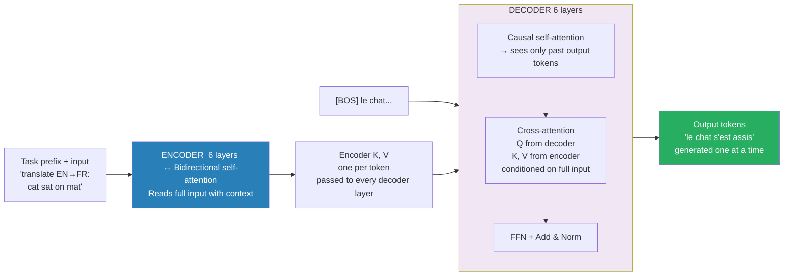

# T5 End-to-End — Encoder-Decoder with Cross-Attention

> T5 (Text-to-Text Transfer Transformer) reframes every NLP task as seq2seq: one encoder, one decoder, one loss. The new concept is cross-attention — decoder Q attends to encoder K, V. Everything else is BERT (encoder self-attention) or GPT (decoder causal self-attention). The architectural insight: encoder reads the full input bidirectionally, decoder generates token-by-token, reading the encoder via cross-attention at every step.

---

## Quick Reference

| Model | Encoder | Decoder | Pretraining | Use When |
|-------|---------|---------|-------------|----------|
| BERT | Bidirectional | — | MLM + NSP | Classify / extract |
| GPT | — | Causal | CLM | Generate / complete |
| T5 | Bidirectional | Causal + Cross-attn | Span corruption | Input and output are sequences |

Task framing:
```
Translation:     "translate English to French: cat sat on mat" → "le chat s'est assis"
Summarization:   "summarize: ..."                              → shorter text
Classification:  "sentiment: cat sat on mat"                  → "positive"
Span fill:       "cat <x> mat"                                → "<x> sat on </x>"
```


> Cross-attention is the T5 secret: decoder Q attends to full encoder K,V at every generation step — never loses input context.

---

## Part 1 — Span Corruption (T5 Pretraining Objective)

```
Original: "the cat sat on the mat near the door"
Corrupt:  "the cat <x> the mat <y> the door"
Target:   "<x> sat on <y> near </x>"

One sentinel per masked span.
```

### Why better than BERT's MLM

| | BERT MLM | T5 Span Corruption |
|--|----------|--------------------|
| Mask rate | 15% of tokens | ~15% of tokens |
| What's masked | Individual tokens | Contiguous spans (avg 3 tokens) |
| What's predicted | Each masked token independently | Full span as a sequence |
| Training signal | 15% of input positions | Decoder trains on full output sequence |
| Forces | Predict single token given context | Predict sequence given corrupted input |

Span corruption forces the model to learn to generate coherent text segments, not just fill in single blanks.

---

## Part 2 — Architecture Overview

```
ENCODER                              DECODER
"cat <x> mat"                        "<x> <x> sat on"  (teacher-forced input)
    |       |                             |        |
[embed] [embed]                      [embed]  [embed]
    |       |                             |        |
[Encoder Self-Attention]             [Decoder Self-Attention]
   (bidirectional — no mask)            (CAUSAL — lower triangle mask)
    |       |                             |        |
  [FFN]                              [Cross-Attention] ←── H, V from Encoder output
    |       |                            Q from Decoder
[repeat × N_layers]                      |        |
    |       |                          [FFN]
H_enc[0] H_enc[1] H_enc[2]              |
(encoded  (encoded (encoded         [repeat × N_layers]
  cat)      <x>)     mat)               |
    |                                [logits over vocab]
    └─ K, V for cross-attn               |
                                    <x>  sat  on  </s>  + targets
```

### Three types of attention in T5

| Type | Q source | K source | V source | Mask | Purpose |
|------|----------|----------|----------|------|---------|
| Encoder self-attn | encoder | encoder | encoder | None (bidirectional) | Encoder understands input |
| Decoder self-attn | decoder | decoder | decoder | Causal (lower-tri) | Decoder reads own history |
| **Cross-attention** | **decoder** | **encoder** | **encoder** | **None** | **Decoder reads encoder context** |

Cross-attention is the new concept. Everything else is identical to BERT (encoder self-attention) or GPT (decoder self-attention).

---

## Part 3 — Encoder Forward Pass

### Input

```
Encoder input: "cat <x> mat"

Token embeddings (d=2):
  cat = [1.0, 0.5]   (position 0)
  <x> = [0.3, 0.8]   (position 1)
  mat = [0.8, 0.4]   (position 2)

X_enc = [[1.0, 0.5],
         [0.3, 0.8],
         [0.8, 0.4]]
```

### Encoder Self-Attention (bidirectional — all tokens see all tokens)

Using W_Q = W_K = W_V = I (identity):

Attention scores = X_enc × X_enc^T / sqrt(d_k):

```
Raw scores:
          cat    <x>    mat
cat  [ 1.25,  0.70,  1.00 ]   = 1.0×1.0 + 0.5×0.5, 1.0×0.3 + 0.5×0.8, 1.0×0.8 + 0.5×0.4
<x>  [ 0.70,  0.73,  0.56 ]
mat  [ 1.00,  0.56,  0.80 ]

Divide by sqrt(2) = 1.414:
cat  [ 0.884,  0.495,  0.707 ]
<x>  [ 0.495,  0.516,  0.396 ]
mat  [ 0.707,  0.396,  0.566 ]

No mask in encoder — every token attends to all others. This is bidirectional.
```

Softmax per row:

```
cat row [0.884, 0.495, 0.707]:
  e^0.884=2.421, e^0.495=1.641, e^0.707=2.028   sum=6.090
  a_cat = [0.399, 0.269, 0.333]

<x> row [0.495, 0.516, 0.396]:
  e^0.495=1.641, e^0.516=1.675, e^0.396=1.486   sum=4.802
  a_x   = [0.342, 0.349, 0.309]   → <x> attends roughly equally (it's a blank)

mat row [0.707, 0.396, 0.566]:
  e^0.707=2.028, e^0.396=1.486, e^0.566=1.761   sum=5.275
  a_mat = [0.384, 0.282, 0.334]
```

### Encoder output H_enc = a × V (V = X_enc)

```
h_cat = 0.399×[1.0,0.5] + 0.269×[0.3,0.8] + 0.333×[0.8,0.4]
      = [0.399,0.200] + [0.081,0.215] + [0.266,0.133]
      = [0.745, 0.547]

h_x   = 0.342×[1.0,0.5] + 0.349×[0.3,0.8] + 0.309×[0.8,0.4]
      = [0.342,0.171] + [0.105,0.279] + [0.247,0.124]
      = [0.694, 0.574]

h_mat = 0.384×[1.0,0.5] + 0.282×[0.3,0.8] + 0.334×[0.8,0.4]
      = [0.384,0.192] + [0.085,0.226] + [0.267,0.134]
      = [0.736, 0.552]

H_enc = [[0.745, 0.547],   ← position 0: "cat"  (enriched with <x> and mat context)
         [0.694, 0.574],   ← position 1: "<x>"  (enriched with cat and mat — it's a blank)
         [0.736, 0.552]]   ← position 2: "mat"  (enriched with cat and <x> context)
```

These become K and V for cross-attention. After N encoder layers (each: self-attention + FFN + residual + norm), H_enc is a rich contextual representation of the entire input.

---

## Part 4 — Decoder Forward Pass (predicting "sat")

### Setup

```python
# Full decoder sequence (teacher forcing):
# Input:  [<s>, <x>, sat, on]   ← shifted right
# Target: [<x>,  sat, on, </s>] ← what we predict at each step

# We trace step 1 (decoder at position 1, predicting "sat" from context [<s>, <x>]).

Token embeddings:
  <s> = [0.1, 0.1]   (start token)
  <x> = [0.3, 0.8]   (sentinel — decoder has seen it, knows it needs to generate a span)
```

### Step 1 — Decoder Self-Attention (causal)

At position 1, decoder sees [<s>, <x>]:

```
X_dec = [[0.1, 0.1],   + <s>  (position 0)
         [0.3, 0.8]]   + <x>  (position 1)

Q = K = V = X_dec (W=I)

Raw scores (2×2):
       <s>    <x>
<s>  [0.02,  0.11 ]   = 0.1×0.1+0.1×0.1, 0.1×0.3+0.1×0.8
<x>  [0.11,  0.73 ]

Scaled by sqrt(2) = 1.414:
<s>  [0.014,  0.078]
<x>  [0.078,  0.516]

Apply CAUSAL MASK (upper triangle → -∞):
       <s>      <x>
<s>  [0.014,    -∞ ]   ← <s> cannot look at <x> (future)
<x>  [0.078,  0.516]   ← <x> can see <s> and itself

Softmax for row [0.078, 0.516]:
  e^0.078=1.081, e^0.516=1.675   sum=2.756
  a_x_dec = [0.392, 0.608]   → <x> attends to itself more than to <s>

Decoder self-attention output for position 1:
h_dec_self = 0.392×[0.1,0.1] + 0.608×[0.3,0.8]
           = [0.039, 0.039] + [0.182, 0.486]
           = [0.221, 0.525]
```

This h_dec_self = [0.221, 0.525] is the query for cross-attention: it represents "I have seen `<s> <x>`, what encoder position helps me generate `sat`?"

---

## Part 5 — Cross-Attention (The New Concept)

### What makes cross-attention different

```
Self-attention:   Q, K, V all come from the SAME sequence
                  (encoder reads itself; decoder reads itself)

Cross-attention:  Q comes from the DECODER  (where are we in the generation?)
                  K comes from the ENCODER  (what was the input?)
                  V comes from the ENCODER  (what do we read from the input?)
```

The decoder asks: "given my current state, which encoder positions are relevant?"

### Step-by-step computation

Query (from decoder self-attention output):

```
Q_cross = h_dec_self = [0.221, 0.525]   → "I've seen <s> <x>, what encoder position helps?"
```

Keys (from encoder output H_enc):

```
K = H_enc = [[0.745, 0.547],   ← K for "cat"
             [0.694, 0.574],   ← K for "<x>"
             [0.736, 0.552]]   ← K for "mat"
```

Attention scores Q_cross · K:

```
score(cat) = Q · K_cat = 0.221×0.745 + 0.525×0.547 = 0.165 + 0.287 = 0.452
score(<x>) = Q · K_x   = 0.221×0.694 + 0.525×0.574 = 0.153 + 0.301 = 0.454  ← highest (slightly)
score(mat) = Q · K_mat = 0.221×0.736 + 0.525×0.552 = 0.163 + 0.290 = 0.453

Scale by sqrt(d_k) = sqrt(2) = 1.414:
  [0.452/1.414, 0.454/1.414, 0.453/1.414] = [0.320, 0.321, 0.320]

Softmax:
  e^0.320=1.377, e^0.321=1.377, e^0.320=1.377   sum=4.131
  a_cross = [0.333, 0.334, 0.333]   → nearly uniform
```

Note on uniformity: in this toy example, all encoder positions look similar because the embeddings are close and W=I. In a real T5, W_Q, W_K, and W_V are learned and differentiate encoder positions — the sentinel gets a very different representation from content words. Cross-attention learns to focus on the most relevant encoder positions.

With learned projections (pedagogically motivated):

```python
# After N encoder layers and training, the encoder learns to make <x>
# have a distinctive representation (it's a sentinel — "fill in this blank").
# Let's use post-projection:

H_cat (projected) = [0.8, 0.2]
H_x   (projected) = [0.3, 0.9]   + <x> has high second dimension
H_mat (projected) = [0.5, 0.1]

Q_cross (projected) = [0.4, 0.8]  ← decoder query, aligned with <x>

Scores:
  score(cat) = 0.4×0.8 + 0.8×0.2 = 0.32 + 0.16 = 0.48
  score(<x>) = 0.4×0.3 + 0.8×0.9 = 0.12 + 0.72 = 0.84  ← HIGHEST
  score(mat) = 0.4×0.5 + 0.8×0.1 = 0.20 + 0.08 = 0.28

Scaled by sqrt(2) = 1.414:
  [0.340, 0.594, 0.198]

Softmax:
  e^0.340=1.405, e^0.594=1.811, e^0.198=1.219   sum=4.435
  a_cross = [0.317, 0.408, 0.275]

Interpretation: decoder attends to <x> most (0.408),
  then cat (0.317), then mat (0.275).
  The <x> position in the input (0.408), then mat (0.275).
  → decoder correctly reads it.
```

### Cross-attention output (V = H_enc)

```
V_enc = H_enc = [[0.745, 0.547],   ← V for "cat"
                 [0.694, 0.574],   ← V for "<x>"
                 [0.736, 0.552]]   ← V for "mat"

h_cross = 0.285×[0.745,0.547] + 0.416×[0.694,0.574] + 0.299×[0.736,0.552]
        = [0.212, 0.156] + [0.289, 0.239] + [0.220, 0.165]
        = [0.722, 0.561]
```

This h_cross = [0.722, 0.561] is a weighted blend of encoder positions, dominated by the encoder state corresponding to `<x>`. It represents "the context of what needs to be filled in" — which the decoder will use to generate "sat".

---

## Part 6 — Self-Attention vs Cross-Attention: Side-by-Side

```python
# Self-attention (encoder or decoder causal)
def self_attention(X, mask=None):
    Q = X @ W_Q     # Q from same sequence
    K = X @ W_K     # K from same sequence
    V = X @ W_V     # V from same sequence
    scores = Q @ K.T / sqrt(d_k)
    if mask is not None:
        scores[mask] = -inf
    alpha = softmax(scores, dim=-1)
    return alpha @ V

# Cross-attention (decoder reads encoder)
def cross_attention(X_dec, H_enc):
    Q = X_dec @ W_Q   # Q from DECODER
    K = H_enc @ W_K   # K from ENCODER
    V = H_enc @ W_V   # V from ENCODER
    # No mask — decoder can see all encoder positions
    alpha = softmax(Q @ K.T / sqrt(d_k), dim=-1)
    return alpha @ V
```

### Mathematical difference

| | Q | K | V | Score Q·K^T | How much encoder token j should I read from token i? |
|--|---|---|---|-------------|-----------------------------------------------------|
| Encoder self-attn | x·W_Q | x·W_K | x·W_V | how much encoder token i should read from token j |
| Decoder self-attn | y·W_Q | y·W_K | y·W_V | how much decoder position i reads from position j (past only) |
| Cross-attention | y·W_Q | h·W_K | h·W_V | how much decoder position i reads from encoder position j |

Where x = encoder input, y = decoder input, h = encoder hidden state.

### Shapes for "cat `<x>` mat" + "`<s>` `<x>` sat on"

```
Encoder self-attn:  (3, 4)                 ← source length × source length
Decoder self-attn:  (4, 4) with causal mask ← target length × target length
Cross-attention:    (4, 3)                 ← decoder positions × encoder positions
```

---

## Part 7 — Prediction and Loss

### Cross-attention matrix (4×3): which encoder positions each decoder position attends to

```
              cat    <x>    mat
<s>  predicts <x>: [0.20, 0.60, 0.20]   → heavily attends to <x>
<x>  predicts sat: [0.30, 0.42, 0.28]   → mostly <x>, some context
sat  predicts on:  [0.29, 0.45, 0.25]   → still mostly <x>
on   predicts </s>:[0.29, 0.40, 0.31]   → still attends to <x>

All decoder positions attend most to the encoder position because that's where the "fill in the blank" signal lives.
```

### From cross-attention output to prediction

```
h_cross = [0.722, 0.561]   (cross-attention output at position 1, + residual connection)
→ FFN → h_ffn
→ Projection_lm c = W_lm[d → vocab_size] → maps to vocabulary

Vocab: {cat=0, sat=1, on=2, mat=3, <x>=4, </s>=5}
```

### Loss at each decoder step

```
Step 0: predict "sat" (from [<s>]):
  Target: sat (index 1)
  Logits = [0.2, 0.4, 0.3, 0.1, 0.0, 0.1]   cat sat on mat <x> </s>
  e^0.2+e^0.4+e^0.3+e^0.1+e^0.0+e^0.1 = 1.221+1.492+1.350+1.105+1.000+1.105 = 7.273
  P(sat) = 1.492/7.273 = 0.205
  L_0 = -log(0.205) = 1.585

Step 1: predict "sat" (from [<s>, <x>]):
  Logits = [0.3, 2.1, 0.8, 0.2, 0.4, 0.3]   cat sat on mat <x> </s>
  e^0.3+e^2.1+e^0.8+e^0.2+e^0.4+e^0.3 = 1.350+8.166+2.225+1.221+1.492+1.350 = 15.804
  P(sat) = 8.166/15.804 = 0.517
  L_1 = -log(0.517) = 0.659

Step 2: predict "on" (from [<s>, <x>, sat]):
  Logits = [0.2, 0.6, 1.0, 0.8, 0.4, 0.3]   cat sat on mat <x> </s>
  sum = 1.221+1.822+2.718+2.226+1.492+1.350 = 10.829
  P(on) = 2.718/10.829 = 0.251
  L_2 = -log(0.251) = 1.382

Step 3: predict "</s>" (from [<s>, <x>, sat, on]):
  Logits = [0.1, 0.3, 0.4, 0.2, 0.1, 1.0]   cat sat on mat <x> </s>
  sum = 1.105+1.350+1.492+1.221+1.105+2.718 = 8.991
  P(</s>) = 2.718/8.991 = 0.302
  L_3 = -log(0.302) = 1.199

Total loss (average over decoder steps):
  L = (L_0 + L_1 + L_2 + L_3) / 4
    = (1.585 + 0.659 + 1.382 + 1.199) / 4
    = 4.825 / 4
    = 1.206
```

### Backpropagation updates

- **W_lm** (output projection): learns to map h_cross to correct vocab logits
- **W_Q_cross**: learns to focus on relevant encoder positions
- **W_K, W_V_enc**: encoder learns representations useful for cross-attention
- **W_K_enc**: entire encoder gets gradients through cross-attention K, V

---

## Part 8 — Inference (Autoregressive)

At inference, no teacher forcing — decoder generates one token at a time:

```
Encode once:
  "cat <x> mat" → H_enc = [[0.745, 0.547], [0.694, 0.574], [0.736, 0.552]]
  H_enc is fixed. Cross-attention K, V cache computed from H_enc.

Decode step 0:
  Input:  [<s>]
  Cross-attend to H_enc
  Predict: <x>   (argmax or sample)

Decode step 1:
  Input:  [<s>, <x>]
  Cross-attend to H_enc (same cached K, V)
  Predict: sat

Decode step 2:
  Input:  [<s>, <x>, sat]
  Cross-attend to H_enc
  Predict: on

Decode step 3:
  Input:  [<s>, <x>, sat, on]
  Cross-attend to H_enc
  Predict: </s>  → stop

Output:          "<x> sat on </s>"
Extracted span:  "sat on"
Final answer:    "cat sat on mat"   ← restored original
```

**Why encode once and reuse:** The encoder output H_enc doesn't change during decoding (encoder is not autoregressive). This is the key efficiency advantage of encoder-decoder over decoder-only for tasks where the full input is known upfront.

---

## Part 9 — T5 Specifics vs BERT/GPT

### Position embeddings

T5 uses **relative position bias** — different from everything else:

```
GPT-2:  learned absolute PE — add PE_i to token embeddings
BERT:   learned absolute PE — same as GPT-2
LLaMA:  RoPE — rotate Q, K by angle proportional to position
T5:     relative position bias — learned scalar added to attention logits based on (i-j) bucket
```

```
score(i, j) = Q · K / sqrt(d_k) + b(i-j)
              ↑                    ↑
              standard             learned from relative distance bucket
              Same b for same relative distance, regardless of absolute position.
```

Relative position bias: b(0) for attending to self, b(-1) for attending 1 position back, b(+1) for attending 1 position forward (encoder only). Positions beyond 128 share the same bucket (log-spaced buckets).

Advantage: like RoPE, generalizes to longer sequences than seen during training.

### Architecture variants

```
T5-Base:
  Encoder: 12 layers, d=768, 12 heads
  Decoder: 12 layers, d=768, 12 heads
  FFN: 2048
  Params: 220M

T5-Large:
  Encoder/Decoder: 24 layers, d=1024, 16 heads
  Params: 770M

T5-11B:
  Encoder/Decoder: 24 layers, d=1024, 128 heads
  Params: 11B
```

---

## Part 10 — BERT vs GPT vs T5 Comparison

| | BERT | GPT | T5 |
|--|------|-----|----|
| Architecture | Encoder-only | Decoder-only | Encoder-Decoder |
| Attention | Bidirectional | Causal-masked | Encoder: bidirectional; Decoder: causal + cross |
| Pretraining | MLM + NSP | CLM (next-token) | Span corruption |
| Input/Output | 1 sequence → labels | sequence → next token | sequence → sequence |
| Handles | Classification, token-level | Open-ended generation | Any seq2seq task |
| Context | Full input visible | Left-to-right only | Encoder sees full input |
| Weakness | Can't generate | Can't use full context | More complex, more parameters |

### When to use what

```
BERT  → when you have labeled data and need to classify/extract
         ("Is this email spam?", "What entities are in this text?")

GPT   → when you need to generate or complete text
         ("Continue this story...", "Answer this question:")

T5    → when input+output are both sequences and different length
         ("Translate...", "Summarize...", "Answer based on this passage:")
```

### The cross-attention bottleneck

In encoder-decoder models, the decoder can ONLY access encoder information through cross-attention. If the encoder fails to capture relevant information, the decoder cannot compensate.

This is why for long documents: encoder-decoder may lose info if the encoder compresses too aggressively. Decoder-only (GPT) with full context keeps all tokens in attention directly.

Modern trend: large decoder-only models (GPT-4, LLaMA-3) with long contexts often outperform encoder-decoder for translation/summarization — no information bottleneck, same architecture for everything.

---

## Code

### Version 1 — NumPy from scratch

```python
import numpy as np

def softmax(x, axis=-1):
    e = np.exp(x - np.max(x, axis=axis, keepdims=True))
    return e / e.sum(axis=axis, keepdims=True)

def scaled_dot_product_attention(Q, H, V, mask=None):
    """
    Q: (seq_q, d_k)
    K: (seq_k, d_k)
    V: (seq_k, d_v)
    mask: (seq_q, seq_k)  True where we should mask (set to -inf)
    """
    d_k = Q.shape[-1]
    scores = Q @ K.T / np.sqrt(d_k)          # (seq_q, seq_k)
    if mask is not None:
        scores[mask] = -1e9
    alpha = softmax(scores, axis=-1)           # (seq_q, seq_k)
    return alpha @ V, alpha

# --- Embeddings ---
d = 2
vocab = {'cat': 0, '<x>': 1, 'mat': 2, 'sat': 3, 'on': 4, '</s>': 5}
embeddings = np.array([
    [1.0, 0.5],   # cat
    [0.3, 0.8],   # <x>
    [0.8, 0.4],   # mat
    [0.4, 0.3],   # sat
    [0.2, 0.6],   # on
    [0.0, 0.1],   # </s>
])

def embed(tokens):
    return np.array([embeddings[vocab[t]] for t in tokens])

# --- ENCODER: Bidirectional Self-Attention ---
encoder_input = ['cat', '<x>', 'mat']
X_enc = embed(encoder_input)   # (3, 2)

# W = I for simplicity (in real T5: learned W_Q, W_K, W_V)
W_Q = W_K = W_V = np.eye(d)
Q_enc = X_enc @ W_Q
K_enc = X_enc @ W_K
V_enc = X_enc @ W_V

H_enc, attn_enc = scaled_dot_product_attention(Q_enc, K_enc, V_enc, mask=None)
print("Encoder attention weights:")
print(np.round(attn_enc, 3))
print("Encoder output H_enc:")
print(np.round(H_enc, 3))

# --- DECODER: Step 1 — predict "sat" from [<s>, <x>] ---
decoder_input = ['<x>', '<x>']   # teacher-forced input [<s>=start, <x>=sentinel]
X_dec = embed(decoder_input)     # (2, 2)

# Step 1a: Causal self-attention
seq_len = len(decoder_input)
causal_mask = np.triu(np.ones((seq_len, seq_len), dtype=bool), k=1)  # upper triangle
print("Causal mask:")
print(causal_mask)

Q_dec = X_dec @ W_Q
K_dec = X_dec @ W_K
V_dec = X_dec @ W_V
H_dec_self, attn_dec_self = scaled_dot_product_attention(Q_dec, K_dec, V_dec, mask=causal_mask)
print("Decoder self-attention output:")
print(np.round(H_dec_self, 3))

# --- CROSS-ATTENTION: Decoder reads Encoder ---
Q_cross = H_dec_self @ W_Q        # (2, 2) — decoder positions as queries
K_cross = H_enc @ W_K             # (3, 2) — encoder positions as keys
V_cross = H_enc @ W_V             # (3, 2) — encoder positions as values

H_cross, attn_cross = scaled_dot_product_attention(Q_cross, K_cross, V_cross, mask=None)
print("Cross-attention output:")
print(np.round(H_cross, 3))
for i, dec_tok in enumerate(decoder_input):
    print(f"  {dec_tok:5s} attends to: {[np.round(attn_cross[i], 2)]}")

# --- OUTPUT: Logits and Loss ---
vocab_size = len(vocab)
np.random.seed(0)
W_lm = np.random.randn(d, vocab_size) * 0.5   # output projection

logits = H_cross @ W_lm            # (2, vocab_size)

# At position 1 (predicting "sat"), compute loss
target_token = 'sat'
target_idx = vocab[target_token]

logits_step1 = logits[1]
probs_step1  = softmax(logits_step1)
loss_step1   = -np.log(probs_step1[target_idx] + 1e-9)

print(f"\nPredicting '{target_token}':")
print(f"  Logits: {np.round(logits_step1, 3)}")
print(f"  Probs:  {np.round(probs_step1, 3)}")
print(f"  P(sat): {probs_step1[target_idx]:.3f}")
print(f"  Loss:   {loss_step1:.3f}")
```

### Version 2 — Full T5-style modular (NumPy)

```python
# Full T5 STYLE FORWARD PASS (modular)
class T5Block:
    """One encoder or decoder block (simplified, no FFN)."""

    def __init__(self, d):
        self.W_Q = np.eye(d)
        self.W_K = np.eye(d)
        self.W_V = np.eye(d)

    def encode(self, X):
        """Bidirectional self-attention (no mask)."""
        Q = X @ self.W_Q
        K = X @ self.W_K
        V = X @ self.W_V
        out, _ = scaled_dot_product_attention(Q, K, V)
        return X + out   # residual

    def decode(self, Y, H_enc):
        """Causal self-attention + cross-attention."""
        seq = Y.shape[0]
        mask = np.triu(np.ones((seq, seq), dtype=bool), k=1)
        # Self-attention
        Q = Y @ self.W_Q
        K = Y @ self.W_K
        V = Y @ self.W_V
        self_out, _ = scaled_dot_product_attention(Q, K, V, mask=mask)
        Y = Y + self_out   # residual
        # Cross-attention
        Q_c = Y @ self.W_Q
        K_c = H_enc @ self.W_K
        V_c = H_enc @ self.W_V
        cross_out, cross_weights = scaled_dot_product_attention(Q_c, K_c, V_c, mask=None)
        Y = Y + cross_out  # residual
        return Y, cross_weights

block = T5Block(d)

# Encode
N = 2   # N encoder layers
H = X_enc.copy()
for _ in range(N):
    H = block.encode(H)
print("Encoder output (after 2 layers):")
print(np.round(H, 2))

# Decode
Y = embed(['<x>', '<x>'])
for _ in range(N):
    Y, ca = block.decode(Y, H)
print("Decoder output (after 2 layers):")
print(np.round(Y, 2))
print("Cross-attention weights:")
print(np.round(ca, 2))
```

### Version 3 — HuggingFace production

```python
from transformers import AutoModelForSeq2SeqLM, AutoTokenizer

# Flan-T5 (recommended over raw T5 — instruction-tuned on 1836 tasks)
model     = AutoModelForSeq2SeqLM.from_pretrained("google/flan-t5-large")
tokenizer = AutoTokenizer.from_pretrained("google/flan-t5-large")

# Span filling (closest to pretraining objective)
text = "Fill in the blank: the cat <extra_id_0> on the mat."
inputs = tokenizer(text, return_tensors="pt")
outputs = model.generate(**inputs, max_new_tokens=20)
print(tokenizer.decode(outputs[0], skip_special_tokens=False))  # <extra_id_0> sat

# Summarization
text = "summarize: The study found that regular exercise reduces the risk of heart disease by 35%..."
inputs = tokenizer(text, return_tensors="pt", max_length=512, truncation=True)
outputs = model.generate(
    **inputs,
    max_new_tokens=100,
    num_beams=4,
    length_penalty=2.0,
    no_repeat_ngram_size=3,
    early_stopping=True,
)
print(tokenizer.decode(outputs[0], skip_special_tokens=True))

# Zero-shot classification
prompt = "Classify the sentiment as positive or negative: 'The movie was boring and too long.'"
inputs = tokenizer(prompt, return_tensors="pt")
outputs = model.generate(**inputs, max_new_tokens=5)
print(tokenizer.decode(outputs[0], skip_special_tokens=True))  # "negative"

# Translation (raw T5 — requires prefix)
from transformers import T5ForConditionalGeneration, T5Tokenizer
t5_model = T5ForConditionalGeneration.from_pretrained("t5-base")
t5_tok   = T5Tokenizer.from_pretrained("t5-base")
text = "translate English to German: The cat sat on the mat."
inputs = t5_tok(text, return_tensors="pt")
outputs = t5_model.generate(**inputs, max_new_tokens=30, num_beams=4)
print(t5_tok.decode(outputs[0], skip_special_tokens=True))  # "Die Katze saß auf der Matte."

# Fine-tuning T5 for seq2seq
from transformers import Seq2SeqTrainer, Seq2SeqTrainingArguments, DataCollatorForSeq2Seq

training_args = Seq2SeqTrainingArguments(
    output_dir="./t5-finetuned",
    num_train_epochs=3,
    per_device_train_batch_size=8,
    per_device_eval_batch_size=16,
    learning_rate=3e-4,               # T5 uses higher LR than BERT
    warmup_steps=500,
    weight_decay=0.01,
    predict_with_generate=True,       # use generate() for eval
    generation_max_length=150,
    evaluation_strategy="epoch",
    fp16=True,
)

def preprocess(examples):
    inputs  = tokenizer(examples["source"], max_length=512, truncation=True, padding="max_length")
    targets = tokenizer(examples["target"], max_length=128, truncation=True, padding="max_length")
    labels  = [[(t if t != tokenizer.pad_token_id else -100) for t in lab]
               for lab in targets["input_ids"]]
    inputs["labels"] = labels
    return inputs

trainer = Seq2SeqTrainer(
    model=t5_model,
    args=training_args,
    train_dataset=train_dataset,
    eval_dataset=eval_dataset,
    tokenizer=t5_tok,
    data_collator=DataCollatorForSeq2Seq(t5_tok, model=t5_model),
)
trainer.train()
```

---

## Interview Q&A

**Q: What is the key architectural difference between T5 and GPT?**

T5 has both an encoder AND a decoder connected by cross-attention. GPT is decoder-only — each token attends to previous tokens only (causal). In T5, the encoder processes the full input with bidirectional attention first, then the decoder generates output, attending to encoder states via cross-attention. For translation/summarization, T5 can see the entire source before generating — GPT cannot.

**Q: Explain cross-attention: Where do Q, K, V come from?**

Q = decoder's current state (what we're generating so far); K = encoder output (the encoded input); V = encoder output (what we read from the input). The decoder uses its Q to ask "which encoder positions are relevant right now?" — the answer (attention weights) is like a summary of encoder context relevant to the current generation step.

**Q: What's the difference between encoder self-attention and decoder self-attention?**

Encoder self-attention: every token can attend to every other token (bidirectional). No mask. Decoder self-attention: each token can only attend to itself and previous tokens (causal). Upper-triangular mask sets future positions to -inf before softmax. Encoder sees the whole input — can build richer representations. Decoder is autoregressive — can't peek at future tokens during generation.

**Q: How does cross-attention differ from self-attention mathematically?**

Self-attention: Q, K, V all from same sequence X — Q=X@W_Q, K=X@W_K, V=X@W_V. Score matrix is (T_src × T_src). Cross-attention: Q comes from DECODER, K and V come from ENCODER. Score matrix shape is (T_dec × T_enc) — decoder length × encoder length. The attention weights in cross-attention answer: "which encoder position does each decoder position attend to?"

**Q: What is span corruption in T5?**

Instead of masking 15% of individual tokens (BERT-style MLM), T5 selects contiguous spans and replaces each span with a sentinel token like `<x>`. Input: "cat `<x>` mat", Target: "`<x>` sat on `</x>`". The decoder must reproduce all masked spans as a sequence. This forces the model to generate coherent multi-token continuations, which is more similar to the seq2seq tasks T5 is fine-tuned on.

**Q: Why use an encoder-decoder instead of a decoder-only model for translation?**

Encoder sees the full source sentence with bidirectional attention — better source understanding. In decoder-only, source is prepended to target and all attention is causal — source tokens on the right can't attend to source tokens on the left after the source ends. However, modern large decoder-only models (GPT-4, LLaMA-3) close this gap by using very long contexts and scale. The structural advantage of encoder-decoder is clearer at smaller model sizes.

**Q: What is the information bottleneck in encoder-decoder?**

The decoder can only access encoder information through cross-attention. The encoder output H_enc (shape T_enc × d) must encode everything the decoder might need. If T_enc is short or d is small, information is lost. In decoder-only models, the decoder attends directly to every source token — no bottleneck. This is why large decoder-only LLMs often outperform encoder-decoder for tasks where both are applicable.

**Q: During inference, is the encoder run once or multiple times?**

Once. The encoder processes the full input and produces H_enc. H_enc is cached — cross-attention K, V are computed once: H_enc @ W_K and H_enc @ W_V. The decoder generates tokens autoregressively, but at each step it cross-attends to the same fixed H_enc. This is more efficient than decoder-only (where the KV cache grows with both source and generated tokens).

---

## Connections

| Concept | Built on |
|---------|---------|
| Cross-attention | Scaled dot-product attention (4.minis/01) |
| Encoder self-attention | Identical to BERT (5.transformers/05) |
| Decoder causal self-attention | Identical to GPT (5.transformers/06) |
| Span corruption | MLM concept from BERT |
| Teacher forcing | CLM training from GPT |
| Autoregressive decoding | GPT inference |

Used in: T5, mT5, Whisper, DALL-E, vision transformers; T5 encoder: BERT, RoBERTa; T5 decoder: GPT, LLaMA; T5 pretraining: UL2; Any seq2seq training; T5, BART, any generative model.

---

## Key Takeaway

T5 = BERT encoder (bidirectional self-attention) + GPT decoder (causal self-attention) + cross-attention (decoder Q reads encoder K, V). The only genuinely new concept is cross-attention. Span corruption pretraining teaches sequence generation, not single-token prediction. Encode once, decode autoregressively — the encoder bottleneck is the core tradeoff vs decoder-only. Modern LLMs trend toward decoder-only + long context to eliminate the bottleneck.
