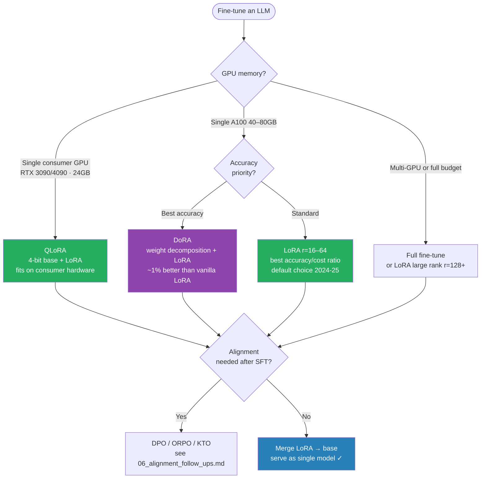

# Parameter-Efficient Fine-Tuning (PEFT)

> Why it matters: Fine-tuning a 7B LLM with full gradients needs 4× model size in optimizer states (~112GB). LoRA does the same with ~1% of parameters and fits on a single GPU.

---

## The Problem with Full Fine-Tuning

```
GPT-3 (175B params):
  FP32 weights:      700 GB
  Gradients:         700 GB
  Adam optimizer:  1,400 GB (m + v moments)
  Total VRAM needed: 2,800 GB  ← impossible on any single machine

LLaMA-7B:
  FP16 weights:    14 GB
  FP32 gradients:  28 GB
  Adam states:     56 GB
  Total VRAM needed: 98 GB   ← needs 2+ A100 80GB

With LoRA (r=16):
  Trainable params: ~40M of 7B = 0.57%
  Extra VRAM:       ~0.3 GB
  Total VRAM needed: ~18 GB  ← fits on 1× A100 40GB or 1× RTX 4090
```

---

## Which PEFT to Use



## LoRA — Low-Rank Adaptation

**Paper:** "LoRA: Low-Rank Adaptation of Large Language Models" (Hu et al., 2021)

### Core Idea

Instead of updating the full weight matrix W ∈ ℝ^(d×k), decompose the update into two small matrices:

```
Full fine-tuning:  W' = W + ΔW        ΔW ∈ ℝ^(d×k) — d×k params
LoRA:              W' = W + B·A        B ∈ ℝ^(d×r),  A ∈ ℝ^(r×k)

r = rank (hyperparameter, typically 4-64)
r << min(d, k)  ← massive parameter reduction

Example: W ∈ ℝ^(4096×4096) (query matrix in LLaMA-7B)
  Full ΔW:  4096 × 4096 = 16,777,216 params
  LoRA r=16: A(16×4096) + B(4096×16) = 65,536 + 65,536 = 131,072 params
  Reduction: 131,072 / 16,777,216 = 0.78% → 128× fewer params
```

### Initialization

```
A: initialized with random Gaussian (small values)
B: initialized to zeros

At step 0: B·A = 0 → W' = W + 0 = W (original model unchanged)
Reason: start from pretrained weights exactly, not from a perturbed state
```

### Scaling

```
Output = W×x + (B·A·x) × (α/r)

α = LoRA alpha (hyperparameter, typically = r or 2r)
α/r = scaling factor

Why scale? Prevent updates from being too large relative to frozen weights.
Rule of thumb: set α = r (scaling = 1.0) or α = 2r (scaling = 2.0)
```

### Forward Pass Dry Run

```
Setup: LLaMA-7B attention query projection
  W  ∈ ℝ^(4096×4096)  frozen
  A  ∈ ℝ^(16×4096)    trainable
  B  ∈ ℝ^(4096×16)    trainable
  r=16, α=16 → scaling = α/r = 1.0

Input: x ∈ ℝ^(512×4096)   (512 tokens, 4096 hidden dim)

Step 1 — Frozen path:
  W·x^T  ∈ ℝ^(4096×512)   (standard attention projection)

Step 2 — LoRA path:
  A·x^T  ∈ ℝ^(16×512)     (compress: 4096 → 16 dims)
  B·(Ax^T) ∈ ℝ^(4096×512) (expand: 16 → 4096 dims)
  scale: × (16/16) = × 1.0

Step 3 — Combine:
  output = W·x^T + B·A·x^T
         = frozen_output + lora_delta

Gradient only flows through A and B — W never changes.
```

---

## LoRA Code

```python
import torch
import torch.nn as nn
import math

class LoRALinear(nn.Module):
    def __init__(self, in_features: int, out_features: int,
                 r: int = 16, alpha: int = 16, dropout: float = 0.05):
        super().__init__()
        self.r     = r
        self.alpha = alpha
        self.scale = alpha / r

        # Frozen original weights
        self.weight = nn.Parameter(
            torch.randn(out_features, in_features), requires_grad=False
        )

        # Trainable LoRA matrices
        self.lora_A = nn.Parameter(torch.randn(r, in_features))
        self.lora_B = nn.Parameter(torch.zeros(out_features, r))   # B init to 0
        self.dropout = nn.Dropout(dropout)

        # Initialize A with kaiming uniform (standard for linear layers)
        nn.init.kaiming_uniform_(self.lora_A, a=math.sqrt(5))

    def forward(self, x: torch.Tensor) -> torch.Tensor:
        # Frozen path
        frozen_out = x @ self.weight.T

        # LoRA path
        lora_out = self.dropout(x) @ self.lora_A.T @ self.lora_B.T
        lora_out = lora_out * self.scale

        return frozen_out + lora_out

    def merge_weights(self):
        """Merge LoRA into base weights for deployment (no latency overhead)."""
        self.weight.data += (self.lora_B @ self.lora_A) * self.scale
        self.lora_A.data.zero_()
        self.lora_B.data.zero_()
```

### Which Layers to Apply LoRA To

```python
# Standard: query + value projections in all attention layers
# (key projection less impactful empirically)

from peft import LoraConfig, get_peft_model, TaskType
from transformers import AutoModelForCausalLM

model = AutoModelForCausalLM.from_pretrained(
    "meta-llama/Llama-2-7b-hf",
    torch_dtype=torch.float16,
    device_map="auto",
)

lora_config = LoraConfig(
    task_type=TaskType.CAUSAL_LM,
    r=16,                                   # rank
    lora_alpha=32,                           # scaling = alpha/r = 2.0
    target_modules=["q_proj", "v_proj"],    # which layers to adapt
    lora_dropout=0.05,
    bias="none",                            # don't train biases
    inference_mode=False,
)

model = get_peft_model(model, lora_config)
model.print_trainable_parameters()
# trainable params: 4,194,304 || all params: 6,742,609,920 || trainable%: 0.0622%

# Training — same as standard fine-tuning
from transformers import TrainingArguments, Trainer
training_args = TrainingArguments(
    output_dir="./llama-lora-finetuned",
    num_train_epochs=3,
    per_device_train_batch_size=4,
    gradient_accumulation_steps=4,       # effective batch = 16
    learning_rate=2e-5,                  # higher than full fine-tune (2e-5 typical)
    fp16=True,
    logging_steps=10,
    save_strategy="epoch",
    warmup_ratio=0.05,
)
```

---

## QLoRA — Quantized LoRA

**Paper:** "QLoRA: Efficient Finetuning of Quantized LLMs" (Dettmers et al., 2023)

LoRA still loads the frozen base model in FP16 (14GB for 7B). QLoRA quantizes the base model to 4-bit — 3.5GB, then trains LoRA adapters in BF16.

```
LoRA:  frozen W in FP16 (14GB) + LoRA A,B in FP16 (0.3GB) = 14.3GB
QLoRA: frozen W in NF4 (3.5GB) + LoRA A,B in BF16 (0.3GB) = 3.8GB

Result: fine-tune LLaMA-2-7B on a single 16GB GPU (RTX 3090/4080)
```

### Three Key Innovations in QLoRA

**1. NF4 (Normal Float 4-bit):**

```
Standard INT4: uniform quantization, wastes levels on rare extreme values
NF4: quantization levels placed at percentiles of a standard normal distribution
  → more levels where weights are dense (near 0), fewer at extremes
  → better precision where it matters

NF4 levels (16 values, information-theoretically optimal for normal distributions):
[-1.0, -0.6962, -0.5251, -0.3949, -0.2844, -0.1848, -0.0911, 0.0,
  0.0796, 0.1609, 0.2461, 0.3379, 0.4407, 0.5626, 0.7229, 1.0]
```

**2. Double quantization:**

```
Quantization constants (scale, zero-point) are themselves quantized
Saves ~0.5 bits/parameter → additional 0.375GB saved for 7B model
```

**3. Paged optimizers:**

```
When CPU VRAM fills up during gradient steps, optimizer states page to CPU RAM
Prevents OOM crashes during long fine-tuning runs
```

### QLoRA Code

```python
import torch
from transformers import AutoModelForCausalLM, AutoTokenizer, BitsAndBytesConfig
from peft import LoraConfig, get_peft_model, prepare_model_for_kbit_training

# 4-bit quantization config
bnb_config = BitsAndBytesConfig(
    load_in_4bit=True,
    bnb_4bit_quant_type="nf4",             # Normal Float 4
    bnb_4bit_compute_dtype=torch.bfloat16, # compute in BF16, store in NF4
    bnb_4bit_use_double_quant=True,        # double quantization
)

# Load base model in 4-bit
model = AutoModelForCausalLM.from_pretrained(
    "meta-llama/Llama-2-7b-hf",
    quantization_config=bnb_config,
    device_map="auto",
)

tokenizer = AutoTokenizer.from_pretrained("meta-llama/Llama-2-7b-hf")

# Prepare for k-bit training
# (adds gradient checkpointing, casts norms to FP32)
model = prepare_model_for_kbit_training(model)

# Add LoRA adapters (same as before)
lora_config = LoraConfig(
    r=64,
    lora_alpha=16,
    target_modules=["q_proj", "v_proj", "k_proj", "o_proj",
                    "gate_proj", "up_proj", "down_proj"],  # all linear layers
    lora_dropout=0.05,
    bias="none",
    task_type="CAUSAL_LM",
)

model = get_peft_model(model, lora_config)
model.print_trainable_parameters()
# trainable params: 167,772,160 || all params: 6,885,269,504 || trainable%: 2.4363%

# Memory usage check
# Base model (NF4):   ~3.5 GB
# LoRA adapters:      ~0.5 GB
# Activations:        ~2.0 GB
# Optimizer states:   ~1.2 GB (only for trainable params)
# Total:              ~7.3 GB  ← Fits on RTX 3090 16GB
```

---

## Modern LoRA Variants (2024)

| Method | Year | Idea | When it wins |
|--------|------|------|-------------|
| **DoRA** (Weight-Decomposed LoRA) | 2024 | Decompose W = m × (V/‖V‖); LoRA updates direction only | Consistently +0.5-1% over LoRA at same rank; especially helpful at low rank (r=4-8) |
| **LoftQ** (LoRA-Fine-Tuning-Aware Quantization) | 2024 | Smarter initialization for QLoRA — minimize ‖W − (Q(W) + BA)‖ jointly | Better starting point when base is 4-bit; closes some of the QLoRA quality gap |
| **PiSSA** (Principal Singular Values & Vectors Adaptation) | 2024 | Initialize A, B from top singular values of W (instead of Gaussian/zero) | Faster convergence; updates the "important" directions first |
| **rsLoRA** (rank-stabilized LoRA) | 2023 | Scale by α/√r instead of α/r | Enables much higher ranks (r=64-256) without LR retuning |
| **LoRA+** | 2024 | Different learning rates for A (init from Gaussian) vs B (init zero) | ~10-30% faster convergence vs vanilla LoRA |
| **VeRA** (Vector-based Random Adaptation) | 2024 | Frozen random A, B; trainable scaling vectors | 10× fewer trainable params than LoRA at same rank |
| **GaLore** | 2024 | Project full gradients into a low-rank subspace; full FT in spirit, LoRA-cost in practice | When you want full fine-tuning quality on consumer GPUs |
| **AdaLoRA** | 2023 | Adaptively allocate rank across layers using importance estimates | When you suspect different layers need different capacity |

```python
# DoRA via peft >= 0.10
from peft import LoraConfig
config = LoraConfig(
    r=16, lora_alpha=32,
    target_modules=["q_proj", "v_proj"],
    use_dora=True,          # the one flag that switches LoRA → DoRA
    lora_dropout=0.05,
    bias="none",
)
```

**Senior interview answer:** "LoRA is still the default — it's the most tested, has the best ecosystem, and merges to zero inference cost. I'd reach for DoRA when I need an extra ~1% at the same rank. LoftQ when I'm starting from a 4-bit base model. PiSSA when training budget is tight. GaLore when I want close-to-full fine-tuning quality on a single GPU. The exotic variants matter less than picking the right target modules and rank."

---

## Prefix Tuning

Instead of adding matrices inside layers, prepend **learnable "soft prompt" tokens** to the input of each layer.

```
Standard: [token1, token2, ..., tokenN] → transformer → output
Prefix:   [p1, p2, ..., pk, token1, ..., tokenN] → transformer → output
           └── k learnable prefix tokens ──┘

The prefix tokens are NOT real words — they're continuous vectors in embedding space,
optimized by gradient descent to steer model behavior.
```

```
Params: k × n_layers × d_model
  k=10 prefix tokens, 12 layers, d=768 → 10 × 12 × 768 = 92,160 params
  vs full fine-tuning: 110M params (BERT-base)
  Reduction: 1200× fewer params

from peft import PrefixTuningConfig, get_peft_model, TaskType
prefix_config = PrefixTuningConfig(
    task_type=TaskType.SEQ_2_SEQ_LM,
    num_virtual_tokens=20,    # k = 20 prefix tokens
    encoder_hidden_size=768,
)
model = get_peft_model(model, prefix_config)
# trainable params: 983,040 (0.09% of T5-base)
```

**Weakness:** Prefix tokens occupy positions in the context window — for models with small context (512 tokens), 20 prefix tokens = 4% overhead. LoRA is generally preferred.

---

## Adapters

Insert small trainable modules (bottleneck MLPs) between transformer layers. Original layers frozen, only adapters trained.

```
Standard transformer layer:
  input → Self-Attention + AddNorm → FFN + AddNorm → output

With adapter:
  input → Self-Attention + AddNorm → [Adapter] → FFN + AddNorm → [Adapter] → output

Adapter architecture:
  x = Linear(d, r) + ReLU + Linear(r, d) + x   (residual)
  r = bottleneck dim (typically 64)

Params: 2 × d × r × 2 = 4 × d × r
  BERT-base: 12 layers × 2 adapters = 24 adapters × 2.36M params
  vs full fine-tuning: 110M params
  Reduction: 46× fewer params
```

### LoRA vs Adapter

```
Adapters add sequential computation (extra forward pass through bottleneck)
LoRA adds parallel computation (added to existing path, can be merged at inference)
  → LoRA has zero inference latency overhead after weight merging
  → Adapters always have a small latency cost
  → LoRA preferred for latency-sensitive production
```

---

## Method Comparison

| Method | Where | Params | Inference overhead | Best for |
|--------|-------|--------|--------------------|----------|
| Full fine-tuning | All layers | 100% | None | Max performance, large GPU budget |
| LoRA | Attention projections | 0.1-1% | None (after merge) | Best accuracy/cost tradeoff |
| QLoRA | Attention (4-bit base) | 0.1-2% | None (after merge) | Single GPU, large models |
| Prefix tuning | Input prefix | <0.1% | Context window cost | Few-shot task adaptation |
| Adapters | Between layers | 0.5-3% | Small sequential cost | Multi-task (swap adapters) |
| Prompt tuning | Input only | <0.01% | Context window cost | Very large models (>10B) only |

---

## Rank Selection Guide

```
r=8:   very few trainable params, works for simple tasks (classification)
       LLaMA-7B: 0.03% params trained

r=16:  standard default, good balance accuracy/memory
       LLaMA-7B: 0.06% params trained

r=64:  better for complex generation tasks, domain adaptation
       LLaMA-7B: 0.24% params trained

r=128: approaching full fine-tuning quality, heavy memory use
       LLaMA-7B: 0.48% params trained

Rule: start with r=16. If underfitting, increase to r=64.
      If VRAM is tight, drop to r=4 or r=8.
```

---

## LoRA Weight Merge (Zero Inference Overhead)

```python
from peft import PeftModel

# Load base + LoRA separately (for flexibility during training)
base_model = AutoModelForCausalLM.from_pretrained("meta-llama/Llama-2-7b-hf")
peft_model = PeftModel.from_pretrained(base_model, "./llama2-lora-finetuned")

# Merge LoRA weights into base model → single model, no adapter overhead
merged_model = peft_model.merge_and_unload()

# Save merged model
merged_model.save_pretrained("./llama2-lora-merged")

# Now serving: load merged_model, predict as if it were the base model
# No LoRA overhead — B·A already added into W
```

---

## Key Numbers

| Model | Full FT VRAM | LoRA r=16 VRAM | QLoRA r=64 VRAM |
|-------|-------------|----------------|-----------------|
| LLaMA-2 7B | ~96 GB | ~28 GB | ~7 GB |
| LLaMA-2 13B | ~180 GB | ~52 GB | ~12 GB |
| LLaMA-2 70B | ~980 GB | ~280 GB | ~48 GB |
| Mistral 7B | ~98 GB | ~28 GB | ~7 GB |

VRAM includes weights + gradients + optimizer states. Assumes Adam optimizer.

---

## Gotchas

**LoRA rank too low for complex tasks.** r=4 may underfit for domain adaptation with large distribution shift. If loss plateaus early, increase r.

**Target modules matter.** Applying LoRA only to q_proj, v_proj (default) is a good start. For domain-heavy tasks, adding k_proj, o_proj, and FFN layers (gate_proj, up_proj, down_proj) significantly improves results. QLoRA paper found all linear layers best.

**Learning rate is higher than full fine-tuning.** Full FT: 1e-5 to 5e-5. LoRA: 1e-4 to 3e-4. The small number of trainable params means gradients are concentrated — you can afford larger steps.

**Merging required for production.** During training: base + adapter (two separate forward paths). At inference: merge B·A into W before deployment. Otherwise you carry adapter overhead permanently.

**QLoRA NF4 is slower to train.** Dequantization from NF4 → BF16 before each forward pass adds ~20% training overhead vs LoRA in FP16. Trade-off: 4× less VRAM.

---

## Interview Q&A

**Q: Explain LoRA in one paragraph.**

LoRA freezes the pretrained model weights and injects trainable rank-decomposition matrices alongside the frozen attention projections. For a weight matrix W ∈ ℝ^(d×k), instead of learning the full ΔW, LoRA learns B ∈ ℝ^(d×r) and A ∈ ℝ^(r×k) where r << min(d,k). The output becomes W×x + B·A·(α/r)×x. B is initialized to zero so training starts from the exact pretrained model. With r=16 on LLaMA-7B, only 0.06% of parameters are trained, reducing VRAM from ~98GB to ~28GB while maintaining near full-fine-tune quality.

**Q: What is the difference between LoRA and QLoRA?**

LoRA freezes base weights in FP16 — total VRAM ~28GB for 7B model. QLoRA freezes base weights to 4-bit NF4 (3.5GB for 7B vs 14GB FP16), while keeping LoRA adapters in BF16. Total VRAM ~7GB for 7B model — fits on RTX 3090. QLoRA introduces 3 innovations: NF4 quantization (percentile-based levels, optimal for normally-distributed weights), double quantization (quantize the quantization constants), and paged optimizers (handle OOM by paging to CPU RAM). Quality is within 1-2% of full LoRA.

**Q: Why does LoRA initialize B to zero?**

At initialization, B·A = 0, so the LoRA adapter contributes nothing to the output — the model starts exactly at the pretrained weights. If A were also zero, there would be no gradient signal. If both were random, the model would start far from the pretrained distribution and training would be unstable. Zero B + random A ensures we start from a known good point (pretrained) and immediately get gradient signal through A.

**Q: When would you use full fine-tuning over LoRA?**

Full fine-tuning when: (1) maximum quality is critical and VRAM budget allows; (2) the task requires major distribution shift (very different domain, format, or language from pretraining); (3) you need to fine-tune the embedding layer (LoRA typically doesn't touch embeddings). LoRA when: (1) VRAM constrained; (2) multiple task adapters needed (swap LoRA adapters per task, shared base model); (3) fast iteration — LoRA trains faster due to fewer params; (4) serving multiple fine-tuned variants from one base model (LoRA-as-a-service).

---

## Connections

- **LLM fine-tuning trace:** `6.llms/82_finetuning_end_to_end.md` — LoRA gradient flow with numbers
- **RLHF:** `6.llms/83_alignment_end_to_end.md` — PPO also uses LoRA in practice
- **Serving optimization:** `10.mlops/18_serving_optimization_end_to_end.md` — merge LoRA before deploy
- **CLIP fine-tuning:** `9.multimodal/04_clip_finetuning_end_to_end.md` — LoRA strategy for vision models

---

## Key Takeaway

LoRA: freeze base weights, learn low-rank update ΔW = B·A (0.1-1% params, ~3× VRAM reduction). QLoRA: NF4 4-bit base + BF16 LoRA adapters (0.1-2% params, ~7× VRAM reduction — 7B model on single RTX 3090). Initialize B=0 so training starts from pretrained weights exactly. Merge B·A into W for zero inference overhead. Default: r=16, α=32, target q_proj + v_proj. For best quality: add all linear layers with r=64.

---

## Code Practice — Wired by Phase 6

- `code_practice/09_llms/06_lora_scratch/` — LoRA from scratch
- `code_practice/09_llms/07_qlora_train/` — QLoRA training on Acme
- `code_practice/09_llms/08_merge_save/` — merge_and_unload + verify
