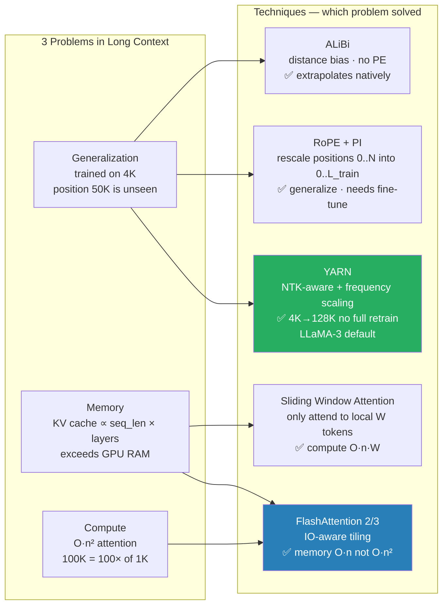

# Long-Context Scaling — RoPE, YARN, ALiBi, Sliding Window

> How modern LLMs handle 100K+ tokens when the model was trained on 4K. The techniques behind Gemini 2M, Claude 200K, GPT-4 128K.

---

## Table of Contents

1. Objective
2. Core concept — why context length is hard
3. Variants / comparison
4. When to use which technique
5. Code / formula
6. Failure modes
7. Interview questions (5)
8. Further reading

---

## 1. Objective

Three independent problems live under "long-context":
1. **Compute** — attention is O(n²); 100K tokens = 100× the compute of 1K tokens.
2. **Memory** — KV cache scales linearly with sequence length; 100K tokens × N layers can exceed GPU memory.
3. **Generalization** — a model trained on 4K positions doesn't natively understand position 50K.

Each technique below attacks one or two of these. Senior interview Q: "Walk me through how Llama-3-8B-Instruct goes from 8K trained → 128K served."

---



## 2. Core concept — why context length is hard

**Generalization is the deepest issue.** A transformer trained on sequence length L learns position embeddings (or rotation frequencies for RoPE) that work well in [0, L]. Run it at position 4L and the position encoding looks like nothing it's seen — outputs degrade catastrophically. You see this empirically: perplexity remains low until exactly the trained context length, then explodes.

The fixes split into three categories:

**A. Re-parametrize position encoding so it extrapolates.** ALiBi (Press 2021): no positional embedding at all; instead, add a *linear* bias to attention scores proportional to token distance. Distant tokens get penalized. Extrapolates naturally to any length.

**B. Re-scale RoPE at inference** (Chen et al. 2023) — squeeze positions 0..N_new into the range 0..N_trained. Token at position 32000 (model was trained on 4096) is treated as if it were at position 32000 × 4096/N_new.

**C. NTK-aware RoPE scaling** — only rescale the LOW frequencies (high-dim pairs); leave the HIGH frequencies alone. Preserves local structure.

**YARN** (Peng et al. 2023) — combines NTK-aware scaling with a "ramp" function that softly transitions. The de-facto standard for 2024-2025 long-context fine-tunes.

**C. Avoid attending to every token.** — **Sliding window attention** (Mistral 7B 2023): each token only attends to the previous W tokens, e.g., W=4096. Memory and compute drop from O(n²) to O(n·W). Information still propagates across windows in deeper layers. — **Sparse attention patterns** (Longformer, BigBird): mix local + global tokens. — **Sink tokens** (StreamingLLM): always attend to the first 1-4 tokens. Combined with sliding window, enables infinite generation.

---

## 3. Variants / Comparison

| Technique | Fixes | Compute | Quality cost | Used in (2024) |
|-----------|-------|---------|-------------|----------------|
| ALiBi | generalization | O(n²) | low; trained from scratch | MPT, BLOOMZ |
| Position Interpolation | generalization | O(n²) | small after fine-tune | Llama-2 32K (Together) |
| NTK-aware RoPE | generalization | O(n²) | minimal | many community Llama variants |
| YARN | generalization | O(n²) | minimal after fine-tune | Llama-3-128K, Qwen2.5 long |
| Sliding window | memory + compute | O(n·W) | local-only context | Mistral-7B (W=4096) |
| Sliding window + sinks | memory + compute | O(n·W) | small | Streaming LLM |
| Sparse attention | memory + compute | O(n·k) | task-dependent | Longformer, BigBird (older) |
| Ring attention | memory across GPUs | O(n²) total, partitioned | none | Gemini long-context training |

**The 2024-2026 production stack:** RoPE + YARN scaling + sliding window in some layers + KV cache. That's how a base model trained at 8K serves at 128K reliably.

---

## 4. When to use which technique

| Situation | Pick |
|-----------|------|
| Training a new model from scratch | RoPE + sliding window (or ALiBi) baked in |
| Fine-tuning to extend context (e.g., 4K → 32K) | YARN or Position Interpolation + continued training on long examples |
| Inference-time hack, no retraining | NTK-aware RoPE scaling — works decently without fine-tune |
| Need infinite/streaming generation | Streaming LLM (sliding window + sink tokens) |
| Need full attention across very long inputs (research) | Ring attention (multi-GPU) |
| Budget-constrained — need speed at length | Sliding window (Mistral approach) |

**Senior signal:** know that YARN = Position Interpolation + NTK-aware + ramp. Many recruiters know this.

---

## 5. Code / formula

### RoPE in one line

```python
# For dim-2k pair, position m:
RoPE[x,m]_2k   = x_m * cos(θ_k * m) - x_{m+1} * sin(θ_k * m)
RoPE[x,m]_2k+1 = x_m * sin(θ_k * m) + x_{m+1} * cos(θ_k * m)
# where θ_k = 10000^(-2k/d)
```

### Position Interpolation

Simply rescale the position before the rotation:

```python
def pi_rope(x, position, scale_factor):
    rescaled_position = position / scale_factor
    return apply_rope(x, rescaled_position)
# scale_factor = N_new / N_trained, e.g., 8 for 4K → 32K
```

### NTK-aware scaling

Adjust the BASE (10000), not the position:

```python
def ntk_aware_rope(x, position, scale_factor, dim):
    base = 10000 * (scale_factor ** (dim / (dim - 2)))
    # Use this base in θ_k = base^(-2k/d)
    return apply_rope_with_base(x, position, base)
```

### Sliding window attention

```python
mask = torch.zeros(n, n)
for i in range(n):
    mask[i, max(0, i-W):i+1] = 1   # only attend to W tokens before + self
```

---

## 6. Failure modes

1. **Forgot to fine-tune after extending context** — Position Interpolation / YARN works much better after a few hundred steps of LM training on long examples. Cold (no fine-tune) gives noisy outputs at extreme lengths.

2. **Sliding window breaks tasks needing global retrieval** — "what's the name mentioned 50K tokens ago?" Sliding window can lose it. Mitigation: sink tokens or attention sinks every K layers.

3. **Lost-in-the-middle** (Liu et al. 2023) — even at trained context, models attend most to the START and END of context. Middle gets ignored. Long-context capability ≠ uniform attention.

4. **KV cache OOM** — extending context to 128K doesn't help if KV cache eats all GPU memory. Pair with quantized KV cache (INT8 K/V) or GQA.

5. **Benchmark-driven illusion** — "needle in haystack" benchmarks impressive but only test single-fact retrieval. Real-world long-context (summarize a 50K-token transcript) is much harder.

---

## 7. Interview questions (5)

**Q1: A model is trained on 4K context but you need 32K. What do you do?**

Fine-tune with YARN (or Position Interpolation + NTK-aware) for 500-1000 steps on long examples. Without YARN, attention degrades smoothly until ~5K and then breaks down.

**Q2: Why doesn't standard RoPE extrapolate beyond trained length?**

Because the rotation frequencies θ_k are tied to specific position values seen during training. At unseen positions, the model's learned attention patterns no longer apply — sinusoidal extrapolation is mathematically defined but doesn't match learned weights.

**Q3: What's the difference between sliding window attention and sparse attention?**

Sliding window is uniform: every token attends to W previous tokens. Sparse attention (Longformer/BigBird) is heterogeneous: most tokens use local + global + random attention patterns, layered for full coverage. Sliding window is simpler and is what Mistral uses; sparse is more flexible but older.

**Q4: What is "lost in the middle" and how do you mitigate?**

LLMs over-attend to start and end of context, ignoring middle. Mitigation: (1) place critical info at the prompt edges, (2) use re-ranking in RAG so most relevant chunks land at the prompt edges, (3) for very long docs, use hierarchical summarization (summarize sections, then summarize summaries).

**Q5: What's YARN and how is it different from Position Interpolation?**

Position Interpolation rescales ALL frequencies uniformly. YARN = NTK-aware (only rescale low frequencies, leave high alone) + a "ramp" smoothing function between the trained range and extended range. YARN preserves local structure better, hence higher quality at extended length.

---

## 8. Further reading

- RoFormer / RoPE (Su et al. 2021) — arXiv:2104.09864
- ALiBi (Press et al. 2021) — "Train short, test long"
- Position Interpolation (Chen et al. 2023) — arXiv:2306.15595
- YARN (Peng et al. 2023) — arXiv:2309.00071
- Lost in the Middle (Liu et al. 2023) — arXiv:2307.03172
- Mistral 7B (Jiang et al. 2023) — sliding window attention in practice
- StreamingLLM (Xiao et al. 2023) — attention sinks for infinite generation

---

## Code Practice — Wired by Phase 6

- `code_practice/02_transformers/04_pos_enc/` — sinusoidal / learned / RoPE comparison
